# 3. 应用回归的多变量消费研究

上一章涵盖了多元线性回归——一种通过应用单个预测变量来预测连续响应变量的模型。在实际情况下，你可能会遇到不止一个预测变量，因此本章介绍了将多个变量恰当地拟合到回归方程中的方法。它应用普通最小二乘回归模型来确定美国社会缴款（现价本币单位）、贷款利率（百分比）以及 GDP（国内生产总值）年度增长百分比的变化是否会影响最终消费支出（现价美元）的变化。

首先，该模型检查数据是否来自正态分布。接着，它应用皮尔逊相关方法来研究变量之间的相关性，然后运用特征矩阵来确定变量间的多重共线性严重程度。随后，它通过应用一种称为*主成分分析*的降维技术将数据降至二维。然后，它将预测变量拟合到回归模型中，以预测美国最终消费支出。最后，它确定了残差的集中趋势和分布，并研究了随着训练数据增加，模型如何学习做出可靠的预测。

## 本章背景

预测变量包括美国社会缴款（现价本币单位）、贷款利率（百分比）和 GDP 增长（年度百分比），响应变量是美国最终消费支出（现价美元）。表 3-1 概述了宏观经济指标并展示了它们的代码。

**表 3-1**  
本章所用美国宏观经济指标

| 代码 | 标题 |
| --- | --- |
| `GC.REV.SOCL.CN` | 美国社会缴款（现价本币单位） |
| `FR.INR.LEND` | 美国贷款利率（百分比） |
| `NY.GDP.MKTP.KD.ZG` | 美国 GDP 增长（年度百分比） |
| `NE.CON.TOTL.CD` | 美国最终消费支出（现价美元） |

### 社会缴款（现价本币单位）

社会缴款是指组织与员工共同缴纳的社会保障费用（参见代码清单 3-1）。其中可能还包括政府为保险而追加的缴款。图 3-1 展示了美国 1971 年至 2021 年的社会缴款情况。

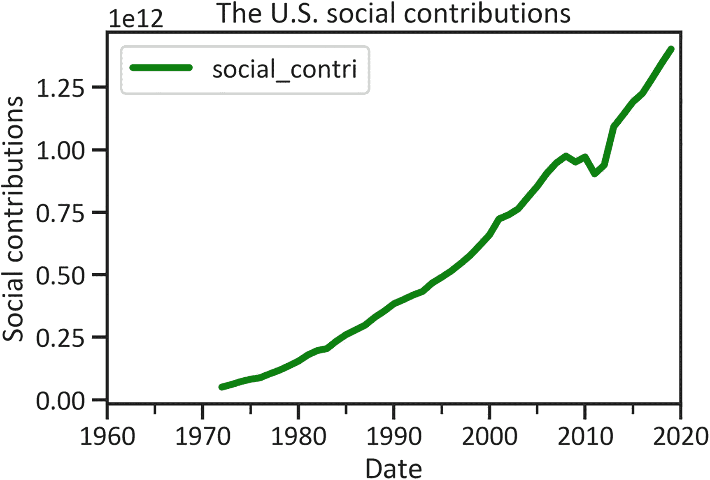

**图 3-1**  
美国社会缴款（现价本币单位）

```
import wbdata
country = ["USA"]
indicator = {"GC.REV.SOCL.CN":"social_contri"}
social_contri = wbdata.get_dataframe(indicator, country=country, convert_date=True)
social_contri.plot(kind="line",color="green",lw=4)
plt.title("The U.S. social contributions")
plt.ylabel("Social contributions")
plt.xlabel("Date")
plt.show()
```

**代码清单 3-1**  
美国社会缴款（现价本币单位）

图 3-1 显示了从 1971 年到 2020 年美国社会缴款数据明显的上升趋势。这表明目前美国的组织与员工对社会保障的缴费比以往任何时候都多。请注意，这些信息并未考虑通货膨胀——该指标并未完全反映这些缴款的实际变化。

### 贷款利率

贷款利率是指金融机构在向客户提供贷款时收取的费率（参见代码清单 3-2）。它反映了借贷成本。低贷款利率意味着借款人在偿还债务时支付的费用较少。相反，高利率则意味着借贷成本较高。图 3-2 展示了美国 1971 年至 2020 年的贷款利率。

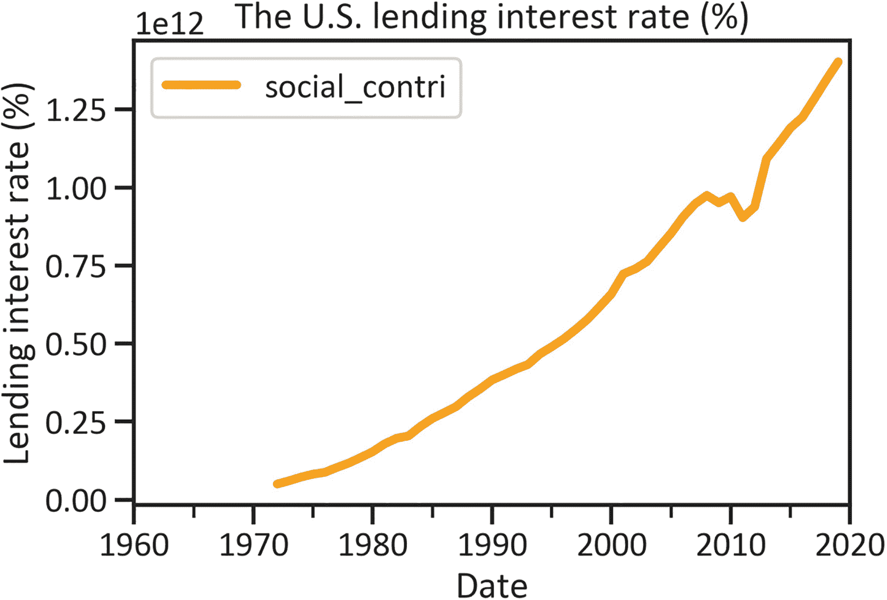

**图 3-2**  
美国贷款利率

```
country = ["USA"]
indicator = {"FR.INR.LEND":"lending_rate"}
lending_rate = wbdata.get_dataframe(indicator, country=country, convert_date=True)
social_contri.plot(kind="line",color="orange",lw=4)
plt.title("The U.S. lending interest rate (%)")
plt.ylabel("Lending interest rate (%)")
plt.xlabel("Date")
plt.show()
```

**代码清单 3-2**  
美国贷款利率

图 3-2 显示，在过去五十年里，美国贷款利率增长了超过 1.25%。


### GDP 增长（年度百分比）

`GDP` 代表国内生产总值。它估算了一个国家家庭每年消费的最终商品和服务的市场价值。它是诊断经济体健康状况的典型指标，因为它传达了一个国家的经济产出。估算 `GDP` 主要有两种方法：使用*名义* `GDP`（不考虑通货膨胀的 `GDP` 估算值），以及使用*实际* `GDP`（考虑通货膨胀的 `GDP` 估算值）。公式 3-1 是 `GDP` 的公式。

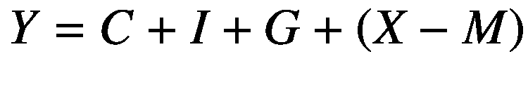

（公式 3-1）

其中 `Y` 代表 `GDP`，`C` 代表消费支出，`I` 代表投资，`G` 代表政府支出，`X` 代表出口，`M` 代表进口。图 3-3 显示了 1971 年至 2020 年美国 `GDP` 年度百分比增长的变化。见代码清单 3-3。

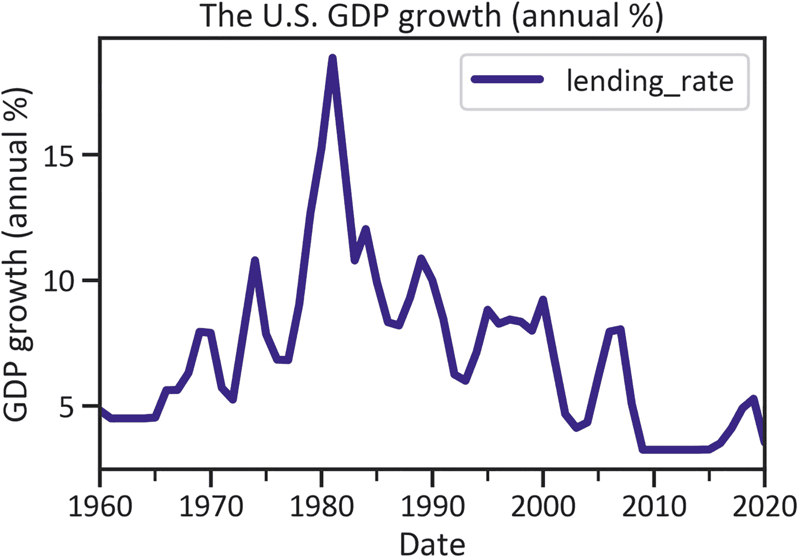

**图 3-3**  
美国 GDP 增长

```
country = ["USA"]
gdp_growth = {"NY.GDP.MKTP.KD.ZG":"gdp_growth"}
gdp_growth = wbdata.get_dataframe(indicator, country=country, convert_date=True)
gdp_growth.plot(kind="line",color="navy",lw=4)
plt.title("The U.S. GDP growth (annual %)")
plt.ylabel("GDP growth (annual %)")
plt.xlabel("Date")
plt.show()
```

**代码清单 3-3**  
美国 GDP 增长（年度百分比）

图 3-3 显示了美国 `GDP` 的锯齿状模式，该指标已根据通货膨胀进行了调整。1981 年，美国经历了 `GDP` 的最大变化。而在 2019 年，经济活动则非常低迷（`GDP` 增长了 2.161176）。

### 最终消费支出

最终消费支出是家庭购买的所有商品和服务的市场价值（见代码清单 3-4）。这包括汽车和个人电脑等耐用品。图 3-4 展示了按现价美元计算的美国最终消费支出。

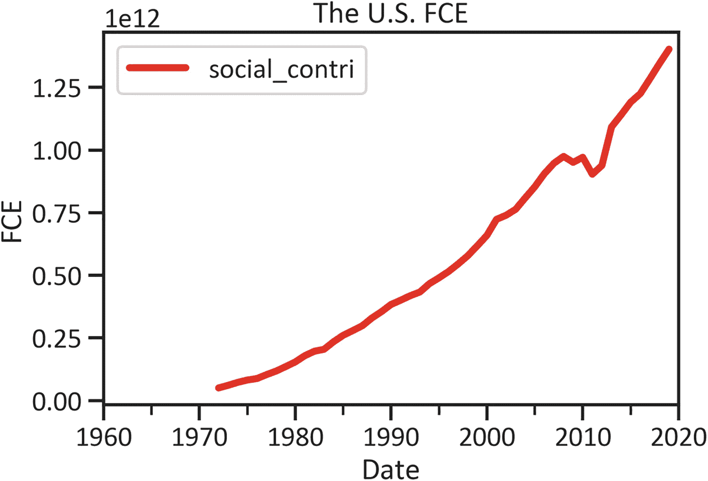

**图 3-4**  
美国最终消费支出

```
country = ["USA"]
indicator = {"NE.CON.TOTL.CD":"fin_cons"}
fin_cons = wbdata.get_dataframe(indicator, country=country, convert_date=True)
social_contri.plot(kind="line",color="red",lw=4)
plt.title("The U.S. FCE")
plt.ylabel("FCE")
plt.xlabel("Date")
plt.show()
```

**代码清单 3-4**  
美国最终消费支出（现价美元）

图 3-4 显示了美国最终消费支出数据极度上升的趋势，该趋势在 2012 年略有中断。接下来，你将探索一个理论框架，以便对该现象有所了解。

## 理论框架

本章应用多元回归方法来确定一组预测变量（美国社会缴款、贷款利率和 `GDP` 增长）是否会影响响应变量（美国最终消费支出）。图 3-5 展示了当前问题的理论框架。

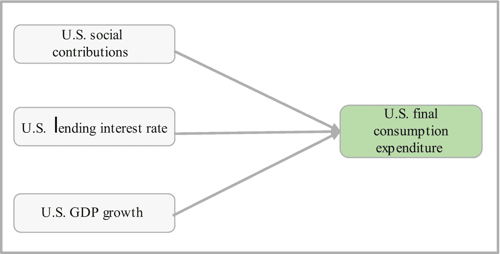

**图 3-5**  
理论框架

基于图 3-5，本章检验了以下假设。

**假设 1**  
`H[0]`：美国社会缴款与最终消费支出之间无显著差异。  
`H[A]`：美国社会缴款与最终消费支出之间存在显著差异。

**假设 2**  
`H[0]`：美国贷款利率与最终消费支出之间无显著差异。  
`H[A]`：美国贷款利率与最终消费支出之间存在显著差异。

**假设 3**  
`H[0]`：美国 GDP 增长与最终消费支出之间无显著差异。  
`H[A]`：美国 GDP 增长与最终消费支出之间存在显著差异。

本章应用普通最小二乘回归模型来研究以下三个因素的变化是否会影响美国家庭的消费模式：

*   美国金融机构向客户收取的贷款利率
*   考虑通货膨胀后的美国经济活动年度增长
*   美国组织和公民向社会保障体系缴纳的缴款

代码清单 3-5 应用 `wbdata` 获取与美国社会缴款、贷款利率、`GDP` 增长以及最终消费支出相关的数据（见表 3-2）。

**表 3-2**  
加载美国宏观经济数据

| 日期 | social_contri | lending_rate | gdp_growth | fin_cons |
| --- | --- | --- | --- | --- |
| 2020-01-01 | 1.420776e+12 | 3.544167 | -3.486140 | NaN |
| 2019-01-01 | 1.402228e+12 | 5.282500 | 2.161177 | 1.753966e+13 |
| 2018-01-01 | 1.344612e+12 | 4.904167 | 2.996464 | 1.688457e+13 |
| 2017-01-01 | 1.283672e+12 | 4.096667 | 2.332679 | 1.608306e+13 |
| 2016-01-01 | 1.224603e+12 | 3.511667 | 1.711427 | 1.543082e+13 |

```
country = ["USA"]
indicator = {"GC.REV.SOCL.CN":"social_contri",
"FR.INR.LEND":"lending_rate",
"NY.GDP.MKTP.KD.ZG":"gdp_growth",
"NE.CON.TOTL.CD":"fin_cons"}
df = wbdata.get_dataframe(indicator, country=country, convert_date=True)
df.head()
```

**代码清单 3-5**  
加载美国宏观经济数据


## 描述性统计

绝大多数机器学习模型对缺失数据点（某个列或行中的空白数据点）极其敏感。因此，您必须用一个中心值（均值或中位数）来替换它们。当使用`pandas`库时，您可以使用`fillna()`方法，并为其提供一个中心值，该值将用于替换某一列中的每个缺失值。清单 3-6 用均值替换了缺失的数据点，清单 3-7 展示了美国社保缴款的分布情况。

```
df["social_contri"] = df["social_contri"].fillna(df["social_contri"].mean())
df["lending_rate"] = df["lending_rate"].fillna(df["lending_rate"].mean())
df["gdp_growth"] = df["gdp_growth"].fillna(df["gdp_growth"].mean())
df["fin_cons"] = df["fin_cons"].fillna(df["fin_cons"].mean())
清单 3-6
用均值替换缺失值
```

图 3-6 展示了美国社保缴款的分布情况。

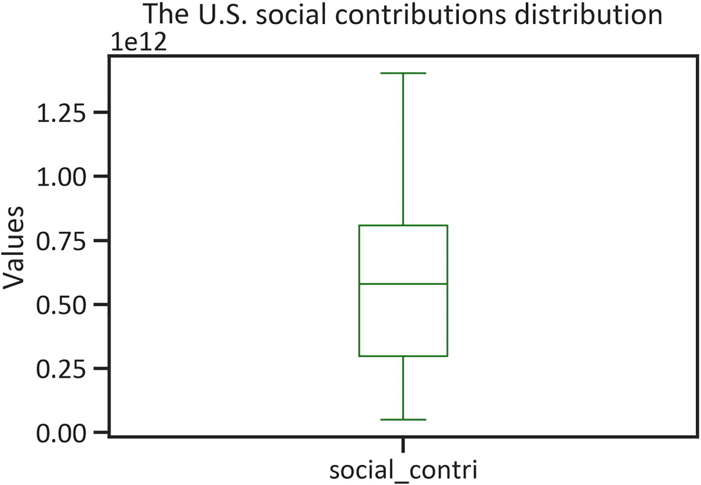

图 3-6
美国社保缴款分布

```
df["social_contri"] .plot(kind="box",color="green")
plt.title("The U.S. social contributions' distribution")
plt.ylabel("Values")
plt.show()
清单 3-7
美国社保缴款分布
```

图 3-6 显示美国社保缴款数据没有异常值。图 3-7 展示了美国的贷款利率。请参见清单 3-8。

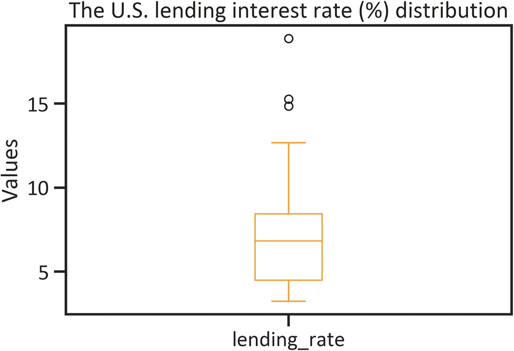

图 3-7
美国贷款利率分布

```
df["lending_rate"] .plot(kind="box",color="orange")
plt.title("US lending interest rate (%) distribution")
plt.ylabel("Values")
plt.show()
清单 3-8
美国贷款利率分布
```

图 3-7 表明美国贷款利率数据中有三个异常值。清单 3-9 用均值替换了这些异常值。清单 3-10 展示了 GDP 增长的分布。

```
df['lending_rate'] = np.where((df["lending_rate"] > 13),df["lending_rate"].mean(),df["lending_rate"])
清单 3-9
用均值替换美国贷款利率异常值
```

图 3-8 展示了美国 GDP 增长的分布。

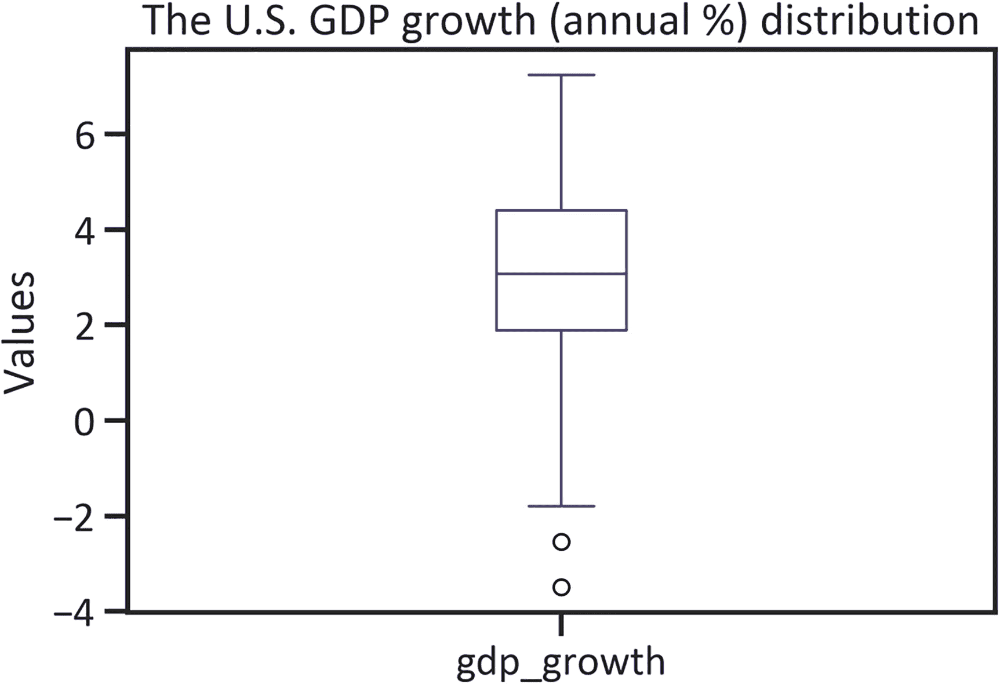

图 3-8
美国 GDP 增长分布

```
df["gdp_growth"] .plot(kind="box",color="navy")
plt.title("The U.S. GDP growth (annual %) distribution")
plt.ylabel("Values")
plt.show()
清单 3-10
美国 GDP 增长分布
```

图 3-8 表明美国 GDP 增长数据中有两个异常值。清单 3-11 用均值替换了这些异常值。清单 3-12 展示了最终消费支出。

```
df['gdp_growth'] = np.where((df["gdp_growth"] < 0),df["gdp_growth"].mean(),df["gdp_growth"])
清单 3-11
用均值替换美国 GDP 增长异常值
```

图 3-9 展示了美国的最终消费支出（按现价美元计）。

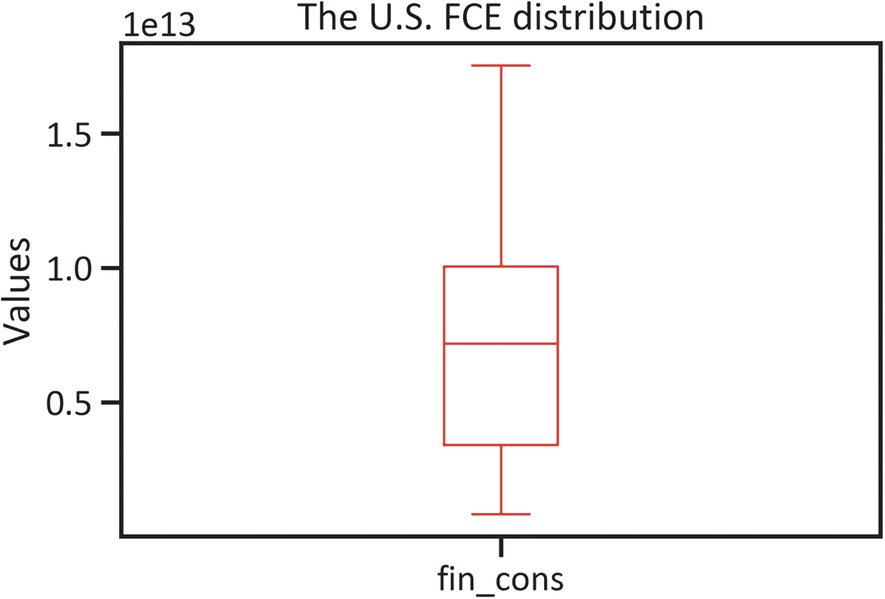

图 3-9
美国最终消费支出

```
df["fin_cons"] .plot(kind="box",color="red")
plt.title("The U.S. FCE distribution")
plt.ylabel("Values")
plt.show()
清单 3-12
美国最终消费支出
```

图 3-9 表明该数据中没有异常值。表 3-3 概述了数据的集中趋势和离散程度，您可通过清单 3-13 中的命令查看。

表 3-3
描述性汇总

|   | 计数 | 均值 | 标准差 | 最小值 | 25%分位数 | 50%分位数 | 75%分位数 | 最大值 |
|---|---|---|---|---|---|---|---|---|
| `social_contri` | 61.0 | 5.977005e+11 | 3.687861e+11 | 5.048000e+10 | 2.985900e+11 | 5.977005e+11 | 8.533970e+11 | 1.420776e+12 |
| `lending_rate` | 61.0 | 6.639908e+00 | 2.436502e+00 | 3.250000e+00 | 4.500000e+00 | 6.824167e+00 | 8.270833e+00 | 1.266583e+01 |
| `gdp_growth` | 61.0 | 3.516580e+00 | 1.349463e+00 | 9.983408e-01 | 2.684287e+00 | 3.075515e+00 | 4.400000e+00 | 7.236620e+00 |
| `fin_cons` | 61.0 | 7.173358e+12 | 4.580756e+12 | 8.395100e+11 | 3.403470e+12 | 7.173358e+12 | 1.006535e+13 | 1.753966e+13 |

```
df.describe().transpose()
清单 3-13
描述性汇总
```

表 3-3 显示：

*   美国社保缴款的均值是 5.977005e+11。
*   贷款利率的均值是 6.639908e+00。
*   GDP 增长的均值是 3.516580e+00。
*   最终消费支出的均值是 7.173358e+12。
*   美国社保缴款偏离均值的幅度是 3.687861e+11，贷款利率偏离均值的幅度是 2.436502e+00，GDP 增长偏离均值的幅度是 1.349463e+00，最终消费支出偏离均值的幅度是 4.580756e+12。

## 协方差分析

清单 3-14 确定了变量如何共同变化以及每个变量如何与自身变化（参见表 3-4）。

表 3-4
协方差矩阵

|   | **social_contri** | **lending_rate** | **gdp_growth** | **fin_cons** |
|---|---|---|---|---|
| `social_contri` | 1.360032e+23 | -6.000783e+11 | -2.202567e+11 | 1.553786e+24 |
| `lending_rate` | -6.000783e+11 | 5.936544e+00 | 8.538603e-01 | -7.092189e+12 |
| `gdp_growth` | -2.202567e+11 | 8.538603e-01 | 1.821052e+00 | -2.659879e+12 |
| `fin_cons` | 1.553786e+24 | -7.092189e+12 | -2.659879e+12 | 2.098332e+25 |

```
dfcov = df.cov()
dfcov
清单 3-14
协方差矩阵
```

表 3-4 概述了您所检索的变量集的估计协方差。


## 相关性分析

清单 3-15 应用了之前的协方差估计值，并将其除以预测变量的标准差和响应变量的标准差，以计算皮尔逊相关系数（见图 3-10）。

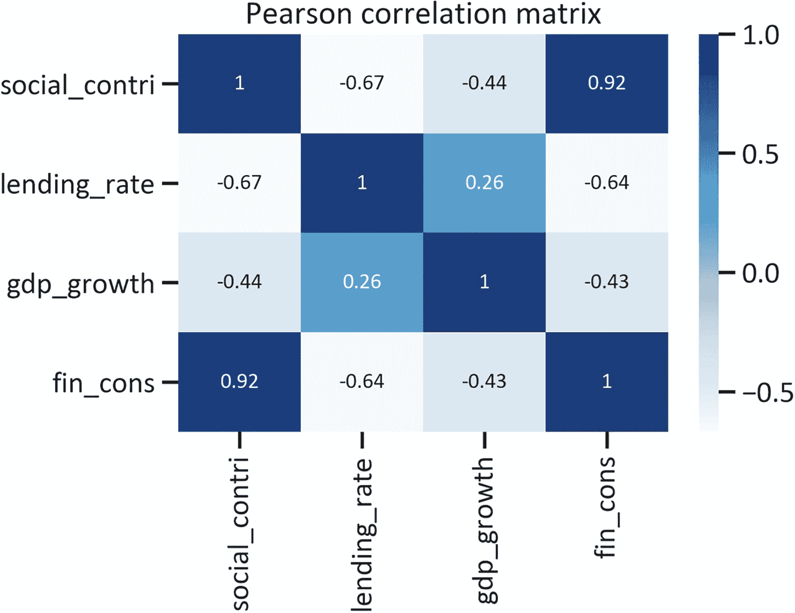

**图 3-10**  
皮尔逊相关矩阵

```python
dfcorr = df.corr(method="pearson")
sns.heatmap(dfcorr, annot=True, annot_kws={"size":12},cmap="Blues")
plt.title("Pearson correlation matrix")
plt.show()
```

**清单 3-15**  
皮尔逊相关矩阵

表 3-5 对图 3-10 中的皮尔逊相关系数进行了解释。

**表 3-5**  
皮尔逊相关系数解释

| 变量 | 皮尔逊相关系数 | 发现 |
| --- | --- | --- |
| 美国社会缴款（本币）与最终消费支出（现价美元） | 0.92 | 美国社会缴款与最终消费之间存在极强的正相关关系。这表明，平均而言，当美国组织和个人增加其社会保障缴款时，美国的最终消费支出往往会急剧增加。 |
| 美国银行贷款利率与最终消费支出（现价美元） | -0.64 | 美国银行贷款利率与最终消费之间存在中等程度的负相关关系。这表明，平均而言，随着借贷成本上升，美国的最终消费支出往往会适度下降。 |
| 美国 GDP 增长率与最终消费支出（现价美元） | -0.43 | 美国 GDP 增长率与最终消费之间存在中等程度的负相关关系。这表明，平均而言，随着经通胀调整后的经济活动增加，美国的最终消费支出往往会适度减少。 |

图 3-11 展示了美国社会缴款、银行贷款利率和最终消费支出的分布情况，包括这些变量之间的统计相关性。使用清单 3-16 中的命令查看这些散点图矩阵。

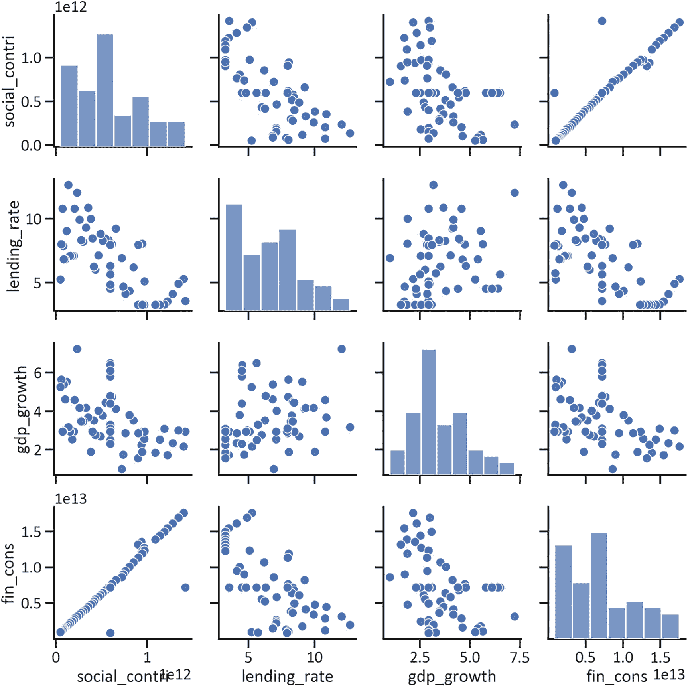

**图 3-11**  
散点图矩阵

```python
sns.pairplot(df)
```

**清单 3-16**  
散点图矩阵

## 相关性严重程度检测

清单 3-17 使用特征值法检测相关性严重程度。它纳入了*特征值*，即在线性变换后我们考虑的向量，以及特征向量，也称为特征负荷（见表 3-6）。

**表 3-6**  
特征矩阵

| | 特征值 | `social_contri` | `lending_rate` | `gdp_growth` | `fin_cons` |
| --- | --- | --- | --- | --- | --- |
| `social_contri` | 2.741814 | 0.571562 | -0.727660 | -0.363008 | -0.109782 |
| `lending_rate` | 0.078913 | -0.477992 | -0.051401 | -0.774123 | 0.411844 |
| `gdp_growth` | 0.403418 | -0.355849 | -0.015693 | -0.257158 | -0.898329 |
| `fin_cons` | 0.775854 | 0.564103 | 0.683829 | -0.450365 | -0.106477 |

```python
eigenvalues, eigenvectors = np.linalg.eig(dfcorr)
eigenvalues = pd.DataFrame(eigenvalues)
eigenvalues.columns = ["Eigen values"]
eigenvectors = pd.DataFrame(eigenvectors)
eigenvectors.columns = df.columns
eigenvectors = pd.DataFrame(eigenvectors)
eigenmatrix = pd.concat([eigenvalues, eigenvectors],axis=1)
eigenmatrix.index = df.columns
eigenmatrix
```

**清单 3-17**  
确定相关性严重程度

表 3-7 解释了如何解读特征矩阵。

**表 3-7**  
特征矩阵解读

| 特征值分数 | 描述 |
| --- | --- |
| > 100 | 存在极端的多重共线性。 |
| 10 - 100 | 存在中等程度的多重共线性。 |
| 0 - 10 | 存在轻微的多重共线性。 |

基于表 3-6，数据中存在多重共线性。因此，你需要进行降维。

### 降维

当变量众多时，逐一研究每个变量之间的关系非常耗时。清单 3-18 对数据进行了降维，图 3-12 展示了每个主成分的方差比率。

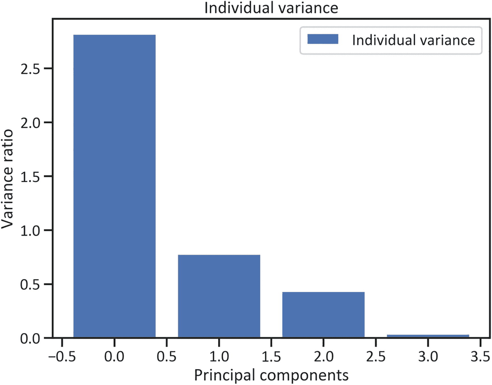

**图 3-12**  
个体方差

```python
from sklearn.decomposition import PCA
from sklearn.preprocessing import StandardScaler
scaler = StandardScaler()
std_df = scaler.fit_transform(df)
pca = PCA()
pca.fit_transform(std_df)
pca_variance = pca.explained_variance_
plt.figure(figsize=(8, 6))
plt.bar(range(4), pca_variance, align="center", label="Individual variance")
plt.legend()
plt.ylabel("Variance ratio")
plt.xlabel("Principal components")
plt.title("Individual variance")
plt.show()
```

**清单 3-18**  
降维

图 3-12 显示第一个主成分的方差超过 2.5。清单 3-19 对数据进行降维，使其变为二维（见图 3-13）。然后，你可以应用主成分分析，该分析确定潜变量（也称为*成分*）如何最佳地解释模型。

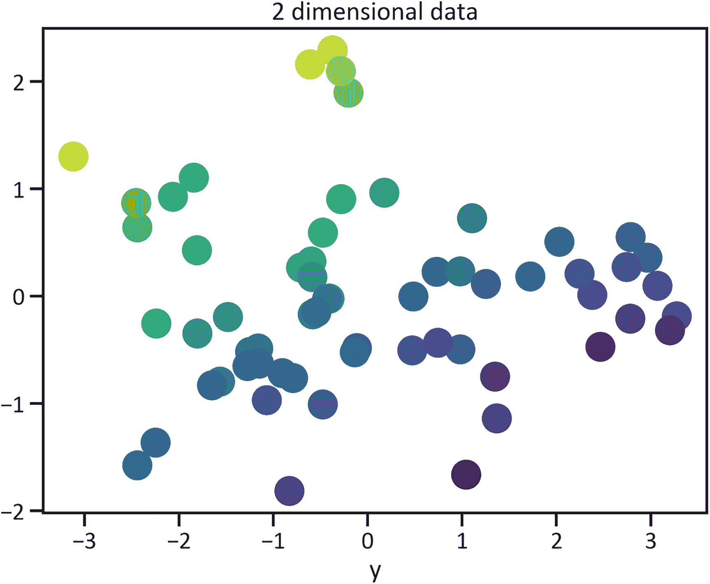

**图 3-13**  
二维数据

```python
pca2 = PCA(n_components=2)
pca2.fit(std_df)
x_3d = pca2.transform(std_df)
plt.figure(figsize=(8,6))
plt.scatter(x_3d[:,0], x_3d[:,1], c=df['gdp_growth'],cmap="viridis",s=350)
plt.xlabel("y")
plt.title("2 dimensional data")
plt.show()
```

**清单 3-19**  
降维

图 3-13 以二维散点图展示了降维后的数据。清单 3-20 生成 `X` 和 `Y` 数组，然后按照 80:20 的分割比例将数据拆分为训练集和测试集。最后，对这些数组进行标准化处理。

```python
x = df.iloc[::,0:3]
y = df.iloc[::,-1]
from sklearn.model_selection import train_test_split
from sklearn.preprocessing import StandardScaler
x_train, x_test, y_train, y_test = train_test_split(x,y,test_size=0.2,random_state=0)
scaler = StandardScaler()
x_train = scaler.fit_transform(x_train)
x_test = scaler.transform(x_test)
```

**清单 3-20**  
数据预处理


## 使用 Statsmodels 开发普通最小二乘法回归模型

清单 3-21 通过应用 `statsmodels` 库开发了一个多元普通最小二乘法回归模型，用于确定美国社会缴款、贷款利率与最终消费支出之间的关系是否存在显著差异。表 3-8 突出显示了该模型预测的美国最终消费支出值。

表 3-8

预测值（Statsmodels）

|   | 预测的 FCE |
|---|---|
| 0 | 1.785433e+12 |
| 1 | 3.810297e+12 |
| 2 | 1.727029e+12 |
| 3 | 7.169544e+12 |
| 4 | 1.272881e+13 |

```
import statsmodels.api as sm
x_constant = sm.add_constant(x_train)
x_test = sm.add_constant(x_test)
model = sm.OLS(y_train,x_constant).fit()
pd.DataFrame(model.predict(x_constant), columns = ["Predicted FCE"]).head()
清单 3-21
应用 Statsmodels 开发多元模型
```

表 3-8 展示了普通最小二乘法回归模型预测的数据点。清单 3-22 返回了表 3-9。（此摘要表提供了关于模型性能的充分信息。）

表 3-9

OLS 模型结果

| 因变量 | fin_cons | R 方 | 0.810 |
|---|---|---|---|
| 模型 | OLS | 调整后 R 方: | 0.797 |
| 方法 | 最小二乘法 | F 统计量: | 62.48 |
| 日期 | 2021 年 8 月 4 日 星期三 | 概率 (F 统计量): | 6.70e-16 |
| 时间 | 04:14:27 | 对数似然: | -1426.8 |
| 观测数 | 48 | AIC: | 2862. |
| 残差自由度 | 44 | BIC: | 2869. |
| 模型自由度 | 3 |   |   |
| 协方差类型 | 非稳健 |   |   |

|   | 系数 | 标准误 | t | P>&#124;t&#124; | [0.025 | 0.975] |
|---|---|---|---|---|---|---|
| `const` | 6.953e+12 | 2.96e+11 | 23.471 | 0.000 | 6.36e+12 | 7.55e+12 |
| `x1` | 3.858e+12 | 4.28e+11 | 9.015 | 0.000 | 3e+12 | 4.72e+12 |
| `x2` | -1.845e+11 | 3.91e+11 | -0.472 | 0.639 | -9.72e+11 | 6.03e+11 |
| `x3` | -1.617e+11 | 3.35e+11 | -0.483 | 0.631 | -8.36e+11 | 5.13e+11 |

| 综合检验 | 55.713 | 德宾-沃森统计量 | 2.186 |
|---|---|---|---|
| 综合检验概率 | 0.000 | Jarque-Bera (JB) | 278.920 |
| 偏度 | -3.119 | JB 概率 | 2.71e-61 |
| 峰度 | 13.027 | 条件数 | 2.51 |

```
model.summary()
清单 3-22
模型评估
```

表 3-9 显示，该普通最小二乘法回归模型解释了模型中 81.0% 的变异性。这意味着该模型是一个优秀的学习器。该表还显示，只有美国社会缴款与最终消费支出之间的关系是显著的。

该表还表明：

-   美国社会缴款每变化一个单位，美国最终消费支出增加 `3.858e+12`。
-   美国贷款利率每变化一个单位，美国最终消费支出减少 `1.845e+11`。
-   美国 GDP 增长每变化一个单位，美国最终消费支出减少 `-1.617e+11`。

最后，该普通最小二乘法模型解释了数据中 90% 的变异性。这意味着该模型在预测美国最终消费支出方面表现优异。

### 残差分析

图 3-14 展示了残差的分布；代码见清单 3-23。

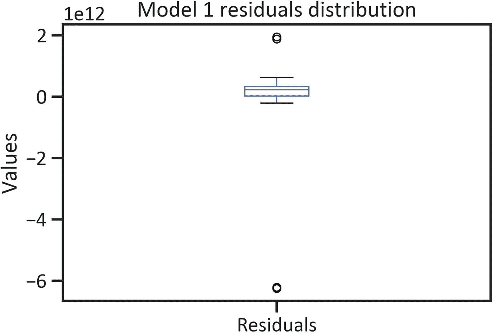

图 3-14

模型残差分布

```
pd.DataFrame(model.resid,columns=["Residuals"]).plot(kind="box")
plt.title("Model 1 residuals distribution")
plt.ylabel("Values")
plt.show()
清单 3-23
残差分析
```

图 3-14 表明残差的均值接近 0，但残差中存在异常值。

#### 残差自相关

清单 3-24 确定了残差之间的序列相关性（见图 3-15）。

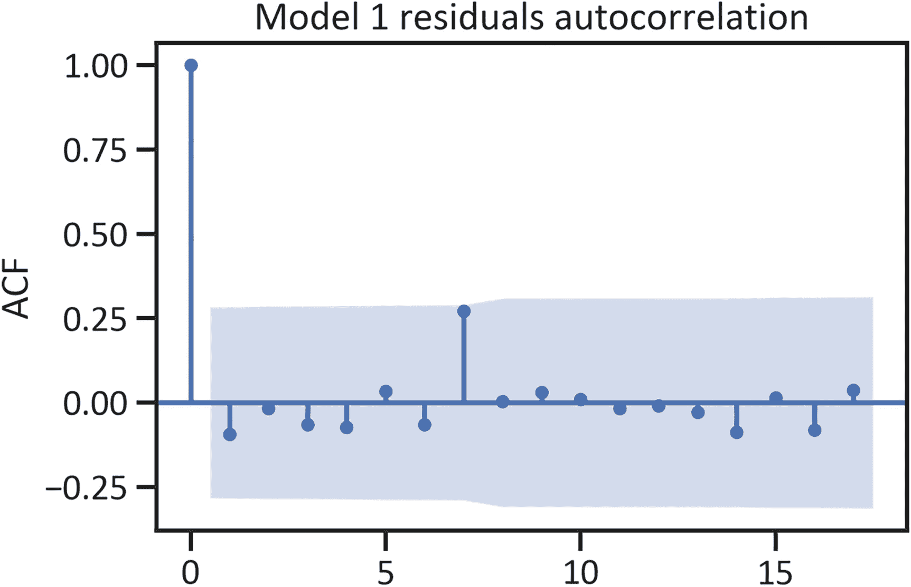

图 3-15

模型残差自相关

```
from statsmodels.graphics.tsaplots import plot_acf
plot_acf(model.resid)
plt.title("Model 1 residuals autocorrelation")
plt.ylabel("ACF")
plt.show()
plt.show()
清单 3-24
残差自相关
```

图 3-15 表明没有自相关系数超出统计边界。

## 使用 Scikit-Learn 开发普通最小二乘法回归模型

本节讨论使用 `scikit-learn` 库的多元普通最小二乘法回归模型。参见清单 3-25。

```
x = df.iloc[::,0:3]
y = df.iloc[::,-1]
from sklearn.model_selection import train_test_split
from sklearn.preprocessing import StandardScaler
x_train, x_test, y_train, y_test = train_test_split(x,y,test_size=0.2,random_state=0)
scaler = StandardScaler()
x_train = scaler.fit_transform(x_train)
x_test = scaler.transform(x_test)
清单 3-25
数据预处理
```

清单 3-26 训练了该多元普通最小二乘法回归模型。

```
from sklearn.linear_model import LinearRegression
lm = LinearRegression()
lm.fit(x_train,y_train)
清单 3-26
训练默认模型
```

### 交叉验证

清单 3-27 使用 `cross_val_score()` 方法找到了交叉验证分数。

```
from sklearn.model_selection import train_test_split, cross_val_score
def get_val_score(scores):
scores = cross_val_score(scores, x_train, y_train, scoring="r2")
print("CV mean: ", np.mean(scores))
print("CV std: ", np.std(scores))
get_val_score(lm)
CV mean:  0.7815577376481077
CV std:  0.1706291983493402
清单 3-27
交叉验证
```

这些结果表明，交叉验证分数的均值为 `0.7816`，交叉验证分数的独立数据点与均值的偏差为 `0.1706`。


### 超参数优化

`清单 3-28` 使用 `GridSearchCV()` 方法优化了超参数。参见`清单 3-29`和`3-30`。

```
lm.intercept_
6952809734166.666
清单 3-30
估计截距
```

```
lm = LinearRegression(copy_X=False, fit_intercept=True, n_jobs=-5, normalize=False)
lm.fit(x_train, y_train)
清单 3-29
普通最小二乘回归模型开发
```

```
from sklearn.model_selection import GridSearchCV
param_grid = {"copy_X": [False, True], "fit_intercept": [False, True], "n_jobs": [-5, -3, 3, 5], "normalize": [False, True]}
grid_model = GridSearchCV(estimator=lm, param_grid=param_grid)
grid_model.fit(x_train, y_train)
print("Best scores: ", grid_model.best_score_, "Best parameters: ", grid_model.best_params_)
Best scores: 0.7815577376481078 Best parameters: {'copy_X': False, 'fit_intercept': True, 'n_jobs': -5, 'normalize': True}
清单 3-28
超参数优化
```

当美国社会缴款、贷款利率和 GDP 增长保持不变时，美国最终消费支出的预测均值为 `6952809734166.667`。`清单 3-31` 估算了系数。

```
lm.coef_
array([ 3.85798531e+12, -1.84542533e+11, -1.61721467e+11])
清单 3-31
估算系数
```

这表明：

-   美国社会缴款每变动一个单位，美国最终消费支出增加 `3.85798531e+12`。
-   美国贷款利率每变动一个单位，美国最终消费支出减少 `1.84542533e+11`。
-   美国 GDP 增长每变动一个单位，美国最终消费支出减少 `1.61721467e+11`。

### 残差分析

`清单 3-32` 并排比较了美国最终消费支出的实际数据点和预测数据点（参见`表 3-10`）。

**表 3-10**  
美国实际与预测最终消费支出

| 日期 | 实际最终消费支出 | 预测最终消费支出 |
| --- | --- | --- |
| 2020-01-01 | 5.829066e+12 | 5.596803e+12 |
| 2019-01-01 | 3.403470e+12 | 3.196027e+12 |
| 2018-01-01 | 7.173358e+12 | 7.279473e+12 |
| 2017-01-01 | 5.245942e+12 | 5.214464e+12 |
| 2016-01-01 | 1.227281e+13 | 1.111828e+13 |
| 2015-01-01 | 1.688457e+13 | 1.513641e+13 |
| 2014-01-01 | 3.624267e+12 | 3.595279e+12 |
| 2013-01-01 | 7.173358e+12 | 7.375272e+12 |
| 2012-01-01 | 2.204317e+12 | 2.431846e+12 |
| 2011-01-01 | 7.144856e+12 | 6.626573e+12 |
| 2010-01-01 | 1.543082e+13 | 1.412346e+13 |
| 2009-01-01 | 1.269598e+13 | 1.137305e+13 |
| 2008-01-01 | 4.757180e+12 | 4.747595e+12 |

```
actual_values = pd.DataFrame(df["fin_cons"][:13])
actual_values.columns = ["Actual FCE"]
predicted_values = pd.DataFrame(lm.predict(x_test))
predicted_values.columns = ["Predicted FCE"]
predicted_values.index = actual_values.index
actual_and_predicted_values = pd.concat([actual_values, predicted_values], axis=1)
actual_and_predicted_values.index = actual_values.index
actual_and_predicted_values
清单 3-32
美国实际与预测最终消费支出
```

`清单 3-33` 确定了以当前美元计价的美国最终消费支出的实际数据点和预测数据点（参见`图 3-16`）。

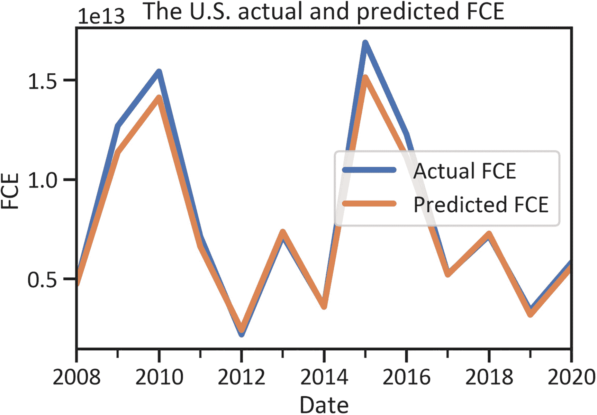

**图 3-16**  
美国实际与预测最终消费支出

```
actual_and_predicted_values.plot(lw=4)
plt.xlabel("Date")
plt.title("The U.S. actual and predicted FCE")
plt.ylabel("FCE")
plt.legend(loc="best")
plt.show()
清单 3-33
绘制美国实际与预测最终消费支出图
```

`图 3-16` 绘制了实际数据点以及普通最小二乘回归模型预测的数据点。参见`清单 3-34`。`图 3-17` 显示了残差的分布。

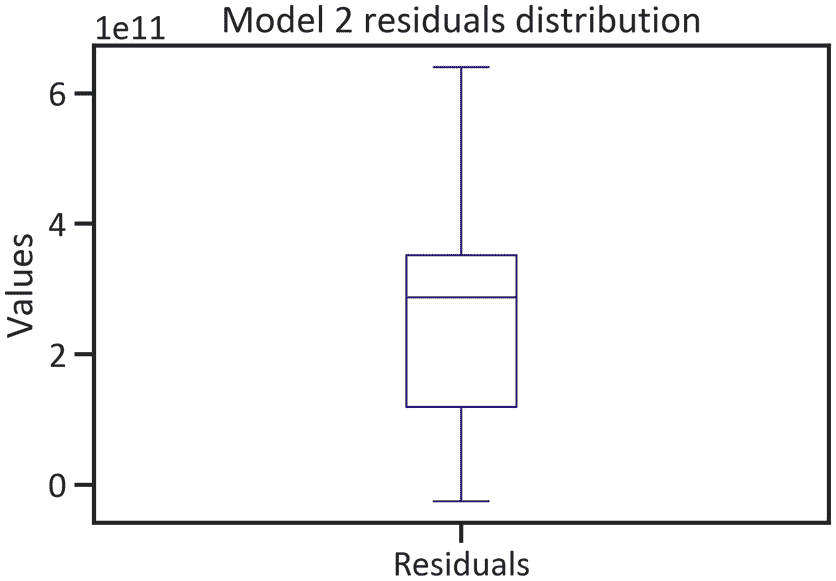

**图 3-17**  
普通最小二乘回归模型残差分布

```
y_pred = lm.predict(x_test)
residuals = y_test - y_pred
residuals = pd.DataFrame(residuals)
residuals.columns = ["Residuals"]
residuals.plot(kind="box", color="navy")
plt.title("Model 2 residuals distribution")
plt.ylabel("Values")
plt.show()
清单 3-34
普通最小二乘回归模型残差分布
```

`图 3-17` 表明残差的均值接近于 0。因此，你观察到了残差中的自相关。自相关指的是序列相关性（参见`清单 3-35`）。`图 3-18` 显示了不同滞后阶数下残差的自相关系数。

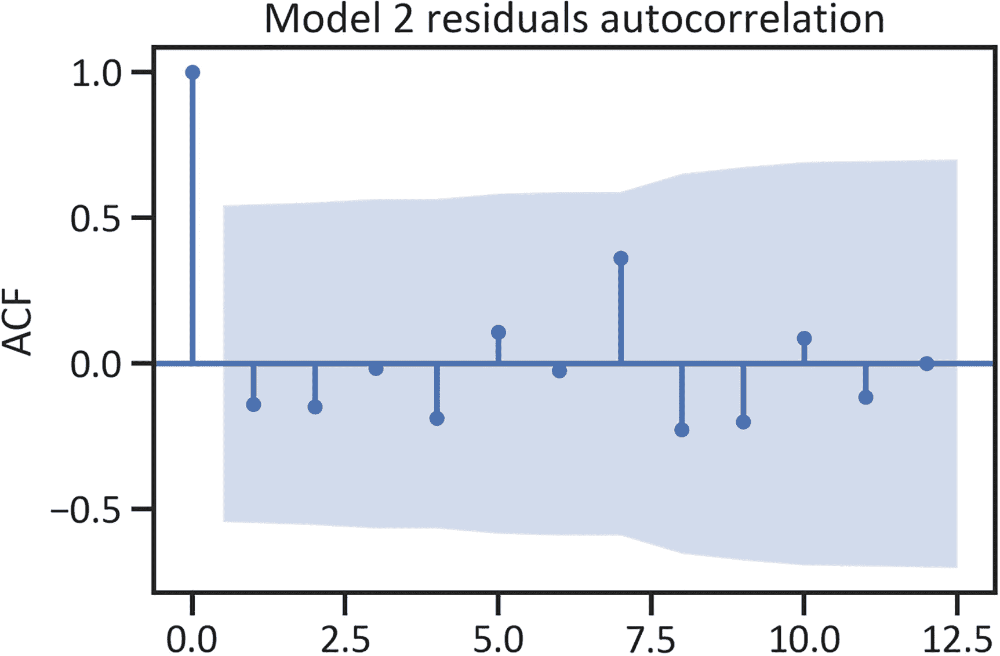

**图 3-18**  
普通最小二乘回归模型残差自相关

```
from statsmodels.graphics.tsaplots import plot_acf
plot_acf(residuals)
plt.title("Model 2 residuals autocorrelation")
plt.ylabel("ACF")
plt.show()
清单 3-35
普通最小二乘回归模型残差自相关
```

`图 3-18` 表明残差自相关系数未超出统计控制范围。该普通最小二乘回归模型在预测响应变量方面表现优异。参见`清单 3-36`。`表 3-11` 列出了其他普通最小二乘回归模型性能指标，如平均绝对误差、均方误差、均方根误差、解释方差和 R²。

**表 3-11**  
普通最小二乘回归模型评估

| | 平均绝对误差 | 均方误差 | 均方根误差 | 解释方差得分 | R² |
| --- | --- | --- | --- | --- | --- |
| 数值 | 5.458896e+11 | 6.399711e+23 | 7.999819e+11 | 0.979773 | 0.969552 |

```
from sklearn import metrics
MAE = metrics.mean_absolute_error(y_test, y_pred)
MSE = metrics.mean_squared_error(y_test, y_pred)
RMSE = np.sqrt(MSE)
EV = metrics.explained_variance_score(y_test, y_pred)
R2 = metrics.r2_score(y_test, y_pred)
lmmodelevation = [[MAE, MSE, RMSE, EV, R2]]
lmmodelevationdata = pd.DataFrame(lmmodelevation, index=["Values"], columns=("Mean absolute error", "Mean squared error", "Root mean squared error", "Explained variance score", "R-squared"))
lmmodelevationdata
清单 3-36
关键模型性能结果
```

`表 3-11` 显示，该普通最小二乘回归模型解释了数据中 97%的变异性。平均绝对误差为 `5.458896e+11`，均方误差为 `6.399711e+23`。


## 普通最小二乘回归模型学习曲线

图 3-19 展示了普通最小二乘模型如何学习解释美国社会缴款、贷款利率、GDP 增长以及最终消费支出增减之间关系的变异性。请参阅列表 3-37。

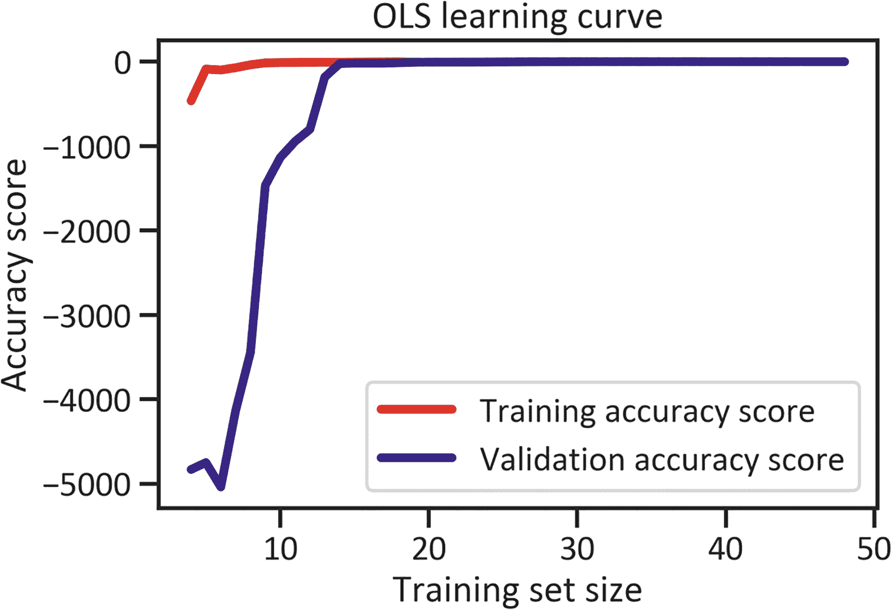

**图 3-19**  
普通最小二乘回归模型学习曲线

```python
from sklearn.model_selection import learning_curve
trainsizelogreg, trainscorelogreg, testscorelogreg = learning_curve(lm, x,y,cv=5, n_jobs=-1, scoring="r2", train_sizes=np.linspace(0.1,1.0,50))
trainscorelogreg_mean = np.mean(trainscorelogreg,axis=1)
trainscorelogreg_std = np.std(trainscorelogreg,axis=1)
testscorelogreg_mean = np.mean(testscorelogreg,axis=1)
testscorelogreg_std = np.std(testscorelogreg,axis=1)
fig, ax = plt.subplots()
plt.plot(trainsizelogreg,trainscorelogreg_mean, label="Training R2 score", color="red",lw=4)
plt.plot(trainsizelogreg,testscorelogreg_mean, label="Validation R2 score",color="navy",lw=4)
plt.title("OLS learning curve")
plt.xlabel("Training set size")
plt.ylabel("R2 score")
plt.legend(loc=4)
plt.show()
```

**列表 3-37**  
普通最小二乘回归模型学习曲线

图 3-19 显示，交叉验证 R²分数保持恒定，而训练 R²分数在第一个数据点处较低，但此后有所上升。

### 结论

本章使用普通最小二乘回归模型研究了美国社会缴款（现价本币单位）、贷款利率（百分比）、GDP 增长（年百分比）与最终消费支出（现价美元）之间是否存在显著差异。模型发现，美国社会缴款与最终消费之间存在极强的正相关，美国贷款利率与最终消费之间存在中等程度的负相关，美国 GDP 增长与最终消费之间也存在中等程度的负相关。`statsmodels`模型和`scikit-learn`模型均未违反回归假设，且在预测美国最终消费支出方面都表现出色，但`scikit-learn`模型具有更强的预测能力。

