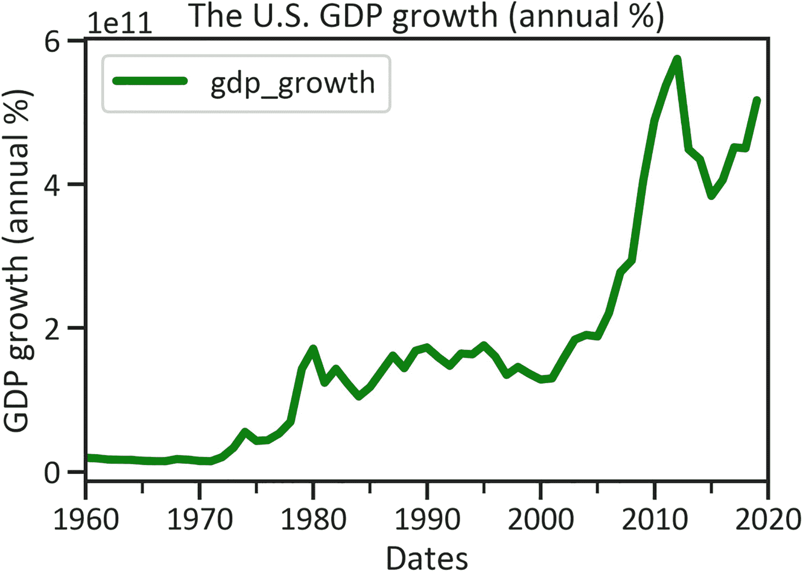
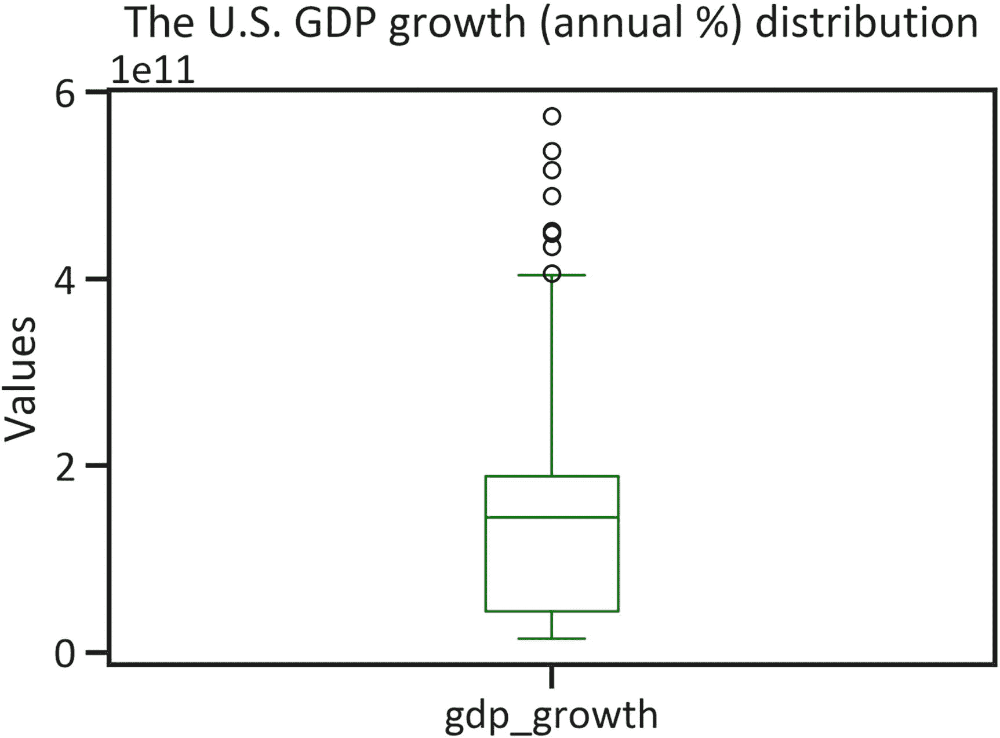
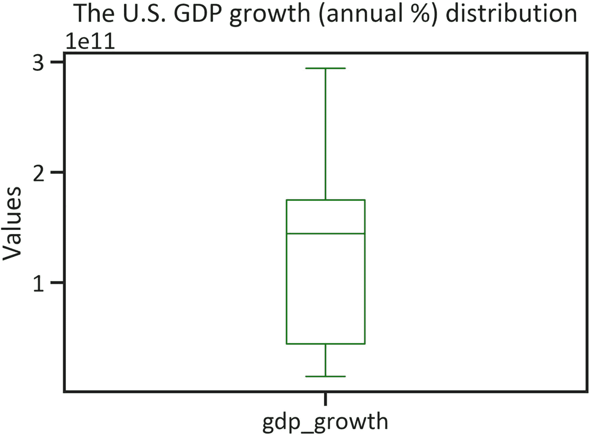
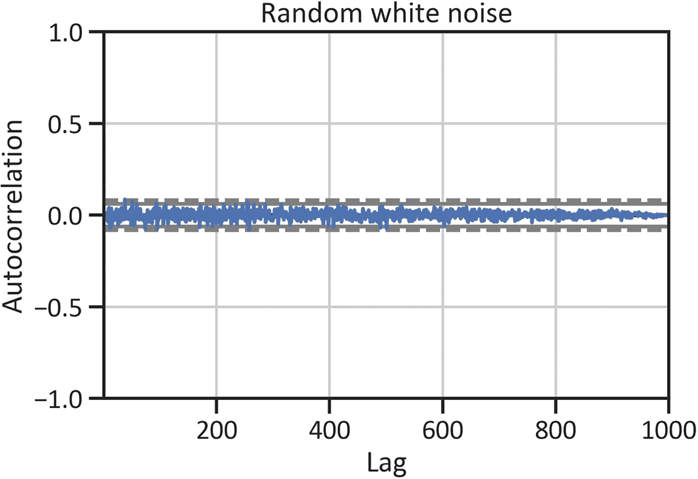
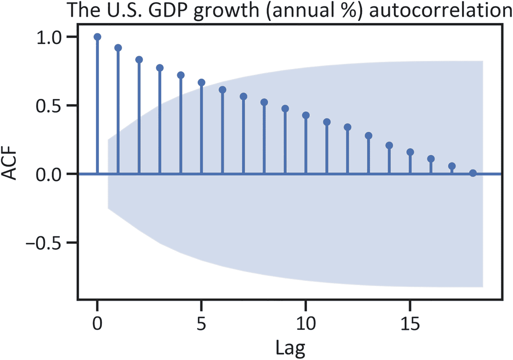
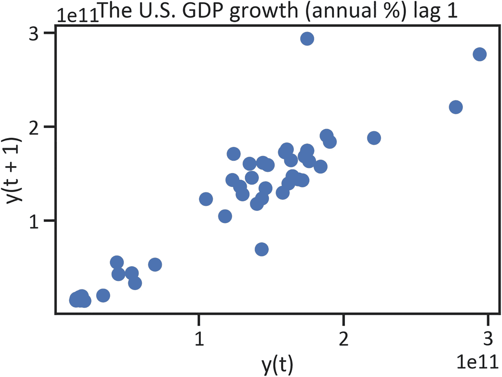
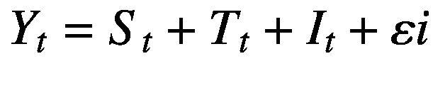
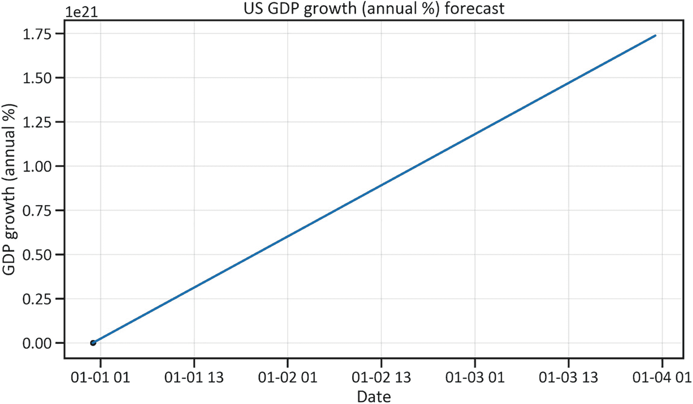

# 4. 预测增长

时间序列分析涉及检查序列数据中的模式和趋势，以预测序列的未来值。时间序列模型种类繁多，包括自回归移动平均模型（ARIMA）（p, d, q），该模型在前值与当前值之间应用线性变换（自回归）、积分（随机游走）和移动平均。有一种包含季节性的 ARIMA 模型，称为季节性 ARIMA (P, D, Q) x (p, d, q)。本章考虑加法模型，该模型通过平滑参数识别非线性。就本书而言，您可以将时间序列分析视为线性回归的扩展，因为它研究的是序列数据。主要区别在于，在时间序列分析中，您需要按时间对数据进行排序，这使得其假设比线性回归模型严格得多。在训练模型之前，您必须使用增强迪基-富勒检验来检验*平稳性*，检验是否存在白噪声，并检验自相关性。

本章研究美国每年生产的最终商品和服务市场价值的这些趋势（见公式 4-1）：

- 方向性运动——持续向上的运动是上升趋势，持续向下的运动是下降趋势
- 季节性——持续的逐年运动（向上或向下）
- 不规则成分——也称为残差成分

最后，该模型预测未来的经济活动。请注意，它并非描述数据的集中趋势，因为前一章已完成该工作。

本章使用由 Facebook 开发的名为 Prophet 的 Python 库。该库基于加法模型。

在继续之前，请确保您的环境中已安装`fbprophet`库。要在 Python 环境中安装`fbprophet`库，请使用`pip install fbprophet`。同样地，要在 Conda 环境中安装该库，请使用`conda install -c conda-forge fbprophet`。您还需要安装`pystan`库。在 Python 环境中执行此操作，请使用`pip install pystan`，在 Conda 环境中，请使用`conda install -c conda-forge pystan`。

列表 4-1 提取了美国 GDP 增长数据（年百分比）并绘制了该序列（见图 4-1）。



**图 4-1**  
美国 GDP 增长折线图

```python
import wbdata
import matplotlib.pyplot as plt
%matplotlib inline
country = ["USA"]
indicator = {"FI.RES.TOTL.CD":"gdp_growth"}
df = wbdata.get_dataframe(indicator, country=country, convert_date=True)
df.plot(kind="line",color="green",lw=4)
plt.title("The U.S. GDP growth (annual %)")
plt.xlabel("Dates")
plt.ylabel("GDP growth (annual %)")
plt.legend(loc="best")
plt.show()
```

**列表 4-1**  
美国 GDP 增长（年百分比）折线图

图 4-1 显示，自 20 世纪 60 年代初以来，美国 GDP 增长呈上升趋势。2012 年初，美国 GDP 增长有所下降，随后在 2015 年恢复增长势头。列表 4-2 用平均值替代了任何缺失值。

```python
df["gdp_growth"] = df["gdp_growth"].fillna(df["gdp_growth"].mean())
```

**列表 4-2**  
用平均值替换缺失值

## 描述性统计

列表 4-3 检索了表 4-1，该表概述了描述性统计。

**表 4-1**  
描述性统计

| | gdp_growth |
| --- | --- |
| 计数 | 6.100000e+01 |
| 平均值 | 1.822831e+11 |
| 标准差 | 1.646309e+11 |
| 最小值 | 1.483107e+10 |
| 25% 分位数 | 4.416213e+10 |
| 50% 分位数 | 1.441768e+11 |
| 75% 分位数 | 1.904648e+11 |
| 最大值 | 6.283697e+11 |

```python
df.describe()
```

**列表 4-3**  
描述性统计

表 4-1 显示：

- 美国 GDP 增长的平均值为 6.000000e+01。
- 美国 GDP 增长的独立数据点与平均值的偏差为 1.748483e+11。请参阅列表 4-4。

```python
df.plot(kind="box",color="green")
plt.title("The U.S. GDP growth (annual %) distribution")
plt.ylabel("Values")
plt.show()
```

**列表 4-4**  
美国 GDP 增长分布



**图 4-2**  
美国 GDP 增长分布

图 4-2 显示，美国 GDP 增长数据中存在异常值。列表 4-5 用缺失值替代了异常值，并检查了新的分布。

```python
df['gdp_growth'] = np.where((df["gdp_growth"] > 2.999999e+11),df["gdp_growth"].mean(),df["gdp_growth"])
df.plot(kind="box",color="green")
plt.title("The U.S. GDP growth (annual %) distribution")
plt.ylabel("Values")
plt.show()
```

**列表 4-5**  
替换异常值



**图 4-3**  
美国 GDP 增长箱线图

图 4-3 显示不再有异常值。


### 平稳性检测

如果序列数据中存在随机性（单位根），则表示该数据是平稳的，这意味着变量的均值几乎是恒定的或接近均值。大多数时间序列分析模型都假设序列具有单位根。最常见的平稳性检验是增广迪基-福勒检验（见列表 4-6），它扩展了迪基-福勒检验。应用增广迪基-福勒检验时，请确保 `p-value` 是显著的。表 4-2 定义了滞后数、F 统计量百分比和 `p-value`。

**表 4-2** 增广迪基-福勒检验结果

| 变量 | 值 |
| --- | --- |
| `ADF F% Statistics` | -0.962163 |
| `P-value` | 0.766813 |
| `No. of Lags Used` | 0.000000 |
| `No. of Observations` | 60.000000 |

```
from statsmodels.tsa.stattools import adfuller
adfullerreport = adfuller(df["gdp_growth"])
adfullerreportdata = pd.DataFrame(adfullerreport[0:4],
columns = ["Values"],
index=["ADF F% statistics",
"P-value",
"No. of lags used",
"No. of observations"])
adfullerreportdata
列表 4-6
增广迪基-福勒检验结果
```

表 4-2 显示该序列不存在平稳性，因为 `p-value` 大于 0.5。通常，您需要在建模前对序列进行差分。请注意，该检验有一个原假设，认为序列非平稳；同时还有一个备择假设，认为序列是平稳的。

### 随机白噪声检测

列表 4-7 生成一组随机变量，并检查数据的均值是否接近 0（见图 4-4）。



**图 4-4** 随机白噪声

```
from pandas.plotting import autocorrelation_plot
randval = np.random.randn(1000)
autocorrelation_plot(randval)
plt.title("Random white noise")
plt.show()
列表 4-7
随机白噪声
```

图 4-4 显示均值在 0 附近。这表明序列在不同滞后期上的模式是相似的。

## 自相关检测

在简单线性回归中，相关分析在模型开发中起着至关重要的作用。然而，时间序列分析关注的是独立观测值（`y`）与随时间变化的独立观测值（`y[t]`）之间的序列统计依赖性。列表 4-8 是一个自相关函数，用于理解不同滞后期的自相关性（见图 4-5）。当自相关系数落于图 4-5 中的蓝色区域时，它们是显著的。



**图 4-5** 美国 GDP 增长率（年百分比）ACF

```
from statsmodels.graphics.tsaplots import plot_acf
plot_acf(df["gdp_growth"])
plt.title("")
plt.xlabel("Lag")
plt.ylabel("ACF")
plt.title("The U.S. GDP growth (annual %) autocorrelation")
plt.show()
列表 4-8
美国 GDP 增长率（年百分比）ACF
```

列表 4-9 展示了 `lag1` 中的独立观测值（见图 4-6）。滞后图有助于解释任何滞后（`y[t]` 之间的间隔）与相关性之间的关系。



**图 4-6** 美国 GDP 增长率滞后图

```
from pandas.plotting import lag_plot
lag_plot(df["gdp_growth"])
plt.title("The U.S. GDP growth (annual %) lag 1")
plt.show()
列表 4-9
美国 GDP 增长率（年百分比）滞后图
```

图 4-6 显示，在 `lag1` 中，`y[t]` 和 `y[(t+1)]` 之间存在相关关系。

## 不同的单变量时间序列模型

本章将时间序列分析应用于一个连续变量。以下各节概述了不同的时间序列分析模型。

### 自回归积分滑动平均模型

自回归积分滑动平均模型（ARIMA）意味着它对前向值和当前值（自回归）、整合（随机游走）以及滑动平均（前向值和当前值的权重）应用线性变换。它是最常见的时间序列模型。该模型假设前向值之间存在线性关系，并且序列是平稳的。不仅如此，它还考虑了当前权重与前向加权值之间的差异。

### 季节性自回归积分滑动平均模型

季节性自回归积分滑动平均模型（SARIMA）扩展了 ARIMA 模型，它考虑了季节性（一种持续的逐年变动——上升或下降）。公式 4-1 是 SARIMA 的公式。



（公式 4-1）

其中，`S[t]` 表示季节性，`T[t]` 表示趋势，`I[t]` 表示不规则性，`ε[i]` 是误差项。SARIMA 考虑了季节性，但没有考虑公共假日等事件的影响。为了解决这个问题，开发人员经常使用加法模型。

## 加法模型

加法模型考虑了公共假日等事件的影响。它通过包含平滑参数和添加非线性，调整函数中的非线性属性，并将预测范围缩小到特定的置信区间。开发加法模型最可靠的库是 FB Prophet。列表 4-10 对数据进行了重新整理（见表 4-3）。

**表 4-3** 美国 GDP 增长率（年百分比）重新整理后的数据

| 日期 | `gdp_growth` | `ds` | `y` |
| --- | --- | --- | --- |
| 2020-01-01 | 1.822831e+11 | 1.822831e+11 | 2020-01-01 |
| 2019-01-01 | 1.822831e+11 | 1.822831e+11 | 2019-01-01 |
| 2018-01-01 | 1.822831e+11 | 1.822831e+11 | 2018-01-01 |
| 2017-01-01 | 1.822831e+11 | 1.822831e+11 | 2017-01-01 |
| 2016-01-01 | 1.822831e+11 | 1.822831e+11 | 2016-01-01 |
| ... | ... | ... | ... |
| 1964-01-01 | 1.672549e+10 | 1.672549e+10 | 1964-01-01 |
| 1963-01-01 | 1.687865e+10 | 1.687865e+10 | 1963-01-01 |
| 1962-01-01 | 1.725246e+10 | 1.725246e+10 | 1962-01-01 |
| 1961-01-01 | 1.882553e+10 | 1.882553e+10 | 1961-01-01 |
| 1960-01-01 | 1.966416e+10 | 1.966416e+10 | 1960-01-01 |

```
df = df.reset_index()
df["ds"] = df["gdp_growth"]
df["y"] = df["date"]
df.set_index("date")
列表 4-10
重新整理美国 GDP 增长率（年百分比）数据
```

## 加法模型开发

使用 FB Prophet 库开发加法模型相当简单。列表 4-11 调用了 `Prophet()` 并训练了模型。

```
from fbprophet import Prophet
m = Prophet()
m.fit(df)
列表 4-11
训练加法模型
```


## 加法模型预测

清单 4-12 构建了一个未来三年的数据框，并绘制了加法模型预测的数据点。

```
future = m.make_future_dataframe(periods=3)
forecast = m.predict(future)
m.plot(forecast)
plt.title("The U.S. GDP growth (annual %) forecast")
plt.xlabel("Date")
plt.ylabel("GDP growth (annual %)")
plt.show()
Listing 4-12
Plot U.S. GDP Growth Forecast
```



图 4-7

美国 GDP 增长预测

图 4-7 显示美国 GDP 增长将出现激增。下一节将讨论季节性分解——时间序列分析的一个重要方面。然而，考虑到该数据的结构，我们不会提供示例。显而易见，该图没有正确显示日期。

### 季节性分解

季节性分解涉及将序列数据分解为几个组成部分，以便开发者能更好地理解该序列。这些组成部分包括：

- 季节性，代表随时间变化的永久性模式。
- 趋势，代表序列中随时间变化的暂时性持续模式。
- 不规则波动，代表美国 GDP 增长数据的变异性。

鉴于数据收集的频率以及美国 GDP 增长的数据点较少，本章不涉及季节性分解。这些数据是每年收集的，我们无法将季节性分解为每日和每周的季节性。然而，理解季节性分解的工作原理仍然很重要。

### 结论

本章介绍了一种名为加法模型的时间序列分析模型。在拟合模型之前，您学习了如何通过检验平稳性、白噪声、自相关和正态性来确认时间序列分析的假设。此后，本章涵盖了趋势、季节性和残差。该模型预测美国年度 GDP 增长将出现主导性的上升趋势。下一章将介绍一种名为*逻辑回归*的分类方法。当您想操作预测变量以生成二元输出值时，可以使用此模型。

