# 5. 应用逻辑回归对经济数据进行分类

本章应用逻辑回归来研究在响应变量为分类变量（即仅限于少数几个类别）时变量之间关系的性质。该模型是最常见的非线性模型，通常被称为*分类*。它使用 Sigmoid 函数对数据进行建模。

图 5-1 展示了分类器如何操作预测变量以生成二元输出值。方程 5-1 显示了 sigmoid 方程。

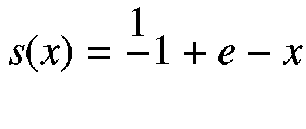

（方程 5-1）

您可能已经注意到宏观经济数据通常是连续的。不必担心，您仍然可以对这类数据执行逻辑回归。您需要做的只是根据方向（上升或下降）对响应变量进行分类。这可以基于一个 S 形公式，即所谓的 *sigmoid 形状*（参见图 5-1）。

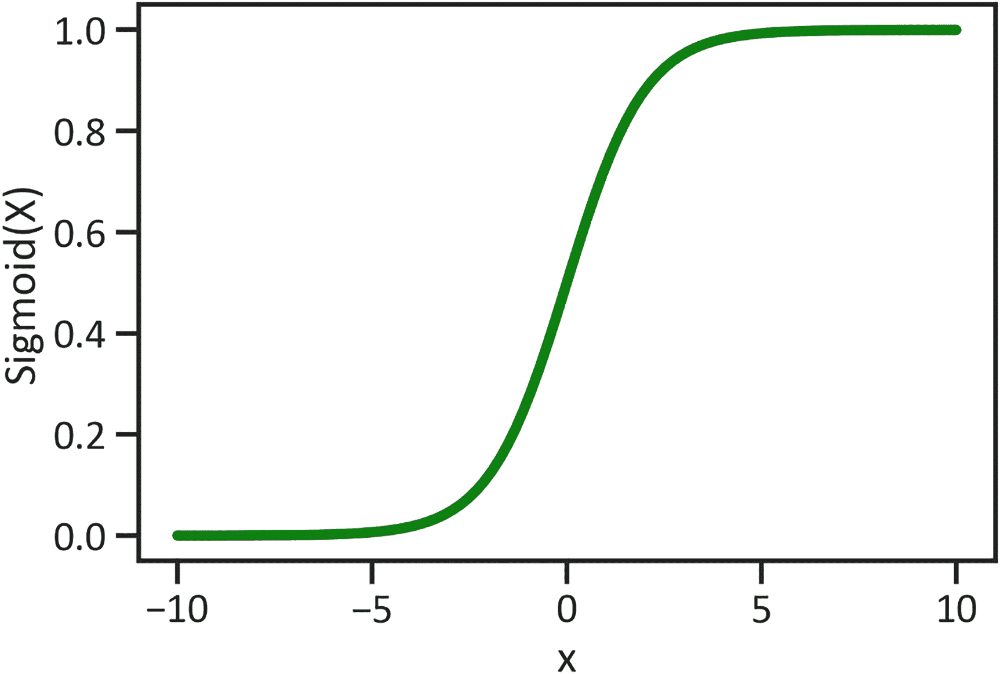

图 5-1

Sigmoid 函数

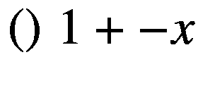

在线性回归中，响应变量是连续的。另一方面，在逻辑回归中，响应变量是二元的，并且可以应用于多类分类。此外，分类器不对数据的线性关系和正态性做出极端假设。

## 本章背景

本章通过应用一组其他经济指标——城市人口、人均国民总收入（Atlas 法，现价美元）和 GDP 增长（年百分比）——来预测南非出生时预期寿命（总年数）的增减。*人均国民总收入*是一个国家公民的平均国民收入，此处指南非的情况。表 5-1 概述了本章研究的南非宏观经济指标。

表 5-1

本章涉及的宏观经济指标

| 代码 | 指标 |
| --- | --- |
| `SP.URB.TOTL` | 南非城市人口 |
| `NY.GNP.PCAP.CD` | 南非人均国民总收入，Atlas 法（现价美元） |
| `NY.GDP.MKTP.KD.ZG` | 南非 GDP 增长（年百分比） |
| `SP.DYN.LE00.IN` | 南非出生时预期寿命，总计（年） |

## 理论框架

图 5-2 提供了本问题的框架。

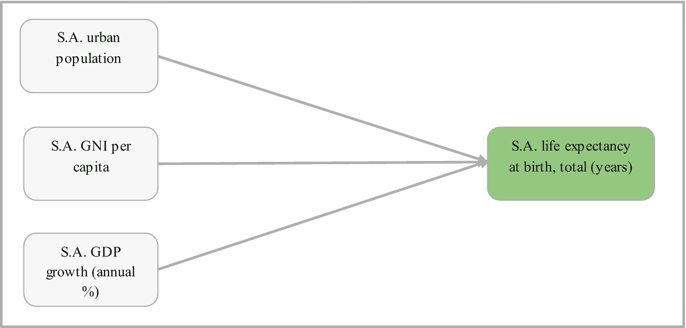

图 5-2

框架

### 城市人口

城市人口代表人口密度高的区域（即城市）中的人口。清单 5-1 和图 5-3 展示了南非的城市人口。

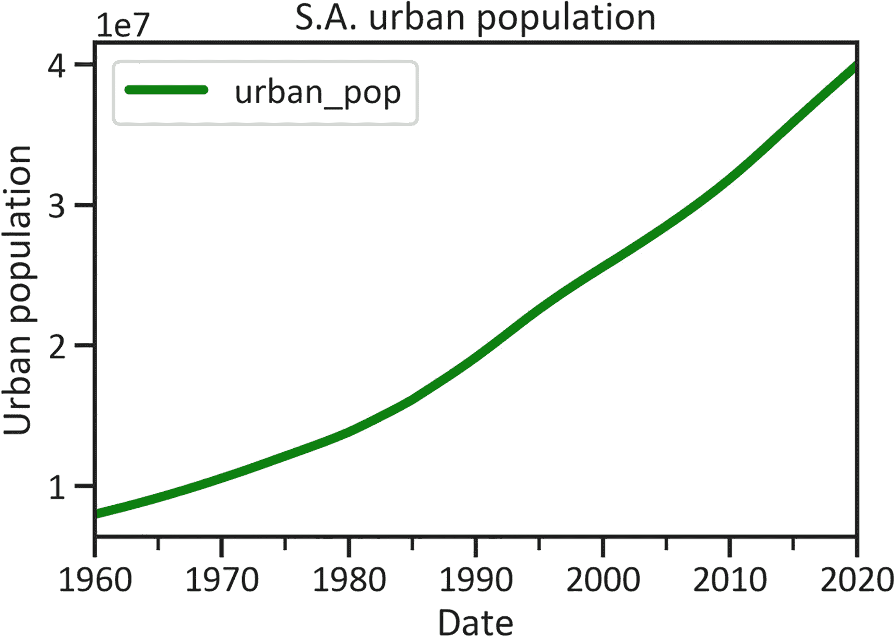

图 5-3

南非城市人口

```
import wbdata
country  = ["ZAF"]
indicators = {"SP.URB.TOTL":"urban_pop"}
urban_pop = wbdata.get_dataframe(indicators, country=country, convert_date=True)
urban_pop.plot(kind="line",color="green",lw=4)
plt.title("S.A. urban population")
plt.ylabel("Urban population")
plt.xlabel("Date")
plt.show()
```

清单 5-1

南非的城市人口

图 5-3 显示自 1960 年以来南非城市人口强劲增长。

### 人均国民总收入，Atlas 法

人均国民总收入代表一个国家公民的平均收入。在此示例中，我们应用 Atlas 法。清单 5-2 和图 5-4 展示了南非的人均国民总收入。

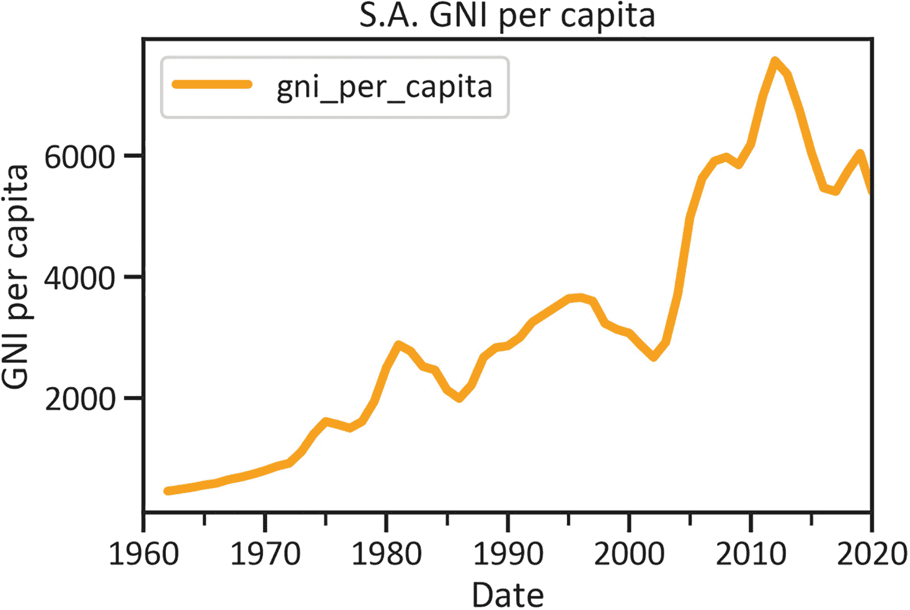

图 5-4

南非人均国民总收入

```
country  = ["ZAF"]
indicators = {"NY.GNP.PCAP.CD":"gni_per_capita"}
gni_per_capita = wbdata.get_dataframe(indicators, country=country, convert_date=True)
gni_per_capita.plot(kind="line",color="orange",lw=4)
plt.title("S.A. GNI per capita")
plt.ylabel("GNI per capita")
plt.xlabel("Date")
plt.show()
```

清单 5-2

南非的人均国民总收入

图 5-4 显示南非公民的平均收入总体呈极端上升趋势。该趋势在 2012 年有所下降，但随后在 2015 年再次飙升。

### 国内生产总值（GDP）增长

`GDP` 估算了一个国家居民每年消费的最终商品和服务的市场价值。它用于诊断经济的健康状况，因为它反映了一个国家的经济产出。清单 5-3 和图 5-5 展示了南非的 GDP 增长（年度百分比）。

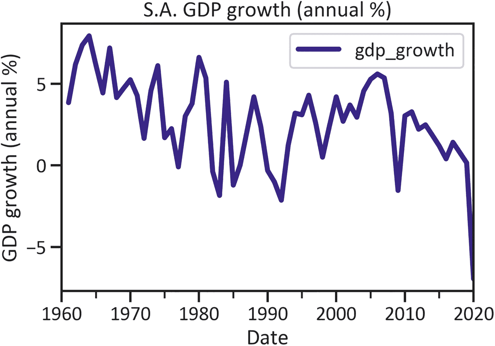

图 5-5 – 南非的 GDP 增长

```
country  = ["ZAF"]
indicators = {"NY.GDP.MKTP.KD.ZG":"gdp_growth"}
gdp_growth = wbdata.get_dataframe(indicators, country=country, convert_date=True)
gdp_growth.plot(kind="line",color="navy",lw=4)
plt.title("S.A. GDP growth (annual %)")
plt.ylabel("GDP growth (annual %)")
plt.xlabel("Date")
plt.show()
```

清单 5-3 – 南非的 GDP 增长

图 5-5 显示，南非生产的一般商品和服务的市场价值随时间推移而不稳定。在 1960 年至 2020 年间，其 GDP 增长经历了急剧下降，并在几年后趋于平稳。GDP 增长在 20 世纪 60 年代中期达到顶峰。它在 20 世纪 90 年代初出现了负增长，随后呈现上升趋势，但在 2008 年又出现了回调。

### 出生时预期寿命，总计（年）

预期寿命是指，在当前死亡率模式保持不变的情况下，一名新生儿预期能够生存的平均年数。清单 5-4 和图 5-6 展示了南非的出生时预期寿命（年）。

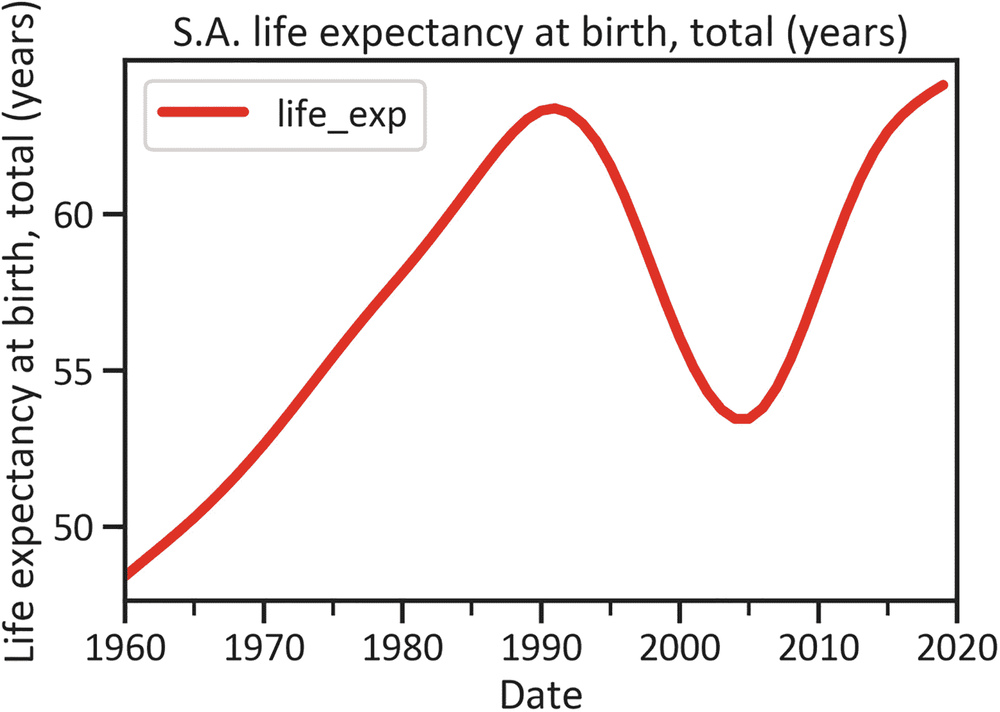

图 5-6 – 南非出生时预期寿命线图

```
country  = ["ZAF"]
indicators = {"SP.DYN.LE00.IN":"life_exp"}
life_exp = wbdata.get_dataframe(indicators, country=country, convert_date=True)
life_exp.plot(kind="line",color="red",lw=4)
plt.title("S.A. life expectancy at birth, total (years)")
plt.ylabel("Life expectancy at birth, total (years)")
plt.xlabel("Date")
plt.show()
```

清单 5-4 – 南非出生时预期寿命线图

现在您已经理解了问题，可以继续将感兴趣的经济指标加载到 `pandas` 数据框中了。清单 5-5 检索了表 5-2，其中列出了数据的前五行。

表 5-2 – 南非宏观经济数据

| 日期 | urban_pop | gni_per_capita | gdp_growth | life_exp |
| --- | --- | --- | --- | --- |
| 2020-01-01 | 39946775.0 | 5410.0 | -6.959604 | NaN |
| 2019-01-01 | 39149715.0 | 6040.0 | 0.152583 | 64.131 |

## 描述性统计

清单 5-7 检测了南非城市人口数据中是否存在异常值。它还调查了数据的分布情况（见图 5-7）。

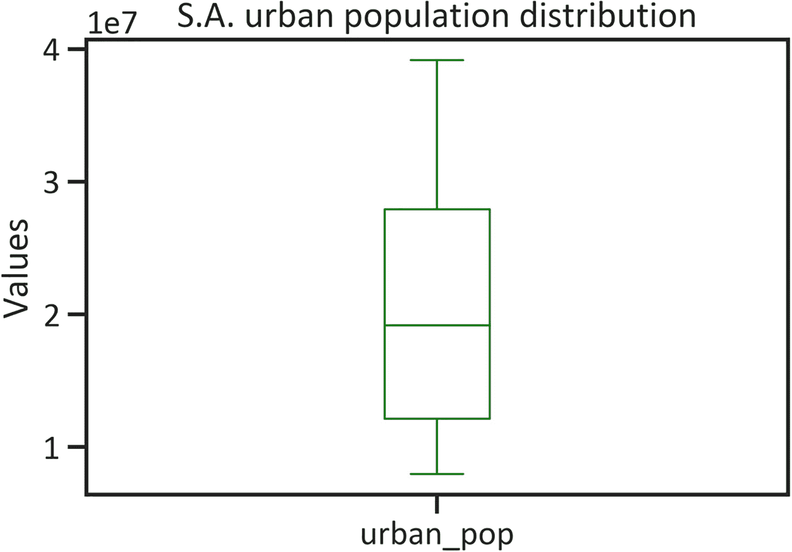

*图 5-7* – 南非城市人口分布

```python
df["urban_pop"].plot(kind="box",color="green")
plt.title("S.A. urban population distribution")
plt.ylabel("Values")
plt.show()
```

*清单 5-7* – 南非城市人口分布

图 5-7 显示，南非的城市人口数据接近正态分布。清单 5-8 检测了南非人均国民总收入（GNI）数据中是否存在异常值。它还调查了数据的分布情况（见图 5-8）。

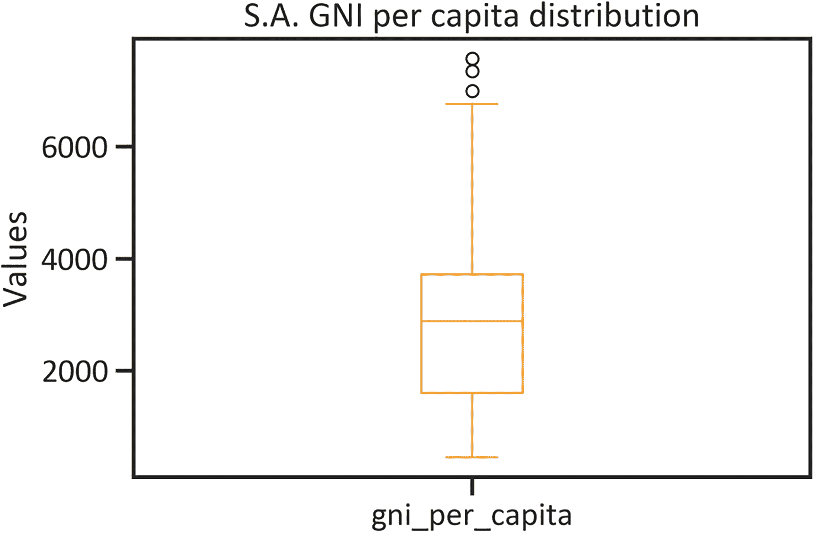

*图 5-8* – 南非人均国民总收入（GNI）分布

```python
df["gni_per_capita"].plot(kind="box",color="orange")
plt.title("S.A. GNI per capita distribution")
plt.ylabel("Values")
plt.show()
```

*清单 5-8* – 南非人均国民总收入（GNI）分布

图 5-8 显示，南非的人均国民总收入（GNI）数据呈正偏态分布。在 5000 数值之上有三个异常值。清单 5-9 用平均值替换了南非人均国民总收入（GNI）数据中的异常值（见图 5-9）。除了使用平均值替换数据外，您还可以应用其他技术，例如通过 k-最近邻（k-Nearest Neighbor）技术使用中位数值或缺失值附近的值。

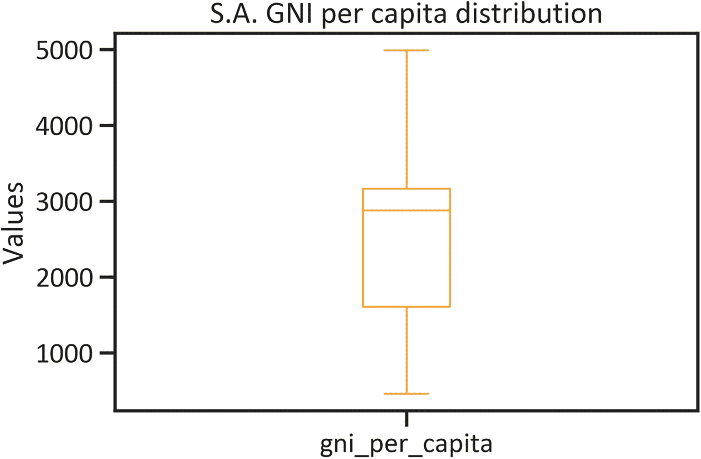

*图 5-9* – 南非人均国民总收入（GNI）分布

```python
df['gni_per_capita'] = np.where((df["gni_per_capita"] > 5000),df["gni_per_capita"].mean(),df["gni_per_capita"])
df["gni_per_capita"].plot(kind="box",color="orange")
plt.title("S.A. GNI per capita distribution")
plt.ylabel("Values")
plt.show()
```

*清单 5-9* – 用平均值替换异常值

清单 5-10 确定了南非 GDP 增长数据中是否存在异常值。它还调查了数据的分布情况（见图 5-10）。

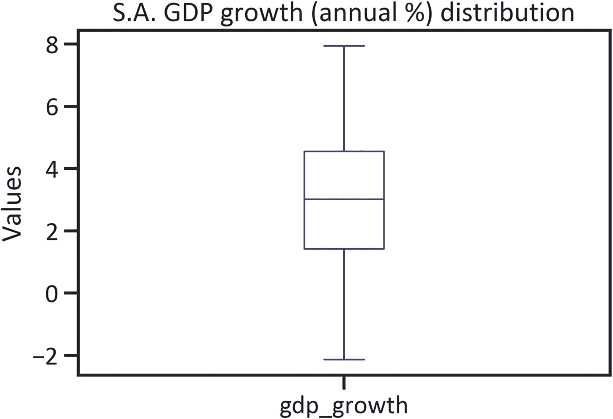

*图 5-10* – 南非 GDP 增长分布

```python
df["gdp_growth"].plot(kind="box",color="navy")
plt.title("S.A. GDP growth (annual %) distribution")
plt.ylabel("Values")
plt.show()
```

*清单 5-10* – 南非 GDP 增长分布

图 5-10 显示，南非的 GDP 增长数据呈正态分布，且没有异常值。清单 5-11 检测了南非出生时预期寿命数据中是否存在异常值。它还展示了数据的分布情况（见图 5-11）。

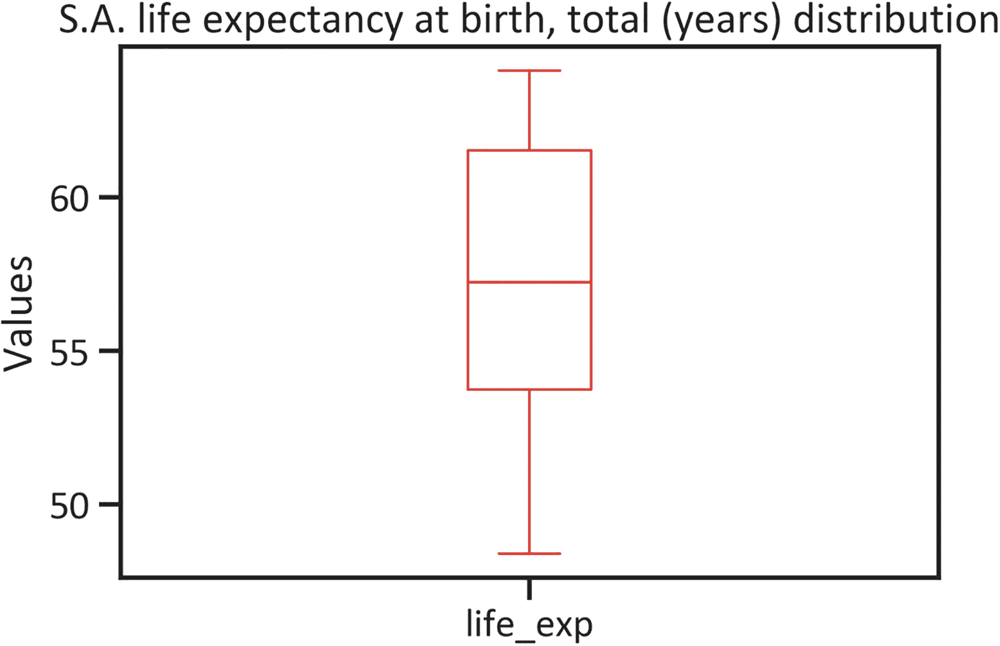

*图 5-11* – 南非出生时预期寿命分布

```python
df["life_exp"].plot(kind="box",color="red")
plt.title("S.A. life expectancy at birth, total (years) distribution")
plt.ylabel("Values")
plt.show()
```

*清单 5-11* – 南非出生时预期寿命分布

图 5-11 显示，南非出生时预期寿命数据近似正态分布，仅存在轻微偏斜。代码清单 5-12 生成的表格（见表 5-3）为我们提供了数据集中趋势和离散程度的信息。

**表 5-3：描述性统计摘要**

|   | 计数 | 均值 | 标准差 | 最小值 | 25%分位 | 50%分位 | 75%分位 | 最大值 |
|---|---|---|---|---|---|---|---|---|
| `urban_pop` | 61.0 | 2.081471e+07 | 9.698996e+06 | 7.971773e+06 | 1.212115e+07 | 1.914988e+07 | 2.850619e+07 | 3.994678e+07 |
| `gni_per_capita` | 61.0 | 2.473420e+03 | 1.074740e+03 | 4.600000e+02 | 1.610000e+03 | 2.880000e+03 | 3.200508e+03 | 4.990000e+03 |
| `gdp_growth` | 61.0 | 2.775881e+00 | 2.708735e+00 | -6.959604e+00 | 1.233520e+00 | 3.014549e+00 | 4.554553e+00 | 7.939782e+00 |
| `life_exp` | 61.0 | 5.724278e+01 | 4.571705e+00 | 4.840600e+01 | 5.374900e+01 | 5.724278e+01 | 6.154000e+01 | 6.413100e+01 |

```python
df.describe().transpose()
```

表 5-3 显示：

-   南非城市人口的平均值为 2.081471e+07。
-   按 Atlas 方法计算的人均国民总收入（GNI）为 2.473420e+03 美元。
-   GDP 增长率为 2.775881e+00。
-   出生时预期寿命为 5.724278e+01 年。
-   南非城市人口与均值的偏差为 9.698996e+06。
-   按 Atlas 方法计算的人均国民总收入与均值的偏差为 1.074740e+03。
-   GDP 增长率与均值的偏差为 2.708735e+00。
-   预期寿命与均值的偏差为 4.571705e+00。

## 协方差分析

代码清单 5-13 和表 5-4 展示了这些变量如何协同变化及其自身的变化情况。

**表 5-4：协方差矩阵**

|   | `urban_pop` | `gni_per_capita` | `gdp_growth` | `life_exp` |
|---|---|---|---|---|
| `urban_pop` | 9.407052e+13 | 7.610470e+09 | -1.099442e+07 | 2.381877e+07 |
| `gni_per_capita` | 7.610470e+09 | 1.155065e+06 | -1.089449e+03 | 2.658211e+03 |
| `gdp_growth` | -1.099442e+07 | -1.089449e+03 | 7.337248e+00 | -6.957400e+00 |
| `life_exp` | 2.381877e+07 | 2.658211e+03 | -6.957400e+00 | 2.090049e+01 |

```
dfcov = df.cov()
dfcov
```
代码清单 5-13：协方差矩阵

## 相关性分析

代码清单[5-14]使用皮尔逊相关系数法（见图[5-12]）计算相关系数。此方法适用于连续型数值。如果数值是分类数据，则必须应用肯德尔或斯皮尔曼相关方法。

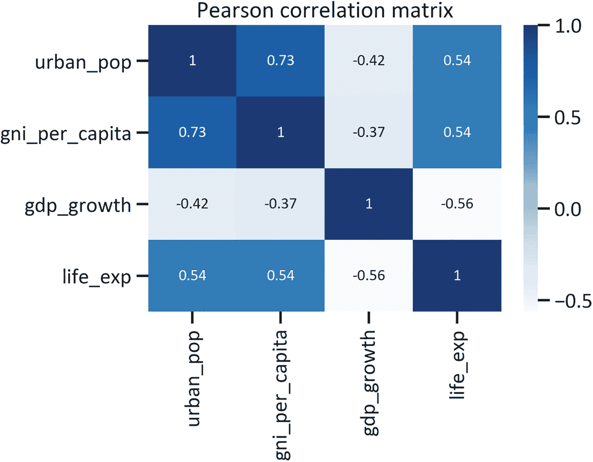

```
dfcorr = df.corr(method="pearson")
sns.heatmap(dfcorr, annot=True, annot_kws={"size":12},cmap="Blues")
plt.title("Pearson correlation matrix")
plt.show()
```
代码清单 5-14：皮尔逊相关矩阵

表[5-5]展示了图[5-12]中绘制的皮尔逊相关系数。

**表 5-5：皮尔逊相关矩阵解释**

| 变量 | 皮尔逊相关系数 | 发现 |
|---|---|---|
| 南非的城市人口与出生时预期寿命（年） | 0.54 | 南非城市人口与出生时预期寿命之间存在中等程度的正相关。 |
| 南非按 Atlas 方法计算的人均国民总收入与出生时预期寿命（年） | 0.54 | 南非按 Atlas 方法计算的人均国民总收入与出生时预期寿命之间存在中等程度的正相关。 |
| 南非的 GDP 增长率与出生时预期寿命（年） | -0.56 | 南非的 GDP 增长率与出生时预期寿命（年）之间存在中等程度的负相关。 |

图[5-13]绘制了这些变量之间的统计关联（见代码清单[5-15]）。

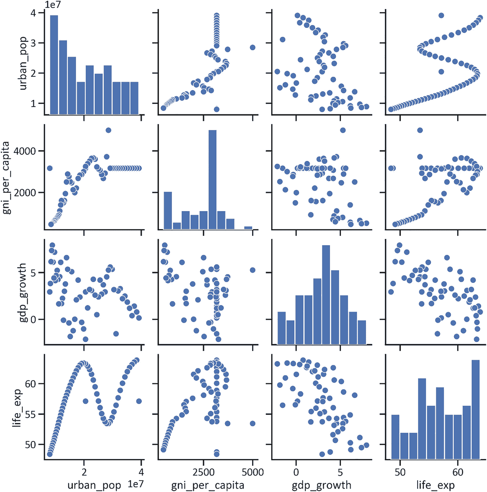

```
sns.pairplot(df)
```
代码清单 5-15：配对图

图[5-13]展示了数据中所有变量的直方图。与南非城市人口相关的数据略微左偏。按 Atlas 方法计算的人均国民总收入数据呈正态分布，但存在一个异常值。GDP 增长率数据呈正态分布，而预期寿命数据略微右偏。

## 相关程度检测

代码清单[5-16]和表[5-6]展示了变量之间相关性的严重程度。

**表 5-6：特征矩阵**

|   | 特征值 | `urban_pop` | `gni_per_capita` | `gdp_growth` | `life_exp` |
|---|---|---|---|---|---|
| `urban_pop` | 2.590423 | 0.526233 | 0.412356 | -0.693983 | -0.267261 |
| `gni_per_capita` | 0.738154 | 0.518674 | 0.477948 | 0.705191 | -0.072449 |
| `gdp_growth` | 0.266181 | -0.440609 | 0.719198 | -0.109331 | 0.525989 |
| `life_exp` | 0.405242 | 0.509823 | -0.290315 | -0.095601 | 0.804151 |

```
eigenvalues, eigenvectors = np.linalg.eig(dfcorr)
eigenvalues = pd.DataFrame(eigenvalues)
eigenvalues.columns = ["Eigen values"]
eigenvectors = pd.DataFrame(eigenvectors)
eigenvectors.columns = df.columns
eigenvectors = pd.DataFrame(eigenvectors)
eigenmatrix = pd.concat([eigenvalues, eigenvectors],axis=1)
eigenmatrix.index = df.columns
eigenmatrix
```
代码清单 5-16：特征矩阵

表[5-6]显示不存在多重共线性。我们将使用相应方法处理多重共线性问题。

### 降维

代码清单[5-17]和图[5-14]显示，第一个主成分的方差比率高于 2.5。数据中的大部分变异性，以及其他主成分的变异性，均低于 1.0。

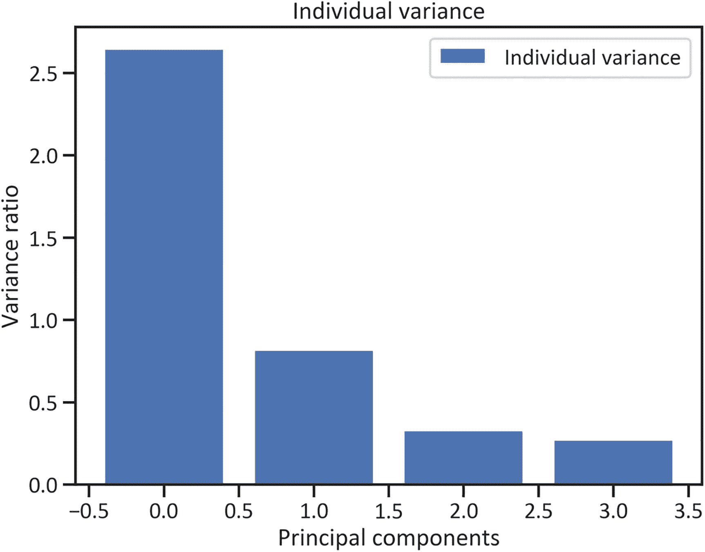

```
from sklearn.decomposition import PCA
from sklearn.preprocessing import StandardScaler
scaler = StandardScaler()
std_df = scaler.fit_transform(df)
pca = PCA()
pca.fit_transform(std_df)
pca_variance = pca.explained_variance_
plt.figure(figsize=(8, 6))
plt.bar(range(4), pca_variance, align="center", label="Individual variance")
plt.legend()
plt.ylabel("Variance ratio")
plt.xlabel("Principal components")
plt.title("Individual variance")
plt.show()
```
代码清单 5-17：个体方差

代码清单[5-18]应用主成分分析，对数据进行降维，使其能够绘制成二维散点图（见图[5-15]）。

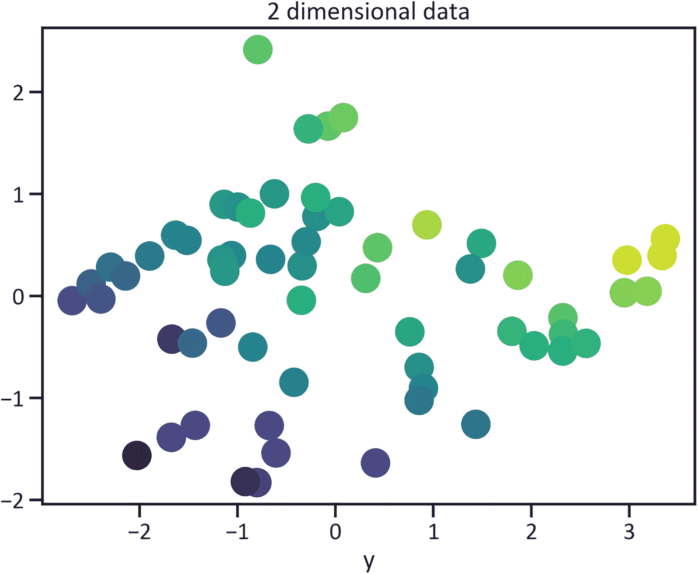

```
pca2 = PCA(n_components=2)
pca2.fit(std_df)
x_3d = pca2.transform(std_df)
plt.figure(figsize=(8,6))
plt.scatter(x_3d[:,0], x_3d[:,1], c=df['gdp_growth'],cmap="viridis",s=350)
plt.xlabel("y")
plt.title("2 dimensional data")
plt.show()
```
代码清单 5-18：降维

图[5-15]展示了数据降维后在二维散点图中的分布情况。

## 将连续变量转换为二值变量

清单 5-19 获取了南非出生时预期寿命的年度变化。接着，它确定了序列的方向。最后，它通过应用 `get_dummies()` 方法对响应变量进行了二值化处理。二值化一个方法意味着将其转换为分类变量（即“否”或“是”，其中将“否”编码为 `0`，“是”编码为 `1`）。

```
df['pct_change'] = df["life_exp"].pct_change()
df = df.dropna()
df['direction'] = np.sign(df['pct_change']).astype(int)
df["direction"] = pd.get_dummies(df["direction"])
df.head()
```
清单 5-19：对响应变量进行二值化处理

表 5-7 包含了两个新列：`pct_change` 和 `Direction`。在本章中，我们将 `Direction` 用作响应变量。我们不打算在此模型中涉及预期寿命和 `pct_change`，因此你可以删除这些列。

**表 5-7：新数据框**

| 日期 | urban_pop | gni_per_capita | gdp_growth | life_exp | pct_chage | Direction |
| --- | --- | --- | --- | --- | --- | --- |
| 2019-01-01 | 39149715.0 | 3200.508475 | 0.152583 | 64.131 | 0.120333 | 0 |
| 2018-01-01 | 38348227.0 | 3200.508475 | 0.787056 | 63.857 | -0.004273 | 1 |

| 2017-01-01 | 37540921.0 | 3200.508475 | 1.414513 | 63.538 | -0.004996 | 1 |
| 2016-01-01 | 36726640.0 | 3200.508475 | 0.399088 | 63.153 | -0.006059 | 1 |
| 2015-01-01 | 35905875.0 | 3200.508475 | 1.193733 | 62.649 | -0.007981 | 1 |

## 使用 Scikit-Learn 开发逻辑回归模型

本节通过应用 `scikit-learn` 库来训练逻辑分类器。清单 5-20 首先创建了 `X` 和 `Y` 数组，然后将数据拆分为训练数据和测试数据。接着，它对数据进行了标准化处理。

```python
from sklearn.preprocessing import StandardScaler
from sklearn.model_selection import train_test_split
x = df.iloc[::,0:3]
scaler = StandardScaler()
x= scaler.fit_transform(x)
y = df.iloc[::,-1]
x_train, x_test, y_train, y_test = train_test_split(x,y,test_size=0.2,random_state=0)
```

清单 5-20 数据预处理

清单 5-21 训练了逻辑分类器。

```python
from sklearn.linear_model import LogisticRegression
logregclassifier = LogisticRegression()
logregclassifier.fit(x_train,y_train)
```

清单 5-21 通过应用 Statsmodels 训练逻辑分类器

清单 5-22 和 5-23 估计了逻辑回归模型的截距和系数。

```python
logregclassifier.coef_
```

```
array([[-0.09342681, -1.02609323,  0.35329756]])
```

清单 5-23 系数

```python
logregclassifier.intercept_
```

```
array([1.47270205])
```

清单 5-22 截距

## 逻辑回归混淆矩阵

为了研究逻辑回归模型的性能，清单 5-24 创建了一个混淆矩阵（见表 5-8）。要评估一个分类模型，你需要应用与线性回归模型不同的评估指标。在分类问题中，你分析模型的准确率和精确度（见表 5-10）。初始步骤涉及构建混淆矩阵（见表 5-8）。

**表 5-8 逻辑分类器混淆矩阵**

|                 | 预测：预期寿命下降 | 预测：预期寿命上升 |
|-----------------|-------------------------------------------|-------------------------------------------|
| **实际：预期寿命下降** | 0                                         | 3                                         |
| **实际：预期寿命上升** | 1                                         | 8                                         |

```python
from sklearn import metrics
y_predlogregclassifier = logregclassifier.predict(x_test)
cmatlogregclassifier = pd.DataFrame(metrics.confusion_matrix(y_test,y_predlogregclassifier), index=["实际：预期寿命下降",
"实际：预期寿命上升"],
columns = ("预测：预期寿命下降",
"预测：预期寿命上升"))
cmatlogregclassifier
```

清单 5-24 逻辑分类器混淆矩阵

## 逻辑回归混淆矩阵解读

表 5-9 解读了表 5-8 的结果。

**表 5-9 逻辑分类器混淆矩阵解读**

| 指标 | 解读 |
|--------|----------------|
| 真正例 | 当南非的出生时预期寿命实际上在下降时，逻辑分类器未预测到下降。 |
| 真负例 | 逻辑分类器预测了出生时预期寿命上升，且实际上的确上升了（三次）。 |
| 假正例 | 当南非的出生时预期寿命实际在上升时，逻辑分类器预测了下降（一次）。 |
| 假负例 | 当南非的出生时预期寿命实际在下降时，逻辑分类器预测了上升（八次）。 |

## 逻辑回归分类报告

为了进一步研究逻辑回归模型的性能，清单 5-25 构建了一个分类报告（见表 5-10）。它概述了模型进行准确和精确估计的能力。

**表 5-10 逻辑回归分类报告**

|           | 0         | 1         | 准确率 | 宏平均 | 加权平均 |
|-----------|-----------|-----------|----------|-----------|--------------|
| 精确率 | 0.0       | 0.727273  | 0.666667 | 0.363636  | 0.545455     |
| 召回率    | 0.0       | 0.888889  | 0.666667 | 0.444444  | 0.666667     |
| F1 分数  | 0.0       | 0.800000  | 0.666667 | 0.400000  | 0.600000     |
| 支持度   | 3.0       | 9.000000  | 0.666667 | 12.000000| 12.000000    |

```python
creportlogregclassifier = pd.DataFrame(metrics.classification_report(y_test,y_predlogregclassifier,output_dict=True))
creportlogregclassifier
```

清单 5-25 逻辑回归分类报告

表 5-10 显示，逻辑分类器的准确率为 66.67%，而在预测预期寿命下降时，其最高精确率为 0%。在预测出生时预期寿命上升时，其精确率为 67%。

## 逻辑回归 ROC 曲线

清单 5-26 评估了逻辑回归分类器在区分南非出生时预期寿命的递增与递减时，灵敏度（FPR）与特异性（TPR）之间的权衡（见图 5-16）。

公式 5-2 定义了真阳性率：

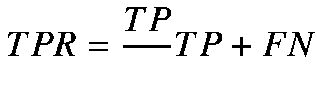

（公式 5-2）

其中 `TP` 是真阳性（分类器在事件发生时做出正确预测的倾向），`FP` 是假阳性（分类器在事件未发生时做出错误预测的倾向）。

公式 5-3 定义了真阳性率：

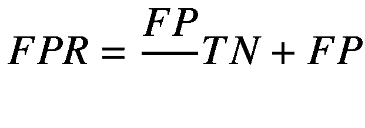

（公式 5-3）

```python
y_predlogregclassifier_proba = logregclassifier.predict_proba(x_test)[::,1]
fprlogregclassifier, tprlogregclassifier, _ = metrics.roc_curve(y_test,y_predlogregclassifier_proba)
auclogregclassifier = metrics.roc_auc_score(y_test,y_predlogregclassifier_proba)
fig, ax = plt.subplots()
plt.plot(fprlogregclassifier, tprlogregclassifier,label="auc: "+str(auclogregclassifier),color="navy",lw=4)
plt.plot([0,1],[0,1],color="red",lw=4)
plt.xlim([0.00,1.01])
plt.ylim([0.00,1.01])
plt.title("Logistic ROC curve")
plt.xlabel("Sensitivity")
plt.ylabel("Specificity")
plt.legend(loc=4)
plt.show()
```

清单 5-26 逻辑回归 ROC 曲线

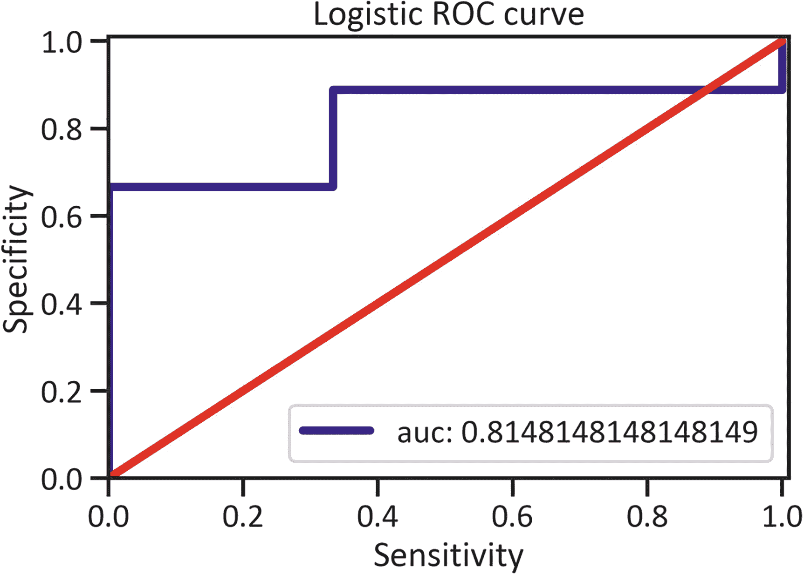

图 5-16 逻辑回归 ROC 曲线

为了检测逻辑回归是否是一个合适的类别预测器，需要研究曲线下面积（AUC）分数。如果该值超过 0.81，则该模型被认为是典范。图 5-16 显示，平均而言，逻辑回归分类器在预测南非预期寿命时准确率为 88.88%。

## 逻辑回归精确率-召回率曲线

清单 5-27 评估了逻辑回归分类器在区分南非预期寿命递增与递减时，精确率与阈值之间的权衡（见图 5-17）。

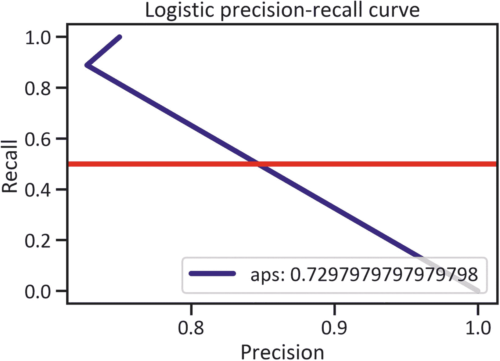

图 5-17 逻辑回归分类器精确率-召回率曲线

```
precisionlogregclassifier, recalllogregclassifier, thresholdlogregclassifier = metrics.precision_recall_curve(y_test,y_predlogregclassifier)
apslogregclassifier = metrics.average_precision_score(y_test,y_predlogregclassifier)
fig, ax = plt.subplots()
plt.plot(precisionlogregclassifier, recalllogregclassifier,label="aps: " +str(apslogregclassifier),color="navy",lw=4)
plt.axhline(y=0.5, color="red",lw=4)
plt.title("Logistic precision-recall curve")
plt.xlabel("Precision")
plt.ylabel("Recall")
plt.legend(loc=4)
plt.show()
```

清单 5-27 逻辑回归分类器精确率-召回率曲线

图 5-17 显示，平均而言，逻辑回归分类器在区分南非预期寿命递增与递减时，精确率为 69.44%。

## 逻辑回归学习曲线

清单 5-28 展示了逻辑回归分类器在区分南非出生时预期寿命递增与递减时，如何随着训练集大小的增加而学习正确区分（见图 5-18）。

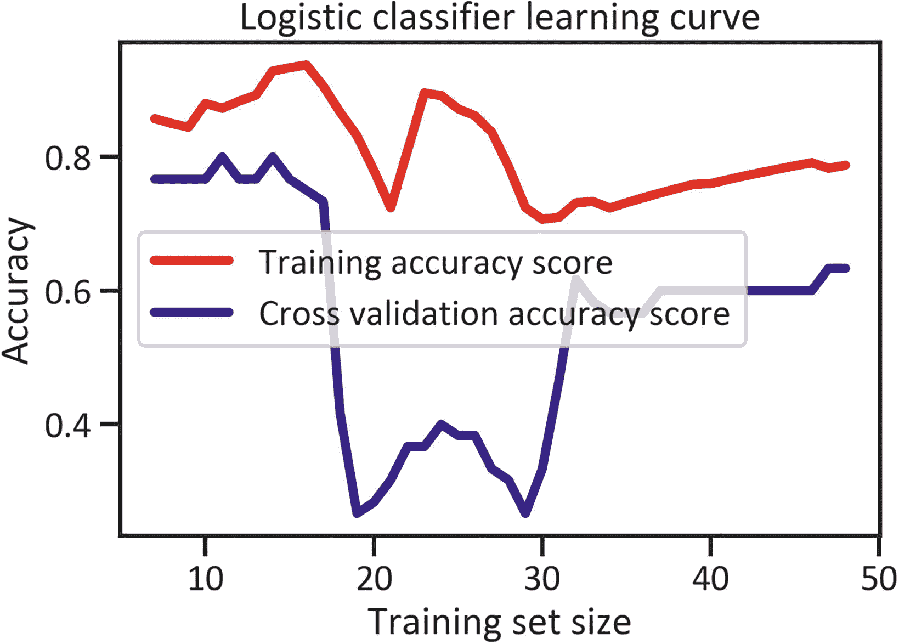

图 5-18 逻辑回归学习曲线

```
from sklearn.model_selection import learning_curve
trainsizelogregclassifier, trainscorelogregclassifier, testscorelogregclassifier = learning_curve(logregclassifier, x, y, cv=5, n_jobs=-1, scoring="accuracy", train_sizes=np.linspace(0.1,1.0,50))
trainscorelogregclassifier_mean = np.mean(trainscorelogregclassifier,axis=1)
trainscorelogregclassifier_std = np.std(trainscorelogregclassifier,axis=1)
testscorelogregclassifier_mean = np.mean(testscorelogregclassifier,axis=1)
testscorelogregclassifier_std = np.std(testscorelogregclassifier,axis=1)
fig, ax = plt.subplots()
plt.plot(trainsizelogregclassifier, trainscorelogregclassifier_mean, color="red", label="Training accuracy score",lw=4)
plt.plot(trainsizelogregclassifier, testscorelogregclassifier_mean,color="navy",label="Cross validation accuracy score",lw=4)
plt.title("Logistic classifier learning curve")
plt.xlabel("Training set size")
plt.ylabel("Accuracy")
plt.legend(loc="best")
plt.show()
```

清单 5-28 逻辑回归学习曲线

图 5-18 显示，在前十个数据点之后，交叉验证准确率分数下降——在第 20 个数据点处达到最低点——之后又急剧上升。此外，它还显示，在前十个数据点之后，训练准确率分数普遍高于交叉验证准确率分数。

### 结论

本章将响应变量二值化，其中 0 表示预期寿命下降，`1` 表示预期寿命上升。它使用逻辑回归分类器对一组预测变量（南非城市人口、人均 GNI（阿特拉斯法）和 GDP 增长）进行操作，以预测预期寿命的未来类别。

在研究了该模型的结果后，我们发现它在预测响应变量（南非预期寿命）的未来类别方面表现卓越。第 8 章通过应用深度学习模型来处理相同的问题。第 6 章涵盖了通过应用无监督模型来解决计量经济学中的序列问题。