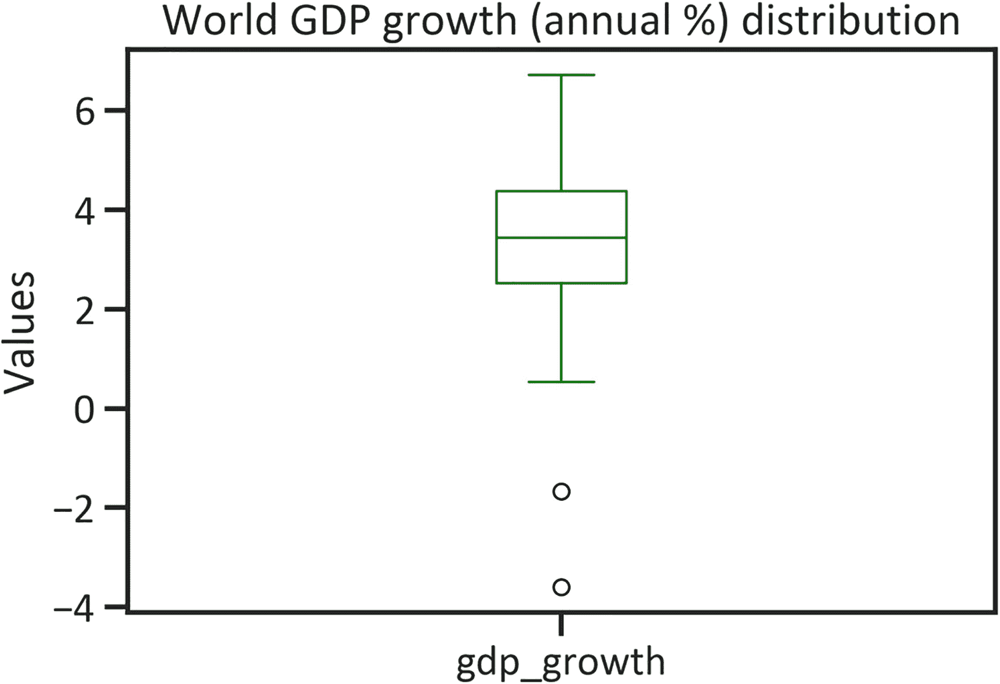
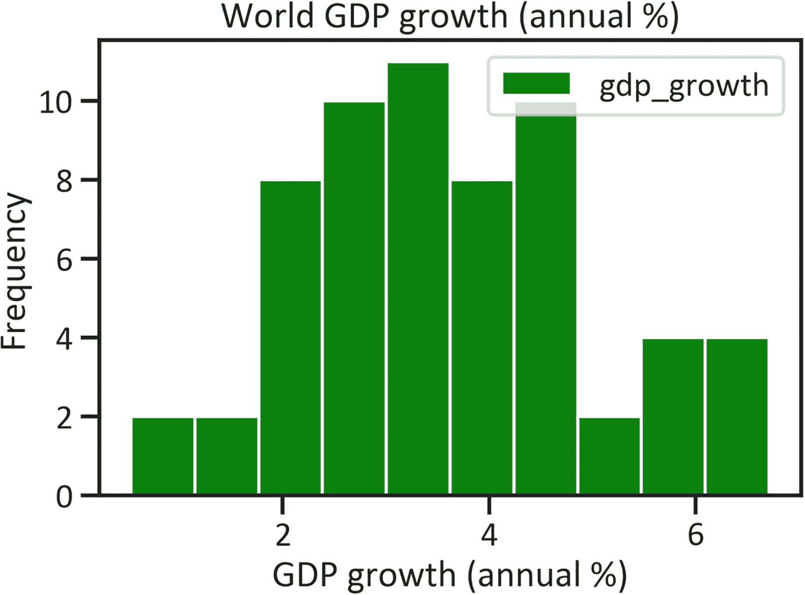
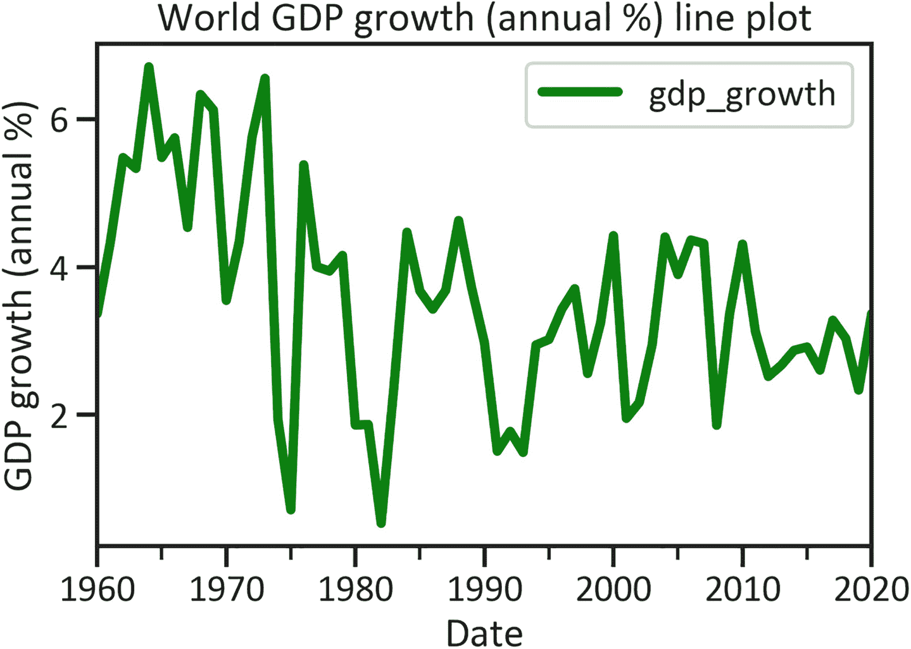
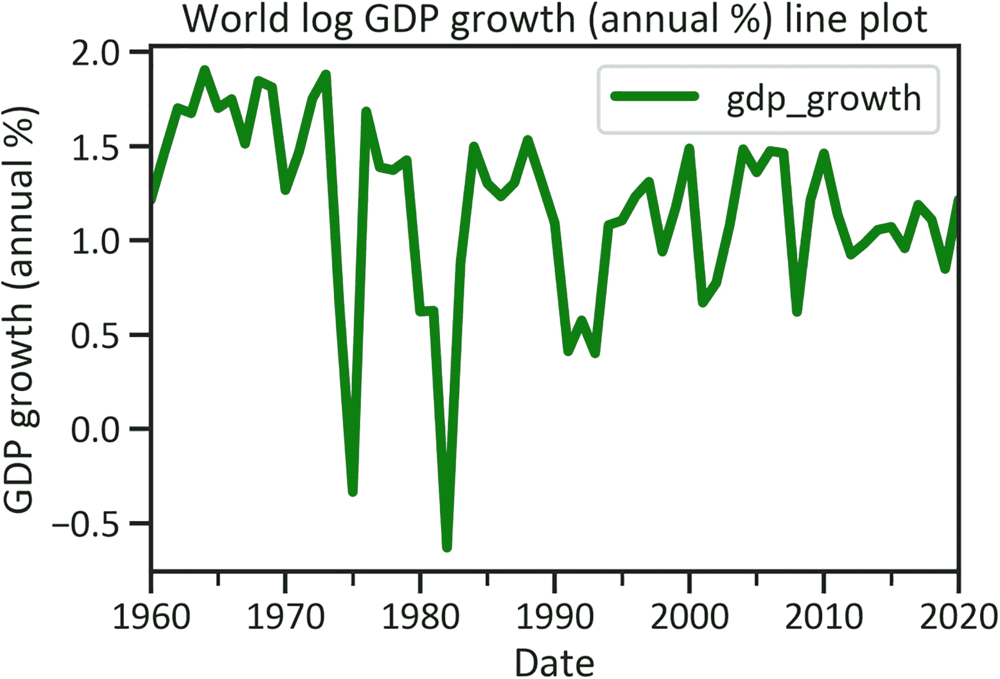
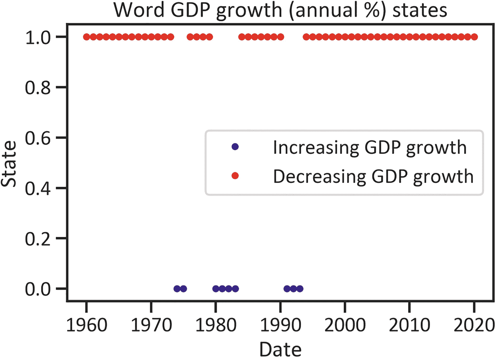
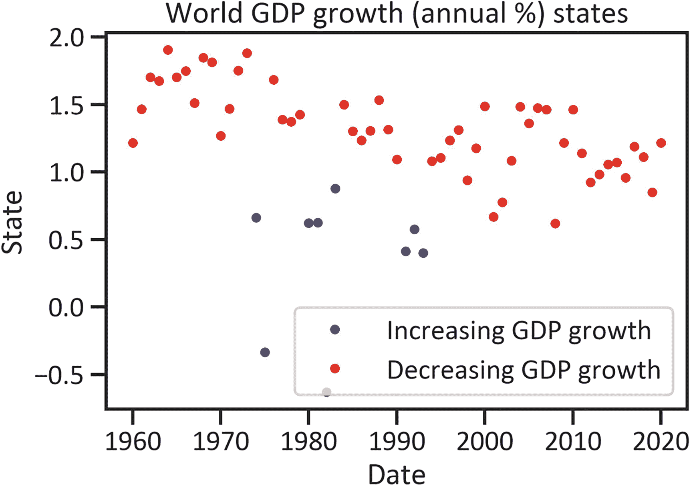
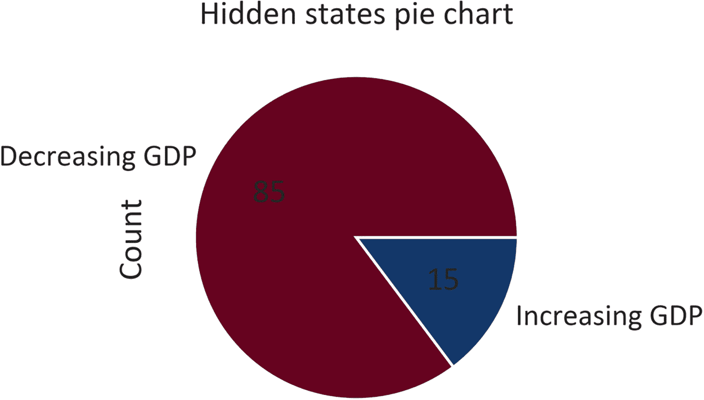
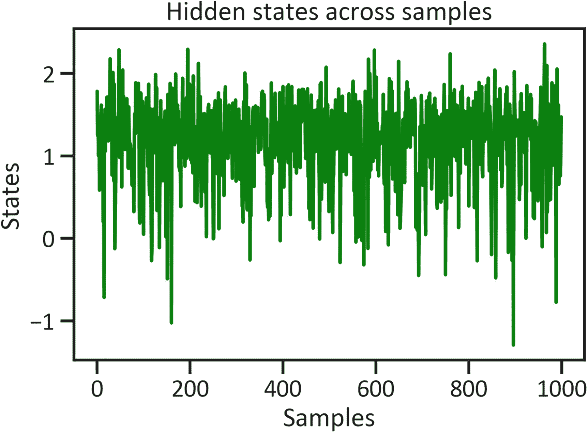

# 6. 发现世界经济与增长中的隐藏模式

本章介绍使用隐马尔可夫模型（HMM）进行决策制定。具体来说，它侧重于高斯混合模型，这是一种用于时间序列数据的无监督机器学习隐马尔可夫模型。该模型的美妙之处在于它对非平稳数据不敏感。阅读完本章后，您将更好地理解高斯混合模型的工作原理，并知道如何开发一个模型。请注意，HMM 是一个无监督学习器，这意味着您可以在没有任何预设研究假设的情况下进行研究。

本章假设有两个类别，在马尔可夫决策中称为*状态*。一个序列包含连续值，有时您会对序列进行分类。例如，您可以将一个序列归类为“上升趋势”或“下降趋势”，其中状态`0`代表上升趋势，状态`1`代表下降趋势。这就是马尔可夫建模的用武之地。马尔可夫建模涉及对当前状态和先前状态的顺序识别，然后对未来的状态进行建模预测。尽管它是发现序列中隐藏状态的一种有用方法，但用于评估模型的指标不足——您最多只能得到每个状态的均值和协方差。

在继续之前，请确保您的环境中安装了`hmmlearn`库。要在 Python 环境中安装`hmmlearn`库，请使用`pip install hmmlearn`。同样，要在 Conda 环境中安装该库，请使用`conda install -c conda-forge hmmlearn`。


## 应用隐马尔可夫模型

隐马尔可夫模型能确定序列中的前一个隐藏状态，并预测未来的隐藏状态。在本书中，我们将隐藏状态视为类别。前一章介绍了使用时序数据解决序列问题的方法，此外还简要涵盖了二分类和线性回归。本章将开发一个高斯混合模型来预测两种状态（全球 GDP 增长下降和全球 GDP 增长上升）。高斯混合模型会默认对数据做出一些假设。当你看到“高斯”这个词时，请联想到*正态性*（变量围绕真实均值分布）。该方法将高斯分布分成两半，然后确定某个值落入特定状态的概率。这个过程是逐步进行的。

总之，本例研究全球 GDP 增长（年度百分比）中的隐藏模式，即其是下降还是上升。然后应用该模型来预测特定年份全球 GDP 增长是下降还是上升。参见代码清单 6-1 和表 6-1。

表 6-1

世界经济增长数据

| 日期 | `gdp_growth` |
| --- | --- |
| 2020-01-01 | -3.593456 |
| 2019-01-01 | 2.335558 |
| 2018-01-01 | 3.034061 |
| 2017-01-01 | 3.281329 |
| 2016-01-01 | 2.605572 |

```
import wbdata
country  = ["WLD"]
indicators = {"NY.GDP.MKTP.KD.ZG":"gdp_growth"}
df = wbdata.get_dataframe(indicators, country=country, convert_date=True)
df["gdp_growth"] = df["gdp_growth"].fillna(df["gdp_growth"].mean())
df.head()
代码清单 6-1
加载全球 GDP 增长数据
```

## 描述性统计

图 6-1 使用代码清单 6-2 中的代码展示了全球 GDP 增长数据的分布。



图 6-1

全球 GDP 增长分布与异常值检测

```
df.plot(kind="box",color="green")
plt.title("World GDP growth (annual %) distribution")
plt.ylabel("Values")
plt.show()
代码清单 6-2
世界经济增长分布与异常值检测
```

图 6-1 显示，全球 GDP 增长数据（年度百分比）的分布呈正态分布，但在负轴方向上存在异常值。代码清单 6-3 返回了同样展示该分布的图 6-2。另请参见代码清单 6-4。



图 6-2

全球 GDP 增长分布

```
df.plot(kind="hist", color="green")
plt.title("World GDP growth (annual %)")
plt.xlabel("GDP growth (annual %)")
plt.show()
代码清单 6-4
全球 GDP 增长分布
```

```
import numpy as np
df['gdp_growth'] = np.where((df["gdp_growth"] < -1),df["gdp_growth"].mean(),df["gdp_growth"])
代码清单 6-3
异常值移除
```

图 6-2 证实了这种正态分布。表 6-2 使用代码清单 6-5 中的命令概述了集中趋势和离散程度的估计值。

表 6-2

全球 GDP 增长描述性统计

| 变量 | `gdp_growth` |
| --- | --- |
| 计数 | 61.000000 |
| 均值 | 3.566094 |
| 标准差 | 1.410267 |
| 最小值 | 0.532137 |
| 25% 分位数 | 2.605572 |
| 50% 分位数 | 3.430696 |
| 75% 分位数 | 4.367087 |
| 最大值 | 6.710726 |

```
df.describe()
代码清单 6-5
全球 GDP 增长描述性统计
```

表 6-2 显示，全球 GDP 增长的均值是 3.566094，独立观测值与均值的偏差为 1.410267。同样，全球经济产出的最小变化是 0.532137，最大值是 6.710726。图 6-3 根据代码清单 6-6 中的代码绘制了全球 GDP 增长的折线图。



图 6-3

全球 GDP 增长折线图

```
df.plot(color="green",lw=4)
plt.title("World GDP growth (annual %) line plot")
plt.xlabel("Date")
plt.ylabel("GDP growth (annual %)")
plt.show()
代码清单 6-6
全球 GDP 增长折线图
```

图 6-3 展示了全球 GDP 增长的不稳定性。我们经历了 1963 年最高的 GDP 增长（6.713557）和 1982 年最低的增长（0.423812）。图 6-4 使用代码清单 6-7 中的代码显示了对数 GDP 增长。



图 6-4

全球对数 GDP 增长折线图

```
import pandas as pd
log_df = np.log(df)
log_df = pd.DataFrame(log_df)
log_df.plot(color="green",lw=4)
plt.title("World log GDP growth (annual %) line plot")
plt.xlabel("Date")
plt.ylabel("GDP growth (annual %)")
plt.show()
代码清单 6-7
全球对数 GDP 增长折线图
```

## 高斯混合模型开发

代码清单 6-8 编写了高斯混合模型的代码。该模型假设数据来自正态分布。

```
old_log_df= pd.DataFrame(log_df)
log_df = log_df.values
x = np.column_stack([log_df])
from hmmlearn import hmm
model = hmm.GaussianHMM(n_components=2, tol=0.0001, n_iter=10)
model.fit(x)
代码清单 6-8
模型开发
```

代码清单 6-9 中的代码生成了序列中的隐藏状态（见表 6-3）。

表 6-3

隐藏状态

| 日期 | `hidden_states` |
| --- | --- |
| 2020-01-01 | 1 |
| 2019-01-01 | 1 |
| 2018-01-01 | 1 |
| 2017-01-01 | 1 |
| 2016-01-01 | 1 |

```
hidden_states = pd.DataFrame(model.predict(x), columns = ["hidden_states"])
hidden_states.index = old_log_df.index
hidden_states.head()
代码清单 6-9
生成隐藏状态
```


## 以图形化方式表示隐状态

要理解表 6-3，请参考图 6-5。该过程的代码如代码清单 6-10 所示。



图 6-5  
世界 GDP 增长的隐状态

```
increasing_gdp = hidden_states.loc[hidden_states.values == 0]
decreasing_gdp = hidden_states.loc[hidden_states.values == 1]
fig, ax = plt.subplots()
plt.plot(increasing_gdp.index,increasing_gdp.values,".",linestyle="none",color= "navy",label = "Increasing GDP growth")
plt.plot(decreasing_gdp.index, decreasing_gdp.values,".",linestyle="none",color = "red",label = "Decreasing GDP growth")
plt.title("World GDP growth (annual %) states")
plt.xlabel("Date")
plt.ylabel("State")
plt.legend(loc="best")
plt.show()
```

代码清单 6-10  
世界 GDP 增长状态

代码清单 6-11 返回一个散点图，展示了隐状态的分布情况（见图 6-6）。



图 6-6  
世界 GDP 增长状态散点图

```
mk_data = old_log_df.join(hidden_states,how = "inner")
mk_data = mk_data[["gdp_growth","hidden_states"]]
up = pd.Series()
down = pd.Series()
mid = pd.Series()
for tuple in mk_data.itertuples():
if tuple.hidden_states == 0:
x = pd.Series(tuple.gdp_growth,index = [tuple.Index])
up = up.append(x)
else:
x = pd.Series(tuple.gdp_growth,index = [tuple.Index])
down = down.append(x)
up = up.sort_index()
down = down.sort_index()
fig, ax = plt.subplots()
plt.plot(up.index, up.values, ".", c = "navy",label = "Increasing GDP growth")
plt.plot(down.index, down.values,".",c = "red",label = "Decreasing GDP growth")
plt.title("World GDP growth (annual %) overall")
plt.xlabel("Date")
plt.ylabel("State")
plt.legend(loc="best")
plt.show()
```

代码清单 6-11  
世界 GDP 增长状态散点图

代码清单 6-12 统计了序列中的隐状态数量，并以饼图形式展示（见图 6-7）。



图 6-7  
世界 GDP 增长隐状态饼图

```
binarized_markov = pd.DataFrame(mk_data["hidden_states"])
binarized_markov["hidden_states"]
binarized_markov_data = binarized_markov.replace({0: "Increasing GDP",1: "Decreasing GDP"})
binarized_markov_data = binarized_markov_data.reset_index()
class_series = binarized_markov_data.groupby("hidden_states").size()
class_series.name = "Count"
class_series.plot.pie(autopct="%2.f",cmap="RdBu")
plt.title("Hidden states pie chart")
plt.show()
```

代码清单 6-12  
隐状态计数

图 6-7 显示，预测值中 15%为 GDP 增长上升，85%为下降。代码清单 6-13 绘制了随机生成样本中的隐状态分布（图 6-8）。



图 6-8  
各样本中的隐状态

```
num_sample = 1000
sample, _ = model.sample(num_sample)
plt.plot(np.arange(num_sample), sample[:,0],color="green")
plt.title("Hidden states across samples")
plt.xlabel("Samples")
plt.ylabel("States")
plt.show()
```

代码清单 6-13  
各样本中的隐状态

要理解这些结果，你需要更仔细地审视各个组成部分。代码清单 6-14 研究了每个阶数的均值和方差。

### 阶数隐状态

```
for i in range(model.n_components):
print("{0} order hidden state".format(i))
print"mean =", model.means_[i])
print"var =", np.diag(model.covars_[i]))
print()
0 order hidden state
0 order hidden state
mean =  [0.58952373]
var =  [0.30547955]
1 order hidden state
mean =  [1.33696442]
var =  [0.0882703]
```

代码清单 6-14  
马尔可夫分量

在`0`阶隐状态中，均值为`0.58952373`，方差为`0.30547955`。在`1`阶隐状态中，均值为`1.33696442`，方差为`0.0882703`。

### 结论

本章介绍了高斯混合模型，这是一种隐马尔可夫模型（HMM）。鉴于状态数量是预定义的（其中`0`代表第一种状态，`1`代表第二种状态），我们使用两个分量来探索该模型。然后，我们将该模型应用于世界 GDP 增长（年百分比）的序列数据，以预测未来状态。

