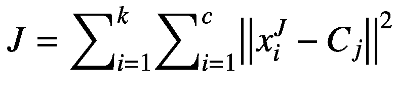
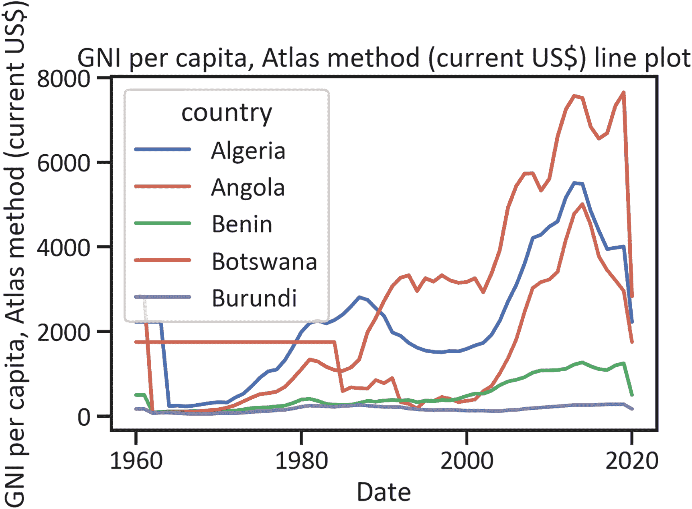
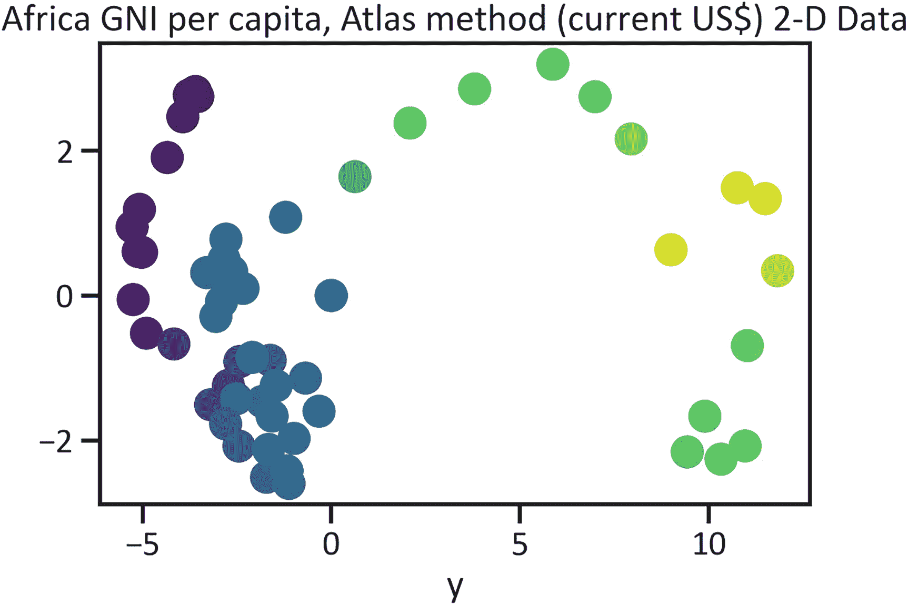
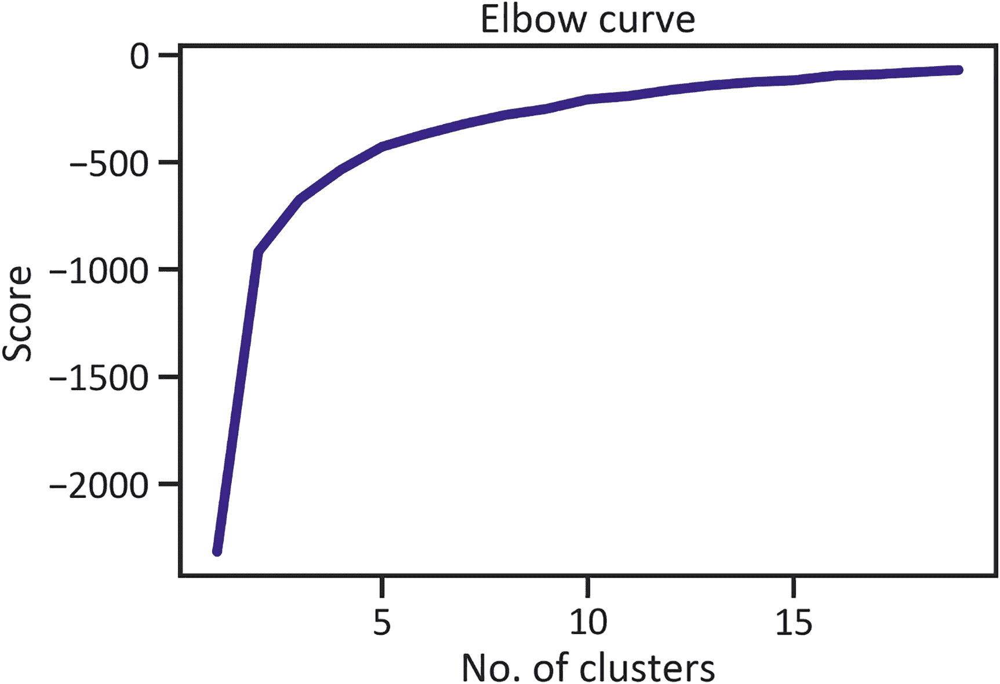
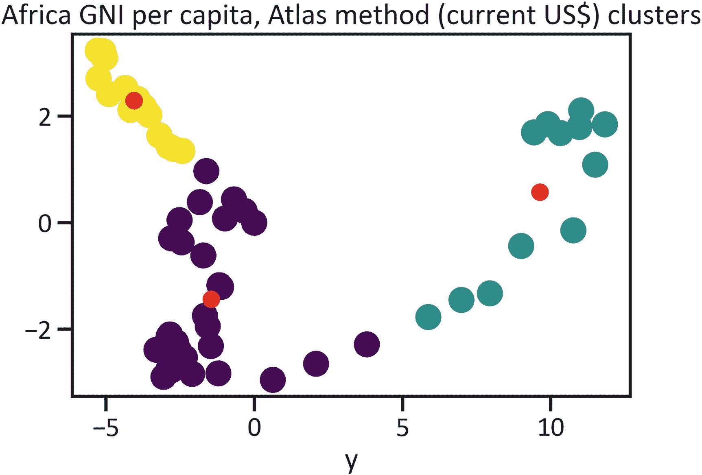
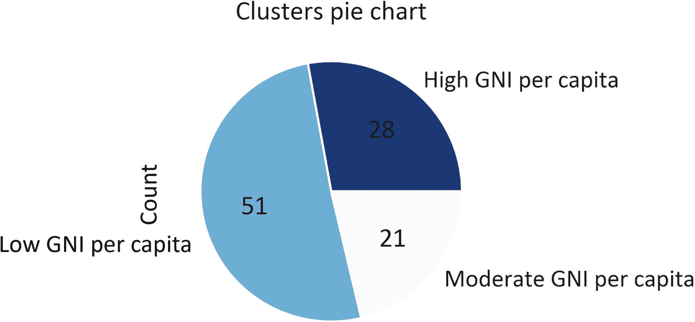

# 7. 按大洲层级对人均国民总收入进行聚类

本章介绍无监督机器学习。在无监督机器学习中，你不会分割数据，而是将整个数据集呈现给模型，让模型自行发现数据中的模式，无需任何监督。鉴于本章涵盖聚类分析，因此将介绍最简单的无监督机器学习模型，称为*k-means*。`k-means`方法易于理解。在进行聚类分析时，没有真正的响应变量——你以同样的方式处理所有变量。也没有预测变量，因此不存在预测/预报的情况。你仅需分析数据中的模式。

`k-means`模型根据值的相似性对其进行分组。首先，模型找出彼此接近的值，并估计它们之间的距离。然后，确定这组值的中心，并以某种方式拉伸这些值，使它们都落在同一个簇内。它通过实施距离估计来寻找组内的相似性。最常见的距离估计方法是欧几里得距离估计。公式 7-1 展示了欧几里得方程。



（公式 7-1）

其中，`J`代表目标函数，`k`代表聚类数量，`n`代表案例数量，`x_i^J`代表*案例*[*j*]，`C[j]`代表`j`的质心。

该模型与其他模型的不同之处在于，它假设你是基于数据分析来确定聚类数量。要确定聚类数量，你可以应用肘部曲线或碎石图。


## 本章背景

本章基于数据中存在三个簇的假设来探讨问题。它通过应用以下三个标签对非洲国家进行分组：

- 低人均国民总收入（GNI）
- 中等人均国民总收入
- 高人均国民总收入

本章运用肘部曲线来判断关于数据的这一假设是否正确，然后对非洲国家的全部人均国民总收入数据使用 k-means 模型。由于存在众多变量，因此并未描述全部数据。

要进行聚类分析，首先需要执行描述性分析，然后进行降维处理，将高维数据降至少数几个维度。前面的章节介绍了名为主成分分析（PCA）的降维技术。该技术能缩减数据，使你能够通过应用散点图以二维形式呈现数据。清单 7-1 获取了本章所需的人均国民总收入数据（见表 7-1）。

**表 7-1** 非洲人均国民总收入数据

| 国家 | 年份 | `gni_per_capita` |
| --- | --- | --- |
| 安哥拉 | 2020 | 2230.0 |
| | 2019 | 2970.0 |
| | 2018 | 3210.0 |
| | 2017 | 3450.0 |
| | 2016 | 3770.0 |

```python
import wbdata
countries = ["AGO", "BDI", "BEN", "BWA", "CAF", "CIV",
"COD", "DZA", "EGY", "ETH", "GAB", "GHA",
"GIN", "GMB", "GNQ", "KEN", "LBR", "LBY",
"LSO", "MAR", "MLI", "MOZ", "MWI", "NAM",
"NER", "NGA", "RWA", "SDN", "SEN","SOM",
"SWZ", "TCD", "TUN", "TZA", "UGA", "ZAF",
"ZMB", "ZWE"]
indicators = {"NY.GNP.PCAP.CD":"gni_per_capita"}
df = wbdata.get_dataframe(indicators, country=countries, convert_date=False)
df.head()
```

*清单 7-1 加载非洲人均国民总收入数据*

清单 7-2 对数据进行了解堆叠操作——将索引从多重索引变为单一索引。

```python
df = df["gni_per_capita"]
df = df.unstack(level=0)
```

*清单 7-2 解堆叠数据*

清单 7-3 用平均值替换了缺失值。请注意，本示例并未处理异常值。鉴于变量众多，在此简单示例中处理异常值会相当繁琐。在现实世界中，处理异常值至关重要，因为它们可能会对结论产生负面影响。

```python
df["Algeria"] = df["Algeria"].fillna(df["Algeria"].mean())
df["Angola"] = df["Angola"].fillna(df["Angola"].mean())
df["Benin"] = df["Benin"].fillna(df["Benin"].mean())
df["Botswana"] = df["Botswana"] .fillna(df["Botswana"] .mean())
df["Burundi"] = df["Burundi"].fillna(df["Burundi"] .mean())
df["Central African Republic"] = df["Central African Republic"].fillna(df["Central African Republic"].mean())
df["Chad"] = df["Chad"].fillna(df["Chad"].mean())
df["Congo, Dem. Rep."] = df["Congo, Dem. Rep."].fillna(df["Congo, Dem. Rep."].mean())
df["Cote d'Ivoire"] = df["Cote d'Ivoire"].fillna(df["Cote d'Ivoire"].mean())
df["Egypt, Arab Rep."] = df["Egypt, Arab Rep."].fillna(df["Egypt, Arab Rep."].mean())
df["Equatorial Guinea"] = df["Equatorial Guinea"].fillna(df["Equatorial Guinea"].mean())
df["Eswatini"] = df["Eswatini"].fillna(df["Eswatini"].mean())
df["Ethiopia"] = df["Ethiopia"].fillna(df["Ethiopia"].mean())
df["Gabon"] = df["Gabon"].fillna(df["Gabon"].mean())
df["Gambia, The"] = df["Gambia, The"].fillna(df["Gambia, The"].mean())
df["Ghana"] = df["Ghana"].fillna(df["Ghana"].mean())
df["Guinea"] = df["Guinea"].fillna(df["Guinea"].mean())
df["Kenya"] = df["Kenya"].fillna(df["Kenya"].mean())
df["Lesotho"] = df["Lesotho"].fillna(df["Lesotho"].mean())
df["Liberia"] = df["Liberia"].fillna(df["Liberia"].mean())
df["Libya"] = df["Libya"].fillna(df["Libya"].mean())
df["Malawi"] = df["Malawi"].fillna(df["Malawi"].mean())
df["Mali"] = df["Mali"].fillna(df["Mali"].mean())
df["Morocco"] = df["Morocco"].fillna(df["Morocco"].mean())
df["Mozambique"] = df["Mozambique"] .fillna(df["Mozambique"].mean())
df["Namibia"] = df["Namibia"].fillna(df["Namibia"].mean())
df["Niger"] = df["Niger"].fillna(df["Niger"].mean())
df["Nigeria"] = df["Nigeria"].fillna(df["Nigeria"].mean())
df["Rwanda"] = df["Rwanda"].fillna(df["Rwanda"].mean())
df["Senegal"] = df["Senegal"].fillna(df["Senegal"].mean())
df["Somalia"] = df["Somalia"].fillna(df["Somalia"].mean())
df["South Africa"] = df["South Africa"].fillna(df["South Africa"].mean())
df["Sudan"] = df["Sudan"].fillna(df["Sudan"].mean())
df["Tanzania"] = df["Tanzania"].fillna(df["Tanzania"].mean())
df["Tunisia"] = df["Tunisia"].fillna(df["Tunisia"].mean())
df["Uganda"] = df["Uganda"].fillna(df["Uganda"].mean())
df["Zambia"] = df["Zambia"].fillna(df["Zambia"].mean())
df["Zimbabwe"] = df["Zimbabwe"].fillna(df["Zimbabwe"].mean())
```

*清单 7-3 用平均值替换异常值*

## 描述性统计

清单 7-4 中的命令获取了表 7-2，该表展示了数据的集中趋势和离散程度。

**表 7-2** 描述性统计


| 国家 | 计数 | 均值 | 标准差 | 最小值 | 25% 分位数 | 50% 分位数 | 75% 分位数 | 最大值 |
| --- | --- | --- | --- | --- | --- | --- | --- | --- |
| 阿尔及利亚 | 61.0 | 2180.169492 | 1482.758119 | 190.0 | 1100.000000 | 1980.000000 | 2810.000000 | 5510.0 |
| 安哥拉 | 61.0 | 1848.857143 | 1141.479700 | 320.0 | 860.000000 | 1848.857143 | 1848.857143 | 5010.0 |
| 贝宁 | 61.0 | 512.542373 | 383.386633 | 90.0 | 230.000000 | 370.000000 | 820.000000 | 1280.0 |
| 博茨瓦纳 | 61.0 | 2896.271186 | 2466.075086 | 80.0 | 580.000000 | 2896.271186 | 4930.000000 | 7660.0 |
| 布隆迪 | 61.0 | 170.338983 | 71.483474 | 50.0 | 120.000000 | 170.000000 | 230.000000 | 280.0 |
| 中非共和国 | 61.0 | 312.542373 | 138.631324 | 80.0 | 240.000000 | 312.542373 | 420.000000 | 570.0 |
| 乍得 | 61.0 | 352.203390 | 263.527783 | 110.0 | 190.000000 | 220.000000 | 470.000000 | 980.0 |
| 刚果民主共和国 | 61.0 | 287.037037 | 96.191039 | 110.0 | 287.037037 | 287.037037 | 287.037037 | 550.0 |
| 科特迪瓦 | 61.0 | 856.779661 | 504.435132 | 160.0 | 600.000000 | 760.000000 | 1070.000000 | 2290.0 |
| 埃及阿拉伯共和国 | 61.0 | 1236.666667 | 919.878615 | 170.0 | 550.000000 | 1130.000000 | 1420.000000 | 3440.0 |
| 赤道几内亚 | 61.0 | 4340.256410 | 4072.093027 | 130.0 | 700.000000 | 4340.256410 | 4340.256410 | 14250.0 |
| 斯威士兰 | 61.0 | 2491.470588 | 884.784592 | 300.0 | 1930.000000 | 2491.470588 | 3080.000000 | 4420.0 |
| 埃塞俄比亚 | 61.0 | 315.526316 | 174.754088 | 110.0 | 210.000000 | 315.526316 | 315.526316 | 890.0 |
| 加蓬 | 61.0 | 4226.610169 | 2482.096298 | 330.0 | 3100.000000 | 4226.610169 | 5520.000000 | 9330.0 |
| 冈比亚 | 61.0 | 477.924528 | 215.919418 | 110.0 | 300.000000 | 477.924528 | 660.000000 | 890.0 |
| 加纳 | 61.0 | 652.203390 | 599.905736 | 190.0 | 300.000000 | 390.000000 | 652.203390 | 2230.0 |
| 几内亚 | 61.0 | 562.121212 | 137.837556 | 340.0 | 490.000000 | 562.121212 | 562.121212 | 1020.0 |
| 肯尼亚 | 61.0 | 518.983051 | 427.316022 | 100.0 | 260.000000 | 390.000000 | 518.983051 | 1760.0 |
| 莱索托 | 61.0 | 678.909091 | 406.061049 | 80.0 | 410.000000 | 640.000000 | 1020.000000 | 1500.0 |
| 利比里亚 | 61.0 | 458.947368 | 88.879970 | 180.0 | 458.947368 | 458.947368 | 458.947368 | 630.0 |
| 利比亚 | 61.0 | 7765.263158 | 1585.829298 | 4550.0 | 7765.263158 | 7765.263158 | 7765.263158 | 12380.0 |
| 马拉维 | 61.0 | 214.067797 | 133.542985 | 50.0 | 130.000000 | 170.000000 | 300.000000 | 580.0 |
| 马里 | 61.0 | 373.653846 | 229.876988 | 60.0 | 220.000000 | 300.000000 | 460.000000 | 870.0 |
| 摩洛哥 | 61.0 | 1517.169811 | 900.271028 | 220.0 | 790.000000 | 1400.000000 | 2070.000000 | 3200.0 |
| 莫桑比克 | 61.0 | 416.785714 | 98.675454 | 190.0 | 416.785714 | 416.785714 | 416.785714 | 690.0 |
| 纳米比亚 | 61.0 | 3194.358974 | 1155.231283 | 1320.0 | 2270.000000 | 3194.358974 | 3530.000000 | 5950.0 |
| 尼日尔 | 61.0 | 318.135593 | 136.802468 | 150.0 | 220.000000 | 280.000000 | 390.000000 | 600.0 |
| 尼日利亚 | 61.0 | 934.237288 | 801.430395 | 100.0 | 360.000000 | 630.000000 | 1350.000000 | 2940.0 |
| 卢旺达 | 61.0 | 314.576271 | 228.752574 | 40.0 | 150.000000 | 270.000000 | 350.000000 | 830.0 |
| 塞内加尔 | 61.0 | 851.509434 | 312.396096 | 310.0 | 640.000000 | 851.509434 | 990.000000 | 1430.0 |
| 索马里 | 61.0 | 147.428571 | 58.090242 | 70.0 | 110.000000 | 147.428571 | 147.428571 | 320.0 |
| 南非 | 61.0 | 3200.508475 | 1997.563869 | 460.0 | 1610.000000 | 2880.000000 | 4990.000000 | 7570.0 |
| 苏丹 | 61.0 | 578.305085 | 407.770984 | 140.0 | 330.000000 | 450.000000 | 720.000000 | 1540.0 |
| 坦桑尼亚 | 61.0 | 559.354839 | 226.501917 | 160.0 | 500.000000 | 559.354839 | 559.354839 | 1100.0 |
| 突尼斯 | 61.0 | 2032.962963 | 1196.525010 | 220.0 | 1160.000000 | 2032.962963 | 3100.000000 | 4160.0 |
| 乌干达 | 61.0 | 439.459459 | 187.988882 | 180.0 | 290.000000 | 439.459459 | 439.459459 | 850.0 |
| 赞比亚 | 61.0 | 650.000000 | 445.985799 | 190.0 | 360.000000 | 450.000000 | 690.000000 | 1800.0 |
| 津巴布韦 | 61.0 | 694.406780 | 306.688067 | 260.0 | 450.000000 | 670.000000 | 850.000000 | 1410.0 |

```python
df.describe().transpose()
代码清单 7-4
描述性汇总
```

代码清单 7-5 确定了前五个国家在时间序列上的人均国民总收入（参见图 7-1）。



**图 7-1**  
非洲人均国民总收入折线图

```python
df.iloc[::,0:5].plot()
plt.title("人均国民总收入（按图集法计算，现价美元）折线图")
plt.xlabel("日期")
plt.ylabel("人均国民总收入（按图集法计算，现价美元）")
plt.show()
代码清单 7-5
非洲人均国民总收入折线图
```

图 7-1 显示，从 1960 年到 2020 年，布隆迪是这五个国家中人均国民总收入最低的国家。同时，图表也显示，阿尔及利亚、安哥拉、贝宁和博茨瓦纳的人均国民总收入在 21 世纪初出现了急剧上升。

### 降维

代码清单 7-6 应用主成分分析将数据降维至两个维度，然后代码清单 7-7 使用二维散点图（参见图 7-2）以图形方式呈现降维后的数据。在执行降维分析之前，您需要*标准化*数据（对数据中心化，使均值为 `0`，标准差为 `1`）。



**图 7-2**  
二维数据

```python
from sklearn.decomposition import PCA
pca2 = PCA(n_components=3)
pca2.fit(std_df)
x_3d = pca2.transform(std_df)
plt.scatter(x_3d[:,0], x_3d[:,2], c=df['南非'],cmap="viridis",s=200)
plt.title("非洲不平等性二维数据")
plt.xlabel("y")
plt.show()
代码清单 7-7
数据降维
```

```python
from sklearn.preprocessing import StandardScaler
scaler = StandardScaler()
std_df = scaler.fit_transform(df)
代码清单 7-6
标准化数据
```

图 7-2 以二维散点图的形式展示了非洲各国的人均国民总收入。

### 聚类数量检测

代码清单 7-8 使用肘部曲线来确定在训练 k-means 模型之前应包含的聚类数量。肘部曲线以*特征值*（线性变换后的标量向量）为 y 轴，以 *k* 值为 x 轴。

```python
pca = PCA(n_components=3).fit(std_df)
pca_df = pca.transform(std_df)
pca_df = pca.transform(std_df)
from sklearn.cluster import KMeans
Nc = range(1,20)
kmeans = [KMeans(n_clusters=i) for i in Nc]
scores = [kmeans[i].fit(pca_df).score(pca_df) for i in range(len(kmeans))]
fig, ax = plt.subplots()
plt.plot(Nc, scores,color="navy",lw=4)
plt.xlabel("聚类数量")
plt.title("肘部曲线")
plt.ylabel("得分")
plt.show()
代码清单 7-8
肘部曲线
```



**图 7-3**  
肘部曲线

图 7-3 展示了肘部曲线。x 轴为 k 值（代表聚类数量），y 轴为畸变程度（代表特征值——线性变换后得到的标量）。y 轴在很大程度上反映了该数据中变量之间相关性的严重程度，也称为 WSS（组内平方和）。要确定应包含多少个聚类，您需要确定*临界点*。要选择临界点，您需要识别肘部曲线开始急剧弯曲的那个点。在本例中，聚类数量为三个。


## K-Means 模型开发

清单 7-9 通过应用所有数据和聚类数量（三个）来训练 K-Means 模型。

```
kmeans = KMeans(n_clusters=3,
copy_x=False,
max_iter= 1,
n_init= 10,
tol= 1.0)
kmeans_output = kmeans.fit(pca_df)
kmeans_output
Listing 7-9
K-Means Model Development
```

### 预测

清单 7-10 预测标签（见表 7-3）

表 7-3

预测标签

|   | 聚类 |
| --- | --- |
| **0** | 0 |
| **1** | 0 |
| **2** | 2 |
| **3** | 2 |
| **4** | 2 |
| **...** | ... |
| **56** | 1 |
| **57** | 1 |
| **58** | 1 |
| **59** | 1 |
| **60** | 1 |

```
y_predkmeans = pd.DataFrame(kmeans_output.labels_, columns = ["Clusters"])
y_predkmeans
Listing 7-10
Predictions
```

清单 7-10 并未揭示 K-Means 模型如何估计标签的太多信息。

### 聚类中心检测

清单 7-11 检索出表 7-4，该表显示了每个聚类的平均值。

表 7-4

聚类中心

|   | 聚类 1 | 聚类 2 | 聚类 3 |
| --- | --- | --- | --- |
| **0** | -1.600930 | 9.258221 | -4.160474 |
| **1** | -1.429737 | 0.508989 | 2.217940 |
| **2** | -0.587821 | 0.273357 | 0.862871 |

```
centers = kmeans_output.cluster_centers_
centroids = pd.DataFrame(centers).transpose()
centroids.columns = ["Cluster 1","Cluster 2", "Cluster 3"]
centroids
Listing 7-11
Find Cluster Centers
```

清单 7-12 绘制了图 7-4，该图展示了估计的标签。



图 7-4

非洲人均国民总收入 K-Means 模型

```
fig, ax = plt.subplots()
plt.scatter(pca_df[:,0],pca_df[:,1],c=kmeans_output.labels_,cmap="viridis",s=200)
plt.scatter(centers[:,0], centers[:,1], color="red")
plt.title("Africa GNI per capita, Atlas method (current US$) clusters")
plt.xlabel("y")
plt.show()
Listing 7-12
Africa’s GNI Per Capita Scatter
```

图 7-4 展示了各自聚类（红点）中的数据点（以黄色、紫色和绿色高亮显示）。

### 聚类结果分析

为了更好地理解清单 7-13 中的预测标签，请参见表 7-5。

表 7-5

非洲人均国民总收入聚类表

|   | 国家 | 聚类 |
| --- | --- | --- |
| **0** | 阿尔及利亚 | 低人均国民总收入 |
| **1** | 安哥拉 | 低人均国民总收入 |
| **2** | 贝宁 | 高人均国民总收入 |
| **3** | 博茨瓦纳 | 高人均国民总收入 |
| **4** | 布隆迪 | 高人均国民总收入 |
| **5** | 中非共和国 | 高人均国民总收入 |
| **6** | 乍得 | 高人均国民总收入 |
| **7** | 刚果民主共和国 | 高人均国民总收入 |
| **8** | 科特迪瓦 | 高人均国民总收入 |
| **9** | 埃及阿拉伯共和国 | 高人均国民总收入 |
| **10** | 赤道几内亚 | 高人均国民总收入 |
| **11** | 埃斯瓦蒂尼 | 高人均国民总收入 |
| **12** | 埃塞俄比亚 | 高人均国民总收入 |
| **13** | 加蓬 | 高人均国民总收入 |
| **14** | 冈比亚 | 高人均国民总收入 |
| **15** | 加纳 | 高人均国民总收入 |
| **16** | 几内亚 | 高人均国民总收入 |
| **17** | 肯尼亚 | 高人均国民总收入 |
| **18** | 莱索托 | 高人均国民总收入 |
| **19** | 利比里亚 | 低人均国民总收入 |

```
stocks = pd.DataFrame(df.columns)
cluster_labels = pd.DataFrame(kmeans.labels_)
stockClusters = pd.concat([stocks, cluster_labels],axis = 1)
stockClusters.columns = ["Country","Clusters"]
stockClusters = stockClusters.replace({0: "Low GNI per capita",1: "Moderate GNI per capita",2: "High GNI per capita"})
stockClusters.head(20)
Listing 7-13
Africa GNI Per Capita Cluster Table
```

清单 7-14 简化了表 7-5 中的数据（见图 7-5）。



图 7-5

非洲人均国民总收入聚类计数

```
class_series = stockClusters.groupby("Clusters").size()
class_series.name = "Count"
class_series.plot.pie(autopct="%2.f",cmap="Blues_r")
plt.title("Clusters pie chart")
plt.show()
Listing 7-14
Africa’s GNI Per Capita Cluster Count
```

图 7-5 显示，28% 的国家属于高人均国民总收入，51% 的国家属于低人均国民总收入，而 21% 的国家属于中等人均国民总收入。

## K-Means 模型评估

K-Means 模型不对数据做出极端假设。你可以在没有任何预设假设的情况下应用它——它建立关于数据的真相，而不是检验论断。它也没有强大的模型评估矩阵。

### 轮廓系数法

你可以依赖轮廓系数法来确定模型在多大程度上做出了合理的推测（见清单 7-15）。它估计了平均最近聚类距离与类内距离之间的差值，以及最大平均最近聚类距离与类内距离。它返回一个从 -1 到 1 的值，其中 -1 表示模型很差，0 表示模型一般，1 表示模型在推测方面表现优异。

```
from sklearn import metrics
metrics.silhouette_score(df, y_predkmeans)
0.43409785393807543
Listing 7-15
Find Silhouette Score
```

轮廓系数得分为 0.43401。这意味着该分类器在估计非洲国家的人均国民总收入标签方面表现一般。

### 结论

本章介绍了一种用于聚类的无监督机器学习模型，即 *K-Means 模型*。我们使用默认超参数开发了一个模型，并估计了非洲国家人均国民总收入值之间的距离。随后，根据人均国民总收入将这些国家分组到不同的聚类中。本章以对无监督机器学习的讨论作为结束。


