# 8. 应用人工神经网络解决经济问题

深度学习通过使用人工神经网络来操作一组预测变量并预测未来的响应变量，从而扩展了机器学习。人工神经网络是一组节点，它们在输入层接收输入值，并在随后的隐藏层（介于输入层和输出层之间的层）中对这些值进行转换。这个隐藏层会转换节点，并分配不同的*权重*（决定输入值对输出值影响程度的向量参数）和*偏置*（一个始终为 1 的平衡值）。之后，它们通过应用激活函数在输出层生成一组输出值。人工神经网络是深度学习的一部分，它通过构建模型并以复制人类神经活动为基础，推动了机器学习的发展。*传播*是训练网络的过程（通常通过反向传播，即从输出层开始反向更新权重）。

传统的机器学习模型最适合处理小规模数据。增加数据量会带来新的问题，因为传统模型的计算成本很高。大多数集成模型（用于解决回归和分类问题的模型）在训练的初始阶段过于乐观，并且大部分预测都是正确的。例如，梯度开始时看起来很小，然后随着数据量的增加而扩大——这种现象被称为*梯度消失问题*。梯度下降算法应对了这个问题，这是构建网络的基础。

在继续之前，请确保你的环境中已安装 `tensorflow` 库。要在 Python 环境中安装 `tensorflow` 库，请使用 `pip install tensorflow`。同样，要在 Conda 环境中安装该库，请使用 `conda install -c conda-forge tensorflow`。同时安装 Keras 库。在 Python 环境中，使用 `pip install keras`；在 Conda 环境中，使用 `conda install -c conda-forge keras`。

## 本章背景

本章通过应用一组经济指标——城市人口、人均 GNI（ Atlas 方法，以当前美元计）和 GDP 增长率（年百分比），来预测南非出生时预期寿命的变化。表 8-1 列出了本章研究的南非宏观经济指标。

表 8-1

本章使用的南非宏观经济指标

| 标识符 | 指标 |
| --- | --- |
| `SP.URB.TOTL` | 南非城市人口 |
| `NY.GNP.PCAP.CD` | 南非人均 GNI，Atlas 方法（以当前美元计） |
| `NY.GDP.MKTP.KD.ZG` | 南非 GDP 增长率（年百分比） |
| `SP.DYN.LE00.IN` | 南非出生时预期寿命（年） |

## 理论框架

图 8-1 展示了本章的假设框架。

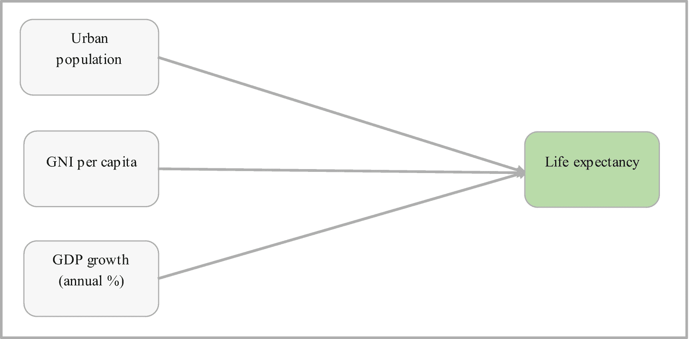

图 8-1

理论框架

清单 8-1 中的代码执行数据操作任务。

```
country = ["ZAF"]
indicator = {"SP.URB.TOTL":"urban_pop",
"NY.GNP.PCAP.CD":"gni_per_capita",
"NY.GDP.MKTP.KD.ZG":"gdp_growth",
"SP.DYN.LE00.IN":"life_exp"}
df = wbdata.get_dataframe(indicator, country=country, convert_date=True)
df["urban_pop"] = df["urban_pop"].fillna(df["urban_pop"].mean())
df["gni_per_capita"] = df["gni_per_capita"].fillna(df["gni_per_capita"].mean())
df["gdp_growth"] = df["gdp_growth"].fillna(df["gdp_growth"].mean())
df["life_exp"] = df["life_exp"].fillna(df["life_exp"].mean())
df['gni_per_capita'] = np.where((df["gni_per_capita"] > 5000),df["gni_per_capita"].mean(),df["gni_per_capita"])
df['pct_change'] = df["life_exp"].pct_change()
df = df.dropna()
df['direction'] = np.sign(df['pct_change']).astype(int)
df["direction"] = pd.get_dummies(df["direction"])
df['pct_change'] = df["life_exp"].pct_change()
df = df.dropna()
df['direction'] = np.sign(df['pct_change']).astype(int)
df["direction"] = pd.get_dummies(df["direction"])
del df["pct_change"]
del df["life_exp"]
from sklearn.preprocessing import StandardScaler
x = df.iloc[::,0:3]
scaler = StandardScaler()
x= scaler.fit_transform(x)
y = df.iloc[::,-1]
from sklearn.model_selection import train_test_split
x_train, x_test, y_train, y_test = train_test_split(x,y,test_size=0.2,random_state=0)
清单 8-1
数据预处理
```

## 受限玻尔兹曼机分类器

受限玻尔兹曼机分类器是一种简单的人工神经网络，它由一个隐藏层和一个可见层组成。图 8-2 展示了受限玻尔兹曼机分类器的结构。

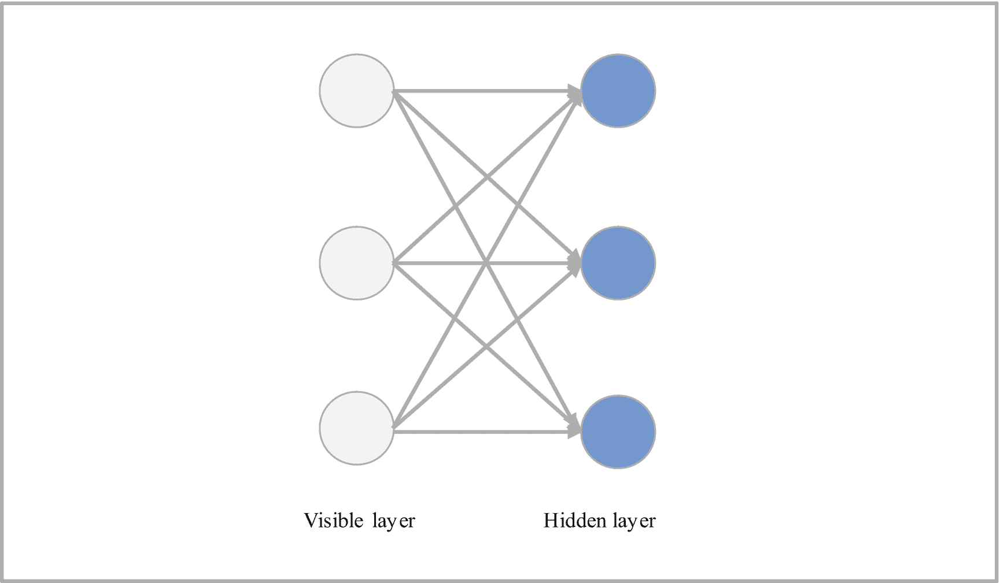

图 8-2

受限玻尔兹曼机结构

图 8-2 显示，隐藏层中的每个节点自动获取输入值，通过应用激活函数转换获取的输入数据，然后将数据传输到可见层。受限玻尔兹曼机分类器从左到右估计梯度——这个学习过程被称为*前向传播*过程。

## 受限玻尔兹曼机分类器开发

清单 8-2 是使用默认超参数的受限玻尔兹曼机分类器开发。注意，它使用 `Pipeline()` 方法来设置最终分类器的参数，包括受限玻尔兹曼机和逻辑回归分类器的参数。

```
from sklearn.neural_network import BernoulliRBM
from sklearn.linear_model import LogisticRegression
rbm = BernoulliRBM()
logreg = LogisticRegression()
from sklearn.pipeline import Pipeline
rbmclassifier = Pipeline(steps=[("rbm",rbm),("logreg",logreg)])
rbmclassifier.fit(x_train,y_train)
清单 8-2
受限玻尔兹曼机分类器开发
```


### 受限玻尔兹曼机混淆矩阵

清单 8-3 探讨了受限玻尔兹曼机分类器的性能（见表 8-2）。

**表 8-2** 受限玻尔兹曼机分类器混淆矩阵

| | **预测值：预期寿命下降** | **预测值：预期寿命上升** |
|---|---|---|
| **实际值：预期寿命下降** | 0 | 2 |
| **实际值：预期寿命上升** | 0 | 10 |

```
from sklearn import metrics
y_predrbmclassifier = rbmclassifier.predict(x_test)
cmatrbmclassifier = pd.DataFrame(metrics.confusion_matrix(y_test,y_predrbmclassifier),
index=["Actual: Decreasing life expectancy",
"Actual: Increasing life expectancy"],
columns = ("Predicted: Decreasing life expectancy",
Predicted: Increasing life expectancy"))
cmatrbmclassifier
Listing 8-3
Restricted Boltzmann Machine Confusion Matrix
```

表 8-3 对受限玻尔兹曼机分类器的混淆矩阵进行了解释（见表 8-2）。

**表 8-3** 受限玻尔兹曼机分类器混淆矩阵解释

| 指标 | 解释 |
|---|---|
| 真阳性 | 当南非实际预期寿命下降时，受限玻尔兹曼机分类器未预测为下降。 |
| 真阴性 | 当南非预期寿命实际上升时，受限玻尔兹曼机分类器预测为上升（两次）。 |
| 真阳性 | 当南非预期寿命实际上升时，受限玻尔兹曼机分类器未预测为下降。 |
| 假阴性 | 当南非预期寿命实际下降时，受限玻尔兹曼机分类器预测为上升（十次）。 |

### 受限玻尔兹曼机分类报告

清单 8-4 中的代码获取了关于受限玻尔兹曼机分类器性能的详细报告（见表 8-4）。

```
creportrbmclassifier = pd.DataFrame(metrics.classification_report(y_test,y_predrbmclassifier,output_dict=True))
creportrbmclassifier
Listing 8-4
Restricted Boltzmann Machine Classification Report
```

表 8-4 显示，RBM 分类器的准确率为 83%，并且在预测南非预期寿命上升和下降时的精确率也为 83%。

**表 8-4** 受限玻尔兹曼机分类报告

| | 0 | 1 | 准确率 | 宏平均 | 加权平均 |
|---|---|---|---|---|---|
| 精确率 | 0.0 | 0.833333 | 0.833333 | 0.416667 | 0.694444 |
| 召回率 | 0.0 | 1.000000 | 0.833333 | 0.500000 | 0.833333 |
| F1 分数 | 0.0 | 0.909091 | 0.833333 | 0.454545 | 0.757576 |
| 支撑值 | 2.0 | 10.000000 | 0.833333 | 12.000000 | 12.000000 |

### 受限玻尔兹曼机分类器 ROC 曲线

清单 8-5 评估了当受限玻尔兹曼机分类器区分南非预期寿命上升和下降时，敏感度（FPR）与特异度（TPR）之间的权衡（见图 8-3）。

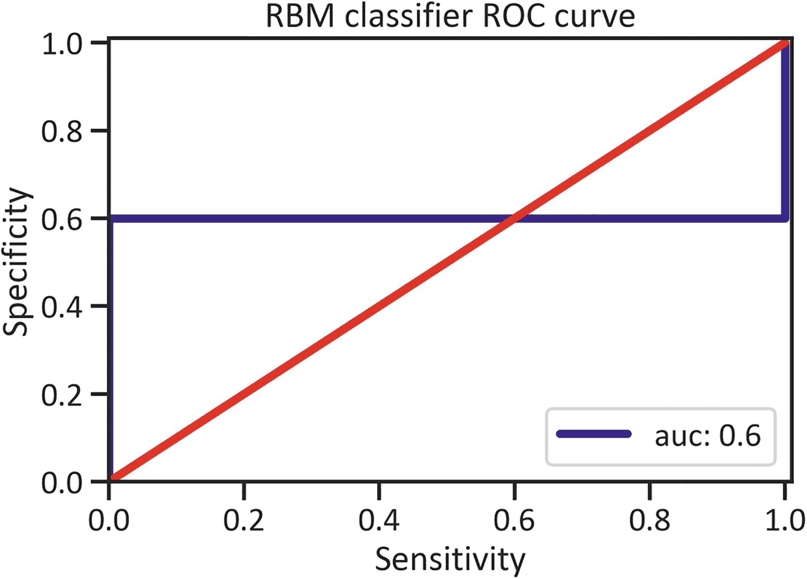

**图 8-3** 受限玻尔兹曼机分类器 ROC 曲线

```
y_predrbmclassifier_proba = rbmclassifier.predict_proba(x_test)[::,1]
fprrbmclassifier, tprrbmclassifier, _ = metrics.roc_curve(y_test,y_predrbmclassifier_proba)
aucrbmclassifier = metrics.roc_auc_score(y_test,y_predrbmclassifier_proba)
fig, ax = plt.subplots()
plt.plot(fprrbmclassifier, tprrbmclassifier,label="auc: "+str(aucrbmclassifier),color="navy",lw=4)
plt.plot([0,1],[0,1],color="red",lw=4)
plt.xlim([0.00,1.01])
plt.ylim([0.00,1.01])
plt.title("RBM classifier ROC curve")
plt.xlabel("Sensitivity")
plt.ylabel("Specificity")
plt.legend(loc=4)
plt.show()
Listing 8-5
Restricted Boltzmann Machine Classifier ROC Curve
```

图 8-3 显示，平均而言，受限玻尔兹曼机分类器在区分南非出生时预期寿命上升和下降时的准确率为 60%。

### 受限玻尔兹曼机分类器精确率-召回率曲线

清单 8-6 评估了当受限玻尔兹曼机分类器区分南非预期寿命上升和下降时，在某些阈值下精确率与召回率之间的权衡（见图 8-4）。

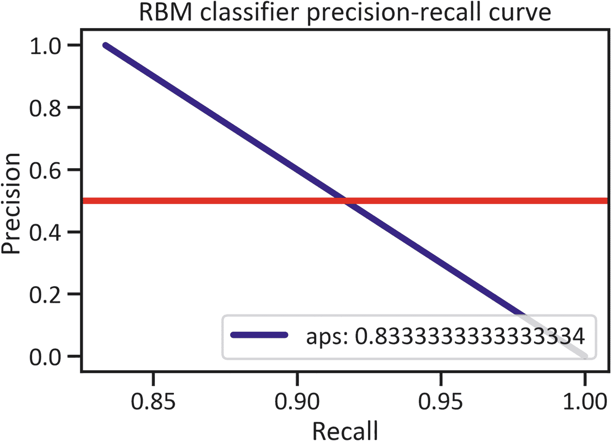

**图 8-4** 受限玻尔兹曼机分类器精确率-召回率曲线

```
precisionrbmclassifier, recallrbmclassifier, thresholdrbmclassifier = metrics.precision_recall_curve(y_test,y_predrbmclassifier)
apsrbmclassifier = metrics.average_precision_score(y_test,y_predrbmclassifier)
fig, ax = plt.subplots()
plt.plot(precisionrbmclassifier, recallrbmclassifier,label="aps: " +str(apsrbmclassifier),color="navy",lw=4)
plt.axhline(y=0.5, color="red",lw=4)
plt.title("RBM classifier precision-recall curve")
plt.ylabel("Precision")
plt.xlabel("Recall")
plt.legend(loc=4)
plt.show()
Listing 8-6
Restricted Boltzmann Machine Classifier Precision-Recall Curve
```

图 8-4 显示，平均而言，受限玻尔兹曼机分类器在区分南非预期寿命上升和下降时的精确率为 83%。

### 受限玻尔兹曼机分类器学习曲线

清单 8-7 展示了受限玻尔兹曼机分类器如何学习正确区分南非出生时预期寿命的上升和下降（见图 8-5）。

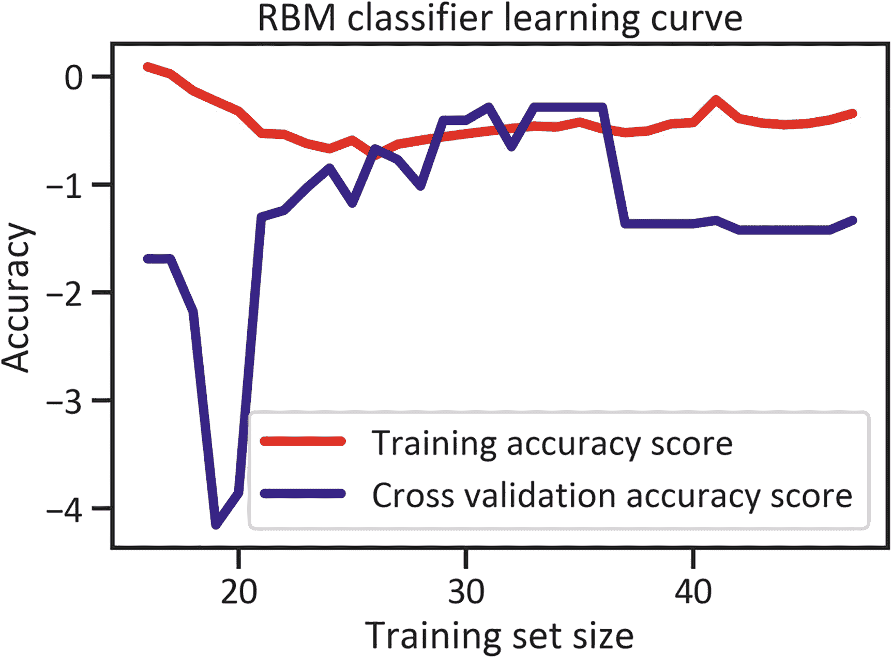

**图 8-5** 受限玻尔兹曼机分类器学习曲线

```
from sklearn.model_selection import learning_curve
from sklearn.model_selection import learning_curve
trainsizerbmclassifier, trainscorerbmclassifier, testscorerbmclassifier = learning_curve(rbmclassifier, x, y, cv=5, n_jobs=-1, scoring="accuracy", train_sizes=np.linspace(0.1,1.0,50))
trainscorerbmclassifier_mean = np.mean(trainscorerbmclassifier,axis=1)
trainscorerbmclassifier_std = np.std(trainscorerbmclassifier,axis=1)
testscorerbmclassifier_mean = np.mean(testscorerbmclassifier,axis=1)
testscorerbmclassifier_std = np.std(testscorerbmclassifier,axis=1)
fig, ax = plt.subplots()
plt.plot(trainsizerbmclassifier, trainscorerbmclassifier_mean, color="red", label="Training accuracy score",lw=4)
plt.plot(trainsizerbmclassifier, testscorerbmclassifier_mean,color="navy",label="Cross validation accuracy score",lw=4)
plt.title("RBM classifier learning curve")
plt.xlabel("Training set size")
plt.ylabel("Accuracy")
plt.legend(loc="best")
plt.show()
Listing 8-7
Restricted Boltzmann Machine Classifier Learning Curve
```

图 8-5 显示，对于前十个数据点，交叉验证准确率分数高于训练分数。此后，训练分数超过了交叉验证准确率分数，并持续到第 30 个数据点。在第 36 个数据点，交叉验证分数急剧下降。


## 多层感知器（MLP）分类器

本节将介绍多层感知器分类器——它是受限玻尔兹曼机分类器的一种扩展，也被称为*原始模型*。它是指具有多个隐藏层的受限玻尔兹曼机分类器。该模型包含三个层（见图 8-6）。

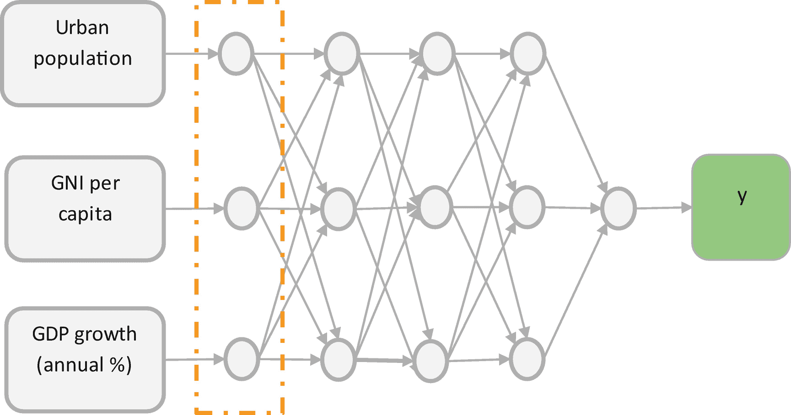

图 8-6

多层感知器分类器示例

图 8-6 显示，该模型包含输入层，它负责获取输入值并将其传输到第一个隐藏层。第一个隐藏层接收这些值，并通过应用一个函数（此处为 Sigmoid 函数）对其进行转换。转换后的输出值被传输到第二个隐藏层，第二个隐藏层接收这些值并进一步处理（它转换这些值，然后将结果传输到输出层）。

### 多层感知器（MLP）分类器模型开发

代码清单 8-8 通过应用默认超参数来开发多层感知器分类器。

```
from sklearn.neural_network import MLPClassifier
mlp = MLPClassifier()
mlp.fit(x_train,y_train)
```

代码清单 8-8
多层感知器分类器模型开发

代码清单 8-9 获取多层感知器分类器的混淆矩阵（见表 8-5）。

表 8-5

多层感知器混淆矩阵

|   | 预测：预期寿命降低 | 预测：预期寿命提高 |
| --- | --- | --- |
| **实际：预期寿命降低** | 0 | 2 |
| **实际：预期寿命提高** | 0 | 10 |

```
y_predmlp = mlp.predict(x_test)
cmatmlp = pd.DataFrame(metrics.confusion_matrix(y_test,y_predmlp), index=["实际：预期寿命降低", "实际：预期寿命提高"],
columns = ("预测：预期寿命降低",
"预测：预期寿命提高"))
cmatmlp
```

代码清单 8-9
构建多层感知器混淆矩阵

表 8-6 解释多层感知器分类器的混淆矩阵（见表 8-5）。

表 8-6

多层感知器混淆矩阵解释

| 指标 | 解释 |
| --- | --- |
| 真正例 | 当南非的预期寿命实际降低时，多层感知器分类器没有预测出预期寿命降低。 |
| 真负例 | 当南非的预期寿命实际提高时，多层感知器分类器预测出了出生时预期寿命提高（发生了两次）。 |
| 真正例 | 当南非的出生时预期寿命实际提高时，多层感知器分类器没有预测出预期寿命降低。 |
| 假负例 | 当南非的预期寿命实际降低时，多层感知器分类器预测出了预期寿命提高（发生了十次）。 |

### 多层感知器分类报告

表 8-7 概述了由代码清单 8-10 生成的多层感知器分类报告。

表 8-7

多层感知器分类报告

|   | 0 | 1 | 准确率 | 宏平均 | 加权平均 |
| --- | --- | --- | --- | --- | --- |
| 精确率 | 0.0 | 0.833333 | 0.833333 | 0.416667 | 0.694444 |
| 召回率 | 0.0 | 1.000000 | 0.833333 | 0.500000 | 0.833333 |
| F1 分数 | 0.0 | 0.909091 | 0.833333 | 0.454545 | 0.757576 |
| 支持度 | 2.0 | 10.000000 | 0.833333 | 12.000000 | 12.000000 |

```
creportmlp = pd.DataFrame(metrics.classification_report(y_test,y_predmlp,output_dict=True))
creportmlp
```

代码清单 8-10
多层感知器分类报告

表 8-7 显示，当预测南非出生时预期寿命降低时，多层感知器分类器的准确率为 83%；当预测预期寿命降低时，其精确率为 83%。此外，它在区分南非预期寿命提高与降低时，准确率为 92%。

### 多层感知器 ROC 曲线

代码清单 8-11 估算了当多层感知器分类器区分南非预期寿命提高与降低时，敏感性（FPR）与特异性（TPR）之间的权衡关系（见图 8-7）。

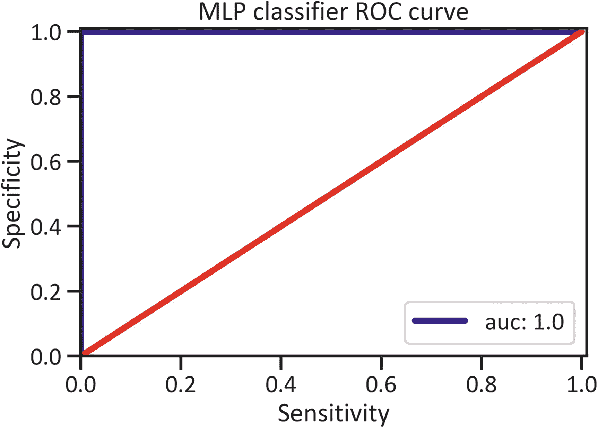

图 8-7

多层感知器分类器 ROC 曲线

```
y_predmlp_proba = mlp.predict_proba(x_test)[::,1]
fprmlp, tprmlp, _ = metrics.roc_curve(y_test,y_predmlp_proba)
aucmlp = metrics.roc_auc_score(y_test,y_predmlp_proba)
fig, ax = plt.subplots()
plt.plot(fprmlp, tprmlp,label="auc: "+str(aucmlp),color="navy",lw=4)
plt.plot([0,1],[0,1],color="red",lw=4)
plt.xlim([0.00,1.01])
plt.ylim([0.00,1.01])
plt.title("MLP classifier ROC curve")
plt.xlabel("Sensitivity")
plt.ylabel("Specificity")
plt.legend(loc=4)
plt.show()
```

代码清单 8-11
多层感知器 ROC 曲线

图 8-7 显示，在区分南非预期寿命提高与降低时，多层感知器分类器的平均准确率为 100%。

### 多层感知器分类器精确率-召回率曲线

代码清单 8-12 估算了当多层感知器分类器区分南非预期寿命提高与降低时，在不同阈值下精确率与召回率之间的权衡关系（见图 8-8）。

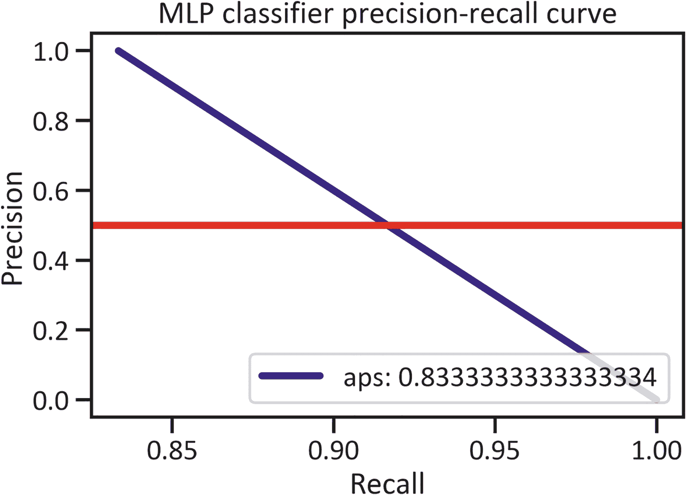

图 8-8

多层感知器分类器精确率-召回率曲线

```
precisionmlp, recallmlp, thresholdmlp = metrics.precision_recall_curve(y_test,y_predmlp)
apsmlp = metrics.average_precision_score(y_test,y_predmlp)
fig, ax = plt.subplots()
plt.plot(precisionmlp, recallmlp,label="aps: " +str(apsmlp),color="navy",lw=4)
plt.axhline(y=0.5, color="red",lw=4)
plt.title("MLP classifier precision-recall curve")
plt.ylabel("Precision")
plt.xlabel("Recall")
plt.legend(loc=4)
plt.show()
```

代码清单 8-12
多层感知器分类器精确率-召回率曲线

图 8-8 显示，在区分南非预期寿命提高与降低时，多层感知器分类器的平均精确率为 83%。


### 多层感知机分类器学习曲线

列表 8-13 展示了多层感知机分类器如何随着训练测试集规模增大，学会正确区分南非出生时预期寿命的上升与下降趋势（参见图 8-9）。


**图 8-9** 多层感知机分类器学习曲线

```
trainsizemlp, trainscoremlp, testscoremlp = learning_curve(mlp, x, y, cv=5, n_jobs=-1, scoring="accuracy", train_sizes=np.linspace(0.1,1.0,50))
trainscoremlp_mean = np.mean(trainscoremlp,axis=1)
trainscoremlp_std = np.std(trainscoremlp,axis=1)
testscoremlp_mean = np.mean(testscoremlp,axis=1)
testscoremlp_std = np.std(testscoremlp,axis=1)
fig, ax = plt.subplots()
plt.plot(trainsizemlp, trainscoremlp_mean, color="red",lw=4,label="训练准确率分数")
plt.plot(trainsizemlp, testscoremlp_mean,color="navy",lw=4,label="交叉验证准确率分数")
plt.title("MLP 分类器学习曲线")
plt.xlabel("训练集规模")
plt.ylabel("准确率")
plt.legend(loc="最佳位置")
plt.show()
列表 8-13
MLP 分类器学习曲线
```

图 8-9 显示，在整个训练过程中，训练准确率分数一直高于交叉验证准确率分数。交叉验证分数在第 12 个数据点后急剧下降，并在第 20 个数据点处回升。

## 基于 Keras 的人工神经网络原型设计

列表 8-14 对数据进行了重新处理。此过程与上一节中的步骤类似，区别在于本过程进一步将数据拆分为验证数据。

```
from sklearn.preprocessing import StandardScaler
x = df.iloc[::,0:3]
scaler = StandardScaler()
x= scaler.fit_transform(x)
y = df.iloc[::,-1]
from sklearn.model_selection import train_test_split
x_train, x_test, y_train, y_test = train_test_split(x,y,test_size=0.2,random_state=0)
x_train, x_val, y_train, y_val = train_test_split(x_train,y_train,test_size=0.1,random_state=0)
列表 8-14
数据重新处理
```

列表 8-15 训练神经网络。它首先从 `keras` 库中导入 `Sequential`、`Dense` 和 `KerasClassifier`（参见列表 8-15）。

```
from keras import Sequential
from keras.layers import Dense
from keras.wrappers.scikit_learn import KerasClassifier
列表 8-15
导入依赖项
```

## 人工神经网络结构构建

列表 8-16 构建了一个函数来创建神经网络的架构。输入层的激活函数是 ReLu。这意味着模型将作用于变量——城市人口、人均 GNI（按 Atlas 方法计算，以当前美元计）以及 GDP 增长率（年百分比）——并生成输出。列表 8-16 在输入层中包含了一个额外节点。在输出层，网络应用 sigmoid 函数（它作用于这些预测变量并生成南非预期寿命的下降或上升）。用于训练的损失函数是 `binary_crossentropy`。指定此损失函数告知神经网络它将处理一个分类变量。用于评估神经网络的指标是 `accuracy`，我们应用 `adam` 优化器随机选择变量。我们还处理了梯度消失问题并加快了训练过程。

```
def create_dnn_model():
model = Sequential()
model.add(Dense(4, input_dim=3, activation="relu"))
model.add(Dense(1, activation="sigmoid"))
model.compile(loss="binary_crossentropy", optimizer="adam", metrics=["accuracy"])
return model
列表 8-16
构建网络架构
```

### 网络封装

列表 8-17 封装了分类器，以便我们应用 `scikit-learn` 库的功能。

```
model = KerasClassifier(build_fn=create_dnn_model)
列表 8-17
封装 Keras 分类器
```

列表 8-18 在 64 个训练周期（epochs）上训练神经网络，并使用批次大小为 15。请注意，你可以通过尝试其他批次大小和训练周期数来调整设置（它们通常会带来不同的模型性能结果）。

```
history = model.fit(x_train, y_train, validation_data=(x_val, y_val), epochs=64, batch_size=15)
history
列表 8-18
训练神经网络
```

### Keras 分类器混淆矩阵

列表 8-19 创建了一个混淆矩阵（参见表 8-8）。

**表 8-8** Keras 分类器混淆矩阵

| | **预测：预期寿命下降** | **预测：预期寿命上升** |
|---|---|---|
| **实际：预期寿命下降** | 0 | 2 |
| **实际：预期寿命上升** | 1 | 9 |

```
y_predkeras = model.predict(x_test)
cmatkeras = pd.DataFrame(metrics.confusion_matrix(y_test,y_predkeras),
index=["实际：预期寿命下降",
"实际：预期寿命上升"],
columns = ("预测：预期寿命下降",
"预测：预期寿命上升"))
cmatkeras
列表 8-19
Keras 分类器混淆矩阵
```

表 8-9 解释了 Keras 分类器的混淆矩阵（参见表 8-8）。

**表 8-9** Keras 分类器混淆矩阵解读

| 指标 | 解读 |
|---|---|
| 真正例 | 当南非实际出现预期寿命下降时，Keras 分类器未预测到下降的次数。 |
| 真负例 | 当南非实际出现预期寿命上升时，Keras 分类器预测到上升的次数（两次）。 |
| 假正例 | 当南非实际出现预期寿命上升时，Keras 分类器预测为下降的次数（一次）。 |
| 假负例 | 当南非实际出现预期寿命下降时，Keras 分类器预测为上升的次数（九次）。 |

### Keras 分类报告

列表 8-20 生成了一个分类报告（参见表 8-10）。

**表 8-10** Keras 分类报告

| | 0 | 1 | 准确率 | 宏平均 | 加权平均 |
|---|---|---|---|---|---|
| 精确率 | 0.0 | 0.818182 | 0.75 | 0.409091 | 0.681818 |
| 召回率 | 0.0 | 0.900000 | 0.75 | 0.450000 | 0.750000 |
| F1 分数 | 0.0 | 0.857143 | 0.75 | 0.428571 | 0.714286 |
| 支持数 | 2.0 | 10.000000 | 0.75 | 12.000000 | 12.000000 |

```
creportkeras = pd.DataFrame(metrics.classification_report(y_test,y_predkeras,output_dict=True))
creportkeras
列表 8-20
Keras 分类报告
```

表 8-10 显示，Keras 分类器预测南非预期寿命下降时的准确率为 41.33%，预测预期寿命上升时的精确率为 81.0%。此外，它在区分预期寿命上升与下降时，准确率为 0%。


### Keras 分类器 ROC 曲线

清单 8-21 确定了当 Keras 分类器区分南非预期寿命的增减时，不同阈值下精确率与召回率之间的权衡（见图 8-10）。

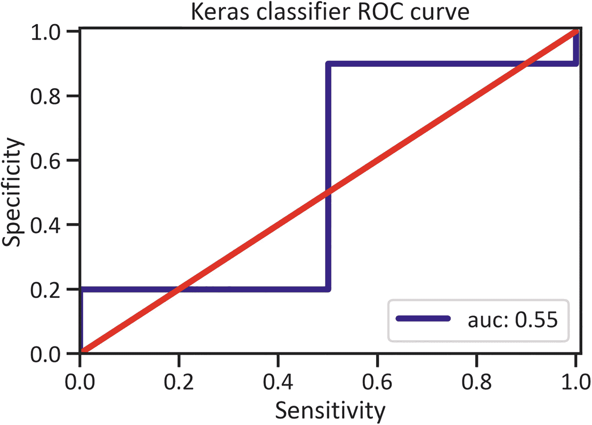

图 8-10
Keras 分类器 ROC 曲线

```
y_predkeras_proba = model.predict_proba(x_test)[::,1]
fprkeras, tprkeras, _ = metrics.roc_curve(y_test,y_predkeras_proba)
auckeras = metrics.roc_auc_score(y_test,y_predkeras_proba)
fig, ax = plt.subplots()
plt.plot(fprkeras, tprkeras,label="auc: "+str(auckeras),color="navy",lw=4)
plt.plot([0,1],[0,1],color="red",lw=4)
plt.xlim([0.00,1.01])
plt.ylim([0.00,1.01])
plt.title("Keras classifier ROC curve")
plt.xlabel("Sensitivity")
plt.ylabel("Specificity")
plt.legend(loc=4)
plt.show()
清单 8-21
Keras 分类器 ROC 曲线
```

图 8-10 显示，在区分南非预期寿命的增减时，Keras 分类器的平均准确率为 55%。

### Keras 分类器 精确率-召回率曲线

清单 8-22 估计了当 Keras 分类器区分南非预期寿命的增减时，不同阈值下精确率与召回率之间的权衡（见图 8-11）。

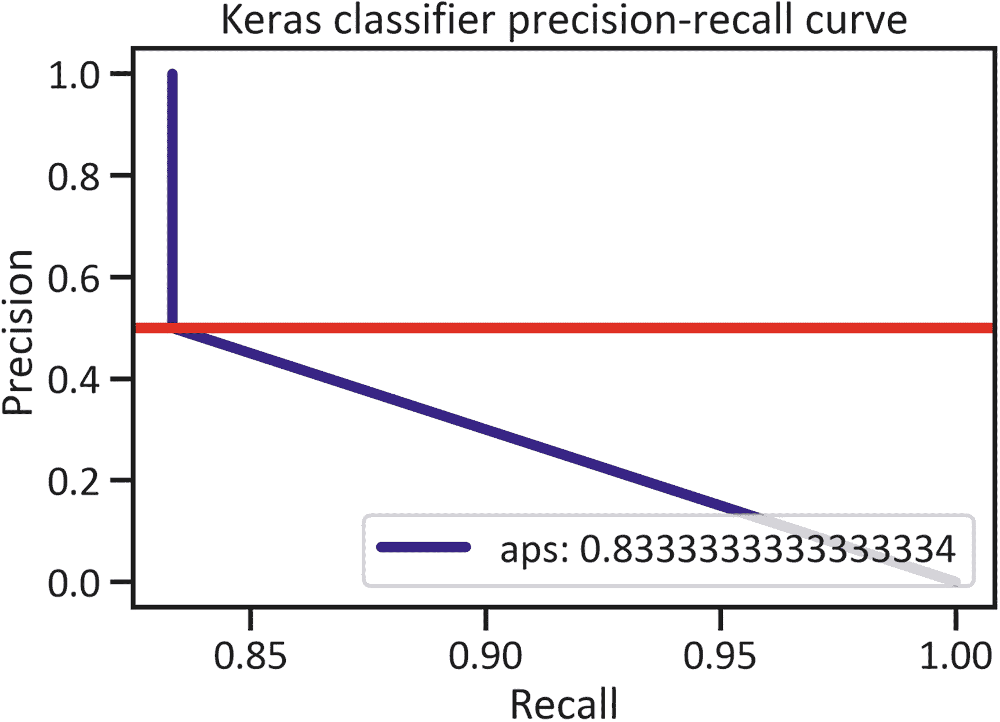

图 8-11
Keras 分类器 精确率-召回率曲线

```
precisionkeras, recallkeras, thresholdkeras = metrics.precision_recall_curve(y_test,y_predkeras)
apskeras = metrics.average_precision_score(y_test,y_predkeras)
fig, ax = plt.subplots()
plt.plot(precisionkeras, recallkeras,label="aps: " +str(apskeras),color="navy",lw=4)
plt.axhline(y=0.5, color="red",lw=4)
plt.title("Keras classifier precision-recall curve")
plt.ylabel("Precision")
plt.xlabel("Recall")
plt.legend(loc=4)
plt.show()
清单 8-22
Keras 分类器 精确率-召回率曲线
```

图 8-11 显示，在区分南非预期寿命的增减时，Keras 分类器的平均精确率为 83%。

## 跨周期的训练损失和交叉验证损失

清单 8-23 确定了跨周期的损失，其中周期在 x 轴，损失在 y 轴（见图 8-12）。

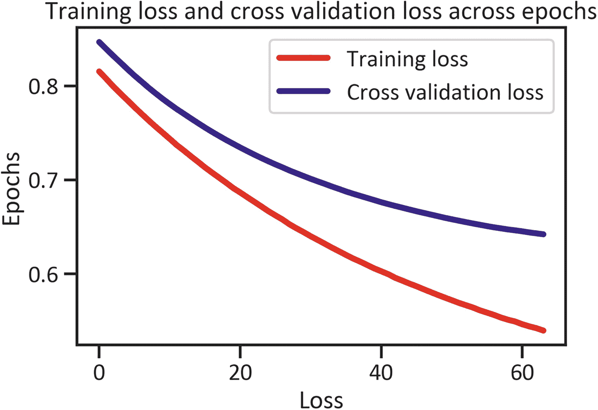

图 8-12
跨周期的训练损失和交叉验证损失

```
plt.plot(history.history["loss"], color="red",lw=4, label="Training loss")
plt.plot(history.history["val_loss"], color="navy",lw=4, label="Cross validation loss")
plt.title("Training loss and cross validation loss across epochs")
plt.xlabel("Loss")
plt.ylabel("Epochs")
plt.legend(loc="best")
plt.show()
清单 8-23
跨周期的训练损失和交叉验证损失
```

图 8-12 展示了，从第一个周期开始，训练损失和交叉验证损失都逐渐下降，直到在第 65 个周期达到最低点。

## 跨周期的训练损失和交叉验证损失准确率

清单 8-24 估计了跨周期的准确率（见图 8-13）。

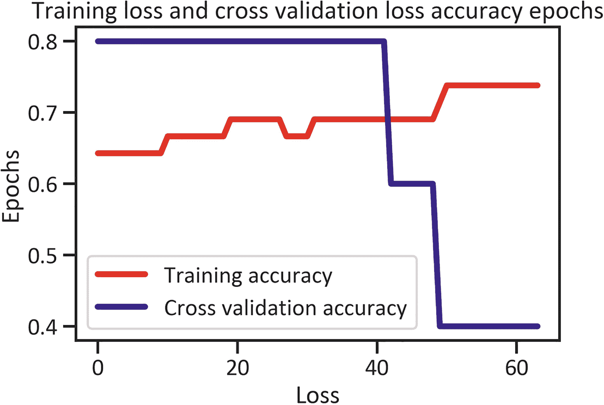

图 8-13
跨周期的训练损失和交叉验证损失准确率

```
plt.plot(history.history["accuracy"], color="red",lw=4, label="Training accuracy")
plt.plot(history.history["val_accuracy"], color="navy",lw=4,label="Cross validation accuracy")
plt.title("Training loss and cross validation loss accuracy epochs")
plt.xlabel("Loss")
plt.ylabel("Epochs")
plt.legend(loc="best")
plt.show()
清单 8-24
跨周期的训练损失和交叉验证损失准确率
```

图 8-13 展示了，从第一个周期开始，交叉验证准确率高于训练准确率。此外，在第 45 个周期之前，交叉验证准确率急剧下降，然后变得低于训练准确率。

### 结论

本章涵盖了深度学习。它解析了基本的深度学习概念。它介绍了使用 `scikit-learn` 库开发人工神经网络的技术。您学习了如何开发和评估一种浅层人工神经网络——受限玻尔兹曼机，包括多层感知器。基于研究结果，通过应用 `scikit-learn` 库开发的多层感知器分类器表现优于所有其他网络。此外，它还展示了通过应用 `keras` 库为序贯模型开发基本网络架构的方法。

