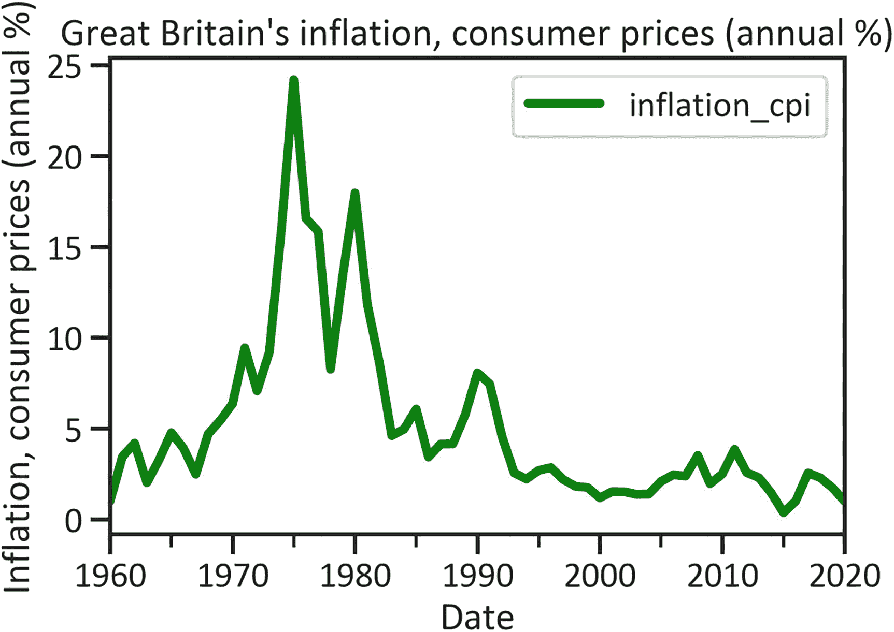
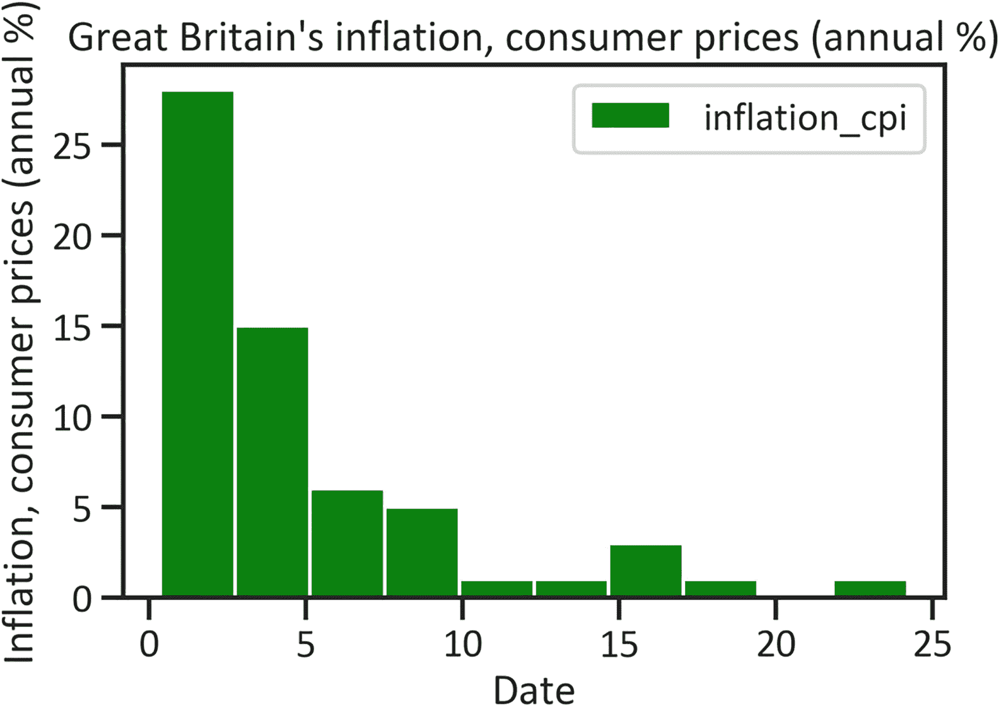
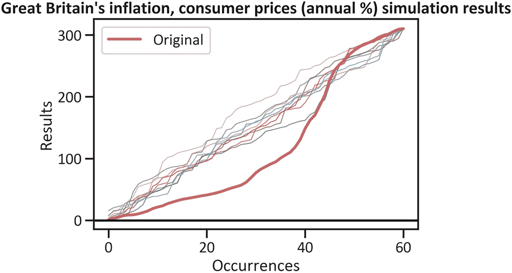
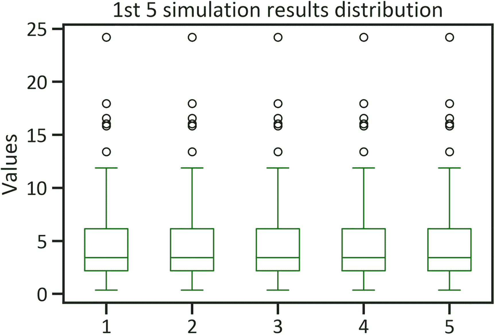
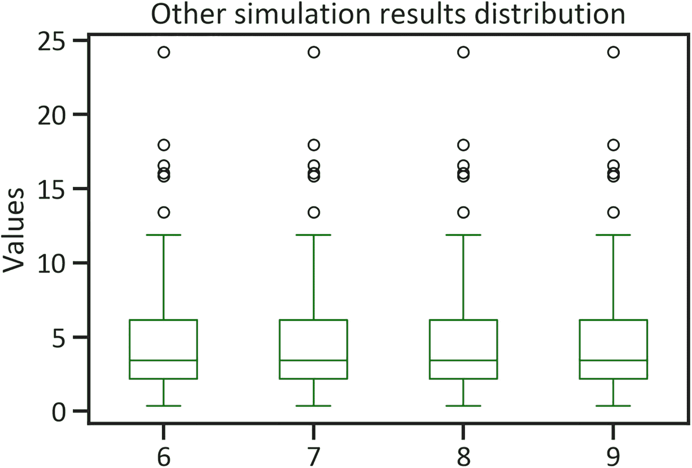

# 9. 通货膨胀模拟

本章使用蒙特卡洛模拟模型，研究不同情景对英国通货膨胀和消费者价格（以年百分比计）的影响。具体而言，它运用该模型来确定该国中央政府债务在多次试验中发生变化的概率。此方法在处理序列数据时非常有用。


## 理解模拟

本章将介绍蒙特卡洛模拟模型。这是一种无监督模型，因为它不分割数据——模型会探索整个数据集。它在多次试验中学习全部数据，以考虑事件发生的可能性。此外，它还通过应用蒙特卡洛模型来研究英国中央政府债务在不同情景下的影响——该模型可确定十个情景（模拟次数）下中央政府债务变化的概率。该模型用于金融领域，以确定投资于特定资产类别的风险和不确定性。

该方法在不同迭代中重现变量中的数值。通过这种方式，您可以多次检查数据的变化。模拟方法有很多种（例如，基于主体的模拟、离散事件模拟、系统动力学模拟和蒙特卡洛模拟）。本章仅向您介绍最常见的模拟方法——蒙特卡洛模拟法。它会模拟变化并识别序列过去发生事件和预测值的模式，从而使开发人员能够复现现实世界中的事件。

与前几章介绍的模型（*k-means* 除外）不同，该模型不需要您分割数据。此外，它还允许重复检查数据，从而清晰呈现变化。而且，它不包含复杂的评估指标；您可以做的只是最大回撤（极端负峰值），包括模拟结果的均值和标准差。在金融领域，使用模拟方法在无需亲身暴露风险的情况下理解风险*非常普遍*（在此处了解更多^(⁴)）。

该模型适合政策制定者，因为它可以帮助他们在考虑经济事件的不确定性时获得清晰的思路。它可以帮助他们决定何时制定和修订影响借贷活动的政策。该模型非常直观，您可以将其应用于多个试验中的某个变量，以生成输出（模拟结果）。

在继续之前，请确保您的环境中安装了 `pandas_montecarlo` 库。要在 Python 环境中安装 `pandas_montecarlo` 库，请使用 `pip install pandas-montecarlo`。同样，要在 Conda 环境中安装该库，请使用 `conda install pandas_montecarlo`。

## 本章背景

本章将展示如何通过应用蒙特卡洛模型，在多次试验中预测英国的通货膨胀和消费者价格（年度百分比）。表 9-1 概述了本章研究的宏观经济指标。

**表 9-1** 本章使用的英国指标

| ID^(**1**) | 指标 |
| --- | --- |
| `FP.CPI.TOTL.ZG` | 通货膨胀和消费者价格（年度百分比） |

代码清单 9-1 提取了英国的通货膨胀和消费者价格数据（见表 9-2）。

**表 9-2** 英国的通货膨胀和消费者价格

| 日期 | `inflation_cpi` |
| --- | --- |
| 2020-01-01 | 0.989487 |
| 2019-01-01 | 1.738105 |
| 2018-01-01 | 2.292840 |
| 2017-01-01 | 2.557756 |
| 2016-01-01 | 1.008417 |

```
import wbdata
country  = ["GBR"]
indicator = {"FP.CPI.TOTL.ZG":"inflation_cpi"}
df = wbdata.get_dataframe(indicator, country=country,convert_date=True)
df.head()
代码清单 9-1
英国的通货膨胀和消费者价格
```

代码清单 9-2 用均值替换了缺失值。

```
df["inflation_cpi"] = df["inflation_cpi"].fillna(df["inflation_cpi"].mean())
代码清单 9-2
用均值替换缺失值
```

## 描述性统计

代码清单 9-3 计算了英国 1960 年至 2020 年的通货膨胀和消费者价格。图 9-1 展示了这些数据的折线图。



**图 9-1** 英国通货膨胀和消费者价格折线图

```
df["inflation_cpi"].plot(kind="line",color="green",lw=4)
plt.title("Great Britain's inflation, consumer prices (annual %)")
plt.ylabel("Inflation, consumer prices (annual %)")
plt.xlabel("Date")
plt.legend(loc="best")
plt.show()
代码清单 9-3
英国通货膨胀和消费者价格折线图
```

图 9-1 显示，在 1970 年代初期（当时英国的通货膨胀率达到 24.207288）急剧上升。然而，在 1970 年代中期，出现了明显下降。2015 年，英国的通货膨胀率降至 0.368047 的低点。代码清单 9-4 计算了英国通货膨胀和消费者价格的分布情况（见图 9-2）。



**图 9-2** 英国通货膨胀和消费者价格分布加载图

```
df["inflation_cpi"].plot(kind="hist",color="green")
plt.title("Great Britain's inflation, consumer prices (annual %)")
plt.ylabel("Inflation, consumer prices (annual %)")
plt.xlabel("Date")
plt.legend(loc="best")
plt.show()
代码清单 9-4
英国通货膨胀和消费者价格分布
```

图 9-2 显示这些数据呈正偏态分布。请注意，该模型不需要对数据结构做任何假设（模型假定变量是未知的）。代码清单 9-5 中的命令生成了一个表格，该表格提供了有关英国通货膨胀和消费者价格数据集中趋势和离散程度的更多详细信息（见表 9-3）。

**表 9-3** 描述性统计摘要

| 变量 | `inflation_cpi` |
| --- | --- |
| 计数 | 61.000000 |
| 均值 | 5.090183 |
| 标准差 | 4.858125 |
| 最小值 | 0.368047 |
| 25% 分位数 | 2.089136 |
| 50% 分位数 | 3.427609 |
| 75% 分位数 | 6.071394 |
| 最大值 | 24.207288 |

```
df.describe()
代码清单 9-5
英国通货膨胀和消费者价格描述性统计摘要
```

表 9-3 显示，英国通货膨胀和消费者价格的均值是 5.090183%。同时显示，各个数据点与均值的标准差为 4.858125。最小值为 0.368047，最大值为 24.207288。

## 蒙特卡洛模拟模型开发

应用模拟器的好处在于计算成本低——它们可以更快地训练大样本。代码清单 9-6 使用 `pandas_montecarlo` 库开发了蒙特卡洛模拟模型。

```
import pandas_montecarlo
mc = df['inflation_cpi'].montecarlo(sims=10, bust=-0.1, goal=1)
代码清单 9-6
英国通货膨胀和消费者价格的蒙特卡洛模型
```

代码清单 9-6 指定了 *bust*（破产概率）为 0.1，以及 *goal*（实现 100% 目标的概率）。


## 模拟结果

图 9-3 显示了基于代码清单 9-7 在多轮实验中预测的英国通胀率和消费价格输出值。



图 9-3

英国通胀率和消费价格的蒙特卡洛模拟结果

```
mc.plot(title="Great Britain's inflation, consumer prices (annual %) simulation results")
代码清单 9-7
英国通胀率与消费价格：蒙特卡洛模拟结果
```

图 9-3 显示，在多次试验中，英国的通胀率和消费价格均呈急剧上升趋势。

## 模拟分布

表 9-4 基于代码清单 9-8 概述了英国通胀率和消费价格模拟结果的集中趋势与离散程度。

表 9-4

英国通胀率与消费价格：蒙特卡洛模拟描述性统计摘要

| | 原始值 | 1 | 2 | 3 | 4 | 5 | 6 | 7 | 8 | 9 |
| --- | --- | --- | --- | --- | --- | --- | --- | --- | --- | --- |
| 计数 | 61.000000 | 61.000000 | 61.000000 | 61.000000 | 61.000000 | 61.000000 | 61.000000 | 61.000000 | 61.000000 | 61.000000 |
| 均值 | 5.090183 | 5.090183 | 5.090183 | 5.090183 | 5.090183 | 5.090183 | 5.090183 | 5.090183 | 5.090183 | 5.090183 |
| 标准差 | 4.858125 | 4.858125 | 4.858125 | 4.858125 | 4.858125 | 4.858125 | 4.858125 | 4.858125 | 4.858125 | 4.858125 |
| 最小值 | 0.368047 | 0.368047 | 0.368047 | 0.368047 | 0.368047 | 0.368047 | 0.368047 | 0.368047 | 0.368047 | 0.368047 |
| 25% 分位数 | 2.089136 | 2.089136 | 2.089136 | 2.089136 | 2.089136 | 2.089136 | 2.089136 | 2.089136 | 2.089136 | 2.089136 |
| 50% 分位数 | 3.427609 | 3.427609 | 3.427609 | 3.427609 | 3.427609 | 3.427609 | 3.427609 | 3.427609 | 3.427609 | 3.427609 |
| 75% 分位数 | 6.071394 | 6.071394 | 6.071394 | 6.071394 | 6.071394 | 6.071394 | 6.071394 | 6.071394 | 6.071394 | 6.071394 |
| 最大值 | 24.207288 | 24.207288 | 24.207288 | 24.207288 | 24.207288 | 24.207288 | 24.207288 | 24.207288 | 24.207288 | 24.207288 |

```
simulation_results = pd.DataFrame(mc.data)
simulation_results.describe()
代码清单 9-8
英国通胀率与消费价格：蒙特卡洛模拟描述性统计摘要
```

为了更好地理解英国通胀率和消费价格模拟结果的分布，请参见图 9-4 和图 9-5。代码清单 9-9 确定了前五次模拟结果。



图 9-4

前五次模拟结果分布

```
simulation_results.iloc[::,1:6].plot(kind="box",color="green")
plt.title("1st 5 simulation results distribution")
plt.ylabel("Values")
plt.show()
代码清单 9-9
前五次模拟结果分布
```

图 9-4 和图 9-5 显示，所有模拟结果的分布都接近正态分布，并且每个分布中都有六个异常值。请参见代码清单 9-10。

```
simulation_results.iloc[::,6:10].plot(kind="box",color="green")
plt.title("Other simulation results distribution")
plt.ylabel("Values")
plt.show()
代码清单 9-10
其他英国通胀率与消费价格：模拟结果分布
```



图 9-5

其他模拟结果分布

图 9-4 和图 9-5 显示，模拟结果饱和于较低层级，并且明显存在六个异常值。在开发蒙特卡洛模拟模型之前，务必替换这些异常值。代码清单 9-11 返回了表 9-5，该表展示了一种直接获取蒙特卡洛模拟结果统计信息的方法。这些统计信息包括：*最大回撤*，即英国通胀率和消费价格指数在恢复之前从峰值下跌的幅度；*破产概率*，即破产的可能性；以及目标达成率，即达到 100%目标的概率。

表 9-5

测试结果

| | 0 |
| --- | --- |
| 最小值 | 3.105012e+02 |
| 最大值 | 3.105012e+02 |
| 均值 | 3.105012e+02 |
| 中位数 | 3.105012e+02 |
| 标准差 | 9.087049e-14 |
| 最大回撤 | NaN |
| 破产概率 | 0.000000e+00 |
| 目标达成率 | 1.000000e+00 |

```
pd.DataFrame(pd.Series(mc.stats))
代码清单 9-11
测试结果
```

脚注 1

