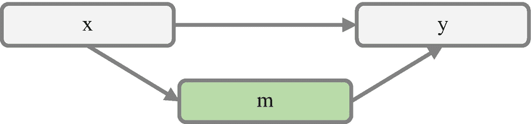
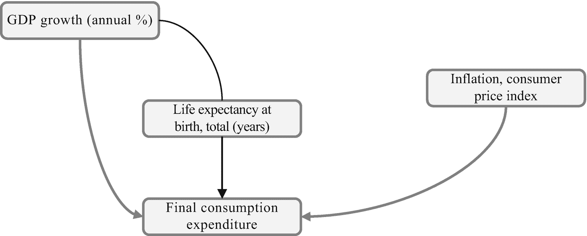
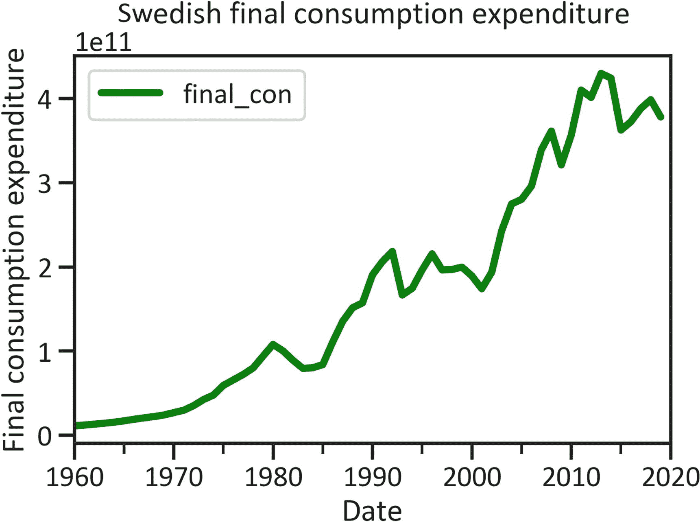
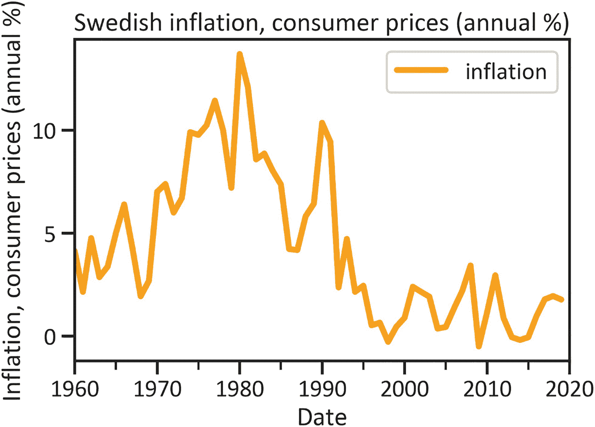
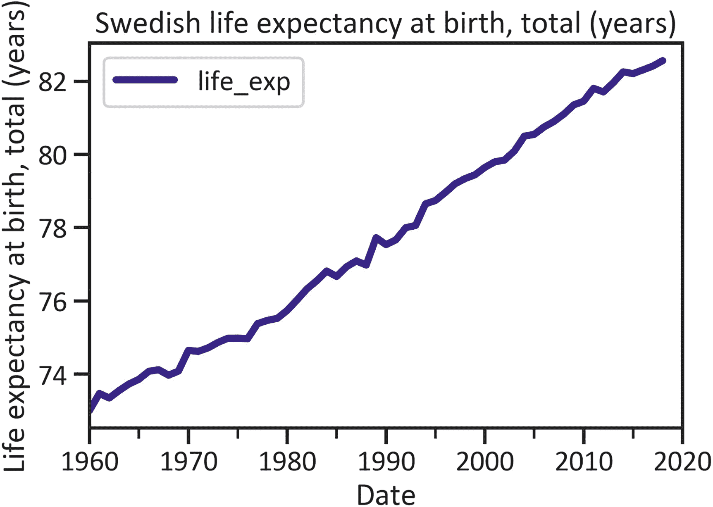
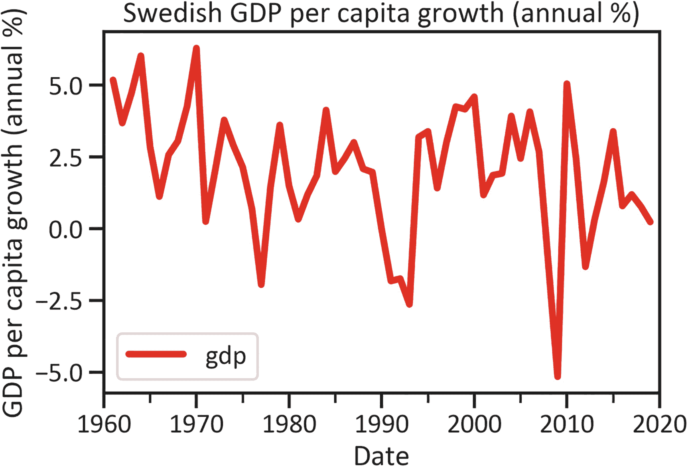
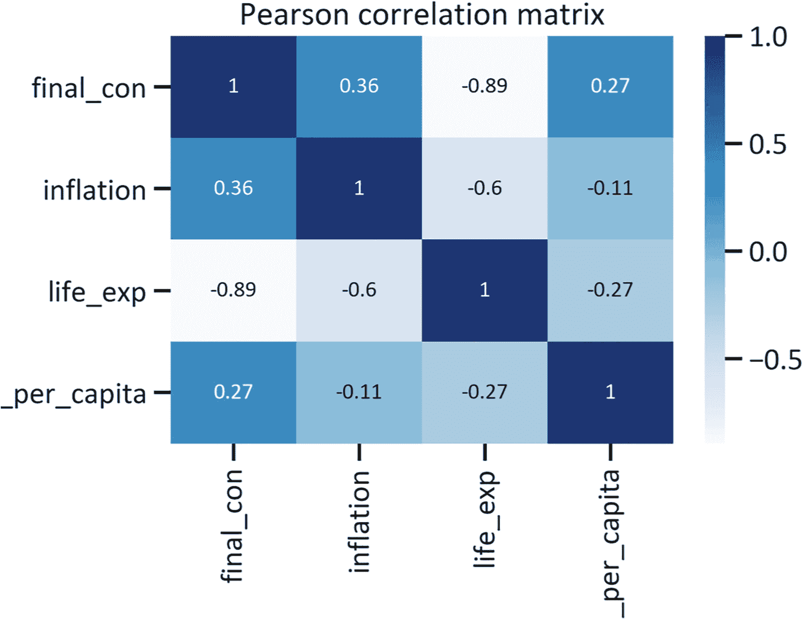
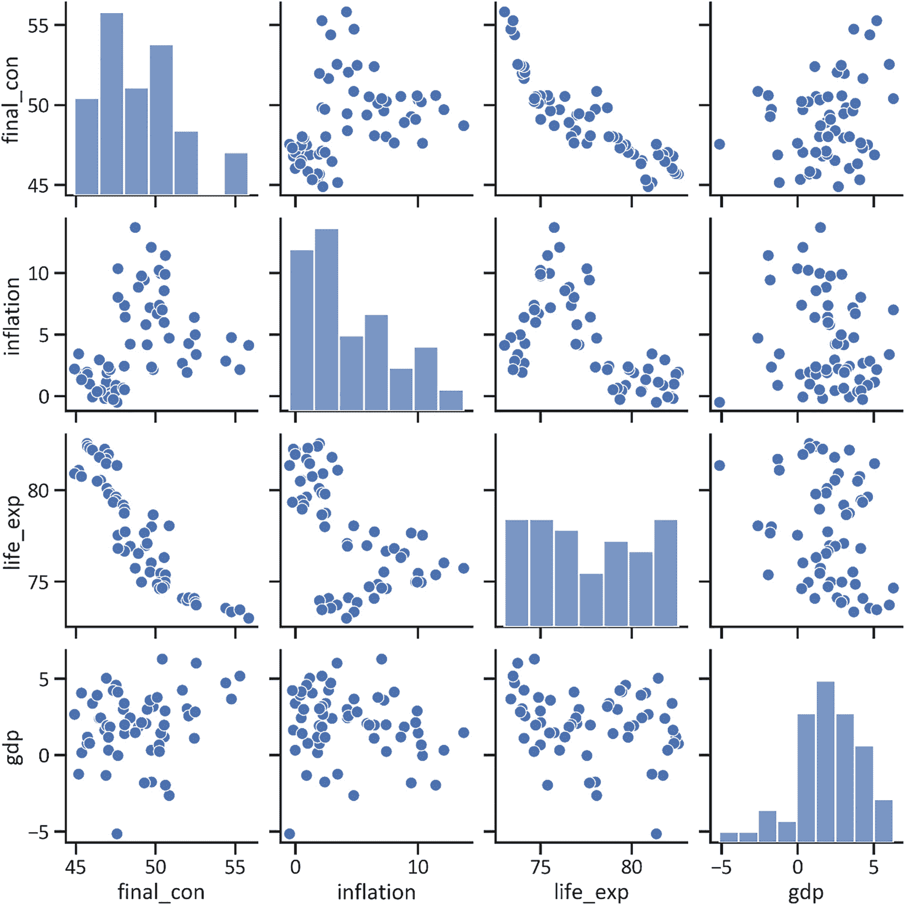
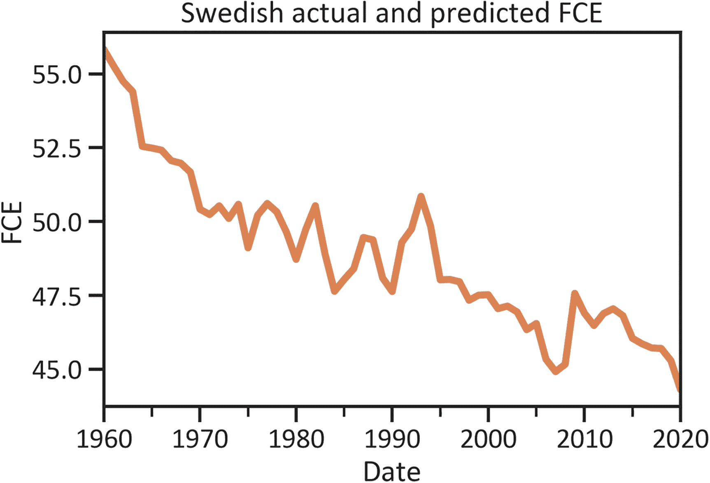
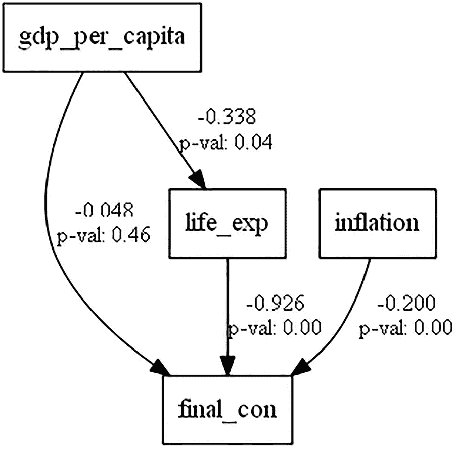

# 10. 应用结构方程模型的经济因果分析

本书的最后一章介绍了如何运用各种定量技术来处理经济问题。本章涵盖了结构方程模型（SEM）。请注意，这并不是单一的方法，而是一个包含多种方法的框架。该方法用途广泛。它应用协方差分析来研究联合变异性，相关分析来研究统计依赖性，因子分析来研究模型所解释的数据变异性，以及多元回归分析来研究各种预测变量如何影响响应变量。它还使用路径分析来研究没有测量模型的结构模型。

结构方程模型包含一组用于确定变量集之间因果关系的模型。它包括因子分析、路径分析和回归分析。它帮助开发者研究中介关系，从而能够检测其他变量的存在如何削弱或增强预测变量与响应变量之间结构性关系的性质。

与之前介绍的模型相比，SEM 具有一个优势，即它可以同时研究多个关系以预测多个响应变量。图 10-1 展示了前几章介绍的模型是如何工作的。大多数模型侧重于预测变量对响应变量的直接影响。


图 10-1

机器学习模型

图 10-1 显示 `x` 对 `y` 有直接影响。可以使用一个函数对预测变量（`x`）进行操作并生成输出值（`y`）。当存在多个响应变量时，模型会遇到问题。分别估计多个方程也很繁琐。这时 SEM 就派上了用场。SEM 不仅能处理预测变量。此外，它还使开发者能够考虑其他变量的中介效应。

## 构建结构关系

SEM 使您能够研究直接效应和间接效应。图 10-2 显示变量 `m` 在 `x` 和 `y` 之间的结构关系中起中介作用。该中介变量有助于确定 `m` 是削弱还是加强了这种关系。



图 10-2

结构方程模型

在图 10-2 中，`x` 代表预测变量，`y` 代表响应变量，而 `m` 代表中介变量。SEM 将同时研究 `x` 对 `y` 的直接效应，以及 `m` 对 `x` 与 `y` 之间关系的间接效应。这将使您能够建立多个方程。

## 本章背景

图 10-3 展示了本章所探讨的假设框架。

主要研究问题是：

- 瑞典的人均 GDP 增长率（年百分比）在多大程度上影响最终消费支出（现价美元）？

- 瑞典的通货膨胀率/消费者价格指数（百分比）如何影响最终消费支出（现价美元）？

次要研究问题包括：

- 瑞典的出生时预期寿命（年）是否影响人均 GDP 增长率（年百分比）与最终消费支出（现价美元）之间的关系？

基于这些研究问题，提出以下研究假设：

- `H[0]`：瑞典的通货膨胀率/消费者价格指数（百分比）不影响最终消费支出（现价美元）。

- `H[A]`：瑞典的通货膨胀率/消费者价格指数（百分比）影响最终消费支出（现价美元）。

- `H[0]`：瑞典的人均 GDP 增长率（年百分比）不影响最终消费支出（现价美元）。

- `H[A]`：瑞典的人均 GDP 增长率（年百分比）影响最终消费支出（现价美元）。

- `H[0]`：瑞典的预期寿命不影响人均 GDP 增长率（年百分比）与最终消费支出（现价美元）之间的关系。

- `H[A]`：瑞典的预期寿命确实影响人均 GDP 增长率（年百分比）与最终消费支出（现价美元）之间的关系。

表 10-1 概述了本章的宏观经济指标。

表 10-1

本章所用瑞典宏观经济指标

| 代码 | 标题 |
| --- | --- |
| `FP.CPI.TOTL.ZG` | 瑞典通货膨胀率/消费者价格指数（百分比） |
| `NY.GDP.PCAP.KD.ZG` | 瑞典人均 GDP 增长率（年百分比） |
| `SP.DYN.LE00.IN` | 瑞典预期寿命（年） |
| `NE.CON.TOTL.CD` | 瑞典最终消费支出（现价美元） |

## 理论框架

图 10-3 提供了该问题的框架。

在继续之前，请确保您的环境中已安装 `semopy` 库。要在 Python 环境中安装 `semopy`，请使用 `pip install semopy`。



图 10-3

假设框架

### 最终消费支出

图 10-4 展示了瑞典家庭购买的所有商品和服务的市场价值。这包括汽车和个人电脑等耐用品。请参阅代码清单 10-1。



图 10-4

瑞典最终消费支出折线图

```
country = ["SWE"]
indicator = {"NE.CON.TOTL.CD":"final_con"}
final_con = wbdata.get_dataframe(indicator, country=country, convert_date=True)
final_con.plot(kind="line",color="green",lw=4)
plt.title("Swedish final consumption expenditure")
plt.ylabel("Final consumption expenditure")
plt.xlabel("Date")
plt.show()
```

代码清单 10-1

瑞典最终消费支出折线图

图 10-4 显示自 1960 年以来，瑞典最终消费支出持续增长。它在 1960 年处于最低水平，并于 2015 年达到峰值。

### 通货膨胀与消费者价格

通货膨胀与消费者价格指标共同用于估算通胀率。部分估算基于消费者价格指数（即普通消费者为商品或服务支付的平均成本）的年度变化。这是判断特定国家生活成本的一个典型指标。代码清单 10-2 和图 10-5 展示了瑞典的年度通货膨胀与消费者价格数据。



图 10-5

瑞典通货膨胀与消费者价格（年百分比）

```
country = ["SWE"]
indicator = {"FP.CPI.TOTL.ZG":"inflation"}
inflation = wbdata.get_dataframe(indicator, country=country, convert_date=True)
inflation.plot(kind="line",color="orange",lw=4)
plt.title("Swedish inflation, consumer prices (annual %)")
plt.ylabel("Inflation, consumer prices (annual %)")
plt.xlabel("Date")
plt.show()
```

代码清单 10-2

瑞典通货膨胀与消费者价格

图 10-5 显示，从 1960 年代末到 1980 年代初，瑞典的通货膨胀与消费者价格翻了近两倍。该指标于 1982 年达到最高峰值（15%）。

### 瑞典的预期寿命

图 10-6 显示了假设当前死亡率模式在未来保持不变的情况下，瑞典新生婴儿预计的平均生存年数。请参阅代码清单 10-3。



图 10-6

瑞典出生时预期寿命（年）

```
country = ["SWE"]
indicator = {"SP.DYN.LE00.IN":"life_exp"}
life_exp = wbdata.get_dataframe(indicator, country=country, convert_date=True)
life_exp.plot(kind="line",color="navy",lw=4)
plt.title("Swedish life expectancy at birth, total (years)")
plt.ylabel("Life expectancy at birth, total (years)")
plt.xlabel("Date")
plt.show()
```

代码清单 10-3

瑞典预期寿命（年）

图 10-6 显示瑞典预期寿命呈显著上升趋势。1960 年，平均预期寿命为 74 岁。截至 2020 年，这一数字已超过 82 岁。

### 人均 GDP 增长

人均 GDP 增长是指年度 GDP 除以经济体人口。图 10-7 展示了瑞典人均 GDP 增长（年度百分比）。参见代码清单 10-4。



**图 10-7** 瑞典人均 GDP 增长（年度百分比）

```
country = ["SWE"]
indicator = {"NY.GDP.PCAP.KD.ZG":"gdp"}
gdp = wbdata.get_dataframe(indicator, country=country, convert_date=True)
gdp.plot(kind="line",color="red",lw=4)
plt.title("Swedish GDP per capita growth (annual %)")
plt.ylabel("GDP per capita growth (annual %)")
plt.xlabel("Date")
plt.show()
```

**代码清单 10-4** 瑞典人均 GDP 增长（年度百分比）

图 10-7 显示，瑞典的人均 GDP 增长并不稳定。它在 2019 年达到最低点（`5.151263`），并在 1970 年达到最高点（`6.292338`）。代码清单 10-5 检索了本章所需的所有瑞典宏观经济数据，代码清单 10-6 则显示了描述性统计摘要（参见表 10-2）。

**表 10-2** 描述性统计摘要

| | 计数 | 均值 | 标准差 | 最小值 | 25%分位数 | 50%分位数 | 75%分位数 | 最大值 |
| --- | --- | --- | --- | --- | --- | --- | --- | --- |
| `final_con` | 61.0 | 48.881491 | 2.647688 | 44.307210 | 46.935678 | 48.399953 | 50.415939 | 55.829462 |
| `inflation` | 61.0 | 4.297861 | 3.673401 | -0.494461 | 1.360215 | 2.961151 | 7.016359 | 13.706322 |
| `life_exp` | 60.0 | 77.766451 | 3.015892 | 73.005610 | 74.977683 | 77.601829 | 80.509756 | 82.958537 |
| `gdp_per_capita` | 60.0 | 1.931304 | 2.285016 | -5.151263 | 0.790254 | 2.040267 | 3.446864 | 6.292338 |

```
df.describe().transpose()
```

**代码清单 10-6** 描述性统计摘要

```
country = ["SWE"]
indicator = {"NE.CON.PRVT.ZS":"final_con",
"FP.CPI.TOTL.ZG":"inflation",
"SP.DYN.LE00.IN":"life_exp",
"NY.GDP.PCAP.KD.ZG":"gdp"}
df = wbdata.get_dataframe(indicator, country=country, convert_date=True)
```

**代码清单 10-5** 加载瑞典宏观经济指标

表 10-2 显示，对于瑞典而言：

*   最终消费支出的均值为`48.881491`。
*   通货膨胀率/消费者价格指数的均值为`4.297861%`。
*   预期寿命的均值为`77.766451`年。
*   人均 GDP 增长的均值为`1.931304%`。
*   最终消费支出的独立数据点与均值相差`2.647688`。
*   通货膨胀率/消费者价格指数与均值相差`3.673401`。
*   预期寿命与均值相差`3.015892`年。
*   人均 GDP 增长与均值相差`2.285016%`。

## 协方差分析

代码清单 10-7 研究了变量之间的联合变异性（参见表 10-3）。

**表 10-3** 协方差矩阵

| | `final_con` | `inflation` | `life_exp` | `gdp_per_capita` |
| --- | --- | --- | --- | --- |
| `final_con` | 7.010251 | 3.467993 | -7.010302 | 1.559997 |
| `inflation` | 3.467993 | 13.493871 | -6.615968 | -0.905779 |
| `life_exp` | -7.010302 | -6.615968 | 9.095604 | -1.771163 |
| `gdp_per_capita` | 1.559997 | -0.905779 | -1.771163 | 5.221296 |

```
dfcov = df.cov()
dfcov
```

**代码清单 10-7** 协方差矩阵

表 10-3 概述了您所检索的变量集的估计协方差。

## 相关性分析

图 10-8 显示了变量之间的统计依赖关系，该图由代码清单 10-8 生成。



**图 10-8** 皮尔逊相关矩阵

```
import seaborn as sns
dfcorr = df.corr(method="pearson")
sns.heatmap(dfcorr, annot=True, annot_kws={"size":12},cmap="Blues")
plt.title("Pearson correlation matrix")
plt.show()
```

**代码清单 10-8** 皮尔逊相关矩阵

表 10-4 解释了图 10-8 中的结果。

**表 10-4** 皮尔逊相关系数解释

| 变量 | 皮尔逊相关系数 | 发现 |
| --- | --- | --- |
| 瑞典通货膨胀率/消费者价格指数与最终消费支出 | 0.36 | 瑞典通货膨胀率/消费者价格指数与最终消费支出之间存在弱正相关。 |
| 瑞典贷款利率与最终消费支出 | -0.89 | 瑞典贷款利率与最终消费支出之间存在极端负相关。 |
| 瑞典预期寿命与通货膨胀率/消费者价格指数 | -0.6 | 瑞典预期寿命与通货膨胀率/消费者价格指数之间存在中等程度负相关。 |
| 瑞典人均 GDP 增长与预期寿命（年） | -0.27 | 瑞典人均 GDP 增长与预期寿命之间存在弱负相关。 |
| 瑞典人均 GDP 增长与通货膨胀率/消费者价格指数 | -0.11 | 瑞典人均 GDP 增长与通货膨胀率/消费者价格指数之间存在弱负相关。 |
| 瑞典人均 GDP 增长与最终消费支出 | 0.27 | 瑞典人均 GDP 增长与最终消费支出之间存在弱正相关。 |

在发现这些变量之间的相关性后，您可以创建一个图表来直观表示这些相关关系（使用代码清单 10-9 中的命令）。图 10-9 显示了生成的配对图。



**图 10-9** 配对图

```
sns.pairplot(df)
```

**代码清单 10-9** 配对图

图 10-9 展示了所有变量的直方图以及数据中变量之间关系的散点图。

## 相关严重程度分析

代码清单 10-10 通过应用特征矩阵来确定每个依赖关系的严重程度（参见表 10-5）。特征值是度量最大方差的一种方式。

**表 10-5** 特征矩阵

| | 特征值 | `final_con` | `inflation` | `life_exp` | `gdp_per_capita` |
| --- | --- | --- | --- | --- | --- |
| `final_con` | 2.323484 | 0.594607 | 0.595973 | 0.527068 | 0.116012 |
| `inflation` | 0.059704 | 0.432198 | 0.262541 | -0.662923 | -0.552096 |
| `life_exp` | 0.512778 | -0.641591 | 0.755077 | -0.133840 | 0.017516 |
| `gdp_per_capita` | 1.104034 | 0.219109 | 0.075813 | -0.514606 | 0.825484 |

```
eigenvalues, eigenvectors = np.linalg.eig(dfcorr)
eigenvalues = pd.DataFrame(eigenvalues)
eigenvalues.columns = ["Eigen values"]
eigenvectors = pd.DataFrame(eigenvectors)
eigenvectors.columns = df.columns
eigenvectors = pd.DataFrame(eigenvectors)
eigenmatrix = pd.concat([eigenvalues, eigenvectors],axis=1)
eigenmatrix.index = df.columns
eigenmatrix
```

**代码清单 10-10** 特征矩阵

基于表 3-4，数据中不存在多重共线性。所有特征值均低于 3。

## 结构方程模型估计

SEM 通过应用最大似然法或广义最小二乘法对变量进行操作。当回归的隐式假设不满足时，最大似然法仍然有效，它能确定最适合数据的参数。广义最小二乘法则对变量进行回归。代码清单 10-11 构建了模型的假设框架。

```
import semopy
import wbdata
from semopy import Model
import semopy
import wbdata
from semopy import Model
mod = """   life_exp ~ gdp_per_capita
final_con ~ inflation + life_exp + gdp_per_capita
"""
```

**代码清单 10-11** 构建假设结构

## 结构方程模型开发

代码清单 10-12 使用默认超参数训练 SEM。

```
m = Model(mod)
m.fit(df)
SolverResult(fun=0.549063553713184, success=True, n_it=18, x=array([-0.33778359, -0.19991271, -0.92551867, -0.04842324,  8.35819007,
1.2715286 ]), message='Optimization terminated successfully', name_method='SLSQP', name_obj='MLW')
```

**代码清单 10-12** 结构方程模型

这些结果表明 SEM 应用了最大似然法，并包含了目标函数。

## 结构方程模型信息

代码清单 10-13 检索 SEM 的相关信息，包括目标名称、优化方法、目标值和迭代次数。

```
print(m.fit(df))
Name of objective: MLW
Optimization method: SLSQP
Optimization successful.
Optimization terminated successfully
Objective value: 0.549
Number of iterations: 1
Params: -0.338 -0.200 -0.926 -0.048 8.358 1.272
```

**代码清单 10-13** 模型信息

代码清单 10-14 返回 SEM 预测的值，然后将这些值制成表格（见表 10-6）。

表 10-6 瑞典实际与预测的最终消费支出

| 日期 | `final_con` | `gdp_per_capita` | `Inflation` | `life_exp` |
| --- | --- | --- | --- | --- |
| 2020-01-01 | 44.307210 | -3.517627 | 0.497367 | -40.408627 |
| 2019-01-01 | 45.287253 | 0.347439 | 1.784151 | 82.958537 |
| 2018-01-01 | 45.697290 | 0.772577 | 1.953535 | 82.558537 |
| 2017-01-01 | 45.718184 | 1.195148 | 1.794499 | 82.409756 |
| 2016-01-01 | 45.856915 | 0.796146 | 0.984269 | 82.307317 |
| ... | ... | ... | ... | ... |
| 1964-01-01 | 52.543020 | 6.026059 | 3.387662 | 73.733171 |
| 1963-01-01 | 54.398699 | 4.735940 | 2.871740 | 73.555366 |
| 1962-01-01 | 54.746401 | 3.685605 | 4.766197 | 73.350488 |
| 1961-01-01 | 55.275500 | 5.184619 | 2.157973 | 73.474390 |
| 1960-01-01 | 55.829462 | -36.394777 | 4.141779 | 73.005610 |

```
preds = m.predict(df)
preds
```

**代码清单 10-14** 进行预测

图 10-10 展示了瑞典最终消费支出的实际值与预测值。详见代码清单 10-15。



图 10-10 瑞典实际与预测的最终消费支出

```
preds["final_con"].plot(lw=4)
df["final_con"].plot(lw=4)
plt.title("Swedish actual and predicted FCE")
plt.xlabel("Date")
plt.ylabel("FCE")
plt.show()
```

**代码清单 10-15** 瑞典实际与预测的最终消费支出

图 10-10 表明 SEM 在预测瑞典最终消费支出方面表现良好。

## 结构方程模型检查

代码清单 10-16 检索估计值、标准误差、z 值和 p 值，并将这些信息制成表格，即表 10-7。你可以应用 p 值来确定本章前面提出的假设声明的显著性。此外，使用标准误差来确定误差的大小。

表 10-7 结构方程模型概况表

|   | `lval` | `op` | `rval` | `Estimate` | `Std. Err` | `z-value` | `p-value` |
| --- | --- | --- | --- | --- | --- | --- | --- |
| **0** | `life_exp` | `~` | `gdp_per_capita` | -0.337784 | 0.163362 | -2.067697 | 3.866852e-02 |
| **1** | `final_con` | `~` | `inflation` | -0.199913 | 0.039862 | -5.015087 | 5.300940e-07 |
| **2** | `final_con` | `~` | `life_exp` | -0.925519 | 0.049939 | -18.532890 | 0.000000e+00 |
| **3** | `final_con` | `~` | `gdp_per_capita` | -0.048423 | 0.066274 | -0.730648 | 4.649940e-01 |
| **4** | `life_exp` | `~~` | `life_exp` | 8.358190 | 1.513430 | 5.522681 | 3.338665e-08 |
| **5** | `final_con` | `~~` | `final_con` | 1.271529 | 0.230238 | 5.522681 | 3.338665e-08 |

```
m.inspect()
```

**代码清单 10-16** 结构方程模型检查

表 10-7 显示所有关系都是显著的（请参考“可视化结构关系”部分以更好地解释这些结果）。为了进一步研究 SEM 的表现，可以使用以下指标之一：

*   绝对拟合指数 (AFI)：通过应用似然比检验等测试来确定模型是否拟合数据。应用这些指数时，应重点关注 χ²（卡方）值。

*   增量拟合指数：包括规范拟合指数 (NFI)，它比较模型的 χ2 值与空模型的 χ2 值；以及比较拟合指数 (CFI)，它在考虑样本量的情况下比较模型的 χ2 值与空模型的 χ2 值。

### 报告指数

代码清单 10-17 检索报告指数（见表 10-8）。

表 10-8 报告指数

|   | `DoF` | `DoF Baseline` | `chi2` | `chi2 p-value` | `chi2 Baseline` | `CFI` | `GFI` | `AGFI` | `NFI` | `TLI` | `RMSEA` | `AIC` | `BIC` | `LogLik` |
| --- | --- | --- | --- | --- | --- | --- | --- | --- | --- | --- | --- | --- | --- | --- |

| --- | --- | --- | --- | --- | --- | --- | --- | --- | --- | --- | --- | --- | --- | --- |

| **Value** | 4 | 8 | 36.813532 | 1.967869e-07 | 172.658646 | 0.800718 | 0.786784 | 0.573569 | 0.786784 | 0.601436 | 0.369761 | 10.792999 | 23.458242 | 0.603501 |

```
stats = semopy.calc_stats(m)
stats.transpose()
```

代码清单 10-17 报告指数

表 10-8 显示，SEM 在解释数据生成过程时损失了约 11% 的信息（参考 AIC，它能很好地反映模型质量）。自由度为 4，χ2 为 36.813532。最重要的指数是 χ2 的 p 值。我们用它来决定是接受还是拒绝以下假设：

*   H0：结果在统计上不显著。

*   HA：结果在统计上显著。

表 10-8 显示 χ2 的 p 值为 0.0000001967869，小于 0.05。这意味着我们拒绝零假设，接受备择假设。结果*确实*在统计上显著。

### 可视化结构关系

图 10-11 展示了变量之间的关系，同时也绘制了协方差估计值和 p 值。使用清单 10-18 中的命令来绘制此信息。



图 10-11 结构方程模型图

```
g = semopy.semplot(m, "semplot.png", plot_covs=True)
g
```

清单 10-18 可视化结构关系

图 10-11 显示：

-   瑞典通货膨胀/消费者价格指数影响最终消费支出，两者之间变化量为 -0.200。

-   瑞典人均 GDP 增长率影响最终消费支出，两者之间变化量为 -0.048。

-   瑞典预期寿命增强了人均 GDP 增长率与最终消费支出之间的关系。

-   通货膨胀/消费者价格指数与预期寿命的变化量为 -0.338，预期寿命与最终消费支出的变化量为 -0.926。

### 结论

本章介绍了结构方程模型（SEM），探讨了瑞典人均 GDP 增长率、通货膨胀/消费者价格指数和最终消费支出之间的结构关系。此外，还探讨了瑞典预期寿命对人均 GDP 增长率与最终消费支出之间关系的中介效应。

首先，本章解释了如何开发一个可通过应用该方法进行检验的理论框架。其次，涵盖了如何通过应用协方差来确定联合变异性，如何通过应用皮尔逊相关来确定关联性，以及如何通过应用特征矩阵来确定相关性强度。您还了解了如何通过应用主成分分析来减少数据。最后，您开发了结构方程模型（SEM），并发现结果是显著的。

## 索引

### A

- 绝对拟合指数 (AFI)
- 实际数据点
- 加法模型开发预测
- 曲线下面积 (AUC)
- 人工神经网络
- 数据再处理
- 数据结构化
- 数据封装
- 地图集法
- 增广迪基-福勒检验
- 自相关函数
- 自回归积分滑动平均模型
- 自回归滑动平均模型 (ARIMA)

### B

- 玻尔兹曼机分类器
- 箱线图

### C

- 分类报告
- 比较拟合指数 (CFI)
- Conda 环境
- 混淆矩阵
- 混淆矩阵解读
- 消费者价格
- 传统定量模型
- 卷积神经网络
- 相关分析
- 协方差分析
- 协方差矩阵
- 交叉验证损失
- `cross_val_score()` 方法
- 切分点

### D

- 数据生成过程
- 数据操作
- 数据预处理
- 数据来源
- 深度学习
- 降维技术
- 下降趋势

### E

- 计量经济学
- 经济设计
- 特征载荷
- 特征矩阵
- 特征方法
- 特征值
- 肘部曲线
- 估计截距

### F

- `fillna()` 方法
- 最终消费支出
- 前向传播过程

### G

- 高斯分布
- 高斯混合模型
- GDP 增长
- 数据分布
- 隐藏状态
- 线图
- 南非
- 人均 GDP 增长率
- `get_dummies()` 方法
- 人均 GNI
- 人均 GNI 聚类计数
- 人均 GNI 聚类表
- 人均 GNI 散点图
- 英国通货膨胀
- `GridSearchCV()` 方法
- 国内生产总值 (GDP)

### H

- 隐马尔可夫模型
- 跨样本隐藏状态
- 隐藏状态计数
- `hmmlearn` 库
- 超参数

### I, J

- 个体方差
- 通货膨胀

### K

- 肯德尔方法
- `Keras` 分类报告
- `Keras` 分类器混淆矩阵
- `Keras` 分类器精确率-召回率曲线
- `Keras` 分类器 ROC 曲线
- `k-means` 模型
- `k-Nearest Neighbor` 技术

### L

- 学习曲线
- 贷款利率
- 预期寿命
- 对数 GDP 增长
- 逻辑回归
- 逻辑回归分类器

### M

- 机器学习方法
- 机器学习模型
- 宏观经济数据，南非
- 宏观经济指标
- 马尔可夫成分
- 最大似然法
- 模型评估
- 模型残差自相关
- 模型残差分布
- 蒙特卡洛模拟模型
- 多重共线性
- 多层感知器
- 多层感知器分类器 (MLP)
- 分类报告
- 分类器模型开发
- 混淆矩阵
- 混淆矩阵解读
- 学习曲线
- 召回率曲线
- ROC 曲线

### N

- 负相关
- 正态性
- 规范拟合指数 (NFI)
- 零假设
- `NumPy` 库

### O

- 普通最小二乘法模型
- 普通最小二乘法回归模型
- 异常值移除
- 异常值

### P, Q

- 配对图
- `pandas_montecarlo` 库
- 皮尔逊相关系数
- 皮尔逊相关矩阵
- 皮尔逊相关方法
- 人均分布
- 性能指标
- `Pipeline()` 方法
- 政策制定者
- 总体回归函数
- 精确率-召回率曲线
- 预测数据点
- 预测值
- 主成分分析 (PCA)
- Python 环境

### R

- 随机白噪声
- 循环神经网络
- 报告索引
- 残差分析
- 残差自相关
- 受限玻尔兹曼机
- 受限玻尔兹曼机分类器报告
- 受限玻尔兹曼机混淆矩阵
- ROC 曲线

### S

- 样本回归函数
- `scikit-learn` 库
- `scikit-learn` 模型
- `seaborn` 库
- 季节性 ARIMA
- 季节性自回归积分滑动平均模型 (SARIMA)
- 季节性分解
- `semopy` 库
- 序列数据
- Sigmoid 函数
- Sigmoid 形状
- 轮廓系数法
- 模拟结果
- 社会贡献
- 社会贡献分布
- 斯皮尔曼方法
- 标准化数据
- `statsmodels` 库
- `statsmodels` 模型
- 结构方程模型 (SEM)
- 模型开发
- 模型估计
- 最终消费支出
- 信息检验
- 结构关系
- 瑞典最终消费支出
- 瑞典通货膨胀
- 瑞典预期寿命
- 瑞典宏观经济指标

### T

- `tensorflow` 库
- 理论框架
- 时间序列分析模型
- 训练损失
- 二维散点图

### U

- 取消堆叠数据
- 上升趋势
- 城市人口
- 城市人口分布

### V

- 梯度消失问题
- 可视化结构关系

### W, X, Y, Z

- `wbdata` 库
- 组内平方和 (WSS)