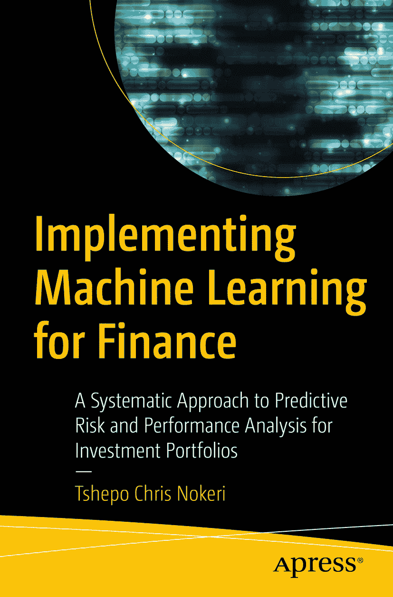

ISBN 978-1-4842-7109-4 电子书 ISBN 978-1-4842-7110-0 [`doi.org/10.1007/978-1-4842-7110-0`](https://doi.org/10.1007/978-1-4842-7110-0)  
© Tshepo Chris Nokeri 2021  
本作品受版权保护。出版商保留所有权利，涉及材料的全部或部分内容，具体包括翻译、重印、插图复用、朗诵、广播、以微缩胶片或任何其他物理形式复制，以及通过电子适配、计算机软件或目前已知或未来开发的类似或不同方法进行的信息存储与检索传输。使用本出版物中的通用描述性名称、注册商标、商标、服务标记等，即使未作明确声明，也不意味着这些名称可免于相关保护法律法规的约束，因而可供普遍使用。出版商、作者和编辑可合理假定，本书中的建议和信息在出版时是真实准确的。出版商或作者或编辑均不对本文所含材料或可能存在的任何错误或遗漏提供明示或暗示的担保。出版商在出版地图和机构归属的管辖权主张方面保持中立。

本 Apress 印记由 Springer Nature 旗下的注册公司 APress Media, LLC 出版。  
注册公司地址为：美国纽约州纽约市新广场 1 号，邮编 10004。

*谨以此书献给我的家人，以及所有在我生命中愉快地扮演重要角色的人。*

## 引言

热烈欢迎阅读《*面向金融的机器学习实现*》。本书是您掌握运用 Python 编程语言，将机器学习和深度学习应用于实际投资策略问题的指南。在本书中，您将学习如何正确构建和评估适用于部分算法交易、投资组合及风险分析的有监督和无监督机器学习与深度学习模型。

首先，本书审慎地介绍了运用时间序列分析模型（如自回归积分滑动平均模型（ARIMA）、季节性 ARIMA（SARIMA）模型和加法模型）进行模式识别和未来价格预测，随后详细介绍了最小二乘模型和长短期记忆（LSTM）模型。此外，本书还涵盖了运用高斯隐马尔可夫模型进行隐藏模式识别和市场机制预测。第三，本书展示了 K-means 模型在股票聚类中的实际应用。第四，本书确立了流行的方差-协方差方法和实证模拟方法（使用蒙特卡洛模拟）在风险价值估算中的实际应用。第五，本书包含了分别使用逻辑分类器和多层感知器分类器进行的市场方向分类。最后，本书及时地介绍了投资组合的绩效与风险分析。

我使用 `Anaconda`（一种 Python 编程的开源发行版）来准备示例。本书涵盖的库包括但不限于以下内容：

*   `Auto ARIMA` 用于时间序列分析
*   `Prophet` 用于时间序列分析
*   `HMM Learn` 用于隐马尔可夫模型
*   `Yahoo Finance` 用于网络数据抓取
*   `Pyfolio` 用于投资组合与风险分析
*   `Pandas` 用于数据结构与工具
*   `Statsmodels` 用于基础统计计算与建模
*   `SciKit-Learn` 用于构建和验证关键机器学习算法
*   `Keras` 用于深度学习的高级框架
*   `Pandas MonteCarlo` 用于蒙特卡洛模拟
*   `NumPy` 用于数组与矩阵
*   `SciPy` 用于积分、求解微分方程和优化
*   `Matplotlib` 和 `Seaborn` 用于常用图表

本书面向数据科学家、机器学习工程师、商业和金融专业人士，以及希望使用数据科学流程和工具，为投资组合管理、风险分析和绩效分析以及预测分析开发系统性方法的个人投资者。在阅读本书内容之前，请确保您理解统计学、投资策略、Python 编程和概率论的基础知识。同时，请在您的环境中安装前面列表中提到的软件包。

## 致谢

撰写一本单作者书籍要求很高，但我得到了家人和挚友们的坚定支持和积极鼓励。衷心感谢 Apress 出版团队在撰写和编辑过程中给予的所有支持。最后，谦虚地感谢所有阅读本书的读者；我诚挚地希望你们觉得它有所帮助。

## 关于作者
## 关于技术评审专家

