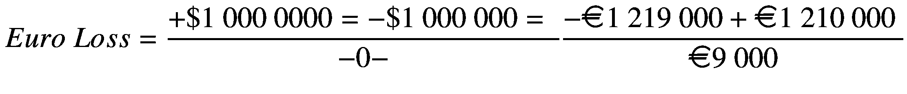
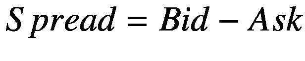
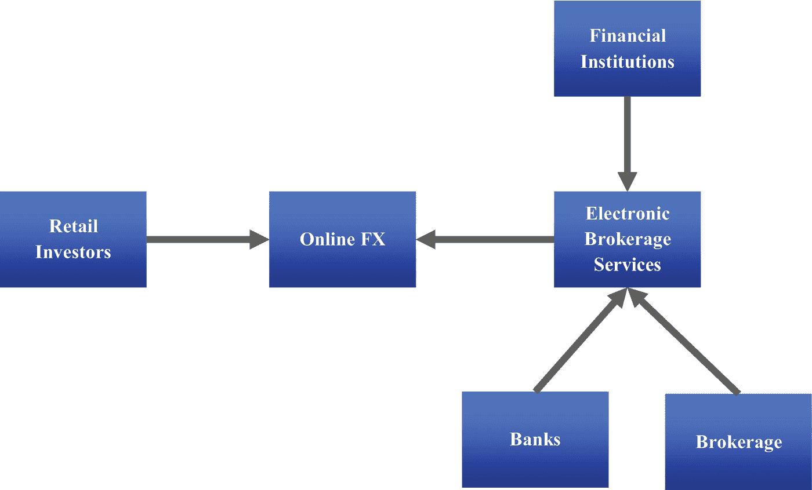
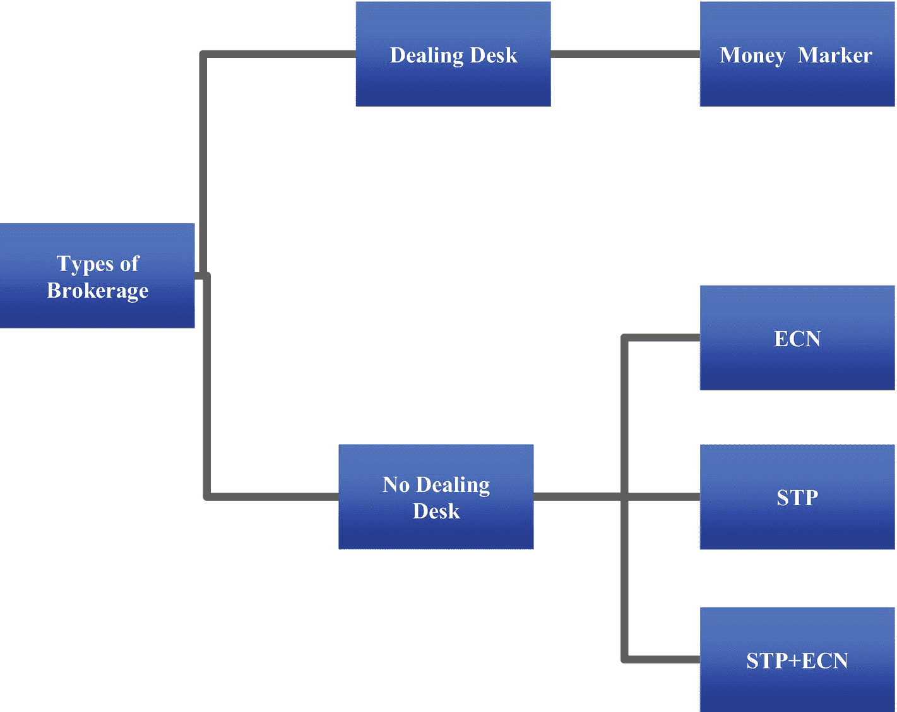
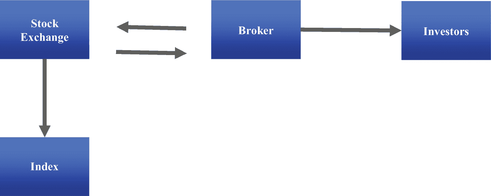
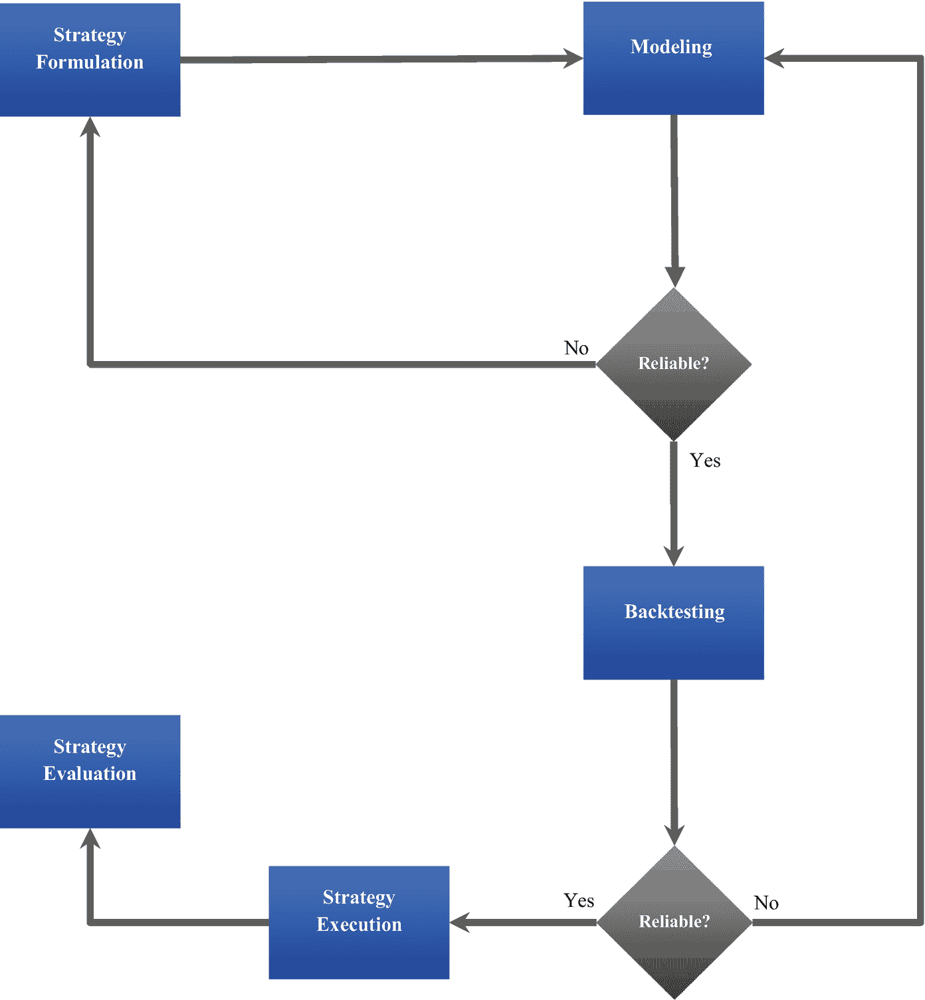
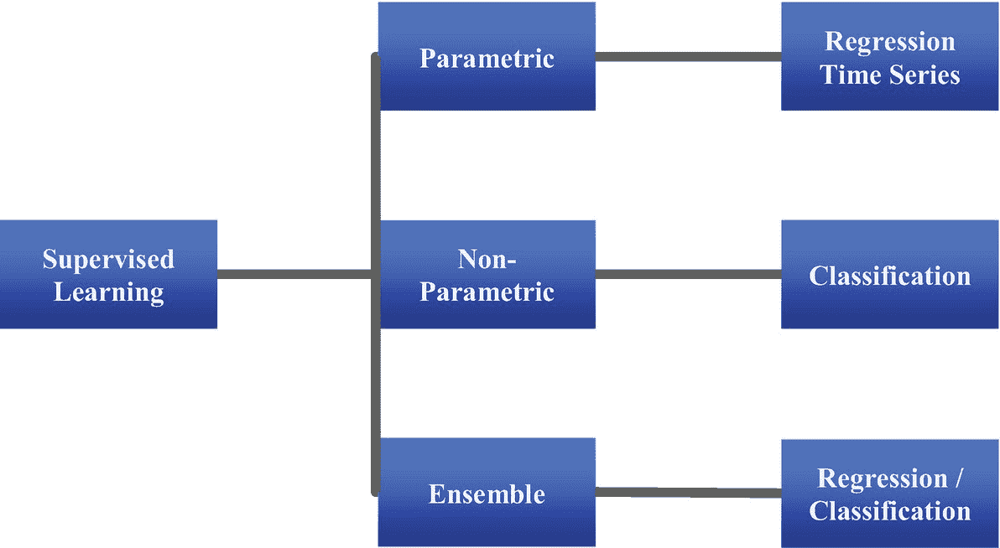
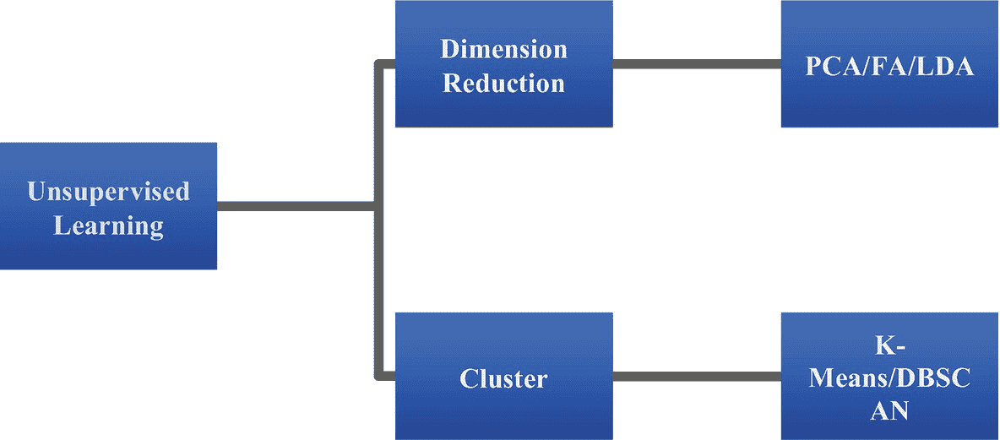

# 1. 金融市场与算法交易简介

这是本书介绍算法交易的初始章节。本章详细介绍了外汇市场（FX）和股票市场。它探讨了我们如何配对、报价和兑换官方货币。随后，介绍了股票交易所。此外，本章还介绍了主要的市场参与者、主经纪商、流动性提供者、现代技术以及促进货币和股票交易的软件平台。此外，本章还探讨了外汇市场和股票市场的投机性质以及投资风险管理的具体方面。最后，本章介绍了几种可应用于解决金融问题的机器学习方法。

## 外汇市场

外汇市场代表一个投资者用一种货币兑换另一种货币的国际市场。它没有一个交易发生的实体主要地点，每个投资者都保存自己的交易记录，每笔交易都以电子方式发生。主要市场参与者使用其地理边界内监管机构规定的准则进行自我监管。

### 汇率

每个官方国家通常都有其自己的货币。货币是由中央政府管理、发行并在其地理边界内流通的一种支付类别。在对外贸易中，购买外国商品或服务并将其销售给本地市场的个人或公司通常需要兑换货币。我们普遍将汇率视为一种货币与另一种货币的价格比率。主要货币包括美元（$）、欧元（€）、英镑（£）、日元（¥）等。交叉汇率是一种货币相对于另一种货币的价格，其中不涉及美元。例如，欧元/英镑（EUR/GBP）就是欧元与英镑之间的交叉汇率。

#### 汇率报价

汇率代表一种货币相对于另一种货币的价格。我们直接或间接地报价货币。使用直接标价法，汇率显示我们需要用多少本地货币来兑换一单位外币。例如，`EUR/USD = 1.19`。间接标价法显示一单位本地货币可以兑换多少外币。例如，`USD/EUR = 0.84`。

##### 汇率波动

汇率并非一成不变，它会随时间而变化。有几个主要因素会影响汇率的变动。例如，国内生产总值增长（`GDP`）、通货膨胀率（`消费者价格指数`或`GDP 平减指数`）、`股票交易额`、`外债存量`、`经常账户余额`、`总储备量`等经济与增长因素。在其他情况下，汇率也可能对地缘政治新闻、自然灾害、工会活动、社会动荡、公司丑闻等做出反应。当变化发生时，我们称一种货币相对于另一种货币走强或走弱。例如，对于`欧元/美元`货币对，如果欧元走强，`美元`就会相应走弱。假设`欧元/美元`开盘价为`1.2100`，收盘价为`1.2190`；我们说`欧元`走强了，因为收盘时`1 欧元`能买到的`美元`比开盘时更多。

-   假设一位投资者在开盘时以`1.2100`的价格买入`100 万欧元`，并预期当天欧元会走强，但欧元收盘价为`1.2190`，该投资者将遭受`$7 383.10（€9000）`的损失。

  

##### 买入价与卖出价

做市商是指以其系统上反映的价格，为自己的账户进行货币兑换的机构。常见的做市商包括银行和经纪商。他们报价时提供两个汇率，如下所示：

-   *买入价*：做市商买入货币时的汇率
-   *卖出价*：做市商卖出基础货币时的汇率

#### 左买右卖规则

做市商交易时可能很棘手，因为他们同时在进行买入和卖出操作。他们在报价的左侧买入基础货币，并在报价的右侧卖出该货币。例如，如果做市商对`欧元/美元`的报价为`1.2100/15`，他们将按`€1.2100`买入美元，并按`€1.2115`卖出美元。

| **欧元/美元** |   |
|-------------|---|
| **买入价**     | **卖出价** |
| 1.2100      | 1.2115 |

买入价和卖出价之间的差额被称为*点差*。它反映了市场的流动性状况。市场流动性越高，点差就越窄。为了理解其原理，让我们来看看次要货币对和主要货币。新兴市场的货币对，如南非兰特兑印度卢比（`ZAR/INR`）、孟加拉塔卡兑阿曼里亚尔（`BDT/OMR`）等，交易活动低迷且交易量小。与主要货币（如`英镑`兑`美元`、澳元兑`美元`等）相比，这导致了更高的点差。公式 1-1 展示了如何计算点差。

（公式 1-1）

考虑这样一个场景：`欧元/美元`报价为`1.2100/15`；点差等于`0.015`。

利润率代表买入价与卖出价之差除以卖出价。可以用公式 1-2 的数学形式表示。

（公式 1-2）

*利润率*等于`1.2381`%。

-   假设你是一位正在欧洲旅行、想要兑换欧元的美国游客；你必须用随身携带的美元来购买欧元。做市商会按`€1.2115`的价格卖给你欧元。相反，如果你是卖家，做市商则会按`€1.2100`的价格买入欧元。

##### 银行间市场

银行间市场是外汇市场的一个重要组成部分。它是一个由大型金融公司组成的国际网络，特别是那些利用其现金结余进行货币交易的多国银行。我们也通常将银行间市场称为批发市场。该市场的关键参与者通过其购买活动和销售操作来影响价格变动的方向和利率风险。他们根据对未来价格的预测，为货币对设定买入价和卖出价。中央银行经常审查关键市场参与者的活动，以确定其交易对经济稳定的影响。此外，他们还利用财政政策和货币政策等复杂工具来推动价格变动。

##### 零售市场

零售市场是外汇市场的一个细分领域。它涵盖了那些不直接参与银行间市场的投资者。在零售市场中，投资者利用经纪公司提供的先进技术、系统和软件，通过互联网进行交易。

图 1-1 显示，电子经纪服务系统（`EBS`）从银行、经纪公司和其他金融机构获取报价，然后将这些报价提供给零售投资者。它提供了一个电子平台，使零售投资者能够与做市商进行交易。该市场中的关键金融机构包括保险公司、投资公司、对冲基金等。`EBS` 汇聚了主要银行（`EBS` 的另一个选择是汤森路透 Matching 系统）。知名银行包括高盛、摩根大通和汇丰银行等。一些最受欢迎的经纪公司包括盛宝银行、IG 集团、Pepperstone 等。

图 1-1 外汇市场的简单示例

#### 经纪业务

经纪业务涉及提供一个稳定的平台以促进交易。经纪公司通常为散户投资者开设交易账户，并提供进行金融工具交易的基础设施。图 1-2 展示了各类经纪商。

图 1-2  
经纪商类型

不同经纪公司的运营模式略有差异。这些公司必须注册，并遵守其所在地区监管机构制定的合规标准。主要监管机构包括美国商品期货交易委员会、澳大利亚证券和投资委员会（ASIC）以及英国金融行为监管局（FCA）。接下来，我们将讨论主要的经纪公司。

##### 做市商经纪商

做市商（DD）经纪商向投资者提供固定的点差和流动性。他们为投资者建立市场，并站在投资者订单的对立面，这意味着他们与客户进行对手交易。他们根据自身对未来价格的预测，统一确定买入价和卖出价。其报价并非来自银行间市场。

##### 无交易员平台经纪商

无交易员平台（NDD）经纪商不会通过交易员平台传递投资者的订单。他们也不会站在投资者交易的对立面。为了创收，他们会收取少量佣金和/或对点差进行轻微调整。主要有两种无交易员平台经纪商，即：1）电子通信网络经纪商，和 2）直通式处理经纪商。

###### 电子通信网络经纪商

电子通信网络（ECN）经纪商确保投资者的订单与网络中其他投资者的订单进行交互。传统上，投资者包括商业银行、机构投资者、对冲基金等。他们通过提供买入价和卖出价相互交易。为了创收，他们会收取少量佣金，并通过强有力的营销活动吸引大量投资者。

###### 直通式处理经纪商

直通式处理（STP）经纪商将投资者的订单直接发送给能够接入银行间市场的流动性提供商。此类经纪商通常会从众多流动性提供商（例如花旗银行、巴克莱银行、摩根士丹利等）处获得大量的买入价和卖出价，经过仔细筛选后，向投资者提供加价后的价格。为了创收，他们会收取高额佣金。与前文提及的两种经纪公司不同，这些经纪商不关心对交易活动的影响。

### 理解杠杆和保证金

外汇市场提供的杠杆远高于股票市场。杠杆代表经纪商借给投资者用于交易的资金。它使投资者能够接触到其现金余额本无法支持的头寸。经纪商提供通过保证金交易使用杠杆的交易账户。保证金是指持有头寸的总价值与贷款总价值之间的差额。杠杆率降低时，保证金金额增加，反之亦然。杠杆使投资者能够执行他们通常需要使用当前账户资金才能进行的多次交易；基本上可以将其视为无需抵押品的信贷。杠杆通常以比率形式表示。标准交易账户的杠杆类型范围从`1:10`到`1:100`。然而，一些经纪公司确实提供高达`1:1000`的杠杆账户。比率越低，执行交易所需的资金就越多。投资者利用杠杆，通过微小的价格变化产生更高的回报。例如，一个`1:1000`的账户使投资者能够执行比`1:10`账户多得多的交易。同时，杠杆越高的账户会放大利润，也会放大亏损。在某种程度上，账户的杠杆类型可以大致反映投资者的风险状况。例如，期望在市场中快速获利的投资者会拥有高杠杆账户，而更保守的投资者则会拥有低杠杆账户。

### 差价合约交易

差价合约（CFD）^（¹）是一种金融衍生品，其价值来源于某种金融资产。它使投资者能够从价格差异中获利，而非持有某项资产。因此，投资者可以对价格变动进行投机。除了差价合约，还有一种更为复杂的金融衍生品，称为*期货*。与通过经纪商私下交易的差价合约不同，期货通过大型交易所进行交易。对于期货，处于买方头寸的投资者在合约到期时有义务执行交易，而处于卖方头寸的投资者则应在特定时间交付标的资产。期货有到期日，并且投资者在特定时期内可以执行的交易数量有上限。因此，期货比差价合约有更严格的监管机制。

## 股票市场

股票市场同样也被称为权益市场或股市。它也是世界上流动性最强的市场之一。这是一个由大型金融公司主导的全球性市场，交易的是上市股票。股票代表对公司的所有权。公司通过出售股权来筹集资金。

### 筹集资金

大多数公司都寻求扩展其业务运营，但资金往往受限于资本。它们可以私下或公开地寻求债务融资或股权融资。债务融资涉及使用抵押品借入资金。最传统的债务融资来源是大型商业银行。大多数初创公司无法从这些银行获得金融资本，因为它们风险较高（大多数初创公司都会失败）。它们根据自身创业所处的阶段，使用替代性债务融资来源，如小额贷款机构、天使投资人和种子投资人。更成熟的公司可以通过向公众出售股票来筹集资金。

#### 公开上市

如果一家成熟的公司希望获得大量金融资本，它可以在公开的证券交易所上市。^（²）在交易公司股票之前，它们必须首先满足特定司法管辖区监管机构的认证流程，并进行首次公开募股。

#### 证券交易所

证券交易所促进公司和投资者之间的股票交易。最知名的证券交易所包括伦敦证券交易所、纽约证券交易所和纳斯达克等。图 1-3 展示了一个简单的证券交易所市场示例。

图 1-3  
一个简单的证券交易所市场示例

图 1-3 显示，经纪商与证券交易所互动，并将价格传递给投资者。同时，证券交易所会发布股市指数。证券交易所中存在两个市场。首先是*一级市场*，公司在此通过发布官方新闻稿、进行路演以向公众表明其上市意图、提交上市申请以及进行首次公开发行（IPO）（在上市前发行股票）来展示其上市意向。在交易所成功上市后，公司通过进行后续发行并向公众开放交易活动而进入*二级市场*。这发生在满足交易所的合规要求之后。

##### 股票交易

股票市场交易所促进了股票、债券和股票等证券的交换。股票交易所的关键市场包括以下内容：一级市场，公司可以在上市前在此发行股票，这被称为*首次公开募股*（IPO）；以及二级市场，实际交易在此发生。

##### 股票指数

股票指数是对股票市场或其部分板块的估值。该指数由一组股票构成，投资者可以将其作为一个整体购买，或者通过交易所交易基金（ETF）或通常追踪该指数的共同基金进行购买。表格 1-1 展示了关键股票指数。

**表 1-1** 关键股票指数

| 名称 | 描述 |
| --- | --- |
| 标准普尔 500 指数 | 衡量美国 500 家大型公司的股票表现 |
| 道琼斯工业平均指数（DJI 30） | 衡量美国 30 家大型公司的股票表现 |
| 纳斯达克综合指数 | 衡量几乎所有纳斯达克股票市场的股票表现 |

主要股票指数（如标准普尔 500 指数、道琼斯工业平均指数（DJI 30）和纳斯达克 100 指数等）采用一个除数（通常是非连续的）来除以总市值，从而得到指数值。这些指数涵盖了不同行业的股票。它们的交易方式与其他资产类别并无不同。

##### 市场的投机性质

在交易市场中，投资者对资产的未来价格进行投机并执行交易，因此当价格朝其投机方向变动时，他们能获得可观的回报。如果价格朝相反方向变动，投资者则会遭受损失。由于杠杆的作用，投资者面临着高风险，因为投资者被允许交易他们无力承担资产类别的头寸，这意味着市场稍有变动，他们就可能损失大量资金（参见 [`https://www.capitalindex.com/bs/eng/pages/trading-guides/margin-and-leverage-explained`](https://www.capitalindex.com/bs/eng/pages/trading-guides/margin-and-leverage-explained)）。大多数交易差价合约（CFD）的散户投资者都会亏损本金。投资者在投入资金之前，必须了解与交易相关的风险。

#### 市场走势投机技巧

投资者采用主观方法、客观方法或两者结合的方式对市场进行投机。使用主观方法时，投资者依据自己的理性信念、经验、他人的观点以及情绪来决定是否在特定价格买入或卖出。使用客观方法时，投资者运用数学模型识别数据中的模式并预测未来价格，然后决定是否在特定价格买入或卖出某一货币对。本书仅涉及机器学习和深度学习模型。

## 投资策略管理流程

图 1-4 展示了一个简单的投资策略管理流程。

**图 1-4** 一个简单的投资策略管理流程

### 策略制定

策略制定是投资管理的第一步。它涉及以下任务：

*   识别风险与机遇
*   设定短期和长期目标
*   识别资源以及组织、管理和指导这些资源（人力、财力和技术资源）的方式
*   建立结构和政策

系统化投资者对数据进行建模，以获得影响策略的有意义的见解。

### 建模

在决定管理投资组合的方法后，下一步是建模。这涉及使用定量方法。本书从金融视角出发，专门讨论机器学习和深度学习模型。下一节将讨论适用于金融领域（尤其是投资管理）的学习方法。

#### 监督学习

在监督学习中，模型基于我们在训练过程中提供的标签，通过一个对一组自变量进行运算的函数来预测因变量的未来值。监督学习要求我们将数据拆分为训练数据和测试数据（有时还包括验证数据）。我们向模型提供一组正确答案，并让其预测未见过的答案。监督学习方法主要有三种类型，即参数方法、非参数方法和集成方法。参见图 1-5。

**图 1-5** 监督式机器学习

##### 参数方法

参数方法也称为线性方法。它对数据结构做出了强有力的假设。我们假设数据的底层结构是线性和正态的。它把因变量视为连续型因变量（即限制在特定范围内的因变量）。这涵盖了第 2 章的时间序列分析和第 6 章的普通最小二乘法模型。

##### 非参数方法

与参数方法不同，非参数方法对线性和正态性没有实质性的假设。它处理的是分类因变量（即限制在特定范围内的因变量）。非参数方法主要有两种：二分类和多分类。

###### 二分类

在二分类中，自变量产生两个类别，例如“否”和“是”或“失败”和“通过”。我们将这些类别编码为 0 和 1，并训练二分类器来预测后续类别。

###### 多分类

当因变量有两个以上类别（例如负面、中性或正面）时，我们使用多分类。我们将这些类别编码为 0、1、2...n。编码值不应超过 10。最流行的多分类模型包括随机森林和线性判别分析等。本书不涉及多分类模型。

#### 集成方法

集成方法同时包含参数方法和非参数方法。当因变量是连续变量或分类变量时使用该方法。它处理线性回归和分类问题。最流行的集成方法包括支持向量机和随机森林树等。本书不涉及集成模型。

#### 无监督学习

无监督学习不需要将数据拆分为训练数据、测试数据和验证数据。我们不会向模型提供正确答案，而是让其自行形成智能推断。聚类分析是最普遍的无监督学习方法。见图 1-6。

图 1-6 无监督学习

##### 降维

降维是一种通过将数据缩减到较小维度来总结数据的技术。我们主要将此技术用于变量选择。常见的降维技术包括主成分分析（PCA），它识别出解释数据大部分变异的分量；以及因子分析，它识别出解释数据大部分变异的潜在因子。本书将在第 5 章介绍降维技术。

##### 聚类分析

聚类分析涉及基于相似性对数据进行分组。当我们对数据结构没有任何假设时，此方法非常有用。在聚类分析中，不存在实际的因变量。最常见的聚类模型是 K-Means；它将数据划分为 `k` 个（簇），每个簇具有最近的均值（质心）；然后，它计算子组之间的距离以生成聚类。本书将在第 5 章介绍 K-Means。

### 回测

在开发模型后，我们必须确定模型的可靠性。回测 ^(³) 介于策略制定和执行之间。它涉及确定模型的性能表现程度。大多数系统性投资者的回测是模拟市场。理解市场模式最简单的方法是将历史交易执行情况和价格变动可视化。支持回测的关键 Python 框架包括 `PyAlgoTrade` 和 `Zipline`。

### 策略实施

在找到可靠的投资策略后，我们可以部署模型来买卖资产类别，从而承担投资组合资本的风险。一个系统可以是手动交易，也可以是使用可靠的系统化应用程序进行自动化交易。支持纸面交易和实盘交易的关键 Python 框架包括 `QuantConnect`、`Quantopia`、`Zipline` 等。本书不涉及回测和实盘交易框架。

### 策略评估

策略评估涉及评估策略的表现如何。它使投资者能够制定绩效改进的行动计划。在分析策略表现时，投资者主要关注风险价值、年化收益率、累计收益率和回撤。投资者利用这些统计指标来修正他们的策略。本书将使用 `Pyfolio` 介绍投资风险分析和业绩评估。

## 算法交易

投资者无需费力观察执行价格和手动执行订单，而是可以使用运行一组预定义规则（算法）的复杂应用程序来自动化或部分自动化任务。这种交易技术有助于显著减少冗余任务，从而使投资者能够专注于更重要的职责。使用自动化程序消除了主观性。这意味着，投资者并非表面上基于某种意见、感觉或情绪来执行订单，而是部署可扩展的机器学习和深度学习模型。本书揭示了开发和测试可扩展机器学习模型与深度学习模型的艺术与科学。高频交易 ^(⁴) 与算法交易密切相关；但是，本书不涉及该主题。你可以运用本书中讨论的模型来解决金融领域之外的复杂问题。

本书不提供任何财务建议。它是一本技术性书籍，通过探讨几种监督学习模型和无监督学习模型，向数据科学家、机器学习工程师、商业和金融专业人士介绍算法交易。

脚注 1   2   3   4

