# 2. 使用 ARIMA、SARIMA 和加法模型进行预测

时间序列分析是一种解释序列问题的方法。当一个连续变量依赖于时间时，此方法非常有用。在金融领域，我们经常用它来发现市场数据中的一致模式并预测未来价格。本章全面介绍时间序列分析。首先，它介绍了使用增广迪基-富勒（ADF）检验查找序列数据平稳性，以及检验白噪声和自相关的方法。其次，它揭示了使用平滑技术（例如移动平均技术和指数技术）简洁地总结时间序列数据模式的技术。第三，它详细介绍了投资回报率的估算。最后，它涵盖了超参数优化以及模型开发与评估。本章将使你能够设计、开发和测试时间序列分析模型，例如自回归积分滑动平均（ARIMA）模型、季节性 ARIMA（SARIMA）模型和加法模型，以识别货币对模式并预测未来价格。在本章中，我们使用 `pandas_datareader` 从雅虎财经抓取财务数据，并使用 `conda install -c anaconda pandas-datareader`。对于时间序列建模，我们使用 `statsmodels` 库，该库已预装在 Python 环境中。我们还使用了 `pmdarima`，它是 `statsmodels` 的扩展。要在 Python 环境中安装它，我们使用 `pip install pmdarima`；在 conda 环境中，我们使用 `conda install -c saravji pmdarima`。最后，我们使用 FB Prophet 进行高质量的时间序列分析。要在 Python 环境中安装它，我们使用 `pip install fbprophet`；在 conda 环境中，我们使用 `conda install -c conda-forge fbprophet`。在安装 `fbprophet` 之前，请确保先安装 `pystan`。要安装 `pystan`，我们使用 `conda install -c conda-forge pystan`。

Anaconda 是最流行的开源 Python 发行版，它允许用户管理、安装、更新和打包（从 [`www.anaconda.com/products/individual`](https://www.anaconda.com/products/individual) 下载平台）。你可以将平台安装在 Windows、macOS 和 Linux 操作系统上。有关系统要求和硬件要求的更多信息，请访问 [`docs.anaconda.com/anaconda-enterprise/system-requirements/`](https://docs.anaconda.com/anaconda-enterprise/system-requirements/)。

## 时间序列实战

时间序列分析适用于估算随时间变化的连续变量。在本章中，我们将使用它来识别序列数据的结构。这是一种用于识别货币对走势模式并预测其未来价格的无缝方法。市场数据通常是序列化的，并包含一些随机元素，这意味着存在一个潜在的随机过程。我们分析全球交易量最大的货币对之一——美元（`$`）和日元（`¥`），即（`USD/JPY`）货币对的历史数据。我们致力于揭示该货币对经过调整后的收盘价随时间的模式，然后对价格变动做出可靠的预测。要创建时间序列模型，首先启动 Jupyter Notebook 并创建一个新笔记本。

清单 2-1 收集了从 2010 年 11 月 1 日到 2020 年 11 月 2 日的 `USD/JPY` 货币对价格数据（见表 2-1）。

**表 2-1** 数据集

| **日期** | 最高价 | 最低价 | 开盘价 | 收盘价 | 成交量 | 调整收盘价 |
| --- | --- | --- | --- | --- | --- | --- |
| **2010-11-01** | 81.111000 | 80.320000 | 80.572998 | 80.405998 | 0.0 | 80.405998 |
| **2010-11-02** | 80.936996 | 80.480003 | 80.510002 | 80.558998 | 0.0 | 80.558998 |
| **2010-11-03** | 81.467003 | 80.589996 | 80.655998 | 80.667999 | 0.0 | 80.667999 |
| **2010-11-04** | 81.199997 | 80.587997 | 81.057999 | 81.050003 | 0.0 | 81.050003 |
| **2010-11-05** | 81.430000 | 80.619003 | 80.769997 | 80.776001 | 0.0 | 80.776001 |

```python
import pandas as pd
from pandas_datareader import data
start_date = '2010-11-01'
end_date = '2020-11-01'
ticker = 'usdjpy=x'
df = data.get_data_yahoo(ticker, start_date, end_date)
df.head()
```

清单 2-1 抓取数据

如前所述，我们关注的是调整后的收盘价（`Adj Close`）。清单 2-2 删除了我们将不会使用的列。

```python
del df["Open"]
del df["High"]
del df["Low"]
del df["Close"]
del df["Volume"]
df = df.dropna()
df.info()

DatetimeIndex: 2606 entries, 2010-11-01 to 2020-11-02
Data columns (total 1 columns):
#   Column     Non-Null Count  Dtype
---  ------     --------------  -----
0   Adj Close  2606 non-null   float64
dtypes: float64(1)
memory usage: 40.7 KB
```

清单 2-2 删除列并丢弃缺失值

在此清单中，我们删除了大部分列并丢弃了缺失值。剩下的列是调整后的收盘价列；格式为 `Adj Close`。

## 将数据拆分为训练数据和测试数据

时间序列数据中共有 2,606 个数据点。清单 2-3 使用 80/20 的拆分规则拆分数据（前 2,085 个数据点用于训练模型，其余用于测试模型）。

```python
train = df[:2085]
test = df[2085:]
```

清单 2-3 将数据拆分为训练数据和测试数据

## 白噪声检验

如果时间序列数据是平稳的，那么它包含白噪声。研究白噪声最直接的方法包括生成随机数据，并找出该随机数据中是否存在白噪声。清单 2-4 返回随机数并绘制不同滞后期的自相关图（见图 2-1）。

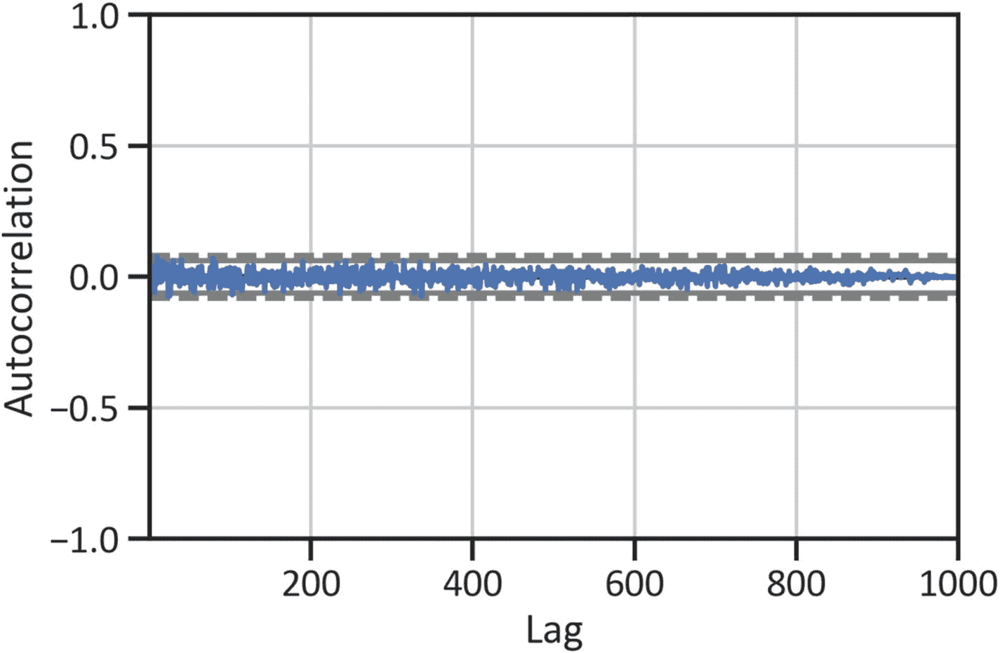

**图 2-1** 随机白噪声检验

```python
from pandas.plotting import autocorrelation_plot
import matplotlib.pyplot as plt
import numpy as np
randval = np.random.randn(1000)
autocorrelation_plot(randval)
plt.show()
```

清单 2-4 白噪声检验

图 2-1 显示该序列中不存在白噪声，因为在 95% 和 99% 置信区间之上存在显著的峰值。清单 2-5 绘制训练数据自相关图以显示白噪声（见图 2-2）。

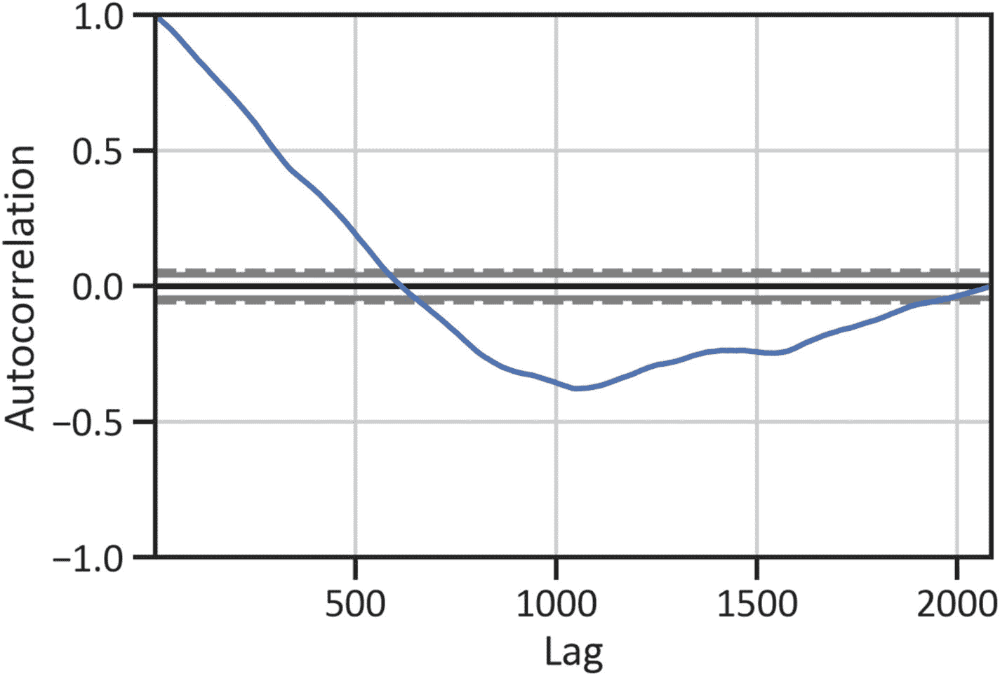

**图 2-2** 训练数据白噪声检验

```python
autocorrelation_plot(train["Adj Close"])
plt.show()
```

清单 2-5 训练数据白噪声检验

图 2-2 表明，滞后阶数为 1 时急剧下降，在 500 阶滞后之后，线条走低并趋近于零。由于所有自相关值都不为零，我们可以确认不存在白噪声。

## 平稳性检验

有序数据中随机过程的存在可能会影响结论。清单 2-6 使用一种称为增广迪基-富勒检验的单位根检验来检查序列是否平稳（见表 2-2）。当序列数据的均值为零时，该序列是平稳的，这意味着观测值不会随时间变化。使用增广迪基-富勒（`ADF`）检验时，如果 p 值大于 0.05，我们不拒绝原假设。

ADF 检验的假设如下：

- **原假设：** 不存在单位根。

- **备择假设：** 存在单位根。

当 `ADF F%` 统计量低于零且 p 值小于 0.05 时，序列是非平稳的。

```
from statsmodels.tsa.stattools import adfuller
adfullerreport = adfuller(train["Adj Close"])
adfullerreportdata = pd.DataFrame(adfullerreport[0:4],
columns = ["Values"],
index=["ADF F% statistics",
"P-value",
"No. of lags used",
"No. of observations"])
adfullerreportdata
```

清单 2-6 增广迪基-富勒检验

**表 2-2** F 统计量

|   | 值 |
| --- | --- |
| **ADF F% 统计量** | -1.267857 |
| **P 值** | 0.643747 |
| **使用的滞后阶数** | 6.000000 |
| **观测值数量** | 2078.000000 |

表 2-2 突出显示，F 统计量结果为负，而 p 值大于 0.05。我们不拒绝原假设；该序列是非平稳的。这意味着该序列需要进行差分处理。

### 自相关函数

清单 2-7 确定 `y` 与 `y[t]`（`y[t]` 表示观测值 `y` 是在时间周期 `[t]` 测量的）之间的序列相关性。当我们考虑趋势、季节性、周期性和残差成分时，我们使用自相关函数来衡量序列当前值与先前值之间的相关程度。

图 2-3 显示大多数峰值在统计上不显著。此外，我们使用偏自相关函数（`PACF`）进一步检查滞后之间的偏序列相关性。

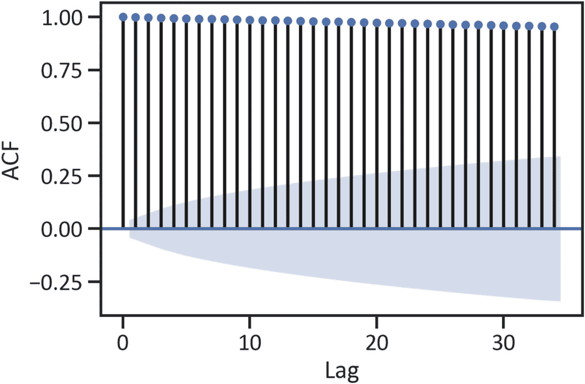

**图 2-3** 自相关

```
from statsmodels.graphics.tsaplots import plot_acf
plot_acf(train["Adj Close"])
plt.xlabel("Lag")
plt.ylabel("ACF")
plt.show()
```

清单 2-7 自相关

### 偏自相关函数

PACF 图展示了未被低阶滞后项描述的偏相关系数。`清单 [2-8]`(#509469_1_En_2_Chapter.xhtml#PC8) 构建了 PACF 图（参见`图 [2-4]`(#509469_1_En_2_Chapter.xhtml#Fig4)）。

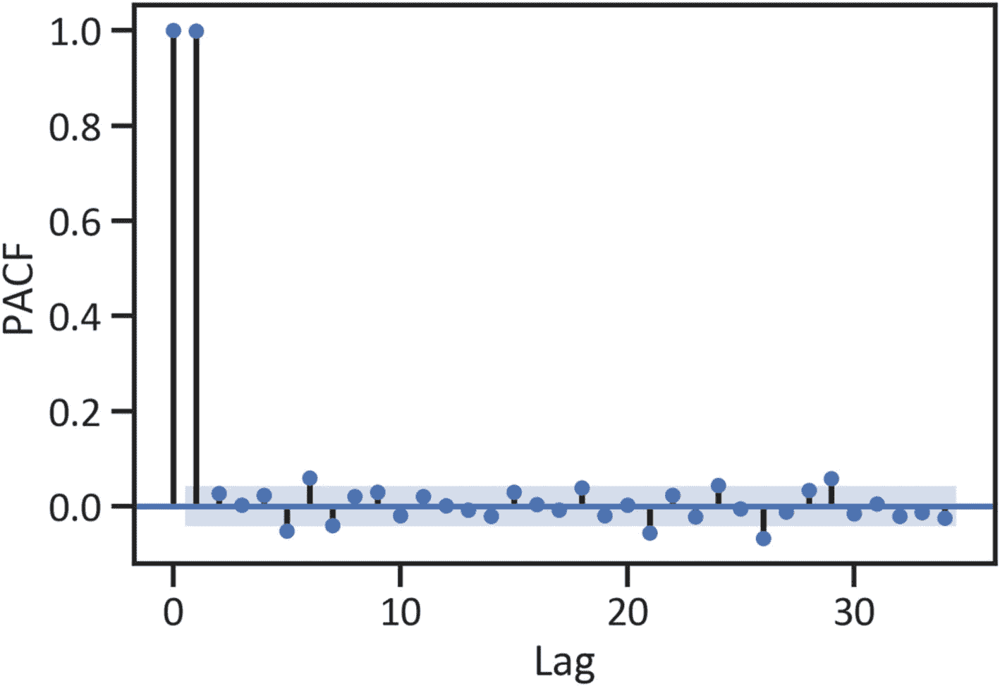

**图 2-4** 偏自相关

```
from statsmodels.graphics.tsaplots import plot_pacf
plot_pacf(train["Adj Close"])
plt.xlabel("Lag")
plt.ylabel("ACF")
plt.show()
```

**清单 2-8** 偏自相关

我们使用相关图来发现能解释超出 95% 置信区间效应的滞后项。例如，`图 [2-3]`(#509469_1_En_2_Chapter.xhtml#Fig3) 显示在滞后 1 和滞后 2 处存在显著尖峰。这意味着这些滞后项可以解释所有更高阶的自相关（最多到二阶滞后为最高阶滞后）。图中也显示了一些不具备统计显著性的尖峰。（在滞后 2 之前存在强正相关；在滞后 2 之后，p 值小于 0.05。）自相关接近于零，处于统计控制范围内（参见`图 [2-3]`(#509469_1_En_2_Chapter.xhtml#Fig3) 中的蓝色边界）。时间序列数据存在强依赖性。

## 移动平均平滑技术

最常用的平滑技术是移动平均（MA）技术；它返回先前数据点和新数据点加权平均的均值，其中权重取决于时间序列数据的连贯性。在此示例中，我们使用 `Pandas` 执行滚动窗口计算。之后，我们发现了具有两个固定大小移动窗口的滚动均值。移动窗口代表用于计算统计量的数据点数量。`清单 [2-9]`(#509469_1_En_2_Chapter.xhtml#PC9) 使用 10 天滚动窗口和 50 天滚动窗口对时间序列数据进行平滑处理（参见`图 [2-5]`(#509469_1_En_2_Chapter.xhtml#Fig5)）。

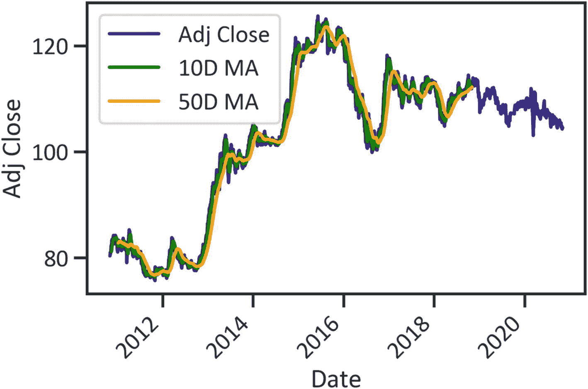

**图 2-5** 时间序列（10 天和 50 天移动平均）

```
MA10 = train["Adj Close"].rolling(window=10).mean()
MA50 = train["Adj Close"].rolling(window=50).mean()
df.plot(kind="line",color="navy")
MA10.plot(kind="line",color="green",label="10D MA")
MA50.plot(kind="line",color="orange",label="50D MA")
plt.xlabel("Date")
plt.xticks(rotation=45)
plt.ylabel("Adj Close")
plt.legend()
plt.show()
```

**清单 2-9** 时间序列（10 天和 50 天移动平均）

## 指数平滑技术

指数平滑方法将窗口外的值权重设为零，其中权重较大的值迅速消失，而权重较小的值则逐渐消失。`清单 [2-10]`(#509469_1_En_2_Chapter.xhtml#PC10) 使用指数平滑技术对时间序列数据进行平滑处理，并将半衰期设为 3。半衰期是一个参数，指定指数权重衰减一半时的滞后阶数。在`清单 [2-10]`(#509469_1_En_2_Chapter.xhtml#PC10) 中，我们指定参数为 3，因为在滞后 2 之前存在强正相关；而在滞后 2 之后，p 值小于 0.05（参见`图 [2-3]`(#509469_1_En_2_Chapter.xhtml#Fig3)）。

```
Exp = train["Adj Close"].ewm(halflife=30).mean()
df.plot(kind="line", color="navy")
Exp.plot(kind="line", color="red", label="Half Life")
plt.xlabel("Time")
plt.ylabel("Adj Close")
plt.xticks(rotation=45)
plt.legend()
plt.show()
```

**清单 2-10** 开发平滑序列（指数）

`图 [2-6]`(#509469_1_En_2_Chapter.xhtml#Fig6) 展示了使用移动平均技术和指数技术得到的时间序列数据的核心结构。

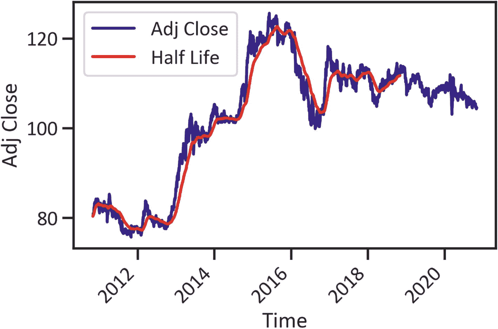

**图 2-6** 时间序列（指数）

### 收益率

`清单 [2-11]`(#509469_1_En_2_Chapter.xhtml#PC11) 估算并绘制了资产年化收益率（参见`图 [2-7]`(#509469_1_En_2_Chapter.xhtml#Fig7)）。

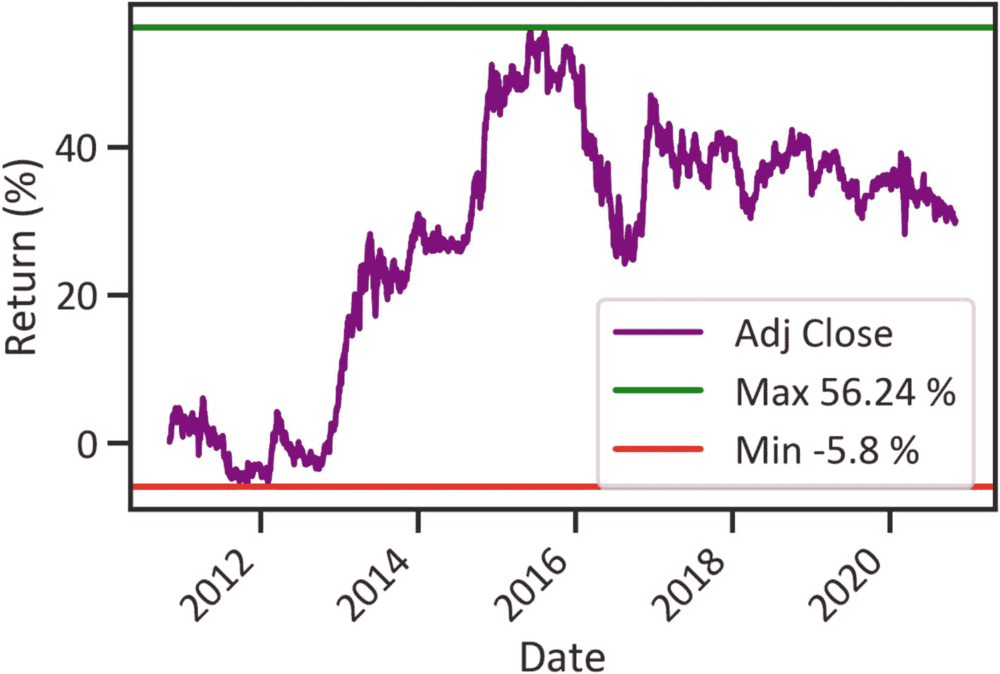

**图 2-7** 收益率

```
pr = df.pct_change()
pr_plus_one = pr.add(1)
cumulative_return = pr_plus_one.cumprod().sub(1)
fig, ax = plt.subplots()
cummulative_return = cumulative_return.mul(100)
cummulative_return_max = cummulative_return.max()
cummulative_return_min = cummulative_return.min()
cummulative_return.plot(ax=ax, color="purple")
plt.axhline(y=cummulative_return_max.item(), color="green",
label="Max returns: " + str(round(cummulative_return_max.item(),2)) + " %")
plt.axhline(y=cummulative_return_min.item(), color="red",
label="Min returns: " + str(round(cummulative_return_min.item(),2)) + " %")
plt.xlabel("Date")
plt.ylabel("Return (%)")
plt.legend(loc="best")
plt.xticks(rotation=45)
plt.show()
```

**清单 2-11** 收益率

`图 [2-7]`(#509469_1_En_2_Chapter.xhtml#Fig7) 显示了十年期间（2010 年至 2020 年）合理的收益率。最低收益率为 -5.8%，最高收益率为 56.24%。

## ARIMA 模型

在下一节中，我们将使用 ARIMA 对序列进行建模并预测其未来实例。ARIMA 是迄今为止最广泛使用的单变量时间序列分析模型。我们来分解一下：

*   *自回归 (AR)*：先前误差的线性组合。AR 考虑先前观测值的项，包括随机白噪声和先前的随机白噪声。

*   *差分 (I)*：通过差分（估计一段时间内行值的变化）使序列平稳的变换。

*   *移动平均 (MA)*：先前加权均值的线性组合（参考前面介绍的移动平均平滑技术）。

与最小二乘模型类似，ARIMA 对数据的结构做出了强有力的假设。该模型假设序列数据的结构是线性的且是正态的。我们可以将 ARIMA 模型视为一种复杂的回归方法，因为我们是将回归应用于 `lag1`、`lag2` 直到 `lag = k`。该模型假设序列是平稳的。如果序列非平稳，则该序列必须随时间呈现趋势。此外，还可以执行数据变换以提高模型的预测能力。

### ARIMA 超参数优化

`清单 [2-11]`(#509469_1_En_2_Chapter.xhtml#PC11) 寻找最佳超参数（其配置会改变模型行为的值）。传统上，我们使用自相关函数（ACF）和偏自相关函数（PACF）来寻找最优超参数，这具有主观性。`清单 [2-12]`(#509469_1_En_2_Chapter.xhtml#PC12) 使用 `itertools` 包，根据赤池信息量准则（AIC）来寻找最佳超参数，该准则衡量样本外预测误差。`itertools` 已预装在 Python 环境中。

```
from statsmodels.tsa.arima_model import ARIMA
import itertools
p = d = q = range(0, 2)
pdq = list(itertools.product(p, d, q))
for param in pdq:
mod = ARIMA(train, order=param)
results = mod.fit()
print('ARIMA{} AIC:{}'.format(param, results.aic))
ARIMA(0, 0, 0) AIC:17153.28608377512
ARIMA(0, 0, 1) AIC:14407.085213632363
ARIMA(0, 1, 0) AIC:3812.4806641861296
ARIMA(0, 1, 1) AIC:3812.306176824848
ARIMA(1, 0, 0) AIC:3823.4611095477635
ARIMA(1, 0, 1) AIC:3823.432441560404
ARIMA(1, 1, 0) AIC:3812.267920836725
ARIMA(1, 1, 1) AIC:3808.9980010413774
```

**清单 2-12** ARIMA 超参数优化

## 开发 ARIMA 模型

清单 2-13 完成了 ARIMA(1, 1, 1) 模型，并构建了用于模型性能评估的概况表（见表 2-3）。我们仅选择 ARIMA(1,1,1)，因为其 AIC 评分最低。AIC 是一种统计检验，用于确定模型的拟合优度和简洁性。简单来说，它衡量的是模型丢失信息的程度。因此，默认的 `order = (1,1,1)` 相比清单 2-12 范围内的其他阶数，具有更强的预测能力。

**表 2-3** ARIMA 模型结果

| 因变量: | `D.Adj Close` | 观测数量: | 2084 |
| --- | --- | --- | --- |
| **模型:** | ARIMA(1, 1, 1) | **对数似然** | -1900.499 |
| **方法:** | `css-mle` | **创新标准差** | 0.602 |
| **日期:** | 2021 年 4 月 1 日 周四 | **AIC** | 3808.998 |
| **时间:** | 02:54:35 | **BIC** | 3831.566 |
| **样本:** | 1 | **HQIC** | 3817.267 |
| | **系数** | **标准误** | **Z** | **P>&#124;z&#124;** | **[0.025** | **0.975]** |
| --- | --- | --- | --- | --- | --- | --- |
| **常数项** | 0.0156 | 0.013 | 1.199 | 0.231 | -0.010 | 0.041 |
| **ar.L1.D.Adj Close** | -0.8638 | 0.094 | -9.188 | 0.000 | -1.048 | -0.680 |
| **ma.L1.D.Adj Close** | 0.8336 | 0.103 | 8.095 | 0.000 | 0.632 | 1.035 |
| | **实部** | **虚部** | **模** | **频率** |
| --- | --- | --- | --- | --- |
| **AR.1** | -1.1576 | +0.0000j | 1.1576 | 0.5000 |
| **MA.1** | -1.1996 | +0.0000j | 1.1996 | 0.5000 |

```
arima_model = ARIMA(train, order=(1, 1, 1))
arima_fitted = arima_model.fit()
arima_fitted.summary()
清单 2-13
完成 ARIMA 模型
```

### 使用 ARIMA 模型进行预测

完成 ARIMA(1, 1, 1) 模型后，下一步通常需要识别调整后收盘价的潜在模式，并预测未来价格（见图 2-8）。见清单 2-14。

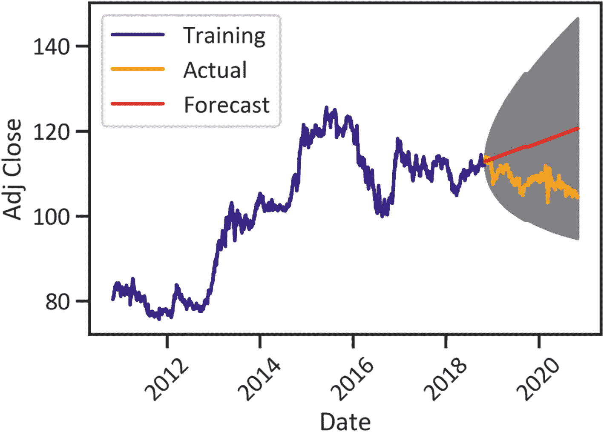

**图 2-8** ARIMA(1, 1, 1) 预测

```
fc, se, conf = arima_fitted.forecast(501, alpha=0.05)
fc_series = pd.Series(fc, index=test.index)
lower_series = pd.Series(conf[:, 0], index=test.index)
upper_series = pd.Series(conf[:, 1], index=test.index)
plt.plot(train, label="Training",color="navy")
plt.plot(test, label="Actual",color="orange")
plt.plot(fc_series, label="Forecast",color="red")
plt.fill_between(lower_series.index,
lower_series,
upper_series,
color='gray')
plt.legend(loc='upper left')
plt.xticks(rotation=45)
plt.xlabel("Date")
plt.ylabel("Adj Close")
plt.show()
```

清单 2-14 预测 ARIMA 模型

图 2-8 显示模型在预测时会出现误差。灰色区域（填充部分）代表置信区间。

## SARIMA 模型

虽然 ARIMA 模型是分析单变量时间序列数据模式的强大模型，但在处理季节性数据时会出现误差。为模型添加季节性阶数可以提高其性能。SARIMA 扩展了 ARIMA 模型，它在对时间序列数据建模时考虑了季节性成分。

### SARIMA 超参数优化

清单 2-15 使用 `itertools` 包，通过 AIC 寻找最佳超参数（参考清单 2-12）。Python 环境中预装了 `SciPy` 包。

```python
import scipy.stats as stats
p = d = q = range(0,2)
pdq = list(itertools.product(p,d,q))
seasonal_pdq = [(x[0],x[1],x[2],12) for x in list(itertools.product(p,d,q))]
for param in pdq:
    for param_seasonal in seasonal_pdq:
        try:
            model = sm.tsa.statespace.SARIMAX(train,
                                              order=param,
                                              seasonal_order=param_seasonal,
                                              enforce_stationarity=False,
                                              enforce_intervibility=False)
            results = model.fit()
            print("SARIMAX {} x {} 12 - AIC: {}".format(param,param_seasonal,results.aic))
        except:
            continue
```

```
SARIMAX (1, 1, 1) x (0, 1, 1, 12) 12 - AIC: 3822.8419684760634
SARIMAX (1, 1, 1) x (1, 0, 0, 12) 12 - AIC: 3795.147211266854
SARIMAX (1, 1, 1) x (1, 0, 1, 12) 12 - AIC: 3795.0731989219726
SARIMAX (1, 1, 1) x (1, 1, 0, 12) 12 - AIC: 4580.905706671067
SARIMAX (1, 1, 1) x (1, 1, 1, 12) 12 - AIC: 3824.843959188799
```

清单 2-15 SARIMA 超参数优化

请注意，我们只展示了最后五个输出。前面的代码从 `SARIMAX(0, 0, 0) × (0, 0, 0, 12) 12` 到 `SARIMAX(1, 1, 1) × (1, 1, 1, 12) 12` 评估了 AIC。我们发现 `SARIMAX(1, 1, 1) × (1, 1, 1, 12) 12` 的 AIC 评分最低。清单 2-16 使用 `order = (1,1,1)` 完成了 SARIMA 模型。

### 开发 SARIMA 模型

清单 2-16 在不强制要求平稳性和可逆性的情况下完成了 SARIMA 模型，并构建了一个包含模型性能信息的表格（见表 2-4）。

**表 2-4** SARIMA 概况

| 因变量: | `Y` | 观测数量: | 2085 |
| --- | --- | --- | --- |
| **模型:** | `SARIMAX(1, 1, 1)` | **对数似然** | -1901.217 |
| **日期:** | 2020 年 11 月 14 日 周六 | **AIC** | 3808.435 |
| **时间:** | 02:01:47 | **BIC** | 3825.361 |
| **样本:** | 0 | **HQIC** | 3814.637 |
| | - 2085 | | |
| **协方差类型:** | `Opg` | | |
| | **系数** | **标准误** | **z** | **P>&#124;z&#124;** | **[0.025** | **0.975]** |
| --- | --- | --- | --- | --- | --- | --- |
| **ar.L1** | -0.8645 | 0.083 | -10.411 | 0.000 | -1.027 | -0.702 |
| **ma.L1** | 0.8344 | 0.090 | 9.258 | 0.000 | 0.658 | 1.011 |
| **sigma2** | 0.3630 | 0.007 | 52.339 | 0.000 | 0.349 | 0.377 |
| **Ljung-Box (Q):** | 58.77 | **Jarque-Bera (JB):** | 955.16 |
| --- | --- | --- | --- |
| **Prob(Q):** | 0.03 | **Prob(JB):** | 0.00 |
| **异方差性 (H):** | 1.35 | **偏度:** | 0.04 |
| **Prob(H) (双边):** | 0.00 | **峰度:** | 6.32 |

```python
import pmdarima as pm
sarimax_model = pm.auto_arima(train, start_p=1, start_q=1, start_P=1, start_Q=1,
                              max_p=5, max_q=5, max_P=5, max_Q=5, seasonal=True,
                              stepwise=True, suppress_warnings=True, D=10, max_D=10,
                              error_action='ignore')
sarimax_model.summary()
```

清单 2-16 完成 SARIMA 模型

表 2-4 显示 `ar.L1`、`ma.L1` 和 `sigma` 的 p 值大于 0.05。我们可以确认该序列是平稳的。

### 使用 SARIMA 模型进行预测

清单 2-17 绘制了一个图表，展示了过去美元/日元货币对的调整后收盘价以及 `SARIMA(1, 1, 12)` 模型的预测值（见图 2-9）。

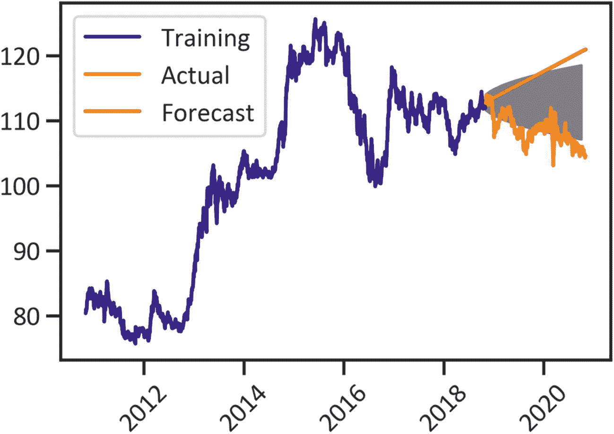

**图 2-9** `SARIMA(1, 1, 1, 12)` 预测

```
n_periods = 24
fitted, confint = sarimax_model.predict(n_periods=n_periods, return_conf_int=True)
index_of_fc = pd.date_range(train.index[-1], periods = n_periods, freq='MS')
fitted_series = pd.Series(fitted, index=index_of_fc)
lower_series = pd.Series(confint[:, 0], index=index_of_fc)
upper_series = pd.Series(confint[:, 1], index=index_of_fc)
plt.plot(train, label="Training",color="navy")
plt.plot(test, label="Actual",color="orange")
plt.plot(fitted_series, label="Forecast",color="red")
plt.fill_between(lower_series.index,
lower_series,
upper_series,
color='gray')
plt.legend(loc='upper left')
plt.xticks(rotation=45)
plt.xlabel("Date")
plt.ylabel("Adj Close")
plt.show()
```

清单 2-17 SARIMA 模型预测

图 2-9 显示了一个范围较窄的预测。两个模型都不能最好地解释时间序列数据；它们在预测未来价格时都会产生边际误差。在下一节中，我们将通过使用 Prophet 包中提供的加法模型来克服这个问题。

## 加法模型

除了趋势和季节性，还有其他因素会影响价格变化。例如，在公共假日期间，交易活动与正常交易日不同。ARIMA 和 SARIMA 模型都没有考虑公共假日的影响。加法模型解决了这一挑战。它考虑了日、周、年季节性以及非线性趋势。该模型假设趋势和周期为一个项，并无缝地加入了官方公共假日的影响和一个误差项。该公式用数学方式表示为方程 2-1。

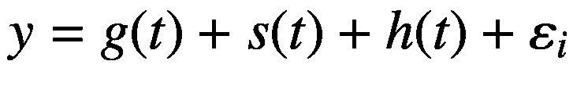

（方程 2-1）

这里，`g(t)` 表示用于模拟非周期性变化的线性或逻辑增长曲线，`s(t)` 表示周期性变化（日、周、年季节性），`h(t)` 表示节假日的影响，`+ 𝜀𝑖` 表示考虑异常变化的误差项。

清单 2-18 对数据进行了重新利用（见表 2-5）。请注意，在清单 2-2 中，我们删除了低价、高价、开盘价和收盘价这些列。我们关注的是对调整收盘价的预测。

表 2-5 数据集

| **日期** | 调整收盘价 | ds | y |
| --- | --- | --- | --- |
| **2010-11-01** | 80.405998 | 2010-11-01 | 80.405998 |
| **2010-11-02** | 80.558998 | 2010-11-02 | 80.558998 |
| **2010-11-03** | 80.667999 | 2010-11-03 | 80.667999 |
| **2010-11-04** | 81.050003 | 2010-11-04 | 81.050003 |
| **2010-11-05** | 80.776001 | 2010-11-05 | 80.776001 |
| **...** | ... | ... | ... |
| **2020-10-27** | 104.832001 | 2020-10-27 | 104.832001 |
| **2020-10-28** | 104.544998 | 2020-10-28 | 104.544998 |
| **2020-10-29** | 104.315002 | 2020-10-29 | 104.315002 |
| **2020-10-30** | 104.554001 | 2020-10-30 | 104.554001 |
| **2020-11-02** | 104.580002 | 2020-11-02 | 104.580002 |

```
df = df.reset_index()
df["ds"] = df["Date"]
df["y"] = df["Adj Close"]
df.set_index("Date")
```

清单 2-18 数据预处理

清单 2-19 指定了其影响将被添加到模型中的官方公共假日（见清单 2-20）。

```
holidays = pd.DataFrame({
'holiday': 'playoff',
'ds': pd.to_datetime(["2020-12-25", "2020-12-24", "2020-12-23", "2019-12-25", "2021-01-01", "2021-01-20"]),
"lower_window": 0,
"upper_window": 1,
})
```

清单 2-19 指定节假日

清单 2-20 完成了置信区间为 95%的加法模型；该模型考虑了年季节性、周季节性、日季节性以及官方公共假日。

```
from fbprophet import Prophet
m = Prophet(holidays=holidays,
interval_width=0.95,
yearly_seasonality=True,
weekly_seasonality=True,
daily_seasonality=True,
changepoint_prior_scale=0.095)
m.add_country_holidays(country_name='US')
m.fit(df)
```

清单 2-20 开发 Prophet 模型

### 预测

清单 2-21 预测了未来的调整收盘价，并展示了时间序列数据中以及加法模型预测的价格中的模式（见图 2-10）。

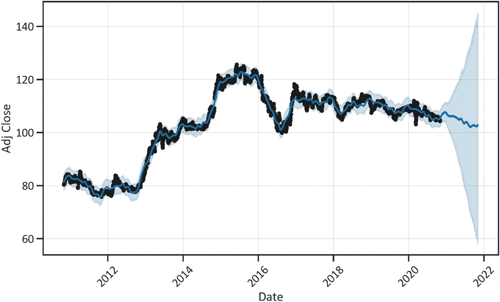

图 2-10 预测

```
future = m.make_future_dataframe(periods=365)
forecast = m.predict(future)
m.plot(forecast)
plt.xlabel("日期")
plt.ylabel("调整收盘价")
plt.xticks(rotation=45)
plt.show()
```

清单 2-21 预测

图 2-10 与 ARIMA 模型和 SARIMA 模型（这两个模型都预测了上升趋势）的结果不一致。然而，加法模型实际上与数据是吻合的。

### 季节性分解

清单 2-22 应用了 `plot_decompose()` 方法将时间序列分解为季节性、趋势和不规则成分（见图 2-11）。分解涉及将时间序列拆分为各个组成部分，以理解序列中的重复模式。它有助于确定单变量时间序列分析的参数；我们可以识别序列中是否存在趋势和季节性。

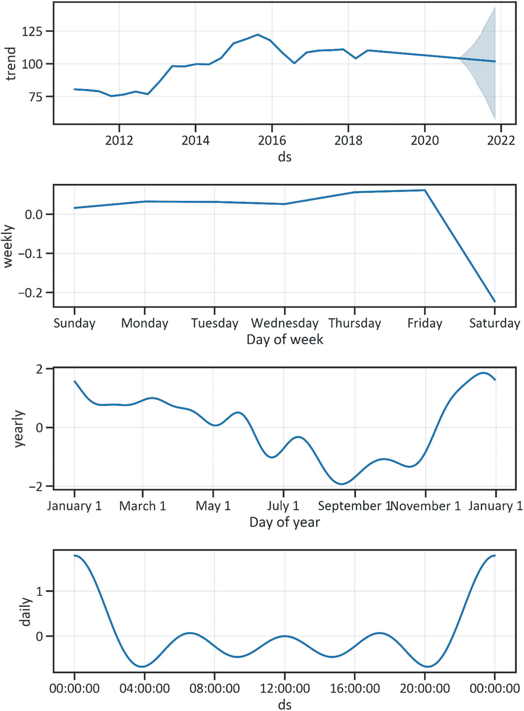

图 2-11 季节性成分

```
m.plot_components(forecast)
plt.show()
```

清单 2-22 季节性成分

图 2-11 显示了清晰的日、周和年季节性。在年初的几个月里，调整收盘价下降，并在年度的最后两个季度达到峰值。

## 结论

本章详细介绍了时间序列分析方法。我们开发并公正地比较了 ARIMA 和 SARIMA 模型的性能。此外，我们还研究了来自 Prophet 包的加法模型。在仔细审查了所有三个模型的性能后，我们注意到加法模型误差较小，并且对美元/日元货币对的未来价格有更强的预测能力。为了提高模型的性能，我们可以使用诸如改变数据划分比例、去除异常值、数据转换以及包含节假日影响等技术。