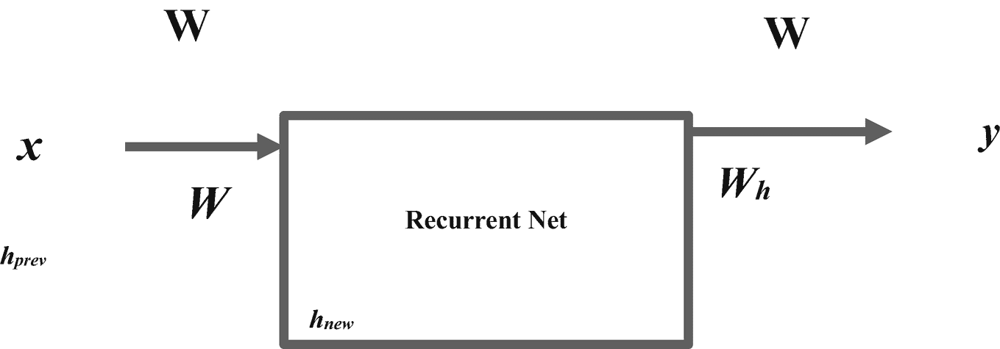
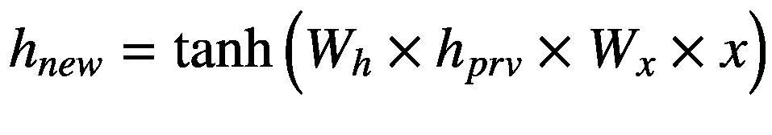
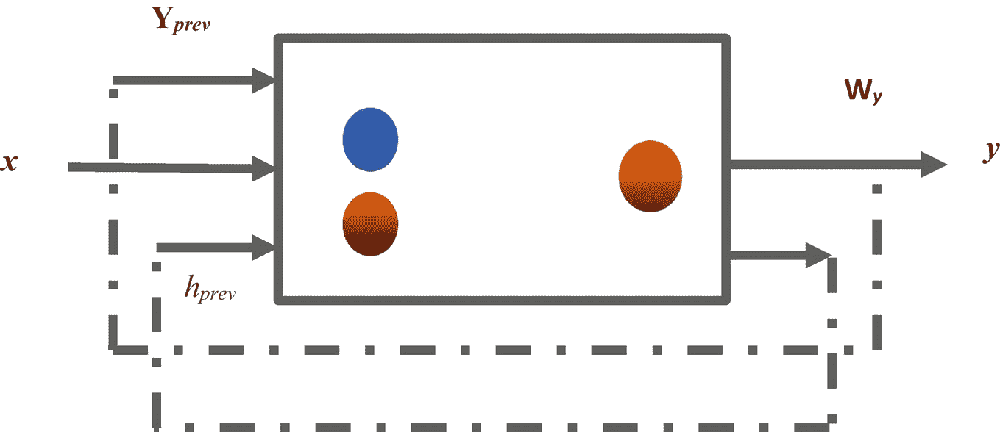
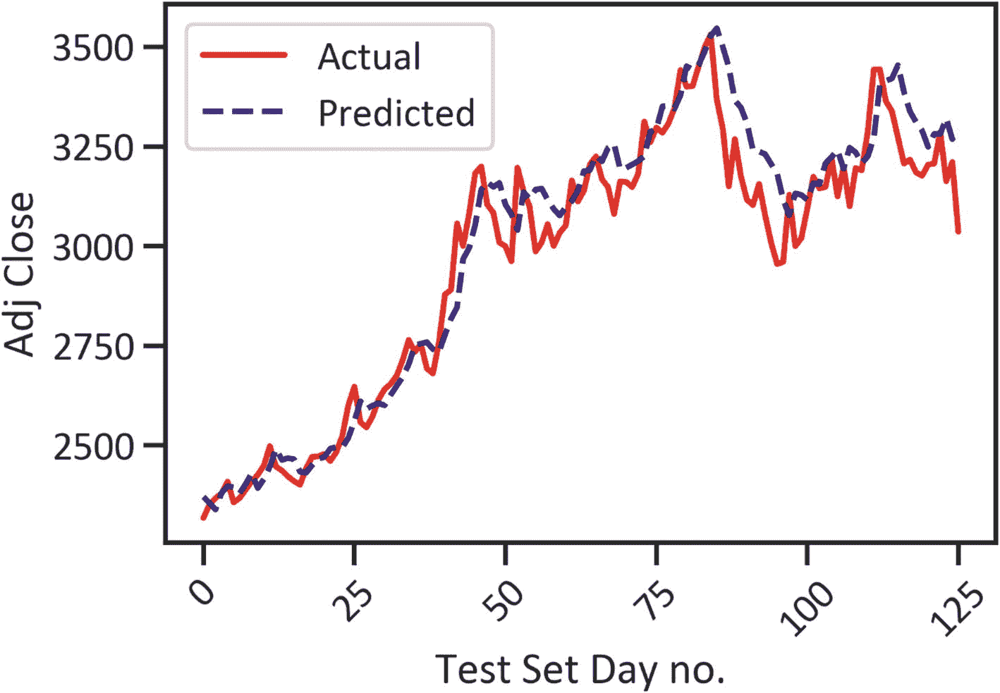
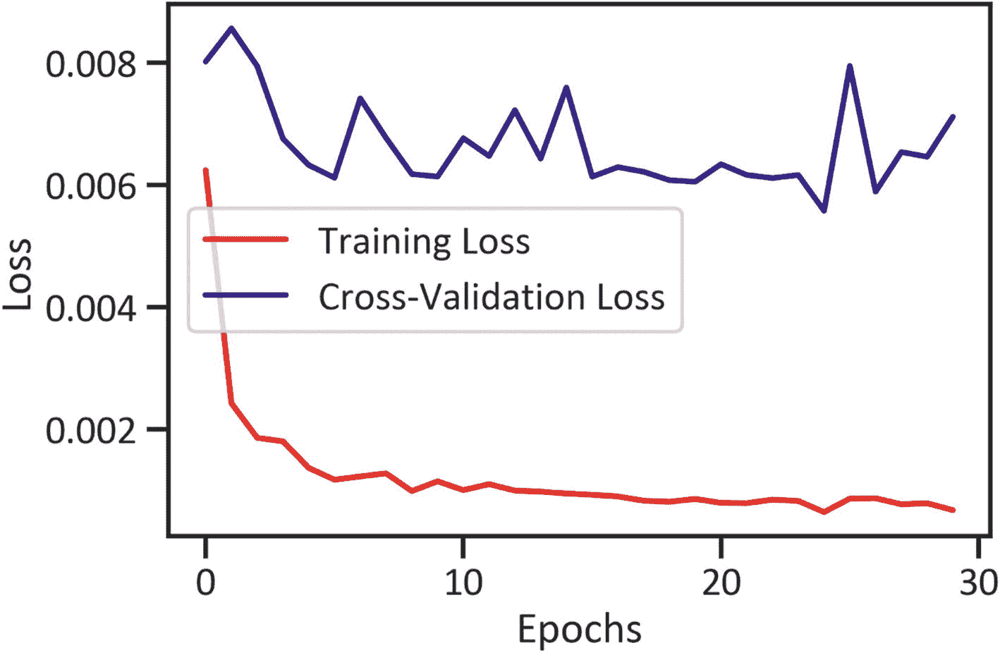

# 使用循环神经网络进行单变量时间序列分析

本章涵盖了深度学习的基础知识。首先，介绍了激活函数、损失函数和人工神经网络优化器。其次，讨论了序列数据问题以及循环神经网络（RNN）如何解决该问题。第三，本章介绍了设计、开发和测试最流行的 RNN——长短期记忆（LSTM）模型的方法。我们使用 Keras 框架进行快速原型设计和构建神经网络。要在 conda 环境中安装`keras`，请使用`conda install -c conda-forge keras`。确保您也安装了`tensorflow`。要在 conda 环境中安装`tensorflow`，请使用`conda install -c conda-forge tensorflow`。

## 什么是深度学习？

*深度学习*是机器学习的一个子集，它操作神经网络。神经网络是由相互连接的节点组构成的网络，这些节点组逐层接收、转换和传输输入值，直到它们到达输出层。激活函数通过在每个隐藏层中操作一组变量来启用此过程。

## 激活函数

激活函数向人工神经网络添加非线性，并启用反向传播（一次逆向的完整传递）。主要有三种激活函数。

*Sigmoid 激活函数*：将 S 形曲线拟合到数据，并触发介于 0 和 1 之间的输出值。

*双曲正切（tanh）激活函数*：将 tanh 曲线拟合到数据，并触发介于-1 和 1 之间的输出。

*修正线性单元（ReLu）激活函数*：获取不受特定范围约束的值，并解决梯度消失问题（一种情况，当我们在模型中添加更多训练数据时梯度增大，导致训练缓慢）。

## 损失函数

损失函数评估实际值与人工神经网络预测值之间的差异。主要的损失函数包括均方误差（MSE）、平均绝对误差和均方对数误差。在本章中，我们使用 MSE（在考虑回归关系后，模型关于数据所解释的变异性）。

## 优化人工神经网络

有几种模型优化的方法。最常见的优化器是自适应矩估计（Adam），它在训练期间能更好地最小化代价函数。


### 序列数据问题

序列数据包含具有某种依赖关系的有序数据点。时间序列是序列数据的一个绝佳示例。在时间序列数据中，每个数据点代表某个特定时间点的观测值。像前馈网络这样的传统神经网络在建模序列数据时会遇到挑战，因为它们无法记住之前的输出值。这意味着前馈网络仅仅产生输出值，而不会考虑数据中的任何依赖关系（循环网络解决了这个问题）。

### RNN 模型

循环神经网络模型适用于序列建模。我们称其为*循环*，是因为该模型对序列中的每个数据点执行重复任务，其中输出值依赖于先前的值。循环网络在时间步`[t-1]`的决策结果会影响上一个时间步`[t]`的决策结果。它维护一个状态来引用给定点的历史分析。该状态管理先前估计中存储的信息，并使用独特的输入值递归回网络。图`[3-1]`展示了一个具有单隐藏层的循环网络。



图 3-1

RNN 模型

该公式如公式`[3-1]`所示。



(公式 3-1)

此处，`W[x]`表示输入与隐藏单元之间的权重矩阵，`W[y]`表示……，`W[h]`表示乘以先前状态后的权重，`x`表示隐藏层接收的输入数据，`h[prv]`表示隐藏层接收的先前状态，`h[new]`表示隐藏层估计的新状态。我们将 RNN 模型应用于语音识别、图像描述和情感分析。尽管该模型解决了大多数模型难以处理的问题，但它自身也存在缺陷。

### 循环神经网络问题

完整的 RNN 模型必须合理地维护一个单元状态。在处理大规模数据时，该网络的计算成本会变得很高；它对参数的变化也很敏感。此外，它容易受到梯度消失问题和梯度爆炸问题的影响。这个问题在传统模型中普遍存在：在训练过程的初始阶段，模型具有较小的梯度，但随着我们增加训练数据，梯度会增大，从而导致训练过程变慢（这种现象被称为梯度消失问题）。LSTM 模型解决了梯度消失问题。

### LSTM 模型

LSTM 模型能够对长序列数据进行建模。它在多个时间戳上保持强梯度。LSTM 有两个关键部分，即保持信息不变地流动的单元状态，以及控制伴随流动的信息的门。见图`[3-2]`。



图 3-2

LSTM

## 门

LSTM 模型包含三个门，即输入门、遗忘门和输出门。输入门决定要写入记忆单元的新信息。输入门包含两层。我们将第一层识别为 sigmoid 层。它决定需要更新的值。第二层被认为是`tanh`层；它生成一个包含新候选值的向量，以添加到状态中。遗忘门决定模型必须遗忘和删除哪些已不再有用的历史信息。最后，输出门控制对记忆单元的读取权限。这是通过使用压缩函数的估计值来实现的，该函数表示为`(0,1)`，其中`0`表示拒绝读取权限，`1`表示授予读取权限。前面的门是 LSTM 的操作，它们对网络输入的线性组合、先前的隐藏状态以及先前的输出执行一个函数。LSTM 模型使用门来确定应该记住或遗忘哪些数据。

## 展开的 LSTM 网络

在第一个时间戳，输入门接收并将第一个数据点传递给网络。之后，LSTM 使用随机初始化的隐藏状态产生一个新的隐藏状态，并将其输出值传输到下一个时间戳。这个过程持续到最后一个时间戳。该单元包含跨时间的先前隐藏状态和时间戳输出。

## 堆叠的 LSTM 网络

我们将具有多个隐藏层的 LSTM 网络识别为堆叠的 LSTM 网络。在堆叠的 LSTM 网络中，它将前一个隐藏层的输出作为后一个层的输入。这个过程持续到最后一层。这允许更大的模型复杂度。例如，与前面的层相比，后面的层是输出的更复杂的未来表示。因此，堆叠 LSTM 网络可能会导致最优的模型性能。在训练中，LSTM 执行以下操作：

*   决定将哪些数据作为输入添加，包括权重
*   基于当前和先前的内部状态估计新状态
*   学习相应的权重和偏置
*   决定状态如何作为输出传输


### 使用 Keras 开发 LSTM 模型

清单 3-1 应用 `get_data_yahoo()` 方法提取亚马逊股票价格^(⁵)（见表 3-1）。

表 3-1

数据集

| **日期** | 最高价 | 最低价 | 开盘价 | 收盘价 | 成交量 | 调整收盘价 |
| --- | --- | --- | --- | --- | --- | --- |
| **2010-11-01** | 164.580002 | 161.520004 | 164.449997 | 162.580002 | 5239900 | 162.580002 |
| **2010-11-02** | 165.940002 | 163.360001 | 163.750000 | 164.610001 | 4260000 | 164.610001 |
| **2010-11-03** | 168.610001 | 162.289993 | 165.399994 | 168.470001 | 6112100 | 168.470001 |
| **2010-11-04** | 172.529999 | 168.399994 | 169.860001 | 168.929993 | 7395900 | 168.929993 |
| **2010-11-05** | 171.649994 | 168.589996 | 169.350006 | 170.770004 | 5212200 | 170.770004 |

```
from pandas_datareader import data
start_date = '2010-11-01'
end_date = '2020-11-01'
ticker = 'AMZN'
df = data.get_data_yahoo(ticker, start_date, end_date)
df.head()
清单 3-1
抓取的数据
```

我们关注的是调整收盘价的研究。清单 3-2 创建了一个仅包含调整收盘价的新数据框。

```
df_close = pd.DataFrame(df["Adj Close"])
清单 3-2
创建新数据框
```

清单 3-3 返回调整收盘价的描述性统计信息（见表 3-2）。

表 3-2

描述性统计

|     | 调整收盘价 |
| --- | --- |
| **计数** | 2518.000000 |
| **均值** | 881.182176 |
| **标准差** | 774.472276 |
| **最小值** | 157.779999 |
| **25%分位数** | 269.540001 |
| **50%分位数** | 551.135010 |
| **75%分位数** | 1544.927551 |
| **最大值** | 3531.449951 |

```
df_close.describe()
清单 3-3
描述性统计
```

表 3-2 突出显示了调整收盘价的均值为 881.18，标准差为 744.447。清单 3-4 定义了一个函数参数来创建属性并查找实例列表，这些实例代表无延迟的时间。首先，我们定义起始日期和结束日期。然后，我们将 datetime 设置为索引并创建数据框的副本，以便我们可以根据指定的起始日期和结束日期创建先前实例的列表。最后，我们使用频繁属性和先前实例创建新列，并合并这些列。

```
def create_regressor_attributes(df, attribute, list_of_prev_t_instants):
    list_of_prev_t_instants.sort()
    start = list_of_prev_t_instants[-1]
    end = len(df)
    df['datetime'] = df.index
    df.reset_index(drop=True)
    df_copy = df[start:end]
    df_copy.reset_index(inplace=True, drop=True)
    for attribute in attribute :
        foobar = pd.DataFrame()
        for prev_t in list_of_prev_t_instants :
            new_col = pd.DataFrame(df[attribute].iloc[(start - prev_t) : (end - prev_t)])
            new_col.reset_index(drop=True, inplace=True)
            new_col.rename(columns={attribute : '{}_(t-{})'.format(attribute, prev_t)}, inplace=True)
            foobar = pd.concat([foobar, new_col], sort=False, axis=1)
        df_copy = pd.concat([df_copy, foobar], sort=False, axis=1)
    df_copy.set_index(['datetime'], drop=True, inplace=True)
    return df_copy
清单 3-4
创建回归变量属性函数
```

清单 3-5 编译了一个先前时间实例的列表。

```
list_of_attributes = ['Adj Close']
list_of_prev_t_instants = []
for i in range(1,16):
    list_of_prev_t_instants.append(i)
list_of_prev_t_instants
[1, 2, 3, 4, 5, 6, 7, 8, 9, 10, 11, 12, 13, 14, 15]
清单 3-5
列出所有属性
```

输出显示了一个包含 15 个实例的列表。清单 3-6 将属性列表和先前的 `t` 实例列表传入 Pandas 数据框。然后，将它们与调整收盘价合并。

```
df_new = create_regressor_attributes(df_close, list_of_attributes, list_of_prev_t_instants)
清单 3-6
创建新数据框
```

清单 3-7 导入关键依赖项。

```
from tensorflow.keras.layers import Input, Dense, Dropout
from tensorflow.keras.optimizers import SGD
from tensorflow.keras.models import Model
from tensorflow.keras.models import load_model
from tensorflow.keras.callbacks import ModelCheckpointfunction
清单 3-7
导入重要库
```

清单 3-8 创建了神经网络的架构。我们使用线性激活函数在两个密集层和一个输出层中训练包含 15 个变量的模型。

```
input_layer = Input(shape=(15), dtype='float32')
dense1 = Dense(60, activation='linear')(input_layer)
dense2 = Dense(60, activation='linear')(dense1)
dropout_layer = Dropout(0.2)(dense2)
output_layer = Dense(1, activation='linear')(dropout_layer)
清单 3-8
设计架构
```

清单 3-9 训练并总结模型。为了确定模型在训练过程中做出正确预测的程度，我们使用了均方误差，它表示在考虑线性关系后模型中解释的变异性。为了提高模型的性能，我们使用了 Adam 优化器，这是一种考虑保持梯度移动的力并降低模型学习数据速率的优化器。

```
model = Model(inputs=input_layer, outputs=output_layer)
model.compile(loss='mean_squared_error', optimizer='adam')
model.summary()
Model: "model"
_______________________________________________________________
Layer (type)                 Output Shape              Param #
===============================================================
input_1 (InputLayer)         [(None, 15)]              0
_______________________________________________________________
dense (Dense)                (None, 60)                960
_______________________________________________________________
dense_1 (Dense)              (None, 60)                3660
_______________________________________________________________
dropout (Dropout)            (None, 60)                0
_______________________________________________________________
dense_2 (Dense)              (None, 1)                 61
===============================================================
Total params: 4,681
Trainable params: 4,681
Non-trainable params: 0
_______________________________________________________________
清单 3-9
网络结构
```

该神经网络包含两个隐藏层和一个 dropout 层（应用将层每个输入设置为 0 的概率）。清单 3-10 将数据拆分为训练数据、测试数据和验证数据。

```
test_set_size = 0.05
valid_set_size= 0.05
df_copy = df_new.reset_index(drop=True)
df_test = df_copy.iloc[ int(np.floor(len(df_copy)*(1-test_set_size))) : ]
df_train_plus_valid = df_copy.iloc[ : int(np.floor(len(df_copy)*(1-test_set_size))) ]
df_train = df_train_plus_valid.iloc[ : int(np.floor(len(df_train_plus_valid)*(1-valid_set_size))) ]
df_valid = df_train_plus_valid.iloc[ int(np.floor(len(df_train_plus_valid)*(1-valid_set_size))) : ]
X_train, y_train = df_train.iloc[:, 1:], df_train.iloc[:, 0]
X_valid, y_valid = df_valid.iloc[:, 1:], df_valid.iloc[:, 0]
X_test, y_test = df_test.iloc[:, 1:], df_test.iloc[:, 0]
print('Shape of training inputs, training target:', X_train.shape, y_train.shape)
print('Shape of validation inputs, validation target:', X_valid.shape, y_valid.shape)
print('Shape of test inputs, test target:', X_test.shape, y_test.shape)
清单 3-10
将数据拆分为训练数据、测试数据和验证数据
```

此处，我们得到以下信息：

*   训练输入形状，训练目标形状：(2258, 15) (2258,)
*   验证输入形状，验证目标形状：(119, 15) (119,)
*   测试输入形状，测试目标形状：(126, 15) (126,)

清单 3-11 应用 `MinMaxScaler()` 方法将数值缩放到 0 和 1 之间。


### LSTM 模型开发

```
from sklearn.preprocessing import MinMaxScaler
Target_scaler = MinMaxScaler(feature_range=(0.01, 0.99))
Feature_scaler = MinMaxScaler(feature_range=(0.01, 0.99))
X_train_scaled = Feature_scaler.fit_transform(np.array(X_train))
X_valid_scaled = Feature_scaler.fit_transform(np.array(X_valid))
X_test_scaled = Feature_scaler.fit_transform(np.array(X_test))
y_train_scaled = Target_scaler.fit_transform(np.array(y_train).reshape(-1,1))
y_valid_scaled = Target_scaler.fit_transform(np.array(y_valid).reshape(-1,1))
y_test_scaled = Target_scaler.fit_transform(np.array(y_test).reshape(-1,1))
```

代码清单 3-11：数据归一化

代码清单 3-12 在 5 个批次（每次训练的样本集）中，对 LSTM 模型进行 30 个轮次（完整的前向和反向传播）的训练。一次传递代表一个完整的训练迭代，从接收一组输入值开始，到通过网络中不同的权重和偏置进行激活，直至产生一个输出值。

```
history = model.fit(x=X_train_scaled, y=y_train_scaled, batch_size=5, epochs=30, verbose=1, validation_data=(X_valid_scaled, y_valid_scaled), shuffle=True)
```

代码清单 3-12：训练循环网络

## 使用 LSTM 进行预测

代码清单 3-13 应用了 `predict()` 方法来预测序列的未来实例，并执行逆变换（生成指数型随机变量）。参见表 3-3。

**表 3-3：预测结果**

|   | 预测值 |
| --- | --- |
| 0 | 2370.852783 |
| 1 | 2355.488281 |
| 2 | 2338.975586 |
| 3 | 2380.348633 |
| 4 | 2397.861084 |

```
y_pred = model.predict(X_test_scaled)
y_test_rescaled =  Target_scaler.inverse_transform(y_test_scaled)
y_pred_rescaled = Target_scaler.inverse_transform(y_pred)
y_actual = pd.DataFrame(y_test_rescaled, columns=['Actual Close Price'])
y_hat = pd.DataFrame(y_pred_rescaled, columns=['Predicted Close Price'])
pd.DataFrame(y_pred_rescaled, columns = ["Forecast"]).head()
```

代码清单 3-13：LSTM 预测结果

代码清单 3-14 展示了调整后收盘价的实际值以及 LSTM 模型预测的值（参见图 3-3）。



**图 3-3：预测结果**

```
plt.plot(y_actual,color='red')
plt.plot(y_hat, linestyle='dashed', color='navy')
plt.legend(['Actual','Predicted'], loc='best')
plt.ylabel('Adj Close')
plt.xlabel('Test Set Day no.')
plt.xticks(rotation=45)
plt.yticks()
plt.show()
```

代码清单 3-14：预测结果

图 3-3 显示，调整后收盘价的实际值与 LSTM 模型预测的值之间存在差异。不过，这种差异并不显著，不足以影响结论。

### 模型评估

表 3-4 重点介绍了我们用于评估分类器的关键指标。

**表 3-4：关键评估指标**

| 指标 | 描述 |
| --- | --- |
| 平均绝对误差 (MAE) | 不考虑方向的估计值平均误差程度 |
| 均方误差 (MSE) | 考虑回归关系后，模型解释的数据变异性 |
| 均方根误差 (RMSE) | 不考虑回归关系时解释的变异性 |
| R 方 (R-squared) | 模型解释的数据变异性 |

代码清单 3-15 返回一个包含关键回归评估指标的表（参见表 3-5）。

**表 3-5：模型性能**

|   | 数值 |
| --- | --- |
| MAE | 60.672022 |
| MSE | 6199.559394 |
| RMSE | 78.737281 |
| R2 | 0.944119 |
| 解释方差分数 | 0.944151 |
| 平均伽马偏差 | 0.000657 |
| 平均泊松偏差 | 2.010341 |

```
from sklearn import metrics
MAE = metrics.mean_absolute_error(y_test_rescaled,y_pred_rescaled)
MSE = metrics.mean_squared_error(y_test_rescaled,y_pred_rescaled)
RMSE = np.sqrt(MSE)
R2 = metrics.r2_score(y_test_rescaled,y_pred_rescaled)
EV = metrics.explained_variance_score(y_test_rescaled,y_pred_rescaled)
MGD = metrics.mean_gamma_deviance(y_test_rescaled,y_pred_rescaled)
MPD = metrics.mean_poisson_deviance(y_test_rescaled,y_pred_rescaled)
lmmodelevaluation = [[MAE,MSE,RMSE,R2,EV,MGD,MPD]]
lmmodelevaluationdata = pd.DataFrame(lmmodelevaluation,
index = ["Values"],
columns = ["MAE",
"MSE",
"RMSE",
"R2",
"Explained variance score",
"Mean gamma deviance",
"Mean Poisson deviance"]).transpose()
lmmodelevaluationdata
```

代码清单 3-15：构建模型评估矩阵

表 3-5 突出显示，LSTM 模型解释了数据 94.44% 的变异性。不考虑关系方向时，平均误差幅度为 60.67。另一种评估 LSTM 模型性能的方法是评估不同轮次中损失的变化。损失衡量的是实际值与模型预测值之间的差异。图 3-4 展示了 LSTM 模型如何学习区分实际值和预测值。参见代码清单 3-16。



**图 3-4：各轮次的训练损失和验证损失**

```
plt.plot(history.history["loss"],color="red",label="Training Loss")
plt.plot(history.history["val_loss"],color="navy",label="Cross-Validation Loss")
plt.xlabel("Epochs")
plt.ylabel("Loss")
plt.legend(loc="best")
plt.show()
```

代码清单 3-16：各轮次的训练损失和验证损失

图 3-4 显示，在第一个轮次中，训练损失急剧下降。交叉验证损失随时间推移保持稳定，且在不同轮次中始终高于训练损失。LSTM 模型展现出良好模型的特性。

## 结论

本章介绍了深度学习。它涵盖了我们用于时间序列数据的人工神经网络模型，即 LSTM 模型。本章还展示了如何创建建模变量，并说明了神经网络的结构。随后，介绍了建模和测试网络的技术。

在审查网络后，我们发现该模型能最佳地解释数据的变异性。我们可以使用该模型预测调整后收盘价的未来实例。通过减少层数、引入惩罚项等方法，我们可以进一步提升网络性能。下一章将介绍如何使用隐马尔可夫模型识别序列数据中的隐藏模式。

