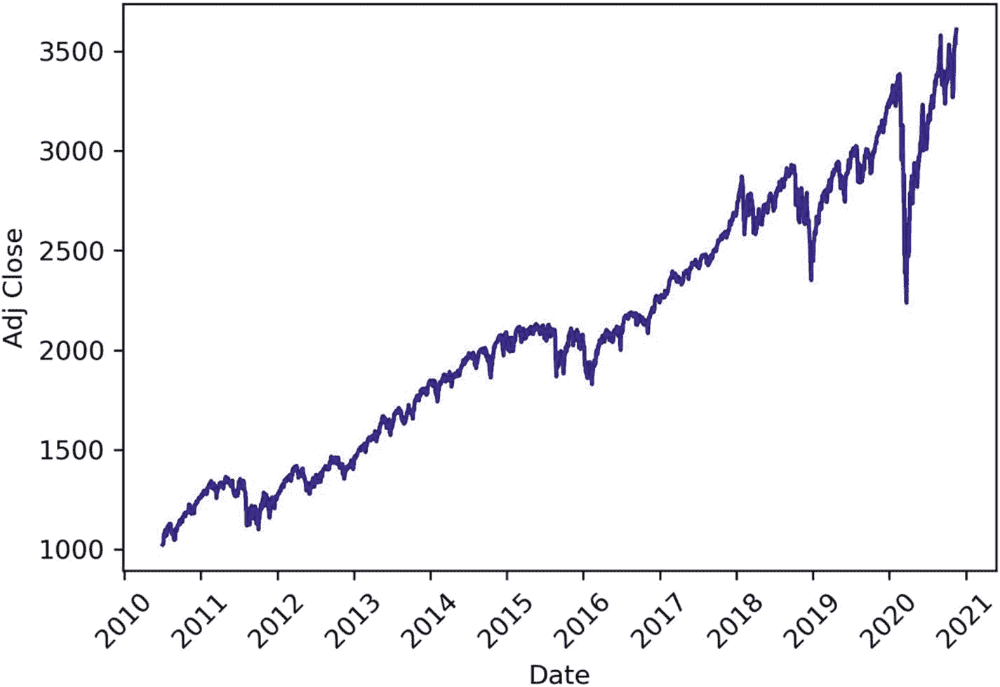
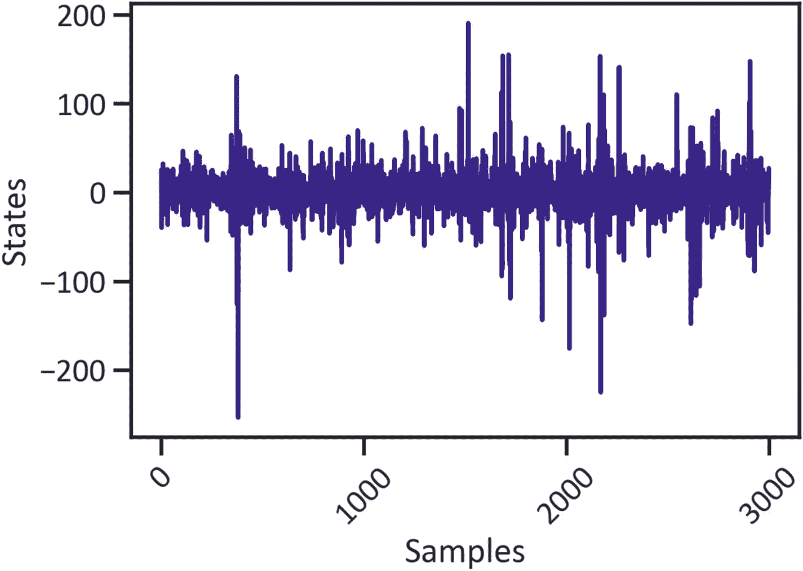
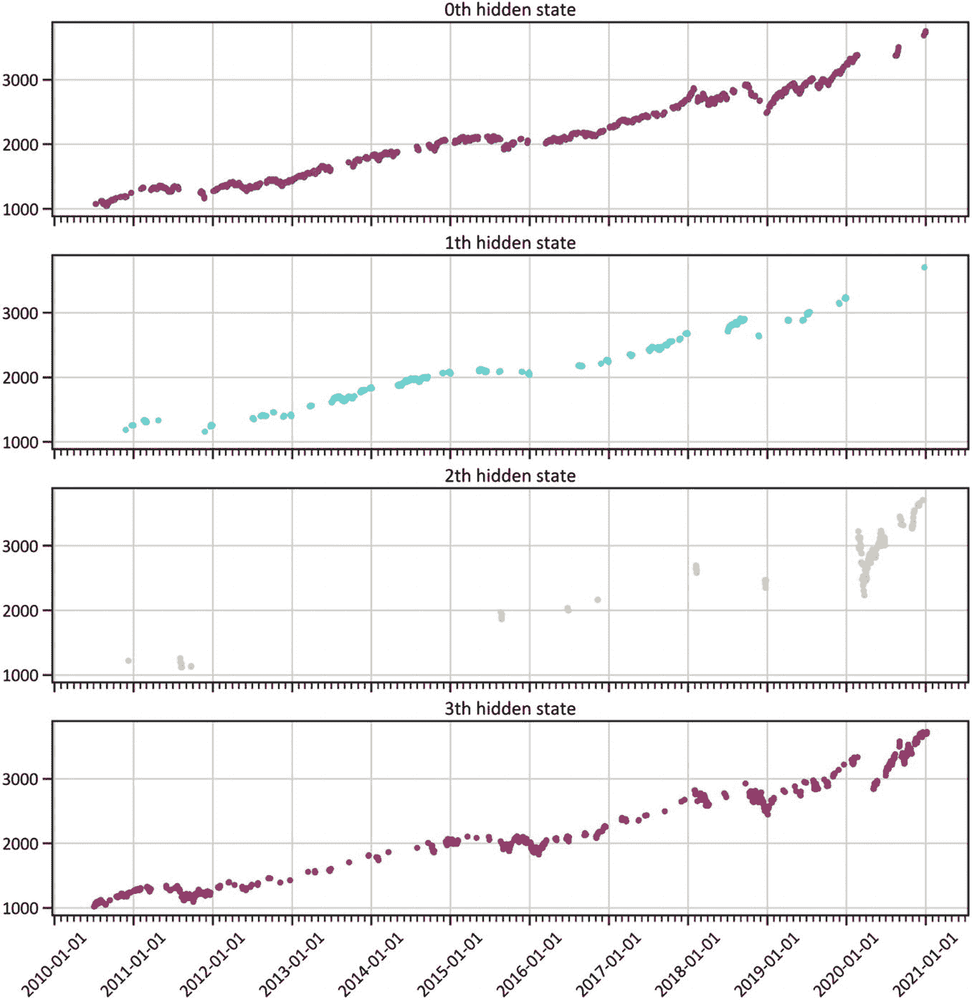
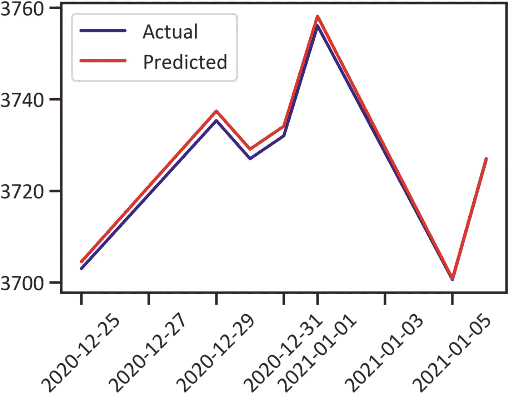
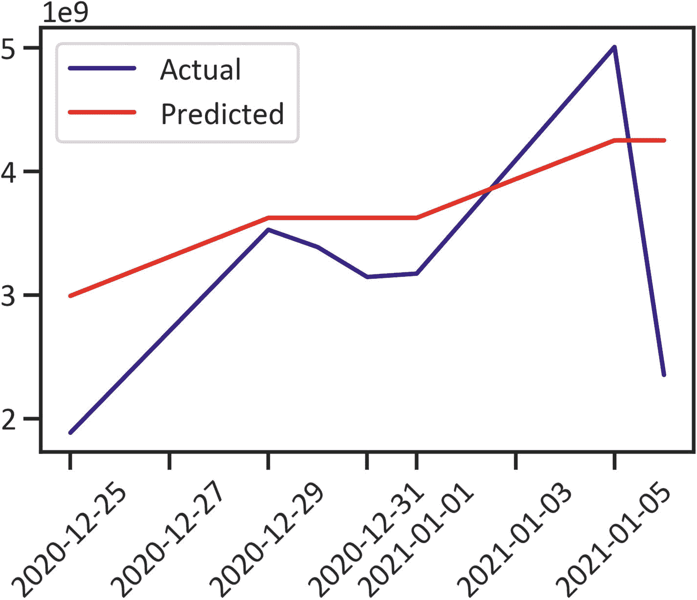

# 4. 发现市场状态

本章介绍一种广泛使用的生成式概率模型，称为*隐马尔可夫模型* (HMM)。它涵盖了使用 HMM 识别时间序列数据中隐藏模式并生成观测序列的有效技术。阅读本章后，您将能够设计并开发一个带有高斯过程的隐马尔可夫模型，以发现市场状态。要在 Python 环境中安装 `hmmlearn`，请使用 `pip install hmmlearn`；在 conda 环境中，请使用 `conda install -c conda-forge hmmlearn`。


## HMM

在前一章中，我们使用增广迪基-富勒检验（一种单位根检验）来检查并判断序列是否平稳。当一个序列的均值不随时间变化时，该序列就是平稳的。在该章中，我们发现该序列并不平稳。在本章中，我们将使用隐马尔可夫模型。该模型既可应用于平稳序列，也可应用于非平稳序列。它是一种生成式、无监督学习模型；它不需要标签，我们将其用于非结构化数据。我们称其为*生成式*模型，是因为它在发现序列数据中的模式后能够生成数据。随着本章内容的深入，你将对 HMM 有更深入的了解。

### HMM 在金融领域的应用

我们经常将 HMM 用于语音分析、天气预报等领域。在本章中，我们将应用 HMM 来揭示标准普尔 500 指数股价中的隐藏模式。我们将利用该模型来检测市场状态（市场中波动率低或高的时期）以及未来的市场状态。

### 开发 GaussianHMM

我们在本章应用高斯混合模型主要有两个原因。首先，我们关注的是给定一个代表两种条件的类别后序列的可能性：一种是市场上涨且预计会合理上涨的条件（称为*看涨*趋势），另一种是市场下跌且预计会继续下跌的条件（称为*看跌*趋势）。其次，我们假设观测值服从已知均值和方差的高斯分布。这被称为*高斯混合*，因为共享的分布被约束为高斯分布。更一般地，我们将基于观测到的类别来一致地预测趋势的未来类别。在训练过程中，模型学习一个单一的高斯状态输出分布。之后，具有最高方差的分布会被分解，并且该过程会一直迭代，直到收敛。代码清单 4-1 显示了标准普尔 500 指数的价格数据^(⁶)，该指数是一个股票市场指数，作为在美国证券交易所上市的 500 家全球公司的基准。表 4-1 显示了从 2010 年 11 月 1 日到 2020 年 11 月 2 日的价格数据。

表 4-1 数据集

| **日期** | 最高价 | 最低价 | 开盘价 | 收盘价 | 成交量 | 调整收盘价 |
| --- | --- | --- | --- | --- | --- | --- |
| **2010-11-01** | 1195.810059 | 1177.650024 | 1185.709961 | 1184.380005 | 4129180000 | 1184.380005 |
| **2010-11-02** | 1195.880005 | 1187.859985 | 1187.859985 | 1193.569946 | 3866200000 | 1193.569946 |
| **2010-11-03** | 1198.300049 | 1183.560059 | 1193.790039 | 1197.959961 | 4665480000 | 1197.959961 |
| **2010-11-04** | 1221.250000 | 1198.339966 | 1198.339966 | 1221.060059 | 5695470000 | 1221.060059 |
| **2010-11-05** | 1227.079956 | 1220.290039 | 1221.199951 | 1225.849976 | 5637460000 | 1225.849976 |

```
from pandas_datareader import data
from datetime import datetime
ticker = "^GSPC"
start_date = datetime.date(2010, 11, 1)
end_date = datetime.date(2020, 11, 1)
df = data.DataReader(ticker, 'yahoo', start_date, end_date)
df.head()
代码清单 4-1
爬取的数据
```

代码清单 4-2 应用了 `describe()` 函数来获取关于标准普尔 500 指数的基本统计结果（见表 4-2）。

表 4-2 描述性统计

| | 最高价 | 最低价 | 开盘价 | 收盘价 | 成交量 | 调整收盘价 |
| --- | --- | --- | --- | --- | --- | --- |
| **计数** | 2518.000000 | 2518.000000 | 2518.000000 | 2518.000000 | 2.518000e+03 | 2518.000000 |
| **均值** | 2140.962839 | 2118.590950 | 2130.285829 | 2130.652759 | 3.737823e+09 | 2130.652759 |
| **标准差** | 620.951490 | 614.925344 | 618.284893 | 617.991582 | 8.780746e+08 | 617.991582 |
| **最小值** | 1125.119995 | 1074.770020 | 1097.420044 | 1099.229980 | 1.025000e+09 | 1099.229980 |
| **25%** | 1597.827454 | 1583.157501 | 1592.527527 | 1593.429993 | 3.242805e+09 | 1593.429993 |
| **50%** | 2085.185059 | 2066.575073 | 2077.265015 | 2078.175049 | 3.593470e+09 | 2078.175049 |
| **75%** | 2689.744934 | 2656.970032 | 2677.815063 | 2673.570068 | 4.056060e+09 | 2673.570068 |
| **最大值** | 3588.110107 | 3535.229980 | 3564.739990 | 3580.840088 | 9.044690e+09 | 3580.840088 |

```
df.describe()
代码清单 4-2
描述性统计
```

表 4-2 让我们了解了价格和成交量的集中趋势与离散程度。它指出调整收盘价的均值是 2130.652759，标准差是 617.991582。就成交量而言，最大成交量是 9.044690e+09，最小成交量是 1.025000e+09。平均最低价是 2118.590950，平均最高价是 2140.962839。在执行了描述性分析之后，我们开始数据预处理过程。代码清单 4-3 删除了不相关的变量。

```
df.reset_index(inplace=True,drop=False)
df.drop(['Open','High','Low','Adj Close'],axis=1,inplace=True)
df['Date'] = df['Date'].apply(datetime.datetime.toordinal)
df = list(df.itertuples(index=False, name=None))
代码清单 4-3
初始数据预处理
```

代码清单 4-4 分配了数组。

```
dates = np.array([q[0] for q in df], dtype=int)
end_val = np.array([q[1] for q in df])
volume = np.array([q[2] for q in df])[1:]
代码清单 4-4
最终数据预处理
```

代码清单 4-5 展示了“差分后”的时间序列数据（一个没有时间依赖性的序列）。

```
from matplotlib.dates import YearLocators
diff = np.diff(end_val)
dates = dates[1:]
end_val = end_val[1:]
X = np.column_stack([diff, volume])
fig, ax = plt.subplots()
plt.gca().xaxis.set_major_locator(YearLocator())
plt.plot_date(dates,end_val,"-",color="navy")
plt.xticks(rotation=45)
plt.xlabel("Date")
plt.ylabel("Adj Close")
plt.show()
代码清单 4-5
时间序列
```

图 4-1 显示，在严重危机之后，历史上最长的牛市开始出现，随后在 2020 年初不可避免地进行了一次小幅回调。此后，价格大幅上涨。市场在 10 月份触及 3400 点，并继续上涨。



图 4-1 时间序列


## 高斯隐马尔可夫模型

高斯隐马尔可夫模型（`GaussianHMM`）假设概率分布的基础结构是正态分布。当处理来自正态分布的连续变量时，我们使用`高斯隐马尔可夫模型`。在前一章中，我们发现时间序列数据在不同时滞之间存在序列相关性。`高斯隐马尔可夫模型`更适合解决当前问题。隐马尔可夫模型是一种用于解析序列问题的无监督学习模型。在无监督学习中，我们不会对模型隐藏任何数据；而是将所有数据暴露给模型。它不需要我们将数据拆分为训练数据和测试数据。既然我们已经识别出时间序列数据的模式，就可以继续并完成模型构建。列表 4-6 应用`fit()`方法完成了一个高斯隐马尔可夫模型（使用产生高斯发射的谱混合核）。它指定了 5 个分量、10 次迭代以及总计 0.0001 的收敛阈值。

```
model = GaussianHMM(n_components=5, covariance_type="diag", n_iter=1000)
model.fit(X)
列表 4-6
完成高斯隐马尔可夫模型
```

列表 4-7 预测了内部隐藏状态的序列。随后，它将序列制成表格并展示了前五个预测的隐藏状态（参见表 4-3）。

**表 4-3** 隐藏状态

|   | 隐藏状态 |
| --- | --- |
| **0** | 1 |
| **1** | 1 |
| **2** | 1 |
| **3** | 1 |
| **4** | 1 |
| **...** | ... |
| **2512** | 1 |
| **2513** | 1 |
| **2514** | 3 |
| **2515** | 1 |
| **2516** | 1 |

```
hidden_states = model.predict(X)
pd.DataFrame(hidden_states,columns=["hidden_state"])
列表 4-7
隐藏状态
```

表 4-3 突出了最合适的隐藏状态序列的参数。但它并未提供足够的信息来结论`高斯隐马尔可夫模型`如何对时间序列数据进行建模。列表 4-8 绘制了由`高斯隐马尔可夫模型`生成的标准普尔 500 时间序列数据内部隐藏状态的序列（见图 4-2）。



**图 4-2** 隐马尔可夫模型结果

```
num_sample = 3000
sample, _ = model.sample(num_sample)
plt.plot(np.arange(num_sample), sample[:,0],color="navy")
plt.xlabel("Samples")
plt.ylabel("States")
plt.xticks(rotation=45)
plt.show()
列表 4-8
隐马尔可夫模型结果
```

图 4-2 展示了样本数据。大部分时间状态保持稳定。在第 500 次观测之后出现了一个小幅的峰值。样本之后最显著的峰值出现在第 1200 次观测。

### 均值与方差

均值为我们提供了关于数据点集中趋势的大量信息，而方差则展示了数据点偏离均值的离散程度。我们同时使用均值和方差来汇总由`高斯隐马尔可夫模型`生成的最优隐藏状态序列。列表 4-9 估计了每个内部隐藏状态的均值和方差。

```
for i in range(model.n_components):
    print("{0} order hidden state".format(i))
    print("mean = ", model.means_[i])
    print("var = ", np.diag(model.covars_[i]))
    print()
0 order hidden state
mean =  [-8.29728342e-01  4.41641901e+09]
var =  [8.50560173e+02 4.47992619e+17]
1 order hidden state
mean =  [2.22719353e+00 3.22150428e+09]
var =  [1.33720438e+02 6.16375025e+16]
2 order hidden state
mean =  [2.04319405e+00 3.73786775e+09]
var =  [1.79332780e+02 9.03360887e+16]
3 order hidden state
mean =  [9.56404042e-01 2.50937758e+09]
var =  [8.46343104e+01 3.11987532e+17]
4 order hidden state
mean =  [-1.12364778e+01  6.07623360e+09]
var =  [8.06282637e+03 1.77082805e+18]
列表 4-9
隐藏状态
```

列表 4-10 绘制了每个内部隐藏状态的序列（见图 4-3）。



**图 4-3** 隐藏状态的个体序列

```
fig, axs = plt.subplots(model.n_components, sharex=True, sharey=True, figsize=(15,15))
colours = cm.rainbow(np.linspace(0, 1, model.n_components))
for i, (ax, colour) in enumerate(zip(axs, colours)):
    mask = hidden_states == i
    ax.plot_date(dates[mask], end_val[mask], ".", c=colour)
    ax.set_title("{0}th hidden state".format(i))
    ax.set_xlabel("Date")
    ax.set_ylabel("Adj Close")
    ax.xaxis.set_major_locator(YearLocator())
    ax.xaxis.set_minor_locator(MonthLocator())
    ax.grid(True)
plt.show()
列表 4-10
隐藏状态的个体序列
```

图 4-3 展示了上升趋势中的波动性。2020 年的大部分时间发生在第三个隐藏状态中。


#### 预期收益率与交易量

清单 4-11 列出了由 `GaussianHMM` 估算出的预期收益率和交易量（见表 4-4）。

表 4-4  
预期收益率与交易量

|   | 收益率 | 交易量 |
| --- | --- | --- |
| **0** | 1.789235 | 3.752679e+09 |
| **1** | -0.433996 | 4.258633e+09 |
| **2** | 2.013629 | 3.288045e+09 |
| **3** | -9.934745 | 5.868430e+09 |
| **4** | 1.139917 | 2.752306e+09 |

```
expected_returns_and_volumes = np.dot(model.transmat_, model.means_)
returns_and_volume_columnwise = list(zip(*expected_returns_and_volumes))
expected_returns = returns_and_volume_columnwise[0]
expected_volumes = returns_and_volume_columnwise[1]
params = pd.concat([pd.Series(expected_returns), pd.Series(expected_volumes)], axis=1)
params.columns= ['Returns', 'Volume']
pd.DataFrame(params)
清单 4-11
预期收益率与交易量
```

清单 4-12 创建了一个用于未来收益率和交易量的数据框，并绘制了调整后收盘价的实际值与 `GaussianHMM` 的预测值（见图 4-4）。



图 4-4  
实际价格与预测价格

```
lastN = 7
start_date = datetime.date.today() - datetime.timedelta(days=lastN*2)
dates = np.array([q[0] for q in df], dtype=int)
predicted_prices = []
predicted_dates = []
predicted_volumes = []
actual_volumes = []
for idx in range(lastN):
state = hidden_states[-lastN+idx]
current_price = df[-lastN+idx][1]
volume = df[-lastN+idx][2]
actual_volumes.append(volume)
current_date = datetime.date.fromordinal(dates[-lastN+idx])
predicted_date = current_date + datetime.timedelta(days=1)
predicted_dates.append(predicted_date)
predicted_prices.append(current_price + expected_returns[state])
predicted_volumes.append(np.round(expected_volumes[state]))
fig, ax = plt.subplots()
plt.plot(predicted_dates,end_val[-lastN:],color="navy",label="Actual Price")
plt.plot(predicted_dates,predicted_prices,color="red",label="Predicted Price")
plt.legend(loc="best")
plt.xticks(rotation=45)
plt.xlabel("Date")
plt.ylabel("Adj Close")
plt.show()
清单 4-12
实际价格与预测价格
```

图 4-4 展示了一个性能良好的 `GaussianHMM` 模型的显著特征。调整后收盘价的实际值与预测值之间的差异很小。清单 4-13 绘制了实际交易量和预测交易量（见图 4-5）。



图 4-5  
实际交易量与预测交易量

```
fig, ax = plt.subplots()
plt.plot(predicted_dates,actual_volumes,color="navy",label="Actual Volume")
plt.plot(predicted_dates,predicted_volumes,color="red",label="Predicted Volume")
plt.legend(loc="best")
plt.xticks(rotation=45)
plt.xlabel("Date")
plt.ylabel("Volume")
plt.show()
清单 4-13
实际交易量与预测交易量
```

`GaussianHMM` 在时间序列数据建模方面表现良好；然而，交易量的实际值与模型预测值之间存在微小的差异。

## 结论

本章介绍了隐马尔可夫模型。我们巧妙地涵盖了使用光谱核设计和开发 HMM 的实用方法，该光谱核可产生高斯发射以应对复杂的序贯问题。我们严格地将该模型应用于标普 500 指数的时间序列数据，以估算内部隐藏状态的最佳序列。在仔细审查模型性能后，我们注意到该模型能够熟练地识别标普 500 指数价格和交易量中的隐藏模式。

脚注 1

