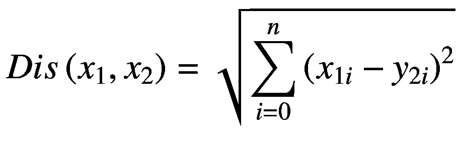
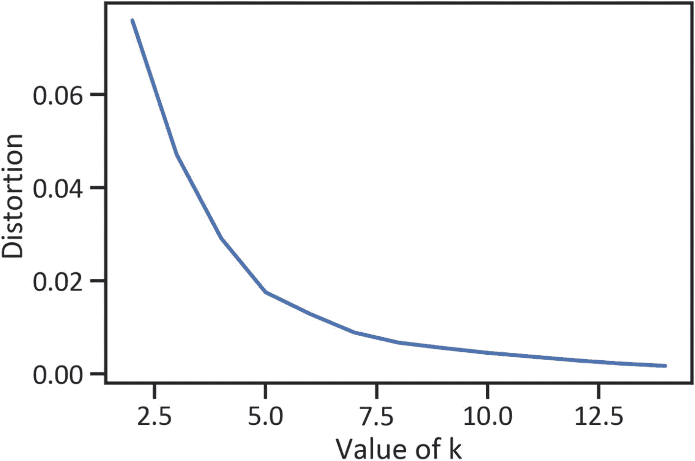
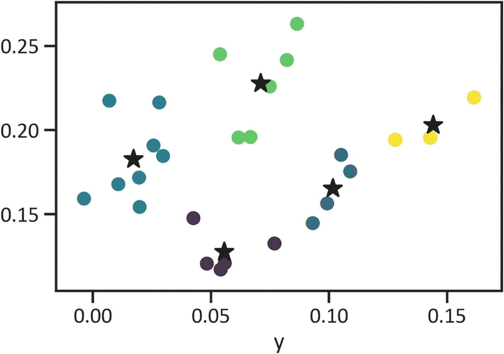

# 5. 股票聚类

投资者选择的股票组合会影响投资组合的业绩。有些资产投资风险极高，而另一些则不然。高风险资产是指那些价格在短期内剧烈波动的资产。为了保障资本安全，投资者可能会选择一组股票，而不是投资于单只股票或单一类别的股票。由于可供选择的股票众多，投资者通常很难挑选出一组表现最优的股票。为了找到一组具有相似性的股票，我们使用一种称为聚类分析的无监督学习技术。它涉及基于相似特征对数据点进行分组。最流行的聚类分析模型是 k-means 模型。

## 投资组合多元化

投资者应当谨慎行事，不要将所有资本都投入到一个利益领域。他们可以利用投资组合多元化来保障资本安全。这涉及将资金配置到不同行业、板块、地理区域等资产上。保守型投资者通过投资于风险较低、盈利能力更强的股票来实现投资组合多元化。他们确保自己的策略与风险承受能力相匹配，并投资于波动性最小的表现最佳的股票。

## 股市波动性

我们在前几章中提到，外汇市场和股票市场的价格并非恒定不变。由于价格随时间波动，因此存在随机性因素。就流动性而言，外汇市场是流动性最强的市场，其次是股票市场，依此类推。做市商通过大规模交易和销售活动的交易量来驱动价格变动。

投资差价合约 (CFD) 和交易所交易基金 (ETF) 涉及风险。资产价格可能朝相反方向变动，从而导致资本损失。投资者应当拥有稳健的风险管理策略。理想情况下，他们必须根据特定标准选择最佳股票。最常见的标准是波动性，这是对价格在短期内剧烈变化程度的估计。我们基本假设，如果市场流动性增加，则波动性增加，反之亦然。我们通过估算对数收益率和贝塔系数的标准差来衡量波动性。除了跨国金融机构的大规模交易和销售活动外，还有其他影响波动性的因素，例如社会事件、经济事件、节假日、流行病、劳工骚乱、自然灾害、战争等。

## K-Means 聚类

K-means 模型将数据划分为 *k* 个（簇），每个簇具有最近的均值（质心）；然后计算子组之间的距离以生成一个簇。它同时缩小簇内距离并增大簇间距离。其公式如方程 5-1 所示。



(方程 5-1)

`Dis(x1, x2)` 反映了数据点之间的距离。基于方程 5-1 中的公式，我们关注的是找出独立数据点（表示为坐标 (`x1`, `y1`) 和 (`x2`, `y2`)）偏离均值（中心）的离差平方和的平方根。它找到初始的 `k`（簇的数量），估算簇之间的距离，然后将数据点分配到相邻的质心。它将数据点划分为 `k` 个具有相似性的组。在空间中估算相似性最常用的方法是欧几里得距离（它关联了角度和距离）。该聚类模型需要在集合上指定数值。数据划分依赖于簇的数量。该算法随机初始化质心。

### K-Means 实践应用

代码清单 5-1 从雅虎财经提取数据，并应用网络爬虫方法 `get_data_yahoo()`。随后，它执行了获取高质量数据所需的数据处理任务。

```python
from pandas_datareader import data
tickers = ['AMZN','AAPL','WBA',
'NOC','BA','LMT',
'MCD','INTC','NAV',
'IBM','TXN','MA',
'MSFT','GE','AXP',
'PEP','KO','JNJ',
'TM','HMC','MSBHY',
'SNE','XOM','CVX',
'VLO','F','BAC']
start_date = '2010-01-01'
end_date = '2020-11-01'
df = data.get_data_yahoo(tickers, start_date, end_date)[['Adj Close']]
```

代码清单 5-1 提取了亚马逊、苹果、沃尔格林联合博姿等公司的股票数据，共计 27 支股票。请注意，你可以根据需要包含任意数量的股票。代码清单 5-2 用于计算收益率和波动率。

```python
returns = df.pct_change().mean() * (10*12)
std = df.pct_change().std() * np.sqrt((10*12))
ret_var = pd.concat([returns, std], axis = 1).dropna()
ret_var.columns = ["Returns","Standard Deviation"]
```

代码清单 5-3 生成了一个肘部曲线图（见图 5-1）。我们用它来确定在开发 k-means 模型时指定的聚类数量。



图 5-1 肘部曲线

```python
X = ret_var.values
sse = []
for k in range(1,15):
    kmeans = KMeans(n_clusters = k)
    kmeans.fit(X)
    sse.append(kmeans.inertia_)
plt.plot(range(1,15), sse)
plt.xlabel("Value of k")
plt.ylabel("Distortion")
plt.show()
```

y 轴表示相关矩阵的压缩方差（特征值），x 轴表示因子数量。我们通过在图中的曲线上找到急剧下降起始点，来确定聚类模型所需的聚类数量。为了清晰理解其原理，可以将 y 轴视为相关性的强度。我们感兴趣的是强相关与弱相关之间的分界线。图 5-1 显示从 1 到 5 有一个平滑的弯曲。然而，从 5 开始，曲线突然弯曲。我们将 5 作为分界点。代码清单 5-4 按降序对标准差进行排序，删除所有缺失值，并创建 Pandas 数据框的 NumPy 数组。

```python
stdOrder = ret_var.sort_values('Standard Deviation', ascending=False)
first_symbol = stdOrder.index[0]
ret_var.drop(first_symbol, inplace=True)
X = ret_var.values
```

代码清单 5-5 使用五个聚类完成了 k-means 模型。然后，它描绘了各个簇中的数据点（见图 5-2）。



图 5-2 K-means 模型

```python
kmeans = KMeans(n_clusters = 5).fit(X)
centroids = kmeans.cluster_centers_
plt.scatter(X[:,0], X[:,1], c = kmeans.labels_, cmap ="viridis")
plt.xlabel("y")
plt.scatter(centroids[:,0], centroids[:,1], color="red", marker="*")
plt.show()
```

k-means 模型通过智能推测，将数据点分配到最近的质心，并发现质心的均值。图 5-2 显示数据中存在五个明显的聚类。代码清单 5-6 列出了每支股票及其所属的簇，以及对应的收益率和波动率（见表 5-1）。

表 5-1 各簇收益率与波动率

| 股票代码 | 簇 | 收益率 | 波动率 |
| --- | --- | --- | --- |
| (Adj Close, AMZN) | 4 | 0.161408 | 0.219298 |
| (Adj Close, AAPL) | 4 | 0.142889 | 0.195379 |
| (Adj Close, WBA) | 2 | 0.025647 | 0.190772 |
| (Adj Close, NOC) | 1 | 0.099201 | 0.156376 |
| (Adj Close, BA) | 3 | 0.082153 | 0.241547 |
| (Adj Close, LMT) | 1 | 0.093110 | 0.144674 |
| (Adj Close, MCD) | 0 | 0.076895 | 0.132607 |
| (Adj Close, INTC) | 3 | 0.066716 | 0.195823 |
| (Adj Close, IBM) | 2 | 0.019773 | 0.154294 |
| (Adj Close, TXN) | 1 | 0.105104 | 0.185222 |
| (Adj Close, MA) | 4 | 0.128066 | 0.194152 |


| (Adj Close, MSFT) | 1 | 0.108985 | 0.175395 |
| (Adj Close, GE) | 2 | 0.006920 | 0.217385 |
| (Adj Close, AXP) | 3 | 0.061691 | 0.195526 |
| (Adj Close, PEP) | 0 | 0.055847 | 0.120965 |
| (Adj Close, KO) | 0 | 0.048256 | 0.120660 |
| (Adj Close, JNJ) | 0 | 0.054099 | 0.117171 |
| (Adj Close, TM) | 0 | 0.042555 | 0.147653 |
| (Adj Close, HMC) | 2 | 0.010742 | 0.167794 |
| (Adj Close, MSBHY) | 2 | 0.019532 | 0.171736 |
| (Adj Close, SNE) | 3 | 0.074899 | 0.225855 |
| (Adj Close, XOM) | 2 | -0.003797 | 0.159237 |
| (Adj Close, CVX) | 2 | 0.029708 | 0.184557 |
| (Adj Close, VLO) | 3 | 0.086470 | 0.263032 |
| (Adj Close, F) | 2 | 0.028089 | 0.216344 |
| (Adj Close, BAC) | 3 | 0.053830 | 0.244936 |

```python
stocks = pd.DataFrame(ret_var.index)
cluster_labels = pd.DataFrame(kmeans.labels_)
stockClusters = pd.concat([stocks, cluster_labels],axis = 1)
stockClusters.columns = ['Symbol','Cluster']
x_df = pd.DataFrame(X, columns = ["Returns", "Volatility"])
closerv = pd.concat([stockClusters, x_df], axis=1)
closerv = closerv.set_index("Symbol")
closerv
```

代码清单 5-6 各簇收益率与波动率

为了评估 `k-means` 的性能，我们采用了轮廓系数法，该方法会计算每个样本的簇内平均距离与最近簇的平均距离。计算得到的值即为轮廓系数，用于衡量聚类的分离程度。轮廓系数的取值范围是 -1 到 1。具体来说，-1 表示模型性能差，1 表示模型性能最优。代码清单 5-7 计算了该得分。

```python
from sklearn import metrics
y_predkmeans = pd.DataFrame(kmeans.predict(X))
y_predkmeans = y_predkmeans.dropna()
metrics.silhouette_score(X, y_predkmeans)
0.4260002825147118
```

代码清单 5-7 计算轮廓系数

轮廓系数为 0.42。该得分表明模型未能充分解释数据。

## 结论

本章介绍了一种无监督学习模型，该模型有助于投资者更好地管理风险并筛选一组表现最佳的资产。我们使用 `k-means` 模型将数据点分配到不同的簇中，并利用轮廓系数评估模型性能。经过仔细分析后发现，该模型展现了良好聚类模型的特征。轮廓系数更接近 1 而非 -1。然而，模型仍有改进空间。部分簇之间存在重叠，但重叠程度不足以影响结论的有效性。
