# 6. 使用线性回归进行未来价格预测

本章介绍参数化方法，也称为*线性回归法*。我们使用这种方法来确定自变量（连续或分类变量）与因变量（始终为连续变量）之间关系的性质。自变量可以是连续变量或分类变量，而因变量则必然是连续变量。该方法研究自变量的变化如何影响因变量的变化。用于估计截距和斜率的最传统模型是最小二乘模型。公式如公式 6-1 所示。

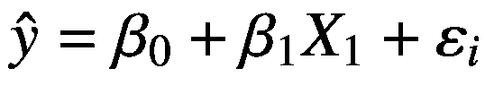

（公式 6-1）

其中， 代表预期的因变量，*β*[0] 代表截距，*β*[1] 代表斜率，*X*[1] 代表自变量，*ε*[*i*] 代表误差项（即第 i 个（共 *n* 个）数据点的残差），如公式 6-2 所示。

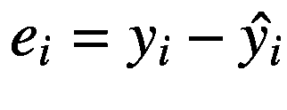

（公式 6-2）

最小二乘模型确保残差的平方和较小。我们通过应用公式 6-3 中的性质来求残差的平方和。

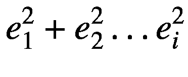

（公式 6-3）

该性质假设残差始终等于零，且估计值是无偏的。

## 线性回归实践

在本章中，我们基于最高价和最低价的变化及收益率来预测[黄金](https://finance.yahoo.com/quote/GC%253DF/)的收盘价。清单 6-1 从雅虎财经抓取数据。

```
from pandas_datareader import data
start_date = '2010-11-01'
end_date = '2020-11-01'
ticker = 'GC=F'
df = data.get_data_yahoo(ticker, start_date, end_date)
df_orig=df
清单 6-1
抓取的数据
```

清单 6-2 计算最高价和最低价的变化以及股票价格的收益率（见表 6-1）。

表 6-1 数据集

| 日期 | 调整收盘价 | HL_PCT | PCT_change | 成交量 |
| --- | --- | --- | --- | --- |
| **2010-11-01** | 1350.199951 | 0.711013 | -0.742490 | 40.0 |
| **2010-11-02** | 1356.400024 | 0.095846 | -0.029483 | 17.0 |
| **2010-11-03** | 1337.099976 | 2.370799 | -1.058166 | 135.0 |
| **2010-11-04** | 1382.699951 | 1.728504 | 1.030248 | 109.0 |
| **2010-11-05** | 1397.300049 | 1.417022 | 0.474588 | 109.0 |

```
df['HL_PCT']=(df['High']-df['Low'])/df['Adj Close'] *100.0
df['PCT_change']= (df['Adj Close']-df['Open'])/df['Open'] *100.0
df = df[['Adj Close','HL_PCT','PCT_change','Volume']]
date = df.index
df.head()
清单 6-2
计算最高价和最低价的变化及收益率
```

## 相关性方法

相关性评估自变量与因变量之间线性关系的表观强度。在训练回归模型之前，我们必须确定变量之间关联的紧密程度，因为关联程度会影响模型的性能。用于确定变量间相关性的主要相关性方法有三种：皮尔逊相关法，用于评估连续变量之间的相关性；肯德尔相关法，用于评估排名和有序变量之间的关联；斯皮尔曼相关法，也用于评估变量组合排名之间的关联。

### 皮尔逊相关法

鉴于我们处理的是连续变量，我们使用皮尔逊相关法，该方法产生的值范围从 -1 到 1。其中，-1 表示强的负相关关系，0 表示无相关关系，1 表示强的正相关关系。清单 6-3 生成皮尔逊相关矩阵。我们使用热力图来直观地展示该矩阵（见图 6-1）。要在 conda 环境中安装 `seaborn`，请使用 `conda install -c anaconda seaborn` 命令。

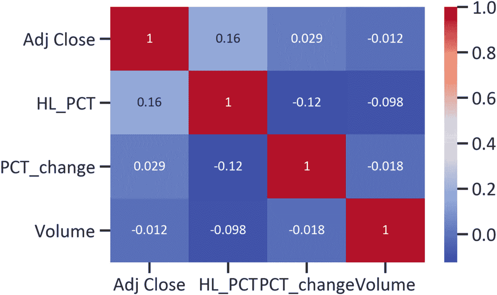

图 6-1 皮尔逊相关矩阵热力图

```
import seaborn as sns
dfcorr = df.corr(method="pearson")
sns.heatmap(dfcorr, annot=True,annot_kws={"size":12},cmap="coolwarm")
plt.show()
清单 6-3
皮尔逊相关矩阵
```

从左上角到右下角有一条由 1 组成的线。这意味着每个变量与自身完全相关。相关系数为 0.98（接近 1）。

## 协方差方法

清单 6-4 估计两个变量之间的联合变异性。它估计变量如何共同变化（见图 6-2）。

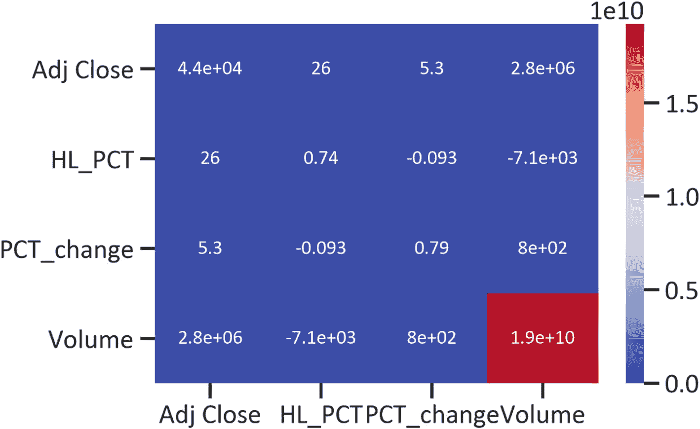

图 6-2 协方差矩阵热力图

```
dfcov =df.cov()
sns.heatmap(dfcov, annot=True,annot_kws={"size":12},cmap="coolwarm")
plt.show()
清单 6-4
估计并绘制协方差矩阵
```

协方差矩阵确认了更强的正联合变异性。当我们使用皮尔逊相关法时，必须首先找到协方差，因为该方法的系数是两个变量之间的协方差除以它们相对于平均值的偏差。


### 两两散点图

检验正态性通常需要两两散点图。当独立观测值接近均值时，我们认为数据服从正态分布。回归模型假设数据服从正态分布：非正态数据会导致模型性能下降。如果数据不服从正态分布，我们可以进行数据变换，例如，对正偏态数据（数据集中在分布右侧的情况）进行平方根变换，或对负偏态数据（数据集中在分布左侧的情况）进行指数/幂变换。可能影响非正态性的因素有多种，例如缺失值和异常值（极端值的存在）等。详见代码清单 6-5。

```
sns.jointplot(x="HL_PCT",y="Adj Close",data=df,kind="reg",color="navy")
plt.ylabel("Adj Close")
plt.xlabel("HL_PCT")
plt.show()
代码清单 6-5
最高与最低价格变化及收盘价
```

图 6-3 显示了一条穿过数据点的直线。此外，数据点并未完美地分布在一条直线上。

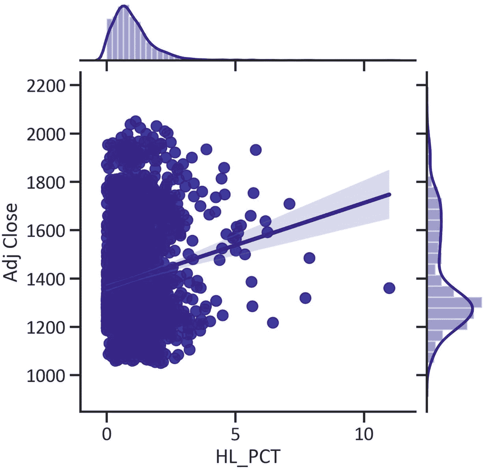

图 6-3

最高与最低价格变化及收盘价散点图

代码清单 6-6 构建了一个展示收益率与收盘价之间相关性的两两散点图（见图 6-4）。该联合图还显示 `HL_PCT` 呈负偏态，而 `Adj Close` 呈正偏态。

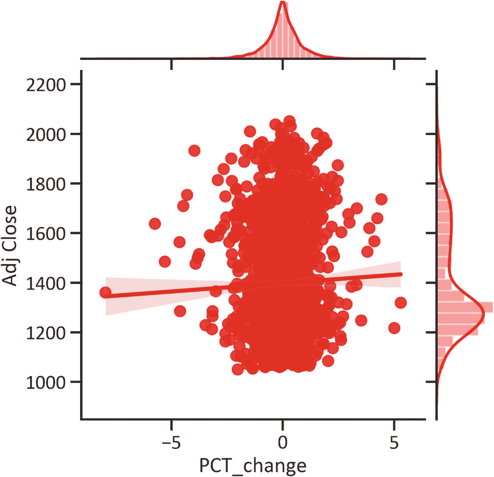

图 6-4

收益率与收盘价散点图

```
sns.jointplot(x="Corr",y="Adj Close",data=xy,kind="reg",color="red")
plt.ylabel("Adj Close")
plt.xlabel("Corr")
plt.show()
代码清单 6-6
收益率与收盘价
```

我们可以推导出一个直线关系的公式。此外，这条直线并非线性。图 6-5 展示了成交量与调整后收盘价之间的关联。该图还显示 `PCT_change` 服从正态分布（分布呈钟形）。详见代码清单 6-7。

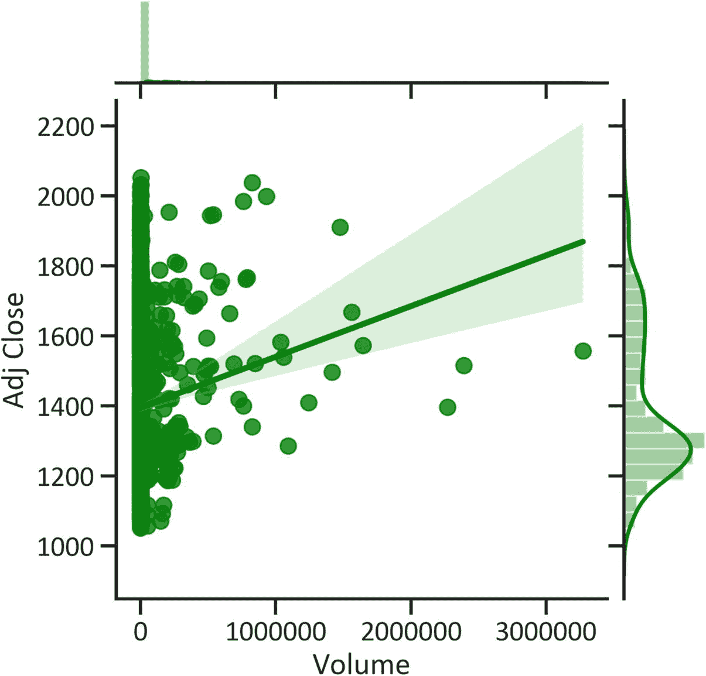

图 6-5

成交量与收盘价散点图

```
sns.jointplot(x="Corr",y="Adj Close",data=xy,kind="reg",color="red")
plt.ylabel("Adj Close")
plt.xlabel("Corr")
plt.show()
代码清单 6-7
成交量与收盘价
```

图 6-5 显示了一条线性直线，但数据点并不靠近这条线。

### 特征矩阵

在上一节中，我们发现了变量之间线性关系的强度。接下来，我们必须使用特征值来诊断变量之间相关性的严重程度。特征值表示相关矩阵的展平方差。两个以上高度相关的变量组合可能会降低模型的预测能力。特征矩阵是模型选择中的一个便捷工具。表 6-2 显示了与变量数量相等的特征值。特征值小于 0 表示不存在多重共线性；介于 10 到 100 之间表示中等程度的多重共线性；超过 100 则表示极端的多重共线性。代码清单 6-8 返回了特征矩阵。多重共线性是指两个以上变量高度相关的问题。

表 6-2

特征矩阵

| | 特征值 | Adj Close | HL_PCT | PCT_change | Volume |
| --- | --- | --- | --- | --- | --- |
| **Adj Close** | 1.921528e+10 | -1.448570e-04 | 1.000000 | -5.758481e-04 | -2.688695e-04 |
| **HL_PCT** | 4.334201e+04 | 3.710674e-07 | 0.000624 | 8.106354e-01 | 5.855510e-01 |
| **PCT_change** | 6.528812e-01 | -4.166475e-08 | 0.000119 | 5.855510e-01 | -8.106356e-01 |
| **Volume** | 8.540129e-01 | -1.000000e+00 | -0.000145 | 3.598192e-07 | 2.900014e-07 |

```
eigenvalues, eigenvectors = np.linalg.eig(dfcov)
eigenvalues = pd.DataFrame(eigenvalues)
eigenvectors = pd.DataFrame(eigenvectors)
eigen = pd.concat([eigenvalues,eigenvectors],axis=1)
eigen.index = df.columns
eigen.columns = ("Eigen values","Adj Close","HL_PCT","PCT_change","Volume")
eigen
代码清单 6-8
特征矩阵
```

表 6-2 突出显示存在中等程度的多重共线性（特征值小于 10）。

### 进一步的描述性统计

有多种方法可以汇总数据。代码清单 6-9 汇总了不同时间点的开盘价和收盘价（见图 6-6）。

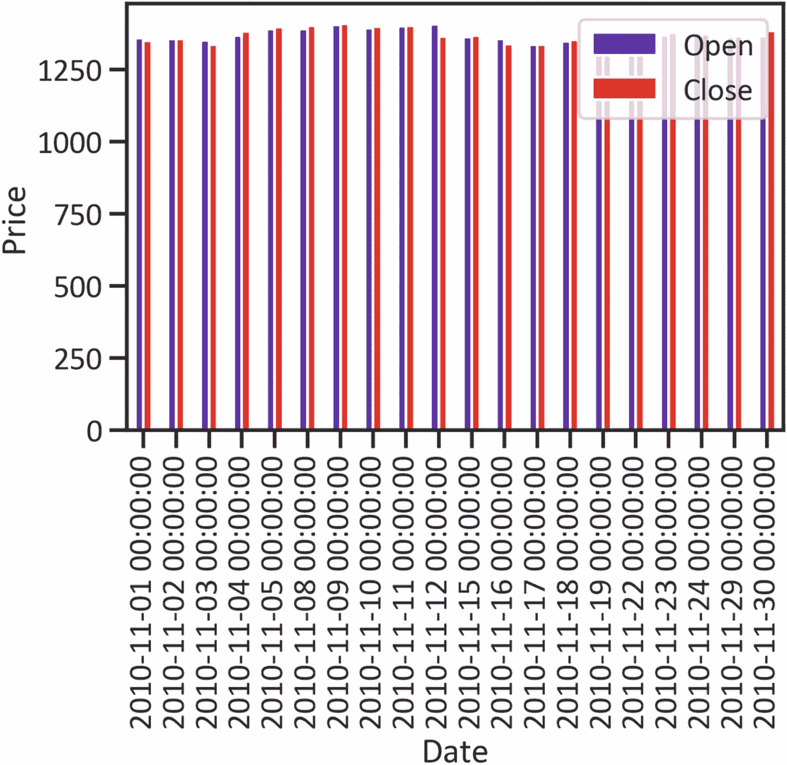

图 6-6

开盘价与收盘价

```
df_orig[["Open","Close"]].head(20).plot(kind='bar',cmap="rainbow")
plt.ylabel("Price")
plt.show()
代码清单 6-9
开盘价与收盘价
```

图 6-6 显示收盘价与开盘价之间没有重大偏差。图 6-7 描绘了不同时间点的最低价和收盘价。见代码清单 6-10。

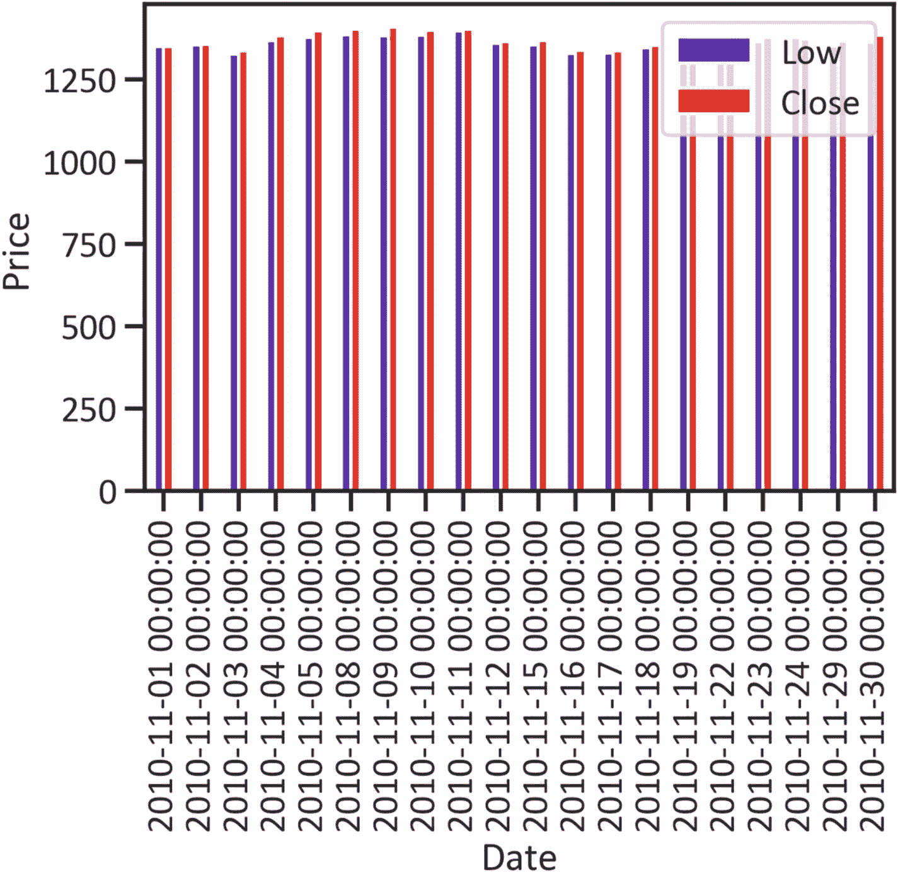

图 6-7

最低价与收盘价

```
df_orig[["Low","Close"]].head(20).plot(kind="bar",cmap="rainbow")
plt.ylabel("Price")
plt.show()
代码清单 6-10
最低价与收盘价
```

为了进一步理解价格变化，我们可以用图形展示不同时间点的最高价和收盘价（见图 6-8）。见代码清单 6-11。

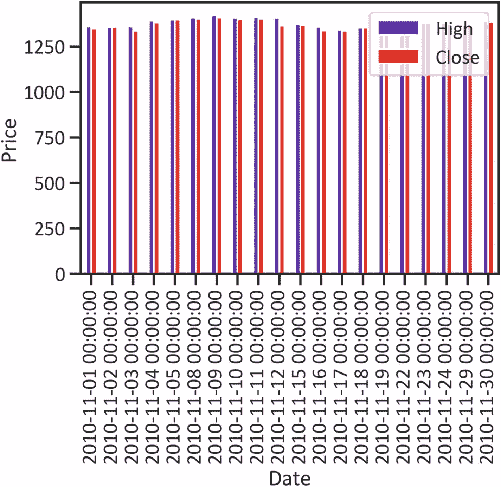

图 6-8

最低价与调整后收盘价

```
df_orig[['High','Close']].head(20).plot(kind='bar',cmap="rainbow")
plt.ylabel("Price")
plt.show()
代码清单 6-11
最高价与调整后收盘价
```

代码清单 6-12 展示了从 2020 年 11 月 1 日到 2020 年 11 月 2 日期间的交易量（见图 6-9）。

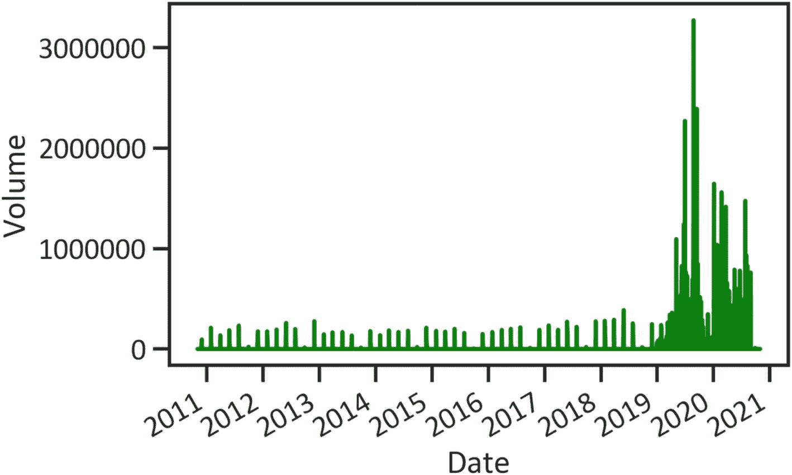

图 6-9

成交量

```
df_orig.Volume.plot(color="green")
plt.ylabel("Volume")
代码清单 6-12
成交量
```

图 6-1 显示，从 2011 年到 2019 年初，市场参与度较低。在 2019 年中，成交量呈指数级增长，超过三百万。2019 年之后，交易量严重下降；成交量在五十万到两百万之间。


### 开发最小二乘模型

清单 6-13 按照 80/20 的分割比例将数据划分为训练数据和测试数据。

```
from sklearn.model_selection import train_test_split
x_train, x_test, y_train, y_test = train_test_split(x,y,test_size=0.2, random_state=0)
清单 6-13
将数据划分为训练数据和测试数据
```

清单 6-14 使用 `StandardScaler()` 方法对训练数据进行归一化处理（该方法对数据进行变换，使得均值为 0，标准差为 1）。

```
from sklearn.model_selection import StandardScaler
scaler = StandardScaler()
x_train = scaler.fit_transform(x_train)
x_test = scaler.transform(x_test)
清单 6-14
归一化数据
```

清单 6-15 使用默认超参数拟合最小二乘模型。

```
from sklearn.linear_model import LinearRegression
lm = LinearRegression()
lm.fit(x_train,y_train)
清单 6-15
开发最小二乘模型
```

清单 6-16 定义了一个函数，该函数应用 R² 作为寻找交叉验证分数的标准，以计算交叉验证分数的均值和标准差。

```
from sklearn.model_selection import cross_val_score
def get_val_score(model):
scores = cross_val_score(model, x_train, y_train, scoring="r2")
print("CV mean: ", np.mean(scores))
print("CV std: ", np.std(scores))
print("\n")
清单 6-16
开发一个获取交叉验证均值和标准差的函数
```

清单 6-17 输出交叉验证分数的均值与标准差。

```
get_val_score(lm)
CV mean:  0.9473235769188586
CV std:  0.018455084710127526
清单 6-17
交叉验证均值与标准差
```

清单 6-18 查找参数的名称及其默认值。

```
lm.get_params()
清单 6-18
查找默认参数
```

清单 6-19 创建了一个网格模型。超参数代表我们在训练前必须为模型配置的设置或值。我们通过执行超参数优化来确定能够产生最佳模型性能的值。`GridSearchCV` 方法会考虑所有参数并寻找最合适的组合。例如，在清单 6-19 中，我们想要确定是否必须拟合截距、在拟合模型前是否对 X 进行归一化、以及是否复制 X。

```
from sklearn.model_selection import GridSearchCV
param_grid = {'fit_intercept':[True,False],
'normalize':[True,False],
'copy_X':[True, False]}
grid_model  = GridSearchCV(estimator=lm,
param_grid=param_grid,
n_jobs=-1)
grid_model.fit(x_train,y_train)
清单 6-19
开发网格模型
```

清单 6-20 查找最佳分数和最佳超参数。

```
print("Best score: ", grid_model.best_score_, "Best parameters: ", grid_model.best_params_)
清单 6-20
超参数优化
```

结果如下：

- **最佳分数**：0.9473235769188586
- **最佳参数**：{'copy_X': True, 'fit_intercept': True, 'normalize': False}

清单 6-21 通过应用网格模型返回的超参数来训练模型，从而完成最小二乘模型的最终构建。

```
lm = LinearRegression(copy_X= True,
fit_intercept= True,
normalize= False)
lm.fit(x_train,y_train)
清单 6-21
完成最小二乘模型
```

清单 6-22 查找截距。截距是在保持因变量不变的情况下，自变量的均值。

```
lm.intercept_
15.725513886138613
清单 6-22
截距
```

清单 6-23 估算系数。

```
lm.coef_
array([1.45904887, 0.04329147])
清单 6-23
系数
```

### 模型评估

清单 6-24 应用 `predict()` 方法返回表 6-3（该表突出显示了回归模型产生的预测值）。

**表 6-3** 预测值

|   | 预测值 |
|---|--------|
| **0** | 1469.400024 |
| **1** | 1466.699951 |
| **2** | 1475.599976 |
| **3** | 1478.400024 |
| **4** | 1475.000000 |
| **...** | ... |
| **253** | 1902.699951 |
| **254** | 1908.800049 |
| **255** | 1876.199951 |
| **256** | 1865.599976 |
| **257** | 1877.400024 |

```
y_pred = lm.predict(x_test)
pd.DataFrame(y_pred,columns=["Forecast"])
清单 6-24
预测值
```

清单 6-25 绘制调整收盘价的未来预测走势图（见图 6-10）。

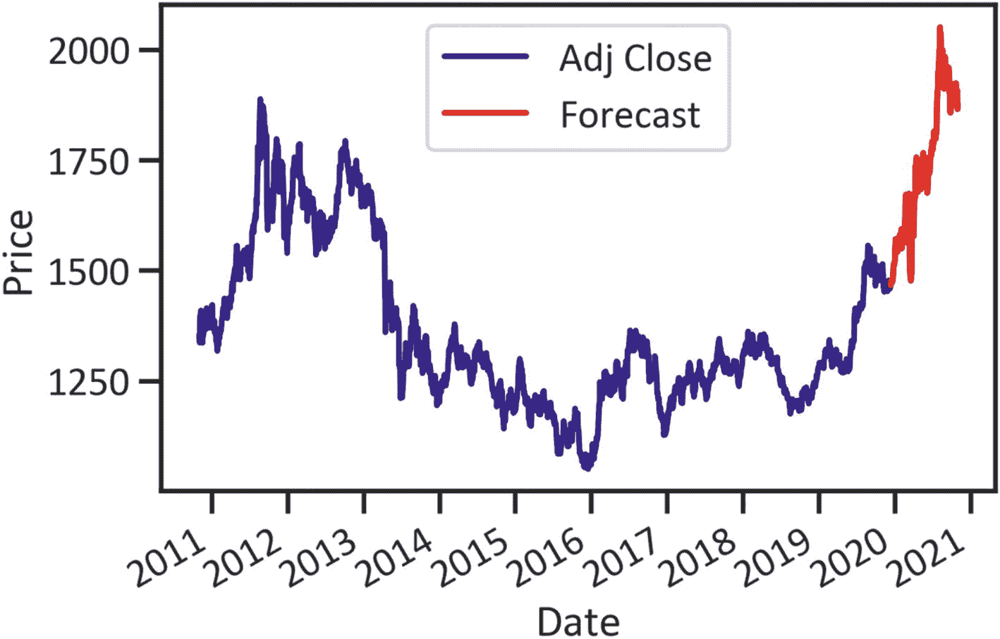

**图 6-10** 预测走势

```
num_samples = df.shape[0]
df['Forecast'] = np.nan
df['Forecast'][int(0.9*num_samples):num_samples]=y_pred
df['Adj Close'].plot(color="navy")
df['Forecast'].plot(color="red")
plt.legend(loc="best")
plt.xlabel('Date')
plt.ylabel('Price')
plt.show()
清单 6-25
预测走势
```

清单 6-26 返回一个包含回归模型性能信息的表格（见表 6-4）。该表显示了关键的回归评估指标，例如平均绝对误差（不考虑方向的误差大小）、均方误差（考虑线性关系后解释的变异性）以及 R² 分数（模型所解释的数据变异性）。

**表 6-4** 模型性能

|   | 数值 |
|---|--------|
| **MAE** | 2.820139e-13 |
| **MSE** | 1.150198e-25 |
| **RMSE** | 3.391457e-13 |
| **R2** | 1.000000e+00 |
| **解释方差分数** | 1.000000e+00 |
| **平均伽马偏差** | -2.581914e-18 |
| **平均泊松偏差** | 0.000000e+00 |

```
from sklearn import metrics
MAE = metrics.mean_absolute_error(y_test,y_pred)
MSE = metrics.mean_squared_error(y_test,y_pred)
RMSE = np.sqrt(MSE)
R2 = metrics.r2_score(y_test,y_pred)
EV = metrics.explained_variance_score(y_test,y_pred)
MGD = metrics.mean_gamma_deviance(y_test,y_pred)
MPD = metrics.mean_poisson_deviance(y_test,y_pred)
lmmodelevaluation = [[MAE,MSE,RMSE,R2,EV,MGD,MPD]]
lmmodelevaluationdata = pd.DataFrame(lmmodelevaluation,
index = ["数值"],
columns = ["MAE",
"MSE",
"RMSE",
"R2",
"解释方差分数",
"平均伽马偏差",
"平均泊松偏差"]).transpose()
lmmodelevaluationdata
清单 6-26
模型性能
```

表 6-4 突出显示了该模型解释了数据中 100% 的变异性。时间序列数据中存在显著的相关性。平均而言，不考虑方向的误差大小为 2.82，误差的平均总和为 1.15。

## 结论

在本章中，我们简要介绍了最小二乘模型及其应用。首先，我们介绍了协方差和相关性。接着，我们向您展示了如何设计、构建和测试一个回归模型。在仔细审查回归模型的性能后，我们发现该模型能最好地解释数据。我们可以利用它进行可靠的未来价格预测。在下一章中，我们将介绍市场模拟。


