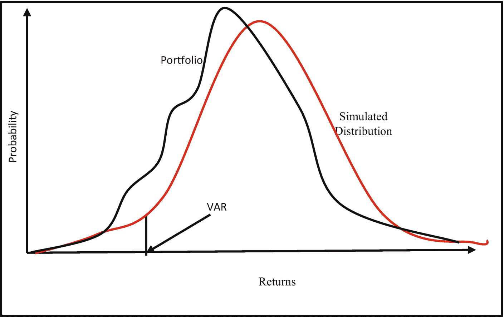
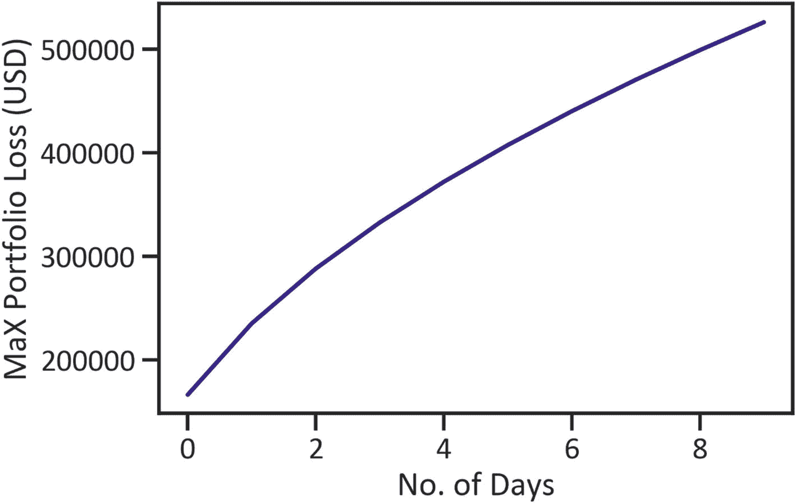
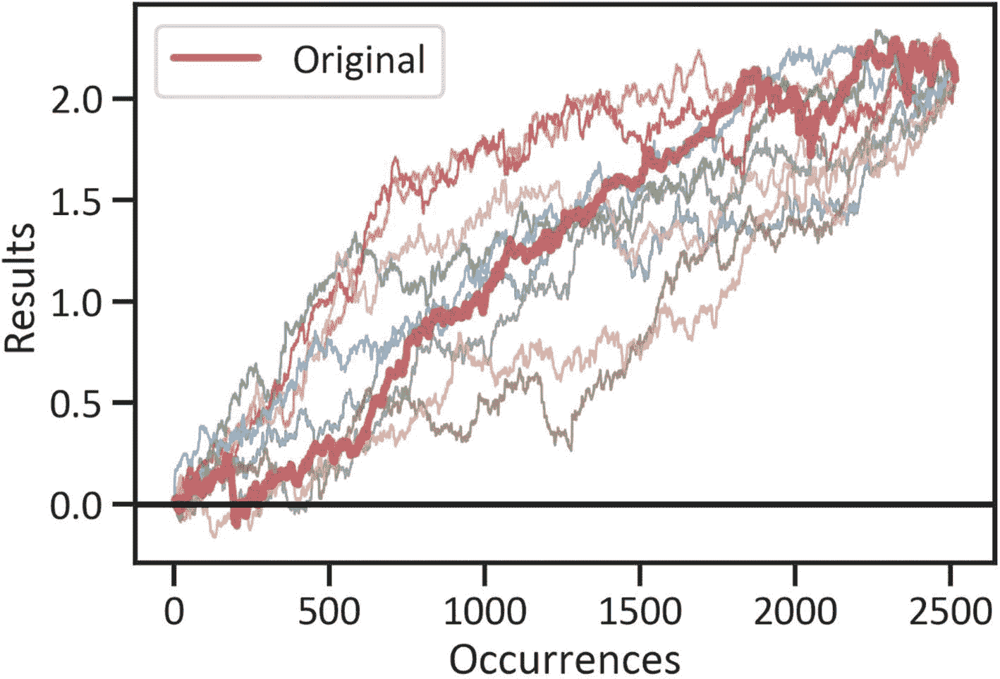

# 7. 股票市场模拟

股票交易所通常会对社会-经济状况做出反应。关键市场参与者的积极参与无疑为市场创造了流动性。除了主要做市商进行的大宗交易外，还有其他因素会影响市场波动。例如，市场会对社会事件、经济事件、自然灾害、流行病等新闻做出反应。在某些条件下，这些事件的影响会剧烈推动价格变动。系统性投资者（指其交易执行依赖于量化模型体系的投资者）需要通过从接近现实的情况中学习，为未来可能发生的事件做好准备以保本。如果你观察一下涉及高风险行业，例如航空航天和国防领域，就会发现这些领域的受训者会通过模拟进行学习。模拟是一种通过生成模仿真实世界的条件，让受训者知道如何在类似于先前情况的条件下行动和应对的方法。在金融领域，我们处理的是巨额资金。在试验和测试模型时，它们习惯于将风险考虑在内。

在本章中，我们将实现一个蒙特卡洛模拟，以在不暴露于风险的情况下模拟市场的重大变化。模拟市场有助于识别先前发生事件中的模式，并以合理的确定性预测未来价格。如果我们能够重建真实世界，那么我们就能理解之前的市场行为，并预测未来的市场行为。在前面的章节中，我们已经充分介绍了用于序列模式识别和预测的模型。我们将使用 `panda_montecarlo` 框架来执行模拟。要在 Python 环境中安装它，请使用 `pip install pandas-montecarlo`。

当投资者交易股票时，他们期望其投机行为能在一段时间内产生回报。意外事件会发生，并可能影响价格的方向。为了建立长期持续的盈利能力，投资者可以开发模型来识别先前发生事件中的潜在模式，并预测未来发生的事件。

假设你是一位潜在的保守型投资者，初始投资资本为 500 万美元。在进行了全面研究后，你选定了一组股票进行投资。你可以使用蒙特卡洛模拟来进一步了解投资这些资产的风险。

## 理解风险价值（Value at Risk）

评估风险最便捷的方法是应用风险价值（`VAR`）。它揭示了投资组合所暴露的金融风险程度。它显示了在特定概率水平下，为弥补损失所需的最低资本。估计 `VAR` 主要有两种方法：我们可以使用方差-协方差法，或者通过应用蒙特卡洛模拟来估算。

### 通过应用方差-协方差法估算 VAR

方差-协方差法对数据结构做出了强假设。该方法假设数据的底层结构是线性和正态的。它也对缺失数据、非线性和异常值敏感。为了估算标准 `VAR`，我们首先计算收益率，然后创建协方差矩阵，并找出投资组合的均值与标准差。之后，我们估算正态累积分布的逆函数，并计算 `VAR`。图 7-1 显示了投资组合的 `VAR` 以及模拟分布。



**图 7-1** VAR

这里我们向你展示如何通过应用方差/协方差计算来计算 `VAR`。

假设：

*   投资资本为 5,000,000 美元。
*   根据年度交易日历（252 天）计算的标准差为 9%。
*   在 95% 置信区间下使用 z 分数（1.65），风险价值计算如下：
*   5,000,0000 * 1.645 * .09 = 740,250 美元

清单 7-1 抓取了亚马逊、苹果、沃博联、诺斯罗普·格鲁曼公司、波音公司和洛克希德·马丁公司的股票价格（见表 7-1）。

**表 7-1** 数据集

| 属性 | 调整收盘价 |
| --- | --- |
| 股票代码 | AMZN | AAPL | WBA | NOC | BA | LMT |
| --- | --- | --- | --- | --- | --- | --- |
| **日期** | | | | | | |
| **2010-01-04** | 133.899994 | 6.539882 | 28.798639 | 40.206833 | 43.441975 | 53.633926 |
| **2010-01-05** | 134.690002 | 6.551187 | 28.567017 | 40.277546 | 44.864773 | 54.192230 |
| **2010-01-06** | 132.250000 | 6.446983 | 28.350834 | 40.433144 | 46.225727 | 53.396633 |
| **2010-01-07** | 130.000000 | 6.435065 | 28.520689 | 40.850418 | 48.097031 | 51.931023 |
| **2010-01-08** | 133.520004 | 6.477847 | 28.559305 | 40.624100 | 47.633064 | 52.768509 |

```
from pandas_datareader import data
tickers = ['AMZN','AAPL','WBA',
'NOC','BA','LMT']
start_date = '2010-01-01'
end_date = '2020-11-01'
df = data.get_data_yahoo(tickers, start_date, end_date)[['Adj Close']]
df.head()
```

**清单 7-1** 抓取的数据

清单 7-2 指定了投资组合的权重。

```
weights = np.array([.25, .3, .15, .10, .24, .7])
```

**清单 7-2** 指定投资权重

随后，我们指定投资组合的初始投资资本。见清单 7-3。

```
initial_investment = 5000000
```

**清单 7-3** 指定初始投资

清单 7-4 估算日收益率（见表 7-2）。

**表 7-2** 日收益率

| 属性 | 调整收盘价 |
| --- | --- |
| 股票代码 | AMZN | AAPL | WBA | NOC | BA | LMT |
| --- | --- | --- | --- | --- | --- | --- |
| **日期** | | | | | | |
| **2020-10-26** | 0.000824 | 0.000087 | -0.021819 | 0.004572 | -0.039018 | -0.015441 |
| **2020-10-27** | 0.024724 | 0.013472 | -0.032518 | -0.024916 | -0.034757 | -0.016606 |
| **2020-10-28** | -0.037595 | -0.046312 | -0.039167 | -0.028002 | -0.045736 | -0.031923 |
| **2020-10-29** | 0.015249 | 0.037050 | -0.030934 | -0.004325 | 0.001013 | 0.004503 |
| **2020-10-30** | -0.054456 | -0.056018 | 0.015513 | -0.008790 | -0.026300 | -0.006554 |

```
returns = df.pct_change()
returns.tail()
```

**清单 7-4** 估算日收益率

表 7-2 突出了每只股票日收益率的前五行。清单 7-5 估算了投资组合中股票之间的联合变异性（见表 7-3）。

**表 7-3** 协方差矩阵


| 属性 | | 调整收盘价 |
| --- | --- | --- |
| | 代码 | AMZN | AAPL | WBA | NOC | BA | LMT |
| --- | --- | --- | --- | --- | --- | --- | --- |
| **调整收盘价** | **AMZN** | 0.000401 | 0.000159 | 0.000096 | 0.000092 | 0.000135 | 0.000081 |
| **AAPL** | 0.000159 | 0.000318 | 0.000098 | 0.000098 | 0.000161 | 0.000093 |
| **WBA** | 0.000096 | 0.000098 | 0.000303 | 0.000097 | 0.000131 | 0.000088 |
| **NOC** | 0.000092 | 0.000098 | 0.000097 | 0.000204 | 0.000165 | 0.000150 |
| **BA** | 0.000135 | 0.000161 | 0.000131 | 0.000165 | 0.000486 | 0.000162 |
| **LMT** | 0.000081 | 0.000093 | 0.000088 | 0.000150 | 0.000162 | 0.000174 |

```
cov_matrix = returns.cov()
cov_matrix
Listing 7-5
Covariance Matrix
```

清单 7-6 估计了 VAR。首先，我们指定了日均收益率，然后指定了置信区间和临界值，最后获得了均值和标准差。随后，我们求出了分布的逆。

```
conf_level1 = 0.05
avg_rets = returns.mean()
port_mean = avg_rets.dot(weights)
port_stdev = np.sqrt(weights.T.dot(cov_matrix).dot(weights))
mean_investment = (1+port_mean) * initial_investment
stdev_investment = initial_investment * port_stdev
cutoff1 = norm.ppf(conf_level1, mean_investment, stdev_investment)
var_1d1 = initial_investment - cutoff1
var_1d1
166330.5512926411
Listing 7-6
Estimate Value at Risk
```

在 95% 的置信区间下，规模为 5,000,000 美元的投资组合每日损失不会超过 166,330.55 美元。清单 7-7 输出了 10 天 VAR 值。

```
var_arry = []
num_days = int(10)
for x in range(1, num_days+1):
var_array.append(np.round(var_1d1 * np.sqrt(x),2))
print(str(x) + " day VaR @ 95% confidence: " + str(np.round(var_1d1 * np.sqrt(x),2)))
1 day VaR @ 95% confidence: 166330.55
2 day VaR @ 95% confidence: 235226.92
3 day VaR @ 95% confidence: 288092.97
4 day VaR @ 95% confidence: 332661.1
5 day VaR @ 95% confidence: 371926.42
6 day VaR @ 95% confidence: 407424.98
7 day VaR @ 95% confidence: 440069.27
8 day VaR @ 95% confidence: 470453.84
9 day VaR @ 95% confidence: 498991.65
10 day VaR @ 95% confidence: 525983.39
Listing 7-7
Print 10-Day VAR
```

清单 7-8 以图形方式展示了 10 天内的 VAR（见图 7-2）。



图 7-2

15 天内的最大投资组合损失 (VAR)

```
plt.plot(var_array, color="navy")
plt.xlabel("No. of Days")
plt.ylabel("MaX Portfolio Loss (USD)")
plt.show()
Listing 7-8
10-Day VAR
```

图 7-2 显示，随着天数的增加，最大投资组合的损失也会增加。在下一节中，我们将探讨蒙特卡洛模拟。

## 理解蒙特卡洛模拟

蒙特卡洛模拟使用重采样技术来解决序列问题。它重构真实世界的情境，以识别和理解先前发生事件的结果，并预测未来发生的事件。它还使我们能够试验不同的投资策略。不仅如此，它对来自正态分布的随机变量进行重复测量，以确定每个输出的概率，然后分配一个置信区间输出。

### 蒙特卡洛模拟在金融中的应用

我们使用蒙特卡洛模拟来评估策略的严谨性。它帮助我们确定该策略是否过于乐观。一个过于乐观的策略在环境参数调整时会停止产生最优回报。它使我们能够模拟市场，识别我们所面临的风险。在这个例子中，我们只关注一只股票——诺斯罗普·格鲁曼公司的股票。参见清单 7-9 和表 7-4。

表 7-4

数据集

| 日期 | 最高价 | 最低价 | 开盘价 | 收盘价 | 成交量 | 调整收盘价 | 收益率 |
| --- | --- | --- | --- | --- | --- | --- | --- |
| **2010-11-01** | 58.257679 | 56.974709 | 57.245762 | 57.381287 | 1736400.0 | 46.094521 | 0.000000 |
| **2010-11-02** | 58.438381 | 57.833035 | 57.833035 | 58.357063 | 1724000.0 | 46.878361 | 0.017005 |
| **2010-11-03** | 58.501625 | 57.354179 | 58.221539 | 58.076981 | 1598400.0 | 46.653362 | -0.004800 |
| **2010-11-04** | 59.143108 | 58.140224 | 58.483555 | 58.971443 | 2213600.0 | 47.371891 | 0.015401 |
| **2010-11-05** | 59.260567 | 58.826885 | 58.926270 | 59.034691 | 1043900.0 | 47.422695 | 0.001072 |

```
start_date = '2010-11-01'
end_date = '2020-11-01'
ticker = 'NOC'
df = data.get_data_yahoo(ticker, start_date, end_date)
df['return'] = df['Adj Close'].pct_change().fillna(0)
df.head()
Listing 7-9
Scraped Data
```

## 运行蒙特卡洛模拟

清单 7-10 应用了 `panda_montecarlo()` 方法，使用五个模拟来运行蒙特卡洛模拟。此外，我们将“破产/最大回撤”设置为 -10.0%，将目标阈值设置为 +100.0%。

```
mc = df['return'].montecarlo(sims=10, bust=-0.1, goal=1)
Listing 7-10
Run the Monte Carlo Simulation
```

## 绘制模拟结果图

清单 7-11 绘制了蒙特卡洛模拟运行的 10 次模拟结果（见图 7-3）。



图 7-3

蒙特卡洛模拟

```
mc.plot(title="")
Listing 7-11
Simulations
```

图 7-3 展示了模拟结果。它突出了一个占主导地位的上升趋势。清单 7-12 以表格形式列出了原始模拟数据（见表 7-5）。

表 7-5

原始模拟数据

| | 原始值 | 1 | 2 | 3 | 4 | 5 | 6 | 7 | 8 | 9 |
| --- | --- | --- | --- | --- | --- | --- | --- | --- | --- | --- |
| **0** | 0.000000 | -0.018168 | -0.002659 | -0.021098 | -0.006357 | 0.018090 | -0.010110 | -0.006555 | -0.004119 | 0.020557 |
| **1** | 0.017005 | 0.005521 | -0.014646 | 0.000541 | -0.009134 | -0.000602 | -0.006801 | -0.003373 | 0.004342 | -0.002257 |
| **2** | -0.004800 | -0.003900 | -0.002494 | 0.027738 | 0.005924 | -0.012834 | -0.004095 | -0.003315 | 0.000116 | 0.113851 |
| **3** | 0.015401 | 0.006688 | 0.001144 | 0.005586 | -0.004924 | 0.011399 | 0.009817 | -0.001273 | 0.006164 | 0.023355 |
| **4** | 0.001072 | 0.005617 | 0.010052 | 0.011748 | 0.007878 | 0.010080 | -0.008666 | -0.005126 | 0.036459 | 0.015438 |

```
pd.DataFrame(mc.data).head()
Listing 7-12
Raw Simulations
```

清单 7-13 返回了模拟模型的统计信息（表 7-6）。

表 7-6

蒙特卡洛模拟统计量

| | 最小值 | 最大值 | 均值 | 中位数 | 标准差 | 最大回撤 | 破产概率 | 达标概率 |
| --- | --- | --- | --- | --- | --- | --- | --- | --- |
| s | 2.094128 | 2.094128 | 2.094128 | 2.094128 | 2.145155e-15 | -0.164648 | 0.2 | 0.8 |

```
ev = pd.DataFrame(mc.stats, index=["s"])
ev
Listing 7-13
Monte Carlo Statistics
```

表 7-6 突出了离散程度。它还突出了最大回撤（从峰值开始的最大损失金额）。

## 结论

在投资一只股票或一组股票时，理解、量化并降低投资组合中的潜在风险非常重要。本章讨论了 VAR；随后展示了计算投资组合 VAR 的方法，接着通过应用蒙特卡洛模拟来模拟股票市场的变化。模拟技术有许多应用；我们也可以将其用于资产价格结构等。下一章将进一步深入探讨投资组合和风险分析。


