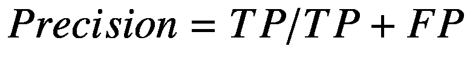
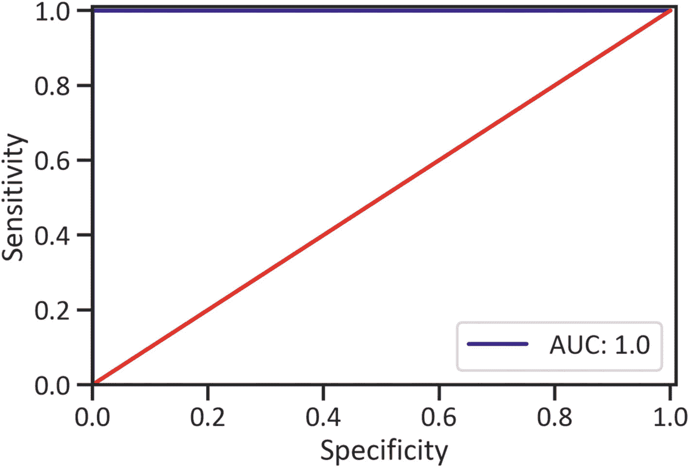
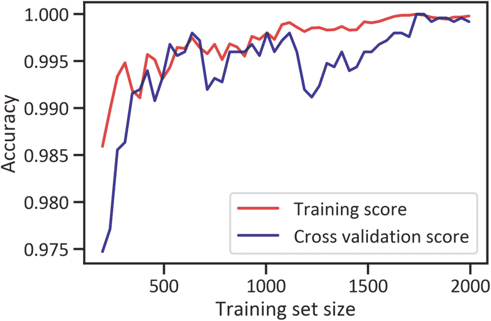
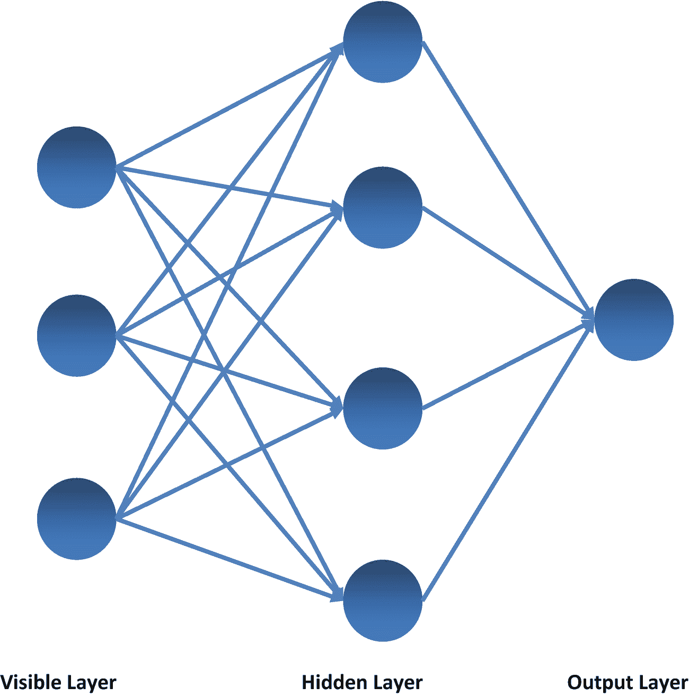
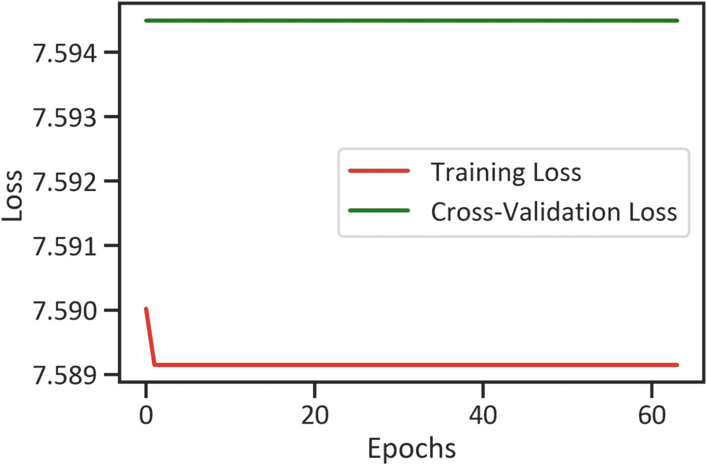
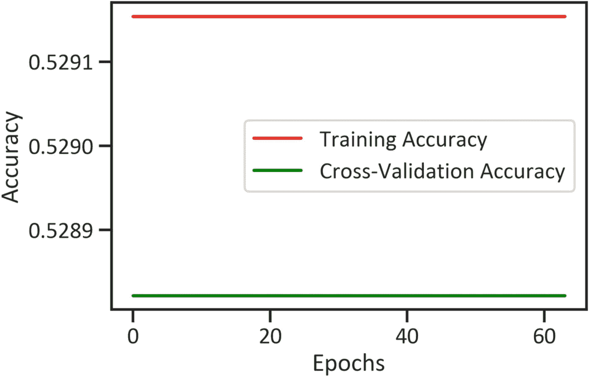

# 8. 使用机器学习和深度学习进行市场趋势分类

到目前为止，我们已逐步介绍了参数方法。我们解决的所有问题都涉及一个连续变量。我们还可以利用*非参数方法*来预测市场可能的走向。本章将介绍非参数（或非线性）方法，也称为*分类方法*。这种流行的方法作用于自变量，并生成一个有界的值。它适用于处理分类因变量（受特定范围限制的因变量）。分类方法主要有两种类型：二元分类法，用于因变量有两种结果的情况；以及多类分类法，用于因变量是一个具有超过两种结果的分类变量。在本章中，我们将同时使用 `SciKit-Learn` 和 `Keras`。`SciKit-Learn` 库已预装在 Python 环境中。要在 Python 环境中安装 `Keras`，我们使用 `pip install Keras`；在 conda 环境中，则使用 `conda install -c conda-forge keras`。

## 分类实践

识别供需活动有助于投资者做出明智的投资决策。在本章中，我们创建一个具有两种结果（0 和 1）的分类变量，其中 0 代表市场下跌，1 代表市场上涨。我们使用逻辑分类器来预测未来的类别。清单 8-1 应用了 `get_data_yahoo()` 方法，获取从 2010 年 11 月 1 日到 2020 年 11 月 1 日的原油价格数据（见表 8-1）。

表 8-1 数据集

| 日期 | 最高价 | 最低价 | 开盘价 | 收盘价 | 成交量 | 调整收盘价 |
| --- | --- | --- | --- | --- | --- | --- |
| **2010-11-01** | 83.860001 | 81.320000 | 81.449997 | 82.949997 | 358535.0 | 82.949997 |
| **2010-11-02** | 84.470001 | 82.830002 | 82.879997 | 83.900002 | 281834.0 | 83.900002 |
| **2010-11-03** | 85.360001 | 83.570000 | 84.370003 | 84.690002 | 393735.0 | 84.690002 |
| **2010-11-04** | 86.830002 | 84.919998 | 85.089996 | 86.489998 | 317997.0 | 86.489998 |
| **2010-11-05** | 87.430000 | 85.959999 | 86.599998 | 86.849998 | 317997.0 | 86.849998 |

```
from pandas_datareader import data
start_date = '2010-11-01'
end_date = '2020-11-01'
ticker = 'CL=F'
df = data.get_data_yahoo(ticker, start_date, end_date,)
df.head()
清单 8-1 抓取的数据
```

清单 8-2 估计了收益率和对数收益率（见表 8-2）。

表 8-2 包含估计收益率和对数收益率的数据集

| 日期 | 最高价 | 最低价 | 开盘价 | 收盘价 | 成交量 | 调整收盘价 | 百分比变动 | 对数收益率 |
| --- | --- | --- | --- | --- | --- | --- | --- | --- |
| **2010-11-01** | 83.860001 | 81.320000 | 81.449997 | 82.949997 | 358535.0 | 82.949997 | NaN | NaN |
| **2010-11-02** | 84.470001 | 82.830002 | 82.879997 | 83.900002 | 281834.0 | 83.900002 | 0.011453 | 0.011388 |
| **2010-11-03** | 85.360001 | 83.570000 | 84.370003 | 84.690002 | 393735.0 | 84.690002 | 0.009416 | 0.009372 |
| **2010-11-04** | 86.830002 | 84.919998 | 85.089996 | 86.489998 | 317997.0 | 86.489998 | 0.021254 | 0.021031 |
| **2010-11-05** | 87.430000 | 85.959999 | 86.599998 | 86.849998 | 317997.0 | 86.849998 | 0.004162 | 0.004154 |

```
df = df.dropna()
df['pct_change'] = df["Adj Close"].pct_change()
df['log_ret'] = np.log(df["Adj Close"]) - np.log(df["Adj Close"].shift(1))
df.head()
清单 8-2 估计收益率和对数收益率
```

清单 8-3 删除缺失值并估计市场方向（见表 8-3）。

表 8-3 包含估计收益率、对数收益率和市场方向的数据集

| 日期 | 最高价 | 最低价 | 开盘价 | 收盘价 | 成交量 | 调整收盘价 | 百分比变动 | 对数收益率 | 方向 |
| --- | --- | --- | --- | --- | --- | --- | --- | --- | --- |
| **2010-11-02** | 84.470001 | 82.830002 | 82.879997 | 83.900002 | 281834.0 | 83.900002 | 0.011453 | 0.011388 | 1 |
| **2010-11-03** | 85.360001 | 83.570000 | 84.370003 | 84.690002 | 393735.0 | 84.690002 | 0.009416 | 0.009372 | 1 |
| **2010-11-04** | 86.830002 | 84.919998 | 85.089996 | 86.489998 | 317997.0 | 86.489998 | 0.021254 | 0.021031 | 1 |

```
df = df.dropna()
df['direction'] = np.sign(df['pct_change']).astype(int)
df.head(3)
清单 8-3 删除缺失值并估计市场方向
```

## 数据预处理

清单 8-4 创建了一个具有两种结果（0 和 1）的分类变量，其中 0 代表市场下跌，1 代表市场上涨。这使我们能够使用可以预测两个类别概率的分类器。我们首先定义滞后阶数，然后估计每日收益率，并将滞后收益率转换为二元类别。我们还使用 `GridSearchCV()` 方法来标准化数据，使得均值为 0，标准差为 1。

```
from sklearn.preprocessing import StandardScaler
df["direction"] = pd.get_dummies(df["direction"])
from sklearn import preprocessing
x=df.iloc[::,5:8]
y=df.iloc[::,-1]
scaler = StandardScaler()
x=scaler.fit_transform(x)
清单 8-4 数据预处理
```

清单 8-5 使用 80/20 的分割比例将数据分为训练数据和测试数据。

```
from sklearn.model_selection import train_test_split
x_train, x_test, y_train, y_test =train_test_split(x , y, test_size=0.2,shuffle= False)
清单 8-5 将数据分割为训练数据和测试数据
```

## 逻辑回归

尽管术语*逻辑回归*包含*回归*这个词，但它不是一个回归模型，而是一个分类模型。线性回归模型估计一个连续变量。而逻辑回归模型估计一个分类因变量。回归模型假设数据是线性的且来自正态分布，但逻辑分类器则不受这些假设的约束。在逻辑回归中，我们拟合一条 S 形曲线（或逻辑曲线、Sigmoid 曲线）到数据上。我们使用逻辑分类器来预测市场走势。股票价格在特定时期内会发生显著变化。如果市场在某个时期内应该飙升，那么就是上涨市场或牛市。相反，如果市场价格在特定时期内持续下跌，那么就是下跌市场或熊市。

### 开发逻辑分类器

清单 8-6 完成了逻辑分类器的最终确定。

```
from sklearn.linear_model import LogisticRegression
logreg = LogisticRegression()
logreg.fit(x_train, y_train)
清单 8-6 完成逻辑分类器的确定
```

#### 评估逻辑分类器

清单 8-7 构建了一个突出显示预测市场类别的表格（见表 8-4）。

表 8-4 预测类别

|   | 预测值 |
| --- | --- |
| **0** | 1 |
| **1** | 1 |
| **2** | 0 |
| **3** | 1 |
| **4** | 1 |
| **...** | ... |
| **494** | 1 |
| **495** | 0 |
| **496** | 1 |
| **497** | 0 |
| **498** | 1 |

```
y_predlogreg = logreg.predict(x_test)
pd.DataFrame(y_predlogreg,columns=["Forecast"])
清单 8-7 预测值
```

表 8-4 并没有为我们提供足够的信息来说明逻辑分类器的预测效果如何。为了了解逻辑分类器性能的抽象背景，我们使用混淆矩阵。


### 混淆矩阵

我们通常使用混淆矩阵来识别两类错误：误报（错误地预测事件发生）和漏报（错误地预测事件未发生）。同时，它也会突出显示真正例（正确预测事件发生）和真负例（正确预测事件未发生）。清单 8-8 构建了一个混淆矩阵（参见表 8-5）。

```
from sklearn import metrics
cmatlogreg = pd.DataFrame(metrics.confusion_matrix(y_test,y_predlogreg),
index=["Actual: Sell","Actual: Buy"],
columns=("Predicted: Sell","Predicted: Buy"))
cmatlogreg
Listing 8-8
Confusion Matrix
```

表 8-5 除了提供实际“卖出”和实际“买入”以及预测“卖出”和预测“买入”的计数外，并没有告诉我们太多信息。为了更好地理解逻辑分类器的工作原理，我们使用分类报告。

表 8-5
混淆矩阵估计值

|   | 预测：卖出 | 预测：买入 |
| --- | --- | --- |
| **实际：卖出** | 234 | 0 |
| **实际：买入** | 0 | 265 |

### 分类报告

表 8-8 提供了关于分类器性能的详细信息。它列出了准确率（分类器预测正确的频率）、精确率（分类器正确的频率）、F-1 分数（精确率和召回率的调和平均值）以及支持度（该类别中实际响应的样本数量）。它还显示了数据中是否存在不平衡。为了理解其工作原理，在本节中，我们将向您展示如何估算准确率和精确率（另请参考表 8-6）。


（公式 8-1）


（公式 8-2）

表 8-6
理解混淆矩阵估计值

| 指标 | 描述 |
| --- | --- |
| **TP** | 代表真正例（分类器在信号为“卖出”时预测为“卖出”的次数） |
| **TN** | 代表真负例（分类器在信号为“买入”时预测为“买入”的次数） |
| **FP** | 代表误报（分类器在信号为“买入”时预测为“卖出”的次数） |
| **FN** | 代表漏报（分类器在信号为“卖出”时预测为“买入”的次数） |

要理解其工作原理，请查看表 8-6。另请参考表 8-7。

表 8-7
如何获取混淆矩阵估计值

|   | 预测：卖出 | 预测：买入 |
| --- | --- | --- |
| **实际：卖出** | TP | FP |
| **实际：买入** | FN | TN |

清单 8-9 展示了分类报告（参见表 8-8）。

表 8-8
分类报告

|   | 精确率 | 召回率 | f1-分数 | 支持度 |
| --- | --- | --- | --- | --- |
| **0** | 1.0 | 1.0 | 1.0 | 256.0 |
| **1** | 1.0 | 1.0 | 1.0 | 243.0 |
| **准确率** | 1.0 | 1.0 | 1.0 | 1.0 |
| **宏平均** | 1.0 | 1.0 | 1.0 | 499.0 |
| **加权平均** | 1.0 | 1.0 | 1.0 | 499.0 |

```
creportlogreg =pd.DataFrame(metrics.classification_report(y_test,y_predlogreg,output_dict=True)).transpose()
creportlogreg
Listing 8-9
Classification Report
```

表 8-8 突出显示逻辑分类器的准确率达到了 100%（准确率为 1.0）。这也表明数据中存在不平衡。我们不会依赖准确率分数来评估其性能。

### ROC 曲线

我们使用 ROC 曲线来寻找曲线下面积（AUC）。ROC 代表“受试者工作特征”，它显示了分类器区分不同类别的程度。`roc_curve()` 方法接收实际类别和每个类别的概率来绘制曲线。清单 8-10 构建了一条 ROC 曲线，用以总结不同阈值下误报率与真正例率之间的权衡关系（参见图 8-1）。


图 8-1
ROC 曲线

```
y_predlogreg_proba = logreg.predict_proba(x_test)[::,1]
fprlogreg, tprlogreg, _ =metrics.roc_curve(y_test,y_predlogreg_proba)
auclogreg = metrics.roc_auc_score(y_test, y_predlogreg_proba)
plt.plot(fprlogreg, tprlogreg, label="AUC: "+str(auclogreg),color="navy")
plt.plot([0,1],[0,1],color="red")
plt.xlim([0.00,1.01])
plt.ylim([0.00,1.01])
plt.xlabel("Specificity")
plt.ylabel("Sensitivity")
plt.legend(loc=4)
plt.show()
Listing 8-10
ROC Curve
```

AUC 分数大于 0.80。这意味着逻辑分类器在区分类别方面表现良好。理想情况下，我们希望分类器的 AUC 分数尽可能接近 1。

### 学习曲线

图 8-2 包含两个轴：x 轴表示训练集大小，y 轴表示准确率分数。它展示了随着我们逐步增加数据量，分类器如何学习做出准确的预测。请参见清单 8-11。


图 8-2
学习曲线

```
from sklearn.model_selection import learning_curve
trainsizelogreg, trainscorelogreg, testscorelogreg =learning_curve(logreg, x, y, cv=5, n_jobs=5,train_sizes=np.linspace(0.1,1.0,50))
trainscorelogreg_mean = np.mean(trainscorelogreg,axis=1)
testscorelogreg_mean = np.mean(testscorelogreg,axis=1)
plt.plot(trainsizelogreg,trainscorelogreg_mean,color="red",label="Training score", alpha=0.8)
plt.plot(trainsizelogreg,testscorelogreg_mean,color="navy",label="Cross validation score", alpha=0.8)
plt.xlabel("Training set size")
plt.ylabel("Accuracy")
plt.legend(loc=4)
plt.show()
Listing 8-11
Learning Curve
```

图 8-2 表明，分类器在训练的初始阶段犯了很多错误。随着训练集大小的增加，平均准确率分数急剧上升，并且训练分数主要低于交叉验证分数。


## 多层感知机

第 5 章涵盖了深度学习及其在金融领域的应用。随后，我们阐述了人工神经网络的基本结构，并揭示了如何利用循环神经网络（RNN）应对序列问题。我们开发并评估了长短期记忆（LSTM）模型来预测未来股票价格。在本章中，我们将使用多层感知机（MLP）分类器来估计市场上行或下行的概率。它由三层组成：接收输入值的输入层、转换数值的隐藏层以及触发输出值的输出层。MLP 模型接收一组输入值，对其进行转换，并在输出层触发输出值。它本质上是多个受限玻尔兹曼机（一种保持可见层和隐藏层的神经网络）的组合。该模型通过反向传播解决了梯度消失问题，反向传播涉及从右到左估计梯度（与从左到右估计梯度的前向传播相反）。



图 8-3

多层感知机

图 8-3 展示了一个在可见层有三个节点、隐藏层有四个节点、输出层只有一个可能结果的 MLP。代码清单 8-12 导入了 Keras 库。

```
from keras import Sequential, regularizers
from keras.layers import Dense, Dropout
from keras.wrappers.scikit_learn import KerasClassifier
代码清单 8-12
导入库
```

导入 Keras 框架后，我们开始建立神经网络的结构。

### 架构

代码清单 8-13 构建了神经网络的逻辑结构。有八个输入变量（`High`、`Low`、`Open`、`Close`、`Volume`、`Adj Close`、`pct_change`、`log_ret`、`direction`），我们有意将`input_dim`设置为 8，并应用 sigmoid 函数。sigmoid 函数对一组输入值进行操作，并生成介于 0 和 1 之间的输出值。我们在隐藏层和输出层上实现了 ReLu 函数。与 sigmoid 函数不同，ReLu 函数将数据限制在 0 和 1 之间，并处理数据直至其始终产生最优值。我们通常更倾向于使用自适应矩估计（Adam）优化器而非其他优化器，因为它在大多数情况下，尤其是在处理大型数据集时，比其前辈能更好地泛化数据。它同时扩展自 Adadelta（一种基于修正梯度的移动窗口适当调整学习率的优化器）和 RMSProp（估计梯度的当前权重与前序权重之间的显著差异；然后估计所获标准差的平方根）。Adam 很直接；它巧妙地改变自适应学习率并实现随机梯度下降法（一种通过随机选择估计项而非估计所有项来更快训练神经网络的流行方法）。它充分考虑了损失函数中的显著变化。此外，它的计算量不大。总之，它解决了训练缓慢的问题（当数据中有许多变量或许多观测值时，我们通常在其他优化器中会遇到这个问题）。

```
def create_dnn_model1(optimizer="adam"):
model1 = Sequential()
model1.add(Dense(8, input_dim=8, activation="sigmoid"))
model1.add(Dense(8, activation="relu"))
model1.add(Dense(1, activation="relu"))
model1.compile(loss="binary_crossentropy", optimizer=optimizer, metrics=["accuracy"])
return model1
代码清单 8-13
架构
```

代码清单 8-14 使用`KerasClassifier()`方法封装了网络的架构。

```
model1 = KerasClassifier(build_fn=create_dnn_model1)
代码清单 8-14
封装模型
```

#### 最终确定模型

代码清单 8-15 在 15 个批次中训练神经网络，共 64 个周期。一个周期代表一次完整的前向和反向传播，一个批次代表在网络中逐步增加的样本数量。

```
history1 = model1.fit(x_train, y_train, validation_data=(x_val,y_val), batch_size=15, epochs=64)
history1
代码清单 8-15
最终确定模型
```

代码清单 8-16 返回关键性能评估指标（见表 8-9）。

表 8-9

分类报告

|   | precision | recall | f1-score | support |
| --- | --- | --- | --- | --- |
| **0** | 0.468938 | 1.000000 | 0.638472 | 234.000000 |
| **1** | 0.000000 | 0.000000 | 0.000000 | 265.000000 |
| **accuracy** | 0.468938 | 0.468938 | 0.468938 | 0.468938 |
| **macro avg** | 0.234469 | 0.500000 | 0.319236 | 499.000000 |
| **weighted avg** | 0.219903 | 0.468938 | 0.299404 | 499.000000 |

```
y_predmodel1 = model1.predict(x_test)
creportmodel1 = pd.DataFrame(metrics.classification_report(y_test,y_predmodel1, output_dict=True)).transpose()
creportmodel1
代码清单 8-16
分类报告
```

表 8-9 突出显示，神经网络的准确率和精确度均低于逻辑分类器。它还显示数据是不平衡的。通过观察损失，你可以进一步了解分类器的能力。

##### 各周期的训练损失与验证损失

损失是一种衡量模型预测值与实际值之间差异的指标。代码清单 8-17 绘制了各周期的训练和验证损失，以展示神经网络如何在训练和交叉验证中学会区分市场下行和上行（见图 8-4）。



图 8-4

各周期的训练损失与验证损失

```
plt.plot(history1.history["loss"],color="red",label="训练损失")
plt.plot(history1.history["val_loss"],color="green",label="交叉验证损失")
plt.xlabel("周期")
plt.ylabel("损失")
plt.legend(loc=4)
plt.show()
代码清单 8-17
各周期的训练损失与验证损失
```

图 8-4 显示，在第一个周期，训练损失下降，并一直保持到第 64 个周期（7.59）。同时，交叉验证损失在各周期中保持不变（约为 7.58）。

##### 各周期的训练准确率与验证准确率

准确率是指分类器正确预测类别的频率。代码清单 8-18 绘制了训练和验证准确率，以展示神经网络如何学习得出正确答案。（见图 8-5。）



图 8-5

各周期的训练准确率与验证准确率

```
plt.plot(history1.history["accuracy"],color="red",label="训练准确率")
plt.plot(history1.history["val_accuracy"],color="green",label="交叉验证准确率")
plt.xlabel("周期")
plt.ylabel("准确率")
plt.legend(loc=4)
plt.show()
代码清单 8-18
各周期的训练准确率与验证准确率
```

图 8-5 显示，训练准确率和验证准确率在各周期中均保持不变（训练准确率约为 0.5291，交叉验证准确率约为 0.528）。


## 结论

本章介绍了二分类问题，涵盖了一种设计、开发和测试机器学习模型的方法，即`逻辑回归`，并介绍了一种用于解决二分类问题的神经网络模型——`MLP 模型`。同时展示了用于评估分类模型性能的指标。在仔细审查模型性能后，我们发现自变量是预测市场上涨和下跌概率的良好指标。

脚注 1

