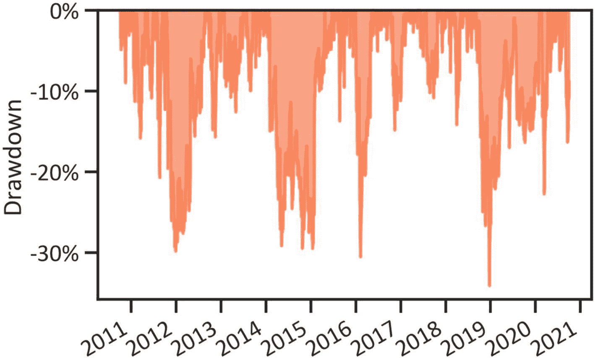
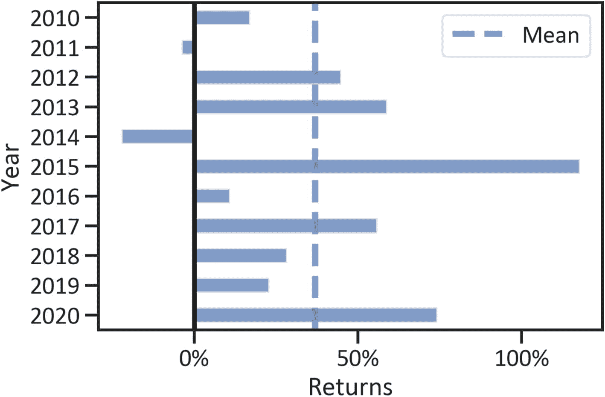
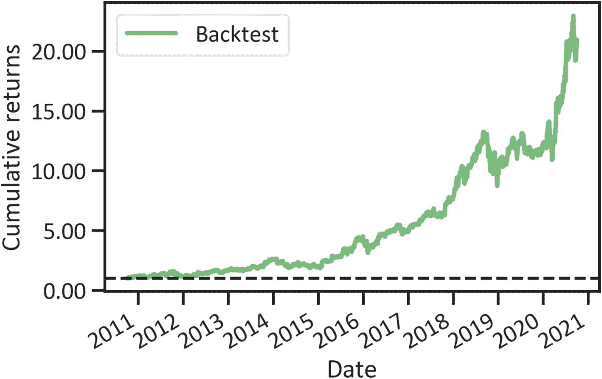
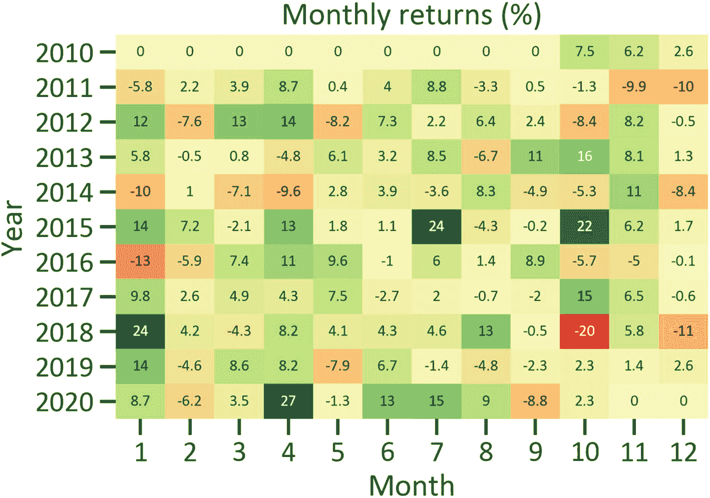
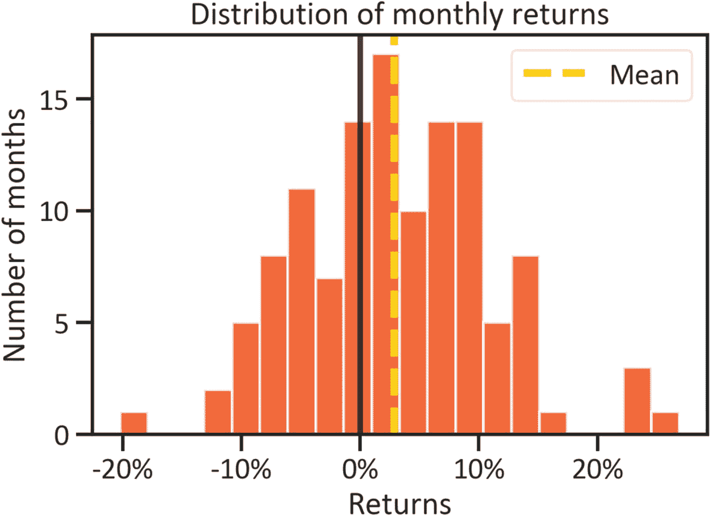

# 9. 投资组合与风险分析

本章通过涵盖投资组合与风险分析的完整框架来恰当地总结全书。至此，我们已经开发了多个用于稳健投资管理决策的机器学习模型和深度学习模型。贯穿全书，我们一直在提及投资涉及风险的市场。在本章中，我们将使用`Pyfolio`包介绍投资风险与绩效分析的基本概念。要在 Python 环境中安装`Pyfolio`，我们使用`pip install pyfolio`；在 conda 环境中，我们使用`conda install -c conda-forge pyfolio`。在安装`pyfolio`之前，请先安装`theano`。要在 conda 环境中安装`theano`，我们使用`conda install -c conda-forge theano`。

投资者通常投资某项资产，期望获得未来的财务回报。例如，一家公司购置工厂和机器设备，将原材料转化为可销售的产品，从而获得财务回报。投资者可投资的资产类别非常丰富。常见的资产类别包括股票、债券、权益、大宗商品、对冲基金、房地产和零售投资信托等。每种资产类别都有其自身的底层特征和以货币计量的可观价值。由于多种因素，资产的价值会随时间而变化。投资者必须持续监控并优化投资组合的表现。

## 投资风险分析

清晰理解与资产相关的风险，能够有效规划可能发生的不利市场状况。默认情况下，投资者只要在市场中建立头寸，无论其头寸方向如何，都会面临风险。当市场朝着不利于投资者头寸的方向变动时，他们就会遭受损失。管理损失是制定稳定且可行投资策略的关键。表 9-1 描述了基本的投资绩效指标。

**表 9-1** 基本投资绩效指标

| 指标 | 描述 |
| --- | --- |
| 风险价值 | 表示在特定概率水平下弥补损失所需的最低资本 |
| 回撤 | 表示资产遭受损失的速率 |
| 波动率 | 表示资产价格偏离真实均值的程度 |

## Pyfolio 实战

本章令人信服地展示了`Pyfolio`包，这是一个用于投资风险与绩效分析的强大工具。我们可以将此包与`Zipline`和`Quantopian`等其他互补包一起使用来回测投资策略。回测是指评估一个投资系统管理风险并创造回报的能力。它基于“过去的表现会影响未来的表现”这一理念。在本章中，我们将`Pyfolio`包作为一个独立包来使用。在使用之前，我们首先提取数据。代码清单 9-1 通过应用`get_data_yahoo()`方法从雅虎财经抓取市场数据。在本章中，亚马逊^(⁸) 的表现与标准普尔 500 指数^(⁹) 进行对标。亚马逊是一家总部位于美国的计算机巨擘，其股票作为标普 500 成分股进行交易。标普 500 指数是衡量美国 500 家上市公司业绩的股票指数。

```python
from pandas_datareader import data
import pyfolio as pf
ticker = 'AMZN'
start_day = '2010-10-01'
end_day = '2020-10-01'
amzn = data.get_data_yahoo(ticker, start_day, end_day)
spy = data.get_data_yahoo('SPY', start_day, end_day)
```
**代码清单 9-1** 抓取的数据

网络抓取后，我们执行必要的特征工程任务（参见代码清单 9-2）。

```python
amzn = amzn["Adj Close"].pct_change()[1:]
spy = spy["Adj Close"].pct_change()[1:]
```
**代码清单 9-2** 估算收益率

估算出每日收益率后，我们使用各种矩阵来测试亚马逊股票的表现。

### 绩效统计

`pyfolio`包使我们能够通过少量简单代码全面检验投资策略的基本表现。代码清单 9-3 列出了从 2010 年 11 月 1 日到 2020 年 11 月 2 日亚马逊股票的表现（参见表 9-2）。

**表 9-2** 绩效结果

| **起始日期** | 2010-10-04 |
| **结束日期** | 2020-10-01 |
| **总月数** | 119 |
| **回测** | |
| **年化收益率** | 35.6% |
| **累计收益率** | 1995.7% |
| **年化波动率** | 31.6% |
| **夏普比率** | 1.12 |
| **卡玛比率** | 1.04 |
| **稳定性** | 0.97 |
| **最大回撤** | -34.1% |
| **欧米伽比率** | 1.23 |
| **索提诺比率** | 1.71 |
| **偏度** | 0.42 |
| **峰度** | 7.53 |
| **尾端比率** | 1.07 |
| **每日风险价值** | -3.8% |
| **阿尔法** | 0.23 |
| **贝塔** | 1.02 |

```python
pf.show_perf_stats(amzn, spy)
```
**代码清单 9-3** 绩效结果

表 9-2 突出了投资者在交易亚马逊股票时所承担的风险。我们在分析中使用`SPY`股票指数作为基准。它表明年化收益率为 35.6%，累计收益率为 1995.7%。在风险方面，每日风险价值为 3.8%，最大回撤为-34.1%。观察投资绩效结果时，我们最感兴趣的是研究三个关键比率：卡玛比率、贝塔比率和夏普比率。我们同样关注阿尔法和贝塔。下面，我们将带您了解如何衡量这些比率。表 9-3 提供了上述关键绩效结果的高级概览。

**表 9-3** 关键绩效结果

| 指标 | 描述 |
| --- | --- |
| **卡玛比率** | 表示年化收益率除以最大回撤的估计值 |
| **贝塔比率** | 表示在精确的无风险收益率下，投资预期收益与市场预期收益之间差异的估计值 |
| **夏普比率** | 表示无风险利率与投资组合收益率之间差异的估计值 |
| **阿尔法** | 表示投资收益率相对于市场关键指数的估计值 |
| **贝塔** | 表示与投资相关的波动率的估计值 |

在下一节中，我们将研究随时间变化的水下最大回撤。

### 回撤

代码清单 9-4 应用`plot_drawdown_underwater()`方法来展示一项投资策略在 10 年内遭受损失的速率（见图 9-1）。



**图 9-1** 水下回撤图

```python
pf.plot_drawdown_underwater(amzn)
plt.show()
```
**代码清单 9-4** 投资组合回撤

图 9-1 推测，从 2010 年 11 月 1 日到 2020 年 11 月 2 日，亚马逊股票的回撤幅度在 0%至-30%之间。在 2019 年，它们间接经历了最大回撤；然而，在随后的年份中，它们迅速挽回了损失。


### 收益率

判断一项投资是否具有吸引力的最便捷方式就是研究其收益率。收益率反映了期初价格与期末价格的变化。

#### 年化收益率

年化收益率是指一项资产每年产生收益的比率。我们通过研究一段时期内的收益来做出预测。代码清单 9-5 应用 `plot_annual_returns()` 方法绘制了亚马逊股票 10 年间的年化收益率（见图 9-2）。



图 9-2

亚马逊年化收益率

```
pf.plot_annual_returns(amzn)
plt.show()
代码清单 9-5
年化收益率
```

图 9-2 显示，从 2010 年 11 月 1 日到 2020 年 11 月 2 日，亚马逊股票的年化收益率并不稳定。年化收益率存在波动。在 2014 年，该投资组合表现最差。然而，在接下来的一年里，年化收益率超过了 100%。

### 滚动收益率

代码清单 9-6 返回了 10 年间的回测累计收益率（见图 9-3）。与年化收益率不同，我们关注的是累计收益率。Pyfolio 通过评估当前收益率与先前收益率（代表投资获得的总收益）相对于股票成本的显著差异，来估算随时间变化的累计收益率。



图 9-3

滚动收益率

```
pf.plot_rolling_returns(amzn)
plt.show()
代码清单 9-6
滚动收益率
```

图 9-3 显示，从 2020 年 11 月 1 日起，累计收益率有明确的微小增幅。2016 年，开始出现一个势头渐强的上升趋势。

#### 月收益率

月收益率是指一项资产每月产生收益的比率。我们按月审视收益率，以识别历史行为，并谨慎地做出短期至中期的预测。代码清单 9-7 应用 `plot_monthly_returns_heatmap()` 方法绘制了亚马逊股票 10 年间的月收益率热力图（见图 9-4）。



图 9-4

月收益率热力图

```
pf.plot_monthly_returns_heatmap(amzn)
plt.show()
代码清单 9-7
月收益率热力图
```

图 9-4 显示，从 2010 年 11 月 1 日到 2020 年 11 月 2 日，亚马逊股票的月收益率并不稳定。在 2010 年的前九个月，收益率为零，这与 2020 年的最后两个月相同。这是因为我们提取了从 2010 年 11 月 1 日到 2020 年 11 月 2 日的数据。图 9-4 指出，收益率在 2020 年 4 月达到峰值（27%）。2018 年 10 月，该股票表现最差，月收益率为-20%。此外，从 2017 年到 2020 年，该股票显示出正收益，这与每年的第四个月情况相同。为了清晰起见，我们仔细检查了数据分布以总结月收益率。最常见的分布是正态分布。当实际值集中在真实均值附近时，数据服从正态分布。代码清单 9-8 应用 `plot_monthly_hist()` 方法绘制了亚马逊股票月收益率直方图（见图 9-5）。



图 9-5

月收益率直方图

```
pf.plot_monthly_returns_dist(amzn)
plt.show()
代码清单 9-8
月收益率直方图
```

实际的月收益率分布在均值周围。我们可以使用样本均值来充分概括这些数据。从 2010 年 11 月 1 日到 2020 年 11 月 2 日，亚马逊股票总体上呈现出长期的上升趋势。

## 结论

本章为本书的结尾章节，介绍了如何使用机器学习和深度学习来解决金融问题，特别是投资管理问题。它涵盖了使用名为 Pyfolio 的 Python 包客观分析投资组合表现的多重方法。首先，它讨论了风险的概念以及识别风险暴露的技术。最后，它涵盖了年化收益率和月收益率的估算。我们并不局限于本章所涉及的包。我们可以将这些包与 Zipline 和 Quantopian 一起使用来回测投资策略。


## 脚注

- `Activation function`
- `Adaptive movement estimation (Adam)`
- `Additive model`
  - 数据预处理
  - 预测模型
  - 季节性分解
- `Area under the curve (AUC)`
- `Augmented Dickey-Fuller (ADF) test`
- `Australian Securities and Investments Commission (ASIC)`
- `Autoregressive integrated moving average (ARIMA) model`
  - 定义
  - 开发预测
  - 超参数

