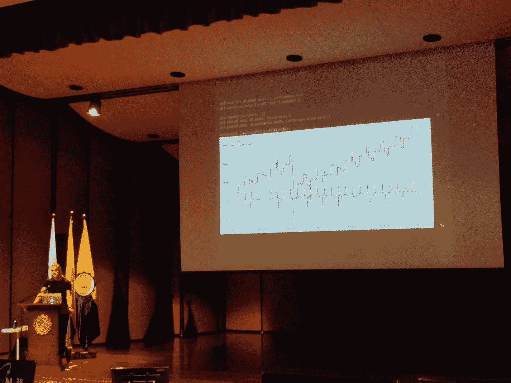

# 引言

本书关于 Python 和个人理财，以及如何将两者有效结合。它是一本速成指南，内容涉及如何处理数据、如何从零开始用代码构建财务公式，以及如何在日常生活中评估和思考金钱问题。

尽管每一章都由个人理财中的某个理念驱动，但本书并非该主题的详尽汇编。我尝试在每一章中提供足够的理论来引导你入门，同时有意识地抽象并隐藏了大量数学内容，以免我们陷入细节的泥潭。

如果我完全坦诚地对你（也对我自己）说，这本书是我写给`pandas`——Python 中主要的数据操作库——的一封情书。`pandas`是一个出色的工具，已成为许多（若非大多数）机器学习技术的基石。如果你精通`pandas`（这本书应该能帮到你！），你将能很好地为进入机器学习世界做好准备。但如果机器学习不是你的菜，别担心，我保证你仍然能从本书中获得很多价值。

本书的内容源于我 2018 年在哥伦比亚麦德林所做的一场名为“Personal Pynance”的演讲。为了让你享受阅读，它经过了改编、重构、扩展、延伸和打磨。希望你能喜欢！



*我！在哥伦比亚 Pycon 上做“Personal Pynance”演讲（摄影师：Moisés Vargas）*

## 本书涵盖内容

本书涵盖以下主题。

### 盈利

你将通过一个及时的激励性示例，探索花钱生财的理念。你将学习 DataFrames、在`pandas`中加载数据的基础知识、如何让 Python 与 Excel 良好协作、如何计算净现值和内部收益率，以及如何将函数应用于数据。

### 转换

你将学习如何使用 Python 进行货币转换。你将学习如何查询第三方 API、如何将 API 响应转换为可用格式、如何管理密钥、如何处理错误，以及如何创建 Python 类。

### 摊销

你将学习如何评估来自不同金融机构的多种贷款方案。你将学习如何使用`numpy`计算固定利率还款、如何从头构建还款计划表、如何构建循环，以及如何使这些循环变得超高效且快速。

### 预算

你将探索如何生成一份提供逐日现金流明细的预算。你将学习如何在 Python 中处理日期、如何可视化数据、如何使用`recurrent`库解析英语句子，以及如何使用 YAML 文件格式。

### 投资

你将探索如何构建一个投资组合再平衡器。你将学习如何实例化一个投资组合、如何获取股票报价、如何更新 DataFrame 中的值，以及如何模拟订单处理。

### 消费

你将探索如何预测支出。你将学习如何使用`pandas`和 Prophet，以及如何利用过去的数据生成未来的数值。这一章有点随意，但它为你提供了一个了解 Python 和`pandas`机器学习世界的小窗口。

## 本书读者对象

本书适合所有对 Python、个人理财或如何将两者结合感兴趣的人！它面向那些希望更好地理解如何更有效管理金钱的人，也面向那些只是想学习或提高 Python 技能的人。

尽管本书假设读者对编程和 Python 语言有一些（最低限度的）了解，但如果你完全没有基础，也别担心！所有内容都是一点一点构建起来的，前几章足够缓慢，可以让你开始入门。不需要金融背景知识。

## 阅读本书所需准备

为确保你能运行本书中的所有代码，建议你通过 Anaconda 安装 Python（3.6 或更新版本）。所有设置和配置详情可在第 1 章中找到。

## 代码示例

为了最大化本书的收益，在阅读过程中你应该在自己电脑上实际运行代码示例。运行代码、观察其工作原理并与之交互，将有助于你内化书中所呈现的所有内容。

你应该执行的代码如下所示：

```python
import pandas as pd
```

生成输出（如`print`语句、表格或图表）的代码及其输出将如下所示：

```python
ages = pd.DataFrame(data = {
'name': ['max', 'sunny'],
'age': [24, 22]
})
print (ages)
```

```
age   name
0       24    max
1       22  sunny
```

另一个输入-输出代码示例：

```python
print (ages['name'])
```

```
0          max
1        sunny
Name: name, dtype: object
```

## 读者反馈

欢迎随时提供反馈。请告诉我你对本书的看法——你喜欢的或可能不喜欢的方面。

如需提供一般性反馈，只需给我发送电子邮件，并在邮件主题中提及书名：

```
max.humber@gmail.com
```

### 关于作者与技术审校

### 关于作者

### 关于技术审校

脚注