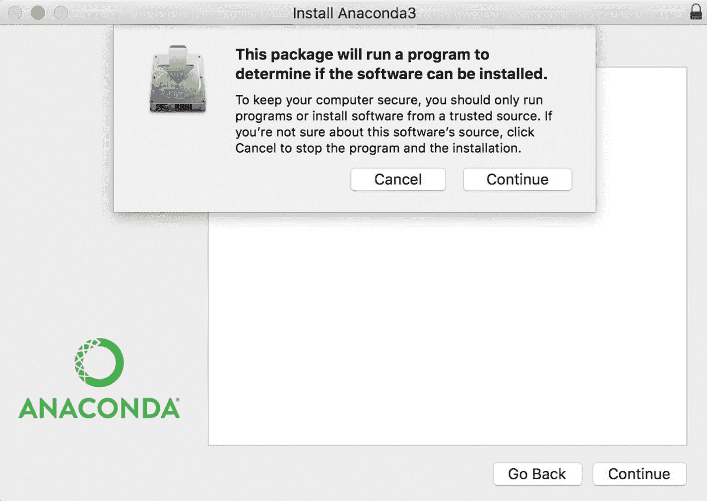
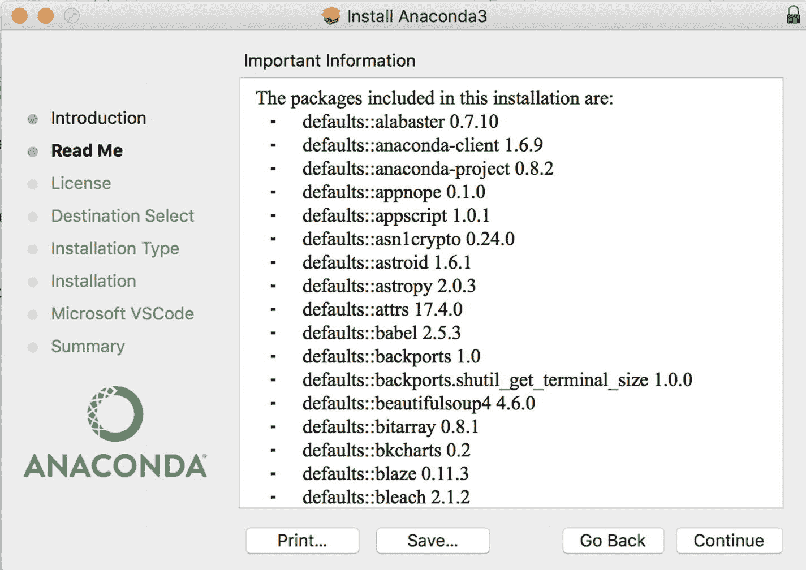
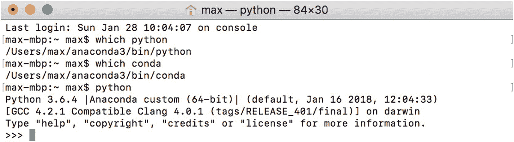
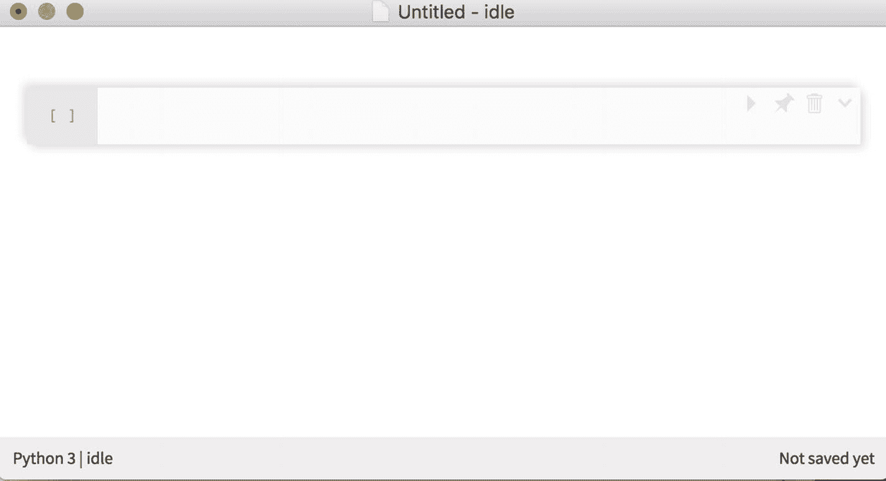
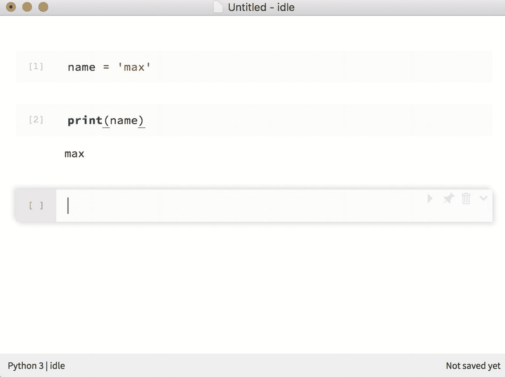

# 1. 环境设置

要运行本书中的代码示例，你需要安装 Python 3.6（或更新版本）、Jupyter，以及来自 Python 数据处理栈的一系列库。

## Anaconda

获取本书所需全部内容的最简单方法是安装 Anaconda。^(³) 只需访问 Anaconda 官网，下载适用于你操作系统的相应发行版即可。


Anaconda 适用于 Windows、macOS 和 Linux。我使用的是 macOS，因此将以此为例演示安装过程。

如果你使用的不是 macOS，Anaconda 官网上有非常优秀的安装文档可供参考。^(⁴)

下载发行版后，打开安装程序，按提示点击下一步即可。



Anaconda 会安装最新的 Python 3.6 及以上版本，以及一系列实用的 Python 包，例如 `pandas`、`numpy`^(⁵) 和 `beautifulsoup`。^(⁶)



安装完成后，打开终端（Terminal）——或你偏好的命令行界面——并运行 `$` 之后的所有命令，以确保 Anaconda 安装成功。



如果你的 Python 位于 `Users/<你的用户名>/anaconda3/bin/python` 路径下，并且输入 `python` 后显示类似 `Python 3.6.4 |Anaconda` 的信息，那么你已经万事俱备，只欠最后一步了……

## nteract

### 注意

如果你已经会使用 Jupyter Notebooks，这一步并非必须。不过，nteract 界面相当酷炫，值得一试！

要实际运行 Python 代码，你需要一个名为 nteract 的 Jupyter^(⁷) Notebook 界面。Jupyter 是一个开源的 Web 应用程序，允许你创建包含实时代码的文档（并已随 Anaconda 一同安装），而 nteract 则是 Jupyter 的一个基于桌面的超级用户友好型界面。你可以从 nteract.io 网站下载 nteract。^(⁸)


下载并安装后，点击 nteract 图标即可加载一个新的 Jupyter Notebook。你会看到一个类似这样的界面：



现在，你拥有了一块空白画布，可以在空单元格中运行任意的 Python 代码，运行结果将直接显示在输入单元格下方。



要执行单元格内的代码，只需按 `Shift+Enter`。要插入新单元格，选择“编辑 ➤ 新代码单元格”或使用快捷键 `Cmd+Shift+N`。你可以在 nteract 的 `USER_GUIDE.md` 中找到所有 macOS（及 Windows）快捷键的完整列表。^(⁹)

快速确认导入功能是否正常，请运行以下代码：

```python
import pandas as pd
```

如果一切正常，应该什么都不会发生！

但是，如果执行 `import pandas as pd` 后出现类似这样的错误：

```
ModuleNotFoundError           Traceback (most recent call last)
in ()
----> 1 import pandas as pd
ModuleNotFoundError: No module named 'pandas'
```

那么请重新安装 Anaconda，并确保你的 `PATH` 环境变量已正确配置。^(¹⁰)

### pip install

有时你会遇到一个合理的 `ModuleNotFoundError: No module named [包名]` 错误。这是因为你的机器上尚未安装该模块/库/包（我会互换使用这些术语）。通常可以通过在 Notebook 单元格中运行以下命令（或在终端中运行去除前导 `!` 的相同命令）来解决这些错误：

```bash
!pip install [包名]
```

我会尽力在需要时提醒你进行这些安装。但如果你遇到了 `ModuleNotFoundError`，我相信你知道该怎么做（谷歌是你的好朋友）！

## 数据

后续章节中的一些示例将用到我为本书专门整理的数据。你可以点击位于 [`www.apress.com/9781484238011`](http://www.apress.com/9781484238011) 的 **下载源代码** 按钮，或访问我位于 [`https://github.com/maxhumber/pfwp`](https://github.com/maxhumber/pfwp) 的个人 Github 仓库来下载这些数据文件。