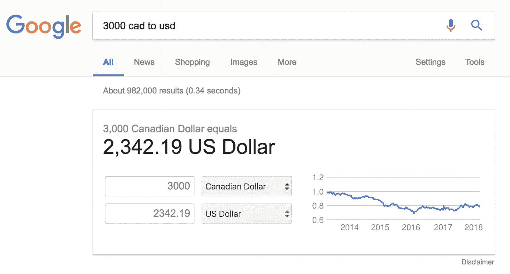

# 3. 转换

> 这些外国货币我数不清我赚了多少。
>
> —Yung Lean

你可能没有注意到，上一章中的所有数值都是加元。之所以全是加元，是因为我来自加拿大。

这让人困惑又恼火，对吧？加元是什么，它到底值多少钱？好吧，我不应该这么居高临下；你可能对加拿大元的价值有不错的概念，因为它与美元紧密挂钩。

但我们应该精确些。不能说加元“跟美元差不多”就完事了！我们得实际计算出确切的汇率。



虽然用谷歌搜索答案是完全可以的，但那没什么乐趣！而且，如果我们有成百上千个值需要转换成几种不同的货币，谷歌可能不是最佳解决方案。

面对重复性的问题，我很快就想到用 Python 来解决。

但不幸的是，在 Python 中进行转换，情况与 IRR 类似。这门语言*可以*做到，只是它自己做不到。

Python 需要一点帮助——以汇率 API 和 `requests`^(¹⁵) 库的形式提供的帮助。

你可以通过执行以下命令来安装 `requests`：

```
!pip install requests
```

## openexchangerates.org

如果我需要转换一堆数值，我喜欢使用 Open Exchange Rates API。

- 使用方便。

- 每小时更新超过 200 种货币的汇率。

- 免费（每月最多 1000 次请求）。

要跟着操作，请注册并获取免费 API 密钥^(¹⁶)。

