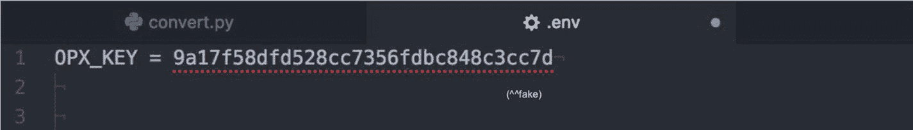
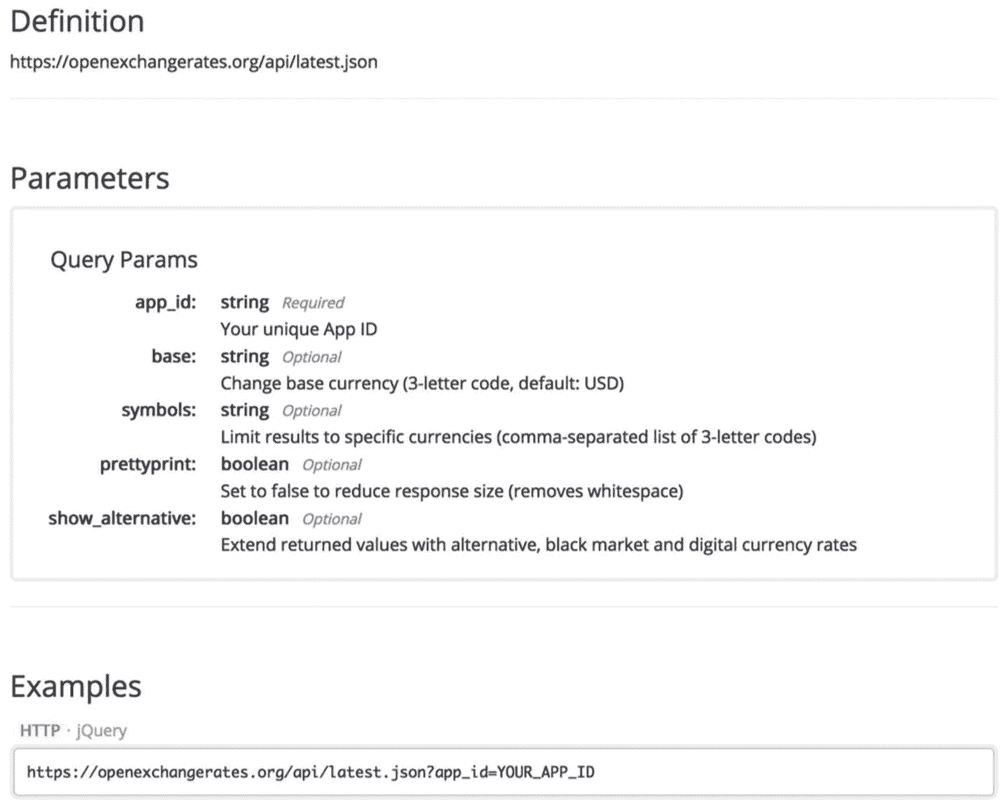

# 秘钥

注册后，你可以在 Open Exchange Rates 仪表盘中找到唯一的 API 密钥。你的密钥格式如下：

```
9a156a49bc84f849fde848
```

我们向 Open Exchange Rates API 发出的每个请求都需要附带此密钥；否则，我们将无法从该服务获取任何数据。

你可能想把密钥直接写进 Python 脚本或 Jupyter Notebook 中。请克制这种冲动！将密钥之类的**敏感信息**明文存放是一场灾难。一旦你与他人共享代码，他们就能获取你的密钥，并可能滥用它，导致你的密钥被列入黑名单。

要解决这个问题，我们必须对 API 密钥进行保密。Python 中有多种处理敏感信息的方式，其中一种方法是使用环境变量和 `dotenv` 库。

```
!pip install -U python-dotenv
```

使用 `dotenv`，你可以在脚本或 Jupyter Notebook 所在的目录/文件夹中创建并保存一个 `.env` 文件（使用 Atom、VS Code、TextEdit 或类似工具），然后将敏感信息放入其中。



定义完成后，你可以按照以下模式加载敏感信息。

```
import os
from dotenv import load_dotenv, find_dotenv
load_dotenv(find_dotenv())
API_KEY = os.environ.get('OPX_KEY')
print(API_KEY)
>>> 9a156a49bc84f8ce156a4749bc848
```

再次强调，你的密钥会不同。我的密钥是虚构的，所以别试了。

## 文档

在妥善隐藏密钥后，我们可以开始向 Open Exchange Rates API 发送请求。阅读 API 文档后，我们看到查询必须符合以下结构：



在浏览器中加载并将 URL 粘贴到搜索栏，将得到以下结果：

```
{
"disclaimer": "Usage subject to terms: https://openexchangerates.org/terms",
"license": "https://openexchangerates.org/license",
"timestamp": 1519588738,
"base": "USD",
"rates": {
"CAD": 1.303016,
"USD": 1
}
}
```

太棒了！我们成功获取了数据！

然而，手动将所有内容拼接成 URL 并非最佳或推荐的做法。

更好的方式（也更简单）是在 `requests` 库的基础上，将所有“查询参数”整理成一个参数载荷，如下所示：

```
import requests
API_KEY = os.environ.get('OPX_KEY')
r = requests.get(
'https://openexchangerates.org/api/latest.json',
params = {
'app_id': API_KEY,
'symbols': 'CAD,USD',
'show_alternative': 'true'
}
)
```

Open Exchange Rates 的响应现在将以 JSON 格式存储在 `r` 对象中，可通过以下方式访问：

```
rates_ = r.json()['rates']
rates_
{'CAD': 1.303016, 'USD': 1}
```

由于 `rates_` 只是一个字典，我们可以使用 `.get` 方法访问键值对，并根据公式进行一些换算。

```
symbol_from = 'CAD'
symbol_to = 'USD'
value = 3000
value * 1/rates_.get(symbol_from) * rates_.get(symbol_to)
2302.350853711697
```

你的数值可能会不同，因为汇率一直在变动。

## 封装

虽然我们刚刚成功地将加元兑换成了美元，但环境中充斥着大量变量，这很可能使我们的代码变得混乱。为了避免这种混乱的局面，我们应该将所有逻辑封装到一个 Python 类中。

```
class CurrencyConverter:
def __init__(self, symbols, API_KEY):
self.API_KEY = API_KEY
self.symbols = symbols
self._symbols = ','.join([str(s) for s in symbols])
r = requests.get(
'https://openexchangerates.org/api/latest.json',
params = {
'app_id': self.API_KEY,
'symbols': self._symbols,
'show_alternative': 'true'
}
)
self.rates_ = r.json()['rates']
self.rates_['USD'] = 1
def convert(self, value, symbol_from, symbol_to, round_output=True):
try:
x = (value
* 1/self.rates_.get(symbol_from)
* self.rates_.get(symbol_to))
if round_output:
return round(x, 2)
else:
return x
except TypeError:
print('不可用或无效的币种符号')
return None
```

你可以将 Python 中的类视为一种很好的方式，它能让所有代码保持在一起并更易读。

`CurrencyConverter` 类中的大部分内容应该都很熟悉。唯一新增的部分如下：

```
self._symbols = ','.join([str(s) for s in symbols])
```

这行代码将一个像 `['CAD', 'USD']` 这样的列表转换成 API 所需的逗号分隔格式，并在 `.convert` 方法（类中函数的名称）中添加了一些错误处理。

现在所有内容都在一个类中，我们可以这样实例化一个货币转换器：

```
API_KEY = os.environ.get("OPX_KEY")
c = CurrencyConverter(['CAD', 'USD'], API_KEY)
```

现在，换算数值只需使用 `.convert` 方法。

```
print(c.convert(3000, 'CAD', 'USD'))
print(c.convert(5000, 'USD', 'CAD'))
2302.35
6515.08
```

### show_alternative

Open Exchange Rates API 功能非常强大，它还包含对替代性加密货币的访问端点。这意味着我们可以在加元和美元的基础上，完全合法地使用 ETH（以太坊）、BTC（比特币）和 DOGE（狗狗币）来实例化一个新的 `CurrencyConverter`。

```
c = CurrencyConverter(['CAD', 'USD', 'DOGE', 'ETH', 'BTC'], API_KEY)
```

所有币种都存储在 `CurrencyConverter` 对象的一个字典中：

```
c.rates_
{'BTC': 0.00013350885,
'CAD': 1.303016,
'DOGE': 289.975486957,
'ETH': 0.0017451855,
'USD': 1}
```

我们可以再次运行 `.convert` 方法，发现 3,000 加元相当于：


```
c.convert(3000, 'CAD', 'DOGE')
667625.31
```

#### .apply

本章的全部意义在于将上一章中的值从加元转换为美元。有了一个可用的转换器，让我们加载挖矿收入数据并开始吧。

|     | date       | income | expenses | total |
| --- | ---------- | ------ | -------- | ----- |
| 0   | 2017-01-01 | 40     | -3000    | -2960 |
| 1   | 2017-01-25 | 40     | -50      | -10   |

| 2   | 2017-02-12 | 80     | -50      | 30    |
| 3   | 2017-02-14 | 100    | -30      | 70    |
| 4   | 2017-03-04 | 100    | -20      | 80    |
| 5   | 2017-04-23 | 160    | -30      | 130   |
| 6   | 2017-05-07 | 140    | -20      | 120   |
| 7   | 2017-05-21 | 140    | -40      | 100   |
| 8   | 2017-06-04 | 80     | -40      | 40    |
| 9   | 2017-06-19 | 180    | -30      | 150   |
| 10  | 2017-07-16 | 360    | -40      | 320   |
| 11  | 2017-08-27 | 160    | -30      | 130   |
| 12  | 2017-09-24 | 240    | -20      | 220   |
| 13  | 2017-10-21 | 420    | -50      | 370   |
| 14  | 2017-11-19 | 400    | -20      | 380   |
| 15  | 2017-12-03 | 340    | -40      | 300   |
| 16  | 2017-12-17 | 360    | -40      | 320   |
| 17  | 2017-12-31 | 540    | -40      | 500   |

```python
import pandas as pd
df = pd.read_excel('data/xirr.xlsx', sheet_name="irregular")
df['total'] = df.income + df.expenses
df
```

要一次性转换所有数据，我们只需使用一个匿名的 `lambda` 函数，并将我们的转换器嵌套在 `.apply` 调用中。

```python
df['total'].apply(lambda x: c.convert(x, 'CAD', 'USD'))
```

```
0    -2271.65
1       -7.67
2       23.02
3       53.72
4       61.40
5       99.77
6       92.09
7       76.75
8       30.70
9      115.12
10     245.58
11      99.77
12     168.84
13     283.96
14     291.63
15     230.24
16     245.58
17     383.73
Name: total, dtype: float64
```

如果我们借鉴 Xzibit 的做法（我无法获得原版表情包的版权，所以请接受这张 DIY 凑合图），我们可以将我们的狗狗币挖矿收入从加元转换回狗狗币。


```python
df['total'].apply(lambda x: c.convert(x, 'CAD', 'DOGE'))
```

```
0    -658723.64
1      -2225.42
2       6676.25
3      15577.92
4      17803.34
5      28930.43
6      26705.01
7      22254.18
8       8901.67
9      33381.27
10     71213.37
11     28930.43
12     48959.19
13     82340.45
14     84565.87
15     66762.53
16     71213.37
17    111270.88
Name: total, dtype: float64
```

## 结论

我们通过使用 Google 将加元转换为美元开始了这一章。在完成 Python 示例的过程中，您应该开始看到这门语言有多么强大。想象一下，如果试图在 Excel 中完成我们刚才所做的一切（我做不到！）。

脚注 1  2  3  4  5  6