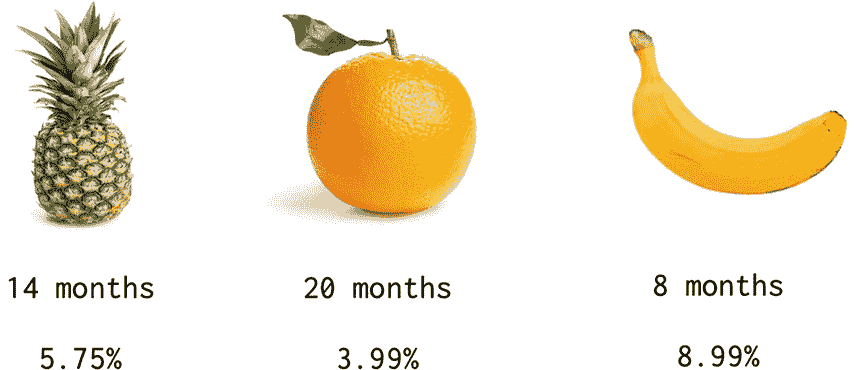
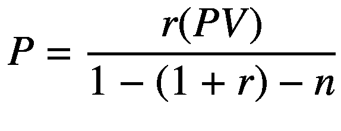

# 4. 摊销

> 是的，我收入不菲，且没有债务。
>
> ——Migos

我个人对债务有抵触情绪。似乎很多千禧一代也是如此。尽管我试图避免债务，但我明白，如果（并且当）使用得当，债务可以是一个了不起的工具。只是……大多数人并没有正确使用它。

在我看来，当你用债务购买那些无法帮助你摆脱债务的东西时，就是错误地使用了债务。度假就是一个很好的例子。然而，如果你借钱购买能够推动你前进并帮助你偿还债务的东西，债务可以变得非常强大。

前几章我们讨论了狗狗币挖矿。这个例子隐含了花钱赚钱的概念。该章节假设一台像样的挖矿设备大约需要 3000 加元（或者正如我们在上一章所了解的，大约 2341 美元）。大多数人手头并没有这么多流动资金。

如果你手头只有几百美元，那么狗狗币游戏就无从谈起，除非你决定举债。

（如果你已经对狗狗币感到厌倦，假装你需要 3000 美元买一台新笔记本电脑！）

快速免责声明：债务是一个极其复杂的话题。为了聚焦本书的范围，我们将只探讨个人贷款。

## 银行



在个人贷款的总利息金额方面，银行常常混淆细节。

假设我们需要 3000 美元来购买我们的狗狗币挖矿设备。我们货比三家，最终得到来自菠萝帝国银行、橙子国家银行和香蕉自治领银行的三个可行选择。

当然，我们的决定将取决于我们实际能负担的月还款额；不过，让我们暂时忽略这个限制，仅从总利息角度评估。

以下是这些选项：菠萝帝国银行提供 3000 美元，利率为 5.75%，期限 14 个月。橙子国家银行提供 3000 美元，利率为 3.99%，期限 20 个月。香蕉自治领银行准备以 8.99% 的利率借给我们所需金额，期限 8 个月。请注意，每家银行只列出了期限和利率。

如果贷款期限都相同，橙子国家银行无疑是最佳选择。但鉴于每个选项的期限不同，我们该如何选择呢？为了找出哪个选项的总利息成本最低，我们需要借助摊销计划表。

## 摊销

*摊销计划表* 是一个表格，详细列出了摊销贷款（如个人贷款）的每期还款额。*摊销* 指的是通过定期付款随时间偿还贷款的过程。对于摊销贷款，每笔还款的一部分用于支付利息，剩余部分则用于偿还本金余额。

## 还款额

由于这三个选项都是固定还款额的个人贷款，我们可以使用以下公式计算月还款额：



其中：

```
P = 还款额
PV = 现值（贷款金额）
r = 每期利率
n = 期数
```

如果我们从菠萝帝国银行贷款开始，我们可以使用以下代码块在 Python 中应用还款公式：

```python
loan = 3000.00
rate = 0.0575
term = 14
payment = loan * (rate / 12) / (1 - (1 + (rate / 12))**(-term))
print(round(payment, 2))
222.07
```

有几点需要注意。首先，双星号（`**`）是 Python 中表示乘方的符号。其次，我们将（利息）利率除以 12，因为大多数银行按月计息（一年有 12 个月）。

如果你不想记住摊销贷款的还款公式，NumPy 有一个方便的 `pmt` 函数可以帮你完成计算。

```python
import numpy as np
payment = np.round(-np.pmt(rate/12, term, loan), 2)
print(payment)
222.07
```