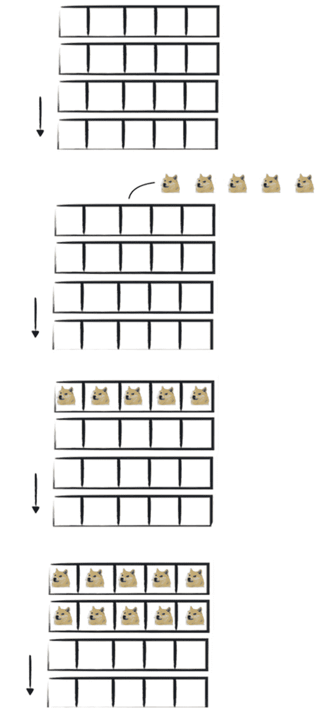
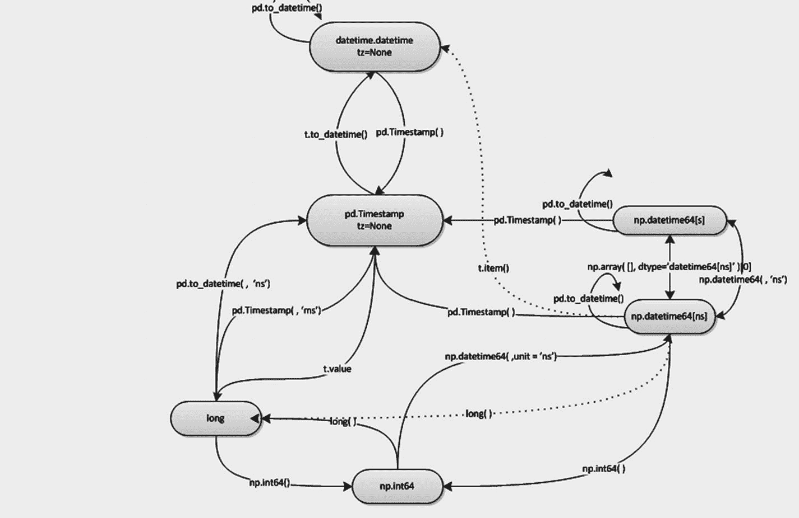
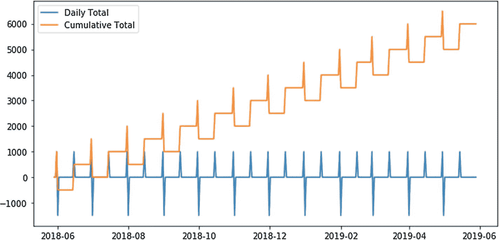
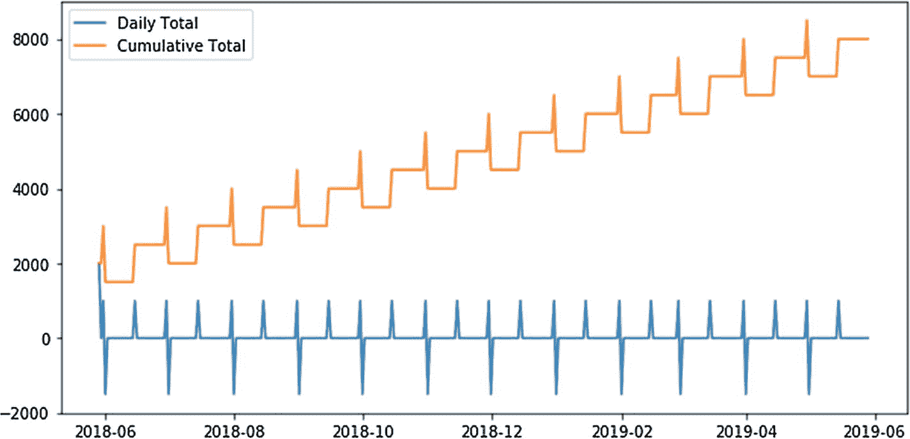
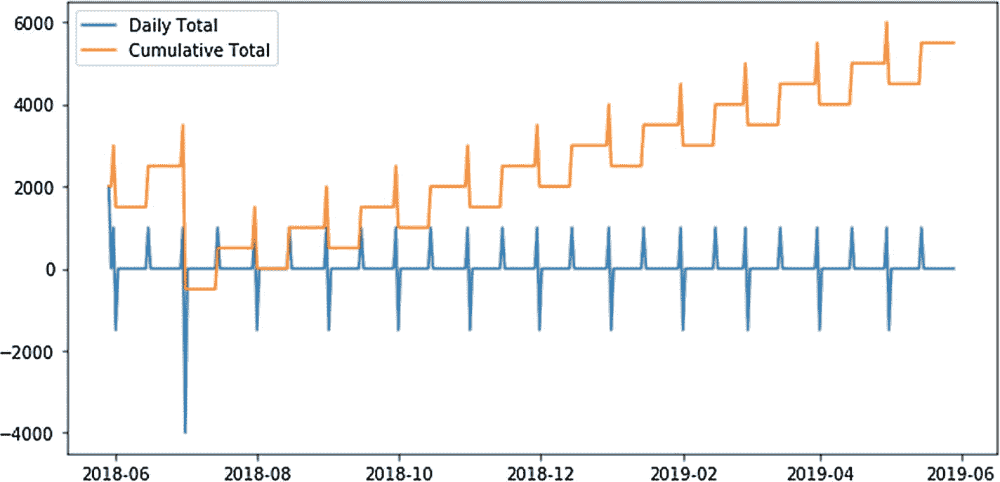
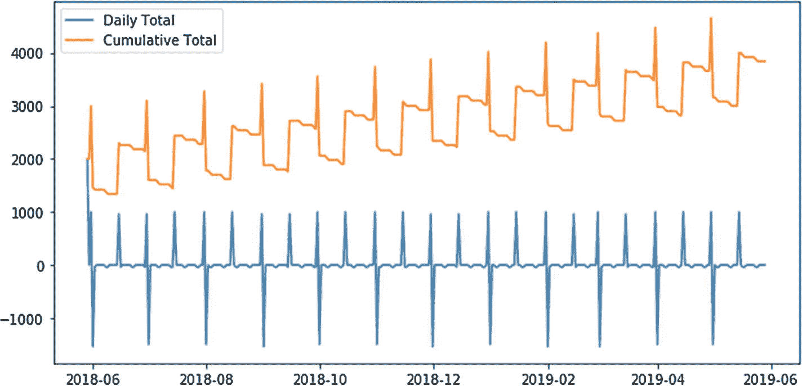
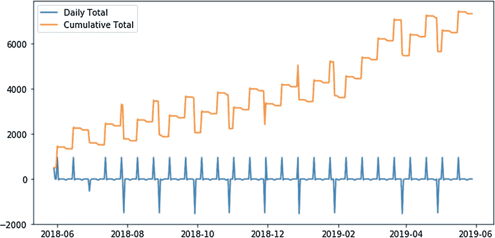

# 循环 A

计算出每期还款额后，我们就可以在 pandas DataFrame 的基础上构建一个还款计划表。首先，我们来实例化还款计划表的第一行。

```python
import pandas as pd
balance = loan
df = pd.DataFrame({
'month': [0],
'payment': [np.NaN],
'interest': [np.NaN],
'principal': [np.NaN],
'balance': [balance]
})
print(df)
balance  interest  month  payment  principal
0   3000.0       NaN      0      NaN        NaN
```

在第一行（索引为 0）中，`balance` 被设置为贷款总额，而利息、还款额和本金（剩余部分）则被设置为 `NaN`（非数字），因为贷款还款是在完整的一个月过后才开始计算。

实例化 DataFrame 之后，我们现在可以通过运行以下代码来计算第一期还款的利息和本金部分：

```python
interest = round(rate/12 * balance, 2)
principal = payment - interest
balance = balance - principal
print(interest)
print(principal)
print(balance)
14.38
207.69
2792.31
```

要按顺序对每一期还款执行这些计算，我们可以将此逻辑包装在一个循环中，并将计算出的值追加到已填充了第 0 个月数据的 `df` 对象中。

|   | month | payment | interest | principal | balance |
|---|-------|---------|----------|-----------|---------|
| 0 | 0     | NaN     | NaN      | NaN       | 3000.00 |
| 1 | 1     | 222.07  | 14.38    | 207.69    | 2792.31 |
| 2 | 2     | 222.07  | 13.38    | 208.69    | 2583.62 |
| 3 | 3     | 222.07  | 12.38    | 209.69    | 2373.93 |
| 4 | 4     | 222.07  | 11.38    | 210.69    | 2163.24 |
| 5 | 5     | 222.07  | 10.37    | 211.70    | 1951.54 |
| 6 | 6     | 222.07  | 9.35     | 212.72    | 1738.82 |
| 7 | 7     | 222.07  | 8.33     | 213.74    | 1525.08 |
| 8 | 8     | 222.07  | 7.31     | 214.76    | 1310.32 |
| 9 | 9     | 222.07  | 6.28     | 215.79    | 1094.53 |
| 10| 10    | 222.07  | 5.24     | 216.83    | 877.70  |
| 11| 11    | 222.07  | 4.21     | 217.86    | 659.84  |
| 12| 12    | 222.07  | 3.16     | 218.91    | 440.93  |
| 13| 13    | 222.07  | 2.11     | 219.96    | 220.97  |
| 14| 14    | 222.07  | 1.06     | 221.01    | -0.04   |

```python
balance = loan
for i in range(1, term + 1):
interest = round(rate/12 * balance, 2)
principal = payment - interest
balance = balance - principal
df = df.append(
pd.DataFrame({
'month': [i],
'payment': [payment],
'interest': [interest],
'principal': [principal],
'balance': [balance]
})
)
df = df.reset_index(drop=True)
df[['month', 'payment', 'interest', 'principal', 'balance']]
```

太好了，我们的摊销逻辑生效了！（最终余额与零相差几分钱，但这没关系，因为我们不得不将还款额四舍五入到两位小数，因为不存在几分钱的零头。）

尽管我们确实成功地在 Python 和 pandas 中构建了一个还款计划表，但我们使用的循环策略并非绝对高效。

我们刚才所做的，基本上看起来是这样的：


虽然当只需要循环处理少量项目时，逐行追加数据是可以的，但如果遇到几十万（甚至数百万）行数据时，操作速度会迅速变得极其缓慢。

## 循环 B

另一种（且更高效的）使用循环构建还款计划表的方法，是在开始迭代之前就构建好我们所需的所有行，而不是在运行时追加它们。

在一开始就构建好所有内容（或预分配空间），可以让我们获得相当可观的提速效果，过程大致如下：



有了预先构建好的所有行，我们基本上就是一边计算，一边用计算出的值填充这些行。

调整我们的代码以适应这种预分配模式相当简单。我们只需要构建一个包含 5 列和 15 行的空 DataFrame 即可（15 行是因为示例需要 14 个月加上第 0 个月）。

```python
balance = loan
index = range(0, term + 1)
columns = ['month', 'payment', 'interest', 'principal', 'balance']
df = pd.DataFrame(index=index, columns=columns)
```

实例化第一行可以通过 pandas 的 `.iloc` 方法来实现。

```python
df.iloc[0]['month'] = 0
df.iloc[0]['balance'] = balance
```

实际运行循环时，对每一列使用 `df.iloc[i][COLUMN]` 进行赋值。

我提前停止了循环，以便我们可以看到每一步发生的情况。

|   | month | payment | interest | principal | balance |
|---|-------|---------|----------|-----------|---------|
| 0 | 0     | NaN     | NaN      | NaN       | 3000    |
| 1 | 1     | 222.07  | 14.38    | 207.69    | 2792.31 |
| 2 | 2     | 222.07  | 13.38    | 208.69    | 2583.62 |
| 3 | 3     | 222.07  | 12.38    | 209.69    | 2373.93 |
| 4 | 4     | 222.07  | 11.38    | 210.69    | 2163.24 |
| 5 | 5     | 222.07  | 10.37    | 211.7     | 1951.54 |
| 6 | 6     | 222.07  | 9.35     | 212.72    | 1738.82 |
| 7 | 7     | 222.07  | 8.33     | 213.74    | 1525.08 |
| 8 | 8     | 222.07  | 7.31     | 214.76    | 1310.32 |
| 9 | 9     | 222.07  | 6.28     | 215.79    | 1094.53 |
| 10| 10    | 222.07  | 5.24     | 216.83    | 877.7   |
| 11| NaN   | NaN     | NaN      | NaN       | NaN     |
| 12| NaN   | NaN     | NaN      | NaN       | NaN     |


| 13| NaN   | NaN     | NaN      | NaN       | NaN     |
| 14| NaN   | NaN     | NaN      | NaN       | NaN     |

```python
for i in range(1, 11):
    interest = round(rate/12 * balance, 2)
    principal = payment - interest
    balance = balance - principal
    df.iloc[i]['month'] = i
    df.iloc[i]['payment'] = payment
    df.iloc[i]['interest'] = interest
    df.iloc[i]['principal'] = principal
    df.iloc[i]['balance'] = balance
df
```

在索引 10 处，贷款的剩余余额为 $877，我们还需要支付四期。如果没有在 `range(1, 11)` 处截断循环，还款计划表会一直运行到第 14 个月，并生成与之前相同的计划表。

## 函数化

现在我们完成了高效的摊销逻辑，让我们将代码封装到一个名为 `am` 的函数中。

```python
def am(loan, rate, term):
    payment = np.round(-np.pmt(rate/12, term, loan), 2)
    balance = loan
    index = range(0, term + 1)
    columns = ['month', 'payment', 'interest', 'principal', 'balance']
    df = pd.DataFrame(index=index, columns=columns)
    df.iloc[0]['month'] = 0
    df.iloc[0]['balance'] = balance
    for i in range(1, term + 1):
        interest = round(rate/12 * balance, 2)
        principal = payment - interest
        balance = balance - principal
        df.iloc[i]['month'] = i
        df.iloc[i]['payment'] = payment
        df.iloc[i]['interest'] = interest
        df.iloc[i]['principal'] = principal
        df.iloc[i]['balance'] = balance
    return df
```

## 评估

定义好 `am` 后，我们可以直接对菠萝帝国（5.75%，14 个月）、橙子国民（3.99%，20 个月）和香蕉领地（8.99%，8 个月）贷款运行函数，无需重复代码。

```python
loan = 3000
pineapple = am(loan, 0.0575, 14)
orange = am(loan, 0.0399, 20)
banana = am(loan, 0.0889, 8)
```

查看其中一份还款计划表，可以看到一切运行正常。

| 月份 | 还款额 | 利息 | 本金 | 余额 |
| --- | --- | --- | --- | --- |
| 0 | 0 | NaN | NaN | 3000 |
| 1 | 1 | 155.29 | 9.97 | 145.32 | 2854.68 |
| 2 | 2 | 155.29 | 9.49 | 145.8 | 2708.88 |
| 3 | 3 | 155.29 | 9.01 | 146.28 | 2562.6 |
| 4 | 4 | 155.29 | 8.52 | 146.77 | 2415.83 |
| 5 | 5 | 155.29 | 8.03 | 147.26 | 2268.57 |
| 6 | 6 | 155.29 | 7.54 | 147.75 | 2120.82 |
| 7 | 7 | 155.29 | 7.05 | 148.24 | 1972.58 |
| 8 | 8 | 155.29 | 6.56 | 148.73 | 1823.85 |
| 9 | 9 | 155.29 | 6.06 | 149.23 | 1674.62 |
| 10 | 10 | 155.29 | 5.57 | 149.72 | 1524.9 |
| 11 | 11 | 155.29 | 5.07 | 150.22 | 1374.68 |
| 12 | 12 | 155.29 | 4.57 | 150.72 | 1223.96 |
| 13 | 13 | 155.29 | 4.07 | 151.22 | 1072.74 |
| 14 | 14 | 155.29 | 3.57 | 151.72 | 921.02 |
| 15 | 15 | 155.29 | 3.06 | 152.23 | 768.79 |
| 16 | 16 | 155.29 | 2.56 | 152.73 | 616.06 |
| 17 | 17 | 155.29 | 2.05 | 153.24 | 462.82 |
| 18 | 18 | 155.29 | 1.54 | 153.75 | 309.07 |
| 19 | 19 | 155.29 | 1.03 | 154.26 | 154.81 |
| 20 | 20 | 155.29 | 0.51 | 154.78 | 0.03 |

```python
orange
```

由于每个对象都是 pandas DataFrame 中的摊销计划表，我们可以像这样访问利息列：

```python
banana['interest']
0      NaN
1    22.23
2    19.52
3    16.79
4    14.04
5    11.28
6     8.49
7     5.68
8     2.85
Name: interest, dtype: object
```

我们通过调用 `.sum()` 来计算总和。

```python
banana['interest'].sum()
100.88
```

我们汇总了每笔贷款的利息。

```python
print(banana['interest'].sum())
print(orange['interest'].sum())
print(pineapple['interest'].sum())
100.88
105.82999999999997
108.93999999999998
```

可以看到，香蕉领地银行的贷款是最划算的（如果划算指的是支付的利息最少）。

不过，需要注意的是，香蕉领地选项的每月还款额远高于橙子国民贷款。因此，我们可能会认为，为了最终减轻月度负担，多付 5 美元也是值得的！

## 结论

我曾随口提过，应尽可能预分配资源，并期望你无条件相信。永远不要轻信没有证据的说法！

如果你想了解循环 B 比循环 A 快多少，可以针对该函数运行一些 `%%timeit` Jupyter 魔法命令。

```python
%%timeit
am(3000, 0.0575, 14)
6.9 ms ± 877 μs per loop (mean ± std. dev. of 7 runs, 100 loops each)
```

可惜的是，我们从未将循环 A 的逻辑封装成函数。所以，就把它当作家庭作业吧！一旦你将循环 A 函数化，就可以对其运行同样的 `%%timeit` 魔法命令，亲自感受速度差异。

先用少量行数试试，再大幅增加行数。随着行数增加，速度差异会变得惊人！

### 预算

> 破产不是选项，现金流永远至上。
>
> ——A$AP Rocky

从记事起，我就一直痴迷于预算规划，最初用笔和纸，后来用 Excel，再后来用 R，现在用 Python。

虽然有一些优秀的在线工具可以帮助你制定预算，但我总觉得它们有所欠缺。虽然大多数预算应用在衡量月度收支方面表现出色，但我发现它们在情景规划或捕捉整体现金流状况方面并不特别出色。

当我制定预算时，我想知道每个时间点的银行余额，以便将更多资金用于储蓄，减少饮酒开销，或规划度假时间。

做预算时，必须记住现金流为王。如果在月内的任何时刻，你的预算显示支出超过实际可用资金，那么月底是否平衡就无关紧要了。每一天都必须平衡。

## 日期

要制定预算，我们必须处理日期。不幸的是，在 Python 中处理日期有点麻烦。Python 中常用的日期/时间格式有效有六种，但要让每种格式协调工作很棘手，需要进行一些转换。

这是 StackOverflow^(²¹) 上 2014 年发布的一张精彩的“现状”图（遗憾的是，四年后情况变化不大）：



全面讨论日期格式超出了本书的范围；不过，我将强制执行两条规则，这将大大简化我们的工作，并帮助我们避开在 Python 中处理日期的大多数固有问题。

以下是我的两条规则：

* 将所有内容强制转换为 `Timestamp`。


* 对所有内容调用`.normalize`。

### datetime

Python 自带`datetime`。因此，我们可以直接创建`datetime.datetime`对象和`datetime.date`对象，如下所示：

```python
import datetime
date_1 = datetime.datetime.now()
print(date_1)
print(date_1.__repr__())
print(type(date_1))
date_2 = datetime.date.today()
print(date_2)
print(date_2.__repr__())
print(type(date_2))
2018-05-29 21:34:10.877373
datetime.datetime(2018, 5, 29, 21, 34, 10, 877373)
2018-05-29
datetime.date(2018, 5, 29)
```

`datetime.date`和`datetime.datetime`对象也可以手动创建，按照以下模式填写每个对象：`(year, month, day, hour, minute, second, millisecond)`。

```python
datetime.datetime(1993, 6, 7, 15, 16, 0)
datetime.datetime(1993, 6, 7, 15, 16)
```

## Timestamp

pandas 提供了`Timestamp`类型，其行为在很大程度上类似于`datetime.datetime`对象，但与 DataFrame 和 DatetimeIndex（我们将在本章后面使用）配合良好。此外，`Timestamp`还附带了一些非常实用的功能（即`.normalize`）。

要将`datetime.datetime`或`datetime.date`对象转换为`Timestamp`，我们可以使用`to_datetime`函数，或者直接将对象包装在`Timestamp`中。两种方法都有效。

```python
import pandas as pd
print(pd.Timestamp(date_1))
print(pd.to_datetime(date_1))
2018-05-29 21:34:10.877373
2018-05-29 21:34:10.877373
```

更重要的是，我们可以像创建`datetime.datetime()`那样，通过手动填写函数参数来从头创建`Timestamp`。

```python
date_3 = pd.Timestamp(1993, 6, 7, 15, 16, 0)
date_3
Timestamp('1993-06-07 15:16:00')
```

#### .normalize

在日期时间上下文中，归一化意味着剥离所有时间信息，只保留日期部分附加到对象上。如果所有内容都是`Timestamp`类型，这很简单：

```python
print(date_1)
date_1 = pd.Timestamp(date_1)
print(date_1)
print(date_1.normalize())
2018-05-29 21:34:10.877373
2018-05-29 21:34:10.877373
2018-05-29 00:00:00
```

如你所见，`.normalize`方法将时间元数据设置为 00:00:00，这有助于我们稍后将各部分粘合在一起。

## 时间跨度

要制定预算，我们需要确定一个时间跨度。我倾向于将所有内容限定在一年内，因为说实话，预测更远的未来是徒劳的。

在本章的剩余部分，我将引用这里定义的全局变量，因此请确保运行以下代码：

```python
TODAY = pd.Timestamp('today').normalize()
print(TODAY)
END = TODAY + datetime.timedelta(days=365)
print(END)
2018-05-29 00:00:00
2019-05-29 00:00:00
```

请随意调整`TODAY`（起始）和`END`变量以满足你的需求。^(²²)

请务必记得对所有内容使用`.normalize()`！否则，当你跟着所有示例操作时，你会碰得头破血流。

在定义好起始和结束日期后，我们可以用 pandas 创建一个空的日历对象，它利用由`date_range`函数创建的`DatetimeIndex`。

```python
calendar = pd.DataFrame(index=pd.date_range(start=TODAY, end=END))
```

通过`.head()`查看`DataFrame`对象的内部，我们可以看到有一系列按天递增的日期。

```python
print(calendar.head())
Empty DataFrame
Columns: []
Index: [2018-05-29 00:00:00, 2018-05-30 00:00:00, 2018-05-31 00:00:00, 2018-06-01 00:00:00, 2018-06-02 00:00:00]
```

`pd.date_range()`函数非常灵活。它可以通过向`freq`参数传递偏移别名^(²³) 来接受不同的日期增量。

在预算制定中非常实用的两个偏移别名是`SM`和`MS`。前者是“半月末频率（15 号和月末）”的别名，非常适合处理收入这类情况；后者是“月初频率”的别名，对于房租这类支出很有用。

## 现金流

以下是一些如何使用偏移别名的示例：

```python
# 半月末频率（15 号和月末）
print('Semi-month End:')
sm = pd.date_range(start=TODAY, end=END, freq="SM")
print(sm)
print('\n')
## 月初频率
print('Month Start:')
ms = pd.date_range(start=TODAY, end=END, freq="MS")
print(ms)
Semi-month End:
DatetimeIndex(['2018-05-31', '2018-06-15', '2018-06-30', '2018-07-15',
'2018-07-31', '2018-08-15', '2018-08-31', '2018-09-15',
'2018-09-30', '2018-10-15', '2018-10-31', '2018-11-15',
'2018-11-30', '2018-12-15', '2018-12-31', '2019-01-15',
'2019-01-31', '2019-02-15', '2019-02-28', '2019-03-15',
'2019-03-31', '2019-04-15', '2019-04-30', '2019-05-15'],
dtype='datetime64[ns]', freq='SM-15')
Month Start:
DatetimeIndex(['2018-06-01', '2018-07-01', '2018-08-01', '2018-09-01',
'2018-10-01', '2018-11-01', '2018-12-01', '2019-01-01',
'2019-02-01', '2019-03-01', '2019-04-01', '2019-05-01'],
dtype='datetime64[ns]', freq="MS")
```

如果我们想将收入（例如，每月 1000 美元，分两次发放）映射到日历对象上，我们可以创建一个新的 DataFrame，其索引跨越全年，并且`freq='SM'`。

```python
income = pd.DataFrame(
    data={'income': 1000},
    index=pd.date_range(start=TODAY, end=END, freq="SM")
)
print(income.head())
income
2018-05-31    1000
2018-06-15    1000
2018-06-30    1000
2018-07-15    1000
2018-07-31    1000
```

类似地，对于房租（例如，每月 1500 美元），我们可以将 DataFrame 包装在`DatetimeIndex`（由便捷的`date_range`函数创建）周围，并设置`freq='MS'`。

```python
rent = pd.DataFrame(
    data={'rent': -1500},
    index=pd.date_range(start=TODAY, end=END, freq="MS")
)
print(rent.head())
rent
2018-06-01 -1500
2018-07-01 -1500
2018-08-01 -1500
2018-09-01 -1500
2018-10-01 -1500
```

现在我们有了一个包含全年每一天的空日历对象，以及两个“现金流”对象（`income` 和 `rent`），我们可以使用 `pd.concat()` 将这些 DataFrame 拼接起来。如果你的 `Timestamp` 没有归一化，这将无法正常工作。

|   | income | rent |
|---|---|---|
| 2018-05-29 | 0.0 | 0.0 |
| 2018-05-30 | 0.0 | 0.0 |
| 2018-05-31 | 1000.0 | 0.0 |
| 2018-06-01 | 0.0 | -1500.0 |
| 2018-06-02 | 0.0 | 0.0 |

```python
calendar = pd.concat([calendar, income], axis=1).fillna(0)
calendar = pd.concat([calendar, rent], axis=1).fillna(0)
calendar.head(5)
```

请注意以下几点：

*   在 `pd.concat()` 中将 `axis` 设置为 `1`，是为了告诉 pandas 我们希望沿着列轴进行拼接（连接）。

*   每次连接操作后都会调用 `.fillna(0)` 方法，以将 NaN 值填充为 0。（因为我们每月第一天支付房租，所以在索引为 `2018-XX-02` 处的房租单元格会是 NaN 值。）

使用 `.loc`（pandas 中基于标签位置索引的方法）查看这个“已填充”的 `calendar` 对象的内部，我们可以看到连接成功了！

|   | income | rent |
|---|---|---|
| 2019-01-30 | 0.0 | 0.0 |
| 2019-01-31 | 1000.0 | 0.0 |
| 2019-02-01 | 0.0 | -1500.0 |
| 2019-02-02 | 0.0 | 0.0 |

```python
calendar.loc[
    (calendar.index >= '2019-01-30') &
    (calendar.index <= '2019-02-02')
]
```

## 总计

现在，要全面了解每个时间点的现金流，我们只需汇总每天的 `income` 和 `rent` 列，并使用 `cumsum()` 计算累计总和。

|   | income | rent | total | cum_total |
|---|---|---|---|---|
| 2019-05-29 | 0.0 | 0.0 | 0.0 | 6000.0 |

```python
calendar['total'] = calendar.sum(axis=1)
calendar['cum_total'] = calendar['total'].cumsum()
calendar.tail(1)
```

对 `calendar` 对象运行 `.tail()` 方法，我们可以看到到年底时我们预计会在银行里有 6000 美元。太棒了！然而，我们还不能庆祝，因为预算中隐藏着一个问题，通过绘制图表就能发现。

## 可视化

在我们的 `total` 和 `cum_total` 列上运行一些基础 matplotlib 代码，会得到以下结果：



```python
from matplotlib import pyplot as plt
%matplotlib inline
plt.figure(figsize=(10, 5))
plt.plot(calendar.index, calendar.total, label='Daily Total')
plt.plot(calendar.index, calendar.cum_total, label='Cumulative Total')
plt.legend()
```

尽管我们的预算显示到年底银行里会有 6000 美元，但在年初的某个时刻，由于我们的房租支出与收入进账的时间错配，我们将被迫透支。同样，你的图表可能会因起始日期不同而有所差异。

### 更新

由于我们处理的是一个玩具示例，只需对问题“点石成金”，在起始银行账户余额上增加 2000 美元即可（要是生活真这么简单就好了）。

```python
bank = pd.DataFrame(
data={'bank': 2000},
index=pd.date_range(start=TODAY, end=TODAY)
)
print(bank)
bank
2018-05-29  2000
calendar = pd.concat([calendar, bank], axis=1).fillna(0)
```

问题应该就此解决了！现在我们必须重新计算总额。

遗憾的是，还有另一个问题。如果对整个 DataFrame 执行 `.sum`，它将把总额加到总额上，导致每日数值变得混乱。

```python
calendar.sum(axis=1).head()
2018-05-29    2000.0
2018-05-30       0.0
2018-05-31    3000.0
2018-06-01   -3500.0
2018-06-02    -500.0
Freq: D, dtype: float64
```

要防止这种情况发生，我们可以删除 `total` 和 `cum_total` 列，或者将它们设置为零。

我将演示第一种方法。而且，由于我们还要重复执行几次这个操作，将逻辑封装在一个函数里应该更合理。

```python
def update_totals(df):
    # 检查这些列是否存在于数据框中
    if df.columns.isin(['total', 'cum_total']).any():
        # 如果存在，则将它们设为 0
        df['total'] = 0
        df['cum_total'] = 0
    # 重新计算 total 和 cumulative_total
    df['total'] = df.sum(axis=1)
    df['cum_total'] = df['total'].cumsum()
    return df
```

### 注意

DataFrame 的行为有点像列表/集合/字典，因此我们可以通过简单的 `in` 调用来检查列成员关系。

|   | income | rent | total | cum_total | bank |
|---|---|---|---|---|---|
| 2019-05-29 | 0.0 | 0.0 | 0.0 | 8000.0 | 0.0 |

```python
calendar = update_totals(calendar)
calendar.tail(1)
```

太棒了！现在我们打算在年底结余 8000 美元。

让我们再次绘制 `calendar` 对象，以确保全年保持正数。同时，我们不妨也将绘图逻辑封装到一个函数中。



```python
def plot_budget(df):
    plt.figure(figsize=(10, 5))
    plt.plot(df.index, df.total, label='每日总额')
    plt.plot(df.index, df.cum_total, label='累计总额')
    plt.legend()
plot_budget(calendar)
```

问题解决了！我们的现金流为正，总额也不再异常了。

## 假期一

鉴于我们现金流为正，全年呈上升趋势，我们去度假吧！你觉得七月初（或者从 `TODAY` 日期起两个月后）花 2500 美元去哥伦比亚旅行怎么样？我觉得不错！我们可以像添加租金或收入一样，将假期添加到预算中。



```python
vacation = pd.DataFrame(
    data={'vacation': -2500},
    index=[pd.Timestamp('2018-07-01').normalize()]
)
print(vacation)
vacation
2018-07-01     -2500
calendar = pd.concat([calendar, vacation], axis=1).fillna(0)
calendar = update_totals(calendar)
plot_budget(calendar)
```

哇哦。等等。如果我们在七月份花掉 2500 美元，我们的资金将血本无归。

我认为我们应该把想象中的假期推迟几个月，或者想办法用极少的预算完成哥伦比亚之旅。

目前，我们先去掉假期，考虑一些更“紧迫”的问题。

```
calendar = calendar.drop('vacation', axis=1)
```

## 自然语言

现金流并不规律。我们可能有一些在特定日期发生的开支，或者按越来越奇怪的周期收到薪酬。如果能用纯自然语言定义这些频率，而不必依赖 pandas 的偏移量别名，那就太好了。

幸运的是，有一个名为 `Recurrent`^(²⁴) 的优秀库，可以帮我们完成大部分繁重的解析工作。

例如，我们可以用自然语言定义任意频率。

```
frequency = 'every week until July 10th' # 尝试几种不同的月-日组合！
```

然后，我们从 `recurrent` 导入 `RecurringEvent` 类。

```
!pip install recurrent
from recurrent import RecurringEvent
```

接着，使用 `.parse` 方法进行解析。

```
r = RecurringEvent()
r.parse(frequency)
'RRULE:INTERVAL=1;FREQ=WEEKLY;UNTIL=20180710'
```

`.parse` 将允许我们生成符合 iCalendar RFC^(²⁵) 标准的重复规则（称为 *rrule*）。相应的 rrule 使我们能够执行许多酷炫的操作，例如检查任意日期之前或之后的第一次出现、计算事件在给定时间范围内发生的次数，或者，对我们而言，生成日期计划表。

为了处理 rrule，我们需要再导入一个库。

```
from dateutil import rrule
```

将来自我们的 `RecurringEvent` 的 `RFC` rrule 字符串传递给 `rrule.rrulestr`，将创建我们所需的 rrule 对象。

```
rr = rrule.rrulestr(r.get_RFC_rrule())
rr
```

现在，“every week until July 10th”已被转换为一个 rrule，我们可以生成从今天到一年后之间所有可能发生的日期。

```
rr.between(TODAY, END)
[datetime.datetime(2018, 5, 29, 21, 38, 42),
datetime.datetime(2018, 6, 5, 21, 38, 42),
datetime.datetime(2018, 6, 12, 21, 38, 42),
datetime.datetime(2018, 6, 19, 21, 38, 42),
datetime.datetime(2018, 6, 26, 21, 38, 42),
datetime.datetime(2018, 7, 3, 21, 38, 42)]
```

我认为这个输出非常令人印象深刻。然而，`.between` 方法破坏了本章开头设定的两条日期规则。

输出的类型不是 `Timestamp`，而且数值没有标准化。让我们通过列表推导式同时解决这两个问题。

```
[pd.to_datetime(date).normalize() for date in rr.between(TODAY, END)]
[Timestamp('2018-05-29 00:00:00'),
Timestamp('2018-06-05 00:00:00'),
Timestamp('2018-06-12 00:00:00'),
Timestamp('2018-06-19 00:00:00'),
Timestamp('2018-06-26 00:00:00'),
Timestamp('2018-07-03 00:00:00')]
```

### get_dates

现在，我们可以围绕这些日期创建一个 `DatetimeIndex`，并将它们放入 `DataFrame` 对象中。但在此之前，让我们创建一个 `get_dates` 函数，该函数输出一个类型为 `Timestamp` 的标准化日期列表，并且能够处理原始日期（例如“2018-06-07”）和自然语言（例如“every week until July 10th”）：

```
def get_dates(frequency):
    # 先让 pandas 尝试处理单个日期
    try:
        return [pd.Timestamp(frequency).normalize()]
    except ValueError:
        pass
    # 使用 recurrent 解析频率
    try:
        r = RecurringEvent()
        r.parse(frequency)
        rr = rrule.rrulestr(r.get_RFC_rrule())
        return [
            pd.to_datetime(date).normalize()
            for date in rr.between(TODAY, END)
        ]
    except ValueError as e:
        raise ValueError('无效的频率')
```

该函数中的逻辑与我们之前执行的操作基本相同；不过，我添加了一些额外的错误处理，遵循“请求原谅而非许可”^(²⁶)的模式，先尝试让 `pd.Timestamp` 处理原始日期，然后退而求其次使用 `Recurrent` 库的 `.parse` 方法。

让我们试试这个新函数。

```
get_dates('2019-01-01')
[Timestamp('2019-01-01 00:00:00')]
get_dates('every week until July 10th')
[Timestamp('2018-05-29 00:00:00'),
Timestamp('2018-06-05 00:00:00'),
Timestamp('2018-06-12 00:00:00'),
Timestamp('2018-06-19 00:00:00'),
Timestamp('2018-06-26 00:00:00'),
Timestamp('2018-07-03 00:00:00')]
get_dates('this will not work')

ValueError                    Traceback (most recent call last)
in get_dates(frequency)
        10         r.parse(frequency)
---> 11         rr = rrule.rrulestr(r.get_RFC_rrule())
        12         return [pd.to_datetime(date).normalize() for date in rr.between(TODAY, END)]
ValueError: not enough values to unpack (expected 2, got 1)
in get_dates(frequency)
        12         return [
        13              pd.to_datetime(date).normalize()
        14              for date in rr.between(TODAY, END)
        15         ]
        16     except ValueError as e:
---> 17         raise ValueError('无效的频率')
ValueError: 无效的频率
```

一切似乎都运行正常！

## 乐趣

我们的预算目前还相当简陋。说实话，完全按预算生活并没有带来多少乐趣。在这个小例子中，我们工作（为了产生收入）来支付房租，嗯，差不多就这样。而且，我们不得不取消一次度假，因为我们负担不起。

在本节中，让我们通过安排一些夜生活（每周五和周六各 `$40`）来改善我们这惨淡的虚构生活。

```
dates = get_dates('every week on Friday and Saturday')
dates[:10] # first ten instances of the recurrance rule
[Timestamp('2018-06-01 00:00:00'),
Timestamp('2018-06-02 00:00:00'),
Timestamp('2018-06-08 00:00:00'),
Timestamp('2018-06-09 00:00:00'),
Timestamp('2018-06-15 00:00:00'),
Timestamp('2018-06-16 00:00:00'),
Timestamp('2018-06-22 00:00:00'),
Timestamp('2018-06-23 00:00:00'),
Timestamp('2018-06-29 00:00:00'),
Timestamp('2018-06-30 00:00:00')]
```

要将这些日期封装成一个 `DataFrame` 对象，我们必须把这个列表转换成 `DatetimeIndex` 对象。唯一的问题是 `pd.DatetimeIndex` 只接受 pandas 的 `Series`。但实际上这根本不是问题！

```
pd.Series(dates).head()
0   2018-06-01
1   2018-06-02
2   2018-06-08
3   2018-06-09
4   2018-06-15
dtype: datetime64[ns]
pd.DatetimeIndex(pd.Series(dates))
DatetimeIndex(['2018-06-01', '2018-06-02', '2018-06-08', '2018-06-09',
'2018-06-15', '2018-06-16', '2018-06-22', '2018-06-23',
'2018-06-29', '2018-06-30',
...
'2019-04-26', '2019-04-27', '2019-05-03', '2019-05-04',
'2019-05-10', '2019-05-11', '2019-05-17', '2019-05-18',
'2019-05-24', '2019-05-25'],
dtype='datetime64[ns]', length=104, freq=None)
```

如果我们将 `Timestamp` 列表包装进一个 `Series`，再放进 `DatetimeIndex`，那么我们就可以沿用贯穿全书的基本模式。

```
dates = get_dates('every week on Friday and Saturday')
fun = pd.DataFrame(
    data={'fun': -40},
    index=pd.DatetimeIndex(pd.Series(dates))
)
print(fun.head())
fun
2018-06-01  -40
2018-06-02  -40
2018-06-08  -40
2018-06-09  -40
2018-06-15  -40
```

将这个 `fun` 对象拼接到我们的 `calendar` 对象上易如反掌。



```
calendar = pd.concat([calendar, fun], axis=1).fillna(0)
calendar = update_totals(calendar)
plot_budget(calendar)
```

|   | income | rent | total | cum_total | bank | fun |
|---|--------|------|-------|-----------|------|-----|
| 2019-05-25 | 0.0 | 0.0 | -40.0 | 3840.0 | 0.0 | -40.0 |
| 2019-05-26 | 0.0 | 0.0 | 0.0 | 3840.0 | 0.0 | 0.0 |
| 2019-05-27 | 0.0 | 0.0 | 0.0 | 3840.0 | 0.0 | 0.0 |
| 2019-05-28 | 0.0 | 0.0 | 0.0 | 3840.0 | 0.0 | 0.0 |
| 2019-05-29 | 0.0 | 0.0 | 0.0 | 3840.0 | 0.0 | 0.0 |

```
calendar.tail()
```

看来我们的预算还能承受得起一点周末的乐趣！

## YAML

尽管目前为止一切顺利，但向预算中添加新的支出/收入项仍是一个相当繁琐的过程。我们需要先生成 `DataFrame` 对象，然后拼接到主 `calendar` 对象上，最后更新总额。如果能一次性定义所有预算项目，并且只计算一次总额，那就太好了。

YAML 来救场了！YAML 是一种类似于 JSON 但更具人类可读性的文件格式。我们可以将所有预算项目整理到一个 YAML 文件中，像这样：

> **注意：** `PyYAML` 应该随 Anaconda 一起安装了。如果没有，请尝试以下命令：`!pip install pyyaml`

```
import yaml
budget = yaml.load('''
bank:
  frequency: today
  amount: 2000
income:
  frequency: every 2 weeks on Friday
  amount: 1000
rent:
  frequency: every month
  amount: -1500
fun:
  frequency: every week on Friday and Saturday
  amount: -40
''')
```

运行 `yaml.load` 后，这会将所有内容转换成 Python 的 `dict`。

```
budget
{'bank': {'amount': 2000, 'frequency': 'today'},
 'fun': {'amount': -40, 'frequency': 'every week on Friday and Saturday'},
 'income': {'amount': 1000, 'frequency': 'every 2 weeks on Friday'},
 'rent': {'amount': -1500, 'frequency': 'every month'}}
```

将预算放入字典后，我们现在可以遍历所有键（`k`）和值（`v`），获取每个 `v` 对应的频率和金额，创建一个 `DataFrame` 对象，并将其拼接到主 `calendar` 对象上。之后，我们就可以计算总额，而无需在每一步后都更新它们了。



```
calendar = pd.DataFrame(index=pd.date_range(start=TODAY, end=END))
for k, v in budget.items():
    frequency = v.get('frequency')
    amount = v.get('amount')
    dates = get_dates(frequency)
    i = pd.DataFrame(
        data={k: amount},
        index=pd.DatetimeIndex(pd.Series(dates))
    )
    calendar = pd.concat([calendar, i], axis=1).fillna(0)
calendar['total'] = calendar.sum(axis=1)
calendar['cum_total'] = calendar['total'].cumsum()
plot_budget(calendar)
```

## 函数化

让我们快速将预算逻辑函数化，以便测试更多场景。

```
def build_calendar(budget):
    calendar = pd.DataFrame(index=pd.date_range(start=TODAY, end=END))
    for k, v in budget.items():
        frequency = v.get('frequency')
        amount = v.get('amount')
        dates = get_dates(frequency)
        i = pd.DataFrame(
            data={k: amount},
            index=pd.DatetimeIndex(pd.Series(dates))
        )
        calendar = pd.concat([calendar, i], axis=1).fillna(0)
    calendar['total'] = calendar.sum(axis=1)
    calendar['cum_total'] = calendar['total'].cumsum()
    return calendar
```