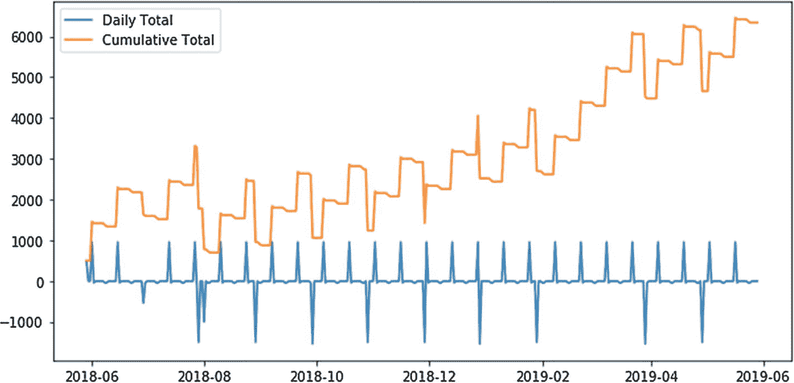
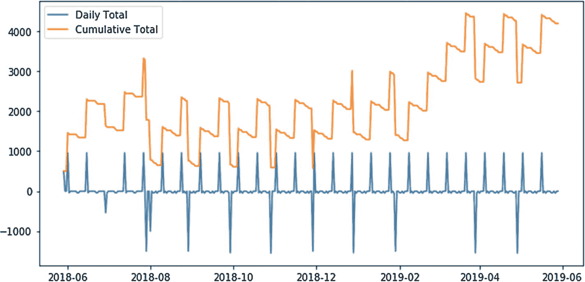

# 度假 II

虽然我们可能无法在七月负担得起哥伦比亚的 $2,500，但如果我们在八月去哈利法克斯，花费 $1,000 呢？



```
budget = yaml.load('''
bank:
  frequency: today
  amount: 2000
income:
  frequency: every 2 weeks on Friday
  amount: 1000
rent:
  frequency: every month
  amount: -1500
fun:
  frequency: every week on Friday and Saturday
  amount: -40
vacation:
  frequency: 2018-08-01
  amount: -1000
''')
calendar = build_calendar(budget)
plot_budget(calendar)
```

看起来不错！而且，我们似乎甚至还能攒下一些钱以备不时之需。让我们草拟一下，看看从“八月起的每个星期一”向储蓄账户存入 `$50` 会是什么样子。



```
budget = yaml.load('''
bank:
  frequency: today
  amount: 2000
income:
  frequency: every 2 weeks on Friday
  amount: 1000
rent:
  frequency: every month
  amount: -1500
fun:
  frequency: every week on Friday and Saturday
  amount: -40
vacation:
  frequency: 2018-08-01
  amount: -1000
savings:
  frequency: every Monday starting in August
  amount: -50
''')
calendar = build_calendar(budget)
plot_budget(calendar)
```

