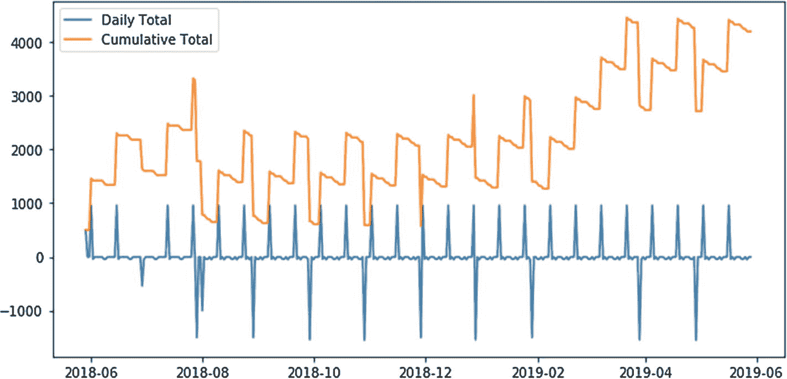

# 加载 YAML

我们一直将预算定义为内联 YAML。如果你想将输入与代码分开（这是一个好主意），我们可以稍微调整工作流程来适应。



```
with open('data/budget.yaml', 'r') as f:
    inputs = yaml.load(f)
calendar = build_calendar(budget)
plot_budget(calendar)
```

使用 `with` 块来打开和关闭 `.yaml` 文件，实际上是我们唯一需要做的调整！

## 结论

希望你享受本章的学习。我在编写本章时也乐趣无穷。但有一点需要注意：虽然这个预算工具功能强大，但如果你决定使用它，不要过分沉迷。每个季度更新一次你的 `.yaml` 文件，看看你目前所处的位置和方向。否则，如果你试图每天更新它，你会把自己逼疯的。

脚注 1   2   3   4   5   6


