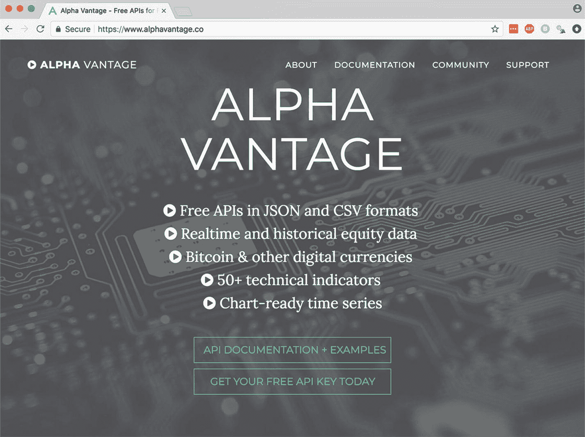
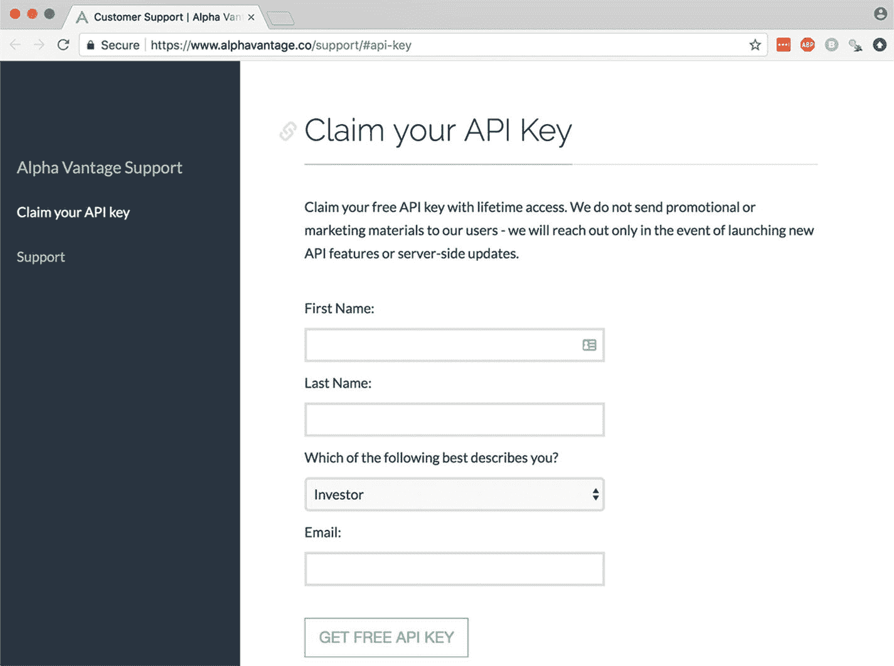
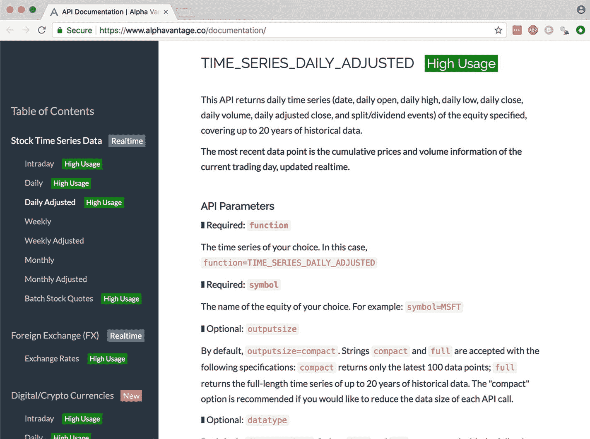
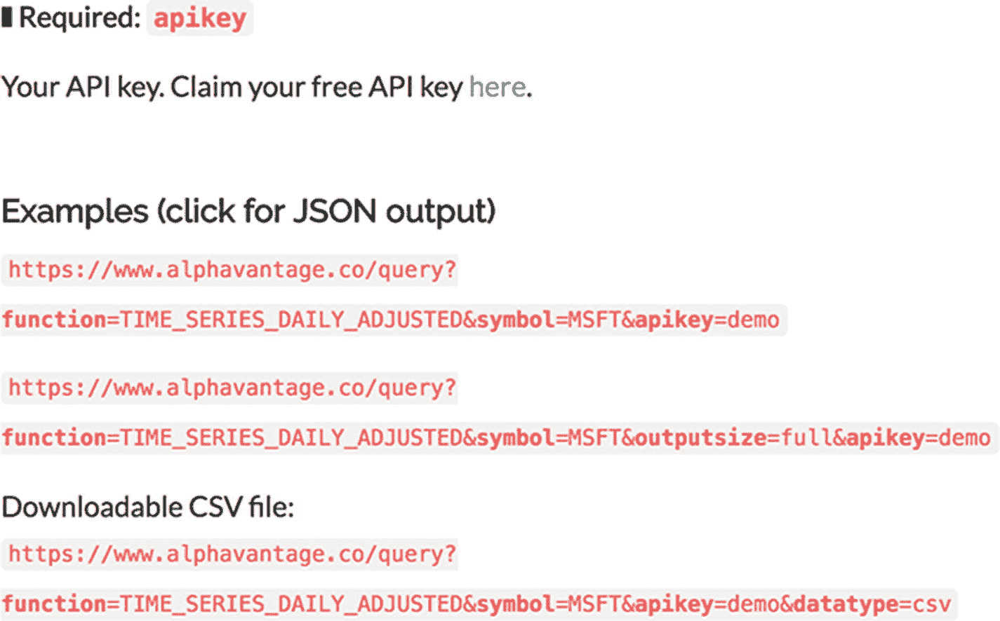

# 6. 投资

> 投资你的未来，不要稀释你的财富。
>
> ——肯德里克·拉马尔

我不是投资领域的权威。因此，我无法（也不会）告诉你应该选择哪些股票，或者你应该如何构建个人投资组合。但我可以为你提供一个极好的机制，用于设定资产配置并坚持持续再平衡的例行程序。

根据目标配置对你的投资组合进行再平衡^(²⁷)是一个好主意，因为它能控制风险，并迫使你从投资决策中剔除情绪因素。

当你的投资组合上涨时，你很难卖出；而当它遭受打击时，你又同样很难买入。采用自动化或半自动化的再平衡策略，即使在你情绪波动、试图战胜理性时，也能迫使你执行买入和卖出操作。

但在我们探索如何使用 Python 进行投资和再平衡之前，先来谈谈权衡取舍。

## 权衡取舍

在撰写本章的技术部分时，我遇到了困难，因为如果你想的话，你真的可以在这些内容上大做文章（而且我鼓励你这么做！）。

最初，我将所有内容都封装在一个 Python 类中，然后我重构了所有代码，使其能与 SQLite 协同工作，接着我又将其全部重构为基于 `pandas` 的简单函数。

我最终选择了 `pandas` 和函数，因为这是一本关于 `pandas` 的书，这样保持了主题的一致性。此外，函数也更加易于阅读和使用。虽然从规模化生产的角度来看，`Pandas` 可能不是最佳选择。

编程中存在着真实的权衡取舍。我们常常需要在“足够好”和“高度精良”之间做出选择，后者往往需要花费前者十倍以上的时间和精力。精良的代码能覆盖所有边界情况，而足够好的代码能让你快速达成目标。

我完全支持“足够好”。

## 实例化

讲完开场白，让我们来设计一个投资组合，开始投资吧！我选择了三只随机股票来启动：亚马逊（`AMZN`^(²⁸)）、思科（`CSCO`^(²⁹)）和通用电气（`GE`^(³⁰)）。我们将尝试分别以 40%、30% 和 30% 的目标配置持有这些证券。

为了保持与目标配置的平衡，我们需要在市场价格波动、存款和提款后执行买入和卖出交易。

首先，我们将目标配置定义为一个字典。

```python
targets = {
    'AMZN': 0.40, # 亚马逊
    'CSCO': 0.30, # 思科
    'GE': 0.30   # 通用电气
}
```

要实例化一个投资组合，我们可以像这样从头开始构建一个 `DataFrame`：

```python
import pandas as pd
import numpy as np

portfolio = pd.DataFrame(
    index=list(targets.keys()) + ['CASH'],
    data={
        'date': '2018-01-01',
        'price': [np.NaN, np.NaN, np.NaN, 1],
        'target': [0.4, 0.3, 0.3, 0],
        'allocation': [0, 0, 0, 1],
        'shares': [0, 0, 0, 10000],
        'market_value': [0, 0, 0, 10000]
    }
)
print(portfolio)
```

输出：
```
allocation        date   market_value  price  shares  target
AMZN         0  2018-01-01             0    NaN       0     0.4
CSCO         0  2018-01-01             0    NaN       0     0.3
GE           0  2018-01-01             0    NaN       0     0.3
CASH         1  2018-01-01         10000    1.0   10000     0.0
```

或者，我们可以构建一个可重用的函数，使其能适用于任意股票和目标。

```python
def instantiate_portfolio(targets, starting_balance):
    targets['CASH'] = 0
    tickers = list(targets.keys())
    df = pd.DataFrame(
        index=tickers,
        columns=[
            'date','price','target',
            'allocation','shares','market_value'
        ]
    )
    df.shares = 0
    df.market_value = 0
    df.allocation = 0
    df.update(
        pd.DataFrame
        .from_dict(targets, orient="index")
        .rename(columns={0:'target'})
    )
    df.at['CASH', 'shares'] = starting_balance
    return df
```

使用此函数实例化投资组合将如下所示：

```python
portfolio = instantiate_portfolio(
    {'AMZN': 0.4, 'CSCO': 0.3, 'GE': 0.3},
    10000
)
print(portfolio)
```

输出：
```
date price target allocation shares market_value
AMZN   NaN   NaN    0.4          0      0            0
CSCO   NaN   NaN    0.3          0      0            0
GE     NaN   NaN    0.3          0      0            0
CASH   NaN   NaN      0          0  10000            0
```

鉴于我在 `instantiate_portfolio` 函数中打包了很多内容，让我们花点时间来拆解它。

首先，你可能注意到了我们设置了 `targets['CASH'] = 0`。这是必要的，因为在我们的模型投资组合中，现金的行为将与常规证券略有不同。

虽然我们会再平衡股票，但我们没有必要、也不应该再平衡现金。投资组合中的现金只充当缓冲区和溢出池。将 `CASH` 添加到我们的字典中会产生如下效果：

```python
print(targets)
targets['CASH'] = 0
print(targets)
```

输出：
```
{'AMZN': 0.4, 'CSCO': 0.3, 'GE': 0.3}
{'AMZN': 0.4, 'CSCO': 0.3, 'GE': 0.3, 'CASH': 0}
```

其次，就在我们为 `CASH` 键设置值的那一行之后，出现了这一行：`list(targets.keys())`。

这段代码将所有字典键转换为一个列表，以便我们可以将其用作索引来构建 pandas `DataFrame`。

```python
list(targets.keys())
```

输出：
```
['AMZN', 'CSCO', 'GE']
```

再往下看 `instantiate_portfolio` 函数，我们调用了 `.from_dict`。这段代码只是从一个字典生成一个 pandas `DataFrame`。

```python
print(pd.DataFrame.from_dict(targets, orient="index"))
```

输出：
```
AMZN  0.4
CSCO  0.3
GE    0.3
```

不幸的是，这个方法不够智能，无法自动设置列名，所以我们手动重命名了 `0` 列。

```python
print(
    pd.DataFrame
    .from_dict(targets, orient="index")
    .rename(columns={0:'target'})
)
```

输出：
```
target
AMZN     0.4
CSCO     0.3
GE       0.3
```

这个由 `.from_dict` 创建的 `DataFrame` 被用于调用 `update` 函数，以更新各自的索引位置上的目标值。

`instantiate_portfolio` 函数中最后一个值得强调的部分是 `.at` 方法。使用 `.at` 是在特定的索引和列位置设置值的绝佳方式。

以下是在实践中 `.at` 的工作原理：

```python
df = pd.DataFrame(index=['CASH', 'GE'], data={'shares': [0, 1]})
print(df)
df.at['CASH', 'shares'] = 10000
print(df)
```

输出：
```
shares
CASH       0
GE         1

shares
CASH   10000
GE         1
```

### 价格

目前我们的 `portfolio` 已经实例化了，但数据结构中仍存在大量空缺。这些空缺是由于缺乏价格数据造成的。

```
print(portfolio)
date price target  allocation  shares  market_value
AMZN  NaN   NaN    0.4           0       0             0
CSCO  NaN   NaN    0.3           0       0             0
GE    NaN   NaN    0.3           0       0             0
CASH  NaN   NaN      0           0   10000             0
```

为了填补这些空缺，让我们构建一个可以更新价格的函数。虽然理论上我们可以用之前提到的`.at`方法来构建这个函数，但在这里使用`.update`方法会更清晰易懂。

```python
def update_prices(portfolio, prices):
    prices['CASH'] = 1
    portfolio.update(pd.DataFrame({'price': prices}))
    portfolio.date = prices.name
    portfolio.market_value = portfolio.shares * portfolio.price
```

要使用`update_prices`，我们需要将投资组合和包含特定日期价格的 pandas `Series`对象作为参数传入。

```python
### 临时伪造数据
prices = pd.Series(
    name='2018-01-01',
    data={'AMZN': 945.21,'CSCO': 30.52, 'GE': 29.27}
)
print(prices)
update_prices(portfolio, prices)
AMZN    945.21
CSCO     30.52
GE       29.27
Name: 2018-01-01, dtype: float64
```

这个函数巧妙之处在于它会直接原位更新数值。在 Jupyter 单元格中运行`print(portfolio)`，我们可以看到函数如何修改对象。

```python
print(portfolio)
date   price target  allocation  shares market_value
AMZN 2018-01-01  945.21    0.4           0       0            0
CSCO 2018-01-01   30.52    0.3           0       0            0
GE   2018-01-01   29.27    0.3           0       0            0
CASH 2018-01-01       1      0           0   10000        10000
```

目前所有`market_value`都设为 0，因为我们尚未执行任何买入订单。

### 订单

在完善投资组合对象后，让我们构建一个`get_order`函数，用于计算在任意时间点为实现目标配置平衡所需执行的买入和卖出订单。

```python
def get_order(portfolio):
    total_value = portfolio.market_value.sum()
    order = (
        (total_value * portfolio.target // portfolio.price)
        - portfolio.shares
    ).drop('CASH')
    return order
```

`get_order`函数相当直接；唯一有趣的部分是`//`这个运算符。

`//`是 Python 的向下整除运算符。`get_order`使用向下整除是因为我们无法在股票市场上购买零碎股票！

如果我们想购买 AMZN 股票，必须购买整股。

```python
total_value = 10000
target = 0.4
price = 945.21
AMZN = (total_value * target // price) - 0
print(AMZN)
4.0
```

如果没有向下整除，`get_order`函数会指示我们购买零碎股票。

```python
(total_value * target / price) - 0
4.231863818622316
```

使用`get_order`非常简单，只需将投资组合对象作为唯一参数传入。

```python
order = get_order(portfolio)
print(order)
AMZN      4
CSCO     98
GE      102
dtype: object
```

重要的是，`get_order`实际上不修改投资组合对象。这是因为我们可能希望保留是否执行订单及进行必要交易以实现再平衡的控制权。

### 存款

作为自律的投资者（*你懂的*），让我们在系统中添加一个`deposit`函数。这部分内容大多不言自明。

```python
def deposit(portfolio, amount):
    portfolio.at['CASH', 'shares'] += amount
    portfolio.at['CASH', 'market_value'] = portfolio.at['CASH', 'shares']
deposit(portfolio, 1000)
```

在`portfolio`上运行`get_order`现在会产生以下结果：

```python
order = get_order(portfolio)
print(order)
AMZN      4
CSCO    108
GE      112
dtype: object
```

就是这样！通过构建`instantiate_portfolio`、`update_prices`、`get_order`和`deposit`函数，我们拥有了对任意证券组合进行再平衡所需的所有要素。

这有点虎头蛇尾，不是吗？

让我们继续，将所有函数投入实践。同时，我们不妨使用真实股票报价，而不是像测试`update_prices`时那样伪造数据。

### 模拟

由于`get_order`函数不修改投资组合对象，让我们实现一个模拟买入/卖出订单执行的函数。

```python
def simulate_process_order(portfolio, order):
    starting_cash = portfolio.at['CASH', 'shares']
    cash_adjustment = np.sum(order * portfolio.price)
    portfolio.shares += order
    portfolio.market_value = portfolio.shares * portfolio.price
    portfolio.at['CASH', 'shares'] = starting_cash - cash_adjustment
    portfolio.market_value = portfolio.shares * portfolio.price
    portfolio.allocation = (
        portfolio.market_value / portfolio.market_value.sum()
    )
```

`simulate_process_order`函数接收投资组合对象和 pandas series 对象，用于买入和卖出证券。

```python
simulate_process_order(portfolio, order)
print(portfolio)
date   price target allocation  shares market_value
AMZN  2018-01-01  945.21    0.4   0.343713       4      3780.84
CSCO  2018-01-01   30.52    0.3   0.299651     108      3296.16
GE    2018-01-01   29.27    0.3   0.298022     112      3278.24
CASH  2018-01-01       1      0  0.0586145  644.76       644.76
```

### 行情

多年前大家都使用谷歌和雅虎财经 API 获取金融市场数据。不知何故，这两家公司都关闭了这些服务的访问权限，从此我们都在争相寻找替代方案。

在撰写本文时，我正使用 Alpha Vantage 的免费 API 获取股票报价。虽然有些笨重，但数据准确，足以满足我们的需求。

由于连接到 Alpha Vantage API 的过程与连接到 Open Exchange Rates API 的过程非常相似，我将更快地讲解本节内容。

在 alphavantage.co 注册获取 API 密钥。^(³¹)



(你几乎不需要创建账户；这太棒了。)



该 API 有多个不同的端点。本章我们将使用`TIME_SERIES_DAILY_ADJUSTED`端点。



在文档页面的下方，我们可以看到针对 API 的请求应该怎样构建。



拿到密钥后，让我们将其保存在`.env`文件中并加载所有内容（如果你跳过了第 3 章，建议你回头复习如何使用`.env`文件）。

```python
import requests
from dotenv import load_dotenv, find_dotenv
load_dotenv(find_dotenv())
API_KEY = os.environ.get('AV_KEY')
TODAY = pd.Timestamp.today().normalize()
```

### `get_price`

现在我们来编写一个 `get_price` 函数，它会访问 Alpha Vantage，进行一些数据清洗，然后返回一个 pandas DataFrame。

```python
def get_price(ticker, outputsize="compact", most_recent=False):
    URL = 'https://www.alphavantage.co/query?'
    payload = {
        'function': 'TIME_SERIES_DAILY_ADJUSTED',
        'symbol': ticker,
        'apikey': API_KEY,
        'outputsize': outputsize
    }
    r = requests.get(URL, params=payload)
    p = pd.DataFrame(r.json()['Time Series (Daily)']).T['4\. close']
    df = pd.DataFrame({ticker: p.apply(float)})
    df.index = pd.to_datetime(df.index)
    if most_recent:
        return df.tail(1)
    return df
print(get_price('AMZN')[:10])
```

```
AMZN
2018-01-04  1209.59
2018-01-05  1229.14
2018-01-08  1246.87
2018-01-09  1252.70
2018-01-10  1254.33
2018-01-11  1276.68
2018-01-12  1305.20
2018-01-16  1304.86
2018-01-17  1295.00
2018-01-18  1293.32
```

如果我们剖析一下 `get_price` 函数内的 `requests` 调用，会得到如下结果：

```python
URL = 'https://www.alphavantage.co/query?'
payload = {
    'function': 'TIME_SERIES_DAILY_ADJUSTED',
    'symbol': 'AMZN',
    'apikey': API_KEY,
    'outputsize': 'compact'
}
r = requests.get(URL, params=payload)
print(r.json().keys())
```

```
dict_keys(['Meta Data', 'Time Series (Daily)'])
```

可以看到，我们需要的数据会包含在 JSON 对象的 `Time Series (Daily)` 键中。

```python
p = pd.DataFrame(r.json()['Time Series (Daily)'])
print(p.head()[p.columns[:4]])
```

```
            2018-01-04 2018-01-05 2018-01-08 2018-01-09
1\. open            1205.0000  1217.5100  1236.0000  1256.9000
2\. high            1215.8700  1229.1400  1253.0800  1259.3300
3\. low             1204.6600  1210.0000  1232.0300  1241.7600
4\. close           1209.5900  1229.1400  1246.8700  1252.7000
5\. adjusted close  1209.5900  1229.1400  1246.8700  1252.7000
```

不幸的是，返回的数据是“宽”格式而非“长”格式。我们通过调用 `.T` 将其整理^(³²)并转置为长格式。同时，我们只获取 `'4\. close'` 这一列，忽略其余数据。

```python
p = pd.DataFrame(r.json()['Time Series (Daily)']).T['4\. close']
p.head()
```

```
2018-01-04    1209.5900
2018-01-05    1229.1400
2018-01-08    1246.8700
2018-01-09    1252.7000
2018-01-10    1254.3300
Name: 4\. close, dtype: object
```

由于返回的所有值都是字符串，我们还需要对对象进行一些额外的转换。让我们将数字转换为浮点数，重新放入 DataFrame，并将日期转换为日期格式。

```python
ticker = 'AMZN'
df = pd.DataFrame({ticker: p.apply(float)})
df.index = pd.to_datetime(df.index)
print(df.head())
```

```
            AMZN
2018-01-04  1209.59
2018-01-05  1229.14
2018-01-08  1246.87
2018-01-09  1252.70
2018-01-10  1254.33
```

考虑到我们要构建包含多个股票代码的投资组合，我们把 `get_prices` 函数封装到一个更大的函数中，以处理多个股票代码。

### `get_historical`

以下是 `get_historical` 的代码：

```python
def get_historical(tickers, start_date, end_date):
    df = pd.DataFrame(index=pd.date_range(start_date, end_date, freq="D"))
    for t in tickers:
        df = pd.concat([
            df,
            get_price(t, outputsize="full")],
            axis=1,
            join_axes=[df.index]
        )
    df = df.fillna(method='ffill').dropna()
    return df
```

这个 `get_historical` 函数会遍历每个股票代码，并将清洗后的响应数据绑定到一个主 DataFrame 对象上。该函数使我们能够获取任意数量上市公司在任意时间跨度内的数据和收盘价。

```python
historical_prices = get_historical(
    tickers=['AMZN', 'CSCO', 'GE'],
    start_date=pd.Timestamp(2016, 1, 1),
    end_date=TODAY
)
print(historical_prices.tail())
```

```
            AMZN   CSCO     GE
2018-05-25  1610.15  43.26  14.63
2018-05-26  1610.15  43.26  14.63
2018-05-27  1610.15  43.26  14.63
2018-05-28  1610.15  43.26  14.63
2018-05-29  1612.87  42.97  14.18
```

所有历史价格都存储在 DataFrame 中后，我们可以通过 `.loc` 获取特定日期的价格。

```python
prices = historical_prices.loc['2016-01-04']
print(prices)
```

```
AMZN    636.99
CSCO     26.41
GE       30.71
Name: 2016-01-04 00:00:00, dtype: float64
```

## 投资组合

我知道你只想看到完整运作过程，请看：

```
portfolio = instantiate_portfolio(targets, 100000.00)
prices = historical_prices.loc['2017-01-01']
update_prices(portfolio, prices)
order = get_order(portfolio)
simulate_process_order(portfolio, order)
portfolio.market_value.sum()
100000.0
```

这将是我们初始的投资组合：

```
print(portfolio)
date   price target allocation  shares market_value
AMZN 2017-01-01  749.87    0.4   0.397431      53      39743.1
CSCO 2017-01-01   30.22    0.3   0.299782     992      29978.2
GE   2017-01-01    31.6    0.3   0.299884     949      29988.4
CASH 2017-01-01       1      0  0.0029025  290.25       290.25
```

## 再平衡

为了测试我们的再平衡逻辑，我们使用 pandas 的 `Q` 偏移别名，在 2017 年进行回测，并在季度末执行订单。

```
dates = pd.date_range('2017-01-01', '2017-12-31', freq="Q").tolist()
for d in dates:
prices = historical_prices.loc[d]
update_prices(portfolio, prices)
order = get_order(portfolio)
print(f'{d}:\n{order}')
simulate_process_order(portfolio, order)
portfolio.market_value.sum()
2017-03-31 00:00:00:
AMZN     -4
CSCO    -24
GE      149
dtype: object
2017-06-30 00:00:00:
AMZN    -5
CSCO    63
GE      97
dtype: object
2017-09-30 00:00:00:
AMZN      0
CSCO    -83
GE      124
dtype: object
2017-12-31 00:00:00:
AMZN     -7
CSCO    -79
GE      589
dtype: object
111030.14
```

经过四次再平衡操作，我们可以验证投资组合将会紧密遵循并维持目标配置。

```
print(portfolio)
date    price target allocation   shares market_value
AMZN 2017-12-31  1169.47   0.4   0.389718       37      43270.4
CSCO 2017-12-31     38.3   0.3   0.299763      869      33282.7
GE   2017-12-31    17.45   0.3    0.29987     1908      33294.6
CASH 2017-12-31        1     0  0.0106498  1182.45      1182.45
```

## 结论

在本章中，你学习了如何在 pandas 中构建投资组合、更新 DataFrame 中的值、生成旨在维持目标配置平衡的买卖订单、从 Alpha Vantage 获取股票报价，以及模拟回测。

如果你想让这些代码真正发挥作用，你需要在一家在线券商开设账户，并手动在其平台上执行买卖订单。

好消息是，如果你认为再平衡是适合你的投资策略，实际上你不需要频繁操作。如果坚持月度或季度再平衡，你就能赚钱！

脚注 1   2   3   4   5   6