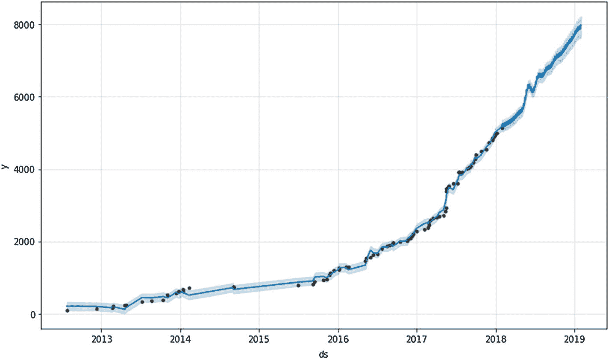
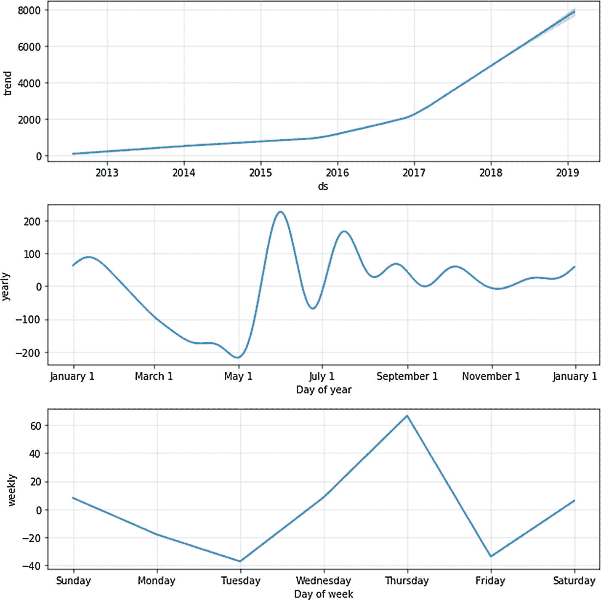

# 7. 消费

我们可不是为了炫耀而花钱。

——利尔·迪基

把这一章看作一个奖励章节。我把它收录进本书，是为了让你尝个鲜，了解一下开源项目和工具（如 `scikit-learn`、`XGBoost` 和 `Prophet`）是如何建立在 `pandas` 工作基础之上的。

我在本书引言中承诺过，如果你打下了 `pandas` 的基础，你就能很好地为深入学习机器学习做好准备。现在我想试着兑现这个承诺。

在继续之前，先快速声明一下：机器学习是一个庞大且复杂的主题。鉴于本书以个人理财为线索，我将略去大部分理论。此外，我只会聚焦于机器学习的一个小分支：时间序列预测。

## Prophet

Python 中有数百个用于预测的开源库。我特别喜欢其中一个，名为 `Prophet`。根据其 GitHub 仓库所述，“`Prophet` 是一个用于时间序列数据预测的程序。它基于一个加法模型，该模型将非线性趋势与年、周季节性以及节假日效应进行拟合。它最适合至少包含一年历史数据的日周期数据。`Prophet` 对缺失数据、趋势偏移和较大的异常值具有鲁棒性。”总之，如果你向 `Prophet` 提供历史数据，它将尝试为你推断未来的趋势。

在你的机器上安装 `Prophet` 稍微复杂一些，但其 `README` 文档非常详细。在继续本章之前，请先安装该库。

## 购买记录

为了演示 `Prophet` 的工作原理，我们需要一些历史数据。鉴于本书是关于个人理财的，我认为使用我个人的极端数据会很有趣。

`purchases.csv` 文件包含了我自 2012 年以来的所有亚马逊购买记录。该文件最初在第一章 1 的数据下载中提供。它有 83 行和 2 列（`date` 和 `amount`）。

### 注意

如果你不关心我的数据（其实你大可不必！），只需将自己的数据强制转换为相同的结构，就可以开始使用了。

加载 `pandas` 和购买数据。

```python
import pandas as pd
purchases = pd.read_csv('data/purchases.csv')
```

可以看到，我在 2018 年 1 月 7 日花费了 17.99 美元，在 2018 年 1 月 31 日花费了 158.19 美元。

```python
print(purchases.tail())
date  amount
78  2017-12-24   62.53
79  2017-12-27   43.99
80  2017-12-28   21.99
81  2018-01-07   17.99
82  2018-01-31  158.19
```

要将这些值滚动计算为累计总额，可以执行以下操作：

```python
purchases['cumsum'] = purchases['amount'].cumsum()
print(purchases.tail())
date   amount   cumsum
78  2017-12-24    62.53  4906.19
79  2017-12-27    43.99  4950.18
80  2017-12-28    21.99  4972.17
81  2018-01-07    17.99  4990.16
82  2018-01-31   158.19  5148.35
```

现在我们可以看到，自 2012 年以来，我在亚马逊上的总花费高达 5,148.35 美元。太疯狂了！

## 预测

要使用 `Prophet` 进行预测，我们需要调整 `purchases` `DataFrame` 以符合特定的输入结构。`Prophet` 的输入始终是一个包含两列的 `DataFrame`：`ds` 和 `y`。`ds`（日期戳）列必须包含日期，`y` 列必须是数值类型，代表我们要预测的测量值。

```python
purchases = purchases[['date', 'cumsum']]
purchases.columns = ['ds', 'y']
print(purchases.head())
ds       y
0  2012-07-25   82.55
1  2012-12-10  143.56
2  2013-02-19  155.10
3  2013-02-24  221.77
4  2013-04-20  229.76
```

让我们导入 `Prophet`。

```python
from fbprophet import Prophet
```

实例化一个 `Prophet` 类的实例，并将其拟合到购买数据中。

```python
m = Prophet(daily_seasonality=False)
m.fit(purchases)
```

要预测未来一年的值，我们需要使用 `.make_future_dataframe` 方法，并将 `periods` 参数设置为 365。

```python
future = m.make_future_dataframe(periods=365)
print(future.tail())
ds
443 2019-01-27
444 2019-01-28
445 2019-01-29
446 2019-01-30
447 2019-01-31
```

现在，预测我 2018 年乃至 2019 年在亚马逊上的总支出非常简单。我们只需对我们之前创建的 `future` `DataFrame` 调用 `predict` 方法。

```python
forecast = m.predict(future)
```

让我们检查一下 `forecast` 对象：

|    | `ds`       | `yhat`       | `yhat_lower`  | `yhat_upper`  |

|----|------------|--------------|---------------|---------------|

| 443| 2019-01-27 | 7914.330291  | 7656.482987   | 8137.708873   |

| 444| 2019-01-28 | 7891.583392  | 7633.735995   | 8129.905842   |

| 445| 2019-01-29 | 7875.415396  | 7619.920169   | 8102.319783   |

| 446| 2019-01-30 | 7924.375719  | 7667.813754   | 8148.685988   |

| 447| 2019-01-31 | 7985.795633  | 7740.228707   | 8224.416333   |

```python
forecast[['ds', 'yhat', 'yhat_lower', 'yhat_upper']].tail()
```

我们可以看到，我在亚马逊上的累计支出预计将达到 7,985 美元（`yhat`）。但既然我知道了这一点，我很想缩减开支！

## 可视化

`Prophet` 自带了一个非常棒的 `plot` 便捷方法。在 `m` 对象上运行它，我们可以更好地了解趋势。



```python
%matplotlib inline
m.plot(forecast)
```

该库还包含一个 `plot_components` 方法，该方法会打印趋势、周季节性和年季节性（如果存在）的面板。



```python
m.plot_components(forecast)
```

基于这些面板，我们可以看到我在 6 月份和星期四在亚马逊上花费很多，而且自从我在 2015 年成为 Prime 会员以来，我的支出一直在显著增长！

## 结论

如果你认为使用我个人支出数据有点傻，那你百分之百是对的。老实说，我本可以从其他地方借用更“专业”的数据集，但那样有什么乐趣呢？

就像我说的，这一章主要是一个额外内容。但严肃地说，我希望你能看到学习 `pandas` 会带来巨大的回报，因为它是 Python 中管理和处理数据的行业标准。

如果你擅长 `pandas`（现在你应该是了！），你可以将这种知识扩展到一些相当有趣的领域，例如时间序列预测。

脚注 1 2 3 4