# 21. 收获回报

本书向你介绍了一种规划财务生活、为财务未来做准备的新方法。它还对“财富”一词提出了全新定义——这一含义超越了传统意义上积累足够财富以确保你当前或期望的生活水平能在工作期间及退休后得以维持。

如何确保自己拥有最完整意义上的财富？本书建议，遵循财富积累与管理的`PADD`策略，或许能最佳地达成这一令人向往的状态：

- 保护你自己、家人及财产
- 积累财富
- 守护财富
- 在有生之年及离世后分配财富

广义上来说，这一过程可被视为遵循以下财务规划步骤：

1.  为你自己、家人及财产投保，以应对重大损失的可能性
2.  利用雇主提供的福利，尤其是雇主资助的退休计划
3.  投资于金融资产或实物资产，或两者兼投
4.  尽可能降低通货膨胀对你投资组合的影响
5.  运用有效的税务规划与管理技巧
6.  为子女的高等教育做准备
7.  规划你的退休岁月
8.  以尽可能节省转让税的方式，在你离世后将遗产分配给指定的继承人或受益人

最大化地执行这些步骤并非易事。如果容易，本书以及众多其他关于有效个人财务规划的著作也就没有存在的必要了。不过，知道你不是独自面对这一挑战，应能令人感到欣慰！许多专业顾问——其中包括注册财务规划师（`CFP`）、注册会计师（`CPA`）、证券与保险专业人士以及遗产规划律师——随时准备协助你实现财务规划和财富积累的目标。另外，如果你认为自己足够自律且有能力独自应对这一挑战，你当然也可以这样做。

打理你的财务生活和事务，正如斯嘉丽·奥哈拉在《飘》中的那句名言：“哎呀，明天再想吧！”换句话说，你越是推迟思考财务规划的过程，你变得富有的时间就越长——而充满财务挑战的明天就会来得越快！如果本书没有其他成就，我希望它至少为你提供了一些基本的原则和知识，让你能够开始掌控自己的财务生活。如果你采纳了书中所描述的过程，你将收获最大的回报：一种无财务之忧、独立自主的生活，让你能与家人和朋友尽情享受。

祝你规划顺利。

## 附录 A：样本数据收集表

| 个人信息 | | |
| --- | --- | --- |
| | 客户 | 配偶 |
| --- | --- | --- |
| 全名 | | |
| 性别 | | |
| 娘家姓（如适用） | | |
| 当前婚姻状况 | | |
| 之前婚姻（如有，请注明解除日期） | | |
| 美国公民（是/否） | | |
| 当前地址 | | |
| 电话号码 | | |
| 手机号码 | | |
| 之前的居住州 | | |
| 出生日期 | | |
| 年龄 | | |
| 出生地 | | |
| 社保号 | | |
| 职业 | | |
| 雇主 | | |
| 当前工作年限（年） | | |
| 办公电话 | | |
| 依赖你抚养的家庭成员 | | |

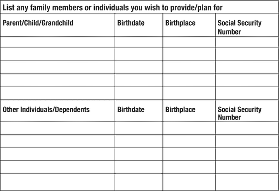

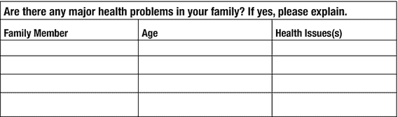

| 家庭顾问与代表人 | | |
| --- | --- | --- |
| | 姓名 | 电话号码 |
| --- | --- | --- |
| 律师 | | |
| 银行家 | | |
| 医生 | | |
| 遗嘱执行人 | | |
| 财务规划师 | | |
| 监护人 | | |
| 保险代理人 | | |
| 投资顾问 | | |
| 牧师/拉比 | | |
| 税务申报人 | | |
| 其他： | | |
| 其他： | | |
| 其他： | | |

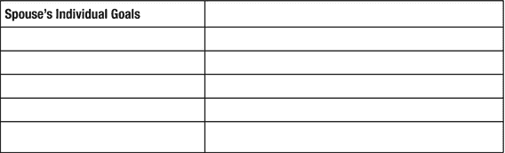

| 家庭目标 | | |
| --- | --- | --- |
| 请指出以下哪些目标对你的家庭很重要。 | | |
| --- | --- | --- |
| 目标 | 对客户重要（是/否） | 对配偶重要（是/否） |
| --- | --- | --- |
| 为教育储蓄（自己、子女、孙辈等） | | |
| 为退休储蓄 | | |
| 能够提前退休（55 岁或更早） | | |
| 最小化所得税 | | |
| 最小化遗产税 | | |
| 为年迈的父母或亲戚提供支持 | | |
| 提高投资回报 | | |
| 改善保险覆盖范围 | | |
| 支持喜爱的慈善机构 | | |
| 为你的遗产做规划 | | |
| 提高生活水平 | | |
| 改变或改善你的就业状况 | | |
| 其他： | | |
| 其他： | | |

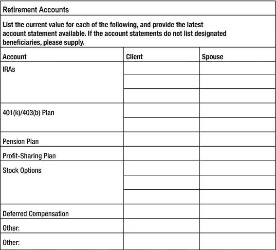

| 房地产 | | | | | |
| --- | --- | --- | --- | --- | --- |
| 请列出以下各项的当前美元价值。 | | | | | |
| --- | --- | --- | --- | --- | --- |
| 类型 | 所有权（客户、配偶或共同） | 成本 | 市场价值 | 贷款余额 | 每月还款额 |
| --- | --- | --- | --- | --- | --- |
| 主要居所 | | | | | |
| 度假屋 | | | | | |
| 出租房产 | | | | | |
| 其他： | | | | | |
| 其他： | | | | | |

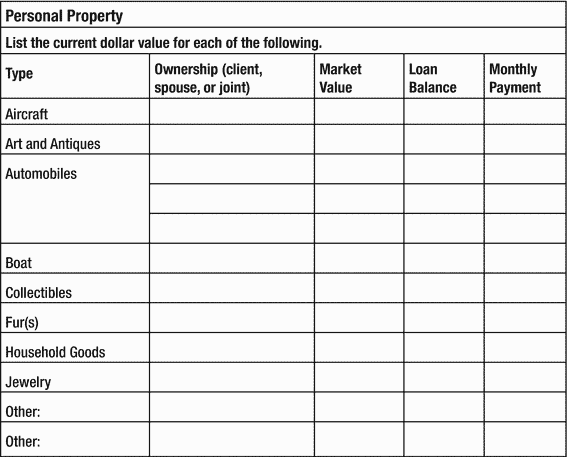

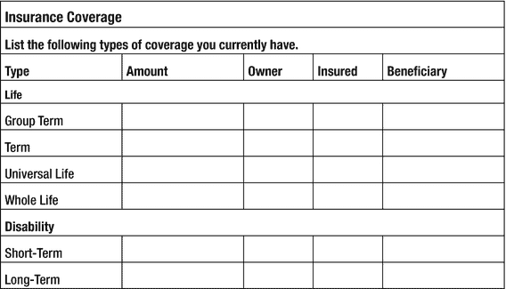

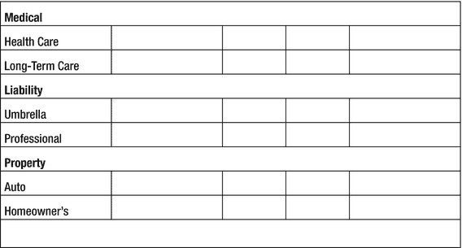

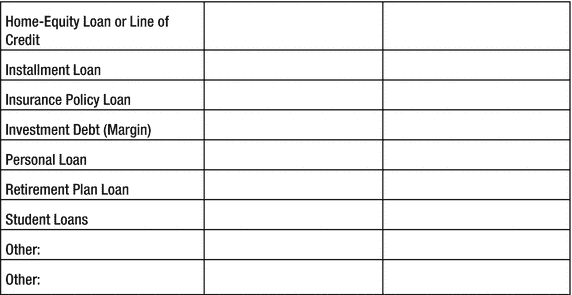

| 收入 | | | |
| --- | --- | --- | --- |
| 请按年金额列出以下收入来源。 | | | |
| --- | --- | --- | --- |
| 类型 | 客户 | 配偶 | 共同 |
| --- | --- | --- | --- |
| 雇佣收入 | | | |
| 工资 | | | |
| 奖金 | | | |
| 佣金 | | | |
| 自雇收入 | | | |
| 其他： | | | |
| 投资收入 | | | |
| 股息 | | | |
| 利息——应税 | | | |
| 利息——免税 | | | |
| 租金收入（净额） | | | |
| 年金 | | | |
| 其他： | | | |
| 杂项收入 | | | |
| 赡养费 | | | |
| 信托收入 | | | |
| 子女抚养费 | | | |
| 遗产收入 | | | |
| 赠与收入 | | | |
| 退休账户收入 | | | |
| 出售财产/投资收入 | | | |
| 社会保障金 | | | |
| 其他： | | | |
| 其他： | | | |
| 你预计未来两到三年收入会有重大变化吗？如有，请预估金额。 | | | |

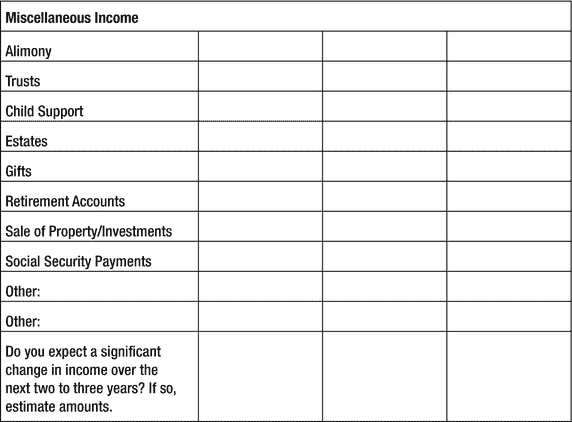

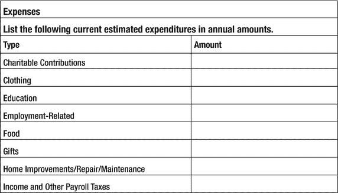

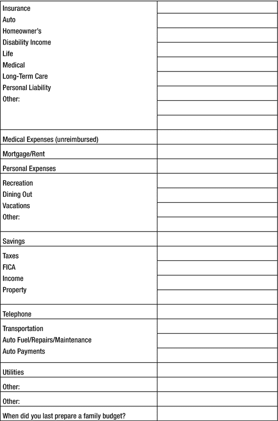

## 附录 B：样本预算

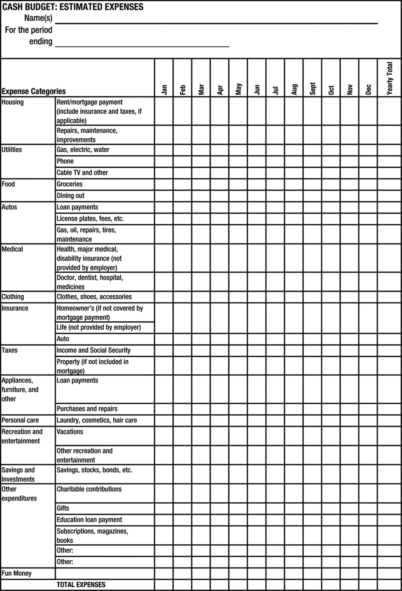

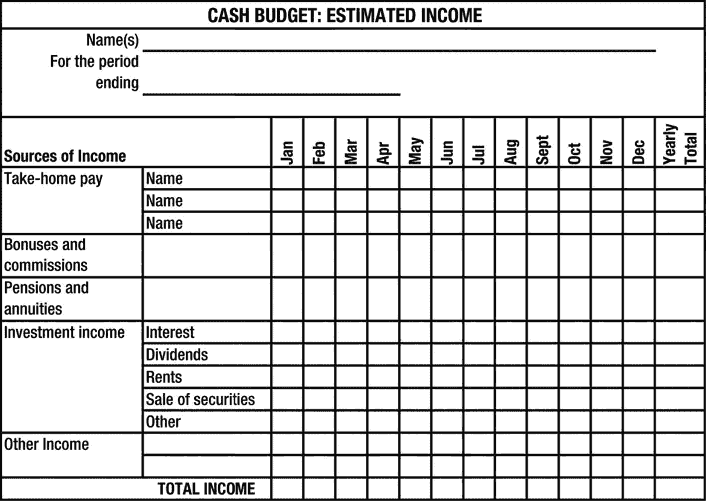

## 附录 C：授权委托书

### 持久性一般及财务授权委托书

本人，`_____（姓名）_______`，现居于`__（城市及州）___`，特此签署此持久性一般（及财务）授权委托书，旨在使下文指定的代理人能够在所有事务中代为行事。

#### 第 1 节：代理人的指定

1.01：本人特此指定并任命`_____（姓名）_____`（现居于`_____（城市及州）_____`）为我的代理人，代表我、以我的名义并为我的利益行事。

1.02：若`_____（姓名）_____`因任何原因未能履行或继续担任我的代理人，本人特此指定并任命`_____（姓名）_____`（现居于`_____（城市及州）_____`）担任我的代理人。

#### 第 2 节：授权委托书的生效日期

2.01：本一般授权委托书自签署之日起立即生效，且不因本人的伤残或心智能力缺失而受影响，但相关州法规另有规定者除外。

2.02：本一般授权委托书不因本人的丧失行为能力或伤残而受影响，本人明确意图是，即使本人可能无法追认代理人的行为，代理人仍应继续以此身份行事。

2.03：第三方可依赖代理人就授予代理人的任何权力相关所有事宜所作的陈述，任何因依赖代理人陈述而行事的人，均不因允许代理人行使任何权力而向本人或本人的遗产承担任何责任。此外，本人授权代理人赔偿并保护任何接受并依据本文件行事的第三方免受损害。

2.04：本授权可撤销，但就任何依赖本授权的政府机构、银行、存管机构、信托公司、保险公司、其他公司、过户代理人、投资银行公司或其他个人或机构而言，其可合理信赖本授权。本授权仅可通过本人或代理人签署的书面通知，并送达该等个人或机构后方可撤销。

2.05：本授权不因时间的推移而被撤销或以任何方式失效，而应继续完全有效，直至根据本协议第 2.04 段规定由本人或代理人以书面形式予以撤销。

#### 第 3 节：权力

3.01：我的代理人应享有法规、普通法及任何法院规则授予的所有权力、酌情权、选择权及权限。除此之外，且不限于此，我的代理人也应享有下述各项权力。

3.02：我的代理人可以无需提起法律诉讼即可收取和接收所有目前到期或此后到期、应付或归属于我的债务、款项、赠予、物品、利息、股息、年金及索偿。我的代理人可以以我的名义或以其他方式采取所有合法行动来追讨或和解上述款项。

3.03：我的代理人可以出售、转让、租赁、交换、抵押、质押、解除或以其他方式处理、处分、交换或使我的任何财产（无论是动产还是不动产）承受产权负担。这应包括按照代理人认为适当的条款、条件和约定借款或以其他方式获得信贷的权力。

3.04：在本一般授权委托书有效期间，若本人成为或可能成为任何诉讼的当事人，我的代理人可代表本人出庭。

3.05：我的代理人可代表本人给予解除、豁免、同意及收据。

3.06：我的代理人有权以我的名义在任何银行或储蓄机构或任何货币市场账户中存入资金，无论该账户是否投保。

3.07：我的代理人有权支付本人在签署本一般授权委托书之时或之后到期应付的任何及所有账单、账户、索赔及要求。

3.08：我的代理人可为存入任何存有本人资金的账户或任何以本人名义开立的新账户而背书所有以本人为收款人的支票。

3.09：我的代理人有权就任何需要完成的遗产规划，或为执行其可能理解的本人的任何有利意图，向任何个人或机构作出现金或实物财产的赠与。

3.10：我的代理人有权转让或交出本人可能拥有的任何证券。与此相关，代理人可以本人的名义或代表本人签署任何股权授权书或其他文书，以实施任何此类转让或交出。

3.11：我的代理人有权代表本人与任何银行或信托公司签订或续签任何代理或保管协议，费用由本人承担，用于任何财产的投资或保管。

3.12：我的代理人有权不受限制地进入本人可能拥有或以本人名义注册的任何保管箱、保险库或其他存放处。

3.13：我的代理人有权准备、制定、签署和提交任何及所有联邦、州、地方或其他税务申报表、退税申请或预估税款申报书。此权力应包括在涉及美国国内税务局或任何其他联邦、州或地方机构的任何事务中代表本人（直接或通过其他代理人间接）的权力。

3.14：我的代理人有权就任何财产签署、盖章、确认和交付任何被认为必要、可取或适当的文书、文件或凭证。

3.15：我的代理人有权持有、投资、再投资，并以其他方式处理和管理所有本人可能拥有权益且无论位于何处的财产。

#### 第 4 节：批准；影印件的使用；先前授权书的撤销：文书的解释

4.01：特此批准、允许、承认并确认我的代理人根据本授权书所采取的所有行为均为有效。

4.02：特此授权使用本通用授权书的影印件代替由我签署的原始文件，以实现本授权书的条款和规定。

4.03：特此撤销、废止并取消我先前签署的所有可撤销的通用及财务授权书，且上述授权书将不再具有任何效力。但前款不得产生撤销由我签署的与我的医疗保健直接相关的任何授权书的效果。

4.04：本通用授权书在 `_____(户籍州)_____` 州签署并交付，与本授权书的有效性及其条款解释相关的所有问题均受 `_____(户籍州)_____` 州法律管辖。

4.05：本文书应被解释为一份通用授权书。本文书中对特定权力的列举并非意图，也不应限制或约束本授权书中授予我的代理人的一般权力。

4.06：根据 `_____(适用州法规)_____` 的规定，任何“任意或没有合理理由”未能尊重本授权书，或未能遵守我的代理人指示的个人或组织，应承担为实现本文书条款和规定所需付出的费用、开支及合理的律师费。

特此为证，我于 `20xx` 年 `______` 月 `_________________` 日签署本通用授权书。

_______________________________

委托人

见证人：

______________________________

见证人

______________________________

见证人

`_________________` 州

`________________` 县

上述文书于 `20xx` 年 `_____` 月 `_______________` 日由委托人 `________________` 及上述见证人在我面前为所述目的予以确认。

以我的手和官方印章为证。

（印章）

_____________________________

公证人

我的任期至：`________________` 到期

代理人签名样本：

_______________________________________

代理人

后继代理人签名样本：

________________________________________

后继代理人

## 附录 D：关于医疗或外科治疗声明及医疗永久授权书

### 关于医疗或外科治疗声明

我，`_____(声明人)_____`，现居 `_____(城市和州)_____`，心智健全且年满十八周岁，指示在以下所述情况下不得人为延长我的生命，并特此声明：

#### 维持生命程序

如果在任何时候我的主治医师和另一位合格医师书面证明：

我患有无法治愈或逆转的损伤、疾病或病症，并且根据他们的判断，这属于临终状态，且我已失去知觉、昏迷或处于其他无行为能力状态，无法就我个人事务做出或传达负责任的决策，那么我指示，根据 `_____(户籍州)_____` 州法律，将按照本声明条款撤销和停止维持生命程序。需明确，维持生命程序不应包括主治医师认为必要的用于提供舒适或缓解疼痛的任何医疗程序或营养干预措施。

此外，我要求将“临终状态”一词解释为包括永久性无意识状态（永久性植物状态）。

#### 人工营养

如果我唯一接受的治疗是人工营养，我指示当人工营养成为唯一提供的程序时，也应立即停止。尽管有关于停止人工营养的指示，但如果我的主治医师确定停止会导致疼痛，该医师可以下令为我提供人工营养，但仅限于缓解此类疼痛所必需的程度。

#### 其他具体要求：

用户须知

常见要求可能包括使用或放弃使用心肺复苏术以及可能的器官捐献。

### 医疗永久授权书

#### 医疗保健代理人指定

我，`_____(委托人)_____`，现居 `_____(城市和州)_____`，特此指定：

代理人姓名：`__________________`

地址：`__________________`

电话：`__________________`

关系（如有）：`__________________`

作为我的代理人，在我无法为自己做出医疗保健和个人事务决策时，代我做出此类决策，除非我在本文档中另有说明。

本文档中使用的“医疗保健”一词包括所有医疗治疗，以及任何医疗保健程序的提供、保留或撤销，包括手术、心肺复苏术，或为维持、诊断、治疗或提供患者身体或心理健康或个人护理的服务，除非本文档另有限制此等权力。

#### 医疗永久授权书的设立

通过本文档，我还意图设立一份医疗永久授权书。本永久授权书仅在我无法给予知情同意、残疾、无行为能力或无能力时生效，并在此类无法给予知情同意、残疾、无行为能力或无能力期间持续有效。我在仍具有法律行为能力且心智健全时准备了本文件。如果这些指示与我的亲属的意愿、医院政策或护理提供者的原则产生冲突，我请求以我的指示为准。

#### 授予权限的一般声明

受本文档中任何限制的约束，我授予我的代理人完全的权力和权限，为我做出医疗保健决策，其程度与我本人在有行为能力时所能做出的决策相同。此权限还应包括与我的个人护理以及任何住所安置和/或医疗治疗相关的所有行为。在做出任何决策时，我的代理人应尝试与我讨论拟议决策，以确定我的意愿（如果我能够以任何方式沟通）。

在行使此权限时，我的代理人应做出符合本文档所述或通过其他方式告知代理人的我的意愿的医疗保健决策。如果我的代理人不知道我对特定医疗保健决策的意愿，那么我的代理人应基于其认为最符合我利益的原则为我做出决策。

#### 医疗记录查阅权限

根据 1996 年《健康保险携带和责任法案》（`45 C.F.R. Sec. 164.502 (g) (1) and (2)`）以及 `_____(适用州法律)_____` 州法律（州法规 `_____(适用州法规)_____`），作为我遗产的个人代表，我的代理人有权为所有目的完全查阅我受保护的健康信息。我授权披露的信息没有限制，并且请求或披露信息的时间期限也没有限制。

#### 预先医疗指令

如果我的代理人在与我的主治医师商议后确定心肺复苏术指令是适当的，则允许我的代理人根据 `_____(适用州法规)_____` 的规定，就心肺复苏术的执行签署一份预先医疗指令。

#### 解剖、遗体捐赠及遗骸处置

在法律允许的范围内，我授权我的代理人将我的部分或全部遗体用于医疗目的进行解剖捐赠，授权进行解剖，并指示遗骸的处置方式。

#### 指定备用代理人

若被指定为我的代理人无法履职或无法联系，我特此指定以下人员作为我的备用代理人，根据本文件授权代我做出医疗保健决策。

备用代理人：________________________

地址：________________________

电话：________________________

与我的关系（如有）：________________________

#### 指定监护人与财产管理人

若需为我指定人身监护人，我提名我的代理人（其次为备用代理人）担任我的监护人。若法院有必要为我的财产指定财产管理人，兹此作出与监护人相同的提名及指定顺序。

#### 一般规定

##### 免责与第三方信赖

所有善意执行本文件条款与规定的个人（包括主治医生）或实体，均不对我本人、我的遗产、继承人或受让人因该等行为引发的任何损害或索赔承担责任。然而，若任何人恶意质疑我代理人的权限，或故意违背本文件的任何条款，我的遗产不承担任何责任，也无义务支付因代理人代表我所采取行动而产生的任何费用或开支。

##### 可分割性

若本文件的任何条款被认定为无效，该无效性不影响其他条款的效力，其他条款可在不包含该无效条款的情况下继续生效。为此，本文件中的指示具有可分割性。

##### 意向声明

我的意图是使本文件具有法律约束力和效力。若法律不承认本文件具有法律约束力和效力，则我意图将本文件视为一份正式声明，陈述我在无法做出医疗保健决策期间，希望他人代我做出此类决策的方式。本授权书旨在提交的任何司法管辖区内均有效。

##### 条款不一致

若《医疗持续性授权书》与《医疗或手术治疗声明（生前预嘱）》的条款存在不一致，应以《医疗持续性授权书》为准。

##### 撤销先前的授权

我特此撤销任何先前的医疗保健授权书，并重申上述之意图。

##### 适用法律

所有与本文件的有效性、解释及管理相关的问题，均应根据 ________ 州的法律确定。

我已阅读并理解本文件的内容以及授予我代理人此等权力的效力。我于情感及心智上均具备作出此声明的能力。

于 20xx 年 ____ 月 ____ 日签署。

签字：________________________

本人

本人姓名：________________________

本人地址：________________________

本人社保号：________________________

本人生日：________________________

#### 见证人声明

上述文件由 ________（本人姓名）______（本人）签署并声明为其关于医疗或手术治疗的声明及医疗持续性授权书。我们在其面前、彼此面前，并应 ________（本人姓名）______ 的要求，作为见证人在下方签署姓名，并声明：据我们所知所信，签署本文件时，________（本人姓名）______ 心智健全，未受任何胁迫、欺诈或不当影响。见证人均不是 ________（本人姓名）______ 的主治医生或任何其他医生、主治医生或 ________（本人姓名）______ 就诊的医疗机构的雇员、在签署声明时对 ________（本人姓名）______ 去世后的遗产任何部分享有债权的人、或者知道或相信自己有权在 ________（本人姓名）______ 去世后获得其遗产任何部分的人（无论是作为签署声明时已存在遗嘱的受益人，还是作为法定继承人）。见证人也不是本文件指定的代理人。见证人不是医疗或住宿护理服务的提供者或其雇员。

见证人

签字：________________________

姓名：________________________

地址：________________________

日期：____________

见证人

签字：________________________

姓名：________________________

地址：________________________

日期：____________

________ 州

________ 县

于 20xx 年 ____ 月 ____ 日，________，经本人（或通过令本人满意的证据）确认为上述文件中提及之人，亲自出现在本人面前，本人系在上述州和县内执业之公证员，其承认自愿并根据文件中所述目的自由签署了该文件。

本人任期至：____________

（印章）

________________________

________________________

公证员

## 附录 E：个人指示信样本

编写人：________________________

这是由我本人编写的一份个人指示信，供我的个人代表（按我遗嘱指定）在我去世之日参考。虽然本信函不具有法律约束力，但它确实公平地代表了我去世之时的意愿，我请求我的个人代表予以尊重。

此信函须在我的个人代表在我去世后立即阅读。

1.  法定全名：____________
2.  （如为女性）娘家姓：____________
3.  出生日期：____________
4.  出生地：____________
5.  父母法定姓名：____________
6.  国籍：____________
7.  社保号：____________
8.  兵役信息（如适用），包括任何退伍文件存放地点：____________
9.  死亡时的婚姻状况：____________
10. 配偶或伴侣的姓名、地址和电话：____________
11. 所有子女的姓名、地址和电话：____________
12. 所有兄弟姐妹的姓名、地址和电话：____________
13. 需联系的朋友或商业伙伴的姓名、地址和电话：____________
14. 预先医疗指示（医疗持续性授权书、医疗代理人、生前预嘱）的存在及存放位置：____________
15. 财务授权书的存在及存放位置：____________
16. 器官组织及/或遗体捐赠信息：____________
17. 宗教信仰（如适用）：____________
18. 指定的殡仪馆偏好及其他殡葬信息：____________
19. 遗骸处置方式（土葬或火化）：____________
20. 任何墓地或墓穴的位置：____________
21. 首选的纪念捐款（如有）：____________

## 术语表

### A

A.B.L.E.账户：根据 2014 年《实现更美好生活体验法案》设立的一种为残障人士提供的税收优惠储蓄账户。

`加速死亡给付附加条款`：人寿保险合同中的一项附加条款，允许保单所有者/被保险人在身故前领取全部或部分保险金，以支付例如临终疾病等费用。

`意外死亡给付`（`ADB`）：也称为双倍赔偿金；在某些人寿保险合同中的一项条款，规定若被保险人不幸意外身故，则支付保单面值两倍的保险金。

`摊销时间表`：借款人用于偿还债务（通常是个人住房的按揭贷款）的每月还款计划表。该表格包含了按揭贷款期限内的利息和本金偿还额。

`年金`：一种保险产品，其特点是在所有者/年金领取人的有生之年提供等额的定期给付。这是一项重要的退休规划策略，因为该产品能确保抵御长寿风险，即退休人员活过其积累的退休资金耗尽的风险。

`资产配置`：将个人资产组合或投资组合在多个资产类别（通常是现金或现金等价物、股票和债券）之间进行分配或划分的方法。这种配置还包括在特定资产类别中达成一致的资产百分比，是许多理财顾问使用的、妥善准备的投资政策声明中的基本要素。

### B

`计税基础`（或`成本基础`）：一个所得税术语，首要含义是纳税人在购买任何实物或金融资产时所投入的金额。有时也指个人在财产中的成本基础，用于确定资产出售时应纳税的收益或亏损金额。然而，在所得税和会计规则中，还提到了其他类型的基础。

`行为金融学`：金融学的一个分支，研究心理学与投资者行为之间的相互关系；它是传统公司金融理论的替代方案，后者假设有效市场以及理性的投资者行为。行为金融学的一个重要原则是前景理论，其基本观点是投资者对损失的恐惧超过了对收益的重视。

`受益人`：在法律文件（如信托）中指定的人，在文件出具人或创建人身故后享有相关利益。

`债券`：一种常见的由公司或政府发行的金融工具，旨在为所需项目或职能筹集资金。有时仅被称为债务或债务义务，因为发行人从债券持有人处借入资金，并必须在债务到期时偿还债券持有人。

### C

`资本利得`：一个所得税和金融术语，指资产从购买日到出售日期间价值的增值或升值。如果此类资产在出售前持有达到规定期限（即长期持有），目前要求自购买日起超过一年，税务机关会给予优惠税率。

`资本化率`：应用于财产的（通常是房地产）未来收益以确定其当前价值的一个百分比或数字。例如，如果一个公寓楼的净营业收入为$500,000，并且应用了 20%的资本化率，那么该公寓楼的当前价值估计为$2,500,000。

`现金价值保险`：一种人寿保险，代表保单所有人生成现金储备，所有者在其有生之年可以动用。常见的现金价值保险类型包括终身寿险、万能寿险、可变寿险和可变万能寿险。

`慈善主导信托`（`CLT`）：在遗产规划中使用的一种不可撤销信托，旨在在一定时期内每年向合格慈善机构提供固定或可变的收入流，而剩余财产则留给非慈善受益人（通常是捐赠者的子女）。

`慈善剩余信托`（`CRT`）：在遗产规划中使用的一种不可撤销信托，旨在在一定时期内每年向非慈善受益人（通常是捐赠者）提供固定或可变的收入流，而剩余财产则留给合格慈善机构。

`儿童税收抵免`：一项所得税抵免，即因拥有目前未满 17 岁的子女而从纳税人的所得税负债中直接抵扣的金额。该抵免的最高额度由税法规定：例如，每个符合条件的儿童$2,000。

`大学理事会`：一个致力于教育（尤其是高等教育）卓越和公平的非营利会员制组织。该组织也为学生提供通往大学机会的途径，包括经济支持和奖学金。

`专员个人残疾表 A`：政府发布的 1985 年表格，提供了个人在其一生中成为残疾的概率数据。

`普通法财产制度`：两种财产法制度之一（另一种是共同财产制度），允许财产以个人名义持有，即使在婚姻中也是如此。目前，这是美国 50 个州中 41 个州的财产法制度。

`共同财产制度`：两种财产法制度之一（另一种是普通法财产制度），在婚姻存续期间不允许以个人名义持有财产；配偶任何一方在婚姻期间获得的任何财产通常属于“夫妻共同体”，而非个人单独所有。目前，这是美国 50 个州中 9 个州的财产法制度，最著名的是加利福尼亚州和德克萨斯州，不过阿拉斯加州允许配偶在双方选择的基础上实行共同财产制。

`或有信托`（为未成年人设立）：在每位父母的遗嘱中设立的信托，指定受托人，并规定在父母同时身故的情况下如何处置父母的财产。为了从信托财产中受益的子女，受托人须与父母指定的监护人协调合作，这一点很重要。有时也与“或有家族信托”同义使用。

`相关性`：衡量两个变量（如金融资产）之间相互变动关系的指标。例如，如果一项金融资产价值下跌的同时另一项资产价值上涨，则称这些资产呈现负相关性。利用相关性是适当分散资产投资组合的关键因素。

`成本基础`：参见“计税基础”。

`票面利率`：债券的利率百分比；例如 6%。将该利率乘以债券的面值或平价（通常为$1,000），即可确定债券持有人或所有者每年收到的现金付款金额。

`托管账户`：一种常用于为子女高等教育进行规划的账户类型，其中以未成年子女的名义设立专门资金，但由该子女的父母或监护人管理。此类账户在美国所有 50 个州都允许设立，形式可以是`统一赠与未成年人法案`（`UGMA`）账户或`统一转移给未成年人法案`（`UTMA`）账户。

### D

`defined-benefit retirement plan`（**定额给付养老金计划**）：一种符合税收优惠条件的雇主养老金计划，保证参与者在退休之日获得指定的福利金额或水平；通常仅由大型企业和政府机构提供。

`defined-contribution retirement plan`（**定额缴款养老金计划**）：一种符合税收优惠条件的雇主利润分享（或其他类型）计划，为每位计划参与者设立个人账户。计划福利包括参与者在退休或离职时其账户中积累的金额。最常见和流行的定额缴款计划类型是第`401(k)`条退休计划。

`dependent care credit`（**被抚养人护理税收抵免**）：一种所得税抵免，或一对一地减少纳税人的所得税负债，因为纳税人为一名 13 岁以下的孩子产生了育儿费用。抵免的最高金额由税法按滑动抵免基数确定，无论接受被抚养人护理的孩子人数多少，法律规定的最高金额均有上限。

`disclaimer trust`（**放弃权益信托**）：一种在遗产规划中使用的信托，允许个人从被指定受益人或继承人拒绝或放弃的财产中获益。

`durable power of attorney (DPOA)`（**持久授权委托书**）：一种授权委托书（由委托人授予代理人），即使在委托人法定无行为能力或无法行事时仍持续有效；目前所有 50 个州均以某种形式允许使用。

### E

`education savings account (ESA)`（**教育储蓄账户**）：正式名称为 Coverdell 教育储蓄账户，是教育 IRA 的继承者。一种专门为支付账户指定受益人的合格教育费用而设立的信托或托管账户。目前，不受逐步取消限额影响的特定纳税人，每年可为一名 18 岁以下的孩子向该账户存入最多 2000 美元的现金。

`expected family contribution (EFC)`（**预期家庭贡献**）：由联邦政府提供的免费学生援助申请表（FAFSA）确定，家庭预计需为支付子女高等教育费用而贡献的金额。

### F

`401(k) plan`（**401(k)计划**）：一种符合税收优惠条件的利润分享计划，允许员工进行税前工资减少缴款（称为选择性递延）。此类计划不仅必须普遍非歧视（所有符合条件的员工必须获准参与），而且如果雇主用额外资金匹配员工缴款，还必须满足特殊的非歧视规则。

`family foundation`（**家族基金会**）：一种主要由一个家族资助的私人慈善基金会。此类基金会可以是运营型或非运营型。运营型家族基金会将其大部分收入用于积极管理基金的日常运营，而非运营型家族基金会仅将资金拨付给其他慈善机构供其自行使用。

`flexible spending account (FSA)`（**灵活支出账户**）：一种自助餐计划——员工可在现金和免税附加福利之间做出选择的计划——通过员工每年选择的工资削减来提供资金。根据 2010 年《患者保护与平价医疗法案》的规定，自 2013 年起，用于从 FSA 获得医疗费用报销的员工工资削减额年上限为 2500 美元，此后根据通货膨胀指数调整。

`floater`（**浮动保险**）：一个保险术语，用于描述随被保险人移动的个人财产，无论被保险人当前旅行到哪里，该财产仍受保。通常与“个人物品”一词连用，表示对珠宝或个人纪念品等财产的保险。

### G

`grantor`（**委托人**）：创建或设立可撤销或不可撤销信托的个人。此术语在税务术语中也用于指代根据一系列统称为委托人信托规则的规则确定的、可能对信托财产产生的收入纳税的个人。

### H

`highly compensated employee (HCE)`（**高薪雇员**）：对特定雇员的特定定义，这些雇员是非歧视规则的焦点，部分决定了一个退休计划是否符合“税收优惠”条件或享有特定的税收优势。具体来说，为了符合税收优惠条件，该计划不能偏袒高薪雇员。高薪雇员要么是拥有企业特定名义所有权百分比（如超过 5%）的个人，要么是年薪超过特定金额的员工。

### I

`immediate fixed annuity`（**即期固定年金**）：一种流行的退休保险产品形式，退休人员将一笔总付资金交给保险公司，以换取立即开始（或通常在退休日后 30 天内）的固定付款。

`intestate succession`（**无遗嘱继承**）：一系列州法律，规定了当死者未留下最后遗嘱而去世时，由谁继承其财产。

`irrevocable life insurance trust (ILIT)`（**不可撤销人寿保险信托**）：一种信托，人寿保险单的所有人将其所有权不可撤销地转让给指定的第三方，即信托的受托人。人寿保险单的身故赔偿金从所有人的总遗产中移除，并选择一位受托人，其可以提供必要的流动性来支付死者遗产管理过程中产生的税款和其他费用。

### J

`joint tenancy with right of survivorship (JTWROS)`（**生存者权共有租赁**）：也称为共同拥有财产。一种财产所有权类型（最常见于普通法财产州），其特点是在首位共有人去世时自动产生生存者权。JTWROS 财产的主要优点是所有权在无需经过遗嘱认证程序的情况下自动转移给生存者。

### L

`Lloyds of London`（**伦敦劳合社**）：位于英国伦敦的一个专业保险市场，辛迪加成员在此联合承保风险。最著名的是承保难以投保或独特的风险，例如贝蒂·格拉布尔的双腿或著名棒球投手的投球手臂。

### M

`managed care health insurance plans`（**管理式医疗保险计划**）：一种以强调预防性医学而著称的医疗保险计划，其特点包括指定医生网络和被保险人的共付额。管理式医疗计划的例子包括健康维护组织（HMOs）和首选提供者组织（PPOs）。

`marginal income-tax bracket`（**边际所得税税率等级**）：适用于纳税人下一美元收入的特定金额的税率。对所得税规划目的很重要，因为它影响税务决策。

`master limited partnership (MLP)`（**业主有限合伙**）：一种公开交易的有限合伙投资（相对于私人有限合伙，后者不公开交易，并且当所有者希望出售其在合伙中的权益时没有活跃的市场）。

`mutual fund`（**共同基金**）：更准确地称为开放式投资公司。一种汇集股东资金并投资于多种证券（包括股票、债券和货币市场证券）的公司。共同基金通常持续向投资者提供新份额并赎回旧份额。

### N

**净未实现增值 (NUA)**：一种有利的所得税优惠，适用于合格退休计划中雇主股票的分配。具体来说，从缴款日到分配日期间雇主股票的增值部分在出售之前无需缴税。出售时，仅按优惠的长期资本利得税率征税。

**非歧视测试**：退休法中的一项通用测试，要求税收合格计划不得偏向于特定的高薪雇员。某些类型的税收合格计划（如传统`401(k)`计划）还必须满足特殊的非歧视测试，才能保持其企业所得税目的上的“合格”状态。

### O

**普通收入**：所得税规划中使用的术语，用于区分工资薪金所得与资产出售所得（即资本利得或损失）的税收处理。目前，工资薪金（普通收入）的最高边际税率为 37%，但历史上曾高达 90%。

**过度注资**：遗产规划中的通用术语，指不当使用了转移税中的婚姻扣除。例如，如果第二任去世配偶的遗产被过度注资，意味着第一任去世配偶转移了过多财产给他们。这样，夫妻双方无法作为一个整体进行有效的遗产税规划。

### P

**被动投资组合管理**：一种投资组合管理理论，旨在复制整体市场表现（或特定市场指数，如标准普尔 500 股票指数），且涉及底层投资组合中极少资产交易。与**主动型投资组合管理**（有时称为选股）相对。

**2010 年患者保护与平价医疗法案**：俗称**奥巴马医改**，由美国总统巴拉克·奥巴马于 2010 年 3 月 23 日签署成为法律。该法旨在为超过 3200 万未投保或投保不足的美国人提供保险。该法改革了`Medicare`、`Medicaid`及其他政府计划；改革了保险市场；并建立了新的州级交易所。为资助医疗费用，该法对保险公司、雇主和个人征收不同水平的税收。它还实施了一项个人强制令，要求所有个人从 2014 年起必须拥有健康保险，否则将面临罚款。

**死后付款表格 (POD)**：用于银行支票和储蓄账户的一种表格，指定账户所有者在去世后，个人名义账户的款项应支付给谁。该表格在遗产规划中的主要优势在于，允许转移的资金自动转给指定受益人，无需经过遗嘱认证程序。

**个人汽车保险单 (PAP)**：保险公司签发的最常见的汽车保险单形式，基于**保险服务局 (ISO)** 的表格。它包含责任险、人身伤害险、财产损失险、医疗支付险和碰撞险等部分。

**集合收益基金 (PIF)**：通常由公共慈善机构（如公立或私立大学、非营利医院）创建和维护的信托。用于遗产规划，既可为捐赠者提供终身慈善所得税扣除，又可在捐赠者去世后使该公共慈善机构受益。

**投资组合多元化**：一种基本的投资技术，用于降低资本市场投资相关的风险。该技术的特点是购买资产类别内部和跨资产类别的证券，例如股票和债券，或股票和债券共同基金。

**倾倒遗嘱**：与可撤销生前信托结合使用的遗嘱，用于将委托人生前未以信托名义持有的任何资产，或委托人在首次信托重命名后获得的任何资产，分配（即“注入”）给该信托。

**市盈率 (P/E)**：用于估算股票合理价值的倍数，即用该倍数乘以预期每股收益。有时也称为**盈利乘数**。

### Q

**合格慈善机构**：符合所得税目的的慈善机构，意味着它满足特定要求，允许捐赠者向该慈善机构捐款后享受所得税扣除。该慈善机构可以是公共的，也可以是私人的。

**合格教育机构**：联邦税法中广泛使用的术语，涉及允许纳税人享受特定扣除和抵免。该术语也用于美国教育部管理的学生财政援助项目。它几乎适用于所有经过认证的公立、非营利和营利性高等院校，特别是根据后来重新授权的《1965 年高等教育法》第四章规定有资格发放财政援助的机构。

**合格个人住宅信托 (QPRT)**：一种不可撤销信托，通过该信托，委托人将其个人住宅（或度假屋）的所有权转让给他人，但保留在特定期限内居住该住宅的权利。期满后，该住宅的所有权转移给信托受益人。

### R

**拉比信托**：为持有用于资助递延补偿计划的财产而设立的信托，其中预留的资金在雇主破产时需用于偿付雇主的债权人。因此，该信托为代表受益人/公司高管的预留资金实现了所得税递延。

**房地产投资信托 (REIT)**：一种持有房地产投资组合的投资工具（通常以公开交易信托的形式存在）。

**已确认**：会计师常用的所得税术语，用于描述因经济事件（如资产出售）而产生的应税收入。

**可退还的**：通常用于描述一种税收抵免，即纳税人即使很少或没有缴纳应税收入的税款，也能从税务机关获得“退款”。与**不可退还的抵免**相对，后者是指利用该抵免的纳税人不会收到任何付款。

**可撤销生前信托 (RLT)**：一种重要的遗产规划技术，允许委托人避免去世时的遗嘱认证程序，但仍能控制并享受其生前财产的利益。与**不可撤销信托**相对，后者可能实现转移税节省，但会导致委托人在其有生之年失去对其财产的控制。

**罗斯 401(k)**：一种相对较新的雇主赞助退休计划，是系列所谓**指定罗斯账户**的一部分，兼具`401(k)`缴款和罗斯账户在分配时的优势。罗斯缴款在缴纳时计入参与者的总收入，但在分配时通常不计入参与者的总收入。

**罗斯 IRA**：一种个人退休账户，允许在指定限额内，以税后或不可扣除的基础上进行缴款。在满足特定要求的前提下，从`罗斯 IRA`中提取的资金是免税的。`罗斯 IRA`是为帮助退休储蓄而提供的第二种个人储蓄计划，另一种是传统的可抵扣`IRA`。

**72 法则**：一个简单的规则，用于估算一笔给定本金或存款价值翻倍所需的时间，方法是用投资回报率除 72。例如，如果投资者实现 8%的税前年复利回报率，则该笔资金大约需要 9 年时间价值翻倍（72 除以 8 等于 9）。

### S

第 529 条私立储蓄计划：一种大学储蓄计划形式，受《国内收入法典》第 529 条管辖。账户持有人为受益人向该计划存入现金，该笔存款随后根据计划条款进行投资。当受益人上大学时，账户中的资金及其所有收益可用于支付受益人的学费和其他大学费用，且无需缴纳所得税。

特殊需求信托：由有残障子女的客户设立的一种信托类型，这些子女有权获得补充保障收入（`SSI`）或其他类型的政府援助。如果构建得当，此类信托可允许父母为发育障碍子女提供福利，同时不会使子女失去获得政府援助的资格。

标准房主（`HO`）保单：一种遵循保险服务局（`ISO`）格式、以开放风险为基础承保的房主保险保单。它确保房屋的损失得到赔偿，无论损失的风险或原因如何，除非保单条款中明确排除。

股票：公司所有权的证明。股票所有权的一个主要特征是有权投票选举发行该股票公司的董事会。

### T

《2017 年减税与就业法案》（`TCJA of 2017`或`2017 TCJA`）：一项由特朗普总统于 2017 年 12 月 22 日签署成为法律的重要税收法案，其官方名称如此，但通常被称为`TCJA of 2017`或`2017 TCJA`。该法案包含对个人和公司的重大税收改革，包括普遍降低边际税率。该法案的大部分条款自 2018 年起生效，直至 2025 年，届时该法案计划“日落”或失效。

税收合格年金：一个税收术语，指合格退休计划的发起人代表计划参与者购买年金。此类年金的特点是计划内没有任何税基，因此在支付或分配时，全部年金支付额均需由参与者缴纳所得税。与此相对的是非合格年金，其中包含投入年金产品的税后保费，从而形成税基。

定期寿险：一种以暂时性为特征的人寿保险。换言之，要让被保险人的受益人获得保险金或身故赔偿，被保险人必须在保单规定的期限内死亡。

货币时间价值：一种金融理论，认为“今天的美元比未来的美元更值钱”，因为这笔美元可以通过投资产生额外的资金。

传统可扣除个人退休账户：一种个人退休账户或个人退休年金，其可扣除缴款（有最高限额）和投资收益可递延纳税。在传统 IRA 保护下获得的利息和收益在取出前免征联邦所得税。对于不符合可扣除缴款资格的个人，也可以提供不可扣除的 IRA。

死亡转移（`TOD`）表格：证券公司使用的一种表格，用于指定账户所有人在去世后谁将获得个人名义账户。该表格在遗产规划中的主要优势在于，它允许转移的资金自动传给指定受益人，无需经过遗嘱认证程序。

信托：一种法律安排，财产代表受益人转移或预留，由委托人将财产的分配推迟至未来某个时间点。在遗产和财务规划中有多种用途，尤其用于在委托人生前（生前信托）或去世时（遗嘱信托）将财产传给家庭成员。

受托人：委托人转移至信托中的财产的法定所有人。受托人负有法律义务，即受信责任，必须始终以信托受益人的最佳利益行事。

### U

伞式责任保险：一种替代提高汽车或房主保险单中个人责任限额的方式。通常，伞式保单具有较高的个人责任限额，还可以保护被保险人免受基本保单通常不承保的个人风险，例如诽谤或中伤的风险。对于高净值个人而言，这是保障规划的必要组成部分。

### V

可变年金（`VA`）：一种流行的（通常为）退休前保险产品，投资者向保险公司支付一笔一次性资金，以换取可变付款，通常从投资者退休时开始。该产品通常还具有某些保障功能，例如最低收入福利或年度提取的固定百分比金额。

波动性：一个常用术语，用于描述金融市场的日常变动。例如，如果今日的市场指数平均值与昨日相比有显著差异，则称市场极度波动。

### W

财富替代信托：一种不可撤销的人寿保险信托（`ILIT`），用于弥补委托人在去世时留给合格慈善机构的财产价值，否则这些财产将传给委托人的继承人或家庭成员。在此类信托中，会为委托人购买人寿保险单，并以家庭成员为受益人。

## 索引

### A

`意外身故保险金 (ADB)`  
`日常生活活动 (ADLs)`  
`可调利率抵押贷款 (ARMs)`  
`调整后总收入 (AGI)`  
`另类投资`  
`美国人道协会`  
`美国机会税收抵免 (AOTC)`  
`美国红十字会`  

#### 资产
- `投资`  
- `汽车`  
- `住宅`  
- `平均年实际回报率`  
- `拥有住房的平均成本`  
- `购房与租房`  
- `按揭还款`  
- `所有权规划策略`  
- `出售`  
- `《华尔街日报》建议`  
- `有形个人财产与收藏品`  

### B

`熊市`  
`行为金融学`  
`蓝筹股`  
`债券评级`  
`预算编制`  
- `基准`  
- `应急/备用基金`  
- `支出`  
- `预测`  
- `确定财务目标`  
- `未来收入估算`  
- `示例`  

`巴菲特，沃伦`  

#### 企业运营
- `筹资能力`  
- `实体设立`  
- `所得税影响`  
- `个人责任`  
- `计划`  
- `财产保险`  
- `招聘人员`  
- `继任`  

`企业主保单 (BOP)`  
`购房与租房对比分析表`  

### C

`资本增值`  
`资本化率`  
`资本市场`  
`资本保值`  

#### 现金流与债务管理
- `不良债务`  
- `减债技巧`  
- `良性债务`  
- `投资权衡`  
- `流动资产`  

#### 现金价值保险与定期保险
- `类型`  
- `传统终身寿险`  
- `万能寿险`  
- `变额寿险`  
- `变额万能寿险 (VUL) 保单`  

`存单 (CDs)`  
`注册财务规划师 (CFPs)`  
`注册会计师 (CPAs)`  
`慈善捐赠年金`  
`慈善剩余信托 (CRT)`  
`慈善信托`  
- `年通货膨胀率`  
- `律师费`  
- `慈善引导信托 (CLT)`  
- `慈善剩余年金信托 (CRAT)`  
- `慈善剩余信托 (CRT)`  
- `固定年金支付`  
- `所得税慈善扣除`  
- `无限遗产税慈善扣除`  

#### 慈善福利
- `慈善剩余信托扣除限制`  
- `用于所得税目的`  
- `共同收入基金`  
- `私人慈善机构`  
- `公共慈善机构`  
- `要求`  
- `用于转移税目的`  

`特许财务顾问 (ChFC)`  

#### 子女高等教育
- `期初模式`  
- `大学基金，罗斯 IRA 在其中`  
- `监护账户`  
- `预期家庭贡献 (EFC)`  
- `教育储蓄账户 (ESAs)`  
- `联邦学生资助免费申请表 (FAFSA)`  
- `资助类型`  
- `联邦佩尔助学金`  
- `联邦帕金斯贷款`  
- `联邦斯塔福德贷款`  
- `PLUS 贷款`  
- `财务函数计算器`  
- `未来价值金额`  
- `高等教育税收抵免`  
- `美国机会税收抵免 (AOTC)`  
- `希望奖学金抵免`  
- `终身学习抵免`  
- `经通胀调整的年回报率`  
- `未成年人信托`  
- `年数`  
- `付款`  
- `现值`  
- `储蓄策略`  
- `第 529 条私人储蓄计划`  
- `第 529 条储蓄计划`  
- `税收协调规则`  
- `税收扣除与抵免`  
- `合格高等教育学费与杂费扣除`  
- `学生贷款利息`  
- `未成年人赠与统一法案 (UGMA)`  
- `未成年人转移统一法案 (UTMA)`  

`碰撞险`  
`商业组合保单 (CPP)`  
`纯佣金规划师`  
`1985 年综合预算协调法案 (COBRA)`  
`消费者物价指数 (CPI)`  
`或有信托`  
`持续护理退休社区 (CCRCs)`  
`传统抵押贷款`  

#### 公司债券基金

#### 公司债券
- `债券评级机构`  
- `债券评级`  
- `可赎回债券`  
- `可转换债券`  
- `抵押债券`  
- `国债`  

`生活成本调整附加条款 (COLA)`  
`信用违约互换`  
`刑事调查部 (CID)`  
`货币或汇率风险`  
`当前收入`  
`周期性股票`  

### D

`防御性股票`  
`直接贷款`  

#### 伤残收入保险保单
- `美国家庭人寿保险公司`  
- `持续条款`  
- `伤残定义`  
- `团体保单`  
- `重要条款`  
- `给付金额`  
- `给付期间`  
- `等待期`  
- `免所得税保单给付`  
- `保单除外责任`  
- `社会保障体系`  

`股息再投资计划 (DRIP)`  
`平均成本法`  
`捐赠人建议基金 (DAF)`  
`持久授权书 (DPOA)`  
`医疗保健持久授权书 (DPOAHC)`  

### E

`教育储蓄账户 (ESA)`  
- `优势`  
- `益处`  
- `对助学金的影响`  

`员工持股计划 (ESOPs)`  
`员工股票购买计划 (ESPPs)`  
`雇主赞助的退休计划`  

#### 危及财富
- `受抚养父母`  
- `发育障碍子女`  
- `用于所得税目的`  
- `长期护理`  
- `Medigap 保单选择`  
- `身体/精神失能`  

#### 规划技巧
- `离婚`  
- `赡养费`  
- `子女抚养费`  
- `普通法州`  
- `主要居所`  
- `财产分割`  
- `配偶分居`  
- `失业`  
- `配偶/伴侣受益人指定`  
- `无遗嘱死亡`  
- `有遗嘱死亡`  
- `可撤销生前信托的心理层面`  
- `联名资产所有权`  

`企业家，定义`  

#### 遗产规划
- `变化`  
- `持久授权书 (DPOA)`  
- `医疗保健持久授权书 (DPOAHC)`  
- `遗产税`  
- `年度赠与税免税额`  
- `联邦与州层面`  
- `税率等级与边际税率`  
- `统一抵免与免税额`  
- `统一转移税制`  
- `无遗嘱继承`  
- `生前遗嘱`  
- `个人指示信`  
- `穷人遗嘱`  
- `倾倒遗嘱`  
- `遗嘱认证程序`  
- `财产，受益人指定`  
- `可撤销生前信托 (RLT)`  
- `财产所有权`  
- `遗嘱`  
- `或有信托`  
- `对无遗嘱继承的成本异议`  
- `死亡率`  
- `过于昂贵`  

`交易所交易基金 (ETFs)`  
`预期家庭贡献 (EFC)`  

### F

`家族基金会`  
`联邦住房管理局 (FHA) 抵押贷款`  
`联邦保险贡献法 (FICA)`  
`联邦帕金斯贷款`  
`联邦斯塔福德贷款`  
`费用加佣金规划师`  
`纯收费规划师`  

#### 金融资产投资

##### 债券
- `公司债券` (参见 `公司债券`)
- `债务义务`
- `政府债券`
- `市政债券`
- `投资组合`
- `收益率曲线`

##### 现金投资
- `银行存款`
- `货币市场存款`
- `储蓄账户`
- `短期国际投资`

#### 共同基金
- `平衡型基金`
- `债券共同基金`
- `交易所交易基金 (ETFs)`
- `基金类型`
- `全球基金`
- `指数基金`
- `国际基金`
- `资产净值 (NAV)`
- `投资组合`
- `专业管理资产`

##### 股票
- `资本增值`
- `普通股`
- `股息`
- `市值`
- `投资组合`
- `市盈率 (P/E)`
- `公开交易股票`

#### 财务目标
- `企业筹资能力`
- `企业运营`
- `商业计划`
- `企业继任`
- `特征`
- `实体设立`
- `所得税影响`
- `个人责任`
- `招聘人员`
- `可转移技能`

#### 抵押贷款
- `可调利率抵押贷款 (ARMs)`
- `传统抵押贷款`
- `联邦住房管理局 (FHA)`
- `只付利息抵押贷款`
- `退伍军人事务部 (VA)`

##### 个人居所
- `意外之财/横财`
- `度假屋`
- `同类交换`
- `合格个人居所信托 (QPRT)`

#### 财务规划师
- `方法`
- `认证专业人士`
- `收费`
- `客户净值与年收入水平`
- `聘雇协议`
- `经验`
- `财务规划协会 (FPA) 建议`
- `投资风险概况`
- `减少通胀对投资组合回报的影响`
- `提供的服务`
- `薪酬选择`
- `职业规范`
- `公开纪律`
- `资质`
- `建议`
- `货币时间价值原则`
- `类型`

`财务规划协会 (FPA)`  

#### 财务规划流程
- `财务与个人记录收集`
- `目标`
- `确定投资者时间跨度`
- `净值`
- `个人资产负债表`
- `记录保存`
- `记录类型`
- `回报力量`
- `保险箱的缺点`
- `步骤`

#### 财务规划专业人士
- `会计师`
- `银行信托官员`
- `遗产规划律师`
- `财务规划师`
- `人寿保险/财产与意外保险代理人`

#### 金融产品
`灵活支出账户 (FSA)`  
`联邦学生资助免费申请表 (FAFSA)`  

#### 附加福利
- `公司股票购买计划`
- `受抚养人护理援助`
- `雇主教育援助`
- `团体伤残保险`
- `团体人寿保险`
- `团体长期护理保险`
- `团体医疗与牙科保险`
- `退休计划`
- `罗斯 IRA`
- `第 401(k) 条`
- `第 403(b) 条`
- `股票期权`
- `非合格递延 compensation`
- `限制性股票`

`完全退休年龄 (FRA)`  
`未来价值金额 (FV)`  

### G

`隔代转移税 (GSTT)`  
`全球共同基金`  
`成长与收益型基金`  
`成长型基金`  
`成长投资`  
`成长型股票`  
`保证可保性附加条款`  
`保证提取利益 (GWB)`  

### H

`医疗费用`  

#### 健康保险
- `保障延续`
- `保障可携性`
- `医疗保险处方药保障`
- `联邦政府健康保险计划`
- `免费保障`
- `住院保险`
- `专业护理福利`
- `补充医疗保险`

##### Medigap
- `美国退休人员协会 (AARP)`
- `补充保单`

`2010 年患者保护与平价医疗法案`  

##### 保单选择
- `共付与免赔额条款`
- `基于雇主的健康保险体系`
- `灵活计划`
- `团体健康计划`
- `合法权利`
- `既往病症`
- `州保险部门`
- `排名靠前的计划`

##### 保单类型
- `健康储蓄账户`
- `补偿 (按服务收费) 保单`
- `管理式护理保单`

`1996 年健康保险便携性与责任法案`  
`健康储蓄账户 (HSA)`  

#### 房主保险
- `汽车保障`
- `医疗支付`
- `个人责任`
- `物理损坏/损失保障`
- `未投保驾驶人保障`
- `商业财产保险`
- `房屋保障`
- `室内物品/个人财产`
- `住宅`
- `附属建筑保险`
- `使用损失`
- `对他人的医疗支付`
- `个人责任`
- `无过错保险`
- `保单类型`
- `洪水/地震`
- `房主保单类型`
- `核危险损失`
- `电力故障或中断`
- `财产损失`
- `被替换/被毁住宅`
- `战争损失`
- `伞式责任保险`

`希望奖学金抵免`  
`生命价值法`  
`混合债券`  

### I

`即期固定年金`  
`激励性股票期权 (ISOs)`  
`收益型基金`  
`收益型股票`  

#### 所得税规划与管理
- `替代最低税 (AMT)`
- `联邦保险贡献法 (FICA) 税率、预扣与预估税`
- `明智投资`
- `报税技巧`
- `收入转换`
- `避税` (参见 `避税`)
- `延税`

`补偿 (按服务收费) 保单`  
`指数基金`  
`个人长期护理计划`  
`内陆运输保险`  

#### 保险公司评级机构
`只付利息抵押贷款`  
`利率风险`  
`无遗嘱继承`  

#### 投资资产
`投资政策声明`  
- `投资限制`
- `投资资源`
- `配置`
- `投资者目标`
- `绩效监控`
- `个人财务报表`
- `风险承受能力`

#### 投资风险
`投资策略`  
- `向下摊平`
- `买入并持有`
- `股息再投资计划 (DRIP)`
- `平均成本法`
- `共同基金份额`
- `增加 401(k) 计划`
- `穷人储蓄法`
- `阶梯法`
- `市场时机选择`
- `房地产投资`
- `价值投资与成长投资`

`投资者行为风险`  
`不可撤销人寿保险信托 (ILIT)`  

### J

`生存者共有权联合租赁 (JTWROS)`  

### K

`考夫曼基金会`  

### L

`均衡保费定期保险`  
`生命周期基金`  

#### 生命周期规划
- `积累阶段`
- `巩固阶段`
- `遗产规划`
- `自我评估`
- `支出阶段`

#### 人寿保险
- `现金价值保险` (参见 `现金价值保险`)
- `指导原则`
- `生命价值法`
- `保险公司评级`
- `被保险人需求`
- `需求法`
- `定期保险` (参见 `定期保险`)
- `类型`

`终身学习抵免`  
`有限责任公司 (LLC)`  

#### 长期护理保险
- `替代方案`
- `慢性病`
- `子女赡养`
- `生前给付附加条款`
- `医疗补助保障`
- `保单购买因素`
- `反向抵押贷款`
- `绝症保障`

##### 类型
- `成人日间护理`
- `辅助生活`
- `监护护理`
- `家庭保健`
- `临终关怀`
- `中级护理`
- `专业护理`

##### 除外责任与限制
- `给付期间`
- `每日给付金额`
- `保单除外责任`
- `既往病症限制`
- `等待期`
- `健康保险便携性与责任法案 (HIPAA) 立法`
- `自有住房`
- `护理保单标准`
- `慢性病`
- `实质性服务`
- `税收合格`

### M

`管理式护理保单`  
`市场风险`  
`市场时机选择`  
`业主有限合伙 (MLPs)`  
`麦肯锡消费者退休调查`  
`医疗保险与医疗保险补充保单 (Medigap)`  
`修改后的保证发行保单`  
`货币市场存款账户 (MMDAs)`  

#### 抵押贷款
- `可调利率抵押贷款 (ARMs)`
- `传统抵押贷款`
- `支出`
- `联邦住房管理局 (FHA)`
- `只付利息抵押贷款`
- `退伍军人事务部 (VA)`

`市政债券基金`  

#### 共同基金

### N

`国家洪水保险计划 (NFIP)`  
`资产净值 (NAV)`  
`净营业收入 (NOI) 公式`  
`未实现净增值 (NUA)`  
`无过错保险`  
`不合格股票期权 (NQSOs)`  

### O

`奥巴马医改 (平价医疗法案)`  
`开放风险保障`  

### P

`PADD 方法`  
`本科生家长贷款 (PLUS)`  
`部分伤残附加条款`  
`被动投资组合管理`  
`2010 年患者保护与平价医疗法案`  
`死亡即付 (POD)`  
`养老金保护法案 (PPA)`  
`终身寿险`  
`个人汽车保单 (PAP)`  

#### 个人现金流量表
- `优势`
- `现金流入与流出`
- `现金盈余/赤字`
- `样本报表`

`个人电脑 (PCs)`  
`个人居所`  
`个人储蓄计划`  
`共同收入基金`  
`投资组合多样化`  
`现值 (PV)`  
`市盈率 (P/E 比率)`  
`私人基金会`  
`私人用途债券`  

### Q

`合格个人居所信托 (QPRT)`  
`合格预付学费计划 (QTP)`  

### R

#### 房地产直接投资
- `商业地产`
- `出租房屋`
- `未改良土地`
- `度假屋`

#### 金融资产相关性与金融资产
`间接投资`  
`房地产投资信托基金 (REITs)`  
`房地产有限合伙 (RELPs)`  
`杠杆`  

`房地产投资信托 (REIT)`  
- `优势`
- `类型`

`房地产有限合伙 (RELPs)`  
`可续保定期保险`  
`最低必需分配 (RMD)`  
`残余伤残附加条款`  
`退休人员健康保险`  

#### 退休规划
- `适应变化`
- `年度退休提取`
- `固定缴款计划`
- `教育`
- `雇主赞助的退休计划`
- `财务风险挑战`
- `通胀/购买力风险`
- `投资者行为风险`
- `长寿/超龄`
- `市场风险`
- `时点/顺序风险`
- `未来工作`
- `医疗费用`
- `住房选择`
- `公寓`
- `辅助生活社区`
- `持续护理退休社区 (CCRCs)`
- `与子女同住`
- `共管公寓`
- `独立生活社区`
- `养老院护理`
- `独栋住宅`
- `专业护理设施`
- `联排别墅`
- `IRA 转存与转换`
- `人寿保险`
- `医疗保险与医疗保险补充保险`
- `抵押贷款支出`
- `退休人员健康保险`
- `退休储蓄，“三条腿的凳子”`
- `雇主赞助的退休计划`
- `个人储蓄计划`
- `社会保障`
- `反向抵押贷款`
- `最低必需分配 (RMD)`
- `储蓄方法`
- `社会保障退休福利`
- `旅行与娱乐`
- `年金的运用`

`保费返还`  
`收益债券`  
`可撤销生前信托 (RLT)`  

### S

`员工储蓄激励匹配计划 (SIMPLE)`  
`行业基金`  
`注册利息和本金分离交易 (STRIPs)`  
`股份平均法`  
`简化员工养老金 (SEP)`  
`社会保障体系`  
`分拆定义保单`  
`标准债券`  
`标准房主保单 (HO)`  

#### 个人财务状况表
- `考虑因素`
- `个人现金流量表` (参见 `个人现金流量表`)
- `样本报表`

`补贴斯塔福德贷款`  

### T

#### 避税
- `优势`
- `定义`
- `vs. 逃税`
- `分项扣除`
- `不可退还抵免`
- `可退还抵免`
- `税收抵免`
- `税收扣除`

`税收合格年金`  
`税收递延年金`  
`短期国库券`  
`临时人寿保险`  
`定期保险与现金价值寿险类型`  
`死亡转移 (TOD)`  

#### 转移税规划与管理
- `组成部分与估值`
- `扣除与抵免`
- `隔代转移税 (GSTT)`
- `生前赠与`
- `救助法案`

#### 信托优势
- `不可撤销信托`
- `可撤销信托`

`国债`  
`通胀保值国债 (TIPS)`  
`中期国债`  
`注册利息和本金分离交易 (STRIPS)`  

### U

`伞式责任保险`  
`未成年人赠与统一法案 (UGMA)`  
`统一终身表`  
`未成年人转移统一法案 (UTMA)`  
`无补贴斯塔福德贷款`  
`美国政府债券基金`  
`美国短期国库券 (T-bills)`  

### V

`价值投资`  
`价值型股票`  
`变额万能寿险 (VUL)`  
`退伍军人事务部 (VA) 抵押贷款`  
`波动性`  

### W, X, Y

`保费豁免`  

#### 财富
- `定义`
- `财务规划流程`
- `PADD 方法`

#### 财富积累与管理策略
`财富管理`  
- `多元化投资组合`
- `财务生活审视`
- `投资政策声明` (参见 `投资政策声明`)
- `投资策略` (参见 `投资策略`)
- `PADD 方法`
- `永久安全`
- `累积`
- `再平衡`
- `财富建设者`
- `财富管理服务`

### Z

`零息债券`
