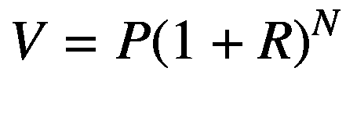
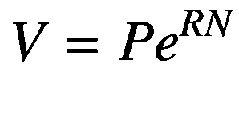
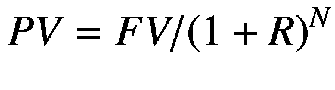

# 固定收益市场

固定收益市场是金融行业的重要组成部分，它为从业者带来了独特的挑战与机遇。养老基金及其他机构基金所管理的大量资金都配置于固定收益投资。由于固定收益具有可预测的现金流，与股票及更复杂的衍生品相比，保守型资金管理者将其视为更安全的投资选择。因此，传统机构在固定收益领域投入了大量时间和精力。

作为软件工程师，我们在固定收益市场工作的主要目标是定义计算策略并解决问题，从而帮助客户取得成功。`C++` 是一种特别适合解决该行业问题的语言，这得益于其灵活性以及在标准计算平台上的高性能表现。此外，`C++` 是一种高度可移植的语言，可在多种计算机系统中使用。

基于上述优势，`C++` 编程已广泛应用于这一金融领域，并且是银行、对冲基金、养老基金以及其他将固定收益作为主要投资工具的大型机构所偏爱的语言之一。多年来，使用 `C++` 的程序员开发出了具备固定收益分析实用功能的软件，例如计算现行利率和确定现金流估值。所有这些功能都需要借助本书后续章节探讨的技术，以惊人的速度执行。得益于其新标准 `C++20`，该语言如今更能满足金融行业提出的严格需求。

在本章中，我将简要介绍这一金融领域，并向你展示几个 `C++` 代码示例，这些示例可用于解决固定收益市场中最常见的一些编程问题。这些代码示例涵盖了涉及以下问题的解决方案：

*  单利计算
*  复利计算
*  现金流建模
*  确定现金流的现值
*  债券建模与估值

在本章的剩余部分，我还将说明为什么 `C++20` 可能是处理金融投资行业中编程问题的理想语言，特别是如何解决固定收益投资中的问题。然后，我将概括性地介绍固定收益投资中常见的问题，并概述固定收益市场的运作方式。接着，我将从几个编程示例入手，探索前面章节讨论的概念。

## 固定收益概述

我们以固定收益工具的总体概述开始讨论。虽然这不是一本关于金融或经济学的书，但掌握一些基本概念仍然很重要。我的总体目标是描述如何在解决本章后面部分讨论的实际计算问题时运用这些概念。

在固定收益投资中，双方之间会发生合同约定的交易。双方同意根据利率和现金交换的时间来交换现金流。固定收益投资种类繁多，但包括以下几种著名的投资工具类型：

*   **货币市场基金**：这些是短期投资，提供较低的收益率，但同时能让你方便地随时获取资金。货币市场基金的投资期限非常短，其回报率仅接近银行实行的即期利率。由于货币市场基金的回报率很低且长期难以预测，它们主要被用于其流动性。
*   **债券**：这是固定收益应用中的一大类。债券在明确规定的期限内支付预定的利率。它们由包括公司和各级政府在内的各种机构发行。例如，美国政府发行国债，这是全球使用的主要投资工具之一。
*   **定期存单**：这些是银行向零售客户发行的固定收益投资产品。它们是简单的投资工具，在预定期限（通常为 1 至 5 年）内支付固定利率。它们主要供那些无法进入更复杂固定收益市场、希望从自己的支票账户或储蓄账户进行投资的小型投资者使用。

投资者进入固定收益市场的主要原因是为了利用相对安全的投资机会，这类投资的回报是已知且可预测的。与股票市场相比，固定收益投资具有更容易分析的优点。这是事实，因为对于股权投资而言，实际上几乎不可能确定一家公司在几年后能赚多少钱。然而，对于债券这类固定收益投资，你拥有一份合同，该合同保证在指定期限内获得投资回报。

显然，此类固定收益投资也存在风险。一个众所周知的风险是，例如，发行债券的机构可能违约。在这种情况下，投资者可能会损失部分或全部投资。第二个重大风险（投资者常常忽略）是，投资期间的收益率可能无法应对通货膨胀。例如，如果年收益率为 6%，但通货膨胀率约为 4%，那么你的实际收益率仅为 2%（这还是税前回报）。

这一切都表明，分析固定收益投资并不像最初听起来那么简单。这不仅仅是找到支付最高利率的机构并将所有资金投入其债券的问题。这也是资金管理者需要可靠软件的原因之一，这些软件可用于决定在众多固定收益投资中哪个最佳。正如股票市场有成千上万种可能性需要仔细分析一样，固定收益行业也有海量的选择。软件开发者的主要任务之一是创建能够轻松追踪这些投资，并帮助为长期投资者选择正确选项的系统。

**注释**


## 固定收益投资

固定收益投资具有难以衡量的风险，因为这些风险取决于未来的经济环境。稳健的固定收益投资需要考虑其中涉及的多种风险。高质量的用于固定收益的`C++`软件可能有助于投资者考虑其中一些外部因素。

以下是本章中使用的关于固定收益投资的一些最重要概念。

* **利率**：在给定期间（通常为 1 年）内，以百分点表示的投资回报。固定收益投资将具有明确规定的、作为合同义务确定的利率。
* **本金**：原始固定收益贷款或投资的金额。对于债券等固定收益投资，这是计算利率的基础价值。
* **复利**：随着时间的推移而累积的利息，并在每个期间定期支付利息时计入本金。复利的金额由利息支付之间的间隔时间调节。
* **连续复利**：随着期数的增加，复利的效果变得更加显著。例如，在每月末支付的复利将比每年支付一次产生更多的利息。理论上，这种复利过程可以在连续的时间表上进行，并且可以使用一个简单的公式计算产生的复利，我将在本章后面解释这个公式。
* **现值**：当一组预定的现金流和利率被定义后，就可以计算这些现金流的现值。这是通过使用合同利率来确定每个未来现金流的折现值，并将所有这些价值相加来完成的。现值是比较两个现金流序列的一个非常强大的工具。

使用这些简单的概念，就有可能分析非常复杂的投资。你将在本章后面的编码示例中学习如何使用这些概念。

## 为什么要使用 C++

`C++`是一种已在各种金融应用中获得巨大成功的语言。它是华尔街公司用来创建快速、高性能代码的首选语言，这些代码可用于实现金融工程的高效算法。

尽管`C++`已经是一门拥有超过 30 年历史的成熟语言，并且此后出现了其他具有更易于使用的高级特性的编程语言，但`C++`仍然保持着作为高性能计算标准语言的地位。大型金融机构，如银行、对冲基金和养老基金，每天依赖`C++`解决其最复杂的计算问题，原因如下：

* **性能**：使用`C++`最明显的原因是它的性能。由于`C++`与其他高级语言相比运行时开销很小，因此可以用它来编写非常快速的软件。`C++`不仅默认情况下足够快，而且还允许专家级的`C++`程序员探索许多额外的底层代码优化技术，这些技术在`Java`和`Python`等语言中是不可用的。
* **标准合规性**：`C++`是一种标准语言，多年来由一个国际专家小组开发，其目标是在不带来通常与高级特性（如面向对象编程（`OOP`））相关的开销的情况下提供这些特性。作为标准化工作的结果，`C++`可用于从微控制器到最大服务器的各种平台。这意味着你可以跨平台运行未经修改的算法。这对金融算法来说是一个明显的优势，因为随着时间的推移，这类软件可以轻松移植到更快的架构上，以利用新硬件和软件设计的改进。
* **现有库**：`C++`为数值和金融编程提供了几乎无与伦比的库集。我们在本书中讨论的每个主题都有多个可用的库，可以节省时间和精力。
* **多范式语言**：开发者从一开始就设计`C++`语言以支持多种编程范式，因此程序员不需要改变算法的本质来适应特定的范式。例如，尽管`OOP`受到支持，但该语言并不强制使用`OOP`。这样，程序员可以自由地为所需的应用程序使用最具表现力的技术。
* **高级特性**：虽然`C++`允许程序员通过针对硬件的底层特性来实现高性能，但优秀的程序员仍然可以使用使`C++`成为真正现代语言的几个高级特性。例如，`C++`是最早接受`OOP`概念的语言之一，而`OOP`无疑是现代软件设计中最常见的范式。`C++`还开创了其他特性，如异常和基于模板的容器。最近，`C++`通过新的`C++11`语言标准融入了更多高级特性。自动类型检测、`lambda`表达式和用户自定义字面量只是新标准获批后应用程序开发者可以使用的少数新特性。

基于上述原因，程序员一直信任`C++`作为实现高性能金融算法的主要工具。在本书中，我们探讨利用了这些计算优势的代码示例。

像任何其他工具一样，`C++`也有其自身的问题。学习`C++`编程的一个主题是避免可能导致错误和不安全程序的危险做法。你将在后续章节中看到的大多数技术都采用了现代库，这不仅简化了创建`C++`程序的过程，还允许你创建设计良好且容错的软件。使用标准库（包括`STL`（标准模板库））是安全使用`C++`的最佳方式。

你还将学习如何使用通过`Boost`项目提供的高质量库。`Boost`库从头开始设计，以使用现代`C++`概念，从而简化新软件的创建。`Boost`库是一些最伟大的`C++`编程专家（包括参与`C++`标准委员会本身的人员）工作的成果。事实上，`Boost`附带的许多库已经成为标准库的一部分。因此，使用`Boost`库，你将提前获得一些将在语言未来版本中包含的特性。

## 计算单利

首先，我将向你展示如何解决固定收益分析中一个非常简单的问题，以此介绍我们在本书中使用的`C++`类设计的一些特性。

### 问题

利率决定了金融机构在持有一段时间的现金存款后将支付多少利息。给定利率和存款的初始价值，计算存款的未来价值，假设是单期存款。

### 解决方案

你只需要使用简单的单利计算公式，该公式由表达式给出：

```
V = P (1 + R)
```

在这个公式中，`V`是单期后的未来价值，`P`是存款的现值。使用这个公式，你可以计算单期的利率。


### 工作原理

清单 1-1 中定义的 `IntRateCalculator` 类，负责计算单期利率。

```
class IntRateCalculator {
public:
IntRateCalculator(double rate);
IntRateCalculator(const IntRateCalculator &v);
IntRateCalculator &operator =(const IntRateCalculator &v);
~IntRateCalculator();
double singlePeriod(double value);
private:
double m_rate;
};
清单 1-1
IntRateCalculator 类
```

首先，我们定义一个负责计算的新类。面向对象设计的一个基本原则是，将职责统一到定义明确的接口下。在创建 C++ 类时，你应该遵循这一原则，因为这将简化维护工作，避免代价高昂的错误。即使使用这种策略需要编写额外的代码，从长远来看，更高的组织性也会带来回报。

在定义 `IntRateCalculator` 类时，我们定义了构造函数、析构函数、拷贝构造函数和赋值运算符。如果你不自行定义这些方法，编译器会自动将它们添加到类中。然而，自己创建这些成员函数的版本是很有用的，因为这样你可以确保获得期望的行为，而不是编译器编写者认为正确的选择。

**注意**

你应该创建指定了由 C++ 编译器自动定义的四个基本成员函数的类。通过这种方式，可以确保创建的对象具有定义良好的生命周期，从而避免代价高昂的错误。未能提供此类成员函数可能会导致类无法正确响应诸如赋值（由赋值运算符定义）和拷贝构造等基本操作。如果你的类旨在作为其他类的基类，那么你还应该将析构函数设为虚函数，以便派生类能够正确释放它们使用的资源。这样，运行时系统就能正确检测对象的多态类型并调用正确的析构函数。

除非你在类声明中另有说明，否则编译器会自动添加以下成员函数：

*   **默认构造函数**：默认构造函数是自动添加的，即使类的编写者没有包含它，也可以使用 `new` 关键字创建对象。默认构造函数是没有参数的构造函数。但是，如果类声明中包含另一个需要参数的构造函数，则默认构造函数不会自动包含。例如，在我们的 `IntRateCalculator` 类中，构造函数接收一个参数，即利率。因此，默认构造函数不会被自动包含，这意味着要创建 `IntRateCalculator` 类的对象，程序员需要指定一个有效的利率参数。

*   **拷贝构造函数**：拷贝构造函数允许你创建同类的现有对象的副本。默认情况下，仅当类定义中没有其他构造函数时，它才会被包含。在我们的例子中，我们需要提供一个拷贝构造函数，以确保能够创建现有对象的副本。当需要将对象添加到容器（特别是 STL 提供的容器，如 `vector`、`map` 和 `multimap`）时，拷贝构造函数变得非常重要。

*   **析构函数**：析构函数定义了特定对象在被销毁后，其使用的资源如何被释放。为了避免对象中出现内存泄漏和其他我们不希望看到的资源泄漏，需要一个合适的析构函数。在 `IntRateCalculator` 类中，没有需要释放的内部或外部资源，但显式定义析构函数仍然是更好的做法。

*   **移动构造函数**：移动构造函数提供了在需要 C++ 移动语义时使用的操作。

*   **赋值运算符**：当两个相同类的对象之间发生赋值操作时，会使用此成员函数。定义此类型，你可以指定一个对象的内容如何传输到另一个对象：可以通过值传递，也可以通过引用传递。拷贝的其他细节，例如引用计数，也可以在赋值运算符中建立。

`singlePeriod` 成员函数封装了一个操作，用于返回一笔存款在单个周期后的未来价值。根据贷款结构或输入参数的不同，这可以指 1 个月或 1 年的利息。该成员函数的签名为：

```
double singlePeriod(double value);
```

这个简单版本的代码使用了 `double` 类型（而不是 `float`）以获得更高的精度。在接下来的章节中，我们将讨论如何处理浮点数固有的精度问题。

`IntRateCalculator` 类包含一个成员变量 `m_rate`，用于存储当前利率。这样，每次调用 `singlePeriod` 成员函数时就不需要再输入利率了。因此，要创建一个 `IntRateCalculator` 的新实例，你需要将利率作为参数提供给构造函数。

头文件 `IntRateCalculator.h` 将 `singlePeriod` 成员函数定义为内联函数（见清单 1-2）。

```
inline double IntRateCalculator::singlePeriod(double value)
{
double f = value * ( 1 + this->m_rate );
return f;
}
```

这里使用了关键字 `inline`，表示该成员函数应该被直接嵌入到调用它的代码中。这意味着调用此函数没有性能损失，因为函数调用将从执行代码中移除，而方法的内容将被直接替换。可以将其视为一种实现宏性能的方式，同时拥有编译器对函数调用的全部支持。在追求高性能的 C++ 代码中，经常可以看到成员函数被定义为内联函数，以达到比等效的成员函数调用更高的性能。这种灵活性是 C++ 区别于其他语言的特点之一，在其他语言中很难达到类似的性能。

### 完整代码

```
//
//  IntRateCalculator.h
#ifndef __FinancialSamples__IntRateCalculator__
#define __FinancialSamples__IntRateCalculator__
#include 
class IntRateCalculator {
public:
IntRateCalculator(double rate);
IntRateCalculator(const IntRateCalculator &v);
IntRateCalculator &operator =(const IntRateCalculator &v);
~IntRateCalculator();
double singlePeriod(double value);
private:
double m_rate;
};
inline double IntRateCalculator::singlePeriod(double value)
{
double f = value * ( 1 + this->m_rate );
return f;
}
#endif /* defined(__FinancialSamples__IntRateCalculator__) */
//
//  IntRateCalculator.cpp
#include "IntRateCalculator.h"
IntRateCalculator::IntRateCalculator(double rate)
: m_rate(rate)
{
}
IntRateCalculator::~IntRateCalculator()
{
}
IntRateCalculator::IntRateCalculator(const IntRateCalculator &v)
: m_rate(v.m_rate)
{
}
IntRateCalculator &IntRateCalculator::operator=(const IntRateCalculator &v)
{
if (&v != this)
{
this->m_rate = v.m_rate;
}
return *this;
}
//
//  main.cpp
#include "IntRateCalculator.h"
#include 
// the main function receives parameters passed to the program
int main(int argc, const char * argv[])
{
if (argc != 3)
{
std::cout   " << std::endl;
return 1;
}
double rate = atof(argv[1]);
double value = atof(argv[2]);
IntRateCalculator irCalculator(rate);
double res = irCalculator.singlePeriod(value);
std::cout << " result is " << res << std::endl;
return 0;
}
清单 1-2
IntRateCalculator.h
```


### 使用示例

首先，你需要使用你喜欢的 C++编译器编译代码。例如，在 UNIX 平台上，使用提供的`makefile`，只需运行`make`命令，结果如下：

```
$ make
gcc –c IntRateCalculator.cpp
gcc –c main.cpp
gcc –o intrate IntRateCalculator.o main.o
```

现在，你可以通过传入给定的利率和初始值来运行该程序。例如，可以输入以下内容：

```
./intrate 0.08 10000
result is 10800
```

这表明，在单一周期后，本金 10,000 美元以 8%利率投资后的未来价值为 10,800 美元。

## 复利

你可以使用单利来分析单期现金流。然而，大多数金融操作，如贷款，都涉及多个周期。为此，你需要考虑复利。

### 问题

计算给定本金在 N 个时间周期后累积的复利。

### 解决方案

解决方案使用一个新的 C++类来封装复利的概念。通过这个类，利用两个成员函数可以轻松回答所提出的问题。第一个函数`multiplePeriod()`返回固定收益投资在给定周期数（作为函数参数传入）后的未来价值。

如前所述，利息可以按离散复利或连续复利过程计算。对于离散复利，我们假设利息仅在投资工具定义的固定间隔支付。当利息加入原始本金时，复利便发生了。

离散复利利率的计算公式为



其中`P`是现值，`V`是未来价值，`R`是利率，`N`是周期数。利率作为参数传递给类构造函数，并作为成员变量存储。周期数`N`作为第二个参数传递给`multiplePeriod()`方法。

对于连续复利计算，你需要使用另一个方法`continuousCompounding()`。在这种情况下，我们假设复利并非以离散步骤发生，而是随时间连续支付。这是确定金融应用未来价值（或至少是期望未来价值的上限）的一种可行方法。

连续复利利率的计算公式为



这里，`V`是期望的未来价值，`P`是现值，`R`是周期内的利率，`N`是周期数。例如，要计算在每年 8%利率下，连续复利 2 年后的未来价值，你应该使用带参数`R = 0.08`和`N = 2`的上述公式。

### 工作原理

两个成员函数`multiplePeriod()`和`continuousCompounding()`使用标准 C++库中的数学函数`pow()`和`exp()`来计算给定的公式。这两个函数分别实现了快速计算幂函数和指数函数的方法。

要使用标准库中的任何数学函数，你应首先包含头文件`cmath`。表 1-1 提供了该头文件提供的一些数学函数的简要列表。

**表 1-1** 标准库中的部分数学函数

| 函数 | 对应的数学运算 |
| --- | --- |
| `exp` | 指数函数（自然底数） |
| `pow` | 幂函数 |
| `log` | 自然对数函数 |
| `log10` | 以 10 为底的对数函数 |
| `sqrt` | 平方根函数 |
| `sin` | 正弦函数 |
| `cos` | 余弦函数 |
| `tan` | 正切函数 |
| `acos` | 反余弦函数（余弦的逆函数） |
| `asin` | 反正弦函数（正弦的逆函数） |
| `atan` | 反正切函数（正切的逆函数） |
| `ceil` | 向上取整函数（比参数大的最小整数） |
| `floor` | 向下取整函数（比参数小的最大整数） |
| `fabs` | 浮点数的绝对值 |

应尽可能使用标准库提供的数学函数，而非自定义版本，原因如下：

- **兼容性**：使用标准库的函数能保证在任何实现该库的编译器中均可使用。
- **性能**：标准库中的函数由编译器厂商作为其软件包的一部分实现。这些数学函数的代码通常针对特定架构进行了优化，这通常能带来更好的性能。

### 完整代码

代码清单 1-3 展示了类`CompoundIntRateCalculator`的实现，分为一个头文件和一个实现文件。我还提供了一个示例`main()`函数，展示了如何使用该类。

```
//
//  CompoundIntRateCalculator.h
#ifndef __FinancialSamples__CompoundIntRateCalculator__
#define __FinancialSamples__CompoundIntRateCalculator__
class CompoundIntRateCalculator {
public:
CompoundIntRateCalculator(double rate);
CompoundIntRateCalculator(const CompoundIntRateCalculator &v);
CompoundIntRateCalculator &operator =(const CompoundIntRateCalculator &v);
~CompoundIntRateCalculator();
double multiplePeriod(double value, int numPeriods);
double continuousCompounding(double value, int numPeriods);
private:
double m_rate;
};
#endif /* defined(__FinancialSamples__CompoundIntRateCalculator__) */
//
//  CompoundIntRateCalculator.cpp
#include "CompoundIntRateCalculator.h"
#include 
CompoundIntRateCalculator::CompoundIntRateCalculator(double rate)
: m_rate(rate)
{
}
CompoundIntRateCalculator::~CompoundIntRateCalculator()
{
}
CompoundIntRateCalculator::CompoundIntRateCalculator(const CompoundIntRateCalculator &v)
: m_rate(v.m_rate)
{
}
CompoundIntRateCalculator &CompoundIntRateCalculator::operator =(const CompoundIntRateCalculator &v)
{
if (this != &v)
{
this->m_rate = v.m_rate;
}
return *this;
}
double CompoundIntRateCalculator::multiplePeriod(double value, int numPeriods)
{
double f = value * pow(1 + m_rate, numPeriods);
return f;
}
double CompoundIntRateCalculator::continuousCompounding(double value, int numPeriods)
{
double f = value * exp(m_rate * numPeriods);
return f;
}
//
//  main.cpp
#include "CompoundIntRateCalculator.h"
#include 
// the main function receives parameters passed to the program
int main(int argc, const char * argv[])
{
if (argc != 4)
{
std::cout   " << std::endl;
return 1;
}
double rate = atof(argv[1]);
double value = atof(argv[2]);
int num_periods = atoi(argv[3]);
CompoundIntRateCalculator cIRCalc(rate);
double res = cIRCalc.multiplePeriod(value, num_periods);
double contRes = cIRCalc.continuousCompounding(value, num_periods);
std::cout << " future value for multiple period compounding is " << res << std::endl;
std::cout << " future value for continuous compounding is " << contRes << std::endl;
return 0;
}
```

**代码清单 1-3** `CompoundIntRateCalculator.h`

### 使用示例

代码清单 1-3 中的代码可以编译成可执行文件，并从命令行运行。该程序期望三个参数：利率、投资的现值以及复利的周期数。

以下是其使用示例：

```
$ ./compound 0.05 1000 4
future value for multiple period compounding is 1215.51
future value for continuous compounding is 1221.4
```

正如预期，连续复利返回的值略高于离散复利计算出的值。


## 现金流建模

思考固定收益投资的一种更通用的方式是审视双方之间交换的现金流。现金流是一系列在指定时间段内安排的付款。显然，两个实体之间的现金流价值在某种程度上应该相等。在本节中，您将学习如何判断一组现金流是否等价。

### 问题

计算两笔现金流的现值，并判断它们是否等价。

### 解决方案

现金流是比较两种或多种固定收益投资的基本工具。现金流确立了双方之间的资金转移顺序。表示这些资金交换的传统方式是使用正值和负值。

例如，考虑一笔常见的贷款，其中客户以给定的利率请求一定金额。客户将在贷款期限内进行一系列现金支付。在交易结束时，双方进行的付款应该等价。

这种等价关系是通过*现值*的概念来建立的。未来一笔付款的现值需要根据适用于该相同数值的利率进行折现。换句话说，折现是与复利相反的概念。

#### 计算现值

投资的一个普遍原则是，今天口袋里的钱比未来收到的同等金额更有价值。这一普遍原则可以利用基于利率的复利知识进行量化。固定收益投资的现值，是在考虑并折现了相应利息后，对应于未来发生的现金流总和的价值。

未来付款的现值（`PV`）公式由下式确定：



在此等式中，`PV` 是所求的现值，`FV` 是我们要折现的未来价值，`R` 是利率，`N` 是现值与未来价值之间的期数。

如您所见，`PV` 的公式是复利计算的逆运算。这清楚地表明，当从已知的未来价值出发时，我们只是在使用类似的过程来确定现值。

#### 在 C++ 中计算现值

任何金融工程书籍中都可以找到计算 `PV` 的公式。然而，对于 C++ 程序员来说，对此主题的主要兴趣集中在如何高性能地执行 `PV` 计算。标准的做法是使用正负号来表示双方支付的数值。例如，我们可以将初始贷款记为负数，将贷款的每笔还款记为正数。使用这种方法，要使双方的现金流等价，所有资金转移的现值之和必须为零。

这是接下来介绍的 `CashFlowCalculator` 类所使用的方法。以下是该类的定义。

```cpp
class CashFlowCalculator {
public:
// 构造函数
void addCashPayment(double value, int timePeriod);
double presentValue();
private:
std::vector m_cashPayments;
std::vector m_timePeriods;
double m_rate;
double presentValue(double futureValue, int timePeriod);
};
```

`addCashPayment` 方法用于向所需的现金流中添加新的付款。参数是付款的数值，第二个参数是此付款发生的时间段。如前所述，根据付款发起方的不同，该值为正或为负。数据存储在两个向量中：`m_cashPayments` 和 `m_timePeriods`，使用了 STL 的 vector 模板。

此类中的 `presentValue` 方法用于计算当前对象中存储的整个现金流的 `PV`。这是通过确定 `m_cashPayments` 向量中存储的每笔资金交换的 `PV`，最后将这些值累加到 `total` 变量中来实现的。

```cpp
double CashFlowCalculator::presentValue()
{
double total = 0;
for (int i=0; i<m_cashPayments.size(); ++i)
{
total += presentValue(m_cashPayments[i], m_timePeriods[i]);
}
return total;
}
```

辅助成员函数 `presentValue(double, int)` 用于计算单笔付款的 `PV`。它是使用前述公式定义的。

```cpp
double CashFlowCalculator::presentValue(double futureValue, int timePeriod)
{
double pValue = futureValue / pow(1+m_rate, timePeriod);
std::cout << " value " << pValue << std::endl;
return pValue;
}
```

#### 使用 STL 容器

使用 vector 容器使得 `CashFlowCalculator` 类中的代码更加简洁。在现代 C++ 应用程序中，`std::vector<>` 模板用于存储需要随机访问的有序元素序列。与传统的 C 和 C++ 数组（在作为参数传递给函数时会退化为指针）不同，vector 是一个对象，它在 vector 使用的整个期间内都会保持其属性（如 `size`）。vector 还知道如何自行清理，从而避免了旧式 C++ 应用程序中常见的内存泄漏。

要在 C++ 应用程序中使用 vector，您需要通过将元素类型作为参数传递给 vector 模板来声明对象。因此，`std::vector<int>` 将创建一个包含 `int` 类型元素的 vector。vector 模板类提供了可用于操作和检索元素信息的成员函数。

*   `size`：返回存储在 vector 对象中的元素数量。
*   `push_back`：复制作为参数传入的对象，并将其存储在 vector 的末尾。如有必要，会为新元素分配额外的内存，这可能需 O(n) 时间。
*   `pop_back`：从 vector 中移除最后一个元素，并撤销 `push_back` 所做的更改（释放的内存除外）。
*   `operator[]`：提供对 vector 内容的访问，使用的语法类似于访问传统的 C++ 数组。

vector 模板只是 C++ 开发者可用的众多 STL 容器之一。随着新的模板被添加到标准库中，完整的列表会发生变化，但表 1-2 列出了最常用的容器。

**表 1-2** STL 提供的常用容器

| 容器 | 描述 |
| --- | --- |
| `vector` | 具有恒定随机访问时间的有序元素集合 |
| `queue` | 元素从尾部添加、从头部移除的容器 |
| `map` | 将键与其关联元素连接起来的关联容器 |
| `multimap` | 将键与一组关联元素连接起来的关联容器 |
| `list` | 元素的链表，可在任何位置提供恒定时间的插入/删除操作 |
| `stack` | 一种专用容器，只允许添加和移除最后一个元素（栈顶） |


### 完整代码

清单 1-4 展示了类 `CashFlowCalculator` 的代码。代码分为一个头文件和一个实现文件。你可以在“运行代码”一节的示例中查看如何使用该代码。

```
//
//  CashFlowCalculator.h
#ifndef __FinancialSamples__CashFlowCalculator__
#define __FinancialSamples__CashFlowCalculator__
#include 
class CashFlowCalculator {
public:
CashFlowCalculator(double rate);
CashFlowCalculator(const CashFlowCalculator &v);
CashFlowCalculator &operator =(const CashFlowCalculator &v);
~CashFlowCalculator();
void addCashPayment(double value, int timePeriod);
double presentValue();
private:
std::vector m_cashPayments;
std::vector m_timePeriods;
double m_rate;
double presentValue(double futureValue, int timePeriod);
};
#endif /* defined(__FinancialSamples__CashFlowCalculator__) */
//
//  CashFlowCalculator.cpp
#include "CashFlowCalculator.h"
#include 
#include 
CashFlowCalculator::CashFlowCalculator(double rate)
: m_rate(rate)
{
}
CashFlowCalculator::CashFlowCalculator(const CashFlowCalculator &v)
: m_rate(v.m_rate)
{
}
CashFlowCalculator::~CashFlowCalculator()
{
}
CashFlowCalculator &CashFlowCalculator::operator =(const CashFlowCalculator &v)
{
if (this != &v)
{
this->m_cashPayments = v.m_cashPayments;
this->m_timePeriods = v.m_timePeriods;
this->m_rate = v.m_rate;
}
return *this;
}
void CashFlowCalculator::addCashPayment(double value, int timePeriod)
{
m_cashPayments.push_back(value);
m_timePeriods.push_back(timePeriod);
}
double CashFlowCalculator::presentValue(double futureValue, int timePeriod)
{
double pValue = futureValue / pow(1+m_rate, timePeriod);
std::cout 
// 主函数接收传递给程序的参数
int main(int argc, const char * argv[])
{
if (argc != 2)
{
std::cout " > period;
if (period == -1) {
break;
}
double value;
std::cin >> value;
cfc.addCashPayment(value, period);
} while (1);
double result = cfc.presentValue();
std::cout << " 现值为 " << result << std::endl;
return 0;
}
清单 1-4
CashFlowCalculator.h
```

### 运行代码

该程序可以使用符合标准的 C++ 编译器进行编译，例如 Linux 或 Mac OS X 上的 GCC。编译后的程序可以通过以下方式运行：

```
./presentValue 0.08
1 200
2 300
3 500
4 -1000

value 190.476
value 272.109
value 431.919
value -822.702
The present value is 71.8014
```

前几行显示了程序的输入内容。命令行参数（本例中为 `0.08`）是所需的利率——它被用作类构造函数的参数。接下来的几行是时间周期和付款值的序列。序列的最后一行用数字 `-1` 标记。当读取到此数字时，程序停止读取输入，并开始按照接收顺序计算给定现金流的现值。

最后几行显示程序的输出结果。代码会打印现金流中每个组成部分的现值。最后，它会打印整个付款序列的现值。要使用此程序验证常见的固定收益工具（如贷款），你应该输入每对时间周期-付款值。计算结束时，现值应合计为零（或由于可能的数值不准确性而接近于零）。

## 债券建模

债券是一种非常常见的固定收益工具。全球的大型企业和政府都使用它们来吸引长期偿还的现金投资。作为交换，它们提供定期票息的保证支付。大多数债券的到期时间（即付清时间）在 5 到 30 年之间。

### 问题

创建一个 C++ 类来模拟债券工具并确定其年利率。

### 解决方案

债券的结构是这样的：投资者在债券期限开始时存入本金。通常，本金在到期时全额偿还。在初始投资和到期日之间的这段时间内，投资者会获得一个固定值，也称为票息价值，它决定了债券支付的利率。

例如，考虑一笔面值 $100,000、为期 30 年、年票息为 $5,000 的 XYZ 公司债券投资。这相当于一项固定收益投资，对本金支付 5% 的利息。XYZ 公司有权在规定期限内使用本金，而本金总额将在 30 年后到期时返还给投资者。

要使用 C++ 对此类投资进行建模，你可以创建一个包含所需信息的类，例如本金、票息价值和到期期限。该类的声明如下：

```
class BondCalculator {
public:
BondCalculator(const std::string institution, int numPeriods, double principal, double couponValue);
BondCalculator(const BondCalculator &v);
BondCalculator &operator =(const BondCalculator &v);
~BondCalculator();
double interestRate();
private:
std::string m_institution;
double m_principal;
double m_coupon;
int m_numPeriods;
};
```

此类拥有成员变量，用于存储发行该债券的机构名称（称为发行人）、所投资的本金、票息金额以及期数（通常以年为单位）。该类可用于记录债券投资信息，作为跟踪此类固定收益投资的应用程序的一部分。`interestRate` 方法可用于返回票息所隐含的内部收益率。

### 完整代码

清单 1-5 展示了类 `BondCalculator` 的完整代码。代码分为一个头文件和一个实现文件。你也可以在 `main` 函数中查看一个示例用法。

```
//
//  BondCalculator.h
#ifndef __FinancialSamples__BondCalculator__
#define __FinancialSamples__BondCalculator__
class BondCalculator {
public:
BondCalculator(const std::string institution, int numPeriods, double principal, double couponValue);
BondCalculator(const BondCalculator &v);
BondCalculator &operator =(const BondCalculator &v);
~BondCalculator();
double interestRate();
private:
std::string m_institution;
double m_principal;
double m_coupon;
int m_numPeriods;
};
#endif /* defined(__FinancialSamples__BondCalculator__) */
//
//  BondCalculator.cpp
#include "BondCalculator.h"
BondCalculator::BondCalculator(const std::string institution, int numPeriods,
double principal, double couponValue)
: m_institution(institution),
m_numPeriods(numPeriods),
m_principal(principal),
m_coupon(couponValue)
{
}
BondCalculator::BondCalculator(const BondCalculator &v)
: m_institution(institution),
m_numPeriods(v.m_numPeriods),
m_principal(v.m_principal),
m_coupon(v.m_coupon)
{
}
BondCalculator::~BondCalculator()
{
}
BondCalculator &BondCalculator::operator =(const BondCalculator &v)
{
if (this != &v)
{
this->m_institution = v.m_institution;
this->m_principal = v.m_principal;
this->m_numPeriods = v.m_numPeriods;
this->m_coupon = v.m_coupon;
}
return *this;
}
double BondCalculator::interestRate()
{
return m_coupon / m_principal;
}
// 主函数接收传递给程序的参数
int main(int argc, const char * argv[])
{
if (argc != 4)
{
std::cout    "
<< std::endl;
return 1;
}
std::string issuer = argv[1];
double principal = atof(argv[2]);
double coupon = atof(argv[3]);
int num_periods = atoi(argv[4]);
BondCalculator bc(issuer, principal, coupon, num_periods);
std::cout << "正在读取由 " << issuer << " 发行的债券信息" << std::endl;
std::cout << " 内部收益率为 " << bc.interestRate() << std::endl;
return 0;
}
清单 1-5
BondCalculator.h
```


### 运行代码

该代码可使用符合标准的 C++ 编译器进行编译。它已在 Linux 和 Mac OS X 上测试通过。您可以在首选终端中使用以下命令运行程序：

```
$ ./bondCalculator XYZ 100000 5000 20
reading information for bond issued by XYZ
the internal rate of return is 0.5
```

粗体显示的第一行是您需要执行的命令。参数依次为：发行机构名称、债券总本金、定期票息价值以及该投资的时间周期数。

程序输出显示根据票息价值计算得出的收益率。`BondCalculator` 类现在可用于更大的应用程序中，以存储此类固定收益投资的信息。

## 进一步参考

本章介绍了固定收益投资这一通用主题的入门知识。虽然我们主要关注该领域中涉及的 C++ 编程问题，但有几本书籍可以帮助您更深入地理解此处介绍的金融工程技术。

以下书籍仅供参考，您可以自行探索，以更好地理解固定收益投资的世界。

*   *《投资科学》*，作者：David Luenberger（牛津大学出版社，1998 年）：这是一本本科级别的书籍，描述了投资的基本理论。书中大部分内容解释了固定收益投资的基础知识，包括最常见问题的算法。
*   *《投资学》*，作者：Zvi Bodie、Alex Kane 和 Alan Marcus（McGraw-Hill/Irwin，2004 年）：这是一本关于投资理论的标准教科书，除其他主题外，还解释了固定收益投资背后的理念。
*   *《金融数学》*，作者：Marek Carpinski 和 Tomasz Zastawniak（Springer，2011 年）：这本书更适合数学爱好者。它不仅解释了固定收益投资的基础知识，还提供了许多在其分析中有用的数学方法。

### 结论

在本章中，我介绍了固定收益投资这一主题，以及如何使用 C++ 代码对其进行建模和分析。本章的第一部分解释了固定收益投资背后的一般概念。与股票和衍生品市场相比，这些投资被用作一种相对安全的保值和创富方式。

我还解释了为什么 C++，特别是其当前标准 C++20，是为此金融领域的问题创建计算解决方案的理想编程语言。由于其性能特性和高级编程支持，C++ 在表现力和原始速度之间提供了最佳平衡。因此，C++ 已成为金融领域核心应用开发的事实标准，尤其是在处理固定收益数据的应用中。

第一个示例介绍了一个可用于计算简单利率的基本类。它不仅介绍了利率计算方法的概念，还介绍了在现代 C++ 中设计和编码此类解决方案的典型方式。

第二个示例介绍了复利利率的概念，包括离散和连续区间。您在其中学习了如何使用标准 C++ 库函数创建一个 C++ 类来计算这种利率。我总结了此类数学函数及其在 C++ 程序中的使用方法。

本章中的第三个示例探讨了现金流及其相应现值（PV）的重要概念。PV 的计算是比较两个或多个固定收益投资的核心。通过使用利率公式的逆运算，您可以确定给定的一组现金流在当前的真实价值。您学习了如何使用一个新的 C++ 类来解决这类问题。

最后，本章解释了债券如何在金融应用中使用，并展示了一个用于对这些投资进行建模的类。在未来的章节中，您将了解更多关于将这些金融工具作为投资组合一部分进行计算时所面临的挑战。

在下一章中，我将介绍金融投资领域的另一个重要部分：股票市场。您将看到一些在这些市场中可能有用的编程技巧，同时也会介绍我们将在本书后半部分探讨的其他重要概念。

