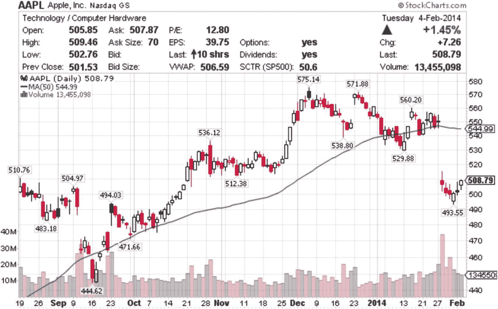
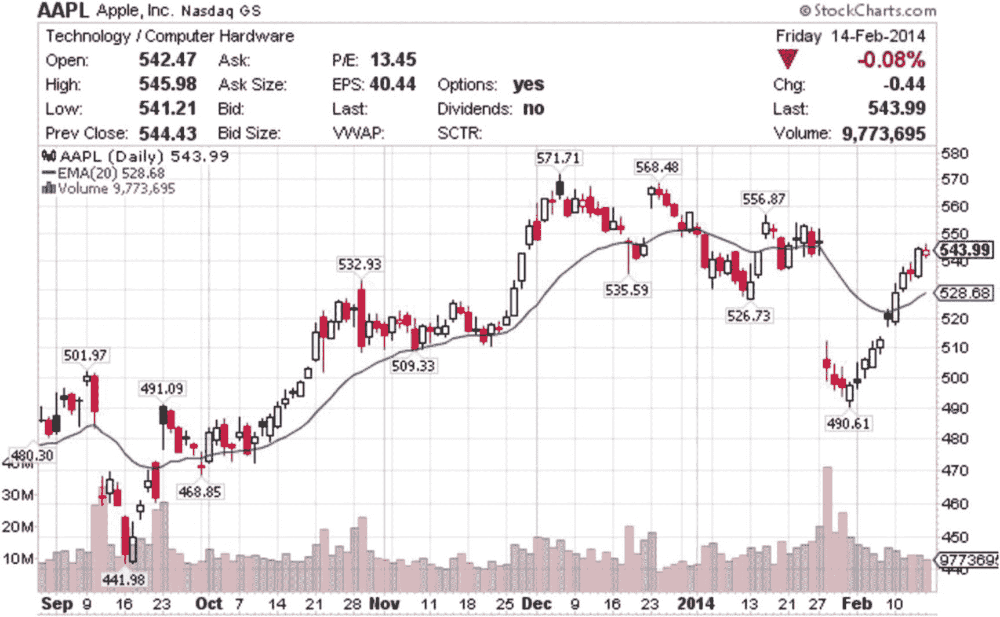
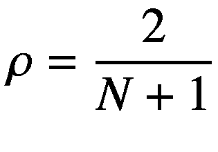
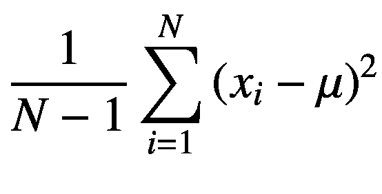
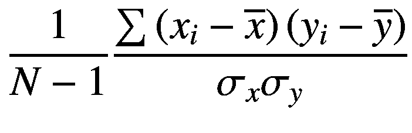
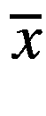
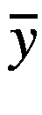
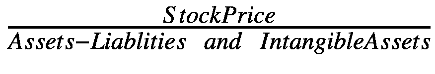
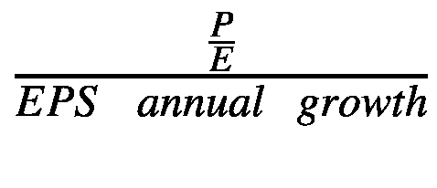
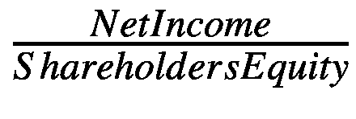

# 2. 股票市场

持有公司利润的股份是投资和创造财富最常见的方式之一。许多发家致富的人都是通过创建或收购一家成功公司的股权来实现的。这就是股票市场在所有类型的投资者中如此受欢迎的原因。此外，股票市场非常庞大，为每个愿意参与的人提供了机会：从小投资者到大型对冲基金，您都能找到适合每种参与者的投资风格。

对于软件工程师来说，股票市场也是一个激动人心的领域，因为它提供了大量应用计算技术（可用 C++ 实现）的机会。软件工程师也是市场分析师和广大投资者的重要盟友，在建模市场数据和设计快速准确交易决策所需的算法等关键活动中提供帮助。

由于其规模庞大，股票市场是多方面的，并提供了种类繁多的投资工具。从小型股股票到蓝筹股、交易所交易基金（ETF）、股票和指数期权以及其他衍生品，存在着大量的机会来运用投资算法，以便在市场上获得优势。因此，（来自银行和其他投资机构的）巨大动力也促使人们应用高速 C++ 编程技术来解决这些问题。

在本章中，我们针对股票市场及其衍生品中出现的一些精选问题提供 C++ 代码。我们将考虑以下金融编程主题：

*   计算简单移动平均线
*   计算指数移动平均线
*   计算波动率
*   计算股票工具的相关系数
*   建模和计算基本面指标

## 股票市场概念

股票市场的存在是为了促进股权类投资的交易。股权投资的目的是将资金直接或间接配置到公司股票上，这赋予买方公司一定份额的所有权。这种投资背后的理念是从该特定投资工具所代表的机构的增长中获利。例如，购买 IBM 的股票就拥有了该公司的一小部分所有权，以及与该所有权相关的未来利润。

直接持有股票是股权投资最简单的例子。任何拥有经纪账户的人都可以购买上市公司的股票，即那些在公开市场上出售其股票的公司。个人投资者可以利用他们的交易账户或退休账户，投资于美国和国际市场上成千上万家上市公司中的任何一家。

然而，直接控制一家公司的股票并不是参与股票市场的唯一（甚至不是最简单的）方式。如今有大量产品提供替代性的股权投资方式。这包括共同基金、ETF、指数基金、期权以及其他更奇特的衍生品。如何从如此众多的可交易品种中选择合适的工具，是资金管理者和个人投资者面临的众多问题之一。


### 市场参与者

股票市场由众多参与者构成。他们目标各异、利益不同；然而，他们持续运作以维持市场价格，同时试图从中获利。

大型机构在股票市场中占据了相当大的一部分。这些大型卖方投资机构（例如投资银行和交易所）被视为市场的支柱。因此，它们通常也被称为做市商。这些大型公司每天买卖大量股票投资工具（例如股票），目标是在每笔操作中获取微薄利润。近年来，高频交易也加入了这一图景，导致市场交易量和交易速度双双提升。

以下是股票市场中最常见参与者的简要列表：

-   **共同基金**：这些基金接收来自散户投资者和机构的投资，并在它们认为可能产生高于平均回报的市场领域进行投资。共同基金大多仅限于购买股票和 ETF，因此当市场处于下跌趋势时，它们的表现会受到限制。

-   **对冲基金**：对冲基金使用更高级的技术，例如做空股票、购买普通投资者无法获得的期权和期货等风险较高的投资工具，因此它们仅限于能够承受更高风险的较富裕投资者和某些类型的机构。

-   **投资银行**：这些机构积极参与市场构成。例如，它们负责将新股（也称为 IPO）引入市场，供其他投资者交易。它们也可以为自己和其他大客户进行交易。

-   **高频交易基金**：这些基金使用高性能计算技术为市场提供即时流动性，同时在大量交易中获取微薄利润。

-   **经纪公司**：这些公司直接与个人投资者打交道，提供买卖股票、ETF、共同基金和期权的能力，每笔交易收取少量佣金甚至免佣金。其服务通过互联网在桌面、网页浏览器和移动设备等多个平台上提供。

-   **养老基金**：这些机构持有来自退休基金的大规模资金池。它们专注于长期投资，以支持基金在较长时期内实现预期增长。

-   **散户投资者**：这些是拥有经纪账户的个人，他们自行研究并自行决定在市场上买卖什么。

如您所见，股票市场中存在激烈的利润竞争。大多数大型机构在研究上投入巨资，以期在市场的未来走势上获得优势。这种分析方法依赖于准确的信息和即时获取交易数据的能力，而这只有通过计算机软件提供的计算能力才能实现，其中大部分软件是用 C++等语言编写的。

在接下来的几节中，我将提供针对股票投资分析中常见问题的 C++示例。您将学习到可用于涉及股票投资的多种情况的工具和概念。

## 移动平均线计算

### 问题

给定特定的股票投资，确定一系列收盘价的简单移动平均线和指数移动平均线。

### 解决方案

分析股票和 ETF 等权益工具最常用的策略之一是使用供需方法，将价格和成交量视为需要观察的重要变量。使用基于价格/成交量策略的交易者将这套方法称为技术分析（TA）。通过技术分析，交易者关注由先前价格变动定义的特殊价格点，例如支撑位、阻力位、趋势线和移动平均线，其目的是识别更有可能盈利的价格区域。

例如，支撑位和阻力位通常用于确定对特定工具而言重要的价格区域。如果一只股票在上涨过程中达到某个价格并反转方向，那么该高点价格就被视为阻力价格。未来，当价格再次达到相同区域时，交易者倾向于在该区域附近卖出，从而形成更强的阻力点。类似地，当交易者在公认区域买入相同的股票或 ETF 时，就会形成支撑价格。

移动平均线也会出现类似类型的模式。买方和卖方倾向于查看移动平均线，以确定特定股票处于低风险的买入点还是卖出点。这些心理价格点具有自我强化的作用，并在股票交易的动态中扮演着重要角色。图 2-1 展示了一个用于分析苹果公司普通股的移动平均线示例。



图 2-1

苹果公司（AAPL）每日价格的简单移动平均线，参数为 50

移动平均线可以使用简单的平均公式计算，该公式对每个新周期重复应用。给定价格`p1`、`p2`、...、`pN`，特定时间段的通用公式如下：

```
MA = (1/N) (p1 + p2 + ... + pN)
```

如果您在序列中添加新值时维护并更新价格序列，则可以轻松执行此计算。

要在 C++中计算移动平均线，我们首先创建一个新类，该类使用 STL（标准模板库）向量对象存储一个价格序列。该对象负责使用`addPriceQuote`成员函数向序列中添加新值。该成员函数的实现很简单，因为它依赖于`std::vector`提供的功能来维护数字序列以及存储要求。

```
void MACalculator::addPriceQuote(double close)
{
m_prices.push_back(close);
}
```

移动平均线计算的周期数由`MACalculator`类的构造函数参数确定。例如，要计算 20 个时间段（当周期为单个交易日时，通常相当于 4 个交易周）的移动平均线，可以按如下方式创建`MACalculator`类的对象：

```
MACalculator calculator(20); // 将计算 20 个周期的移动平均线。
```

简单移动平均线的计算由`MACalculator`类的`calculateMA`成员函数执行。该函数的主要思想是遍历存储在`MACalculator`类中的价格序列，如以下代码所示：

```
std::vector MACalculator::calculateMA()
{
std::vector ma;
double sum = 0;
for (int i=0; i= m_numPeriods)
{
ma.push_back(sum / m_numPeriods);
sum -= m_prices[i-m_numPeriods];
}
}
return ma;
}
```

要计算移动平均线，观察值的数量至少需要达到周期数（设 N 为周期数）。因此，价格向量的前 N 个元素不生成对应的移动平均值。这些初始元素只是被添加到局部变量`sum`中，它们的值将在之后被使用。


对于第 N 个位置之后的每个元素，都可以计算其移动平均值。这通过求前 N 个元素的总和并除以 N 来实现。计算得到的值会被追加到移动平均值的向量中。最后，需要更新变量`sum`，以便从总和中移除 N 元素序列中的第一个元素。当算法减去`m_prices[i-m_numPeriods]`的值时，就会执行此操作，为下一次迭代做准备。

指数移动平均线（EMA）与简单移动平均线不同，因为每个新值都要乘以一个因子。与旧观察值相比，该因子用于赋予新值更大的权重。因此，EMA 对观察值的变化更敏感，并且能够更早、更准确地指示新趋势。如果你希望快速发现趋势变化，这便是一个优势。以下是我使用的代码：

```
std::vector MACalculator::calculateEMA()
{
std::vector ema;
double multiplier = 2.0 / (m_numPeriods + 1);
// 计算移动平均线，以确定对应于给定周期数的第一个元素
std::vector ma = calculateMA();
ema.push_back(ma.front());
// 对于每个剩余的元素，计算加权平均值
for (int i=m_numPeriods+1; i<m_prices.size(); ++i)
{
double val = (1-multiplier) * ema.back() + multiplier * m_prices[i];
ema.push_back(val);
}
return ema;
}
```

计算初始部分与简单移动平均线类似。使用`sum`变量累加值，直到至少观察到 N 个值。这被用作 EMA 的初始值。不同的 EMA 实现会使用其他方式来初始化序列，但经过几次迭代后，结果会收敛到相同的值。你可以在图 2-2 中看到一个 EMA 的图形示例。



图 2-2

参数为 20 天的指数移动平均线

EMA 计算的主要步骤是添加由乘数加权的新值。EMA 计算的默认乘数 *r* 由下式给出



该乘数赋予新值更大的权重，从而使 EMA 对价格变化的反应比简单移动平均线更灵敏。

### 完整代码

在代码清单 2-1 中，你可以看到简单移动平均线和 EMA 的完整实现。我还展示了一个示例`main`函数，它负责从标准输入读取一些数据点并计算相应的移动平均线。

```
//
//  MACalculator.h
#ifndef __FinancialSamples__MACalculator__
#define __FinancialSamples__MACalculator__
#include 
class MACalculator {
public:
MACalculator(int period);
MACalculator(const MACalculator &);
MACalculator &operator = (const MACalculator &);
~MACalculator();
void addPriceQuote(double close);
std::vector calculateMA();
std::vector calculateEMA();
private:
// 计算中使用的周期数
int m_numPeriods;
std::vector m_prices;
};
#endif /* defined(__FinancialSamples__MACalculator__) */
//
//  MACalculator.cpp
#include "MACalculator.h"
#include 
MACalculator::MACalculator(int numPeriods)
: m_numPeriods(numPeriods)
{
}
MACalculator::~MACalculator()
{
}
MACalculator::MACalculator(const MACalculator &ma)
: m_numPeriods(ma.m_numPeriods)
{
}
MACalculator &MACalculator::operator = (const MACalculator &ma)
{
if (this != &ma)
{
m_numPeriods = ma.m_numPeriods;
m_prices = ma.m_prices;
}
return *this;
}
std::vector MACalculator::calculateMA()
{
std::vector ma;
double sum = 0;
for (int i=0; i= m_numPeriods)
{
ma.push_back(sum / m_numPeriods);
sum -= m_prices[i-m_numPeriods];
}
}
return ma;
}
std::vector MACalculator::calculateEMA()
{
std::vector ema;
double sum = 0;
double multiplier = 2.0 / (m_numPeriods + 1);
for (int i=0; i m_numPeriods)
{
double val = (1-multiplier) * ema.back() + multiplier * m_prices[i];
ema.push_back(val);
}
}
return ema;
}
void MACalculator::addPriceQuote(double close)
{
m_prices.push_back(close);
}
//
//  main.cpp
#include "MACalculator.h"
#include 
// main 函数接收传递给程序的参数
// 并调用 MACalculator 类
int main(int argc, const char * argv[])
{
if (argc != 2)
{
std::cout " > price;
if (price == -1)
break;
calculator.addPriceQuote(price);
}
std::vector ma = calculator.calculateMA();
for (int i=0; i ema = calculator.calculateEMA();
for (int i=0; i<ema.size(); ++i)
{
std::cout << "指数平均值 "
<< i << " = " << ema[i] << std::endl;
}
return 0;
}
代码清单 2-1
MACalculator
```

### 运行代码

你可以使用 gcc 编译器（以及任何其他符合标准的编译器，如 Visual Studio 或 C++ builder）编译此代码。例如，可以在 UNIX shell 中使用以下命令行：

```
gcc -o macalc main.cpp macalculator.cpp
```

以下是程序一次示例运行的输出：

```
$ ./macalc 5

平均值 0 = 18.2
平均值 1 = 18.6
平均值 2 = 22.8
平均值 3 = 20.8
平均值 4 = 19
平均值 5 = 16.8
平均值 6 = 16.6
平均值 7 = 20.6
指数平均值 0 = 18.2
指数平均值 1 = 16.1333
指数平均值 2 = 21.4222
指数平均值 3 = 18.2815
指数平均值 4 = 13.1877
指数平均值 5 = 9.45844
指数平均值 6 = 13.639
指数平均值 7 = 19.7593
程序以退出码：0 结束
```

在第一行，我输入了调用移动平均程序（这里简称为`macalc`）的命令。命令行中的单个参数意味着我要计算五个数据点的移动平均线。然后，我输入了一系列数字，这些数字代表某个投资工具的观察价格。最后，我输入了值-1，表示输入结束。接下来的几行给出了定义简单移动平均线和 EMA 的值列表。

## 计算波动率

### 问题

给定最近几天的价格序列，计算特定权益工具的波动率。


### 解决方案

股票及其他权益类工具的一个重要特征是价格变动非常频繁。对于高流动性的股票和交易型开放式指数基金（ETF）而言，随着新的买方和卖方不断换手，价格在整个交易日中会持续变化。与其他投资工具相比，这导致了高度的波动性。

在比较不同投资选择时，波动性也是一个重要概念。例如，一只互联网股票的价格波动范围通常远大于一家传统食品生产商。它们的波动性特征是完全不同的。更高的波动性可能成为优势，也可能成为劣势，这取决于你的投资目标。

关于波动性，需要重点考虑的是它并非一个单一维度的概念。不同的投资策略需要从不同的角度来审视价格变动。例如，如果你是基于未来几天（由于新闻事件或财报发布）的预期波动性来做出投资决策，那么前一周的波动性可能就没那么重要了。

在本节中，我将介绍基于价格序列来衡量波动性的三种方法。第一种策略是计算分析期间内观察到的价格值域。这或许是理解波动性最简单的方法：找出观察期内的最高价和最低价，并返回其差值。这也是许多投资者常用的一个指标。大多数报纸都会列出过去一年的最高价和最低价列表，因此你可以快速了解过去一年的简单价格范围。以下是使用价格向量实现的代码：

```
double VolatilityCalculator::rangeVolatility()
{
if (m_prices.size() < 2)
{
return 0;
}
double min = m_prices[0];
double max = m_prices[0];
for (int i=1; i<m_prices.size(); ++i)
{
if (m_prices[i] < min)
{
min = m_prices[i];
}
if (m_prices[i] > max)
{
max = m_prices[i];
}
}
return max - min;
}
```

第二种策略是计算给定时间段内的平均价格范围。例如，许多投资策略会考察过去几天的数据，并对观察到的价格范围取平均值。然后，可以将结果绘制成图表，作为衡量特定股票变动率的指标。简单地计算之前观察到的每日价格范围的平均值即可返回这个数值。以下是我们的代码。

```
double VolatilityCalculator::avgDailyRange()
{
unsigned long n = m_prices.size();
if (n < 2)
{
return 0;
}
double previous = m_prices[0];
double sum = 0;
for (int i=1; i<m_prices.size(); ++i)
{
double range = abs(m_prices[i] - previous);
sum += range;
}
return sum / n - 1;
}
```

最后，一种更复杂的衡量权益工具价值变动的方法是使用**标准差**的统计定义。标准差作为一种从一组价格的期望值（即平均值）推导出波动性的方法，非常有用。计算标准差有一个众所周知的公式，如下所示：



在这个公式中，N 是数据点（价格）的数量，`m` 是这些值的平均数。可以使用以下 C++ 代码计算标准差：

```
double VolatilityCalculator::stdDev()
{
const double m = mean();
double sum = 0;
for (int i=0; i<m_prices.size(); ++i)
{
double val = m_prices[i] - m;
sum += val * val;
}
return sqrt(sum / (m_prices.size()-1));
}
```

### 完整代码

清单 2-2 提供了上述几种策略的完整代码。我引入了一个名为 `VolatilityCalculator` 的新 C++ 类，它封装了计算价格波动性的概念。我们在 `rangeVolatility`、`avgDailyRange` 和 `stdDev` 成员函数中实现了这三种策略。你可以将这个类作为起点，后续将其他波动性计算方法作为额外的成员函数添加进来。

```
//
//  VolatilityCalculator.h
#ifndef __FinancialSamples__VolatilityCalculator__
#define __FinancialSamples__VolatilityCalculator__
#include <vector>
class VolatilityCalculator
{
public:
VolatilityCalculator();
~VolatilityCalculator();
VolatilityCalculator(const VolatilityCalculator &);
VolatilityCalculator &operator=(const VolatilityCalculator &);
void addPrice(double price);
double rangeVolatility();
double stdDev();
double mean();
double avgDailyRange();
private:
std::vector<double> m_prices;
};
#endif /* defined(__FinancialSamples__VolatilityCalculator__) */
//
//  VolatilityCalculator.cpp
#include "VolatilityCalculator.h"
#include <cmath>
#include <iostream>
VolatilityCalculator::VolatilityCalculator()
{
}
VolatilityCalculator::~VolatilityCalculator()
{
}
VolatilityCalculator::VolatilityCalculator(const VolatilityCalculator &v)
: m_prices(v.m_prices)
{
}
VolatilityCalculator &VolatilityCalculator::operator =(const VolatilityCalculator &v)
{
if (&v != this)
{
m_prices = v.m_prices;
}
return *this;
}
void VolatilityCalculator::addPrice(double price)
{
m_prices.push_back(price);
}
double VolatilityCalculator::rangeVolatility()
{
if (m_prices.size() < 2)
{
return 0;
}
double min = m_prices[0];
double max = m_prices[0];
for (int i=1; i<m_prices.size(); ++i)
{
if (m_prices[i] < min)
{
min = m_prices[i];
}
if (m_prices[i] > max)
{
max = m_prices[i];
}
}
return max - min;
}
double VolatilityCalculator::avgDailyRange()
{
unsigned long n = m_prices.size();
if (n < 2)
{
return 0;
}
double previous = m_prices[0];
double sum = 0;
for (int i=1; i<m_prices.size(); ++i)
{
double range = abs(m_prices[i] - previous);
sum += range;
}
return sum / n - 1;
}
double VolatilityCalculator::mean()
{
double sum = 0;
for (int i=0; i<m_prices.size(); ++i)
{
sum += m_prices[i];
}
return sum / m_prices.size();
}
double VolatilityCalculator::stdDev()
{
const double m = mean();
double sum = 0;
for (int i=0; i<m_prices.size(); ++i)
{
double val = m_prices[i] - m;
sum += val * val;
}
return sqrt(sum / (m_prices.size()-1));
}
// the main function receives parameters passed to the program
int main(int argc, const char * argv[])
{
double price;
VolatilityCalculator vc;
for (;;)
{
std::cin >> price;
if (price == -1)
{
break;
}
vc.addPrice(price);
}
std::cout << "range volatility is " <<  vc.rangeVolatility()  << std::endl;
std::cout << "average daily range is " <<  vc.avgDailyRange()  << std::endl;
std::cout << "standard deviation is " <<  vc.stdDev()  << std::endl;
return 0;
}
```

清单 2-2 `VolatilityCalculator.h`

### 运行代码

以下是使用该波动性类的一个示例。你可以编译清单 2-2 中提供的代码，假设生成的可执行文件名为 `volatility`。然后，通过输入价格值来使用该程序，这些价格值将用于后续通过所描述的三种方法计算波动性。输入序列的结束由输入的最后一个值 -1 来确定。

```
$ ./volatility

3.5

4.48
5.2

6.1
5.5
5.2
5.7

range volatility is 3.1
average daily range is 0.7
standard deviation is 1.02957
```

## 计算工具相关性

### 问题

给定过去 N 个周期内一系列收盘价，计算两种权益工具之间的相关性。


### 解决方案

资金管理者需要解决的主要问题之一是如何分散投资组合。分散投资问题的产生，是因为在市场投资时，并不希望将所有资产都集中于同一类投资中。相关性强的投资往往会在同一时间下跌，这使得投资组合更难避免损失。

例如，考虑两家业务相似的公司。经典案例是可口可乐和百事可乐这样的饮料公司。由于业务相似，它们的股价往往同时涨跌。因此，我们说它们具有高度相关性。相关性是一个为分析统计事件而开发的数学概念。由于概率在股票型投资的评估和建模中扮演着重要角色，它成为了股票市场中的一个重要概念。

为了使此示例的代码更具可扩展性，我们将解决方案划分为两个类。第一个类名为 `TimeSeries`，它代表一个常用概念：一组在特定时间段内适用于某个数量的数值。这个概念通常被称为时间序列。`TimeSeries` 类负责计算单条时间序列特有的数值，例如平均值或标准差。

第二个类名为 `CorrelationCalculator`，负责收集目标时间序列的数据，并使用以下公式计算相关性：



在这个公式中，N 是观测值的数量，*x*[*i*] 是第一个时间序列的第 i 个观测值，*y*[*i*] 是第二个时间序列的第 i 个观测值， 和  是两个价格序列的均值（平均值），*s*[*x*] 是 x 值的标准差，*s*[*y*] 是 y 值的标准差。

平均值和标准差在 `TimeSeries` 类中计算。这些值随后会被 `CorrelationCalculator` 用来确定两个序列观测值之间的相关性。

### 完整代码

上一节讨论的计算在 `TimeSeries` 类中实现。清单 2-3 包含了该类的完整代码。您还可以看到如 `CorrelationCalculator` 类中所示，如何使用相关技术来计算相关性。

```
//
//  TimeSeries.h
#ifndef __FinancialSamples__TimeSeries__
#define __FinancialSamples__TimeSeries__
#include 
class TimeSeries
{
public:
TimeSeries();
TimeSeries(const TimeSeries &);
TimeSeries &operator=(const TimeSeries &);
~TimeSeries();
void addValue(double val);
double stdDev();
double mean();
size_t size();
double elem(int i);
private:
std::vector m_values;
};
#endif /* defined(__FinancialSamples__TimeSeries__) */
//
//  TimeSeries.cpp
#include "TimeSeries.h"
#include 
#include 
TimeSeries::TimeSeries()
: m_values()
{
}
TimeSeries::~TimeSeries()
{
}
TimeSeries::TimeSeries(const TimeSeries &ts)
: m_values(ts.m_values)
{
}
TimeSeries &TimeSeries::operator =(const TimeSeries &ts)
{
if (this != &ts)
{
m_values = ts.m_values;
}
return *this;
}
void TimeSeries::addValue(double val)
{
m_values.push_back(val);
}
double TimeSeries::mean()
{
double sum = 0;
for (int i=0; i
CorrelationCalculator::CorrelationCalculator(TimeSeries &a, TimeSeries &b)
: m_tsA(a),
m_tsB(b)
{
}
CorrelationCalculator::~CorrelationCalculator()
{
}
CorrelationCalculator::CorrelationCalculator(const CorrelationCalculator &c)
: m_tsA(c.m_tsA),
m_tsB(c.m_tsB)
{
}
CorrelationCalculator &CorrelationCalculator::operator=(const CorrelationCalculator &c)
{
if (this != &c)
{
m_tsA = c.m_tsA;
m_tsB = c.m_tsB;
}
return *this;
}
double CorrelationCalculator::correlation()
{
double sum = 0;
double meanA = m_tsA.mean();
double meanB = m_tsB.mean();
if (m_tsA.size() != m_tsB.size()) {
std::cout 
// the main function receives parameters passed to the program
int main(int argc, const char * argv[])
{
double price;
TimeSeries tsa;
TimeSeries tsb;
for (;;) {
std::cin >> price;
if (price == -1)
{
break;
}
tsa.addValue(price);
std::cin >> price;
tsb.addValue(price);
}
CorrelationCalculator cCalc(tsa, tsb);
auto correlation = cCalc.correlation();
std::cout << "correlation is " <<  correlation  << std::endl;
return 0;
}
清单 2-3
TimeSeries.h
```

### 运行代码

编译提供的代码后，您可以通过不带任何参数调用可执行文件来运行生成的程序。该程序通过从标准输入读取数据来工作，您可以手动输入数据，或使用 Shell 将文件重定向到程序。输入的每一行包含我们想要比较的两种股票工具的价格。最后一行使用特殊值 `-1` 标记，表示输入流的结束。

以下是示例执行过程：

```
$ ./correlation
1.2 3.4
2 3.3
2.5 3
4 5.5
3 1.2
6 2.4
5.5 3.2
6.3 3.1
7.1 2.9
5.4 3.2

correlation is -0.050601
```

第二个示例展示了呈现反向相关性的股票结果：当第一种工具价格上涨时，第二种工具的价格下跌。

```
$ ./correlation
1 10
2 9
3 8
4 7
5 6
6 5
7 4

avg is 4
avg is 7
avg is 4
avg is 7
correlation is -1
```

## 计算基本指标

### 问题

为特定持股计算一组基本指标。


### 解决方案

在之前的几节中，我们介绍了几种分析股票价格变化的方法。这些方法通常被称为技术指标，因为它们允许对过去的价格和成交量数据进行技术分析（TA）。分析股票的另一种方式是考虑更基本的信息，这些信息不包含在观察到的价格序列中。此类基本面信息包括公司收益、知识产权、有形资产和负债。

基本面指标是分析股票质量最常用的方法之一。上市公司必须披露基本面信息，并且大多数公开交易的股票每季度都会发布一次。这些信息包含美国证券交易委员会认为对投资者有价值的财务数据，用于判断公司相对于市场同行的表现好坏。例如，*每股收益*（*earnings per share*）是一个基本指标，它表示每期（通常是一个季度或一年）为每股股票产生的利润。随后，这些信息被用于做出买入、卖出或持有特定投资工具的决定。

在本示例中，我介绍了一个可用于对股票进行建模的类，它允许计算并显示与该股票相关的一组基本面指标。代码封装在 `FundamentalsCalculator` 类中。其理念是提供一个中心位置，方便你计算并存储与股票相关的所有基本面指标。

以下是使用 `Funda`mentalsCalculator` 类可以获取的项目列表及其定义方式：

*   **市盈率（P/E）**：其计算方式为公司总股票价格除以上一季度收益报告中公布的利润。该比率可被理解为衡量公司股票成本相对于其他类似收益公司成本的一个指标。

*   **账面价值**：账面价值对应公司资产负债表上的当前资产总额。这本质上是公司价值的会计计量，而不考虑未来收益等市场因素。

*   **市净率（P/B）**：该比率通过股票价格除以资产减去负债来确定。可以使用以下会计公式：



*   请注意，此方程中仅考虑最终可以出售的有形资产。

*   **市盈率相对盈利增长比率（PEG）**：该指标可用于比较市盈率相似但增长率不同的公司。计算该值的公式很简单：



*   **税息折旧及摊销前利润（EBITDA）**：这是一个可用于判断公司如何盈利的指标，基于公司每次收益发布时提供的会计信息。该值仅代表公司在支付税费及相关费用等项目之前的利润额。

*   **净资产收益率（ROE）**：该比率用于确定基于股东权益产生的净利润百分比。投资者通常对能够在相同权益基础上产生更高收益的公司感兴趣。该值计算方式简单如下：



*   **远期市盈率**：这个数字与市盈率类似，但并非基于现有营收数据计算，而是分析师对下一季度的预测。与市盈率相比，该数字可用于判断分析师是否预期营收会增长、下降或保持相同水平。

### 完整代码

上一列表中提到的大多数指标都很容易计算，但在决定买入或卖出哪些股票时，它们非常重要。清单 2-2 中给出的类为存储这些指标所需的关联数据提供了一个便利的地方，同时包含了用最少输入生成所需值的简单计算。

清单 2-4 是 `FundamentalsCalc` 类及其相关测试代码的完整列表。


```cpp
//
//  FundamentalsCalc.h
#ifndef __FinancialSamples__FundamentalsCalc__
#define __FinancialSamples__FundamentalsCalc__
#include 
class FundamentalsCalculator {
public:
FundamentalsCalculator(const std::string &ticker, double price, double dividend);
~FundamentalsCalculator();
FundamentalsCalculator(const FundamentalsCalculator &);
FundamentalsCalculator &operator=(const FundamentalsCalculator&);
void setNumOfShares(int n);
void setEarnings(double val);
void setExpectedEarnings(double val);
void setBookValue(double val);
void setAssets(double val);
void setLiabilitiesAndIntangibles(double val);
void setEpsGrowth(double val);
void setNetIncome(double val);
void setShareHoldersEquity(double val);
double PE();
double forwardPE();
double bookValue();
double priceToBookRatio();
double priceEarningsToGrowth();
double returnOnEquity();
double getDividend();
private:
std::string m_ticker;
double m_price;
double m_dividend;
double m_earningsEstimate;
int m_numShares;
double m_earnings;
double m_bookValue;
double m_assets;
double m_liabilitiesAndIntangibles;
double m_epsGrowth;
double m_netIncome;
double m_shareholdersEquity;
};
#endif /* defined(__FinancialSamples__FundamentalsCalc__) */
//
//  FundamentalsCalc.cpp
#include "FundamentalsCalc.h"
#include 
FundamentalsCalculator::FundamentalsCalculator(const std::string &ticker,
double price, double dividend) :
m_ticker(ticker),
m_price(price),
m_dividend(dividend),
m_earningsEstimate(0),
m_numShares(0),
m_bookValue(0),
m_assets(0),
m_liabilitiesAndIntangibles(0),
m_epsGrowth(0),
m_netIncome(0),
m_shareholdersEquity(0)
{
}
FundamentalsCalculator::FundamentalsCalculator(const FundamentalsCalculator &v) :
m_ticker(v.m_ticker),
m_price(v.m_price),
m_dividend(v.m_dividend),
m_earningsEstimate(v.m_earningsEstimate),
m_numShares(v.m_numShares),
m_bookValue(v.m_bookValue),
m_assets(v.m_assets),
m_liabilitiesAndIntangibles(v.m_liabilitiesAndIntangibles),
m_epsGrowth(v.m_epsGrowth),
m_netIncome(v.m_netIncome),
m_shareholdersEquity(v.m_shareholdersEquity)
{
}
FundamentalsCalculator::~FundamentalsCalculator()
{
}
FundamentalsCalculator &FundamentalsCalculator::operator=(const FundamentalsCalculator &v)
{
if (this != &v)
{
m_ticker = v.m_ticker;
m_price = v.m_price;
m_dividend = v.m_dividend;
m_earningsEstimate = v.m_earningsEstimate;
m_numShares = v.m_numShares;
m_bookValue = v.m_bookValue;
m_assets = v.m_assets;
m_liabilitiesAndIntangibles = v.m_liabilitiesAndIntangibles;
m_epsGrowth = v.m_epsGrowth;
m_netIncome = v.m_netIncome;
m_shareholdersEquity = v.m_shareholdersEquity;
}
return *this;
}
double FundamentalsCalculator::PE()
{
return (m_price * m_numShares)/ m_earnings;
}
double FundamentalsCalculator::forwardPE()
{
return (m_price * m_numShares)/ m_earningsEstimate;
}
double FundamentalsCalculator::returnOnEquity()
{
return m_netIncome / m_shareholdersEquity;
}
double FundamentalsCalculator::getDividend()
{
return m_dividend;
}
double FundamentalsCalculator::bookValue()
{
return m_bookValue;
}
double FundamentalsCalculator::priceToBookRatio()
{
return (m_price * m_numShares) / (m_assets - m_liabilitiesAndIntangibles);
}
double FundamentalsCalculator::priceEarningsToGrowth()
{
return PE()/ m_epsGrowth;
}
void FundamentalsCalculator::setNumOfShares(int n)
{
m_numShares = n;
}
void FundamentalsCalculator::setEarnings(double val)
{
m_earnings = val;
}
void FundamentalsCalculator::setExpectedEarnings(double val)
{
m_earningsEstimate = val;
}
void FundamentalsCalculator::setBookValue(double val)
{
m_bookValue = val;
}
void FundamentalsCalculator::setEpsGrowth(double val)
{
m_epsGrowth = val;
}
void FundamentalsCalculator::setNetIncome(double val)
{
m_netIncome = val;
}
void FundamentalsCalculator::setShareHoldersEquity(double val)
{
m_shareholdersEquity = val;
}
void FundamentalsCalculator::setLiabilitiesAndIntangibles(double val)
{
m_liabilitiesAndIntangibles = val;
}
void FundamentalsCalculator::setAssets(double val)
{
m_assets = val;
}
//
//  main.cpp
#include "FundamentalsCalc.h"
#include 
// the main function receives parameters passed to the program
// and uses class FundamentalsCalculator
int main(int argc, const char * argv[])
{
FundamentalsCalculator fc("AAPL", 543.99, 12.20);
// values are in millions
fc.setAssets(243139);
fc.setBookValue(165234);
fc.setEarnings(35885);
fc.setEpsGrowth(0.22);
fc.setExpectedEarnings(39435);
fc.setLiabilitiesAndIntangibles(124642);
fc.setNetIncome(37235);
fc.setNumOfShares(891990);
fc.setShareHoldersEquity(123549);
std::cout << "P/E: " <<  fc.PE()/1000  << std::endl;  // prices in thousands
std::cout << "forward P/E: " <<  fc.forwardPE()/1000  << std::endl;
std::cout << "book value: " <<  fc.bookValue()  << std::endl;
std::cout << "price to book: " <<  fc.priceToBookRatio()  << std::endl;
std::cout << "price earnings to growth: " <<  fc.priceEarningsToGrowth()  << std::endl;
std::cout << "return on equity: " <<  fc.returnOnEquity()  << std::endl;
std::cout << "dividend: " <<  fc.getDividend()  << std::endl;
return 0;
}
清单 2-4
FundamentalsCalc.h
```

### 运行代码

您可以编译清单 2-4 中展示的代码以及 `main` 函数中包含的相应测试。结果将显示如下：

```
$ ./fundamentalind
P/E: 13.5219
forward P/E: 12.3046
book value: 165234
price to book: 4094.9
price earnings to growth: 61463.2
return on equity: 0.301378
dividend: 12.2
```

### 结论

在本章中，我概述了股票市场中的问题与机遇。如您所见，作为金融体系的重要组成部分，股票交易是一个在分析与交易执行各个阶段都存在计算问题的领域。

本章首先对股票市场进行了简短介绍，描述了主要参与者和交易过程中使用的金融工具。在第一节中，您学习了如何使用 C++ 计算移动平均线。移动平均线被广泛用于发现股票价格的趋势。在同一节中，我讨论了如何计算 EMA（指数移动平均线），其中最近的价格被赋予更大的权重。EMA 对价格的最新变化反应更灵敏，在某些算法中，这可能是一种更好的做出买入或卖出决策的方法。

接下来，我展示了一些用于计算股票工具波动性的代码。在决定投资组合中应持有哪些工具时，波动性的概念至关重要。计算波动性的方法包括使用简单的观察范围以及概率性的波动性度量（也称为标准差）。

在本章中，您还学习了如何计算两只股票之间的相关性，以根据其观察价格判断是否存在正相关、负相关或无相关。最后，本章介绍了对一只股票持仓的基本面数据进行建模和计算的技术。这样的 C++ 类易于创建，但在分析特定股票需要基本面数据时也非常有用。您可以根据需要修改此示例以添加新的基本面指标，从而在金融应用程序的其他区域复用现有代码。

在下一章中，您将了解更多在金融软件创建中常用的 C++ 特性。您将看到金融行业开发者可以轻松使用的多种技术。这些 C++ 特性能够提升大部分为投资分析所创建的代码的性能、健壮性和灵活性。


