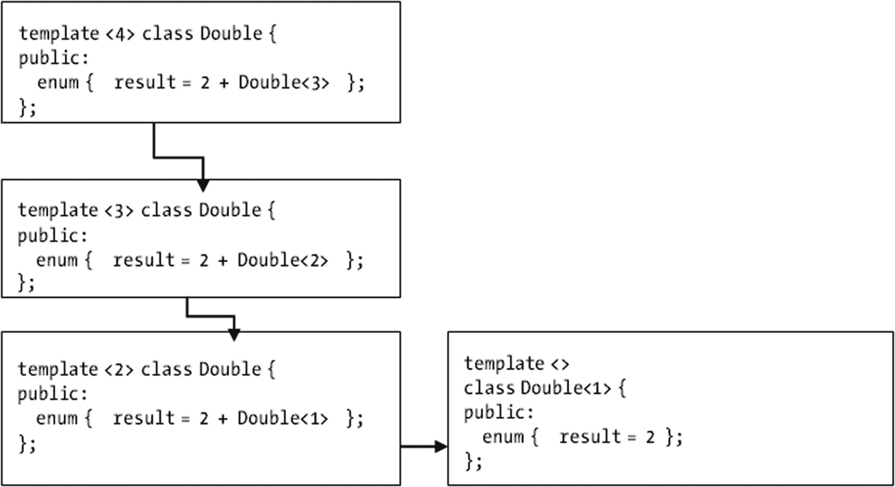

# 高性能金融应用的核心

任何高性能金融应用的核心都包含一组精心设计的数值类。这些类负责实现金融建模、预测和投资决策分析等任务中不可或缺的概念。没有数学模型的支持，提出和评估有效的投资方法将非常困难。因此，作为金融行业的程序员，你需要熟悉在 C++ 中设计和实现面向数学的代码的最佳策略。虽然使用这些编程技术不必成为数学专家，但了解金融编程任务中需要处理的最重要的数值问题会有所帮助。

本章将向你展示如何创建在面向数值的生产级代码中高效运行的类。你还将看到一些示例代码，演示如何将现有的数值类和算法集成到你的应用程序中。

本章代码示例中讨论的一些概念包括：

*   如何设计和实现高效的矩阵类
*   如何支持常见的矩阵运算
*   如何在编译时执行计算
*   如何使用模板计算阶乘
*   如何将比率表示为数据类型
*   如何使用 boost 库生成和使用随机值

## 在 C++ 中表示矩阵

实现一个表示矩阵的类，并包含一些常见的相关运算，例如加法、减法、转置和乘法。

### 解决方案

矩阵操作是数值计算中的基本操作之一。然而，C++ 没有内置的矩阵类型，因此在大多数金融项目中实现矩阵是必要的。好消息是，利用标准模板库中已有的算法相对容易实现这一目的，如下面的代码示例所示。

矩阵只是一个二维数字排列，可以对其执行一组标准的数学变换。就内存中的数据组织而言，矩阵与向量没有太大区别。考虑到这种相似性，我们可以利用现有的向量操作来简化`Matrix`类的实现。以下是此类的一个可能定义。

```cpp
class Matrix {
public:
    typedef std::vector Row;
    Matrix(int size, int size2);
    Matrix(int size);
    Matrix(const Matrix &s);
    ~Matrix();
    Matrix &operator=(const Matrix &s);
    void transpose();
    double trace();
    void add(const Matrix &s);
    void subtract(const Matrix &s);
    void multiply(const Matrix &s);
    Row & operator[](int pos);
private:
    std::vector m_rows;
};
```

请注意，在该类的公共接口开头，我使用了一个公共的 `typedef` 来定义 `Row` 类型。由于行只是一个数字向量，我想避免在谈论简单的行时输入像 `std::vector<std::vector< > >` 这样复杂的内容。这也是一种很好的措施，有助于在定义新变量和成员函数时避免错误。这个 `typedef` 的结果是，矩阵中存储的所有数据在 `Matrix` 类的私有部分被声明为 `Row` 对象的 `vector`。

刚刚介绍的简单 `Matrix` 类有两个构造函数。

```cpp
Matrix(int size);
Matrix(int m, int n);
```

第一个构造函数创建一个方阵，即行数和列数相同的矩阵。第二个构造函数用于创建更通用的矩形矩阵，具有 `m` 行和 `n` 列。

为了使矩阵的操作更类似于向量，可以引入一个下标运算符作为访问辅助。这样，就可以使用原生语法设置和检索矩阵中特定条目的值。由于我们可以引用矩阵中的每一行，因此该运算符的实现很简单。

```cpp
Matrix::Row &Matrix::operator[](int pos)
{
    return m_rows[pos];
}
```

接下来，我们考虑一些矩阵的基本运算。第一个运算是转置，定义为行与列之间元素的交换。也就是说，如果 A 是一个矩阵，我们需要交换 `A[i][j]` 和 `A[j][i]` 的值。

矩阵的第二个常见运算是计算迹，定义为主对角线元素（即行和列位置相同的元素）之和。其实现如下：

```cpp
double Matrix::trace()
{
    if (m_rows.size() != m_rows[0].size())
    {
        return 0;
    }
    double total = 0;
    for (unsigned i=0; i<m_rows.size(); ++i)
    {
        total += m_rows[i][i];
    }
    return total;
}
```

第一个 `if` 语句检查矩阵的行数和列数是否不同，如果不同，则迹运算未定义。然后 `for` 语句遍历对角线，将这些值加到 `total` 变量中，并在成员函数末尾返回该变量。

`Matrix` 类还实现了矩阵的加法和减法运算。要将一个矩阵加到另一个矩阵上，只需将第一个矩阵的各个元素与第二个矩阵中对应的元素相加。类似地，矩阵的减法也是按元素定义的。这些操作在 C++ 中实现起来很简单。

最后，你可以看到如何实现矩阵乘法。在这种情况下，你需要计算一个新矩阵，其中每个元素由第 `i` 行和第 `j` 列的乘积之和决定。结果矩阵的维度由当前矩阵的行数和参数矩阵的列数决定。该算法的主要部分如下：

```cpp
std::vector rows;
for (unsigned i=0; i row;
    for (unsigned j=0; j<s.m_rows.size(); ++j)
    {
        double Mij = 0;
        for (unsigned k=0; k<m_rows[0].size(); ++k)
        {
            Mij += m_rows[i][k] * s.m_rows[k][j];
        }
        row.push_back(Mij);
    }
    rows.push_back(row);
}
m_rows.swap(rows);
```

在这段代码中，我们有三个循环，分别遍历原始矩阵和参数矩阵的不同维度。值 `Mij` 表示结果矩阵中位置 `[i][j]` 的元素。请注意，为了简化存储管理，该算法在一组新的行中执行赋值操作。然后，在最后一行使用 `swap` 函数将结果存储到现有值的位置。

定义了 `Matrix` 类之后，我还添加了一些自由运算符，以便更轻松地使用前面定义的操作。这些运算符确保你可以使用类似于原生操作的语法来加减和乘除矩阵，尽管会因临时对象而带来轻微的开销。例如，下面是 `operator *` 的定义。

```cpp
Matrix operator*(const Matrix &s1, const Matrix &s2)
{
    Matrix s(s1);
    s.multiply(s2);
    return s;
}
```

### 完整代码

上述思想已在 `Matrix` 类中实现，如清单 5-1 所示。这个类将在本书后续章节的其他示例中使用，因此你应该熟悉它的定义和主要用途。


```cpp
//
//  Matrix.h
#ifndef __FinancialSamples__Matrix__
#define __FinancialSamples__Matrix__
#include 
class Matrix {
public:
typedef std::vector Row;
Matrix(int size, int size2);
Matrix(int size);
Matrix(const Matrix &s);
~Matrix();
Matrix &operator=(const Matrix &s);
void transpose();           // 转置
double trace();             // 迹
void add(const Matrix &s);  // 加法
void subtract(const Matrix &s); // 减法
void multiply(const Matrix &s); // 乘法
Row & operator[](int pos);
private:
std::vector m_rows;
};
// 自由运算符
//
Matrix operator+(const Matrix &s1, const Matrix &s2);
Matrix operator-(const Matrix &s1, const Matrix &s2);
Matrix operator*(const Matrix &s1, const Matrix &s2);
#endif /* defined(__FinancialSamples__Matrix__) */
//
//  Matrix.cpp
#include "Matrix.h"
Matrix::Matrix(int size)
{
for (unsigned i=0; i row(size, 0);
m_rows.push_back(row);
}
}
Matrix::Matrix(int size, int size2)
{
for (unsigned i=0; i row(size2, 0);
m_rows.push_back(row);
}
}
Matrix::Matrix(const Matrix &s)
: m_rows(s.m_rows)
{
}
Matrix::~Matrix()
{
}
Matrix &Matrix::operator=(const Matrix &s)
{
if (this != &s)
{
m_rows = s.m_rows;
}
return *this;
}
Matrix::Row &Matrix::operator[](int pos)
{
return m_rows[pos];
}
void Matrix::transpose()
{
std::vector rows;
for (unsigned i=0;i  row;
for (unsigned j=0; j rows;
for (unsigned i=0; i row;
for (unsigned j=0; j<s.m_rows.size(); ++j)
{
double Mij = 0;
for (unsigned k=0; k<m_rows[0].size(); ++k)
{
Mij += m_rows[i][k] * s.m_rows[k][j];
}
row.push_back(Mij);
}
rows.push_back(row);
}
m_rows.swap(rows);
}
Matrix operator+(const Matrix &s1, const Matrix &s2)
{
Matrix s(s1);
s.subtract(s2);  // 注意：此处实际上应为 s.add(s2)，但原文如此保留
return s;
}
Matrix operator-(const Matrix &s1, const Matrix &s2)
{
Matrix s(s1);
s.subtract(s2);
return s;
}
Matrix operator*(const Matrix &s1, const Matrix &s2)
{
Matrix s(s1);
s.multiply(s2);
return s;
}
清单 5-1
矩阵类
```

## 使用模板计算阶乘

在本节中，我将展示如何创建一个基于模板的类，用于在编译时计算阶乘。

### 解决方案

模板提供了一种简便的方式，将相同代码应用于不同数据类型，使程序员能够创建通用、可重用的代码。最佳示例就是 STL，它包含众多容器和相关算法。然而，由于模板除了数据类型之外还能接收整数值作为形式参数，因此也可用于执行数值任务。在此编码示例中，你将看到如何利用模板在编译时执行一些简单计算。

基于模板的计算可被视为减少数值算法运行时开销的一种有效策略。毕竟，如果能在编译时执行部分计算，那么每次执行编译后的代码时，完成完整计算所需的时间就会减少。

对于刚开始接触基于模板计算的人来说，最大的意外之一是计算值不能简单地作为函数返回值输出。由于函数可以在运行时返回任意值，传统函数无法作为编译时计算的基础。相反，你需要一种方法将值作为常量存储在类中，使其能被编译器直接使用。在 C++中实现此目的的一种方法是使用枚举。例如：

```cpp
enum {
result = 1
};
```

该片段定义了一个常量整数值，可在程序中后续引用。如果在声明的右侧使用常量表达式（而非数字），则`result`值可在程序中后续用于访问所需值。

接下来你需要一种方法将数字作为参数传递给类模板。在 C++中，你可以声明将`int`值（或其变体如`long`和`char`）作为参数的模板。用于在模板内执行计算的通用语法如下：

```cpp
template 
class CompileTime {
public:
enum {  result = ConstantExpressionDependingOnN };
};
```

其中`ConstantExpressionDependingOnN`是一个以某种方式依赖于参数`N`的表达式，可用于计算所需值。你可以看到本例中的代码将使用这种通用格式执行编译时计算。

一旦找到在编译时执行计算的方法，下一步就是将迭代等概念引入代码。在 C++模板中，无法在常量表达式中编写`for`或`while`等循环。所有 C++循环都在运行时执行，因此无法用于编译时操作。幸运的是，模板提供了一种特化机制，可用于实现递归——一种能达到与循环相同效果的技术。

例如，如果模板使用单个整数参数，你可以通过基例特化该参数，同时使用处理常规情况的通用版本。这两种情况共同模拟一个循环：从通用情况开始，一旦达到特例则终止计算。图 5-1 展示了这种机制的示意图，其中考虑了以下示例：



*图 5-1*  
使用模板特化进行计算的示例。通用情况以整数 4 实例化，并持续使用新实例化，直到达到`Double<1>`的特化。

```cpp
// 通用情况
template 
class Double {
public:
enum {  result = 2 + Double  };
};
// 基例特化
template 
class Double {
public:
enum {  result = 2 };
};
```

这展示了如何使用基于模板的递归计算整数的两倍值。通用情况在顶部声明，其中结果值定义为表达式`2 + Double<N-1>`。为求出该表达式的值，编译器需要内联展开它，每次递减`N`的值并用新值调用`Double`。声明的第二部分允许此过程终止，引入了一个基础值。该声明内容为：

```cpp
template 
class Double
```

这告诉编译器，`Double<1>`是通用模板针对特定值`1`的一个特化。因此，当模板`Double`应用于`1`时，计算结果将为值`2`，正如预期。

类似的策略可用于解决多个问题，包括计算阶乘这一需求。第一部分是定义通用情况，其中包含递归表达式。

```cpp
template 
class Factorial {
public:
enum {
result = Factorial::result * N
};
};
```

解决方案的第二部分是基例，它将确定`Factorial<0>`的值。可写为：

```cpp
template 
class Factorial {
public:
enum {
result = 1
};
};
```

我们可以通过对`Factorial`模板进行几次调用来测试上述代码。该示例包含在`showFactorial`函数中。

```cpp
void showFactorial()
{
std::cout ::result;
std::cout ::result;
std::cout ::result;
}
```

最后，你也可以将`Factorial`类作为其他编译时计算的基础。例如，以下展示如何使用`Factorial`计算组合数（从 N 个对象中每次取 P 个的组合数）。

```cpp
template 
class ChoiceNumber {
public:
enum {
result = Factorial::result / (Factorial::result * Factorial::result)
};
};
```


请注意，这里您不需要基础情况，因为实际上并未涉及递归。`ChoiceNumber`类模板直接使用`Factorial`来执行编译时计算，并将其作为`result`。使用模板进行编译时计算的好处在于，您可以使用这里讨论的相同策略来计算各种不同的函数。只要能够将计算表示为递归，之前描述的方案稍加修改即可适用。通过这种方式，您可以利用编译器的能力提前执行计算，并可能在程序实际运行时节省大量时间。

**注意**

虽然使用模板计算值的能力非常有用，但您可能需要避免频繁使用它们，因为它们可能会减慢编译速度。过长的编译时间可能是过度依赖模板的最大负面影响。理想情况下，在决定是否应该在编译时而非运行时使用模板进行计算之前，您应该考虑编译时间和运行时节省之间的权衡。

### 完整代码

以下是一个使用模板在编译时计算阶乘的示例。实现的关键部分位于头文件（`FactorialTemplate.h`）中，如代码清单 5-2 所示。这是必要的，因为模板在客户端使用时必须可见。`cpp`文件展示了该模板的一些示例用法。

```cpp
//
//  FactorialTemplate.h
#ifndef __FinancialSamples__FactorialTemplate__
#define __FinancialSamples__FactorialTemplate__
template <int N>
class Factorial {
public:
enum {
result = Factorial<N-1>::result * N
};
private:
};
template <>
class Factorial<0> {
public:
enum {
result = 1
};
};
template <int N, int K>
class ChoiceNumber {
public:
enum {
result = Factorial<N>::result / (Factorial<K>::result * Factorial<N-K>::result)
};
};
void showFactorial();
#endif /* defined(__FinancialSamples__FactorialTemplate__) */

//
//  FactorialTemplate.cpp
#include "FactorialTemplate.h"
#include <iostream>

void showFactorial()
{
std::cout << Factorial<6>::result;
std::cout << Factorial<5>::result;
std::cout << Factorial<7>::result;
}

int main(int argc, const char **argv)
{
std::cout << ChoiceNumber<5,6>::result;
std::cout << Factorial<9>::result;
showFactorial();
return 0;
}
代码清单 5-2 FactorialTemplate.h 头文件
```

### 运行代码

您可以编译并运行`FactorialTemplate`类来测试您刚刚学到的概念。为此，您可以使用`gcc`编译器，通过以下命令生成应用程序：

```bash
gcc -o factorial FactorialTemplate.cpp
```

几秒钟后，将创建具有所需功能的二进制文件`factorial`。您只需在命令行中调用它即可运行程序：

```bash
./factorial
```

如果在 Windows 机器上运行，也可以直接点击可执行文件。这将产生以下输出：

```
factorial(6)= 720
choiceNumber(5,6) = 15
factorial(5)= 120
factorial(7)= 5040
factorial(9)= 362880
```

## 使用 C++20 特性计算阶乘

C++ 最近引入了一些特性，使得处理模板代码更加容易。虽然前面的示例对于解释模板的工作原理仍然有用，但语法已经简化，现在可以用更少的样板代码实现相同的结果。首先，C++ 现在能够使用`constexpr`关键字在编译时计算表达式。使用`constexpr`关键字时，您是在指示编译器直接在编译时执行计算。这比创建递归模板类要简单得多，正如您在上一节中所见。

因此，例如，如果您需要创建一个阶乘函数，以下定义就足够了：

```cpp
constexpr int factorial(const int n)
{
return n <= 1 ? 1 : (n * factorial(n - 1));
}
```

该函数的定义使用了`constexpr`，这意味着如果可能（即，如果参数是编译器已知的常量值），其值应在编译时计算。语法的其余部分与您为标准函数编写的类似，使用递归调用来基于较小整数的结果计算阶乘值。您也可以像调用普通函数一样调用此函数。

## 在编译时表示卡尔玛比率

卡尔玛比率是一种衡量投资回报与可能年化损失之间关系的指标。它用于比较具有不同风险状况的投资。卡尔玛比率定义为给定时期的平均年化回报率除以同一时期的最大回撤（即最大损失）。如果考虑相同的回报率，则在该时期具有较高卡尔玛比率的投资风险较低。在本节中，我将展示如何使用编译时技术创建 C++ 代码来表示卡尔玛比率。

### 解决方案

在编写数值算法时，将某些量表示为常量通常很有用。然而，其中一些数学常量更适合表示为比率。例如，物理量经常使用测量单位，而这些单位通常表示为其他更基本单位的比率。因此，比率是一种特定类型的数学常量，可以从更具体、更高级的表示中受益。
在此编码示例中，您将使用 boost 仓库中的一个简单库来解决这个问题。该库称为`ratio`，并使用模板来表示数学量，例如投资的标准卡尔玛比率。所使用的表示也可以在编译时进行检查。
`ratio`库中提供的基本模板简称为`ratio`。它的操作需要两个模板参数，分别对应分子和分母。这些参数可以是简单的数值类型，例如`int`，也可以是先前使用`ratio`模板声明的其他类型。使用`ratio`模板为不同输入定义的类型本质上是不同的，编译器将强制执行涉及这些值的任何算术运算的正确性。

使用`ratio`模板的主要优点之一是它还提供了一些常见的编译时操作。这些操作可用于对使用该模板定义的数量执行标准的数学变换。此类操作包括：

- `boost::ratio_add`
- `boost::ratio_subtract`
- `boost::ratio_multiply`
- `boost::ratio_add`
- `boost::ratio_negate`

使用这些操作，您可以定义派生类型和常量，它们是原始比率类型的衍生。您还可以使用一些基于模板的操作来对这些比率进行逻辑比较，例如：

- `boost::ratio_equal`
- `boost::ratio_not_equal`
- `boost::ratio_less`
- `boost::ratio_less_equal`
- `boost::ratio_greater`
- `boost::ratio_greater_equal`

您可以通过导入主头文件`<boost/ratio.hpp>`开始使用`ratio`库。然后，您可以使用`boost::ratio`为每个所需的比率定义对象。

```cpp
#include <boost/ratio.hpp>
boost::ratio<1,2> one_half;
boost::ratio<1,3> one_third;
boost::ratio<2,5> two_fifths;
```

一旦定义了`boost::ratio`对象，您就可以使用`num`和`den`成员变量在运行时检索其信息，这两个变量分别对应分子和分母。例如：

```cpp
std::cout << "one_third numerator: " << one_third.num
<< " denominator: " << one_third.den;
```

## 表示卡尔玛比率


### 使用 Ratio 库处理金融类型

借助 `ratio` 库，可以创建一些实用的金融类型，例如卡玛比率。卡玛比率定义为投资年化收益率除以已知期间内的最大回撤。因此，可以按如下方式定义 `CalmarRatio` 类型：

```
typedef boost::ratio<100, 1> CalmarRatioType;
```

从现在开始，`CalmarRatioType` 可用于在编译时表示具有分子和分母的量。更有趣的是，假设我们希望能够用百分比和百分点（1/100%）来表示卡玛比率。那么定义将变为：

```
typedef boost::ratio<1, 100> CalmarRatioBPS;
typedef boost::ratio<1, 1> CalmarRatioPerc;
```

有了这两种类型，我们可以创建一个基于模板的类，返回关于特定比率的信息，例如给定对象的最大回撤和表现。实现如下：

```
template <class Ratio>
class CalmarRatio {
public:
    CalmarRatio(double calmar, double ret) : m_calmar(calmar), m_return(ret) {}
    virtual ~CalmarRatio() {}
    double getReturn();
    double getDrawDown()
    {
        return m_return / m_calmar * m_ratio.den;
    }
private:
    Ratio m_ratio;
    double m_calmar;
    double m_return;
};
```

该类是一个模板，接收所需的比率类型，如 `CalmarRatioPerc` 或 `CalmarRatioBPS`。当然，如果需要，也可以支持其他比率类型。

让我们看一下 `getDrawDown` 成员函数。标准定义使用 `den` 变量来计算投资回撤。然而，可以使用模板特化创建该成员函数的不同版本。以下实现提供了一个示例：

```
template <>
double CalmarRatio<CalmarRatioBPS>::getDrawDown()
{
    return m_return / m_calmar * m_ratio.den * 100;
}
```

在这种情况下，由于模板特化为 `CalmarRatioBPS`，标准回撤需要乘以 100。这是因为分母是以基点（而非百分比）表示的。

### 完整代码

清单 5-3 展示了 `CalmarRatio` 类的实现。请注意 `boost::ratio` 模板用于建模不同比率类型的方式，以及主类如何使用它们。

```
// CalmarRatio.h
//
#ifndef CALMARRATIO_H_
#define CALMARRATIO_H_

#include <boost/ratio.hpp>

typedef boost::ratio<100, 1> CalmarRatioType;
typedef boost::ratio<1, 100> CalmarRatioBPS;
typedef boost::ratio<1, 1> CalmarRatioPerc;

template <class Ratio>
class CalmarRatio {
public:
    CalmarRatio(double calmar, double ret) : m_calmar(calmar), m_return(ret) {}
    ~CalmarRatio() {}
    double getReturn()
    {
        return m_return;
    }
    double getDrawDown()
    {
        return m_return / m_calmar * m_ratio.den;
    }
private:
    Ratio m_ratio;
    double m_calmar;
    double m_return;
};

template <>
double CalmarRatio<CalmarRatioBPS>::getDrawDown()
{
    return m_return / m_calmar * m_ratio.den * 100;
}

#endif /* CALMARRATIO_H_ */

// CalmarRatio.cpp
//
#include "CalmarRatio.h"
#include <iostream>

boost::ratio<1, 2> one_half;
boost::ratio<1, 3> one_third;

void createCalmarRatio()
{
    CalmarRatio<CalmarRatioType> ratio(0.15, 11);
}

void printRatios()
{
    CalmarRatio<CalmarRatioPerc> ratio(0.110, 3.12);
    CalmarRatio<CalmarRatioBPS> bpsRatio(480, 2.15);
    std::cout << "return: " << bpsRatio.getReturn()
              << " drawdown: " << bpsRatio.getDrawDown() << std::endl;
}

清单 5-3
CalmarRatio 类
```

### 运行代码

我们在 UNIX 系统中使用 `gcc` 编译器测试了包含 `CalmarRatio` 类及其相关代码的示例应用程序。你可以使用 `make` 等构建系统及其相关的 makefile 来编译前面展示的 `.cpp` 文件。或者，你也可以直接使用编译器通过以下命令行构建应用程序：

```
gcc -o calmarRatio CalmarRatio.cpp
```

生成的可执行文件可以从终端调用。它将按以下方式显示卡玛比率的结果：

```
return: 3.12 drawdown: 28.3636
return: 2.15 drawdown: 44.7917
```

如你所见，代码对参数进行了不同的处理，并根据所使用的卡玛比率类型解释结果。第一个示例使用了 `CalmarRatioPerc`，将卡玛比率视为应用于百分比。第二个示例使用了 `CalmarRatioBPS` 表示形式，它使用基点而非百分比。然而，结果会根据各自的回报和回撤正确显示。

