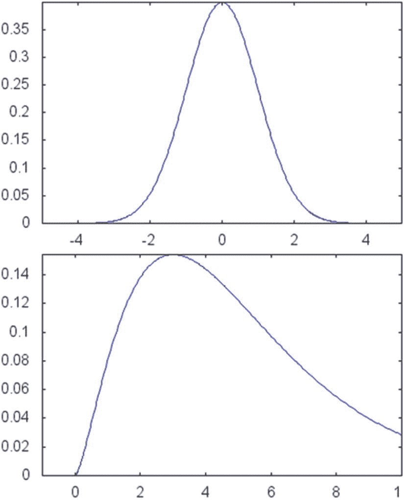
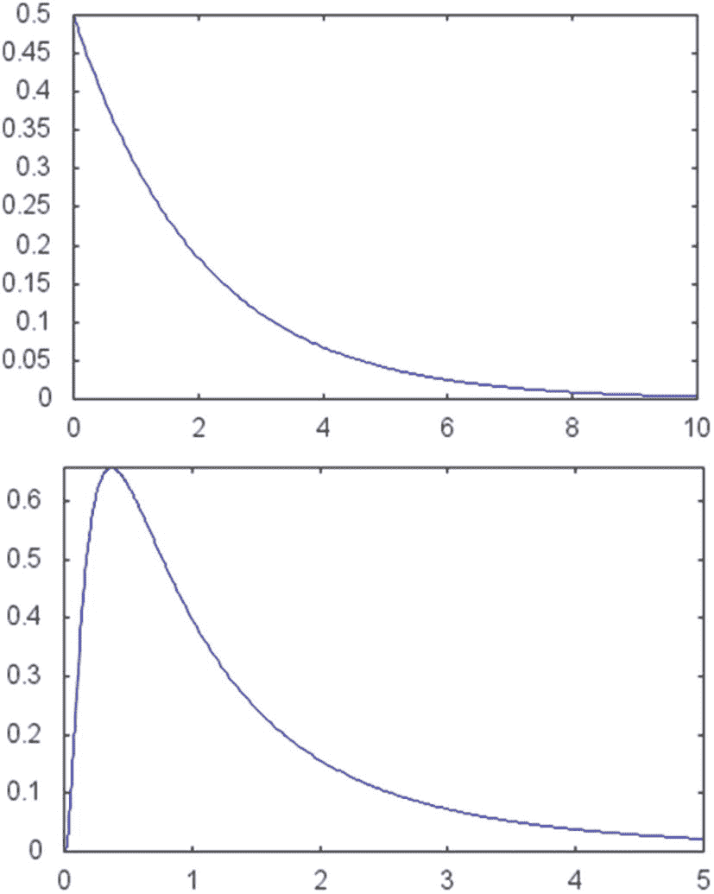

# 生成统计数据

使用高斯分布（正态分布）和卡方分布等统计分布创建数据。

## 解决方案

在处理交易算法时，通常在人工生成的价格上测试这些策略的运行情况会非常有用。如果我们考虑市场的大部分短期波动都具有随机成分，那么我们可以使用随机数生成器来近似典型价格相关时间序列的值。

在本节中，我们将研究如何生成基于统计数据的数据，这些数据随后可用于测试交易策略。为此，你可以使用当前可用于在 C++ 中生成统计值的众多库之一。这些库的操作方式与随机数生成器类似，但存在一些差异。传统的随机数生成器用于生成随机整数值。经过一些处理，这些数字可以转换为给定区间（如 0 到 1 之间）内均匀分布的随机数。

然而，对于更高级的用途，从一个特定的概率分布生成随机数是很有趣的。这些概率分布基于标准随机过程，包括高斯分布（也称为正态分布）和卡方分布（一种偏态正态分布形式）。参见图 5-2。这些分布可用于生成更能代表股票市场的随机数。



**图 5-2**

`boost::math` 命名空间中可用的两个概率分布函数（PDF）的图形。上方图形是参数为 0 和 1 的正态分布。下方图形是参数为 5 的卡方分布。

在本例中，我将向你展示如何使用 `boost::math` 命名空间，在其中声明一组表示统计分布的对象。为完成此任务使用一个库，可以让你专注于算法的设计，而无需重新实现这样一个在许多编程库中已可用的通用统计工具函数。我还将使用 `boost::random` 库基于这些分布生成随机数据点。

## 概率分布

在正式开始之前，我先快速概述一下概率分布及其用途。概率分布是对自然界中频繁出现的参数化随机过程的数学表示。例如，最基本的概率分布是**均匀**分布，在该分布中，函数定义的整体区间内各点出现的概率相同。因此，每次根据此分布（假设其定义域为 1 到 2 之间的数字）产生一个新事件时，其值可能是 1 到 2 之间的任意实数，且概率相等。均匀分布扮演着重要角色，因为根据均匀随机概率生成的值可以转换为其他概率分布。

另一个重要的分布是正态（或高斯）分布。正态分布有两个参数：均值（平均值）和标准差。符合正态分布的随机事件在均值附近出现的概率最高，而事件发生在更远位置的概率则迅速降低。由此得到的概率分布呈钟形，以表明概率空间的这一特性。据观察，许多自然现象都遵循正态分布，尤其是在考虑大量观测数据时。图 5-2（上图）展示了一个正态（也称为高斯）随机变量的概率密度函数图。

其他概率分布也用于金融应用。你可以在表 5-1 中快速查看最重要的几个分布。每个分布都有常见的用途模式和关联参数，这些参数可用于描述概率范围以及所生成函数的形状。

### 表 5-1：几种常用分布及其参数和对应的 `boost::math` 标识符

| 分布 | 参数 | `boost::math` 标识符 |
| --- | --- | --- |
| 伯努利分布 | 成功概率 | `boost::math::bernoulli_distribution` |
| 贝塔分布 | Alpha 和 Beta（实数值） | `boost::math::beta_distribution` |
| 二项分布 | 试验次数和成功概率 | `boost::math::binomial_distribution` |
| 柯西分布 | 位置和尺度 | `boost::math::cauchy_distribution` |
| 卡方分布 | 自由度 | `boost::math::chi_squared_distribution` |
| 指数分布 | Lambda（比率） | `boost::math::exponential_distribution` |
| 几何分布 | 成功概率 | `boost::math::geometric_distribution` |
| 超几何分布 | N、K 和试验次数 | `boost::math::hypergeometric_distribution` |
| 对数正态分布 | 均值和标准差 | `boost::math::lognormal_distribution` |
| 逻辑分布 | 均值和尺度 | `boost::math::logistic_distribution` |
| 正态（高斯）分布 | 均值和标准差 | `boost::math::normal_distribution` |
| 泊松分布 | Lambda（比率） | `boost::math::poisson_distribution` |
| 学生 t 分布 | 自由度（实数值） | `boost::math::students_t_distribution` |
| 三角分布 | 极小值、极大值和中间值 | `boost::math::triangular_distribution` |
| 均匀分布 | 区间的起点和终点 | `boost::math::uniform_distribution` |

其中一些函数也可在 STL 的 `<random>` 头文件中使用。然而，为了完整性，我将在本章中也展示如何使用 Boost 库来计算这些值。要在代码中使用这些概率分布中的某一些，你可以包含头文件 `<boost/math/distributions.hpp>`。首先，你需要确保 Boost 已正确安装在你的系统上（请查看 [`www.boost.org`](http://www.boost.org) 网站上的安装说明）。表 5-1 的最后一列列出了分布的名称。

一旦你导入特定的分布，就可以用它来回答常见的问题，例如：该分布的均值是多少？特定值对应的分位数是多少？特定值的累积分布函数是多少？你将在类 `DistributionData` 中看到这些问题的一些答案，该类列在这里。

类 `DistributionData` 的另一个职责是根据给定参数，为某些分布生成随机数。当调用分布对象时，会创建特定于分布的随机数。你需要传递一个均匀随机数生成器，该生成器也由 Boost 提供。你可以将这些值存储在向量中，并在成员函数结束时返回它们。以下是高斯分布数据的工作过程示例。

```cpp
std::vector DistributionData::gaussianData(int nPoints, double mean, double sigma)
{
std::vector data;
boost::random::normal_distribution distrib(mean, sigma);
for (int i=0; i<nPoints; ++i)
{
double val = distrib(random_generator);
data.push_back(val);
}
return data;
}
```

另外两种常见的概率分布是伽马分布和对数正态分布。伽马分布可以解释为正态分布的泛化版本，你可以控制概率的形状和尺度。图 5-3（上图）展示了一个伽马分布的示例。对数正态分布是正态分布的另一种可能的泛化，可以被解释为若干个正的独立随机变量的乘积。其概率密度函数如图 5-3（下图）所示。对数正态分布被包含在类 `DistributionData` 支持的分布列表中。



**图 5-3** `boost::math` 命名空间中可用的两个概率密度函数图。上图为参数为 1 和 2 的伽马分布。下图为参数为 0 和 1 的对数正态分布。

### 完整代码

在代码清单 5-4 中，我展示了一个类的实现，该类使用 `boost::random` 模板库中可用的几个概率分布生成数据。主类名为 `DistributionData`，你可以用它来生成数字，以及计算某些分布的分位数。

```cpp
// DistributionData.h
//
#ifndef DISTRIBUTIONDATA_H_
#define DISTRIBUTIONDATA_H_
#include 
// 负责基于常见概率分布生成数据的类
//
class DistributionData {
public:
// 标准构造函数和析构函数
DistributionData();
~DistributionData();
// 基于给定参数生成随机数据。
// 每个函数返回一个包含 nPoints 个随机值的向量。
std::vector gaussianData(int nPoints, double mean, double sigma);
std::vector exponentialData(int nPoints, double rate);
std::vector chiSquaredData(int nPoints, int degreesOfFreedom);
std::vector logNormalData(int nPoints, double mean, double sigma);
// 返回给定值 x 对应参数的分位数。
//
double gaussianQuantile(double x, double mean, double sigma);
double chiSquaredQuantile(double x, int degreesOfFreedom);
double exponentialQuantile(double x, double rate);
double logNormalQuantile(double x, double mean, double sigma);
};
#endif /* DISTRIBUTIONDATA_H_ */
// DistributionData.cpp
//
#include "DistributionData.h"
#include 
using boost::math::quantile;
#include 
#include 
static boost::rand48 random_generator;
DistributionData::DistributionData()
{
}
DistributionData::~DistributionData()
{
}
std::vector DistributionData::gaussianData(int nPoints, double mean, double sigma)
{
std::vector data;
boost::random::normal_distribution distrib(mean, sigma);
for (int i=0; i DistributionData::exponentialData(int nPoints, double rate)
{
std::vector data;
boost::random::exponential_distribution distrib(rate);
for (int i=0; i DistributionData::logNormalData(int nPoints, double mean, double sigma)
{
std::vector data;
boost::random::lognormal_distribution distrib(mean, sigma);
for (int i=0; i DistributionData::chiSquaredData(int nPoints, int degreesOfFreedom)
{
std::vector data;
boost::random::chi_squared_distribution distrib(degreesOfFreedom);
for (int i=0; i dist(mean, sigma);
return quantile(dist, x);
}
double DistributionData::chiSquaredQuantile(double x, int degreesOfFreedom)
{
boost::math::chi_squared_distribution dist(degreesOfFreedom);
return quantile(dist, x);
}
double DistributionData::exponentialQuantile(double x, double rate)
{
boost::math::exponential_distribution dist(rate);
return quantile(dist, x);
}
double DistributionData::logNormalQuantile(double x, double mean, double sigma)
{
boost::math::lognormal_distribution dist(mean, sigma);
return quantile(dist, x);
}
namespace  {
template 
void printData(const string &label, const T &data)
{
cout << " " << label << ":  ";
for (auto i : data)
{
cout << i << " ";
}
cout << endl;
}
}
int main()
{
DistributionData dData;
auto gdata = dData.gaussianData(10, 5, 2);
printData("gaussian data", gdata);
auto edata = dData.exponentialData(10, 4);
printData("exponential data", edata);
auto kdata = dData.chiSquaredData(10, 5);
printData("chi squared data", kdata);
auto ldata = dData.logNormalData(10, 8, 2);
printData("log normal data", ldata);
return 0;
}
```

**清单 5-4** `DistributionData` 类

### 运行代码

你可以使用任何符合标准的 C++ 编译器编译清单 5-4 中的代码。如前面章节所述，你需要在系统中安装好 `boost`。以下是预期输出示例（具体数值将根据你的具体实现和所使用的随机数而有所不同）：

```
./distributionData
gaussian data:  7.12699 5.56941 5.91951 3.44111 4.89098 4.95243 7.33077 10.6359 5.00597 3.08975
exponential data:  0.108161 0.212945 0.0355506 0.0165794 0.753239 0.041679 0.219658 0.0610242 0.410622 0.0378433
chi squared data:  6.12073 2.14098 1.57523 6.49539 3.15154 1.47554 8.39545 9.07183 2.77768 5.05356
log-normal data:  1573.09 473.919 370.7 1212.54 1530.16 323705 2586.73 35919.6 628.913 372.41
```

### 结论

数值类和函数在金融工程模型的开发中扮演着非常重要的角色。它们为创建复杂的交易策略提供了所需的底层数学支持。在本章中，你探讨了一些最常见的数值库。

首先，我讨论了基于矩阵计算的算法，以及如何使用基于 STL 的容器来表示它们。STL 还提供了丰富的算法，这些算法既可用于数值应用，也可用于其他通用编程任务。接下来，你学习了如何使用 C++ 模板机制提供的编译时功能。你看到了如何使用这种基于模板的功能来计算数字阶乘的示例。同样的概念也可以扩展到许多其他用途。你还了解了比率模板的使用，以及它们如何表示诸如卡尔玛比率之类的金融概念。

概率分布是数值算法的另一个领域，在金融应用中占有重要地位。投资策略的测试通常涉及随机数据的生成，以此作为模拟可能的经济场景的一种方式。你学习了如何基于一些最常见的概率分布生成随机值。这些分布由一些数值库提供，在本章中，我使用了 `boost::math` 和 `boost::random` 来实现这一目的。这些库共同提供了一种生成随机数据的方法，以及返回关于特定分布的相关信息，例如均值、标准差、分位数和其他相关属性。

数据可视化是编程的另一个领域，在开发有效的金融算法中非常重要。在下一章中，你将探讨一些编程技术，这些技术举例说明了数据可视化的一些可用选项。你将看到 C++ 有多种方式将数据输出到图形显示器，既可以使用内部绘图技术，也可以使用外部绘图技术。当你开发新的投资策略时，这些库可以用于可视化你工作的方方面面。