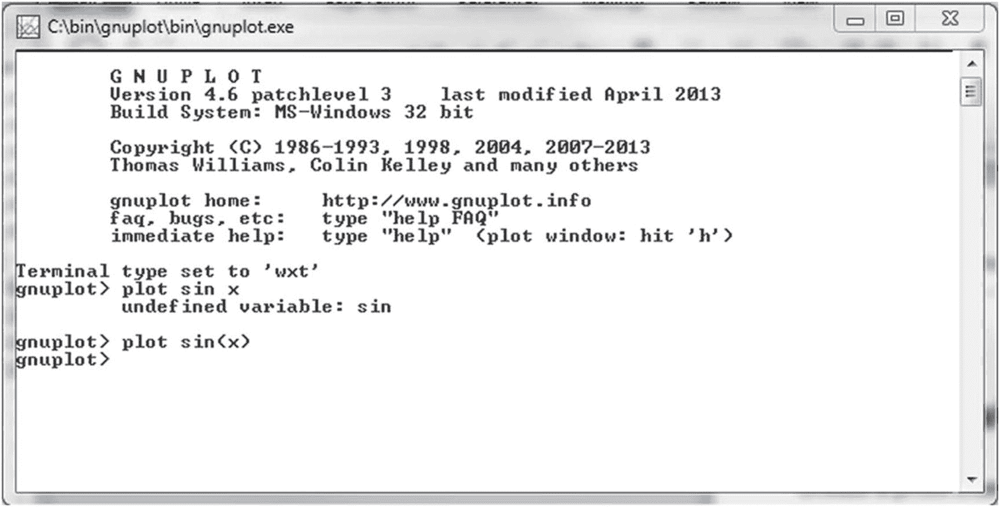
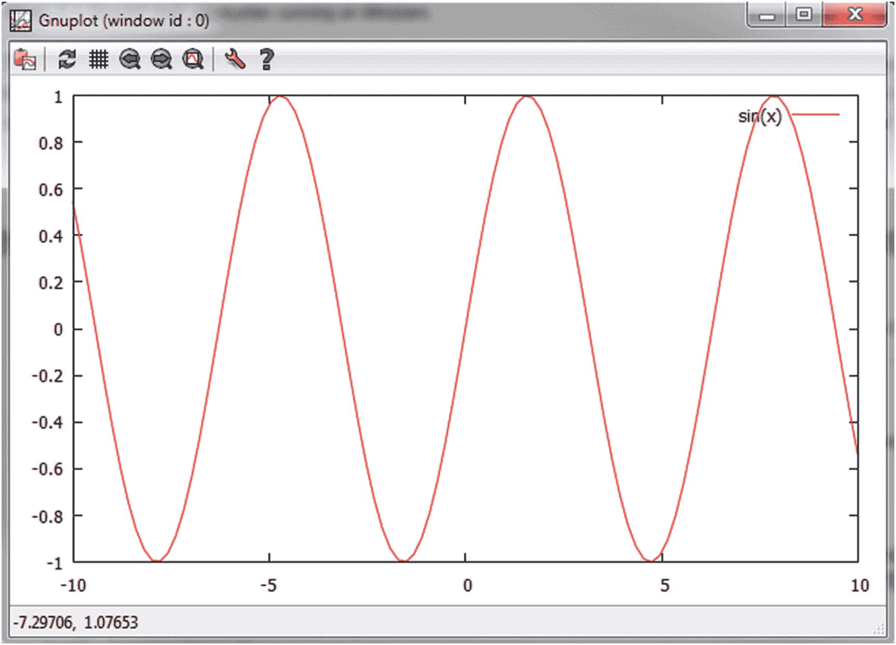
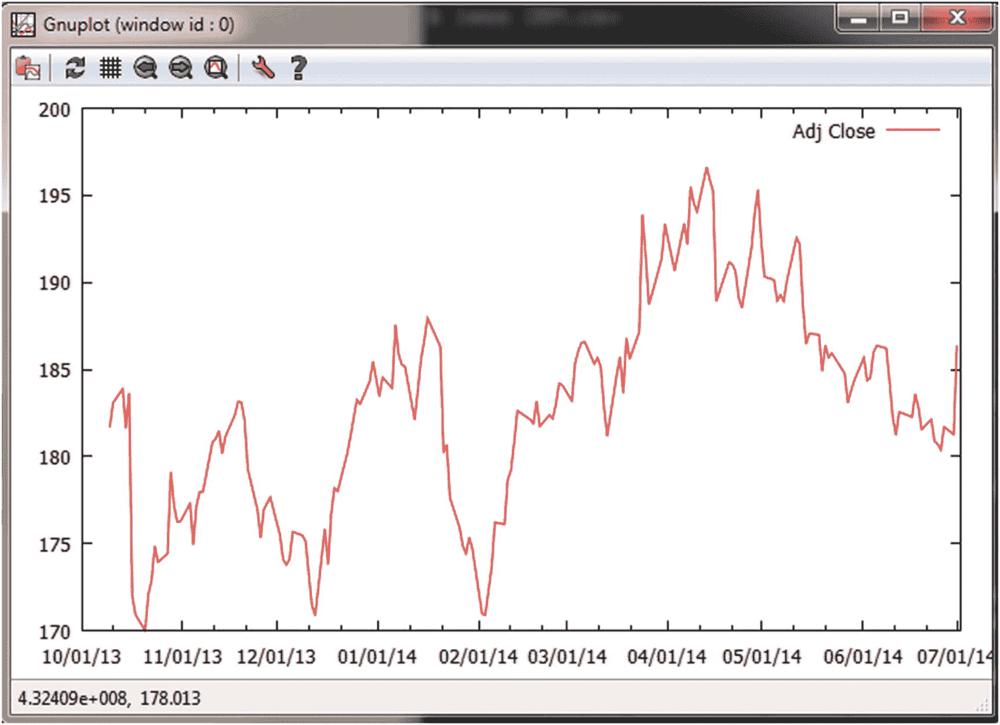
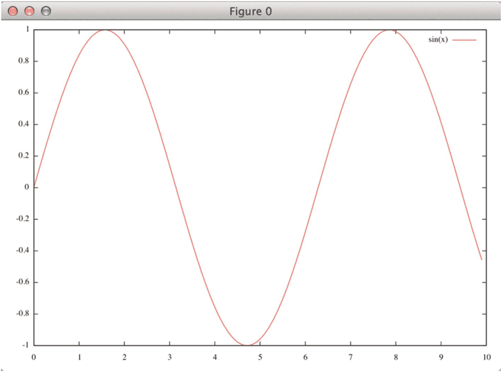
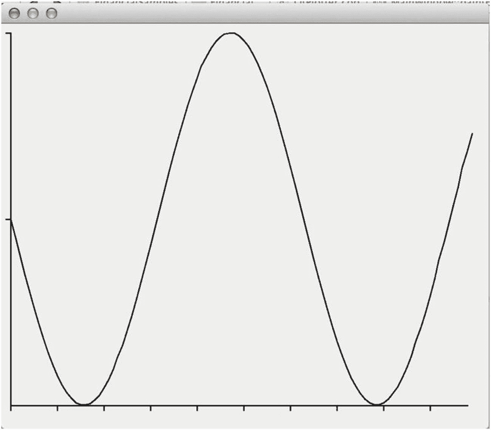

# 6. 绘制金融数据

在金融编程中，一个非常常见的活动是生成与价格相关的数据，这些数据需要被交易员或其他业务利益相关者可视化。大多数情况下，数据需要以图表的形式绘制出来，以便于可视化。金融数据的可视化策略范围广泛，从简单的每日价格折线图到使用蜡烛图、叠加研究以及其他非传统符号的复杂图形输出。

在本章中，你将看到许多基于价格及相关定量数据分析来创建和显示图表的代码示例。你将学习如何使用几种不同的技术来执行这些任务，包括诸如 `Gnuplot` 之类的外部软件，以及诸如 `Qt` 等图形化 C++ 库。这两种技术在不同情况下都可能有用，因为它们各有优缺点。

以下是你在本章中将学到的一些内容：

*   如何创建一个提供绘图接口的类

*   如何使用像 `Gnuplot` 这样的外部绘图应用程序

*   如何将你的数据转换为外部程序可以理解的格式

*   如何在 UNIX 和 Windows 上绘制 csv（逗号分隔值）文件

*   如何生成命令来控制开源 `Gnuplot` 应用程序

*   如何使用开源且跨平台的图形用户界面（GUI）库创建图表

*   如何使用 `Qt` 生成一个基本的绘图窗口

## 使用 Gnuplot 绘图

使用 `Gnuplot` 创建一个价格图表。

### 解决方案

Gnuplot 是一个非常流行的软件包，用于根据数学函数和数据点创建图表。你可以独立使用 Gnuplot，也可以将其作为其他应用程序所创建图形的嵌入式查看器。在本节中，你将学习如何生成能轻松通过 Gnuplot 进行可视化的文件。

使用 Gnuplot 的第一步是确保它已正确安装在你的系统中。你可以通过访问其网站 ([`www.gnuplot.info`](http://www.gnuplot.info)) 并下载所需文件来轻松安装这个用于数据可视化的包。大多数操作系统（包括 Windows、Mac OS X 和 Linux）都有可用的二进制安装文件。运行安装程序并执行主应用程序，你应该会看到类似图 6-1 中显示的屏幕。



**图 6-1** 在 Windows 上运行的 Gnuplot 主应用程序

这个基础应用程序由一个简单的 shell 组成，你可以在其中输入一些 Gnuplot 能识别的命令。其中最基础的命令是 `plot`，它允许你在屏幕上显示绘图。例如，你可以轻松为数学函数（如正弦或余弦）创建绘图。所需的命令可以在应用程序的主提示符下输入。

```
> plot sin(x)
```

你可以在图 6-2 中看到这个简单函数绘图的结果。



**图 6-2** 使用 Gnuplot 绘制的数学函数 `sin(x)` 的图形

在这个绘图中，你提供了由 `sin(x)` 定义的数学函数，Gnuplot 负责创建这些值的图形，默认范围是从 -10 到 10。你可以轻松调整用于确定范围的参数，以及绘图的其他属性，例如标题、图例和两个轴使用的单位。

使用 Gnuplot 的另一种方式是直接绘制数值数据，而不是数学函数。这可以通过引用 `plot` 命令应导入的文件名来实现。大多数以这种方式导入的数据是 csv（逗号分隔值）格式，尽管 Gnuplot 不强制要求数据必须是 csv 格式——任何包含按列组织的数值数据的文件都可以。

考虑以下数据作为示例。这些是从 Yahoo! Finance 下载的 IBM 股价。

```
Date,Open,High,Low,Close,Volume,Adj Close
2014-07-01,181.7,187.27,181.7,186.35,6643100,186.35
2014-06-30,181.33,181.93,180.26,181.27,4223800,181.27
2014-06-27,179.77,182.46,179.66,181.71,4575500,181.71
2014-06-26,180.87,181.37,179.27,180.37,3258500,180.37
2014-06-25,180.25,180.97,180.06,180.72,2762800,180.72
2014-06-24,181.5,183,180.65,180.88,3875400,180.88
2014-06-23,181.92,182.25,181,182.14,3231700,182.14
2014-06-20,182.59,182.67,181.4,181.55,10686800,181.55
2014-06-19,184.12,184.47,182.36,182.82,3551100,182.82
2014-06-18,182.04,183.61,181.79,183.6,3931800,183.6
2014-06-17,181.9,182.81,181.56,182.26,2445400,182.26
2014-06-16,182.4,182.71,181.24,182.35,3538700,182.35
2014-06-13,182,183,181.52,182.56,2773600,182.56
2014-06-12,182.48,182.55,180.91,181.22,4425300,181.22
2014-06-11,183.61,184.2,182.01,182.25,4061700,182.25
2014-06-10,186.2,186.22,183.82,184.29,4154900,184.29
2014-06-09,186.22,187.64,185.96,186.22,2728400,186.22
```

我在此只显示了包含每日股价文件的前几行。你可以将这些数据保存在文件 `IBM.csv` 中，并使用以下命令通过 Gnuplot 将其作为股价绘图的数据源：

```
gnuplot> set xdata time
gnuplot> set datafile separator ","
gnuplot> set timefmt "%Y-%m-%d"
gnuplot> plot 'IBM.csv' using 1:7 title columnhead with lines
```

> **注意**：运行上述命令时，请确保你位于保存数据文件 (`IBM.csv`) 的同一目录中。另一种方法是使用文件的完整路径，例如 `"c:\\testdata\\IBM.csv"`（在 Windows 平台上需要使用转义路径分隔符）。

第一个命令用于告诉 Gnuplot x 轴的数据是基于时间的。第二个命令定义了文件中使用的分隔符。第三个命令描述了 csv 文件中存储的日期格式。最后，最后一行告诉 Gnuplot 绘制文件 `IBM.csv` 的内容，使用第 1 列和第 7 列（第 1 列包含日期，而第 7 列包含调整后的收盘价），时间序列的标题由 csv 文件每列的列标题定义。

这些命令将生成图 6-3 中显示的图形。



**图 6-3** 使用 Gnuplot 绘制的存储在 csv 文件中的 IBM 股票调整后价格图形

图 6-3 中的图形只是 Gnuplot 所能做的一个示例。实际上，可以使用 `set` 命令调整数百个参数。在这些选项中，你可以找到三维图形、不同颜色和线型等。

为了解决本节中提出的问题，你需要创建一个类，该类接收一些以双精度数或字符串向量形式存在的数据，并生成适合 Gnuplot 使用的输出数据。我创建了这样一个类，名为 `GnuplotPlotter`，它负责生成 Gnuplot 所需的文件。

该类的操作取决于对 x 轴和 y 轴数据的确定。该类使用一个构造函数创建，该构造函数将输出文件名作为参数。要定义将在绘图中使用的数据，请使用 `setData` 成员函数。参数必须分别是 x 维度和 y 维度的数据向量。以下是该类的摘要：

```
class GnuplotPlotter {
public:
    GnuplotPlotter(const std::string &fileName);
    GnuplotPlotter(const GnuplotPlotter &p);
    ~GnuplotPlotter();
    GnuplotPlotter &operator=(const GnuplotPlotter &p);
    void generateCmds(const std::string &cmdFileName);
    void setHeaders(const std::string &xheader, const std::string &yheader);
    void setData(const std::vector &xdata, const std::vector &ydata);
    void setData(const std::vector &xdata, const std::vector &ydata);
    void csvWrite();
    // 私有变量在此处。
};
```

要访问类的结果，可以使用两个成员函数。`csvWrite` 成员函数将把存储在 `GnuplotPlotter` 中的数据以 csv 格式写入构造函数中指定的文件。第二个成员函数是 `generateCmds`，它允许创建一个包含 Gnuplot 所需指令的命令文件。这样，你就不必担心绘图的确切语法。这些命令存储在由参数 `cmdFileName` 指定的文件名中。

`main` 函数中给出了 `GnuplotPlotter` 类的一个示例。首先，你需要定义两个包含所需数据的向量。在本例中，你将使用由 `sin` 函数生成的数据，该函数返回一个数的三角正弦值。请注意，我们这样做只是为了简化数据测试。然而，数据文件可以包含来自任何来源生成的数字。定义内容后，你可以调用成员函数 `csvWrite` 和 `generateCmds` 来创建 Gnuplot 所需的文件。你可以在图 6-4 中看到此过程的结果。



**图 6-4** 使用 `GnuplotPlotter.cpp` 中创建的测试数据生成的图形

### 完整代码

生成图表和 Gnuplot 命令的代码已在 `GnuplotPlotter` 类中实现。你可以将这个类添加到你的项目中，并调用相同的成员函数来生成数据图表（参见清单 6-1）。

```
//
//  GnuplotPlotter.h
#ifndef __FinancialSamples__GnuplotPlotter__
#define __FinancialSamples__GnuplotPlotter__
#include 
#include 
class GnuplotPlotter {
public:
GnuplotPlotter(const std::string &fileName);
GnuplotPlotter(const GnuplotPlotter &p);
~GnuplotPlotter();
GnuplotPlotter &operator=(const GnuplotPlotter &p);
void generateCmds(const std::string &cmdFileName);
void setHeaders(const std::string &xheader, const std::string &yheader);
void setData(const std::vector &xdata, const std::vector &ydata);
void setData(const std::vector &xdata, const std::vector &ydata);
void csvWrite();
private:
std::string m_fileName;
std::string m_xheader;
std::string m_yheader;
std::vector m_xdata;
std::vector m_ydata;
bool m_isDate;
};
#endif /* defined(__FinancialSamples__GnuplotPlotter__) */
//
//  GnuplotPlotter.cpp
#include "GnuplotPlotter.h"
#include 
#include 
#include 
#include 
using std::ofstream;
using std::vector;
using std::cout;
GnuplotPlotter::GnuplotPlotter(const std::string &fileName)
: m_fileName(fileName),
m_isDate(false)
{
}
GnuplotPlotter::GnuplotPlotter(const GnuplotPlotter &p)
: m_fileName(p.m_fileName),
m_xheader(p.m_xheader),
m_yheader(p.m_yheader),
m_xdata(p.m_xdata),
m_ydata(p.m_ydata),
m_isDate(p.m_isDate)
{
}
GnuplotPlotter::~GnuplotPlotter()
{
}
GnuplotPlotter &GnuplotPlotter::operator=(const GnuplotPlotter &p)
{
if (&p != this)
{
m_fileName = p.m_fileName;
m_xheader = p.m_xheader;
m_yheader = p.m_yheader;
m_xdata = p.m_xdata;
m_ydata = p.m_ydata;
m_isDate = p.m_isDate;
}
return *this;
}
void GnuplotPlotter::setData(const std::vector &xdata,
const std::vector &ydata)
{
m_xdata = xdata;
m_ydata = ydata;
m_isDate = true; // 假设 X 轴为日期
}
void GnuplotPlotter::setData(const std::vector &xdata, const std::vector &ydata)
{
for (unsigned i = 0; i < xdata.size(); ++i)
{
cout << xdata[i] << ", " << ydata[i] << endl;
}
// 此处嵌入 Gnuplot 命令生成逻辑
}
void GnuplotPlotter::generateCmds(const std::string &cmdFileName)
{
ofstream cmdFile(cmdFileName.c_str());
if (!cmdFile)
{
cout << "无法生成命令文件" << endl;
return;
}
cmdFile << "set xlabel '" << m_xheader << "'" << endl;
cmdFile << "set ylabel '" << m_yheader << "'" << endl;
cmdFile << "set style data lines" << endl;
cmdFile << "plot '" << m_fileName << "' using 1:2" << endl;
cmdFile.close();
}
void GnuplotPlotter::csvWrite()
{
ofstream dataFile(m_fileName.c_str());
if (!dataFile)
{
cout << "无法写入 CSV 文件" << endl;
return;
}
for (unsigned i = 0; i < m_xdata.size(); ++i)
{
dataFile << m_xdata[i] << ", " << m_ydata[i] << endl;
}
dataFile.close();
}
```

**清单 6-1** `GnuplotPlotter.h` 和 `GnuplotPlotter.cpp`

### 运行代码

清单 6-1 中的代码可以使用免费的 `gcc` 编译器进行编译。该解决方案已在 Mac OS X 和 Windows 平台上测试通过。例如，你可以使用以下命令创建一个应用程序：

```
gcc –o gnuplotter gnuplotplotter.cpp
```

然后，你可以使用命令行运行该程序：

```
./gnuplotter
```

这将生成两个文件：`test.csv` 和 `testcmds.gp`，Gnuplot 将使用它们来生成所需的图表。你可以按以下方式在 UNIX 上运行 Gnuplot：

```
cat testcmds.gp | gnuplot
```

在 Windows 平台上，你可以通过以下方式将命令文件加载到 Gnuplot 应用程序中：

```
c:>  gnuplot
>  load "testcmds.gp"
```

图表将显示在一个单独的窗口中，如图 6-4 所示。

## 从 GUI 绘制数据

创建一个能够通过 GUI 绘制数据的应用程序。

### 解决方案

虽然能够使用诸如 Gnuplot 之类的外部包创建图表非常棒，但有时需要对图表生成的输出拥有更大程度的控制。如果你无法在 Gnuplot 中找到使用某个参数来获得所需结果的方法，那么就有必要实现一个基于 C++ 的绘图解决方案。本节将展示如何实现这一目标。

C++ 开发人员可以使用许多图形库，最终的决定主要取决于你的目标环境。不过，在本节中，我将使用 Qt 库来实现所需的解决方案。Qt 可能是目前最易于使用的图形化编程工具包。你会发现，只需十几行代码，我们就能创建一个完整的应用程序。此外，Qt 在所有主流操作系统上均可使用，因此你的应用程序可以根据需要轻松移植到其他目标平台。

所用的类名为 `QtPlotter`，它通过 `setData` 成员函数接收数据，这与我们在 `GnuplotPlotter` 中的做法相同。然而，实现的主要部分是在 `PlotWindow` 类中完成的，该类派生自 Qt 框架中的关键类之一 `QMainWindow`。`PlotWindow` 类负责管理窗口，最重要的是，在必要时绘制图表。

绘图功能在 `paintEvent` 成员函数中实现。每当窗口需要重绘自身时，就会调用此成员函数。首先，它绘制 X 轴和 Y 轴，并计算每个轴上一个单位的大小，将此信息存储在名为 `unitX` 和 `unitY` 的变量中。为了绘制轴线，`paintEvent` 成员函数使用了由 Qt 提供的画家对象（painter object）。`drawLine` 成员函数是在给定坐标之间绘制线条的最简单方法，如下列代码所示：

```
// 定义页边距
double marginX = 10;
double marginY = 10;
double lengthX = 500;
double lengthY = 400;
// 定义坐标轴
int maxX = lengthX, maxY = lengthY;
painter.drawLine(marginX,marginY, marginX, lengthY+marginY);
painter.drawLine(marginX,lengthY + marginY, lengthX, lengthY + marginY);
```

在下一步中，函数 `paintEvent` 沿着坐标轴绘制刻度标记。最后，代码在作为输入提供给图表的点之间绘制线条。

实现的最后一部分封装在 `plotWindowRun` 成员函数中，该函数是 `QtPlotter` 类的一部分，如下所示：

```
int QtPlotter::plotWindowRun()
{
char *arg = (char *)"plotter";
int argc = 1;
QApplication app(argc, &arg);
app.setApplicationName("Qt Plotter");
PlotWindow window;
window.resize(600, 600);
window.show();
return app.exec();
}
```

这段代码完成了创建 Qt 应用程序并在屏幕上显示窗口所需的大部分工作。创建的窗口是我们之前讨论过的 `PlotWindow` 类，因此图表会按预期显示。`QApplication` 对象是 Qt 框架的一部分。它管理图形应用程序的工作流程，包括菜单和窗口。创建 `QApplication` 时，我们可以通过 `setApplicationName` 成员函数确定应用程序的名称。最后，我们调整绘图窗口的大小并显示它，然后调用 `exec` 成员函数来启动窗口显示循环。

图 6-5 显示了此代码的结果。



**图 6-5** 由 `QtPlotter` 类生成的图表

### 完整代码

`QtPlotter` 类，如清单 6-2 所示，实现了在 Qt 窗口中显示图表所需的功能，如上节所述。要编译此代码，你需要在系统中安装 Qt 库。

```cpp
//
//  QtPlotter.h
#ifndef __FinancialSamples__QtPlotter__
#define __FinancialSamples__QtPlotter__

#include 
#include 

class QtPlotter {
public:
    QtPlotter();
    QtPlotter(const QtPlotter &p);
    ~QtPlotter();
    QtPlotter &operator=(const QtPlotter &p);
    void setData(const std::vector &xdata, const std::vector &ydata);
    int plotWindowRun();

private:
    std::vector m_xdata;
    std::vector m_ydata;
};

#endif /* defined(__FinancialSamples__QtPlotter__) */

//
//  QtPlotter.cpp
#include "QtPlotter.h"
#include 
#include 
#include 
#include 
#include 
#include 

using std::vector;

class PlotWindow : public QMainWindow {
public:
    PlotWindow();
    ~PlotWindow();
    void paintEvent(QPaintEvent *event);
    void setData(const vector &xdata, const vector &ydata);

private:
    vector m_xdata;
    vector m_ydata;
};

PlotWindow::PlotWindow()
{
}

PlotWindow::~PlotWindow()
{
}

void PlotWindow::setData(const vector &xdata, const vector &ydata)
{
    m_xdata = xdata;
    m_ydata = ydata;
}

void PlotWindow::paintEvent(QPaintEvent *event)
{
    QMainWindow::paintEvent(event);
    QPainter painter(this);

    // 设置边距
    double marginX = 10;
    double marginY = 10;
    double lengthX = 500;
    double lengthY = 400;

    // 定义坐标轴
    int maxX = lengthX, maxY = lengthY;
    painter.drawLine(marginX,marginY, marginX, lengthY+marginY);
    painter.drawLine(marginX,lengthY + marginY, lengthX, lengthY + marginY);

    // 确定单位
    int largeX = 0, largeY = 0;
    double largeXd = 0, largeYd = 0;
    for (unsigned i=1; i &xdata, const std::vector &ydata)
{
    m_xdata = xdata;
    m_ydata = ydata;
}

int QtPlotter::plotWindowRun()
{
    char *arg = (char *)"plotter";
    int argc = 1;
    QApplication app(argc, &arg);
    app.setApplicationName("Qt Plotter");
    PlotWindow window;
    window.resize(600, 600);
    window.show();
    return app.exec();
}

int main()
{
    QtPlotter plotter;
    vector xdata;
    vector ydata;
    for (int i=0; i<100; ++i)
    {
        double x = i*10/100.0;
        xdata.push_back(x);
        ydata.push_back(sin(x)+1);
    }
    plotter.setData(xdata, ydata);
    return plotter.plotWindowRun();
}
```

**清单 6-2**

`QtPlotter.h` 与 `QtPlotter.cpp`

### 运行代码

要使用 `QtPlotter` 类，你需要在系统中安装 Qt4 库。安装过程要求你访问开发者网站（[`www.qt.io/developers/`](http://www.qt.io/developers/)），下载并运行安装程序。安装完成后，这些库将被复制到用户定义的文件夹中。

下一步是告知你的编译器或集成开发环境（IDE）这些库所在的位置。两个主要的参数是包含路径（供编译器使用）和链接路径（供链接器使用）。例如，如果 Qt4 安装在目录 `/usr/local/qt4` 下，则包含路径应为 `/usr/local/qt4/include`，链接路径应为 `/usr/local/qt4/lib`。从库目录来看，至少需要两个库：`libQtCore` 和 `libQtGui`。关于如何为特定系统（如 Windows）链接 Qt 库的详细信息，你可以参考 Qt 文档。例如，使用 gcc 编译和链接应用程序时，以下命令行将提供必要的信息：

```
$ gcc -o qtExample QtPlotter.cpp -I/usr/local/qt4/include –L/usr/local/qt4/lib –lQtGui -lQtCore
```

### 结论

在本章中，你学习了几种使用 C++ 绘制金融数据的技术。可视化是在制定高效投资策略时不容忽视的因素之一。你的可视化工具越强大，就越容易发现市场中的趋势和机会。尽管有许多免费和商业化的替代方案来显示股票图表，但我们经常需要以更灵活的方式呈现数据。

本章开头，我介绍了一种使用 Gnuplot 创建数值图的方法。Gnuplot 是一个免费且广泛使用的数据可视化软件包，可在大多数操作系统上运行，包括 Windows、Mac OS X 和 UNIX。你已经了解了如何创建一个封装了在 Gnuplot 中创建图形所需信息的类。

下一节为你提供了另一种创建金融图表的方法，即使用一个名为 Qt 的 C++ 图形库。你可以利用底层框架的高度可移植性，在多个平台上使用此类代码。这里介绍的 `QtPlotter` 类提供一个接口，你的程序可以使用该接口，基于 x 轴和 y 轴的值来显示单个图表。

金融领域的许多算法都依赖于方程组的求解，而这些方程组又基于线性代数的概念。对于金融行业的开发者来说，掌握线性代数的基础知识及其软件实现是非常有用的。这些概念可以被视为金融工程师所使用的构建模块，并且可以在 C++ 中轻松访问。在下一章中，你将看到一些作为金融应用一部分、运用线性代数概念的编程示例。