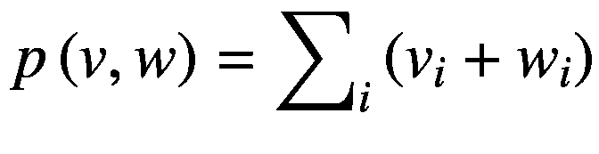

# 7. 线性代数

线性代数是一套基础的数学工具，广泛应用于科学和工程的许多领域。因此，线性代数（LA）技术也在金融编程实践中扮演着重要角色，并经常用于金融工程领域。基于 LA 的技术常用于开发交易策略。

作为 C++ 程序员，理解如何将传统的线性代数方法集成到金融应用中至关重要。为了实现这一目标，我提供了一些示例，展示如何将一些最常用的 LA 算法与其他 C++ 库结合使用。在本章中，你还会学习如何将现有的 LA 库集成到你的代码中，特别关注 boost 库中包含的 uBLAS 库。

以下是本章涉及的一些主题：

- **线性代数的基本运算**：你将在代码中学习如何使用线性代数的基础函数。
- **BLAS（基础线性代数子程序）库概述**：BLAS 是一套著名的函数集，如今已成为 LA 实现的标准。你将了解 BLAS 支持的三个级别及其功能。
- **uBLAS**：BLAS 是一个基于函数的库，已被用于 Fortran 和 C 等语言中。为了运用现代 C++ 的高级概念，boost 项目创建了一个新的实现。你将了解 uBLAS 库如何实现与 BLAS 相同的概念。
- **计算行列式**：在分析一组线性方程时，计算矩阵的行列式是最常见的任务之一。你将学习如何使用 uBLAS 执行此类 LA 计算。
- **标准类型与 uBLAS 类型之间的转换**：你将看到如何将 `std::vector` 等标准类型转换为更适合 LA 计算的类型。

## 使用基本线性代数运算

创建一个执行基本 LA 运算（如向量积和标量积）的类。

### 解决方案

线性代数已被广泛用于解决大量工程和科学问题。因此，这些概念也经常被应用于金融应用中。计算线性代数的基础层面涉及标量和向量，以及对这些数学实体允许的操作。

标量是由单一测量值构成的量。通常，它不需要创建单独的类，因为可以轻松地用整数、浮点数或双精度数来表示。此类量通常也作为单一元素存储。标量数字拥有相关的传统运算性质，如加法、减法、乘法和除法。

在 C++ 实现中，标量的使用无需特殊处理，尽管某些类可能将标量参数作为模板参数，以便日后处理不同类型。例如，这在数值库中很常见：

```cpp
template <class Scalar>
class MyNumericClass {
    void aFunction(Scalar parameter);
public:
    Scalar m_internalVar;
};
```

在这种情况下，`Scalar` 类型充当了 C++ 支持的类型（如 `int`、`float` 或 `long double`）之一的占位符。这样，你就可以根据计算所需的实际类型轻松参数化数值类，并避免不必要的数值类型转换，转换可能会给计算引入意外错误。

LA 操作的下一个层级包括向量的组合，使用向量加法、向量积和标量乘法。起初，你可能会考虑使用 `std::vector` 来执行这些操作；然而，`std::vector` 是一个通用容器，并非为数学处理而优化。

LA 实现的传统解决方案是使用 BLAS（基本线性代数子程序）库。BLAS 是一个流行的软件包，最初用 Fortran 实现，但后来已成为其他语言的 LA 计算标准。其 C 语言版本是通过 Fortran 的 `f2c` 转换器创建的。由于许多 LA 包都依赖 BLAS 提供的功能，因此在必要时已创建了其他库来模拟它。

在本节中，我将介绍一个实现了 BLAS 大部分功能的 C++ 库。uBLAS 库是 Boost 的一部分，通过包含 `<boost/numeric/ublas/vector.hpp>` 等头文件即可访问。

BLAS 及类似库根据支持级别进行组织，范围从 1 到 3。BLAS 支持级别包括以下内容：

*   **级别 1**：支持使用标量数字和向量的操作。在此级别，库为一维数值向量提供支持，包含常见操作，如标量乘法和向量积。
*   **级别 2**：在第二级别，兼容 BLAS 的库提供执行涉及向量和矩阵的计算的函数——例如，向量 `v` 与矩阵 `A` 的常见乘法，可以（产生不同结果）以 `vA` 或 `Av` 的形式执行。
*   **级别 3**：BLAS 的第三级定义为矩阵-矩阵操作。例如，它允许矩阵相乘。

这三个 BLAS 支持级别已在多个受原始 BLAS 启发而开发的库中实现。此类实现主要旨在有效支持新的编程语言、架构和处理器，同时保持与许多依赖 BLAS 的数值算法的兼容性。Boost uBLAS 库的目的是提供与 BLAS 相同的支持级别，同时利用 C++ 类和模板提供的表达能力。

在此示例中，你将探索一个名为 `VectorOperations` 的类，它负责实现级别 1 的 BLAS 操作。这意味着它必须处理向量和标量数字，以及它们之间允许的变换。根据 BLAS 文档，我们有以下操作类别：

*   **交换**：将第一个向量中的元素切换至第二个向量。
*   **缩放**：将向量的所有元素乘以单个标量数字。
*   **复制**：将第一个向量的元素复制到第二个目标向量中。
*   **向量加法**：返回一个向量，其分量是两个输入向量的逐元素相加结果。
*   **点积**：执行内积的数学运算，对于两个向量 `v` 和 `w`，使用以下公式定义：



*   **范数**：向量的范数是量化向量在特定方向长度的一种方式。一种常见的范数是两点之间的二维距离。

在 `VectorOperations` 的实现中，你将看到如何使用 uBLAS 访问其中一些操作。第一个这样的操作是向量与标量的乘法。方法签名如下：

```cpp
std::vector<double> scalarMult(double scalar);
```

此方法的目的是返回一个 `std::vector` 对象，其中每个成员都是原始向量中元素的缩放版本。该实现展示了如何在这些不同的向量类型之间进行转换。

```cpp
std::vector<double> VectorOperations::scalarMult(double scalar)
{
    using namespace boost::numeric::ublas;
    vector<double> vx;
    std::copy(m_data.begin(), m_data.end(), vx.end());
    vector<double> res = vx * scalar;
    std::vector<double> v;
    std::copy(res.begin(), res.end(), v.end());
    return v;
}
```

第一步是从 `boost::numeric::ublas` 命名空间创建一个向量。请注意，此函数使用了 `using` 声明以避免繁琐的命名空间序列。下一步是将原始 `std::vector` 复制到 `ublas` 向量中。最后，使用乘法运算符执行标量操作。为了存储结果，构建了一个名为 `res` 的新 `ublas` 向量。最后一步是将结果复制到新向量中并返回结果。

上述算法创建了许多临时变量，因此对于实际实现来说效率不高。然而，我们从标准向量转换为 `ublas` 向量这一事实，其优点在于可以突出每种向量类型能够做什么。然而，在实现更复杂的 LA 算法时，我们应该避免创建任何不必要的临时变量，因为对于大型向量和矩阵，它们可能会占用大量空间。

`VectorOperations` 类为你在 BLAS 级别 1 中会发现的其他常见操作提供了类似的示例，例如使用 `ublas` 运算符快速执行这些计算的 `addVector` 和 `subtractVector`。`dotProduct` 成员函数使用 `ublas` 中的 `inner_prod` 函数来实现点积（也称为向量间的内积操作）。最后，我们还有 `norm` 成员函数的示例，它使用 `norm_2` 函数返回向量的长度。

### 完整代码

上一节中描述的向量操作已在 `VectorOperations` 类中实现，如列表 7-1 所示。在你的系统中安装 Boost 库后，你应该能够使用任何符合标准的 C++ 编译器来编译该类。

```cpp
//
//  VectorOperations.h
#ifndef __FinancialSamples__VectorOperations__
#define __FinancialSamples__VectorOperations__
#include 
// 使用 boost ublas 对 std::vector 执行操作
class VectorOperations {
public:
VectorOperations(const std::vector &v);
VectorOperations(const VectorOperations &p);
~VectorOperations();
VectorOperations &operator=(const VectorOperations &p);
std::vector scalarMult(double scalar);
std::vector addVector(const std::vector &v);
std::vector subtractVector(const std::vector &v);
double dotProd(const std::vector &v);
double norm();
private:
std::vector m_data;
};
#endif /* defined(__FinancialSamples__VectorOperations__) */
//
//  VectorOperations.cpp
#include "VectorOperations.h"
#include 
VectorOperations::VectorOperations(const std::vector &p)
: m_data(p)
{
}
VectorOperations::VectorOperations(const VectorOperations &p)
: m_data(p.m_data)
{
}
VectorOperations::~VectorOperations()
{
}
VectorOperations &VectorOperations::operator=(const VectorOperations &p)
{
if (this != &p)
{
m_data = p.m_data;
}
return *this;
}
std::vector VectorOperations::scalarMult(double scalar)
{
using namespace boost::numeric::ublas;
vector vx;
std::copy(m_data.begin(), m_data.end(), vx.end());
vector res = vx * scalar;
std::vector v;
std::copy(res.begin(), res.end(), v.end());
return v;
}
std::vector VectorOperations::addVector(const std::vector &vec)
{
using namespace boost::numeric::ublas;
vector v1;
std::copy(m_data.begin(), m_data.end(), v1.end());
vector v2;
std::copy(vec.begin(), vec.end(), v2.end());
vector v3 = v1 + v2;
std::vector v;
std::copy(v3.begin(), v3.end(), v.end());
return v;
}
double VectorOperations::norm()
{
using namespace boost::numeric::ublas;
vector v1;
std::copy(m_data.begin(), m_data.end(), v1.end());
double res = norm_2(v1);
return res;
}
std::vector VectorOperations::subtractVector(const std::vector &vec)
{
using namespace boost::numeric::ublas;
vector v1;
std::copy(m_data.begin(), m_data.end(), v1.end());
vector v2;
std::copy(vec.begin(), vec.end(), v2.end());
vector v3 = v1 - v2;
std::vector v;
std::copy(v3.begin(), v3.end(), v.end());
return v;
}
double VectorOperations::dotProd(const std::vector &v)
{
using namespace boost::numeric::ublas;
vector v1;
std::copy(m_data.begin(), m_data.end(), v1.end());
vector v2;
std::copy(v.begin(), v.end(), v2.end());
double res = inner_prod(v1, v2);
return res;
}
```

清单 7-1 `VectorOperations.h` 和 `VectorOperations.cpp`

## 使用面向矩阵的操作

在本节中，我们将创建一个类来执行与 BLAS 兼容的矩阵操作。

### 解决方案

正如你从清单 7-1 中了解到的，LA 函数旨在与使用标量、向量和矩阵的线性算子配合使用。为了支持这些操作，程序员使用一组与原始 BLAS 库兼容的函数。在 C++ 中，我们可以使用一些实现了 BLAS 的库，包括你一直在使用的来自 boost 的 uBLAS 库。

BLAS 的第二级负责为矩阵-向量运算提供支持。在本例中，你将看到如何实现使用该级 BLAS 的函数。你将使用 boost uBLAS 来访问这个功能。

在 BLAS 的第二级，目标是允许向量和矩阵的组合。为了实现这一点，uBLAS 实现了一些更高级别的类，这些类整合了 BLAS 框架中定义的概念。以下是使用到的一些最重要的类：

- `Vector`：上一节已经讨论过这个类，它充当向量数据的通用容器。其他一些类对 `Vector` 的通用功能施加了限制。

- `稀疏向量`：`Vector` 的一个专门版本，允许以稀疏方式表示数据。当向量中非零元素的数量与数组大小相比很小时，可以使用该类。

- `Matrix`：这是表示二维数值排列的主要类，是矩阵的传统表示形式。

- `三角矩阵`：此类用于表示数据仅存储在主对角线或主对角线以上的矩阵（对于上三角矩阵）。你还可以使用 uBLAS 创建下三角矩阵。

- `对称矩阵`：此类矩阵的元素关于对角线对称。此类用于在利用此特性的算法中表示这种类型的矩阵。

- `埃尔米特矩阵`：埃尔米特矩阵具有其元素为复数且基于共轭复数概念存在对称性的特性。也就是说，对于位置 `[i,j]` 的每个元素，对应的元素 `[j,i]` 是其共轭复数。

- `带状矩阵`：此类表示稀疏矩阵，其中非零元素存储在主对角线附近的一个窄带中。创建矩阵时可以指定带状的大小。

- `稀疏矩阵`：表示通用稀疏矩阵的类——即大多数元素为零的矩阵。通过使用稀疏矩阵，可以避免在内存中存储大量零值。

使用这些类，你可以轻松地利用最适合当前任务的数据表示方式来存储数据。使用正确的表示方式还可以让你在找到正确的算法方面获得巨大优势，因为 uBLAS 会根据所使用的数据类型自动提供其运算符的专用版本。例如，如果已知一个矩阵是三角矩阵，那么在求解方程组时就有可能加快某些计算速度。这意味着使用 `TriangularMatrix` 而不是通用的 `Matrix` 可以让你的代码得到显著的加速。

为了探索矩阵可用的操作，我介绍一个名为 `MatrixOperations` 的类。这个类能够将参数转换为 uBLAS 所需的类。它还负责对这些转换后的参数调用 uBLAS 运算符。使用这个类，你可以轻松地测试多个对矩阵参数进行操作的函数。

在 uBLAS 中与矩阵相关的主要函数和运算符中，你将找到以下内容：

- **标量乘法**：将矩阵乘以标量是一个简单的过程，因为它使用了 C++ 中的标准乘法运算符。你只需将乘法的结果保存到一个新的矩阵变量中即可。

- **向量乘法**：将矩阵乘以向量是一种常见操作。你可以使用 `prod` 函数来执行此操作。乘积可以通过两种方式执行：前置乘法要求向量作为 `prod` 函数的第一个参数；你也可以对向量进行后置乘法，此时向量作为 `prod` 函数的第二个参数传入。

- **矩阵乘法**：你还可以将两个矩阵相乘。这将得到第三个矩阵，其大小由两个原始矩阵的大小决定。你可以使用 `prod` 函数的重载版本来执行乘法操作。

- **逐元素乘法**：此操作对矩阵中每个对应的元素执行乘法。也就是说，给定矩阵`A`和`B`，结果矩阵`C`由元素`C[i,j] = A[i,j] + B[i,j]`组成。

- **转置**：矩阵的转置是一个简单的操作，即将元素`A[i,j]`与`A[j,i]`互换。这会产生一个围绕主对角线对原始矩阵进行转置后的矩阵。

在`MatrixOperations`类中，您将找到这些操作的示例。`MatrixOperations`成员函数的参数和返回值以标准向量（`std::vector`）或`Matrix`对象（您在第 5 章中了解过）的形式给出。虽然在高性能代码中应避免这种转换，但您可以将其视为创建 uBLAS 中声明的类型对象所需的一个示例。例如，考虑`transpose`方法。

```
Matrix MatrixOperations::transpose()
{
    using namespace ublas;
    int d1 = m_rows.size();
    int d2 = m_rows[0].size();
    matrix M(d1, d2);
    for (int i = 0; i < d1; ++i) {
        for (int j = 0; j < d2; ++j) {
            M(i, j) = m_rows[i][j];
        }
    }
    matrix mp = trans(M);
    return fromMatrix(mp);
}
```

第一步是确定需要构建的矩阵的大小，由维度`d1`和`d2`给出。利用此信息，您可以创建一个新的`ublas::matrix`对象。然后，您将使用存储在`m_rows`成员变量中的数据初始化该矩阵。最后，您可以调用 uBLAS 中的`trans`函数，该函数负责对其参数进行转置操作。最后一步是将 uBLAS 表示转换为`Matrix`对象，由`fromMatrix`函数执行。

### 完整代码

清单 7-2 展示了`MatrixOperations`类的实现。该代码使用了第 5 章中实现的`Matrix`类，因此您需要将其添加到编译行中。

# MatrixOperations

## 头文件 (`MatrixOperations.h`)

```cpp
//
//  MatrixOperations.h
#ifndef __FinancialSamples__MatrixOperations__
#define __FinancialSamples__MatrixOperations__
#include <vector>
#include "Matrix.h"
class MatrixOperations {
public:
    MatrixOperations();
    ~MatrixOperations();
    MatrixOperations(const MatrixOperations &p);
    MatrixOperations &operator=(const MatrixOperations &p);
    void addRow(const std::vector<double> &row);
    Matrix multiply(Matrix &m);
    Matrix transpose();
    Matrix elementwiseMultiply(Matrix &m);
    Matrix scalarMultiply(double scalar);
    std::vector<double> preMultiply(const std::vector<double> &v);
    std::vector<double> postMultiply(const std::vector<double> &v);
private:
    std::vector< std::vector<double> > m_rows;
};
#endif /* defined(__FinancialSamples__MatrixOperations__) */
```

## 实现文件 (`MatrixOperations.cpp`)

```cpp
//
//  MatrixOperations.cpp
#include "MatrixOperations.h"
#include <iostream>
#include <boost/numeric/ublas/matrix.hpp>
#include <boost/numeric/ublas/io.hpp>
namespace ublas = boost::numeric::ublas;
using std::cout;
using std::endl;
MatrixOperations::MatrixOperations()
{
}
MatrixOperations::~MatrixOperations()
{
}
void MatrixOperations::addRow(const std::vector<double> &row)
{
    m_rows.push_back(row);
}
static Matrix fromMatrix(const ublas::matrix<double> &mp)
{
    using namespace ublas;
    int d1 = mp.size1();
    int d2 = mp.size2();
    Matrix res(d1, d2);
    for (int i = 0; i < d1; ++i) {
        for (int j = 0; j < d2; ++j) {
            res.set(i, j, mp(i, j));
        }
    }
    return res;
}
Matrix MatrixOperations::elementwiseMultiply(Matrix &m)
{
    using namespace ublas;
    int d1 = m_rows.size();
    int d2 = m_rows[0].size();
    matrix<double> M(d1, d2);
    for (int i = 0; i < d1; ++i) {
        for (int j = 0; j < d2; ++j) {
            M(i, j) = m_rows[i][j];
        }
    }
    matrix<double> M2(d1, d2);
    for (int i = 0; i < d1; ++i) {
        for (int j = 0; j < d2; ++j) {
            M2(i, j) = m.get(i, j);
        }
    }
    matrix<double> mp = element_prod(M, M2);
    return fromMatrix(mp);
}
Matrix MatrixOperations::transpose()
{
    using namespace ublas;
    int d1 = m_rows.size();
    int d2 = m_rows[0].size();
    matrix<double> M(d1, d2);
    for (int i = 0; i < d1; ++i) {
        for (int j = 0; j < d2; ++j) {
            M(i, j) = m_rows[i][j];
        }
    }
    matrix<double> mp = trans(M);
    return fromMatrix(mp);
}
Matrix MatrixOperations::multiply(Matrix &m)
{
    using namespace ublas;
    int d1 = m_rows.size();
    int d2 = m_rows[0].size();
    matrix<double> M(d1, d2);
    for (int i = 0; i < d1; ++i) {
        for (int j = 0; j < d2; ++j) {
            M(i, j) = m_rows[i][j];
        }
    }
    matrix<double> M2(d1, d2);
    for (int i = 0; i < d1; ++i) {
        for (int j = 0; j < d2; ++j) {
            M2(i, j) = m.get(i, j);
        }
    }
    matrix<double> mp = prod(M, M2);
    return fromMatrix(mp);
}
Matrix MatrixOperations::scalarMultiply(double scalar)
{
    using namespace ublas;
    int d1 = m_rows.size();
    int d2 = m_rows[0].size();
    matrix<double> M(d1, d2);
    for (int i = 0; i < d1; ++i) {
        for (int j = 0; j < d2; ++j) {
            M(i, j) = m_rows[i][j];
        }
    }
    matrix<double> mp = scalar * M;
    return fromMatrix(mp);
}
std::vector<double> MatrixOperations::preMultiply(const std::vector<double> &v)
{
    using namespace ublas;
    ublas::vector<double> vec;
    std::copy(v.begin(), v.end(), vec.end());
    int d1 = m_rows.size();
    int d2 = m_rows[0].size();
    ublas::matrix<double> M(d1, d2);
    for (int i = 0; i < d1; ++i) {
        for (int j = 0; j < d2; ++j) {
            M(i, j) = m_rows[i][j];
        }
    }
    ublas::vector<double> pv = prod(vec, M);
    std::vector<double> res;
    std::copy(pv.begin(), pv.end(), res.end());
    return res;
}
std::vector<double> MatrixOperations::postMultiply(const std::vector<double> &v)
{
    using namespace ublas;
    ublas::vector<double> vec;
    std::copy(v.begin(), v.end(), vec.end());
    int d1 = m_rows.size();
    int d2 = m_rows[0].size();
    ublas::matrix<double> M(d1, d2);
    for (int i = 0; i < d1; ++i) {
        for (int j = 0; j < d2; ++j) {
            M(i, j) = m_rows[i][j];
        }
    }
    ublas::vector<double> pv = prod(M, vec);
    std::vector<double> res;
    std::copy(pv.begin(), pv.end(), res.end());
    return res;
}
int main()
{
    MatrixOperations op;
    for (int i=0; i<5; ++i) {
        std::vector<double> row;
        for (int j=0; j<5; ++j) {
            row.push_back(sin((double)j+i));
        }
        op.addRow(row);
    }
    op.transpose();
    Matrix res = op.scalarMultiply(12);
    return 0;
}
```

*清单 7-2 `MatrixOperations.h`和`MatrixOperations.cpp`*

### 运行应用程序

清单 7-2 中显示的代码可以使用任何符合标准的 C++编译器进行编译。您需要在系统中安装`boost`才能访问 uBLAS（我使用了 1.55 版本，在 Windows MingW 和 Mac OS X 上测试过）。例如，在 UNIX 系统上使用`gcc`编译器可以通过以下命令完成：

```
gcc –o matrixOp matrixOperations.cpp
```

这将生成一个名为`matrixOp`的应用程序。您可以通过以下方式运行生成的应用程序：

```
./matrixOp
```

这将运行测试的`main`函数，该函数应打印出所请求操作的结果。在我的系统上，我得到了以下结果：

```
0 10.0977 10.9116 1.69344 -9.08163
10.0977 10.9116 1.69344 -9.08163 -11.5071
10.9116 1.69344 -9.08163 -11.5071 -3.35299
1.69344 -9.08163 -11.5071 -3.35299 7.88384
-9.08163 -11.5071 -3.35299 7.88384 11.8723
```

### 计算矩阵的行列式

编写 C++代码，使用 uBLAS 中的类计算矩阵的行列式。

### 解决方案

计算矩阵的行列式是线性代数理论中的经典问题之一。该值可用于判断方程组（由系数矩阵表示）是否存在唯一解。

为了在 C++ 中轻松计算矩阵的行列式，你可以使用 boost uBLAS 库中的一些类和函数。这些函数利用了 `matrix` 类，该类是 uBLAS 中矩阵的内部表示形式之一。

解决此类问题的常见方案采用一种简单而优雅的算法，该算法在任何线性代数课程中都会教授。基本思路是使用递归策略计算子矩阵的行列式，直至找到完整矩阵的行列式。然而，`computeDeterminant` 函数所使用的算法在计算上更为高效，因为它利用了 LU 分解的结果。LU 分解是一种将矩阵分解为下三角和上三角分量的方法。

如果矩阵是非奇异的，`lu_factorize` 函数将返回零，这意味着该矩阵可逆，并且其对应的线性系统可使用高斯消元法求解。随后，矩阵会通过高斯消元过程进行重排。此外，还会使用一个置换矩阵来记录消元过程的步骤。

基于这些信息，行列式计算的算法被编码在 `computeDeterminant` 函数中。它利用主对角线存储的值和置换矩阵中的信息来计算给定矩阵对应的行列式。你可以在下一节中看到该方法的完整算法。

### 完整代码

清单 7-3 展示了 uBLAS 库的一个示例。如上一节所述，`determinantSample` 函数使用 uBLAS 中的一些模板来计算矩阵的行列式。

```cpp
//
// Determinant.cpp
#include <boost/numeric/ublas/matrix.hpp>
#include <boost/numeric/ublas/vector.hpp>
#include <boost/numeric/ublas/lu.hpp>
#include <iostream>
#include <cmath>
namespace ublas = boost::numeric::ublas;
using std::cout;
using std::endl;
// 根据给定的置换计算符号。
// 每次置换变化时翻转符号。
int getDeterminantSign(const ublas::permutation_matrix& pm)
{
int sign = 1;
for (int i = 0; i < pm.size1() ; ++i)
{
if (pm(i) != i)
sign *= -1;
}
return sign;
}
// 使用置换矩阵计算行列式。
double computeDeterminant(ublas::matrix<double>& m)
{
ublas::permutation_matrix pm(m.size1());
double det = 1.0;
if (ublas::lu_factorize(m,pm))
{
det = 0.0;
}
else
{
for(int i = 0; i < m.size1(); i++)
det *= m(i,i);
det = getDeterminantSign(pm) * det;
}
return det;
}
int main (int argc, const char * argv[])
{
ublas::matrix<double> M(3, 3);
for (unsigned i = 0; i < M.size1() ; ++i)
{
for (unsigned j = 0; j < M.size2() ; ++j)
{
M(i,j) = sin(3 * j);
}
}
double determinant = computeDeterminant(M);
cout << " determinant value is " << determinant
<< " for matrix " << M << endl;
}
```

*清单 7-3 Determinant.cpp*

### 结论

本章包含了几个用于 C++ 线性代数计算的编程示例。本次讲解的目标之一，是展示数学导向的代码如何被金融应用开发人员使用。线性代数是后续章节将要探讨的许多计算技术（如数学规划和投资组合优化）的基础。

在本章中，我首先介绍了一些重要的线性代数库。由于线性代数是一个高度专业化的领域，对程序员来说，最好的方法就是使用包含该领域专家编写的、经过充分测试的组件代码。基础线性代数领域，计算数学的标准是 BLAS 库。尽管 BLAS 是一个 Fortran 和 C 语言库，但其概念已被移植到许多其他语言中。在本章中，你了解了 uBLAS，它是 boost 库的一个组件，实现了与 BLAS 相同级别的功能。然而，它是通过使用现代 C++ 技术（如类和模板）来实现的。这可以被视为一种更简便地实现 BLAS 功能的方式，同时支持高级的 C++ 接口。

清单 7-1 中的第一个示例展示了如何使用 uBLAS 对向量和标量执行基本的（第一级）运算。`VectorOperations` 类展示了如何使用 uBLAS 框架调用这些基本概念。

更高级的运算可用于矩阵。第二个示例（清单 7-2）包含了与 uBLAS 中矩阵和向量交互的信息和代码示例。uBLAS 可以轻松执行的简单运算包括矩阵的标量乘法、向量乘法、转置以及矩阵-矩阵乘法。

清单 7-3 的示例展示了如何将这些概念结合使用来计算矩阵的行列式。为了便于解决这个问题，你可以使用 uBLAS 提供的 LU 分解函数。这表明，这些线性代数库中的一些复杂算法可以轻松用于解决实际问题。

在下一章中，我们将继续探索金融应用中使用的数学工具。我将向你展示几个关于插值的示例，这是一种常用于在数据集（包括金融数据）中寻找趋势的技术。与其他计算技术一起，插值被广泛应用于交易策略的开发和分析中。