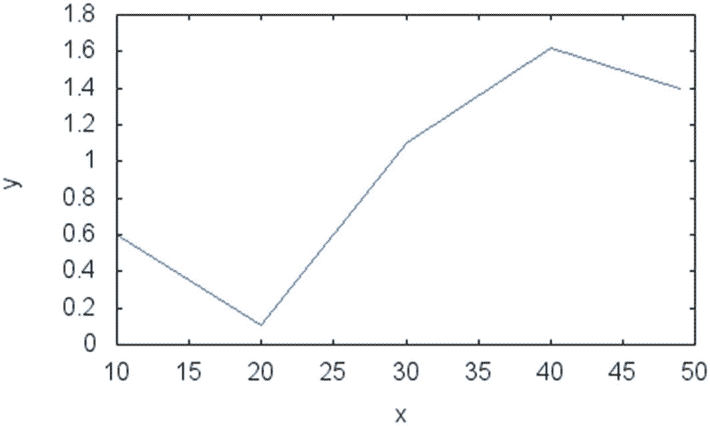
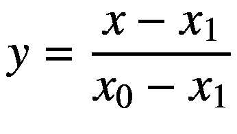
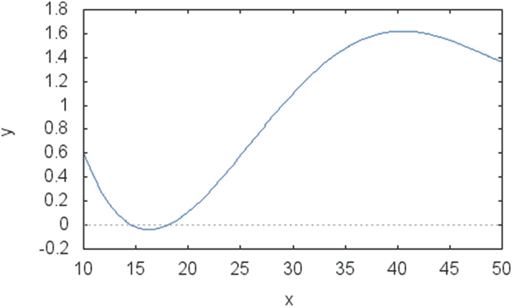
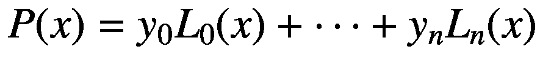

# 8. 插值

插值是一种常用技术，它基于输入的一组点来逼近一个数学函数。快速插值是金融工程多个领域高性能算法的秘诀，这将在后续章节中探讨。本章展示了几个编程示例，涵盖了插值技术的一些最常见方面，以及它们在 C++ 中的高效实现。你将探索应用中使用的核心流程，并了解它们在实际中如何运作的示例。

以下是本章涵盖的一些主题：

- **插值示例：** 简要讨论展示插值在金融问题中有效性的示例。
- **线性插值：** 线性插值是最简单的插值技术之一，它使用可以用线段表示的线性函数。该技术的快速特性使其成为针对难以计算的函数最常用的插值形式之一。


## 多项式插值

若需要函数的不同部分之间平滑过渡，则无法直接使用线性插值。多项式插值允许使用单个函数，通过一个高次多项式来近似所有给定的点。你将了解如何构造这个多项式，并为定义域的每个值返回所需的函数。

## 线性插值

针对使用线性近似对给定数据点集进行插值的问题，编写解决方案及 C++ 代码。

### 解决方案

插值是根据给定点集，寻找可用于近似未知函数的一个函数（或一组函数）的过程。该过程的输入是您想要插值的点，输出是一个通用函数，可用于计算输入集之外点的未知值。

例如，假设您有一个由一组观测值组成的时间序列。通常需要找到一个生成这些点的未知函数。对该未知函数的估计也可用于计算所需时间点的相应值。

插值已被应用于科学与工程多个领域，作为近似函数的一种方法。这可能是必要的，因为原始函数确实未知（例如经验过程的情况），或者因为该函数很难精确计算。在金融领域，插值也扮演着重要角色，通常是更复杂算法的一部分。例如，在金融时间序列中，插值允许从业者计算难以直接计算的时间序列值，同时只使用未知函数的近似值。此外，在某些应用中，插值还可用于预测值，至少对于短期预测是这样。在此角色中，它也可以作为交易算法中的一个简单预测组件。

本节将介绍如何使用线性函数进行插值。这是对点集进行插值的最简单方法，因为它每次只需要两个点来直接连接输入值。例如，假设您有一组点，如图 8-1 所示。



图 8-1 第一个示例中点的插值图

```
y1 = (10,0.6), y2 = (20,0.11), y3 = (30,1.1), y4 = (40,1.62), y5 = (49,1.4).
```

这些点不需要均匀间隔，尽管当需要线性插值时，均匀间隔可能效果更好。利用这些点，可以想象一种简单的插值方法。创建插值的策略是：基于点的第一维度（图 8-1 中的 x 轴）对输入点进行排序，然后用一条线连接恰好位于所需 x 值之前和之后的两个点。然后，插值由下图 8-1 之后列表的步骤 4 中的公式给出。

因此，线性插值算法可总结为以下步骤：

1.  读取输入值`(x[i], y[i])`和所需的坐标值`x`。
2.  按第一个坐标`(x[i])`的递增顺序对输入进行排序。
3.  计算第一对点`(x[i], y[i])`，`(x[j], y[j])`，使得`j = i + 1`且`x`位于`x[i]`和`x[j]`之间。
4.  使用以下方程确定对应于`x`的`y`值：



您可以轻松地在 C++ 中实现此算法，以便为每个`x`值计算函数。我将介绍`LinearInterpolation`作为负责存储必要数据以及使用此插值技术计算点的主类。该类的构造函数旨在减少创建新对象的开销。该类提供了`setPoints`成员函数作为定义已知插值点的方法。该成员函数保留作为参数传递的值。它还确保点按 x 值递增的顺序存储。这是通过一个简单的算法对 x 值进行排序来实现的（使用标准函数`std::sort`）。

### 完整代码

```cpp
//
//  LinearInterpolation.h
#ifndef __FinancialSamples__LinearInterpolation__
#define __FinancialSamples__LinearInterpolation__
#include 
class LinearInterpolation {
public:
LinearInterpolation();
LinearInterpolation(const LinearInterpolation &p);
~LinearInterpolation();
LinearInterpolation &operator=(const LinearInterpolation &p);
void setPoints(const std::vector &xpoints, const std::vector &ypoints);
double getValue(double x);
private:
std::vector m_x;
std::vector m_y;
};
#endif /* defined(__FinancialSamples__LinearInterpolation__) */
//
//  LinearInterpolation.cpp
#include "LinearInterpolation.h"
LinearInterpolation::LinearInterpolation()
: m_x(),
m_y()
{
}
LinearInterpolation::LinearInterpolation(const LinearInterpolation &p)
: m_x(p.m_x),
m_y(p.m_y)
{
}
LinearInterpolation::~LinearInterpolation()
{
}
LinearInterpolation &LinearInterpolation::operator=(const LinearInterpolation &p)
{
if (this != &p)
{
m_x = p.m_x;
m_y = p.m_y;
}
return *this;
}
void LinearInterpolation::setPoints(const std::vector &xpoints,
const std::vector &ypoints)
{
m_x = xpoints;
m_y = ypoints;
// update points to become sorted on x axis.
std::sort(m_x.begin(), m_x.end());
for (int i=0; i m_x[m_x.size()-1])
{
return 0; // outside of domain
}
for (int i=0; i= x)
{
x1 = m_x[i];
y1 = m_y[i];
break;
}
}
return y0 * (x-x1)/(x0-x1) +  y1 * (x-x0)/(x1-x0);
}
int main()
{
double xi = 0;
double yi = 0;
vector xvals;
vector yvals;
while (cin >> xi)
{
if (xi == -1)
{
break;
}
xvals.push_back(xi);
cin >> yi;
yvals.push_back(yi);
}
double x = 0;
cin >> x;
LinearInterpolation li;
li.setPoints(xvals, yvals);
double y = li.getValue(x);
cout << "interpolation result for value " << x << " is " << y << endl;
return 0;
}
```

### 运行代码

例如，再次考虑图 8-1 所示示例中的点。要计算值 27 的线性插值，您需要执行应用程序并输入以下数据：

```
./linearInterpolation
10 0.6
20 0.11
30 1.1
40 1.62
49 1.4

interpolation result for value 27 is 0.803
```

## 多项式插值

用 C++ 为给定点集构造一个多项式插值。


### 解决方案

在前一个示例中，你了解了如何通过分段线性方程，利用数据点在连续区间内进行插值。然而，尽管线性插值在大量实际场景中可行，但这种近似方法的问题在于生成的曲线不光滑。这意味着曲线在**不同线段**的交界处会包含表示函数过渡的拐点。从数学上讲，由于这种突然的过渡，这样的函数被认为是**不可微**的。在某些应用中，这种可察觉的变化是不期望的，你可能希望以一种使观测点之间过渡平滑的方式来进行插值。

为了避免使用线性插值所描述的问题，可以采用更复杂的方案，即使用更高次的多项式来平滑过渡。更重要的是，使用这种方法求得的单个多项式可以同时对所有给定数据点进行插值。这种插值的结果是，你只需要一个多项式方程即可为任何所需输入生成值。

多项式插值基于这样一个数学事实：给定一个次数足够高的多项式，可以找到一个对应的多项式函数，该函数恰好通过作为输入提供的那些点。由于多项式的某些已知代数性质，这一点是得到保证的。例如，假设我们有以下点序列（与线性插值示例中使用的点相同）：

```
y1 = (10,0.6), y2 = (20,0.11), y3 = (30,1.1), y4 = (40,1.62), y5 = (49,1.4).
```

多项式插值算法会返回一个基于由一组系数定义的多项式的值。利用这些信息，你可以计算任何中间点，甚至超出给定观测范围的点，因为多项式通常对所有实数都有定义。你还可以使用计算出的多项式来绘制插值函数的值，如图 8-2 所示。



**图 8-2** 使用少量观测值进行插值的多项式函数：请注意，与使用线段的图 8-1 中的解决方案不同，该多项式函数是光滑的

此处用于解决这个多项式插值问题的技术称为**拉格朗日插值算法**。使用拉格朗日插值方法，对于每组 *n*+1 个点 (*x*<sub>i</sub>, *y*<sub>i</sub>)，你可以创建一个次数为 *n* 且通过这些点的多项式。使用给定的输入点，多项式系数的通用公式如下：

![$$ {L}_k(x)=\frac{\left(x\kern0.5em -\kern0.5em {x}_0\right)\left(x\kern0.5em -\kern0.5em {x}_1\right)\dots \left(x\kern0.5em -\kern0.5em {x}_{k-1}\right)\left(x\kern0.5em -\kern0.5em {x}_{k+1}\right)\dots \left(x\kern0.5em -\kern0.5em {x}_n\right)}{\left({x}_k\kern0.5em -\kern0.5em {x}_0\right)\left({x}_k\kern0.5em -\kern0.5em {x}_1\right)\dots \left({x}_k\kern0.5em -\kern0.5em {x}_{k-1}\right)\left({x}_k\kern0.5em -\kern0.5em {x}_{k+1}\right)\dots \left({x}_k\kern0.5em -\kern0.5em {x}_n\right)} $$](img/323908_2_En_8_Chapter_TeX_Equb.png)

注意，该函数跳过了 *x*<sub>k</sub> 的值，以避免分子和分母中出现零项。现在，用于插值输入值 *x*<sub>k</sub> 的完整多项式表示可以使用系数 *L*<sub>k</sub>(*x*) 写成如下形式：



这是一个可用于提供任何值的插值的函数，给定 *n*+1 个输入观测值 (*x*<sub>i</sub>, *y*<sub>i</sub>)。该公式的证明超出了本节的目标，但请注意，当输入值 *x* 是已知的某个 *x*<sub>i</sub> 时，除了 *L*<sub>i</sub>(*x*) 项外，所有项都会因为包含分量 *x* – *x*<sub>i</sub> 而结果为零。然而，在那种情况下，分子与分母相同，结果值为 1。因此，对于这些值，解正如预期的那样就是 *y*<sub>i</sub>。

使用这个多项式函数，我们可以创建一个 C++ 类，通过模拟期望的多项式来实现插值机制。这通过 `PolynomialInterpolation` 类来实现。该类的设计与 `LinearInterpolation` 类似，存储通过 `setPoints` 成员函数传入的 x 和 y 值。利用这些信息，`PolynomialInterpolation` 能够基于初始点执行必要的计算。

实际工作是在 `getValue` 成员函数中计算多项式插值，该函数重写如下：

```
double PolynomialInterpolation::getPolynomial(double x)
{
double polynomialValue = 0;
for (size_t i=0; i<m_x.size(); ++i)
{
// 计算分子
double num = 1;
for (size_t j=0; j<m_x.size(); ++j)
{
if (j!=i)
{
num *= x - m_x[j];
}
}
// 计算分母
double den = 1;
for (size_t j=0; j<m_x.size(); ++j)
{
if (j!=i)
{
den *= m_x[i] - m_x[j];
}
}
// 第 i 项的值
polynomialValue += m_y[i] * (num/den);
}
return polynomialValue;
}
```

计算以迭代方式进行，在 `for` 循环的每一步中，计算其中一个多项式 *L*<sub>k</sub>(*x*) 并将其累加到局部变量 `polynomialValue` 中。循环内部可以分为三部分。第一部分，计算分子，即所有项 *x – x*<sub>j</sub> 的乘积，当 *i = j* 时该项不参与计算。第二部分是分母的计算，与第一步非常相似，你查看原始公式就能确认。分母的值存储在局部变量 `den` 中。第三步，将 *y* 的值乘以前两步计算出的分子与分母构成的分数。

前面所述算法的复杂度取决于给定的输入。你提供的输入值越多，该算法执行时间就越长。时间变化与输入值的数量成二次关系，因为对于每个值，我们需要在第二层循环内执行一个 `for` 循环，并且每个这样的循环运行的次数等于所使用的点数。就计算复杂度而言，这被称为具有 *O*(*n*²) 的时间复杂度。

### 完整代码


```cpp
//
//
//  PolymonialInterpolation.h
#ifndef __FinancialSamples__PolymonialInterpolation__
#define __FinancialSamples__PolymonialInterpolation__
#include <vector>

class PolynomialInterpolation {
public:
    PolynomialInterpolation();
    PolynomialInterpolation(const PolynomialInterpolation &p);
    ~PolynomialInterpolation();
    PolynomialInterpolation &operator=(const PolynomialInterpolation &);
    void setPoints(const std::vector<double> &x, const std::vector<double> &y);
    double getPolynomial(double x);

private:
    std::vector<double> m_x;
    std::vector<double> m_y;
};

#endif /* defined(__FinancialSamples__PolymonialInterpolation__) */

//
//  PolymonialInterpolation.cpp
#include "PolymonialInterpolation.h"

PolynomialInterpolation::PolynomialInterpolation()
    : m_x(),
      m_y()
{
}

PolynomialInterpolation::PolynomialInterpolation(const PolynomialInterpolation &p)
    : m_y(p.m_y),
      m_x(p.m_x)
{
}

PolynomialInterpolation::~PolynomialInterpolation()
{
}

PolynomialInterpolation &PolynomialInterpolation::operator=(const PolynomialInterpolation &p)
{
    if (this != &p)
    {
        m_x = p.m_x;
        m_y = p.m_y;
    }
    return *this;
}

void PolynomialInterpolation::setPoints(const std::vector<double> &x,
                                       const std::vector<double> &y)
{
    m_x = x;
    m_y = y;
}

double PolynomialInterpolation::getPolynomial(double x)
{
    double polynomialValue = 0;
    for (size_t i = 0; i < m_x.size(); i++)
    {
        double product = m_y[i];
        for (size_t j = 0; j < m_x.size(); j++)
        {
            if (i != j)
            {
                product = product * ((x - m_x[j]) / (m_x[i] - m_x[j]));
            }
        }
        polynomialValue += product;
    }
    return polynomialValue;
}

#include <iostream>
#include <vector>

int main()
{
    std::vector<double> xvals;
    std::vector<double> yvals;
    double xi, yi;
    while (std::cin >> xi)
    {
        if (xi == -1)
        {
            break;
        }
        xvals.push_back(xi);
        std::cin >> yi;
        yvals.push_back(yi);
    }
    double x = 0;
    std::cin >> x;
    PolynomialInterpolation pi;
    pi.setPoints(xvals, yvals);
    double y = pi.getPolynomial(x);
    std::cout << "interpolation result for value " << x << " is " << y << std::endl;
    return 0;
}
```

### 运行代码

要运行上述代码，首先需要使用 C++ 编译器（如 `gcc`）进行编译。然后可以按如下方式执行代码：

```
./polyInterpolation
10 0.6
20 0.11
30 1.1
40 1.62
49 1.4

interpolation result for value 27 is 0.795433
```

该代码使用刚刚显示的数据多次执行。图 8-2 展示了结果数据的图示。请注意，图中显示了一个通过输入点集的平滑函数。这证明了上述代码计算的多项式是对给定点集的一个良好且平滑的插值结果。

### 结论

在本章中，你学习了插值法——一种在已知值数据集基础上为函数寻找合理近似的数学技术。插值法在金融数据分析中发挥着重要作用，因为它提供了一种分析和简化复杂函数计算的方法。它还可以让人们对未来价格变化进行简单预测，并有助于更好地理解历史数据。你已看到几个编程示例，它们说明了如何在 C++ 编程上下文中使用插值法。

最初，你学习了线性插值法，这是一种在仅知道原函数少数几个点时进行插值的简单方法。该技术仅使用线性函数来执行所需的插值。你看到了一个示例 C++ 类，它可用于为函数定义域内的任意给定值返回插值结果。

接下来，你了解了如何利用多项式提供的更好近似技术来插值函数值。使用多项式，你可以创建一个平滑（可微）的函数，该函数在 `n+1` 个点上经过给定的点，其中 `n` 是多项式的次数。你学习了一个简单的公式——拉格朗日法，它可用于从任意给定点集创建此类多项式插值。你还学习了如何编写实现该算法的 C++ 类。我提供了一个完整示例，演示如何使用此类对给定值集生成平滑插值。

在下一章中，你将学习金融应用中使用的另一项重要数学技能。方程求根是一项基础技术，它可以帮助你找到经济和工程领域许多重要问题的解。你将看到如何在 C++ 中实现和使用方程求根方法。

