# 9. 计算方程的根

解方程是许多工程和科学算法的基石之一。一个典型例子是使用布莱克-舒尔斯模型进行期权和衍生品定价所需的计算。随着金融算法日益复杂，通常需要计算各种方程的结果。这些结果常用于投资分析和新交易策略中。不仅要能解方程，还要能以高效方式计算此类方程的根，这一点非常重要。

在本章中，你将学习一些计算方程根的常用方法。这里提供的代码示例涵盖了计算方程根的不同方法，并解释了它们的工作原理及适用场景。以下是本章涵盖的部分主题：

*   **二分法**：一种探索根附近符号变化的简单方法，易于实现。你将学习二分法的基础知识以及如何在 C++ 中编写其代码。
*   **割线法**：割线法是对二分法的改进，它尝试利用函数在给定区间内的值来指导根的新近似位置。在许多情况下，割线法可以加速根的搜索过程。
*   **牛顿法**：该方法有时也称为牛顿/拉夫逊法，它利用函数的导数来指导对方程根的搜索。由于导数决定了函数切线的斜率，其值可用于计算新的近似值。连续迭代值可能收敛到所需的解，并可使用误差参数来决定何时停止搜索。

### 二分法

创建一个实现二分法的类来寻找方程的根。


### 解法

求解方程的根，就是找出函数值为零的所有点。在计算数学的发展过程中，人们设计出了多种求解方程根的方法。本章将介绍其中几种最常见的方法。

二分法采用一种简单的策略来寻找方程的根：其思想是观察函数在定义域不同点的符号，并利用这些信息来判断该区间内是否存在根。例如，考虑函数 *f*(*x*) = (*x*–1)³。

图 9-1 展示了该函数在区间 -1 到 3 上的图形。

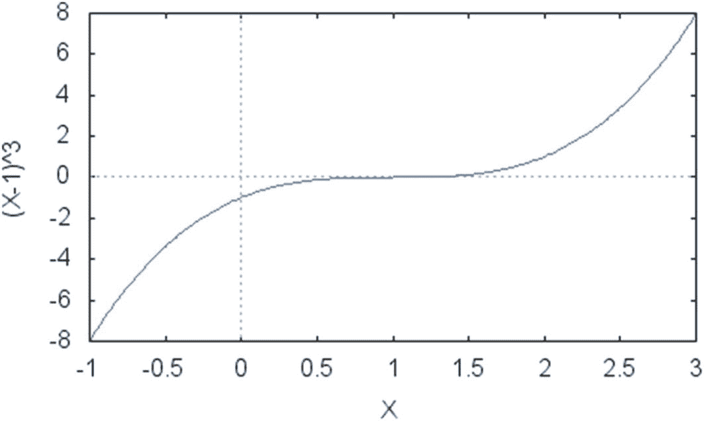

图 9-1：区间 -1 到 3 上的函数 (x–1)³

该函数在 `x=1` 处有一个根，并且有两个符号截然不同的区域：当 `x<1` 时，符号为负；当 `x>1` 时，函数符号为正。若要精确确定函数为零的点，可以从一个函数符号不同的区间开始（本例中可使用区间 -1 到 3），然后寻找函数符号改变的确切位置：那里必定是函数的一个根。

> **注**：此论证仅当所处理的函数是连续函数时才成立。也就是说，函数不存在从一个点突然跳变到另一个点的情况，否则上述论证将失效。连续函数在其定义域内是可微的，因此这是判断函数是否连续的一种方法。经济学、物理学和工程学中的大多数函数都具有这一性质，因此我们假设应用二分法时函数都是连续的。

基于这一直观认识，二分法尝试采用一种系统的方法来确定所测试的区间以及符号发生变化的位置。本质上，该方法是将原始区间一分为二，并判断子区间是否仍然存在符号差异。

例如，仍使用同一函数，假设我们取原始区间为 -1 到 2。该区间的中点是 ½，因此算法将检查 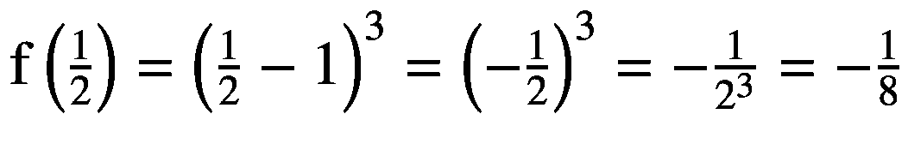 的符号。现在，考虑初始区间两个端点的符号：

- *f*(–1) = (–1–1)³ = –8，因此符号为负。
- *f*(2) = (2–1)³ = 1³ = 1，因此符号为正。

这意味着在 *x* = –1 和 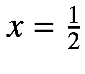 之间，符号相同。另一方面，在  和 *x* = 2 之间，符号发生了变化。因此，根必定位于符号变化的位置，即在 ½ 和 2 之间的某处。

对该过程再迭代一次，计算 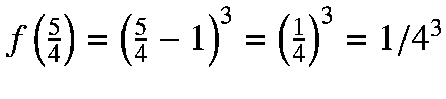 的值，结果为正值。由于 *f*(1/2) 为负，*f*(2) 为正，符号变化必定发生在区间  到  之间。通过查看图 9-1 中的图形，很容易验证这一点。请注意，此过程将系统性地缩小我们寻找方程根的区间范围。每一步，区间长度都缩减一半，使我们更接近根的位置。经过多次迭代后，你将得到一个与真实根足够接近的数值。因此，当剩余区间的长度小于所需误差时，该算法即可停止。例如，如果区间长度小于 0.001，而所需误差为 0.01，则可以停止。

利用刚刚描述的过程，我们现在可以用以下方式描述二分算法的步骤：

1.  定义一个初始区间 `(a,b)`，你希望在该区间内寻找方程的一个或多个根。

2.  计算 *f*(*a*) 和 *f*(*b*) 的值。

3.  确定区间 (*a*,*b*) 的中点 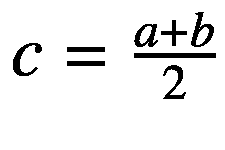 及其对应的函数值 *f*(*c*)。

4.  如果 *f*(*a*) 和 *f*(*c*) 的符号不同，则 (*a*,*c*) 成为算法的新区间。否则，新区间定义为 (*c*,*b*)。

5.  如果新区间的长度小于误差（阈值）*E*，则停止并将 *c* 报告为解。否则，继续执行步骤 1。

上述算法以迭代方式工作，区间 (*a*,*b*) 的长度不断减半。因此，它将执行的步数上限为 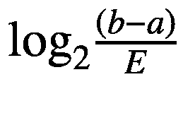。迭代次数与所需近似精度之间存在权衡，这意味着如果你希望误差非常小，则需要更多次的迭代。

上述过程已被编码为 `BisectionSolver` 类的一部分，可用于求解方程的根。`BisectionSolver` 的一个有趣特性是，它可以作为任何连续函数的通用求解器。你只需将函数作为参数传递给该类的构造函数。

为此，我创建了一个名为 `MathFunction` 的类，它不仅在此处有用，也对其他将函数作为参数的类有用。`MathFunction` 类定义了一个所谓的函数对象，即一个行为类似于函数的对象。这对我们的算法很重要，因为它允许我们将该对象像函数一样使用。

要创建一个函数对象，你需要一个实现了 `operator()`（即函数调用运算符）的类。此外，我将 `MathFunction` 类定义为一个模板类，这样你就可以在创建具体实现时传入正确的返回类型。例如，你可能想要定义一个仅针对 `float` 类型的 `MathFunction` 子类。或者，反过来，你可能有一个定义域为整数集的函数。


```cpp
// MathFunction.h
#ifndef MATHFUNCTION_H_
#define MATHFUNCTION_H_
template <typename Res>
class MathFunction {
public:
    MathFunction();
    virtual ~MathFunction();
    virtual Res operator()(Res value) = 0;
};
#endif /* MATHFUNCTION_H_ */

// BisectionMethod.h
#ifndef BISECTIONMETHOD_H_
#define BISECTIONMETHOD_H_
template <typename Res>
class MathFunction;
class BisectionMethod {
public:
    BisectionMethod(MathFunction<double> &f);
    BisectionMethod(const BisectionMethod &p);
    ~BisectionMethod();
    BisectionMethod &operator=(const BisectionMethod &p);
    double getRoot(double x1, double x2);

private:
    MathFunction<double> &m_f;
    double m_error;
};
#endif /* BISECTIONMETHOD_H_ */

// BisectionMethod.cpp
#include "BisectionMethod.h"
#include "MathFunction.h"
#include <cmath>
#include <iostream>
using std::cout;
using std::endl;

namespace {
    const double DEFAULT_ERROR = 0.001;
}

BisectionMethod::BisectionMethod(MathFunction<double> &f)
    : m_f(f),
      m_error(DEFAULT_ERROR)
{
}

BisectionMethod::BisectionMethod(const BisectionMethod &p)
    : m_f(p.m_f),
      m_error(p.m_error)
{
}

BisectionMethod::~BisectionMethod()
{
}

BisectionMethod &BisectionMethod::operator=(const BisectionMethod &p)
{
    if (this != &p)
    {
        m_f = p.m_f;
        m_error = p.m_error;
    }
    return *this;
}

double BisectionMethod::getRoot(double x1, double x2)
{
    double root = 0;
    while (std::abs(x1 - x2) > m_error)
    {
        double x3 = (x1 + x2) / 2;
        root = x3;
        if (m_f(x1) * m_f(x3) < 0)
        {
            x2 = x3;
        }
        else
        {
            x1 = x3;
        }
        cout << "root is " << root << endl;
    }
    return root;
}

// F1.h
#ifndef F1_H_
#define F1_H_

#include "MathFunction.h"

class F1 : public MathFunction<double> {
public:
    virtual ~F1();
    virtual double operator()(double value);
};

#endif /* F1_H_ */

// F1.cpp
#include "F1.h"

F1::~F1()
{
}

double F1::operator()(double x)
{
    return (x-1)*(x-1)*(x-1);
}

// main.cpp
#include "BisectionMethod.h"
#include "F1.h"
#include <iostream>
using std::cout;
using std::endl;

int main()
{
    F1 f;
    BisectionMethod bm(f);
    cout << " the root of the function is " << bm.getRoot(-100, 100) << endl;
    return 0;
}
```

最后，我希望`MathFunction`仅仅是一个根类，这样只有具体的实现才能被实例化。为了实现这一点，`MathFunction`被定义为一个抽象类，通过在`operator()`的声明后使用`=0`标记来定义。该类的具体子类需要提供该运算符的具体实现。示例代码展示了如何实现这一点。

```cpp
class F1 : public MathFunction<double> {
public:
    virtual ~F1() {}
    virtual double operator()(double value);
};

double F1::operator()(double x)
{
    return (x-1)*(x-1)*(x-1);
}
```

这是示例函数 *f*(*x*) = (*x*–1)³ 的定义。`getRoot`函数的实现很直接。该函数以给定的区间作为参数开始，并使用二分法定义的准则将其对半分割。

### 完整代码

```cpp
//
// MathFunction.h
#ifndef MATHFUNCTION_H_
#define MATHFUNCTION_H_
template <typename Res>
class MathFunction {
public:
    MathFunction();
    virtual ~MathFunction();
    virtual Res operator()(Res value) = 0;
};
#endif /* MATHFUNCTION_H_ */

//
// BisectionMethod.h
#ifndef BISECTIONMETHOD_H_
#define BISECTIONMETHOD_H_
template <typename Res>
class MathFunction;
class BisectionMethod {
public:
    BisectionMethod(MathFunction<double> &f);
    BisectionMethod(const BisectionMethod &p);
    ~BisectionMethod();
    BisectionMethod &operator=(const BisectionMethod &p);
    double getRoot(double x1, double x2);

private:
    MathFunction<double> &m_f;
    double m_error;
};
#endif /* BISECTIONMETHOD_H_ */

//
// BisectionMethod.cpp
#include "BisectionMethod.h"
#include "MathFunction.h"
#include <cmath>
#include <iostream>
using std::cout;
using std::endl;

namespace {
    const double DEFAULT_ERROR = 0.001;
}

BisectionMethod::BisectionMethod(MathFunction<double> &f)
    : m_f(f),
      m_error(DEFAULT_ERROR)
{
}

BisectionMethod::BisectionMethod(const BisectionMethod &p)
    : m_f(p.m_f),
      m_error(p.m_error)
{
}

BisectionMethod::~BisectionMethod()
{
}

BisectionMethod &BisectionMethod::operator=(const BisectionMethod &p)
{
    if (this != &p)
    {
        m_f = p.m_f;
        m_error = p.m_error;
    }
    return *this;
}

double BisectionMethod::getRoot(double x1, double x2)
{
    double root = 0;
    while (std::abs(x1 - x2) > m_error)
    {
        double x3 = (x1 + x2) / 2;
        root = x3;
        if (m_f(x1) * m_f(x3) < 0)
        {
            x2 = x3;
        }
        else
        {
            x1 = x3;
        }
        cout << "root is " << root << endl;
    }
    return root;
}

//
// F1.h
#ifndef F1_H_
#define F1_H_

#include "MathFunction.h"

class F1 : public MathFunction<double> {
public:
    virtual ~F1();
    virtual double operator()(double value);
};

#endif /* F1_H_ */

//
// F1.cpp
#include "F1.h"

F1::~F1()
{
}

double F1::operator()(double x)
{
    return (x-1)*(x-1)*(x-1);
}

//
// main.cpp
#include "BisectionMethod.h"
#include "F1.h"
#include <iostream>
using std::cout;
using std::endl;

int main()
{
    F1 f;
    BisectionMethod bm(f);
    cout << " the root of the function is " << bm.getRoot(-100, 100) << endl;
    return 0;
}
```

### 运行代码

要运行代码以及提供的示例，请使用诸如`gcc`之类的编译器生成可执行文件`bisectionMethod`。然后，您可以运行它来获得如下结果：

```bash
./bisectionMethod
root is 0
root is 50
root is 25
root is 12.5
root is 6.25
root is 3.125
root is 1.5625
root is 0.78125
root is 1.17188
root is 0.976562
root is 1.07422
root is 1.02539
root is 1.00098
root is 0.98877
root is 0.994873
root is 0.997925
root is 0.999451
root is 1.00021
the root of the function is 1.00021
```

这是在函数 *f*(*x*) = (*x*–1)³ 上执行二分法的结果，从区间 -100 到 100 开始。为了清晰起见，我展示了中间步骤。

## 割线法

创建一个使用割线法求解方程的类。

### 解决方案

在前一个编程示例中，您学习了用于求解方程的二分法。您可以通过将定义域分解为一组区间来找到方程的根，每个区间都可以测试符号变化。如果函数在区间端点处的符号不同，则有可能找到该函数从正变为负的点，从而得到方程的根。

虽然二分法可以求解大量方程，但它并非此目的的最快方法。原因之一在于它除了区间端点处的符号之外，没有使用函数的任何其他性质。另一方面，如果使用关于函数值的额外信息，例如，至少原则上可以更快地收敛到函数的根。

利用函数值的一种方法包含在称为割线法的算法中。割线法的总思想是利用每个区间端点处的函数值来近似估计距离方程真正根有多近。通过这种方式，可以更接近根，并减少找到所需解所需的迭代次数。

函数的割线是连接由该函数定义的两点的直线。例如，给定函数 *f*(*x*) = *x*² 在区间 1 到 4 上，该函数在给定区间上的割线是连接点 (1,1) 和 (4,16) 的线段，因为这两个点是由该函数定义的。我们可以将此概念推广到在任何特定区间上连续的任何函数。

割线法使用从函数的割线推导出的信息来定义要探索的新区间。为此，该方法计算割线与 x 轴的交点，并使用该点来定义新区间。只要区间起点和终点处的符号不同，这是可能的，因为在这种情况下，割线将与 x 轴相交。正如您可能从上一节中记得的，这与二分法使用的准则类似，区别在于二分法使用中点，而不是基于函数割线的点。

作为在实践中如何工作的示例，考虑与“二分法”一节中相同的函数：*f*(*x*) = (*x*–1)³，在区间 -1 到 2 上。在这种情况下，我们可以计算 *f*(–1) = –8 和 *f*(2) = 1 的值，它们的符号不同。基于该信息，我们可以使用该区间上函数的割线来找到与 x 轴的交点。因此，我们要使用的线段连接点 (–1,–8) 和 (2,1)。

通过一点代数，您会发现这条直线的斜率为

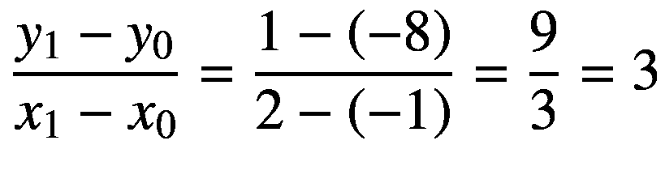

并且，由于已知点 (*x*₁, *y*₁) = (2,1) 在直线上，因此割线由下式给出：*h* (*x*) = *y*₁ + 3 (*x* – *x*₁) = 1 + 3 (*x* – 2)

现在，可以使用此方程以及 *h*(*x*) = 0 在交点处的事实来计算与 x 轴的交点（见图 9-2）：

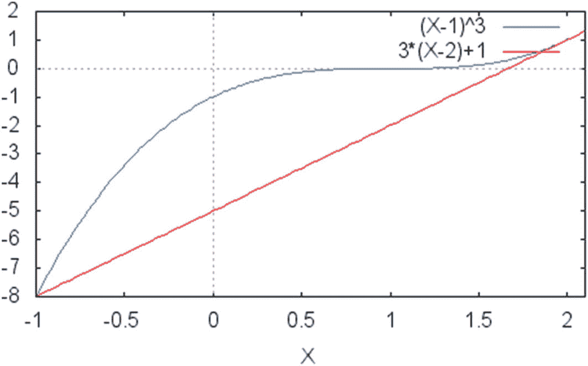

**图 9-2** 原始函数 (x–1)³ 及其在区间 -1 到 2 上的割线


`0=1+3*x*–6=–5+3*x*`  
这意味着 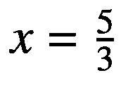 是割线与 x 轴的交点。你很容易看到，如图 9-2 所示，割线与 x 轴的交点是一个点（称之为 *x*[2]），它比先前更靠近方程的根。这一过程可以用由 *x*[0] 和 *x*[2] 定义的新区间重复进行，直到方程的根被逼近到误差（可由算法预定义）很小的范围内。

对刚才展示的 `h(x)=` 方程进行推广，割线的方程可表示为  

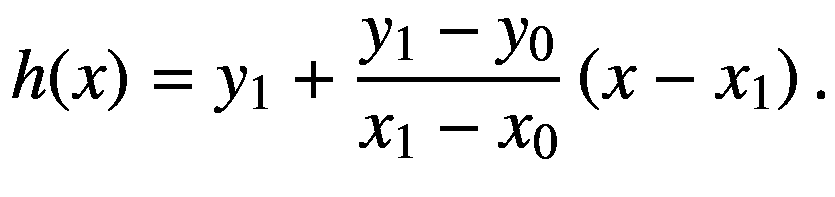

当该方程与直线 `y=0` 相交时，我们有  

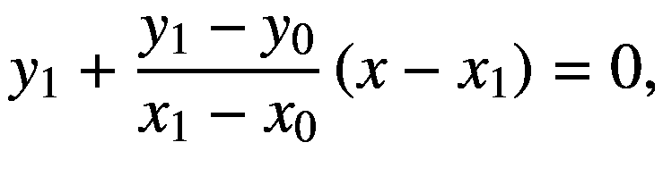  

由此得出结果  

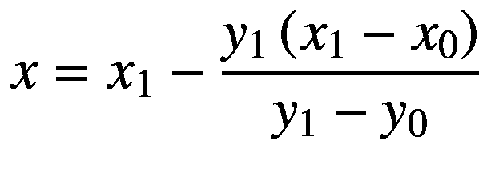

利用这个方程，我们可以计算出将在算法下一步使用的新点 *x*。总结上述步骤，求方程根的割线法可以描述如下：

1. 定义一个初始区间 `(a,b)`，你希望在该区间内搜索方程的一个或多个根。  
2. 计算 *f*(*a*) 和 *f*(*b*) 的值。  
3. 利用方程确定割线  

   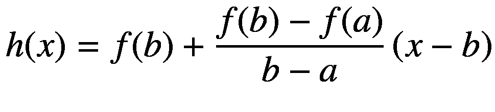  

4. 利用该方程，找到交点  

   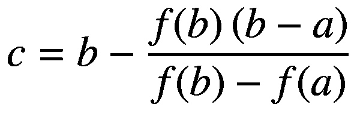  

5. 如果差值 |*c* – *b*| 的长度小于误差（阈值）*E*，则停止并将 *c* 报告为解。否则，继续执行步骤 1。

注意到，对于某些函数，该算法收敛到解的速度比二分法更快。这是因为割线法利用了函数中已有的信息，这使得中间点更接近真实解。你可以在 `SecantSolver` 类中找到一个针对所讨论算法的实现。该类的设计与 `BisectionSolver` 类似，因为所讨论的问题相同。主要变化在于使用了不同的中点选择过程，这使得该算法与 `BisectionSolver` 中给出的算法略有不同。

### 完整代码

```
// SecantMethod.h
//
#ifndef SECANTMETHOD_H_
#define SECANTMETHOD_H_
template 
class MathFunction;
class SecantMethod {
public:
SecantMethod(MathFunction &f);
SecantMethod(const SecantMethod &p);
SecantMethod &operator=(const SecantMethod &p);
~SecantMethod();
double getRoot(double x1, double x2);
private:
MathFunction &m_f;
double m_error;
};
#endif /* SECANTMETHOD_H_ */
// SecantMethod.cpp
//
#include "SecantMethod.h"
#include "MathFunction.h"
#include 
using std::cout;
using std::endl;
namespace {
const double DEFAULT_ERROR = 0.001;
}
SecantMethod::SecantMethod(MathFunction &f)
: m_f(f),
m_error(DEFAULT_ERROR)
{
}
SecantMethod::SecantMethod(const SecantMethod &p)
: m_f(p.m_f),
m_error(p.m_error)
{
}
SecantMethod::~SecantMethod()
{
}
SecantMethod &SecantMethod::operator=(const SecantMethod &p)
{
if (this != &p)
{
m_f = p.m_f;
m_error = p.m_error;
}
return *this;
}
double SecantMethod::getRoot(double x1, double x2)
{
double root = 0;
double fa = m_f(a);
double fb = m_f(b);
double c = 0, fc = 0;
do
{
c = b - fb*(b-a)/(fb-fa);
root = c;
fc = m_f(c);
cout  "  m_error);
return root;
}
// ---- 这是针对一个示例函数的实现
namespace {
class F2 : public MathFunction {
public:
virtual ~F2();
virtual double operator()(double value);
};
F2::~F2()
{
}
double F2::operator ()(double x)
{
return (x-1)*(x-1)*(x-1);
}
}
int main()
{
F2 f;
SecantMethod sm(f);
double root = sm.getRoot(-10, 10);
cout << " the root of the function is " << root << endl;
return 0;
}
```

### 运行代码

编译上述代码后，你可以运行它并得到以下结果，这些结果展示了示例方程 *f*(*x*) = (*x*–1)³ 的解：

```
./secantMethod
-> 2.92233 7.10369
-> 2.85268 6.35922
-> 2.25777 1.98976
-> 1.98685 0.96108
-> 1.73375 0.395035
-> 1.5571 0.172905
-> 1.41961 0.0738799
-> 1.31702 0.0318621
-> 1.23923 0.0136922
-> 1.18062 0.00589209
-> 1.13634 0.00253417
-> 1.10292 0.00109016
-> 1.07769 0.000468932
-> 1.05865 0.000201717
-> 1.04427 8.67704e-05
-> 1.03342 3.73252e-05
-> 1.02523 1.60558e-05
-> 1.01904 6.90655e-06
-> 1.01438 2.97092e-06
-> 1.01085 1.27797e-06
-> 1.00819 5.49731e-07
-> 1.00618 2.36472e-07
-> 1.00467 1.01721e-07
-> 1.00352 4.37562e-08
-> 1.00266 1.88221e-08
the root of the function is 1.00266
```

## 牛顿法

创建一个 C++ 类来实现计算方程根的牛顿法。

### 解决方案

正如你在前面几节中看到的，仅使用二分法就可以为大量方程找到解。你还可以尝试利用函数的额外信息来提高收敛速度，比如在所需区间内使用函数的割线。进一步延伸这个想法，你就会得到最常用的方程求解方法之一，该方法归功于艾萨克·牛顿。  

牛顿法求方程根利用函数的导数作为根位置的一阶近似。与你之前看到的两种方法类似，该过程是迭代的，并且在每一步中，你都可以更接近方程的真实根。最终，你将得到一个误差非常小的解，该误差可以在算法开始之前确定。  

为了理解该方法的工作原理，再次考虑示例函数 *f*(*x*) = (*x*–1)³。该函数的导数很容易计算，因为它是一个多项式，导数为 *f’*(*x*) = 3(*x*–1)²。现在，假设你从一个关于根值可能是什么的初始猜测开始（如果没有猜测，则将随机值作为起点）。将该初始猜测称为 *x*[0]。在该点，我们可以计算两个值：*f*(*x*[0]) 和 *f'*(*x*[0])。


好的，作为高级文档工程师和翻译员，我将遵循您的指示，对给定的英文文本进行翻译。


在 Figure 9-3 中，你会看到之前给出的示例函数及其在点`x[0] = 0`处的切线图。在该点处，`f(x[0]) = f(0) = -1`，且`f'(x[0]) = f'(0) = 3`。由于函数在某一点的导数代表了曲线在该点切线的斜率，我们可以根据以下公式计算出一个由给定方程的切线所确定的点`x[1]`：

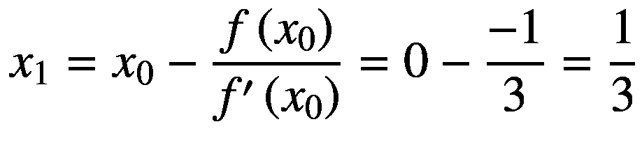

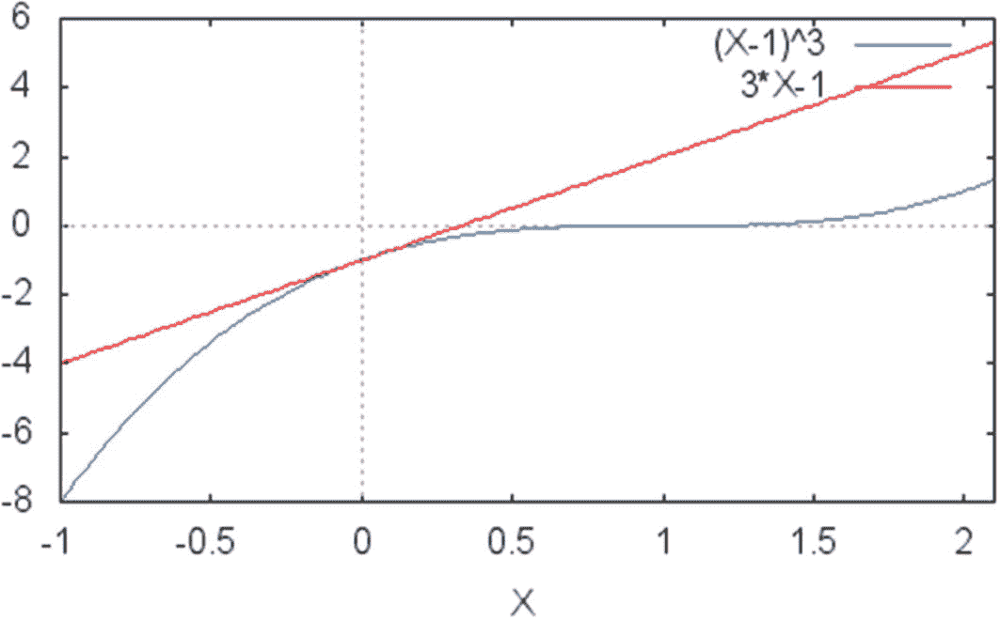

**Figure 9-3** 示例函数`f(x) = (x–1)³`及其在点`x[0] = 0`处的切线。你可以注意到，该切线与 x 轴相交于点`x1 = 1/3`。这是使用牛顿法求给定函数根的第一步

一旦找到 x 轴与切线的交点，你就有了求解给定方程根的新起点。请注意，每次找到新点时，算法都会越来越接近目标点，尽管可能需要几次迭代才能达到所需精度。与前两种情况一样，你可以将精度作为算法的参数来确定，一旦两次连续近似值之间的差值小于给定参数，就停止计算。这表明解正在收敛到根所在的位置。
总之，牛顿法通过依次寻找由函数切线确定的点来工作。当你越接近根时，切线与 x 轴交点的差异就会越小。停止条件是最后值与当前值之间的差值小于给定参数。

基于以上信息，牛顿法的算法可以给出如下：

1. 定义一个初始值`x`，你希望从该值开始搜索方程的一个或多个根。
2. 给定输入函数`f(x)`，确定其导数`f'(x)`。
3. 计算目标值处的`f(x)`和`f'(x)`。
4. 使用`f'(x)`作为点`x`处切线的斜率，根据以下方程计算新点`x[1]`：
   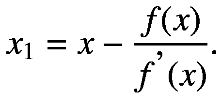
5. 计算`x`与`x[1]`之间的差值为`e = |x – x[1]|`。
6. 如果`e`的值小于输入误差（阈值）`E`，则停止并报告`x`为解。否则，将`x[1]`重命名为`x`，并继续执行步骤 1。

牛顿法不仅依赖于函数本身，还依赖于其导数，这既可以视为优点也可以视为缺点。有时，计算函数的导数非常容易，例如多项式函数和常见的三角函数，但情况并非总是如此。然而，牛顿法最大的优点是，与二分法和割线法不同，即使函数符号没有变化，它也能正常工作。

例如，考虑函数`f(x) = (x–1)²`。其图形如 Figure 9-4 所示。请注意，与本章中看到的其他函数不同，该函数没有改变符号的地方。因此，如果不改变二分法，在这种情况下就无法找到根。另一方面，该函数显然具有导数，且处处可微，这使得使用牛顿法找到根成为可能。

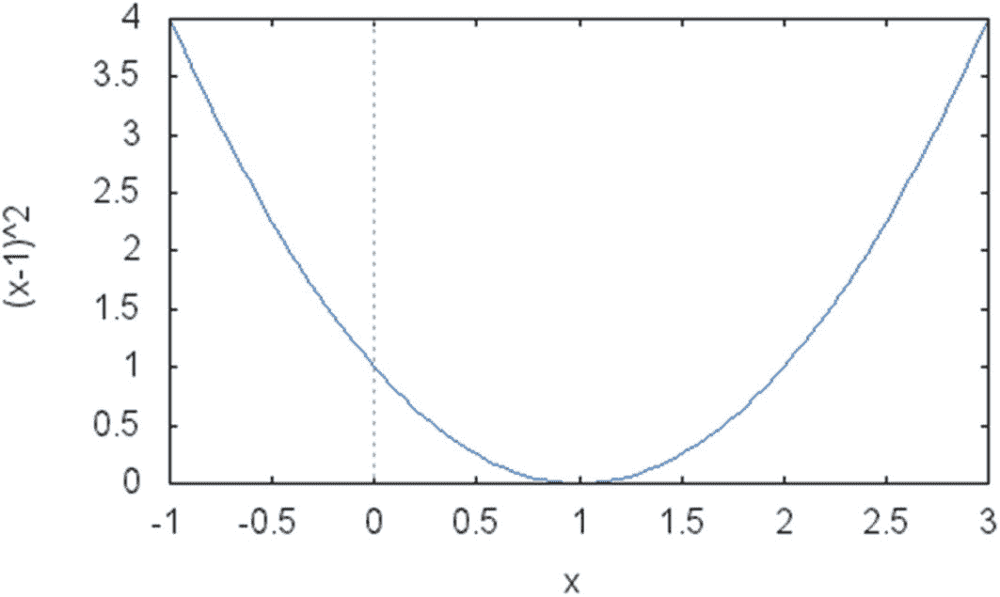

**Figure 9-4** 一个连续的二次函数`(x–1)²`，它从未改变符号，但在`x = 1`处有一个单根

在使用牛顿法时，我们需要考虑一个小问题：导数在某点可能为零。如果出现这种情况，下一个点就是未定义的，因为不允许除以零。然而，可以通过在算法中给当前点添加一个小值来避免这个困难。当然，存在更复杂的技术来解决这个问题，读者可以在众多关于数值算法的书籍中找到这些方法。
前面的算法是在 C++类`NewtonMethod`中实现的，它为所有描述的步骤提供了必要的支持。该类的设计与你在二分法中看到的非常相似。然而，与二分法和割线法不同，`NewtonMethod`不仅依赖于函数，还依赖于其导数。这就是为什么在示例代码中，你会看到对两个函数`F3`和`DF3`的引用。它们是必要的，以便`NewtonMethod`类知道如何计算函数及其导数的值。

完整代码

```cpp
//
// NewtonMethod.h
#ifndef NEWTONMETHOD_H_
#define NEWTONMETHOD_H_
template 
class MathFunction;
class NewtonMethod {
public:
NewtonMethod(MathFunction &f, MathFunction &derivative);
NewtonMethod(const NewtonMethod &p);
virtual ~NewtonMethod();
NewtonMethod &operator=(const NewtonMethod &p);
double getRoot(double initialValue);
private:
MathFunction &m_f;
MathFunction &m_derivative;
double m_error;
};
#endif /* NEWTONMETHOD_H_ */
//
// NewtonMethod.cpp
#include "NewtonMethod.h"
#include "MathFunction.h"
#include 
using std::endl;
using std::cout;
namespace {
const double DEFAULT_ERROR = 0.001;
}
NewtonMethod::NewtonMethod(MathFunction &f, MathFunction &derivative)
: m_f(f),
m_derivative(derivative),
m_error(DEFAULT_ERROR)
{
}
NewtonMethod::NewtonMethod(const NewtonMethod &p)
: m_f(p.m_f),
m_derivative(p.m_derivative),
m_error(p.m_error)
{
}
NewtonMethod::~NewtonMethod()
{
}
NewtonMethod &NewtonMethod::operator=(const NewtonMethod &p)
{
if (this != &p)
{
m_f = p.m_f;
m_derivative = p.m_derivative;
m_error = p.m_error;
}
return *this;
}
double NewtonMethod::getRoot(double x0)
{
double x1 = x0;
do
{
x0 = x1;
cout  m_error);
return x1;
}
// ---- this is the implementation for an example function and its derivative
namespace {
class F3 : public MathFunction {
public:
virtual ~F3();
virtual double operator()(double value);
};
F3::~F3()
{
}
double F3::operator ()(double x)
{
return (x-1)*(x-1)*(x-1);
}
class DF3 : public MathFunction {
public:
virtual ~DF3();
virtual double operator()(double value);
};
// represents the derivative of F3
DF3::~DF3()
{
}
double DF3::operator ()(double x)
{
return 3*(x-1)*(x-1);
}
}
int main()
{
F3 f;
DF3 df;
NewtonMethod nm(f, df);
cout << " the root of the function is " << nm.getRoot(100) << endl;
return 0;
}
```

运行代码

可以使用诸如 UNIX 上的`gcc`之类的编译器来编译和链接代码。要运行生成的可执行程序并查看其结果，请使用以下命令行：

```
./newtonMethod
x0 is 100
x0 is 67
x0 is 45
x0 is 30.3333
x0 is 20.5556
x0 is 14.037
x0 is 9.69136
x0 is 6.79424
x0 is 4.86283
x0 is 3.57522
x0 is 2.71681
x0 is 2.14454
x0 is 1.76303
x0 is 1.50868
x0 is 1.33912
x0 is 1.22608
x0 is 1.15072
x0 is 1.10048
x0 is 1.06699
x0 is 1.04466
x0 is 1.02977
x0 is 1.01985
x0 is 1.01323
x0 is 1.00882
x0 is 1.00588
x0 is 1.00392
x0 is 1.00261
the root of the function is 1.00174
```

该算法对函数`f(x) = (x–1)³`执行了牛顿法的步骤。请注意，即使从遥远的初始值 100 开始，算法在要求的误差范围内也收敛到了解 1.0。


### 结论

在本章中，你看到了几个处理方程求根的示例。这是一个在金融工程中经常用到的主题。交易算法和投资分析算法经常需要求解方程，这使得寻找高效的方程求根技术成为必要。

在本章中，我介绍了一些用于求解金融中常见方程的最常用技术。然而，还存在更专门的算法，你可以以数值方法文献为起点，去探索最新的方法。

本章中的编程示例首先展示了如何使用二分法计算方程的根解。使用二分算法，定义域的目标范围被均匀分割，每一步都会以更高的精度逼近根的可能位置。根据范围两端点处函数的符号，可以检测该范围内是否包含方程的根。在该过程结束时，可以以很小的误差范围确定方程变为零的位置。

接下来，你看到了一个使用割线法求解方程的编程示例。该方法基于在所考虑的区间内使用函数的割线。当割线与 x 轴相交时，新点通常更接近方程的根。通过多次迭代这个过程，可以在比二分法更短的时间内找到所需的解。

你还学习了最流行的方程求根方法，即牛顿法。使用该算法，可以通过函数在某一点的切线来找到解。由于函数的导数给出了函数在每个点的斜率，因此可以使用导数来找到合理的近似值。随着算法在连续点上的迭代，近似值会变得越来越好。与其他方法一样，当达到预设的最大误差时，算法通常会停止。

在下一章中，我将讨论另一个在金融算法中被广泛使用的重要计算工具：数值积分。利用数值积分算法，可以以高精度解决多个困难问题。你还将看到如何使用`C++`实现这些技术。

