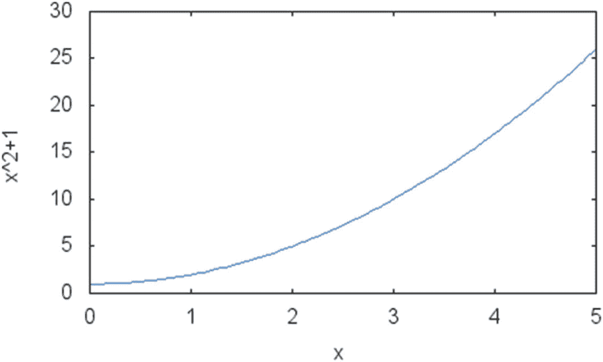
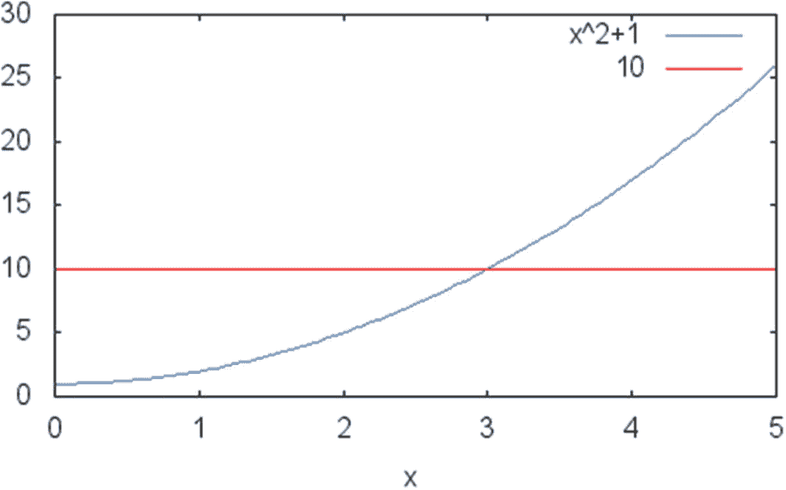
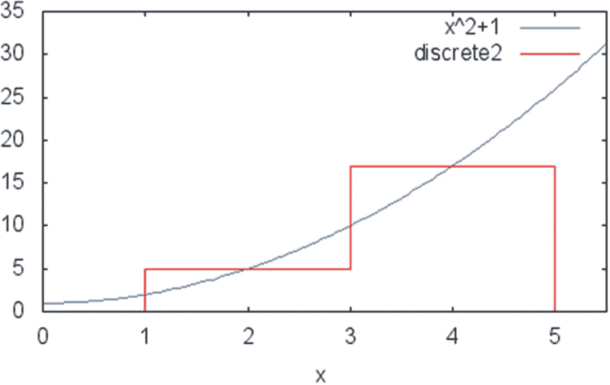
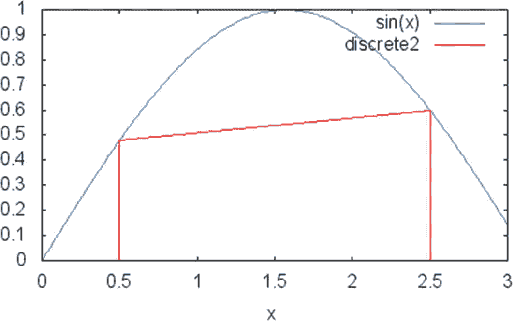
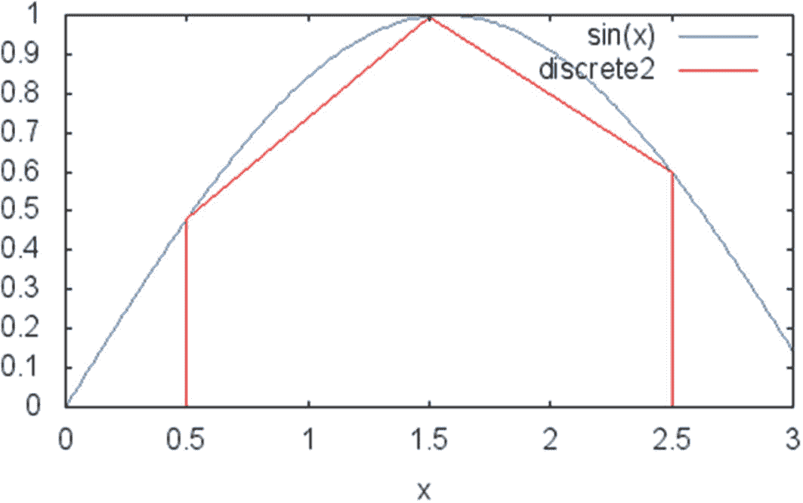
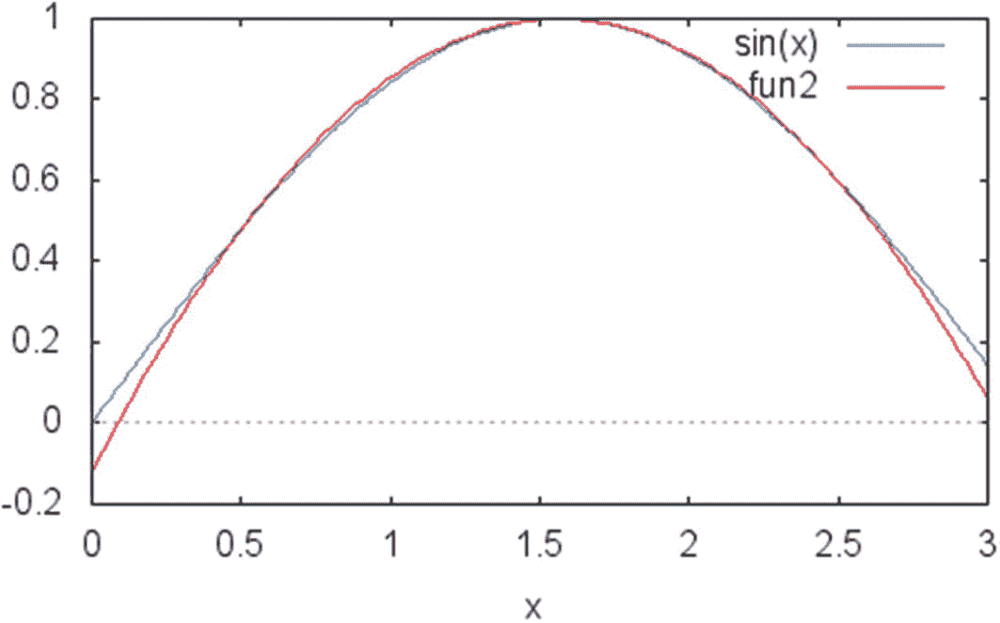

# 10. 数值积分

对函数进行积分是许多金融算法中的一个常见步骤。例如，一些涉及微分方程使用的金融技术依赖于复杂积分的计算。这些领域包括衍生品定价、保险和相关算法。

然而，在使用这些方法时，你可能会遇到没有已知解析解而需要进行数值积分的积分。即使一个方程可以解析积分，使用数值算法执行此任务也可能更高效。为此，本章探讨了一些执行数值积分的常用方法。读完本章及后续章节后，你将更好地理解这些数值积分算法在实践中是如何工作的，以及如何在自己的项目中使用它们。

我们将讨论可以立即应用于一些常见积分方法的编程示例。我们还讨论了这些数值方法在使用`C++`语言实现时的性能以及精度。本章中的编程示例涵盖以下主题：

- **中点法**：一种简单的积分方法，基于每个积分区间的中点使用易于计算的近似值。
- **梯形法**：一种更精确的数值积分方法，使用梯形近似来逼近积分面积。
- **辛普森法**：一种流行的数值积分技术，辛普森法提供比前两种方法稍好的近似值。
- **这些解法的图形示例**：我们通过图形解释这些方法的工作原理，以及实现它们所需的代码。

## 中点法

在本节中，我们将创建一个`C++`类，使用中点法对函数进行积分。

### 解法

简而言之，对函数进行积分意味着，在单维情况下，找到由函数和 x 轴所围成曲线的面积。虽然概念很简单，但有大量文献涉及这个问题的实际重要性。最重要的结果，也称为微积分基本定理，即积分是导数的逆函数。换句话说，对函数的积分求导将得到原函数。你也可以对函数的导数进行积分以得到原函数（相差一个常数）。

通过代数方法找到函数的积分高度依赖于前述定义。这意味着你需要知道另一个函数，其导数正是你想要积分的函数。在这种情况下，根据微积分基本定理，该另一个函数就是积分。问题在于，并非总能使用这些方法找到反导数。这导致了需要使用计算方法来确定积分。

有多种方法可用于对函数进行积分，但它们都包含将目标函数的面积划分为许多子区域并对它们进行累加的策略。数值积分的好处在于，如前所述，大多数划分面积的方案都是收敛的。这意味着对于大多数函数，都可以使用我们讨论的任何一种方法得到解。这些方法的不同之处在于计算量，以及可能对于特定函数或应用有更好的收敛性。

我们从一种通常称为中点法的算法开始讨论。这种方法之所以得名，是因为它使用中点近似来逼近目标面积。考虑函数`f(x) = x² + 1`，并尝试计算该函数在 1 到 5 区间内的积分。你可以在图 [10-1] 中看到该函数的图像。



**图 10-1** 函数`f(x)=x²+1`在 1 到 5 区间内的图像

当然，使用符号技术解决这个问题很容易，因为有一种众所周知的方法来确定多项式函数的积分。但是，请考虑如何仅使用计算策略来解决这个问题。

该算法的目标是开发一种近似方法，以便你能在预设的误差阈值内确定所考虑的积分。第一步是设计一个函数，能够在给定区间内近似给定的函数。事实证明，我们可以尝试的最简单的函数是常数函数`f(x) = c`。假设我们使用常数函数来近似 1 到 5 区间内的积分。我们可以取该区间内`f(x)`的平均值作为常数的值，该平均值由端点确定。

该常数值为`f((1+5)/2) = f(3) = 10`。请在图[10-2]中检查这个常数函数与原始函数的对比情况。



### 图 10-2

原始函数 `f(x) = x² + 1` 与常数函数 `f(x) = c` 的对比

近似值可以通过公式 `(5 – 1) * 10 = 40` 计算得出。你可以将其与积分闭合计算所定义的值进行比较：`f(x) = x² + 1` 的反导数是 `F(x) = x³/3 + x`，在区间 1 到 5 上使用该方程作为定积分，你会得到值 45.33。由此可见，正确值与使用单个中点计算得到的估值之间存在较大误差。

好消息是，我们可以通过在所需函数上考虑更小的区间，并将这些区间的结果相加来改进这个近似。这是你在本节及后续章节中将看到的基本技术。因此，为了改进前一个例子中的近似，我们只需将区间 1–5 分成两个区间：1 到 3 和 3 到 5。

考虑常数函数的平均值，你会发现区间前半部分的值是 `((1 + 3)/2)² + 1 = 5`，后半部分是 `((3 + 5)/2)² + 1 = 17`。这给出了一个近似值 `2 × 5 + 2 × 17 = 44`。由于精确值是 45.33，你可以看出近似值 44 更接近真实值。你可以在图 10-3 中看到这个新的近似。



### 图 10-3

使用两个常数值近似 `f(x) = x² + 1` 的积分

正如你所见，从中点法取得良好结果的秘诀是将所需区间细分为更小的单元并将它们相加，这与积分函数本身的定义方式非常相似。虽然你可以从一个常数开始，然后连续分割区间，但更简单的方法是先从一个已知的大分段数开始，必要时再增加分段的数目。使用这种策略会得到以下算法：

定义一个范围 `(A, B)`，你需要在这个范围内计算方程的积分。

1.  将初始范围细分为 `N` 个等宽的子区间。
2.  将积分值 `S` 初始化为零。
3.  对于每个子区间 `(a, b)`，执行以下操作：
    1.  获取 `a` 和 `b` 的值。
    2.  确定中点值：`m(a, b) = f((a + b) / 2)`。
    3.  将 `m(a, b)` 加到积分值中。

这个简单方法的实现可以在 `MidpointIntegration` 类中找到。

### 完整代码

你可以在代码清单 10-1 中找到实现上述方法的完整代码。该清单包含了 `MidpointIntegration` 类的头文件及实现文件。

# 中点积分法

## 运行代码

你可以使用任何符合标准的编译器（如 `gcc`）从代码清单 10-1 中的源代码生成可执行的二进制文件。然后，你可以执行代码来获得如下示例结果，针对示例方程 `f(x) = x² + 1`：

```
./midpointIntegration
the integral of the function is 45.3344
the integral of the function with 200 intervals is 45.3336
```

注意，该解决方案测试了两种分区数情况下的近似：当分区数为 100（默认值）和分区数为 200 时。由于函数的精确值是 `45 + 1/3`，这表明结果有所改进，误差从小数点后第三位降到了小数点后第四位。你可以通过增加分区数来改进不同函数或所需误差下的近似值。

# 梯形法

## 解决方案

正如你在上一节中所看到的，为一个函数的积分提出近似值并不困难。然而，在许多应用中，能够更快、更有效地确定函数的定积分是很有用的。当需要积分的函数本身计算起来就很困难时，这一点尤其重要。在这些情况下，最好使用一种能够为积分问题提供更精确解的近似技术。

在这个编码示例中，我将探讨另一种计算连续函数积分的方法，称为梯形法。顾名思义，梯形法利用一种几何上的直观概念来呈现特定函数曲线下的面积值，从而使得到的近似值更接近目标值。

为了使用梯形法，我们通过几何直觉来审视积分问题，即寻找逼近目标曲线的最佳方式。考虑函数 `f(x) = sin(x)` 在区间 `[1/2, 5/2]` 上的积分。所需积分被定义为曲线下的面积。逼近该值的一个简单方法是使用线性函数的面积，该线性函数在给定区间的端点之间逼近 `sin(x)`。通过图形方法，可以在图 10-4 中看到结果。



**图 10-4** 使用一次梯形法迭代逼近 `f(x)=sin(x)` 在区间 `[1/2, 5/2]` 上的积分

梯形法应用于该区间得到的逼近效果相对较差。使用符号技术计算的该积分真实值为 `cos(1/2) - cos(5/2)`，约为 1.6787。而梯形法得到的值为 `2 * sin(1/2) + sin(5/2) - sin(1/2) = sin(1/2) + sin(5/2) ≈ 1.0778`。尽管这是一个较差的逼近，但如果你将目标函数的区间分成两个或多个子区域，结果会更好。这样做，误差会变小，得到的值会更接近积分的真实值。例如，我将展示如何使用 `[1/2, 3/2]` 和 `[3/2, 5/2]` 这两个子区间来改进对前述函数的逼近。

`f(1/2) = sin(1/2) ≈ 0.4794` 和 `f(3/2) = sin(3/2) ≈ 0.9974` 的值产生了一个面积为 0.7384 的梯形。另一方面，第二个区间的值由 `f(3/2) = sin(3/2)` 和 `f(5/2) = sin(5/2) ≈ 0.5984` 决定。由此产生的梯形面积为 1.5364，更接近精确值 1.6787。您可以在图 10-5 中直观地看到这种逼近效果。



**图 10-5** 使用梯形法，用两个区间（`[1/2, 3/2]` 和 `[3/2, 5/2]`）逼近 `f(x)=sin(x)` 曲线下的面积

正如前两个例子所示，可以证明，随着子区间数量的增加，逼近的质量会越来越好。因此，通过增加梯形法中的子区间数量，您可以任意接近定积分的真实值。

我提供了一个名为 `TrapezoidIntegration` 的类，它展示了如何为作为参数传递的任何函数实现梯形法。通过使用 `MathFunction` 类，该实现是通用的。传递一个所需 `MathFunction` 类的新对象，您就可以使用 `getIntegral` 成员函数计算不同函数的定积分。使用 `TrapezoidIntegration` 类，您还可以通过成员函数 `setNumIntervals` 确定使用的中间区间数量。如果需要，这可以允许您减少定积分估计中的误差。使用 `setNumIntervals` 的另一件事是，通过减少算法的迭代次数，可以减少必要的计算量。这样，您就可以完全控制逼近程度和计算效率之间的权衡。

## 完整代码

代码清单 10-2 是上一节讨论的梯形积分法的完整实现。您将看到此代码分为一个头文件和一个实现文件。还有一个 `main` 函数，它为 `TrapezoidIntegration` 类提供了一个示例。

```cpp
//
//  TrapezoidIntegration.h
#ifndef __FinancialSamples__TrapezoidIntegration__
#define __FinancialSamples__TrapezoidIntegration__
template 
class MathFunction;
class TrapezoidIntegration {
public:
TrapezoidIntegration(MathFunction &f);
TrapezoidIntegration(const TrapezoidIntegration &p);
~TrapezoidIntegration();
TrapezoidIntegration &operator=(const TrapezoidIntegration &p);
void setNumIntervals(int n);
double getIntegral(double a, double b);
private:
MathFunction &m_f;
int m_numIntervals;
};
#endif /* defined(__FinancialSamples__TrapezoidIntegration__) */
//
//  TrapezoidIntegration.cpp
#include "TrapezoidIntegration.h"
#include "MathFunction.h"
#include 
#include 
using std::cout;
using std::endl;
namespace  {
const int DEFAULT_NUM_INTERVALS = 100;
}
TrapezoidIntegration::TrapezoidIntegration(MathFunction &f)
: m_f(f),
m_numIntervals(DEFAULT_NUM_INTERVALS)
{
}
TrapezoidIntegration::TrapezoidIntegration (const TrapezoidIntegration &p)
: m_f(p.m_f),
m_numIntervals(p.m_numIntervals)
{
}
TrapezoidIntegration::~TrapezoidIntegration()
{
}
TrapezoidIntegration &TrapezoidIntegration::operator=(const TrapezoidIntegration &p)
{
if (this != &p)
{
m_f = p.m_f;
m_numIntervals = p.m_numIntervals;
}
return *this;
}
void TrapezoidIntegration::setNumIntervals(int n)
{
m_numIntervals = n;
}
double TrapezoidIntegration::getIntegral(double a, double b)
{
double S = 0;
double intSize = (b - a)/m_numIntervals;
double x = a;
for (int i=0; i
{
public:
~F2();
double operator()(double x);
};
F2::~F2()
{
}
double F2::operator()(double x)
{
return sin(x);
}
}
int main()
{
F2 f;
TrapezoidIntegration ti(f);
double integral = ti.getIntegral(0.5, 2.5);
cout << " the integral of the function is " << integral << endl;
ti.setNumIntervals(200);
integral = ti.getIntegral(0.5, 2.5);
cout << " the integral of the function with 200 intervals is " << integral << endl;
return 0;
}
```

**代码清单 10-2** 梯形积分法

### 运行代码

您可以使用符合标准的编译器（如 `gcc`、`Visual Studio` 或 `llvm`）编译代码清单 10-2 中的代码。编译代码后，您可以运行生成的应用程序来测试结果。以下是程序执行的一个示例：

```
./trapezoidMethod
the integral of the function is 1.67867
the integral of the function with 200 intervals is 1.67871
```

该程序展示了 `sin(x)` 在区间 1/2 到 5/2 上的积分值。该近似值给出了两种不同子区间数设置下的结果。第一个结果是 100 个子区间的结果。第二个结果展示了子区间数量加倍后达到的近似值。与之前的示例一样，可以通过增加子区间数量来控制近似质量。此外，如果你希望更快获得结果，也可以减少该数量。

## 使用辛普森方法

实现用于定积分计算的辛普森方法。

### 解决方案

你已经看到了两种计算给定连续函数定积分值的常用方法。第三种方法，即辛普森方法，将在本编程示例中介绍。与任何数值积分技术一样，其总体思路是创建一个近似于目标函数的第二个函数，并将其应用于原始定义域的多个子区间，直到获得良好的近似值。

与前两种使用线性逼近给定函数的方法不同，辛普森方法采用二阶多项式来实现更好的收敛性。通过这种方式，辛普森方法提出的近似值不依赖线性函数来获得期望结果，而是更好地适应原始曲线的行为。

辛普森方法的工作原理可以通过一个示例轻松理解。假设你想要对上一节中使用的函数 `f(x) = sin x` 进行积分。作为一个三角函数，它没有简单的有限多项式表示。然而，如果你将搜索范围限制在函数的一小部分，就可以找到非常好的近似表示。

例如，我在图 10-6 中展示了如何使用二阶多项式函数来近似 `sin x` 在区间 1/2 到 5/2 上的值。请注意，这两条曲线仅在给定区间内的较小范围内具有足够的相似性，而在该区间之外，这两个函数的变化差异很大。



**图 10-6** 使用二阶多项式近似区间 1/2 到 5/2 上的 `f(x)=sin x` 值

同样的思想也用于辛普森方法。由于二次逼近可能与目标函数非常接近，因此使用二次函数可以显著提高以此方式计算出的定积分值。事实上，实验表明，辛普森方法比中点法和梯形法等算法具有更好的精度。

**注意**

辛普森方法更高的精度可以减少计算定积分所需的子区间数量。然而，由于需要使用二次逼近而非简单的线性函数，每次迭代的计算量会更大。最终，虽然辛普森方法对大多数函数都能产生更优的结果，但用户需要意识到每次迭代的计算时间可能存在权衡。

辛普森方法中使用的二阶多项式由以下方程定义，可直接用于实现所提规则：

![$$ \frac{b-a}{6}\left[f(a)+4f\left(\frac{a+b}{2}\right)+f(b)\right] $$](images/323908_2_En_10_Chapter/323908_2_En_10_Chapter_TeX_Equa.png)

因此，可以将通用算法总结如下：

1.  定义一个范围 `(A, B)`，用于计算该方程的积分。

2.  将初始范围细分为 `N` 个等长子区间。

3.  将积分值 `S` 初始化为零。

4.  对于每个子区间 `(a, b)`，执行以下操作：

    1.  获取 `a` 和 `b` 的值。

    2.  根据以下方程确定区间 `(a, b)` 上的积分近似值：

        ![$$ m\left(a,b\right)=\frac{b-a}{6}\left[f(a)+4f\left(\frac{a+b}{2}\right)+f(b)\right] $$](images/323908_2_En_10_Chapter/323908_2_En_10_Chapter_TeX_IEq15.png)

    3.  将 `m(a, b)` 累加到积分值中。

该算法已作为 `SimpsonsIntegration` 类的一部分实现。

### 完整代码

你可以在代码清单 10-3 中找到辛普森方法的完整实现。其中提供的实现在后续的 `main` 函数中使用。

```
//
//  SimpsonsIntegration.h
#ifndef __FinancialSamples__SimpsonsIntegration__
#define __FinancialSamples__SimpsonsIntegration__
template 
class MathFunction;
class SimpsonsIntegration {
public:
SimpsonsIntegration(MathFunction &f);
SimpsonsIntegration(const SimpsonsIntegration &p);
~SimpsonsIntegration();
SimpsonsIntegration &operator=(const SimpsonsIntegration &p);
double getIntegral(double a, double b);
void setNumIntervals(int n);
private:
MathFunction &m_f;
int m_numIntervals;
};
#endif /* defined(__FinancialSamples__SimpsonsIntegration__) */
//
//  SimpsonsIntegration.cpp
#include "SimpsonsIntegration.h"
#include "MathFunction.h"
#include 
#include 
using std::cout;
using std::endl;
namespace  {
const int DEFAULT_NUM_INTERVALS = 100;
}
SimpsonsIntegration::SimpsonsIntegration(MathFunction &f)
: m_f(f),
m_numIntervals(DEFAULT_NUM_INTERVALS)
{
}
SimpsonsIntegration::SimpsonsIntegration(const SimpsonsIntegration &p)
: m_f(p.m_f),
m_numIntervals(p.m_numIntervals)
{
}
SimpsonsIntegration::~SimpsonsIntegration()
{
}
SimpsonsIntegration &SimpsonsIntegration::operator=(const SimpsonsIntegration &p)
{
if (this != &p)
{
m_f = p.m_f;
m_numIntervals = p.m_numIntervals;
}
return *this;
}
double SimpsonsIntegration::getIntegral(double a, double b)
{
double S = 0;
double intSize = (b - a)/m_numIntervals;
double x = a;
for (int i=0; i
{
public:
~F2();
double operator()(double x);
};
F2::~F2()
{
}
double F2::operator()(double x)
{
return sin(x);
}
}
int main()
{
F2 f;
SimpsonsIntegration si(f);
double integral = si.getIntegral(0.5, 2.5);
cout << " the integral of the function is " << integral << endl;
si.setNumIntervals(200);
integral = si.getIntegral(0.5, 2.5);
cout << " the integral of the function with 200 intervals is " << integral << endl;
return 0;
}
```

**代码清单 10-3** 辛普森积分方法的代码

### 运行代码

代码清单 10-3 中的代码使用函数 `f(x) = sin x` 进行了测试。使用的编译器是 Mac OS X 和 Windows 上的 `gcc`。该程序在两个平台上进行了测试，生成了相同的结果。

编译 `SimpsonsIntegration` 类后，你可以运行应用程序并观察到类似如下的输出：

```
./simpsonsIntegration
the integral of the function is 1.67873
the integral of the function with 200 intervals is 1.67873
```

从这些结果中可以看出，100 个区间解的精度与 200 个区间的精度相似。这表明，对于该技术，100 个分区已足以获得非常好的结果。

### 结论

积分是计算数学中的基本任务之一，因为积分（也称为反导数）作为微积分的基础领域具有重要意义。在金融算法的开发中，也有许多场景需要快速求解涉及定积分计算的问题。

在本章中，你学习了一些探索数值积分最常用技术的 C++ 编程示例。你了解了梯形法、辛普森法则等积分方法如何应用于求取某些预设函数曲线下面积的任务。

梯形法是用于计算定积分的第二种重要算法。对于某个一般函数，该方法使用区间端点处的函数值来定义基于梯形的几何近似。你通过一些示例了解了这一策略的工作原理，以及实现该法则的可运行代码。

我还讨论了著名的定积分辛普森法则。该方法使用二次方程对曲线进行近似。你看到了如何利用多项式方程实现所需精度的示例。使用辛普森法则，即使可能需要更少的子区间就能达到该精度，你也能获得近似度很高的积分结果。

偏微分方程是金融软件开发者另一个重要的数学工具。理解其工作原理，并拥有基于偏微分方程求解的工具至关重要。在下一章中，我将讨论一些与偏微分方程相关的重要技术及其在 C++ 中的实现。