# 11. 求解常微分方程和偏微分方程

常微分方程和偏微分方程的求解是许多金融市场分析技术的核心。重要的衍生品估值分析工具，例如用于股票期权及其他衍生品的布莱克-舒尔斯模型，可以直接表示为微分方程。这些方程需要定期求解，以确定在全球市场上交易的金融工具的价格。这就催生了对能够高效求解这些数学模型的高性能代码的需求。

由于常微分方程和偏微分方程在科学、工程和金融领域的大量应用，人们已经发展出多种求解方法。除了能够分析和求解微分方程的精确数学方法外，软件工程师还必须处理纯计算的方法，以及它们在 C++ 中的实现。

金融领域感兴趣的微分方程示例包括：

*   蒂勒微分方程：用于确定人寿保险合同的公平价格
*   布莱克-舒尔斯微分方程：用于对期权及相关衍生品进行定价
*   市场准备金微分方程
*   投资组合优化的动态变体
*   默顿效用优化方程
*   以及这些微分方程的多种变体

由于微分方程在金融问题中的应用领域如此广泛，在本章中我只能简要介绍最常用于求解这些方程的方法。

本章讨论的编程示例涵盖了常微分方程和偏微分方程建模与应用的几个特定方面。你将探索的主题包括：

*   欧拉法求解常微分方程：一种易于实现的算法，可直接应用于任何一阶常微分方程。
*   龙格-库塔法：作为欧拉算法总体思路的改进，龙格-库塔法为常微分方程的求解提供了更好的稳定性和精度。
*   布莱克-舒尔斯方程：对布莱克-舒尔斯偏微分方程的一般性讨论，以及求解该模型的前向方法概述。

## 求解常微分方程

在本节中，我们将创建一个使用欧拉法求解常微分方程的类。

### 解决方案

我通过介绍一些求解常微分方程的数值方法来开始对微分方程的讨论。然而，在开始第一个示例之前，让我们回顾一下关于常微分方程的一些相关事实。

常微分方程是指在其一个或多个项中包含单个变量的变化率（导数）的方程。给定一个微分方程，其*阶数*定义为该方程中任何导数的最高阶数。以下是常微分方程的几个示例：

`x³ * d²y/dx² + x * dy/dx + y = x⁵`

`x * dy/dx + 4x² = y`

这两个方程都涉及变量 *y* 关于 *x* 的导数。在第一个方程中，导数应用了两次，得到项 `d²y/dx²`，这意味着它是一个二阶常微分方程。第二个方程仅包含关于 *x* 的一阶导数，使其成为一个一阶常微分方程。

标准方程（不涉及导数的方程）通常有可以表示为单个数值的解。然而，常微分方程包含导数，因此它们的解更适合描述为一个或多个函数，这些函数共同满足由导数所隐含的条件。例如，下面这个著名的微分方程描述了牛顿的万有引力定律：

`m * d²x/dt² = -mg`

此类方程的解是一个通用函数，用于描述物体的速度和加速度。要找到特定问题的数值解，你需要提供一个或多个初始条件，将这些条件代入通解后，就能得出给定方程中`x`的显式值。

从前面的例子可以看出，数值求解常微分方程 (ODE) 需要处理可代入通解的初始条件。因此，求解 ODE（以及偏微分方程 PDE）的数值方法要求预先确定初始条件，这是找到其数值解的前提。

求解微分方程主要有两种方法。第一种是基于**符号方法**的解法。这类方法使用代数技巧，包括已知的微分和积分规则，来简化并推导出微分方程的闭式解。符号方法可以手动进行，也可以通过计算机完成，并且存在一类专门为此类符号运算而创建的软件。主要例子包括`Mathematica`、`Maple`和`Maxima`等。

虽然符号方法在求解某些类型的 ODE 和 PDE 时非常有用，但许多微分方程过于复杂，无法通过符号运算得到闭式解。此外，此类符号技术非常专业，通常仅在建模和探索阶段使用，即工程师或数学家正在基于微分方程创建模型时。出于这些原因，符号技术大多局限于专业软件包，而不是作为通用编程语言的库来使用。

求解微分方程的第二类技术基于**数值算法**。这些算法更具通用性，只要能满足一些基本要求，就可以应用于任何微分方程。此外，许多常见的微分方程没有已知的闭式解，在这种情况下，数值方法是唯一可用的方法。由于 ODE 和 PDE 的数值方法可以使用标准编程技术实现，它们通常作为数学库的一部分，用于`FORTRAN`和`C++`等编程语言。

## 欧拉方法

你将学习的第一个 ODE 数值算法是一种简单的技术，称为欧拉方法。它基于在预定步长处对目标 ODE 进行连续求值。从给定的初始条件开始，欧拉方法尝试通过应用在预定区间上的近似公式，来找到微分方程的下一个值。

欧拉方法的思想是在从给定初始条件开始评估 ODE 时，纠正可能出现的错误。例如，假设你想在目标点`c`处评估一个 ODE，从初始条件`x[0]`开始。为简化论证，假设`x[0] ≤ c`，尽管同样的想法在相反方向上也成立。为了求解 ODE，该算法的思想是分`N`步进行评估，其中`N`是一个给定的参数。因此，步长由下式给出：

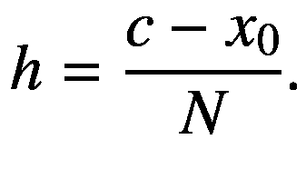

假设微分方程可以表示为以下一般形式的**一阶 ODE**：`y’ = f(x, y)`。同时，初始条件`(x[0], y[0])`是已知的。

一般而言，在每一步（由值`h`给出），欧拉算法将尝试确定该小步长处 ODE 解的精确值。然而，最大的问题在于微分方程的解并不是以显式方式已知的，因此算法必须猜测每一步的特定值。由于步长是一个小区间，一种可能的猜测函数值的方法是使用一条直线来近似它。如果我们将`y[t]`称为在步骤`t`上的函数值，那么这导致了对`y[t]`的如下近似：

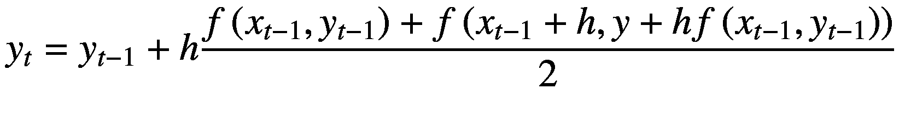

换句话说，算法取前一点和后一点之间线性近似的平均值，作为`y[t–1]`和`y[t]`之间小增量的下一个近似值。欧拉算法是所谓的**预测-校正算法**的一个简单示例。此类方法首先预测函数在下一次迭代中可能的位置（本例中使用线性近似），然后通过取平均值来校正此预测。相同的策略在许多其他算法中重复使用，尽管通常采用更复杂的近似方案。

使用欧拉方法时最大的问题之一是控制结果中的误差。如你所见，欧拉方法的步长是其实现中的输入参数之一，它指示了我们想要更新微分方程结果的频率。在此评估过程中，我们采取的步骤粒度越细，得到的结果就越接近真实函数。另一方面，当我们增加 ODE 评估的步数时，会出现两个问题。首先，由于所需的额外计算，运行时间会增加。其次，也是更令人担忧的一点是，增加步数可能会增加在计算机上进行计算时不可避免的数值误差。解决这些精度问题导致了其他方法的发展，你将在下一节中看到。

### 完整代码

上一节中描述的欧拉方法实现在`EulersMethod`类中，如清单 11-1 所示。此类中的重要方法是`solve()`，它接收步数、初始值`x[0]`和`y[0]`以及目标点`c`作为参数。

```
## 欧拉法求解常微分方程

### 代码实现

```cpp
//
//  EulersMethod.h
#ifndef __FinancialSamples__EulersMethod__
#define __FinancialSamples__EulersMethod__
template 
class MathFunction;
class EulersMethod {
public:
EulersMethod(MathFunction &f);
EulersMethod(const EulersMethod &p);
~EulersMethod();
EulersMethod &operator=(const EulersMethod &p);
double solve(int n, double x0, double y0, double c);
private:
MathFunction &m_f;
};
#endif /* defined(__FinancialSamples__EulersMethod__) */
//
//  EulersMethod.cpp
#include "EulersMethod.h"
#include "MathFunction.h"
#include 
using std::cout;
using std::endl;
EulersMethod::EulersMethod(MathFunction &f)
: m_f(f)
{
}
EulersMethod::EulersMethod(const EulersMethod &p)
: m_f(p.m_f)
{
}
EulersMethod::~EulersMethod()
{
}
EulersMethod &EulersMethod::operator=(const EulersMethod &p)
{
if (this != &p)
{
m_f = p.m_f;
}
return *this;
}
double EulersMethod::solve(int n, double x0, double y0, double c)
{
// 问题： y' = f(x,y) ;  y(x0) = y0
auto x = x0;
auto y = y0;
auto h = (c - x0)/n;
cout  {
public:
double operator()(double x) { return x; } // 未使用
double operator()(double x, double y);
};
double EulerMethSampleFunc::operator()(double x, double y)
{
return  3 * x + 2 * y + 1;
}
int main()
{
EulerMethSampleFunc f;
EulersMethod m(f);
double res = m.solve (100, 0, 0.25, 2);
cout << " 结果是 " << res << endl;
return 0;
}
```

清单 11-1：欧拉法求解常微分方程的实现

### 运行代码

你可以使用任何符合标准的编译器（例如 `gcc`），从清单 11-1 中的源代码生成二进制可执行文件。然后，执行代码即可获得示例结果，例如以下针对示例方程 `f(x) = 3*x + 2*y + 1` 的结果：

```
./eulersMethod
h 为 0.02
F: 1.5     G: 1.62    x: 0.02 y: 0.2812
F: 1.6224  G: 1.7473  x: 0.04 y: 0.314897
F: 1.74979 G: 1.87979 x: 0.06 y: 0.351193
F: 1.88239 G: 2.01768 x: 0.08 y: 0.390193
// ...
F: 137.938 G: 143.515 x: 1.94 y: 68.4034
F: 143.627 G: 149.432 x: 1.96 y: 71.334
F: 149.548 G: 155.59  x: 1.98 y: 74.3854
F: 155.711 G: 161.999 x: 2    y: 77.5625
结果是 77.5625
```

请注意，该解法对两种情形进行了近似测试：当区间数为 100（默认值）时以及必要时。

## 龙格-库塔法求解常微分方程

在本节中，我们将实现龙格-库塔法来求解常微分方程。

### 解决方案

在上一节中，你了解了如何使用欧拉法求解常微分方程，该技术通过一系列步骤迭代，同时计算所需微分方程的近似值。然而，欧拉法的一个问题是其收敛速度慢。由于使用了一阶近似，如果要获得任何精度，该方法就需要大量的步骤。另一方面，当步数增加时，也很难避免误差传播，这使得提高该方法的精度变得困难。

为了减少欧拉法固有的一些问题，人们设计了其他策略。这些方法试图克服这些限制的方式是，为算法的每一步使用更好的近似值。这样，就有可能总体上使用更少的步骤来找到所需的解。此外，改进的近似值有助于减少单步中产生的计算误差。

在求解常微分方程的改进算法中，最流行的一种称为龙格-库塔法。与欧拉法相比，龙格-库塔法为算法的每一个新步骤使用了一种不同的近似方案，这保证了更高的精度。因此，使用龙格-库塔法时，你还能获得更快的收敛速度。

与之前一样，假设我们给定一个与 `x` 变量相关的一阶微分方程：`y' = f(x, y)`

初始条件 (`x[0]`, `y[0]`) 已知，目标是计算微分方程在某点 `c` 处的值。如果我们用 `N` 表示步数，则步长可表示为


微积分中著名的泰勒方法可用于根据函数的导数来计算其近似值。使用二阶泰勒近似得到的近似值，将比欧拉算法中使用的线性近似得到更精确的结果。原始龙格-库塔算法中使用的公式如下：

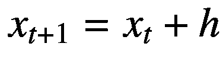

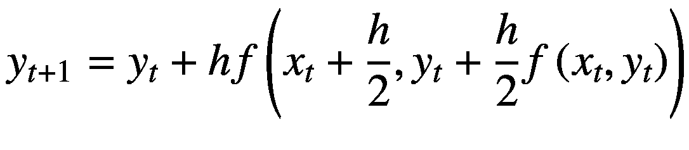

如果你采用由泰勒方法推导出的高阶近似，可以获得更精确的结果。这类近似中最常见的是四阶龙格-库塔法。在这种情况下，`y[t+1]` 的公式由以下给出

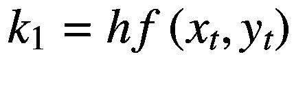


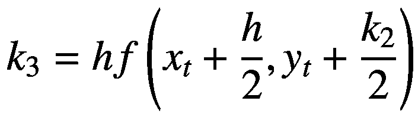

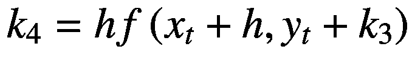

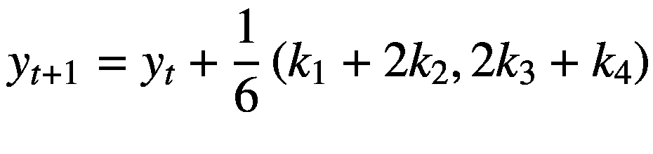

该方法在快速近似方面提供了良好的结果，适用于解决大多数常微分方程问题。其实现相对直接，如下面的代码所示。

更新后的算法可见于 `solve` 函数，该函数可编写如下：

```cpp
double RungeKuttaODEMethod::solve(int n, double x0, double y0, double c)
{
auto x = x0;
auto y = y0;
auto h = (c - x0)/n;
for (int i=0; i<n; ++i)
{
auto k1 = h * m_f(x, y);
auto k2 = h * m_f(x + (h/2), y + (k1/2));
auto k3 = h * m_f(x + (h/2), y + (k2/2));
auto k4 = h * m_f(x + h, y + k3);
x += h;
y += ( k1 + 2*k2 + 2*k3 + k4)/6;
}
return y;
}
```

### 完整代码

清单 11-2 展示了用于求解常微分方程的龙格-库塔法。代码的组织结构与上一节中我用于欧拉法的类似。主要区别在于下一步的定义方式，它使用了基于泰勒方法的方程，如前所述。

```markdown
# 龙格-库塔法求解常微分方程

## 代码实现

```cpp
//
//  RungeKuttaODEMethod.h
#ifndef __FinancialSamples__RungeKuttaODEMethod__
#define __FinancialSamples__RungeKuttaODEMethod__
template 
class MathFunction;
class RungeKuttaODEMethod {
public:
RungeKuttaODEMethod(MathFunction &f);
RungeKuttaODEMethod(const RungeKuttaODEMethod &p);
~RungeKuttaODEMethod();
RungeKuttaODEMethod &operator=(const RungeKuttaODEMethod &p);
double solve(int n, double x0, double y0, double c);
private:
MathFunction &m_f;
};
#endif /* defined(__FinancialSamples__RungeKuttaODEMethod__) */
//
//  RungeKuttaODEMethod.cpp
#include "RungeKuttaODEMethod.h"
#include "MathFunction.h"
#include 
using std::cout;
using std::endl;
RungeKuttaODEMethod::RungeKuttaODEMethod(MathFunction &f)
: m_f(f)
{
}
RungeKuttaODEMethod::RungeKuttaODEMethod(const RungeKuttaODEMethod &p)
: m_f(p.m_f)
{
}
RungeKuttaODEMethod::~RungeKuttaODEMethod()
{
}
RungeKuttaODEMethod &RungeKuttaODEMethod::operator=(const RungeKuttaODEMethod &p)
{
if (this != &p)
{
m_f = p.m_f;
}
return *this;
}
double RungeKuttaODEMethod::solve(int n, double x0, double y0, double c)
{
auto x = x0;
auto y = y0;
auto h = (c - x0)/n;
for (int i=0; i {
public:
double operator()(double x) { return x; } // 未使用
double operator()(double x, double y);
};
double RKMethSampleFunc::operator()(double x, double y)
{
return  3 * x + 2 * y + 1;
}
int main()
{
RKMethSampleFunc f;
RungeKuttaODEMethod m(f);
double res = m.solve (100, 0, 0.25, 2);
cout << " 结果为 " << res << endl;
return 0;
}
```

清单 11-2 龙格-库塔法求解常微分方程的实现

## 运行代码

```bash
./rungeKutta
x: 0.02 y: 0.281216
x: 0.04 y: 0.314931
x: 0.06 y: 0.351245
x: 0.08 y: 0.390266
// ...
x: 1.9  y: 62.9518
x: 1.92 y: 65.6582
x: 1.94 y: 68.4763
x: 1.96 y: 71.4107
x: 1.98 y: 74.466
x: 2    y: 77.6472
结果为 77.6472
```

清单 11-2 中的代码使用 `gcc` 编译并测试。不过，该代码应能使用任何符合标准的编译器工作。测试代码位于 `main` 函数中，该函数使用微分方程 *y*' = 3*x* + 2*y* + 1 来运行算法。结果可以与前面讨论的欧拉法所得结果进行比较。

示例输出显示了算法在 100 次迭代下的收敛情况。您可以在图 11-1 中看到完整的结果。

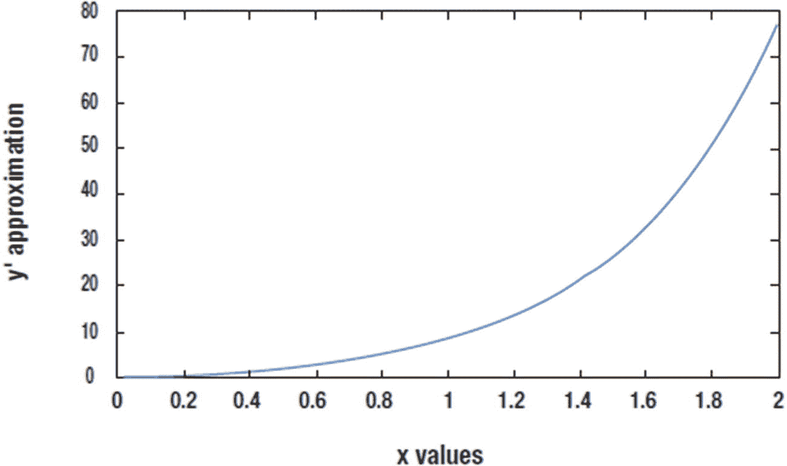

图 11-1 前述示例中龙格-库塔算法的连续步骤，N=100

## 求解布莱克-斯科尔斯方程

创建一个 C++ 类，使用前向方法求解布莱克-斯科尔斯方程。

### 解决方案

布莱克-斯科尔斯方程是定价衍生品最著名的方程之一。它于 20 世纪 70 年代开发，旨在为欧式期权提供更好的模型，但此后，该基本模型已得到扩展并在多种衍生品市场上进行了测试。虽然布莱克-斯科尔斯方程的原始假设在真实市场中并未完全得到尊重，但该模型仍是一个出色的分析工具，用于对呈现股票市场中观察到的波动行为的工具进行定价。

请记住，期权是一份合约，允许持有者在未来特定时间以特定价格购买（或出售）一定数量的股票。例如，一份针对微软（MSFT）的看涨期权，执行价为 30 美元，到期日为明年七月，赋予其所有者权利（而非义务）在七月以 30 美元的价格购买微软股票，无论届时实际价格如何。因此，如果微软股票价格显著高于 30 美元，此操作将产生利润。然而，若价格为 30 美元或更低，该期权将导致亏损。类似地，您也可以对看跌期权进行相同分析，看跌期权是以给定价格在未来出售股票的权利。当标的资产价格上涨时，看涨期权产生更高利润，并伴有固定的最大损失。另一方面，当标的资产价格下跌时，看跌期权产生更高利润，同样伴有固定的最大损失。

布莱克-斯科尔斯模型定义了看涨期权的现值应为多少（类似的分析也适用于看跌期权）。它考虑以下输入值：

*   `S`：标的工具的价格
*   `K`：期权的行权价
*   `T`：期权合约的剩余时间
*   `V`：标的资产的当前波动率
*   `r`：当前的存款利率

利用这些信息，布莱克-斯科尔斯模型得出结论，期权当前价格与输入变量之间的关系由一个偏微分方程给出，如下所示：

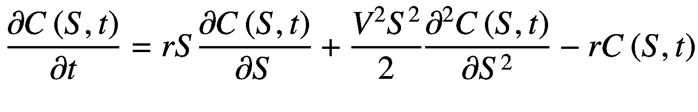

这里，隐函数 `C(S, t)` 代表价格或衍生品，它依赖于标的资产价格 `S` 和时间 `t`。

求解像前文那样的微分方程有多种方法。本节将采用的方法称为前向法。求解偏微分方程的基本思路与求解常微分方程并无太大区别：朝着所需计算的目标点逐步前进，并在这些中间点上利用某种近似方法来估算微分方程的值。然而，与常微分方程只有一个维度不同，偏微分方程涉及两个或更多变量的偏导数。在本例中，我们拥有关于变量 `t` 和 `S` 的偏导数。这种情况下，近似过程变得更加复杂，因为需要确定用于评估偏微分方程的小区间形状。例如，最简单的方案是将二维空间划分为许多小矩形，并针对这些微小元素进行近似。根据偏微分方程的具体类别，我们可以设计出更复杂、更精确的方式来划分定义域，并近似偏方程的真实值。

前向差分法是欧拉方法在偏微分方程中的推广。对于二维情形，它可用于将定义域划分为矩形元素。为了应用此方法，你可以假设股票价格定义域 (`S`) 的取值范围在 0 到 `MaxS` 之间，`MaxS` 是一个常量，在实际应用中远高于目标执行价。时间定义域则从 0（当前日期）变化到期权合约到期时的未来时间 (`T`)。基于这些假设，接下来的任务是推导出可以近似下一步偏微分方程的公式，这可以再次利用之前讨论过的泰勒方法来完成。

前向法的初始条件来自于到期时的盈亏方程。在到期时，期权的价值是股票价格与执行价之间的正差值，即 `max(S – K, 0)`。因此，算法的时间步长是反向进行的，从时间 `T` 开始，并逐步回溯到当前时间。

由此产生的算法在 `BlackScholesForwardMethod` 类的成员函数 `solve` 中呈现。该函数的初始部分计算了那些不随时间变化的方程项。三个主要因子存储于向量 `a`、`b` 和 `c` 之中。

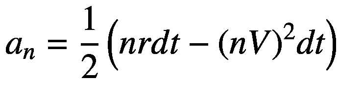

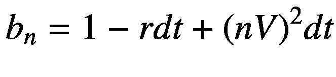
```

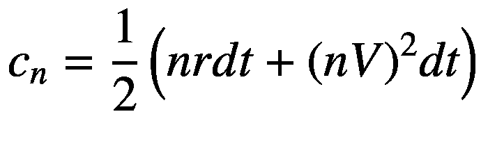

下一步是利用给定的初始条件来初始化整个过程。计算出的价格存储在二维向量`u`中，该向量使用到期时的价格进行初始化。然后，算法从到期日开始，依次计算每个时间周期的值。在每一天，从到期日的前一天开始，针对标的资产价格的每次微小上涨，计算对应的期权价格。标的资产价值`S`下的期权价格，取决于下一天在`S – dS`、`S`和`S + dS`这几个价值下的价格，其中`dS`是价格的一个微小增量，由参数`nx`决定。因此，我们有：

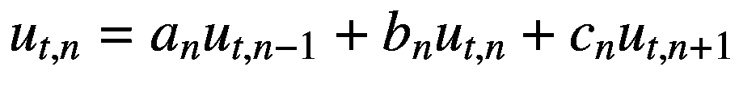

### 完整代码

代码清单 11-3 展示了布莱克-斯科尔斯前向方法的完整实现。你可以在类`BlackScholesForwardMethod`中找到这段代码，以及在`main()`函数中使用它的示例。

```
//
//  BlackScholesForwardMethod.h
#ifndef __FinancialSamples__BlackScholesForwardMethod__
#define __FinancialSamples__BlackScholesForwardMethod__
#include 
class BlackScholesForwardMethod {
public:
BlackScholesForwardMethod(double expiration, double maxPrice, double strike, double intRate);
BlackScholesForwardMethod(const BlackScholesForwardMethod &p);
~BlackScholesForwardMethod();
BlackScholesForwardMethod &operator=(const BlackScholesForwardMethod &p);
std::vector solve(double volatility, int nx, int timeSteps);
private:
double m_expiration;
double m_maxPrice;
double m_strike;
double m_intRate;
};
#endif /* defined(__FinancialSamples__BlackScholesForwardMethod__) */
//
//  BlackScholesForwardMethod.cpp
#include "BlackScholesForwardMethod.h"
#include 
#include 
#include 
#include 
#include 
using std::vector;
using std::cout;
using std::endl;
using std::setw;
BlackScholesForwardMethod::BlackScholesForwardMethod(double expiration, double maxPrice,
double strike, double intRate)
: m_expiration(expiration),
m_maxPrice(maxPrice),
m_strike(strike),
m_intRate(intRate)
{
}
BlackScholesForwardMethod::BlackScholesForwardMethod(const BlackScholesForwardMethod &p)
: m_expiration(p.m_expiration),
m_maxPrice(p.m_maxPrice),
m_strike(p.m_strike),
m_intRate(p.m_intRate)
{
}
BlackScholesForwardMethod::~BlackScholesForwardMethod()
{
}
BlackScholesForwardMethod &BlackScholesForwardMethod::operator=(const BlackScholesForwardMethod &p)
{
if (this != &p)
{
m_expiration = p.m_expiration;
m_maxPrice = p.m_maxPrice;
m_strike = p.m_strike;
m_intRate = p.m_intRate;
}
return *this;
}
vector BlackScholesForwardMethod::solve(double volatility, int nx, int timeSteps)
{
double dt = m_expiration /(double)timeSteps;
double dx = m_maxPrice /(double)nx;
vector a(nx-1);
vector b(nx-1);
vector c(nx-1);
int i;
for (i = 0; i  u((nx-1)*(timeSteps+1));
double u0 = 0.0;
for (i = 0; i  u = bsfm.solve(sigma, numSteps, numDays);
double minPrice = .0;
for (int  i=0; i < numSteps-1; i++)
{
double s = ((numSteps-i-2) * minPrice+(i+1)*maxPrice)/ (double)(numSteps-1);
cout << "  " << s << "  " << u[i+numDays*(numSteps-1)] << endl;
}
return 0;
}
代码清单 11-3
布莱克-斯科尔斯前向方法实现
```

### 运行代码

要测试代码清单 11-3 中展示的代码，你可以使用任何符合标准的编译器来构建它。我使用 llvm C++ 编译器运行了此代码，得到以下结果：

```
./blackScholes
1  0.000452875
2  0.0148578
3  0.109172
4  0.361706
5  0.784941
6  1.34918
7  2.016
8  2.75175
9  3.53055
10  4.33362
```

这个结果意味着，例如，在距离到期日还有 29 天时，一个执行价为 5 美元、波动率为 0.5 的看涨期权，在标的资产价格为 6 美元时价值为 1.3 美元。请注意，你可以使用这段代码计算从 1 美元到 10 美元每个价格水平下的价格。你也可以修改代码，以计算价格更高的股票对应的期权价格。

### 结论

求解微分方程是金融分析技术的重要组成部分。此类技术广泛应用于诸多领域，在这些领域中，资产价格由复杂的微分方程决定，例如布莱克-舒尔斯模型，该模型是银行用于为股权衍生品及相关投资定价的主要技术。

在本章中，我向您介绍了微分方程数值解这一主题。尽管这是一个庞大的领域，无法在一章内容中轻易涵盖，但理解基本技术及其在金融编程领域中的应用方式仍然很有价值。

针对常微分方程的`Euler()`方法是首先讨论的方法。其主要思想是执行若干步骤，每个步骤都对微分方程的结果进行近似。第二种方法，即龙格-库塔算法，是对这一通用策略的改进，它使用更高阶的泰勒逼近，使算法更加精确，并避免了`Euler()`方法的一些弱点。您已经了解了如何在 C++ 中实现这两种算法，并使用了演示其收敛性的测试数据。

布莱克-舒尔斯方程是现代金融学中最重要的数学模型之一。虽然有多种稳健且高效的算法可以求解该方程，但本文提出了一种基于前向差分的简单方法。您已经了解了通用的求解策略是如何工作的，以及如何在 C++ 中高效地实现它。

正如本章所述，为描述市场行为的方程寻找解通常是数据分析过程的起点。另一个步骤是找到满足特定投资目标的最佳解决方案。为此，人们开发了许多优化技术。在下一章中，我将介绍一些已被成功应用于金融投资分析的通用优化方法，以及它们在 C++ 中的实现。