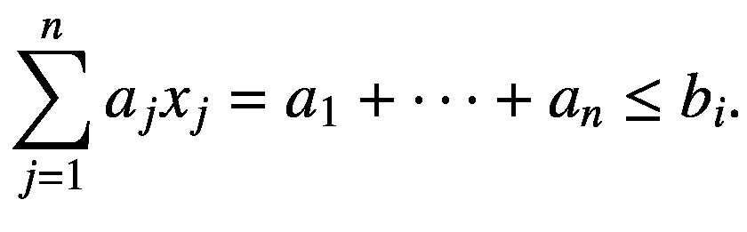
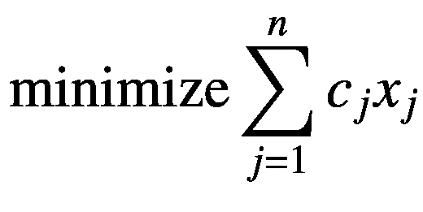
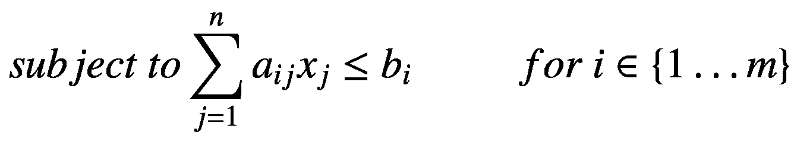
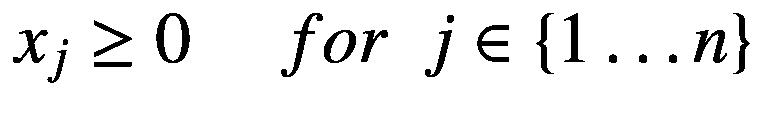
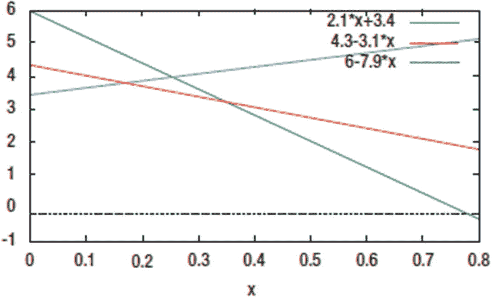

# 12. 优化

优化是一个广阔的领域，涵盖了用于在一组预定义条件下寻找函数最小值或最大值的大量技术。优化策略经常被用于金融工程的多个领域，例如投资组合优化，因此它应成为金融开发人员基本技能的一部分。

在本章中，我们将讨论一些编程示例，以探究优化算法的几个实现方面。我们将从简要解释一些技术及其在 C++ 中的典型实现方式开始。本章涵盖的主题包括：

*   **优化概念**：优化的基本概念，以及它如何作为金融应用算法中的常见步骤被使用。

*   **线性规划模型**：线性优化模型的基础知识，包括常见假设以及如何解释结果。您还将学习如何为常见问题创建线性规划模型。

*   **求解线性模型**：您将学习常用于求解线性规划模型的技术和算法。特别是，您将学习如何使用一个流行的开源库来解决线性规划问题。

*   **求解混合整数规划模型**：线性规划的一个常见扩展是要求一个或多个决策变量只能取整数值。这种类型的问题，称为整数规划问题，只要线性模型中存在互斥的选择就会被频繁使用。您还将学习如何扩展线性规划类以求解此类混合整数规划模型。

## 与线性规划求解器接口

在本节中，我们将创建一个通用类，用于在给定矩阵形式的`目标函数`和`约束条件`的情况下求解线性规划问题。

### 解决方案

优化是一种数学技术，用于在给定约束条件集合下寻找函数的最大值或最小值。当前使用的优化方法最初源于微积分中的一组简单结果，即对单个函数进行最小化或最大化。如今，这些技术包含了涉及多个线性和非线性组件的复杂模型。

在金融工程和经济学中，优化是一种用于多种目的的工具，例如设计最优的资产组合配置，或者更广泛地，从大量资产类别中确定最佳投资决策。由于其源于对稀缺资源及其最优利用的分析，线性规划一直是经济学家和金融分析师青睐的工具——这也说明了为什么优化在金融编程中是一种如此常用的技术。实际上，每当我们面对大量情景需要就资产配置做出决策时，优化就成为了帮助选择最佳决策的有用工具。

在“使用 LP 求解器库”一节的代码示例中，我们将考虑如何与现有库进行接口，这些库可用于求解一大类优化问题。为了使讨论内容更紧凑，我将使用一个名为`GLPK`（Gnu 线性规划工具集）的开源库，它也将作为后续示例的基础。`GLPK`使用简单，但它只是一个基于 C 语言的库。这意味着它不直接支持 C++ 的高级概念，如类、模板和容器。因此，作为讨论的一部分，我将向您展示如何创建一个为`GLPK`和其他求解器提供基本 C++ 接口的类。

然而，首先，我将向您提供一些关于可用优化引擎求解的问题类型的初步信息，从线性规划开始。然后，我将提供一些可用于将简单线性模型转换为求解器`应用程序编程接口`调用的代码。

### 线性规划概念

您将了解的第一种优化情况，其特点是`目标`被表示为一个线性函数。然后，在一组也被称为`约束`的线性函数上对该目标进行优化。此类优化问题被称为线性规划问题，它们构成了一类重要的数学模型，已被广泛应用于金融分析和经济学等学科。

使用更正式（数学）的定义，线性规划是优化的一个领域，它处理在一组线性约束下确定线性函数最小值或最大值的问题。每个约束的形式如下：



类似地，您想要在其上进行优化的函数（也称为`目标函数`）是一个线性函数。这导致了一个可以用以下方式表示的问题：







在这些方程中，`x[j]`是一个变量，而`a[ij]`、`b[i]`和`c[j]`是常量值。这些参数通常以矩阵`A`和两个向量`b`和`c`的形式提供。由于它的通用特性，这类问题可以呈现多种形式，这取决于给定系数的确切值，以及它们是否为零或非零。此外，问题的变体涉及改变一个或多个方程中的`≤`关系到`≥`或`=`。最后，问题可能要求最大化而非最小化目标函数。所有这些变体都可以很容易地证明彼此等价，因为可以将它们转换为特定的形式，并使用相同的算法求解。

求解线性规划问题可以借助一种称为单纯形算法的方法来完成。单纯形算法的基本方法是考虑由约束在多维空间中定义的几何区域，并以一种明确的方式开始访问该对象的顶点——直到找到最优解。

本质上，求解线性规划问题的机制与求解一系列线性系统并无太大区别，并且已经设计出几种利用这一通用策略的方案。单纯形算法仍然是求解线性规划问题最常用的技术，它通过定义一系列修改后的线性系统来进行，这些系统被证明与原系统等价，同时不断改进目标函数的值。单纯形算法的优势之一是其性质众所周知——多年来对单纯形算法的数学分析已经考虑了诸如收敛性和性能等几个重要问题。

虽然描述单纯形算法的操作并不困难，但实现该算法包含许多复杂的边界情况。为了避免这些问题，大多数情况下你会使用一个专门设计来隐藏实现复杂性的线性规划求解器库。本质上，求解器只提供一个简单的 API，使用户能够调用算法、提供必要的数据并检索结果。

## 使用线性规划求解器库

有几种商业和免费库实现了单纯形算法（甚至还有几种针对此问题更高效的算法）。在本节中，为了说明建模和线性规划过程的原理，我们使用一个简单但维护良好的开源库，名为`GLPK`。使用`GLPK`，可以解决从中等到相对较大规模的线性规划问题（以及一些其他模型变体，如混合整数规划）。

要从 C++开始使用`GLPK`，第一步是下载并编译源代码。你将在 GNU 网站上找到该软件的一个版本（在我检查时，URL 为[www.gnu.org/software/glpk](http://www.gnu.org/software/glpk)）。与许多数学开源库不同，`GLPK`非常易于编译和安装。你需要解压文件并使用`configure`和`make`命令构建库（这些说明适用于 UNIX 系统，但你可以下载诸如 Cygwin 之类的软件，以便在 Windows 中执行相同的命令）。

安装`GLPK`后，你可以链接到其库`libglpk.a`，并使用其 API 导出的函数。在 Windows 系统上，你可以使用`GLPK`网站上提供的预编译二进制 dll 和 lib 文件。你也可以在 Windows 上使用 MingWin 编译器来编译 gcc。

我提供了一个名为`LPSolver`的类，它能够与`GLPK` API 进行交互。以下是该类声明的公共部分：

```
class LPSolver {
public:
LPSolver(Matrix &m, const std::vector &b, const std::vector &c);
LPSolver(const LPSolver &p);
~LPSolver();
LPSolver &operator=(const LPSolver &p);
enum ResultType {
INFEASIBLE,
FEASIBLE,
ERROR
};
void setName(const std::string &s);
bool isValid();
void setMaximization();
void setMinimization();
ResultType solve(std::vector &result, double &objValue);
// ...
};
```

首先，如果你将矩阵`A`、向量`b`和向量`c`传递给构造函数，则可以创建`LPSolver`类型的对象。这些参数被解释为目标函数的系数以及线性规划的约束条件。

你还可以使用`setName`成员函数为问题指定一个描述性名称。其实现展示了`GLPK`中一个简单函数的样子。

```
void LPSolver::setName(const std::string &s)
{
glp_set_prob_name(m_lp, s.c_str());
}
```

该 API 函数名为`glp_set_prob_name`。与`GLPK`中大多数其他函数一样，第一个参数是指向线性规划数据结构的指针。第二个参数是一个字符串，对于此 API 调用是唯一的。

`isValid`成员函数检查对象是否已正确初始化。`setMaximization`和`setMinimization`成员函数可用于定义优化方向。

最后，`solve`成员函数执行优化算法。这是通过调用 GLPK 完成的，其中使用`glp_simplex`函数来完成实际工作。优化完成后，算法收集目标函数的结果以及每个变量在此最优解中的值。

```
LPSolver::ResultType LPSolver::solve(std::vector &result, double &objValue)
{
glp_simplex(m_lp, NULL);
result.resize(m_M, 0);
objValue = glp_get_obj_val(m_lp);
for (int i=0; i<m_M; ++i)
{
result[i] = glp_get_col_prim(m_lp, i+1);
}
return LPSolver::FEASIBLE;
}
```

最后，使用一个线性规划示例来测试`LPSolver`类。在此示例中，我提供了等于 10、6 和 4 的目标函数系数。约束条件的右侧也作为一个向量提供。最后，问题的约束条件以`Matrix`对象`A`的形式给出。

### 完整代码

清单 12-1 显示了上一节描述的线性规划求解器的完整代码清单。在清单末尾的`main`函数中给出了`LPSolver`类的一个示例。

```cpp
//
// LPSolver.h
#ifndef __FinancialSamples__Glpk__
#define __FinancialSamples__Glpk__
#include 
#include 
#include "Matrix.h"
struct glp_prob;
class LPSolver {
public:
LPSolver(Matrix &A, const std::vector &b,
const std::vector &c);
LPSolver(Matrix &A, const std::vector &b,
const std::vector &c,
const std::string &probname);
LPSolver(const LPSolver &p);
~LPSolver();
LPSolver &operator=(const LPSolver &p);
enum ResultType {
INFEASIBLE,  // 不可行
FEASIBLE,    // 可行
ERROR        // 错误
};
virtual ResultType solve(std::vector &result, double &objValue);
void setName(const std::string &s);
bool isValid();
void setMaximization();
void setMinimization();
private:
size_t m_M;
size_t m_N;
std::vector m_c;
std::vector m_b;
Matrix m_A;
glp_prob *m_lp;
void initProblem(size_t M, size_t N);
void setRowBounds();
void setColumnCoefs();
protected:
glp_prob *getLP();
int getNumCols();
int getNumRows();
};
#endif /* defined(__FinancialSamples__Glpk__) */
//
//  LPSolver.cpp
#include "LPSolver.h"
#include 
#include 
using std::vector;
using std::string;
using std::cout;
using std::endl;
LPSolver::LPSolver(Matrix &m, const vector &b, const vector &c)
: m_M(m.numRows()),
m_N(m[0].size()),
m_c(c),
m_b(b),
m_A(m),
m_lp(glp_create_prob())
{
initProblem(m_M, m_N);
}
LPSolver::LPSolver(Matrix &m, const std::vector &b,
const std::vector &c,
const std::string &probname)
: m_M(m.numRows()),
m_N(m[0].size()),
m_c(c),
m_b(b),
m_A(m),
m_lp(glp_create_prob())
{
initProblem(m_M, m_N);
glp_set_prob_name(m_lp, probname.c_str());
}
LPSolver::LPSolver(const LPSolver &p)
: m_M(p.m_M),
m_N(p.m_N),
m_c(p.m_c),
m_b(p.m_b),
m_A(p.m_A),
m_lp(glp_create_prob())
{
initProblem(m_M, m_N);
}
// performs necessary initialization of the given values
void LPSolver::initProblem(size_t M, size_t N)
{
if (!m_lp) return;
setRowBounds();
setColumnCoefs();
vector I, J;
vector V;
// indices in GLPK start on 1
I.push_back(0);
J.push_back(0);
V.push_back(0);
for (int i=0; i &result, double &objValue)
{
glp_simplex(m_lp, NULL);
result.resize(m_N, 0);
objValue = glp_get_obj_val(m_lp);
for (int j=0; j c = { 10, 6, 4 };
vector b = { 100, 600, 300 };
LPSolver solver(A, b, c);
solver.setMaximization();
vector results;
double objVal;
solver.solve(results, objVal);
for (int i=0; i<results.size(); ++i)
{
cout << " x" << i << ": " << results[i];
}
cout << " max: " << objVal << endl;
return 0;
}
```

**清单 12-1：**`LPSolver`类头文件与实现

### 运行代码

清单 12-1 中展示的代码可使用符合标准的编译器（如`gcc`或 Visual Studio）进行编译。请记得在链接步骤中添加 GLPK 库（在`gcc`中，通过`-L`和`-l`开关实现）。程序执行结果应类似于以下内容：

```
./lpSolver
GLPK Simplex Optimizer, v4.54
3 rows, 3 columns, 9 non-zeros
*     0: obj =   0.000000000e+00  infeas =  0.000e+00 (0)
*     2: obj =   7.565217391e+02  infeas =  0.000e+00 (0)
OPTIMAL LP SOLUTION FOUND
x0: 52.1739 x1: 39.1304 x2: 0 max: 756.522
```

这里，你看到了 GLPK 的首次输出。默认情况下，GLPK 会显示最优解以及达到该结果所经历的迭代次数。你可以看到，经过两次单纯形算法迭代后，GLPK 找到了一个目标值为 756 的解。

## 求解二维投资问题

在本节中，我们使用线性规划技术来建模并求解一个涉及两种已知回报投资的金融产品分配决策问题。

### 解决方案

优化技术的主要用途之一是支持投资决策。在这方面，可以根据投资类别的已知属性来优化多个概念。对于少数几种投资类型，例如债券，更容易确定投资的回报率，以及该投资类别风险的一些基本信息。这些知识可以转化为更精确的模型，特别是那些可用于优化投资者利润的模型。

本节介绍一个非常简单的、使用线性规划建模的决策支持系统版本。该问题展示了用于求解线性规划问题（即使是最复杂的问题）的基本几何过程。

考虑一家大型银行将两种新的金融产品推向市场的过程。这一过程通常由这些投资所需资源的一系列实际约束条件来定义。假设该银行希望向市场增加两类新产品：新的基于债券的产品和新的抵押贷款支持衍生品产品。问题是在这些新产品的开发上应投入多少小时。我们将这两个变量称为`x`和`y`。由于银行部门根据在这些任务上花费的小时数从客户那里获得报酬，因此目标是最大化每小时获得的报酬。对于债券，该项活动每小时的收费为 5.3K 美元，而衍生品的收费为 7.1K 美元。

在约束条件方面，银行部门必须考虑研发支出成本。从事债券工作的成本是负的，因为其成本可以被该领域的其他活动所抵消。对于衍生品，则需考虑全部研发成本。这些金融产品的最大营销支出也按工作小时数进行分摊。因此，它取决于 `x` 和 `y` 的值。已知债券相关产品的工作小时数有一个 3K 美元的常数项，而衍生品工作的乘数为 1K 美元。

最后，这两项任务可用的总人力资源是有限的。虽然只有六个单位的人力资源分配给这些任务，但每小时的债券相关工作对人力资源的需求是衍生品的八倍。还要注意，本例中的两个变量显然是非负的。

这些假设的结果可以很容易地转化为以下线性规划模型，该模型试图最大化该投资银行所考虑部门的预期回报（利润）。

*   `max 5.3*x + 7.1*y` (最大化部门收益)
*   `–2.1*x + y ≤ 3.4` (最大研发支出)
*   `3.1*x + y ≤ 4.3` (最大营销支出)
*   `7.9*x + y ≤ 6` (所需的最大员工人数)
*   `x, y ≥ 0` (工作时间始终为正)

前面描述的模型只有两个未知数，`x` 和 `y`，因此可以很容易地绘制出来，如图 12-1 所示。作为一个不等式，每个约束条件都产生一个由等式线定义的半空间。例如，`3*x + y ≤ 4` 是由直线 `3*x + y = 4` 下方所有点定义的半空间。



图 12-1：由前面所示不等式定义的线性规划问题可行域

要解决像之前描述的二维线性规划模型，你需要关注由约束所定义的所有半空间（half-spaces）的交集。根据问题的定义，这个交集位于图表的第一象限，因为已知 `x ≥ 0` 且 `y ≥ 0`。然后，可以识别出所有其他半空间交集所包含的区域。结果是一个多边形区域，其边界由一组源自给定约束的直线所定义。

要找到此类线性规划的解，你只需计算目标函数在约束定义区域每个角点处的值。根据线性目标函数的定义，能给出目标函数最优值的角点，就是该问题所能找到的最优解。

虽然前面描述的过程对于二维问题很容易执行，但在更高维度上就会变得相当困难。随着维度和约束数量的增加，角点的数量呈指数级增长。这就需要使用更复杂的算法（例如单纯形算法）来找到多维空间中定义给定线性规划最优解的最佳角点。

为了演示该问题在实际中如何求解，我向你展示了所提出的二维线性规划的 C++ 实现。名为 `TwoDimensionalLPSolver` 的类，是使用上一节描述的 `LPSolver` 来实现此类问题的蓝图。

首先，你需要创建模型，该模型使用矩阵 `A`、向量 `b`（约束的右侧值）和向量 `c`（成本向量）进行描述。必要的数据在 `main` 函数中提供。数据可用后，即可用于创建 `LPSolver` 类的对象。然后，`LPSolver` 类中的 `solve()` 函数将执行任何必要的数据转换，并调用 GLPK 库来找到最优解。

### 完整代码

清单 12-2 给出了二维线性规划求解器的完整实现。`main()` 函数展示了 `TwoDimensionalLPSolver` 类的使用示例。

```cpp
//
//  TwoDimensionalLPSolver.h
#ifndef __FinancialSamples__TwoDimensionalLPSolver__
#define __FinancialSamples__TwoDimensionalLPSolver__
#include 
class TwoDimensionalLPSolver {
public:
using Vector = std::vector;
TwoDimensionalLPSolver(const Vector &c, const Vector &A1, const Vector &A2, const Vector &b);
TwoDimensionalLPSolver(const TwoDimensionalLPSolver &p);
~TwoDimensionalLPSolver();
TwoDimensionalLPSolver &operator=(const TwoDimensionalLPSolver &p);
bool solveProblem(Vector &results, double &objVal);
private:
std::vector m_c;
std::vector m_A1;
std::vector m_A2;
std::vector m_b;
};
#endif /* defined(__FinancialSamples__TwoDimensionalLPSolver__) */
//
//  TwoDimensionalLPSolver.cpp
#include "TwoDimensionalLPSolver.h"
#include "Matrix.h"
#include "LPSolver.h"
#include 
using std::vector;
using std::cout;
using std::endl;
TwoDimensionalLPSolver::TwoDimensionalLPSolver(const Vector &c, const Vector &A1,
const Vector &A2, const Vector &b)
: m_c(c),
m_A1(A1),
m_A2(A2),
m_b(b)
{
}
TwoDimensionalLPSolver::TwoDimensionalLPSolver(const TwoDimensionalLPSolver &p)
: m_c(p.m_c),
m_A1(p.m_A1),
m_A2(p.m_A2),
m_b(p.m_b)
{
}
TwoDimensionalLPSolver::~TwoDimensionalLPSolver()
{
}
TwoDimensionalLPSolver &TwoDimensionalLPSolver::operator=(const TwoDimensionalLPSolver &p)
{
if (this != &p)
{
m_c = p.m_c;
m_A1 = p.m_A1;
m_A2 = p.m_A2;
m_b = p.m_b;
}
return *this;
}
bool TwoDimensionalLPSolver::solveProblem(Vector &res, double &objVal)
{
int size = m_b.size();
Matrix A(size, 2);
for (int j=0; j A1 = { -2.1, 3.1, 7.9};
vector A2 = { 1, 1, 1 };
vector c = { 5.3, 7.1 };
vector b = { 3.4, 4.3, 6 };
TwoDimensionalLPSolver solver(c, A1, A2, b);
vector results;
double objVal;
solver.solveProblem(results, objVal);
cout << "objVal : " << objVal << endl;
for (int i=0; i<results.size(); ++i)
{
cout << " x" << i << ": " << results[i];
}
cout << endl;
return 0;
}
```

清单 12-2
类 `TwoDimensionalLPSolver` 的头文件与实现

### 运行代码

你可以使用任何符合标准的编译器来编译并运行所提供的代码。我在 gcc 和 GLPK 优化器 4.54 版本下测试了该代码。结果如下：

```
./twoDimSolver
GLPK Simplex Optimizer, v4.54
3 rows, 2 columns, 6 non-zeros
*     0: obj = 0.000000000e+00 infeas = 0.000e+00 (0)
*     2: obj = 2.763788462e+01 infeas = 0.000e+00 (0)
OPTIMAL LP SOLUTION FOUND
objVal : 27.6379
x0: 0.173077 x1: 3.76346
Program ended with exit code: 0
```

从示例列出的输出中可以看出，最优解在顶点 (0.173, 3.763) 处取得，该点对应方程 `–2.1*x + y = 3.4` 和 `3.1*x + y ≤ 4` 的交点。在该点，目标函数的值为 27.63，这可以解释为部门将给定小时数投入到前面讨论的两种金融产品中所实现的利润。

## 创建混合整数规划模型

扩展 `LPSolver` 类，使其能够处理混合整数规划（MIP）问题，即一个或多个变量被限制为整数的线性规划问题。

### 解决方案

在连续线性规划（LP）问题之后，混合整数规划（MIP）问题可能是实践者需要处理的最常见的优化问题类型。从建模角度来看，LP 与 MIP 最大的区别在于，MIP 问题有一个或多个决策变量必须为整数——这与 LP 问题不同，LP 中所有决策变量都是连续的（通常是实数）。

整数变量非常适合需要在中小型集合内做出互斥决策的情况。此外，这些决策变量可能适用于不可分割的资源。例如，您可以使用此类变量决定商业银行的地方分行数量，或投资组合中包含的不同股票数量。这些都是只能以整数数量使用的资源的常见示例。

一种特殊类型的整数变量是二元决策变量，也称为 0–1 决策变量。这些变量只能取 0 或 1（全有或全无）的值。它们是最纯粹的整数变量形式，因为它们允许只在两种替代选择之间做出决策。可以预见，许多 MIP 问题将二元变量作为达成最优决策的主要方式。

从问题求解的技术角度来看，MIP 问题比 LP 问题复杂得多。虽然有非常高效的算法可用于求解 LP 公式，但并非所有 MIP 问题都能被当前的计算机算法轻易求解。简而言之，这是因为当决策变量为整数时，它会在目标函数中产生“跳跃”，使得寻找最优解变得更加困难。因此，与 LP 问题不同（LP 中可以快速确定可行解集合的最优顶点），MIP 求解器需要花费更多时间生成可能的解并测试它们是否最优。这种选项的指数级爆炸是 MIP 问题比 LP 问题难解得多的主要原因。

大多数 LP 库已扩展为至少能处理某些形式的 MIP。GLPK 实现了一种称为`branch-and-cut`的通用 MIP 求解算法。使用此算法，可以求解中小型 MIP 问题的最优解。然而，更复杂的 MIP 问题可能无法使用此技术求解，具体取决于所需问题的结构。

在本编码示例中，您将看到如何扩展`LPSolver`类以处理 MIP 问题，以及经典的 LP 问题。在下一节中，您将看到一个如何使用`LPSolver`类建模并求解 MIP 问题的示例。

我决定从`LPSolver`继承而不是创建一个不相关的新类的主要原因是，从建模角度来看，MIP 问题与 LP 问题非常接近。在后一种情况下，您唯一需要额外做的事情是指定哪些变量是整数或二元，并调用正确的函数版本来求解并检索 GLPK 找到的值。

在`MIPSolver`类中，这是通过以下方式实现的。首先，有两个新的成员函数，名为`setColBinary`和`setColInteger`。这些成员函数可用于告知 GLPK 给定列中的变量分别是整数还是二元。它们的实现很直接，只是调用 GLPK 中相关的 C 函数。例如：

```cpp
void MIPSolver::setColBinary(int colNum)
{
    glp_set_col_kind(getLP(), colNum+1, GLP_BV);
}
```

另一个关键部分是实现`solve`成员函数的新版本。新版本取代了`LPSolver`中的原始版本，并调用 MIP 专用的函数，例如`glp_mip_obj_val`。其中一个区别是，对于 MIP 问题，您需要先求解对应的 LP 问题，以此作为连续问题的初始可行解。之后，您可以调用 MIP 求解器，它将基于可能的整数值树来创建搜索算法。

### 完整代码

清单 12-3 展示了上一节描述的 MIP 求解器的完整代码。您可以使用清单 12-3 末尾的`main`函数中的示例代码测试`MIPSolver`类。

```cpp
//
//  MIPSolver.h
#ifndef __FinancialSamples__MIPSolver__
#define __FinancialSamples__MIPSolver__

#include "LPSolver.h"

class MIPSolver : public LPSolver {
public:
    MIPSolver(Matrix &A, const std::vector &b, const std::vector &c);
    MIPSolver(const MIPSolver &p);
    ~MIPSolver();
    MIPSolver &operator=(const MIPSolver &p);
    void setColInteger(int colNum);
    void setColBinary(int colNum);
    virtual ResultType solve(std::vector &result, double &objValue);
};

#endif /* defined(__FinancialSamples__MIPSolver__) */

//
//  MIPSolver.cpp
#include "MIPSolver.h"
#include "Matrix.h"
#include <iostream>
#include <algorithm>

using std::vector;
using std::cout;
using std::endl;

MIPSolver::MIPSolver(Matrix &A, const std::vector &b, const std::vector &c)
: LPSolver(A, b, c)
{
}

MIPSolver::MIPSolver(const MIPSolver &p)
: LPSolver(p)
{
}

MIPSolver::~MIPSolver()
{
}

MIPSolver &MIPSolver::operator=(const MIPSolver &p)
{
    return *this;
}

void MIPSolver::setColInteger(int colNum)
{
    glp_set_col_kind(getLP(), colNum+1, GLP_IV);
}

void MIPSolver::setColBinary(int colNum)
{
    glp_set_col_kind(getLP(), colNum+1, GLP_BV);
}

LPSolver::ResultType MIPSolver::solve(vector &result, double &objValue)
{
    glp_simplex(getLP(), NULL);
    int res = glp_intopt(getLP(), NULL);
    if (res != 0)
    {
        cout << "error on glp_intopt" << endl;
        return LPSolver::kError;
    }
    int n = getNumVariables();
    result = vector(n);
    for (int j = 0; j < n; ++j)
    {
        result[j] = glp_mip_col_val(getLP(), j+1);
    }
    objValue = glp_mip_obj_val(getLP());
    return LPSolver::kOptimal;
}

int main()
{
    int m = 2;
    int n = 2;
    Matrix A(m, n);
    vector b = { 2, 3 };
    vector c = { 1, 1 };
    A[0][0] = 1;
    A[0][1] = 2;
    A[1][0] = 3;
    A[1][1] = 4;
    MIPSolver solver(A, b, c);
    solver.setMaximization();
    solver.setColInteger(0);
    vector result;
    double objVal;
    solver.solve(result, objVal);
    cout << "optimum: " << objVal << endl;
    cout << " x0: " << result[0] << " x1: " << result[1] << endl;
    return 0;
}

清单 12-3
MIPSolver 类
```

### 运行代码

用您喜欢的编译器编译清单 12-3 中的代码后，您应该得到一个二进制程序，我将其命名为`mipSolver`。以下是应用程序执行后的输出：

```
./mipSolver
GLPK Simplex Optimizer, v4.54
2 rows, 2 columns, 4 non-zeros
*     0: obj = 0.000000000e+00 infeas = 0.000e+00 (0)
*     1: obj = 1.000000000e+00 infeas = 0.000e+00 (0)
OPTIMAL LP SOLUTION FOUND
GLPK Integer Optimizer, v4.54
2 rows, 2 columns, 4 non-zeros
1 integer variable, none of which are binary
Integer optimization begins...
+     1: mip =     not found yet >>>>   1.000000000e+00 <=   1.000000000e+00   0.0% (1; 0)
+     1: mip =   1.000000000e+00 <=     tree is empty   0.0% (0; 1)
INTEGER OPTIMAL SOLUTION FOUND
optimum: 1
x0: 1 x1: 0
```

请注意，`main`函数中有一个非常简单的 MIP 模型作为测试代码的一部分。上面的输出仅展示了 GLPK 默认打印数据的方式。在过程的每一步，它都会显示当前找到的解及其目标成本。

### 结论

优化是一组数学方法，可用于在特定条件下寻找函数的最大值或最小值。由于金融领域的许多问题可被描述为最大化特定结果（例如投资回报），因此优化工具在投资分析中扮演着重要角色。

在本章中，您已学习如何使用 C++ 建模并求解常见的优化问题。在第一部分，我演示了如何使用`GLPK`（一种用于求解大量线性规划模型的流行优化库）。尽管其他库（如`cplex`和`gurobi`）使用了更复杂的算法，但`GLPK`能够解决数量惊人的线性规划和混合整数规划模型。第一部分的示例展示了如何创建 C++ 接口以与`GLPK`支持的基于 C 的 API 进行交互。您已了解线性规划问题的主要组成部分，以及求解器如何利用这些组件确定最优解。该示例还提供了一些测试代码，展示了如何使用`LPSolver`类求解简单的线性规划模型。

下一部分提供了一个大型线性规划模型示例，旨在为一家大型投资银行寻找最佳资源配置方案。该模型试图在最大化部门利润的同时，找到开发两种金融产品的最佳方式。模型中考虑的约束条件与银行部门的资源限制有关。使用`LPSolver`类求解该线性规划问题展示了如何在 C++ 中对此类问题进行建模，并解读`GLPK`返回的优化过程结果。

混合整数规划是另一类可使用优化技术求解的重要线性模型。在混合整数规划中，部分或全部决策变量被限制为仅取整数值。这使得我们能够对需要在两个或多个场景之间进行互斥决策的情况进行建模。尽管混合整数规划模型可能比线性规划模型更难求解，但设置问题和调用求解器的机制却非常相似。您已学习如何通过继承`LPSolver`类来与混合整数规划求解器交互。新类`MIPSolver`使用了`LPSolver`提供的大部分建模机制，但增加了定义整数和二元决策变量、求解问题以及检索最优整数值的能力。最后，您看到了一个展示此类模型如何工作的小示例。第 13 章提供了更多示例。

到目前为止，您已学习了一些关于优化和数学规划模型的基本概念。在下一章中，您将探索如何将这些线性规划和混合整数规划优化模型应用于投资管理问题。由于优化理论的主要应用领域之一是金融，许多常见问题（如投资组合管理）都有成熟的优化模型。您将学习此类建模概念的工作原理，以及如何使用 C++ 编程语言实现这些模型。