# 13. 资产与投资组合优化

投资组合经理必须面对若干投资问题，例如为了达到最优表现而重新平衡投资组合，或根据客户预定义的长期目标调整新的投资组合。多年来，人们开发了基于优化的技术来处理这些问题以及其他一些常见的投资组合构建问题。

在本章中，您将探索使用 C++ 作为建模语言进行资产和投资组合优化的编程算法。您将能够基于著名的数学规划公式创建此类金融模型。您还将了解如何提升此类优化代码的性能，从而以尽可能快且准确的方式获得结果。

以下是本章 C++ 示例中涵盖的部分主题：

- **资本配置**：公司和银行面临的重大问题之一是如何将资本配置给一组可能的投资项目。您将看到如何使用优化模型进行资本配置。

- **按目标收益创建投资组合**：您可以根据期望收益，使用优化模型来设计股票或其他投资品的投资组合。此类最优投资组合的目标是以最小的波动性实现最佳收益。

- **线性与二次模型**：您将了解二次和线性优化模型在投资组合优化中的优势。

## 金融资源配置

在本节中，我们将使用 C++ 编写一个线性规划模型，以确定在 10 年期限内，针对一组给定的项目及其各自成本的最优资源配置方案。

### 解决方案

资源配置是个人和机构投资者面临的最常见问题之一。由于资本是有限资源，优化其使用以将资金最优地分配给有价值的活动是合理的。尽管投资结果（如股票价格）可能无法完全预测，但仍有可能会使用一般性预测来进行决策。

如本节所述，线性规划为金融分配决策提供了一个框架。首先，您需要确定最适合对资源配置问题建模的线性规划形式。

为使用具体的配置示例，假设一家公司需要从一组五个不同的活跃投资项目中做出决策。这些投资可能包括购买新的制造设备、为企业招聘新员工，或对物流软件包进行改进。所有这些选项都有特定的成本，并且可以计算出未来五年中每一年的成本。此外，每个投资项目的回报是预先已知的。例如，如果资金用于购买新设备，则已知这会产生一定数额的利润。

作为这家公司的金融开发者，您的任务是实现一个模型来解决所需的金融分配问题。这可以作为一个线性规划模型来完成，之后将在 C++ 中实现。因此，首先，让我们考虑线性规划模型的变量、约束条件和目标函数。

**决策变量**在此情况下是对可能投资的选择。也就是说，如果有 `n` 个可能的投资项目，那么当资本分配给项目 `j` 时，我们有变量 `x[j] = 1`，其中 `j ∈ {1,..,n}`。如果将每个投资的回报记为 `r[j]`，那么我们可以将此线性规划的目标函数写为

```
max ∑_{j=1}^n r_j * x_j
```

约束条件与投资者在未来 5 年每年希望使用的资金金额有关。由于每项投资在任意 `m` 个时期中的成本是已知的，我们称这些成本为 `c[ij]`，其中 `i ∈ {1...m}` 且 `j ∈ {1...n}`。每年，投资额受限于值 `C[i]`，即时间周期 `i` 可用的资本金额。那么，对于每个时间周期（每个周期对应 1 年），约束条件可写为

```
∑_i^n c_ij * x_j ≤ C_i; for i ∈ {1…m}
```

最后，我们将每个变量`x[j]`定义为一个“要么做要么不做”的决策。也就是说，该变量只能取值为 1 或 0，表示该项目将被执行或不执行。

`x[j] ∈ {0,1}`，对于`j` ∈ `{1,...,n}`。

由于前面描述的问题具有线性目标函数和线性约束，它是一个线性优化问题。然而，最后一个约束使得该问题成为一个 0-1 整数线性规划问题，这比标准线性规划问题要难解决得多。

### 实现

为了实现前面描述的问题，我将利用上一章中定义的`MIPSolver`类。请记住，任何混合整数规划问题的输入都可以用约束矩阵、右端项向量和成本向量来表示。因此，在定义所需的资本分配问题时，我们需要定义这三个要素。

为了清晰展示这一过程是如何工作的，我创建了一个简单的示例，该示例可以在`ResourceAlloc`类的成员函数`solveProblem`中查看。首先，该方法定义了一个 5 年期的项目成本矩阵。我们也有五个项目，因此得到一个方阵——不过请注意，要使此公式有效，并不一定需要方阵。

方法`solveProblem`的接下来几行定义了投资回报和年度预算。这个过程的一个重要部分是使用`setBinary`成员函数，该函数规定每个变量必须具有二进制值。

最后，你需要调用`MIPSolver`类中的`solve`函数，该函数将调用 GNU 线性规划工具包（GLPK）求解器并确定最优值。

### 完整代码

上一节中描述的资源分配问题的完整代码可以在清单 13-1 中查看。清单末尾的`main`函数将实例化`ResourceAlloc`类并求解示例问题。

```
//
//  ResourceAlloc.h
#ifndef __FinancialSamples__ResourceAlloc__
#define __FinancialSamples__ResourceAlloc__
#include 
class ResourceAlloc {
public:
ResourceAlloc(std::vector &result, double &objVal);
ResourceAlloc(const ResourceAlloc &p);
~ResourceAlloc();
ResourceAlloc &operator=(const ResourceAlloc &p);
void solveProblem();
private:
std::vector &m_results;
double &m_objVal;
};
#endif /* defined(__FinancialSamples__ResourceAlloc__) */
//
//  ResourceAlloc.cpp
#include "ResourceAlloc.h"
#include "LPSolver.h"
#include "Matrix.h"
#include 
using std::vector;
using std::cout;
using std::endl;
ResourceAlloc::ResourceAlloc(vector &result, double &objVal)
: m_results(result),
m_objVal(objVal)
{
}
ResourceAlloc::ResourceAlloc(const ResourceAlloc &p)
: m_results(p.m_results),
m_objVal(p.m_objVal)
{
}
ResourceAlloc::~ResourceAlloc()
{
}
ResourceAlloc &ResourceAlloc::operator=(const ResourceAlloc &p)
{
if (this != &p)
{
m_results = p.m_results;
m_objVal = p.m_objVal;
}
return  *this;
}
void ResourceAlloc::solveProblem()
{
static const double cost_array[][5] = {
// Years:
// 1    2   3     4    5
{1.81, 2.4,  2.5, 0.97, 1.5},  // proj 1
{1.29, 1.8,  2.3, 0.56, 0.5},  // proj 2
{1.22, 1.2,  0.1, 0.48, 0 },   // proj 3
{1.43, 1.4,  1.2, 1.2, 1.2},   // proj 4
{1.62, 1.9,  2.5, 2.0, 1.8},   // proj 5
};
Matrix costs(5,5);  // cost matrix
for (int i=0; i returns = {12.13, 3.95, 7.2, 4.21, 11.39};  // investment returns
vector budgets = {5.1, 6.4, 6.84, 4.5, 3.8};       // annual budgets
MIPSolver solver(costs, budgets, returns);
solver.setMaximization();
for (int i=0; i result;
double objVal;
ResourceAlloc ra(result, objVal);
ra.solveProblem();
cout << " optimum: " << objVal ;
for (int i=0; i<result.size(); ++i)
{
cout << " x" << i << ": " << result[i];
}
cout << endl;
return 0;
}
```

**清单 13-1**

`ResourceAlloc` 类

### 运行代码

要运行清单 13-1 中展示的代码，首先需要使用符合标准的编译器（如`gcc`或 Visual Studio）进行编译。然后，运行生成的可执行文件以查看优化过程的结果。

```
./investAllocSolver
GLPK Simplex Optimizer, v4.54
5 rows, 5 columns, 24 non-zeros
*     0: obj =   0.000000000e+00  infeas =  0.000e+00 (0)
*     5: obj =   3.209790698e+01  infeas =  0.000e+00 (0)
OPTIMAL LP SOLUTION FOUND
GLPK Integer Optimizer, v4.54
5 rows, 5 columns, 24 non-zeros
5 integer variables, all of which are binary
Integer optimization begins...
+     5: mip =     not found yet <=              +inf        (1; 0)
Solution found by heuristic: 30.72
+     6: mip =   3.072000000e+01 <=     tree is empty   0.0% (0; 1)
INTEGER OPTIMAL SOLUTION FOUND
optimum: 30.72 x0: 1 x1: 0 x2: 1 x3: 0 x4: 1
Program ended with exit code: 0
```

## 投资组合优化

创建一个 C++ 类，用于根据资本资产定价模型的线性规划变体来定义最优投资组合。

### 解决方案

金融中优化模型的主要用途之一是确定投资组合。虽然有多种技术可以创建平衡的投资组合，但诺贝尔奖获得者哈里·马科维茨发展的数学理论是定义最优投资组合的标准方法，大多数金融机构在分析一组投资时都使用该方法。在本节中，你将学习如何使用这种通常被称为现代投资组合理论的分析方法来定义投资组合优化模型。

投资组合优化的主要目标是创建能够以最低风险提供所需投资回报的金融资产组合。例如，如果目标是获得小额回报但风险非常低，可以购买美国国债等高等级投资。为了获得更高回报，可以投资于外国或公司债券。为了获得更高回报，可以使用股票和奇异衍生品。

面对这些选择，并根据投资者的个人资料，投资组合经理可以创建一个或多个满足感知到的客户需求的投资组合。例如，一个更激进的投资者可能会要求一个包含大量高波动性股票的投资组合，从而期望获得更高的回报。另一个更保守的投资者可能更倾向于持有波动性较低但预期回报也较低的债券和股票。也可以组合不同的投资组合，以实现高低回报资产的混合。

这种投资组合构建策略在 20 世纪 50 年代末被研究并形式化，后来被称为资本资产定价（CAP）模型。由马科维茨发展的这些思想，使用经典优化理论来刻画此类投资组合构建问题的最优解。虽然在找到最优配置和在金融市场上真正实现预期回报之间存在差异，但 CAP 对于投资组合经理来说是一个非常重要的工具。例如，它可以用来定义一个与特定个人情况相匹配的初始投资组合，或者创建针对特定长期回报的金融产品（例如，养老基金的退休投资组合）。

CAP 的数学公式可以概括如下。假设一个投资组合中有 `n` 只股票和其他资产，令 `x[i]`，其中 `i` ∈ `{1..n}`，为投资 `i` 持有的投资组合百分比。那么显然所有这些值之和必须等于 1。


此外，假设对于每个投资 `i`，我们都有一个目标回报 `r[i]`（例如，你可以使用过去的信息作为基线预测）。如果整个投资组合的目标回报是 `R`，那么我们有以下约束：

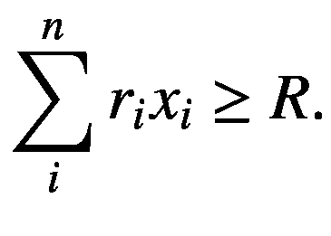

现在，在 CAP 模型中，我们假设已知每个资产的方差以及同一投资组合中资产对之间的协方差。方差是衡量投资波动性的经典指标（即方差越大，波动性越高）。因此，我们可以利用现有的个体波动性信息来尽量降低整个投资组合的波动性。由于方差是一个二次函数，目标函数也将是二次的，其各项分别取决于个股的个体方差（`c[ii]`）和股票对的协方差（`c[ij]`）。由此产生的问题可以描述如下：

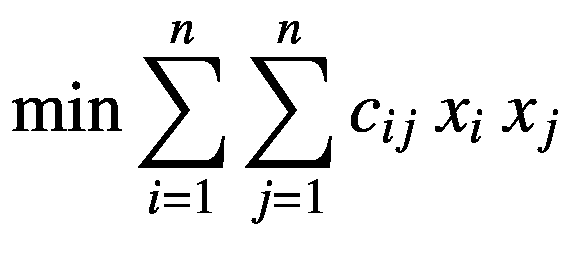


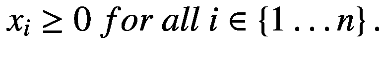

在过去的几十年里，许多人研究了这一优化问题及其变体。该公式采用了一个二次（非线性）的目标函数——也就是说，目标函数中存在涉及两个变量相乘的项。考虑这种非线性结构，该问题的一般解法形成了所谓的有效前沿：一系列针对不同投资组合组合的结果集，其中目标投资组合的波动性被降至最低。你可以在图 13-1 中看到一个有效前沿的示例，该图展示了波动性与目标回报率之间的关系图。该图是通过每次固定一个期望回报率，然后使用二次优化模型来找到相应最小波动性而生成的。如图 13-1 所示，该图表明这种关系呈现抛物线曲线的形状。

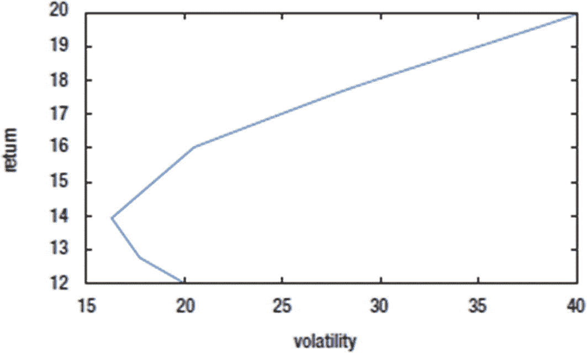

**图 13-1** 投资组合优化问题有效前沿的一小部分

尽管 CAP 的二次模型被广泛使用，但它的一个困难在于，你需要一个二次优化求解器才能得到特定投资组合的结果。虽然有多个软件包可以直接求解二次问题（例如，使用内点算法），但 GLPK 无法直接求解二次优化模型。因此，在本节中，你将处理原始问题的线性化形式，这可以使用线性规划求解器轻松计算。这种线性化方法是在 Konno 和 Yamazaki 的文章《均值绝对偏差投资组合优化模型及其在东京股票市场的应用》（*Management Science*，第 37 卷，第 519–529 页，1991 年）中提出的。该线性化方法是原始问题的一种修改形式，其目标函数中只包含线性项。虽然这仅仅是原始问题的一个近似，但在许多情况下它能很好地发挥作用（然而，当线性化约束所需计算成本过高时，它可能就不起作用了）。更重要的是，问题的线性化版本可能比二次版本求解得更快，这在某些情况下可能是一个重要的考量因素。

考虑额外的变量 `y[i]` ∈ {1...`T`}，其中 `T` 是拟投资期数。那么，一个线性模型可以描述如下：

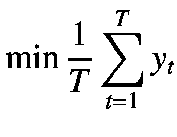

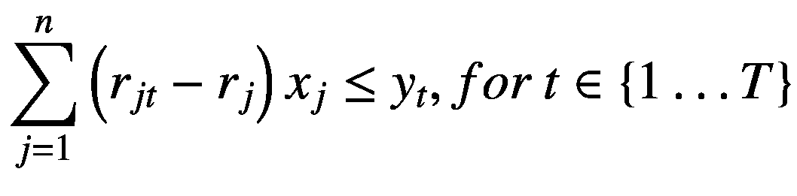

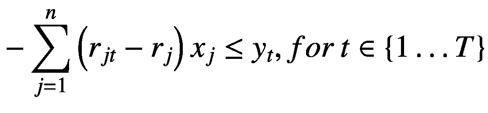

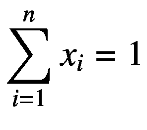


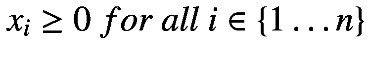

在这些方程中，你不需要直接使用协方差`c[ij]`；而是使用投资`i`在时期`t`的期望回报率`r[it]`。换句话说，该模型的思想是将总时期划分为小段，并在该小段内将模型线性化，然后取整个时间范围内的最小值。有了这个线性模型，你现在可以使用前一章中描述的`LPSolver`类来创建C++代码。这个新类被称为`ModifiedCAP`，并在下一节“代码”中展示。创建该模型的主要难点在于，需要以矩阵`A`以及向量`b`和`c`的形式为`LPSolver`定义所需的输入数据。你可以在成员函数`solveModel`的代码中看到这是如何实现的。

算法的第一部分包括设置所需的数据。定义目标函数的向量`c`可以很容易地创建，因为所有系数都等于1。

```
// 目标函数
for (int i=m_N; i<m_N+m_T; ++i)
{
c[i] = 1;
}
```

接下来，右侧系数也很容易设置。这是因为你可以将所有变量`y[t]`移到不等式的左侧。因此，除最后三个系数外，大多数系数都为零。

```
// 右侧向量
vector b(2*m_T + 2 + 1, 0);
b[2*m_T]   =  1;
b[2*m_T+1] = -1;
b[2*m_T+2] = -m_R;
```

矩阵`A`稍微复杂一些，但设置起来也不难。你需要进行的主要变换是在等式约束上。由于`LPSolver`处理的问题只有不等式约束，因此等式 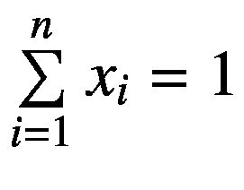 被转换为两个不等式来处理。

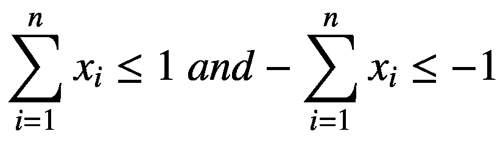

这使得可以继续使用`LPSolver`所使用的相同简单输入形式（GLPK也可以直接处理等式，你可以修改`LPSolver`类来自动实现这一点）。因此，可以使用以下代码来定义输入矩阵`A`：

```
// 矩阵 A
Matrix A(2*m_T + 2 + 1, m_T + m_N);
for (int i=0; i<m_T; ++i)
{
for (int j=0; j<m_N; ++j)
{
A[i][j] = m_retMatrix[j][i] - m_assetRet[j];
}
A[i][m_N+i] = -1;
}
for (int i=m_T; i<2*m_T; ++i)
{
for (int j=m_N; j<2*m_N; ++j)
{
A[i][j] = - m_retMatrix[j-m_N][i-m_T] + m_assetRet[j-m_N];
}
A[i][m_N+i-m_T] = -1;
}
for (int j=0; j<m_N; ++j)
{
A[2*m_T][j]   = 1;
A[2*m_T+1][j] = -1;
A[2*m_T+2][j] = - m_assetRet[j];
}
```

代码的其余部分只是处理构造`LPSolver`类并调用所需的成员函数来求解模型。

最后，我提供一个简单的示例，展示如何在实际中调用这个类。样本数据包含四个资产和五个时间段。相关的期望回报率由以下矩阵给出，你可以在测试用的`main`函数中找到：

```
// 示例问题：4 个资产和 5 个时间段
// 构建期望回报率矩阵
double val[][5] = {
{0.051, 0.050, 0.049, 0.051, 0.05},
{0.10, 0.099, 0.102, 0.100, 0.101},
{0.073, 0.077, 0.076, 0.075, 0.076},
{0.061, 0.06, 0.059, 0.061, 0.062},
};
```

### 完整代码

你可以查看修改后CAP的完整代码，见代码清单13-2。该清单包含一个头文件和一个实现文件。

```
//
//  ModifiedCAP.h
#ifndef __FinancialSamples__ModifiedCAP__
#define __FinancialSamples__ModifiedCAP__
#include "Matrix.h"
// a modified (linearized) model for Capital Asset Pricing
class ModifiedCAP {
public:
ModifiedCAP(int N, int T, double R, Matrix &retMatrix, const std::vector &ret);
ModifiedCAP(const ModifiedCAP &p);
~ModifiedCAP();
ModifiedCAP &operator=(const ModifiedCAP &p);
void solveModel(std::vector &results, double &objVal);
private:
int m_N;  // number of investment
int m_T;  // number of periods
double m_R;  // desired return
Matrix m_retMatrix;
std::vector m_assetRet; // single returns
};
#endif /* defined(__FinancialSamples__ModifiedCAP__) */
//
//  ModifiedCAP.cpp
#include "ModifiedCAP.h"
#include "LPSolver.h"
#include 
#include 
using std::vector;
using std::cout;
using std::endl;
ModifiedCAP::ModifiedCAP(int N, int T, double R, Matrix &expectedRet, const vector &ret)
: m_N(N),
m_T(T),
m_R(R),
m_retMatrix(expectedRet),
m_assetRet(ret)
{
}
ModifiedCAP::ModifiedCAP(const ModifiedCAP &p)
: m_N(p.m_N),
m_T(p.m_T),
m_R(p.m_R),
m_retMatrix(p.m_retMatrix),
m_assetRet(p.m_assetRet)
{
}
ModifiedCAP::~ModifiedCAP()
{
}
ModifiedCAP &ModifiedCAP::operator=(const ModifiedCAP &p)
{
if (this != &p)
{
m_N = p.m_N;
m_T = p.m_T;
m_R = p.m_R;
m_retMatrix = p.m_retMatrix;
m_assetRet = p.m_assetRet;
}
return *this;
}
void ModifiedCAP::solveModel(std::vector &results, double &objVal)
{
Matrix A(2*m_T + 2 + 1, m_T + m_N);
vector c(m_T + m_N, 0);
// objective function
for (int i=m_N; i b(2*m_T + 2 + 1, 0);
b[2*m_T]   =  1;
b[2*m_T+1] = -1;
b[2*m_T+2] = -m_R;
// matrix A
for (int i=0; i assetReturns = {0.05, 0.10, 0.075, 0.06};
ModifiedCAP mc(4, 5, 0.08, retMatrix, assetReturns);
vector results;
double objVal;
mc.solveModel(results, objVal);
cout << "obj value: " << objVal/5 << endl;
for (int i=0; i<results.size(); ++i)
{
cout << " x" << i << ": " << results[i];
}
cout << endl;
}
Listing 13-2
Modified CAP Implementation
```

### 运行代码

代码清单13-2中展示的`ModifiedCAP`类，可以使用任何符合标准的C++编译器进行编译。`main`类依赖于前面介绍的其他类，例如`LPSolver`和`Matrix`。该代码还依赖于GLPK库，你可以按照前一章所述免费下载。将该类构建成可执行文件`ModifiedCap`后，可以运行测试`main`函数，并看到类似于以下代码所示的结果：

观察输出结果，结果显示有九个 LP 变量。根据公式，前四个变量对应原始的 CAP 变量，而最后五个变量与时间段相关，因此在投资组合构建中不予使用。这些结果告诉投资组合经理，投资组合中只应考虑前三项资产，其百分比分别为 32%、52%和 15%。为了优化这些结果，你可以根据目标相应修改模型。例如，可以尝试不同的收益率，看看投资组合如何根据额外信息变化。

## 对修改后 CAP 的扩展

在本节中，我们将对修改后的 CAP 模型进行扩展，使得没有任何一项资产的投资比例超过投资组合的 30%。同时，增加一条规则：黄金和国库券这两类资产至少占投资组合的 15%。

### 解决方案

在“投资组合优化”部分，你了解了如何创建一个优化模型，以确定给定投资组合的最优资本配置，从而实现所需的目标收益率，同时最小化由此产生的投资组合的波动性。给定的公式是对 CAP 中原始方法的修改，该模型是一个二次优化模型。尽管如此，使用该模型的线性规划版本仍然可以快速获得结果。

虽然该模型能够涵盖投资组合构建策略的基础，但你还可以尝试其他有用的变体。例如，前面提到的 LP 模型的一个常见修改是，为每种资产类型添加最小和最大要求。例如，假设你可能希望通过强制执行每项资产持有的百分比上限来增加投资组合的分散化程度。其主要思想是避免因投资组合集中于少数资产而导致的巨额损失。这样的要求可以通过以下约束轻松添加到模型中：

`x[j] ≤ M`，对于每个`j` ∈ `{1...n}`

这里，`M`是期望的百分比限制。运行时，LP 求解器将使用此约束确保每个百分比不超过给定的`M`值。

类似地，你也可以为每项资产定义最低持有量。在这种情况下，为每项可能的投资分别设置最小值通常很有用。例如，你可能希望在任何时候，投资组合中的国库券至少占 5%。如果我们将所需的最低配置记为`K[j]`，这将导致一个如下类型的约束：

`x[j] ≥ Kj`，对于每个`j` ∈ `{1...n}`

通常，对于资产组合（如国库券和黄金）也可以进行类似的修改。这也适用于更大的资产组，例如为投资组合中所有成长型股票的总数添加最低阈值。如果你有一个股票组`L`和一个相关的限制`K[L]`，那么这个一般约束可以表示为：

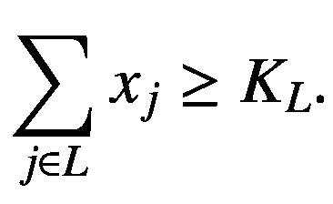

最后，你也可以利用资产组的概念来定义这些投资中持有百分比的上限。例如，如果你想限制投资组合中科技股的比例，可以将该组记为`U`，将限制记为`K[U]`，从而得到以下约束：

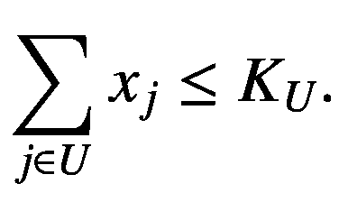

为简便起见，我提供了一个`ModifiedCAP`类的替代版本，其中包含一个备用的分散化规则（在 37%的水平）以及资产 1 和资产 2（黄金和国库券）组合至少 15%的最低要求。新代码在函数`solveExtendedModel`中实现，其定义如下：

```
void solveExtendedModel(std::vector &results, double &objVal);
```

在此编码示例中，类的其余部分保持不变。

### 完整代码

你可以在代码清单 13-3 中找到解决扩展版 CAP 模型的代码。在头文件中，我展示了完整的类声明，除了新增的函数 `solveExtendedModel` 之外，它与之前的清单类似。实现文件仅展示了新的成员函数，以及一个测试用的 `main` 函数。

```cpp
//
//  ModifiedCAP.h
#ifndef __FinancialSamples__ModifiedCAP__
#define __FinancialSamples__ModifiedCAP__
#include "Matrix.h"
// 资本资产定价的修正（线性化）模型
class ModifiedCAP {
public:
ModifiedCAP(int N, int T, double R, Matrix &retMatrix, const std::vector &ret);
ModifiedCAP(const ModifiedCAP &p);
~ModifiedCAP();
ModifiedCAP &operator=(const ModifiedCAP &p);
void solveModel(std::vector &results, double &objVal);
void solveExtendedModel(std::vector &results, double &objVal);
private:
int m_N;    // 投资数量
int m_T;    // 周期数
double m_R; // 期望回报
Matrix m_retMatrix;
std::vector m_assetRet; // 单项回报
};
#endif /* defined(__FinancialSamples__ModifiedCAP__) */
//
//  ModifiedCAP.cpp
#include "ModifiedCAP.h"
#include "LPSolver.h"
#include 
#include 
//
// … 与上一节展示的代码清单类似
//
void ModifiedCAP::solveExtendedModel(std::vector &results, double &objVal)
{
vector c(m_T + m_N, 0);
// 目标函数
for (int i=m_N; i<b vector b(2*m_T + 2 + 1 + m_N + 1 , 0);
b[2*m_T]   =  1;
b[2*m_T+1] = -1;
b[2*m_T+2] = -m_R;
for (int i=2*m_T+3; i<assetReturns vector = {0.05, 0.10, 0.075, 0.06};
ModifiedCAP mc(4, 5, 0.08, retMatrix, assetReturns);
vector results;
double objVal;
mc.solveExtendedModel(results, objVal);
cout << "目标值: " << objVal/5 << endl;
for (int i=0; i<results.size(); ++i)
{
cout << " x" << i << ": " << results[i];
}
cout << endl;
return 0;
}
```

**列表 13-3** CAP 的扩展模型

### 运行代码

编译完列表 13-3 中描述的类后，您将能够找到优化投资组合的修正结果。以下是我通过添加前述约束条件后得到的一个示例输出：

```
./extendedModifiedCAP
GLPK Simplex Optimizer, v4.54
18 rows, 9 columns, 52 non-zeros
0: obj = 0.000000000e+00 infeas = 1.230e+00 (0)
*    14: obj = 2.671440000e-03 infeas = 0.000e+00 (0)
OPTIMAL LP SOLUTION FOUND
目标值: 0.000534288
x0: 0.035 x1: 0.37 x2: 0.37 x3: 0.225 x4: 1.44e-06 x5: 0.00037 x6: 0.00085 x7: 0.00026 x8: 0.00119
程序退出，返回码: 0
```

优化器找到的解表明，四个资产类别的最优配置比例分别为 3.5%、37%、37% 和 22%。

### 结论

投资组合优化是投资组合经理常用的一种工具，旨在根据客户的目标帮助确定合适的资本配置。因此，对于金融领域的 C++ 程序员来说，能够为这类投资组合优化问题设计高效的解决方案至关重要。在本章中，您学习了几种数学规划模型，这些模型已被金融机构成功用于创建和管理投资组合，以及其他金融配置问题。在第一部分，您了解了混合整数规划（MIP）如何用于建模某些金融配置问题。您也了解了 MIP 与 LP 模型之间的一些差异，以及如何借助`MIPSolver`类来求解它们。在接下来的部分，重点转向了 CAP 模型，其主要目标是确定投资组合中每项投资所需持有的百分比，以便在实现期望结果的同时，最小化投资相关的波动性。您已经看到，尽管这是一个二次规划问题，但通过对数学公式进行线性化处理，仍有可能获得良好的结果。我们使用`AlternativeCAP`类在 C++ 中提出并实现了一种替代公式。最后，我讨论了基本模型的一些扩展，以及如何结合所需投资组合的含义来理解优化结果。这些对基本 CAP 模型的扩展很常见，有助于开发受实际资产配置约束的投资组合。

在下一章中，您将了解金融工程中的另一项关键技术：蒙特卡洛模拟方法。您将看到一些 C++ 示例，展示如何快速实现这些技术，以及如何解释这些方法得出的结果。