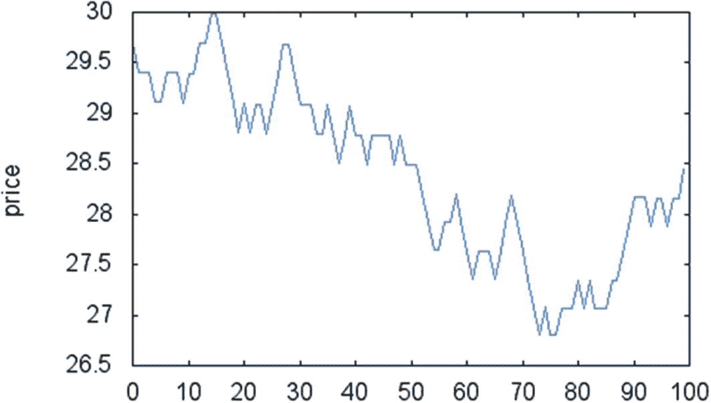
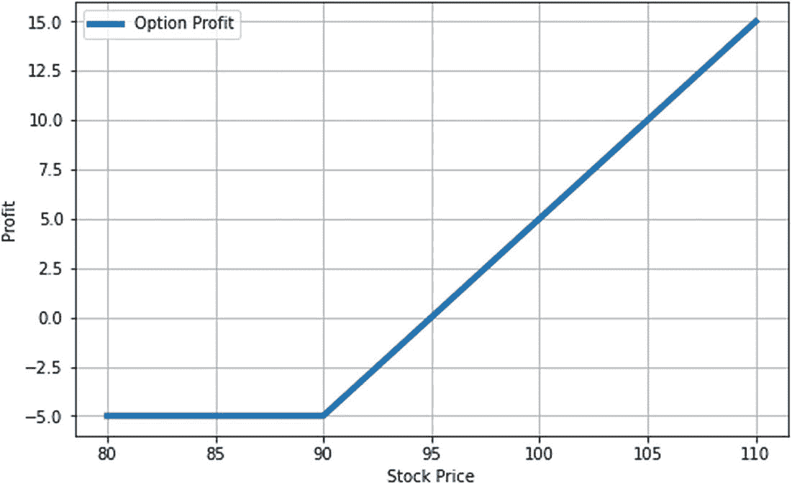
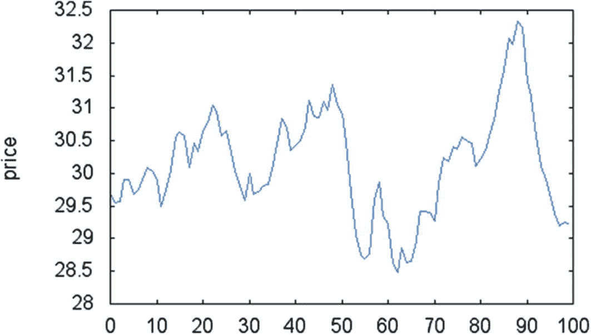

# 14. 蒙特卡洛方法

在众多针对股票市场的编程技术中，蒙特卡洛模拟因其广泛的适用性和相较于精确的非随机方法更容易实现而占据特殊地位。这些算法可用于许多应用，例如价格预测和某些购买策略的验证。

在本章中，我们提供的 C++ 代码既可直接使用，也可作为基于模拟的算法的一部分。这些示例将介绍随机方法开发中用到的一些最重要概念。以下是本章讨论主题的快速总结：

- **计算定积分：** 随机采样是一种强大的方式，可以用最少的计算量来计算复杂函数。您将看到如何使用随机技术来确定定积分。
- **价格预测：** 作为一种模拟随机价格波动的常用技术，蒙特卡洛方法经常被用作价格预测的方法。重复模拟过程的能力是该方法的一个关键特征。
- **计算期权价格：** 在其他期权定价预测方法中，蒙特卡洛技术因其简便性而被广泛使用。与其他数学方法不同，模拟可以快速编写代码，并且在期权价格预测方面，其性能通常与精确技术相当。

## 基于蒙特卡洛的积分计算

创建一个类，使用蒙特卡洛策略来估算一个通用函数的积分。


### 解决方案

蒙特卡洛方法的核心思想是利用随机过程来求解复杂问题。虽然单个随机结果对当前问题可能没有用处，但它具备一个重要特性：可以重复执行并得到不同结果。通过观察大量蒙特卡洛结果的模式，就能揭示这类技术的奥秘。

**一个经典案例**：用随机采样确定曲线包围的面积。例如，要计算圆的面积，可以随机生成多个点并判断它们是否位于圆内，最终通过圆内点所占比例确定面积。随着采样点数量的增加，所求面积的近似值会越来越精确。

上述方法的延伸构成了蒙特卡洛积分策略的基础。使用这种蒙特卡洛方法进行函数积分的优势在于，只需在给定范围内生成随机点即可。这种策略的简洁性使得仅用少量代码就能估算非常复杂函数的积分值。

你可以在 `MonteCarloIntegration` 类中看到该方法的实现。类的结构与第 10 章（积分相关章节）的示例类似，但算法通过生成随机样本来确定给定函数下方的面积百分比。

为了生成均匀分布的随机数，我们使用 `boost::random` 库中的 `uniform_real_distribution` 类。这简化了样本生成过程，避免了使用其他随机数源时常见的数值精度问题。

实现的核心部分可参见 `getIntegral` 成员函数：

```
double MonteCarloIntegration::getIntegral(double a, double b)
```

代码首先确定观测到的最大值和最小值，并以此定义总的采样区域面积。接着，函数生成随机点并判断它们位于函数曲线内部还是外部。最后，用此过程计算出的百分比来估算积分总面积。该过程通过 `integrateRegion` 成员函数对给定数学函数的正负部分分别执行，最终积分值等于正面积减去负面积。

### 完整代码

清单 14-1 展示了用蒙特卡洛方法进行函数积分的完整代码。代码分为头文件和实现文件，并包含一个示例 `main` 函数演示 `MonteCarloIntegration` 类的使用方法。

```
//
// MonteCarloIntegration.h
#ifndef __FinancialSamples__MONTECARLOINTEGRATION_H_
#define __FinancialSamples__MONTECARLOINTEGRATION_H_
template 
class MathFunction;
class MonteCarloIntegration {
public:
MonteCarloIntegration(MathFunction &f);
MonteCarloIntegration(MathFunction &f, int num_samples);
MonteCarloIntegration(const MonteCarloIntegration &p);
~MonteCarloIntegration();
MonteCarloIntegration &operator=(const MonteCarloIntegration &p);
void setNumSamples(int n);
double getIntegral(double a, double b);
double integrateRegion(double a, double b, double min, double max);
private:
MathFunction &m_f;
int m_numSamples;
};
#endif /* MONTECARLOINTEGRATION_H_ */
//
// MonteCarloIntegration.cpp
#include "MonteCarloIntegration.h"
#include 
#include 
#include 
#include "MathFunction.h"
#include 
static std::default_random_engine random_generator;
using std::cout;
using std::endl;
namespace {
const int DEFAULT_NUM_SAMPLES = 1000;
}
MonteCarloIntegration::MonteCarloIntegration(MathFunction& f)
: m_f(f),
m_numSamples(DEFAULT_NUM_SAMPLES)
{
}
MonteCarloIntegration::MonteCarloIntegration(MathFunction& f, int num_samples)
: m_f(f),
m_numSamples(num_samples)
{
}
MonteCarloIntegration::MonteCarloIntegration(const MonteCarloIntegration& p)
: m_f(p.m_f),
m_numSamples(p.m_numSamples)
{
}
MonteCarloIntegration::~MonteCarloIntegration()
{
}
MonteCarloIntegration& MonteCarloIntegration::operator =(const MonteCarloIntegration& p)
{
if (this != &p)
{
m_f = p.m_f;
m_numSamples = p.m_numSamples;
}
return *this;
}
void MonteCarloIntegration::setNumSamples(int n)
{
m_numSamples = n;
}
double MonteCarloIntegration::integrateRegion(double a, double b, double min, double max)
{
std::uniform_real_distribution xDistrib(a, b);
std::uniform_real_distribution yDistrib(min, max);
int pointsIn = 0;
int pointsOut = 0;
bool positive = max > 0;
for (int i = 0; i  0)
{
percentageArea = pointsIn / double(pointsIn + pointsOut);
}
if (percentageArea > 0)
{
return (b-a) * (max-min) * percentageArea;
}
return 0;
}
double MonteCarloIntegration::getIntegral(double a, double b)
{
std::uniform_real_distribution distrib(a, b);
double max = 0;
double min = 0;
for (int i = 0; i  max)
{
max = y;
}
if (y  0 ? integrateRegion(a, b, 0, max) : 0;
double negativeIntg = min 
{
public:
~FSin();
double operator()(double x);
};
FSin::~FSin()
{
}
double FSin::operator()(double x)
{
return sin(x);
}
}
int main()
{
cout << "starting" << endl;
FSin f;
MonteCarloIntegration mci(f);
double integral = mci.getIntegral(0.5, 4.9);
cout << " the integral of the function is " << integral << endl;
mci.setNumSamples(200000);
integral = mci.getIntegral(0.5, 4.9);
cout << " the integral of the function with 20000 intervals is " << integral << endl;
return 0;
}
```

**清单 14-1** 蒙特卡洛积分方法

### 运行代码

你可以使用 `gcc` 或其他符合标准的 C++ 编译器编译清单 14-1 中的文件。假设可执行文件名为 `monteCarloIntegration`，`main` 函数示例代码的运行结果如下：

```
$ ./monteCarloIntegration
the integral of the function is 1.74
the integral of the function with 20000 intervals is 1.6702
```

请注意，结果可能因实现所使用的随机源不同而变化。然而，随着蒙特卡洛方法采样数量的增加，这些值应趋近于正确值。

## 模拟资产价格

创建一个 C++ 类，通过随机游走模拟过程来模拟股票市场中股票价格的波动。


### 解决方案

如果在投资领域有一个难以找到封闭解的领域，那就是金融预测。尽管存在一些知名的经济模型，但诸如股票市场之类的任何复杂系统都容易受到剧烈波动的影响，这些波动由众多因素引起，包括战争、自然灾害以及重要参与者的个人选择等。由于估算这些迥异事件的难度很大，大部分市场预测模型都假设某种形式的随机过程是价格波动的根源。在这种情况下，蒙特卡洛方法在模拟未来市场状况时被证明非常有用。

在本节中，我将展示一个非常简单的蒙特卡洛模型，可用于预测目的。开始介绍时，我首先使用一组非常简单的模拟规则来演示此方法的第一个版本。然后，在下一个 C++ 编码示例中，你将看到同一原理的、使用高斯分布的更复杂版本。

价格预测中使用的基本策略是通过“随机游走”模拟价格变动。随机游走过程是一种随机技术，其中系统的下一个状态仅由它的前一个状态（已知价格）和下一个可能移动的概率分布来定义。在本节介绍的 C++ 类示例中，存在三个下一个状态，每个状态具有相同的概率。因此，在每个时刻，价格可以上涨、下跌或保持不变。

为了简化本节中给出的随机游走示例，我们假设标的资产的价格根据均匀分布移动。换句话说，价格变动以这样一种方式生成，即平均跳跃幅度作为一个参数接收。此外，价格的上涨或下跌是使用均匀分布的随机变量来定义的，其取值由已知的平均值决定。

创建此模拟所需的代码封装在 `RandomWalk` 类中。该类需要存储有关该过程参数的信息：这些参数包括蒙特卡洛模拟中的步数（样本数）、初始资产价格以及过程中使用的平均步长。

使用这些参数，`getWalk` 成员函数运行模拟并返回使用此策略生成的价格向量。图 14-1 显示了此随机过程的一个示例结果。一旦你存储了由 `getWalk` 生成的价格，你的代码就可以根据需要执行额外的处理。这在测试新交易策略以及确定其盈利能力时可能派上用场，这是很常见的例子。



**图 14-1** `RandomWalk` 类生成的随机游走结果

`RandomWalk` 类中使用的随机游走算法可以根据模拟的需求以多种方式进行微调。

- 例如，你可能希望标的工具的价格更频繁地变动。这可以通过移除第三个分支规则（该规则允许价格保持在相同水平）来实现，从而强制价格只向上或向下移动。
- 随机游走的另一种变体是赋予上涨和高价不同的概率——通过这种方式，可以模拟“牛市”或“熊市”。
- 为了与之前类似的目的，可以改变价格跳变（向上或向下）的幅度，使得向上移动的幅度可能大于向下移动的幅度。这是模拟具有方向性的市场的另一种方式，在该市场中，价格上涨快于往常。

### 完整代码

清单 14-2 包含了 `RandomWalk` 类的完整代码。你可以在一个头文件和一个 cpp 文件中找到其实现，随后是一个示例 `main` 函数。

```
//
// RandonWalk.h
#ifndef __FinancialSamples__RandonWalk__
#define __FinancialSamples__RandonWalk__
#include 
// 用于价格模拟的简单随机游走
class RandomWalk {
public:
RandomWalk(int size, double start, double step);
RandomWalk(const RandomWalk &p);
~RandomWalk();
RandomWalk &operator=(const RandomWalk &p);
std::vector getWalk();
private:
int m_size;     // 步数
double m_step;  // 每一步的幅度（百分比）
double m_start; // 起始价格
};
#endif /* defined(__FinancialSamples__RandonWalk__) */
//
//  RandonWalk.cpp
#include "RandonWalk.h"
#include 
using std::vector;
using std::cout;
using std::endl;
RandomWalk::RandomWalk(int size, double start, double step)
: m_size(size),
m_step(step),
m_start(start)
{
}
RandomWalk::RandomWalk(const RandomWalk &p)
: m_size(p.m_size),
m_step(p.m_step),
m_start(p.m_start)
{
}
RandomWalk::~RandomWalk()
{
}
RandomWalk &RandomWalk::operator=(const RandomWalk &p)
{
if (this != &p)
{
m_size = p.m_size;
m_step = p.m_step;
m_start = p.m_start;
}
return *this;
}
std::vector RandomWalk::getWalk()
{
vector walk;
double prev = m_start;
for (int i=0; i walk = rw.getWalk();
for (int i=0; i<walk.size(); ++i)
{
cout << ", " << i << ", " << walk[i];
}
cout << endl;
return 0;
}
```

**清单 14-2** `RandomWalk` 类的实现

### 运行代码

要运行清单 14-2 中提供的代码，首先需要使用符合标准的编译器（如 `gcc` 或 Visual Studio）进行编译。以下是使用给定参数：初始价格 30 美元，步长 1%，以及 100 步，生成的随机游走的前几行输出。

```
./randomWalk
, 0, 29.7, 1, 29.403, 2, 29.403, 3, 29.403, 4, 29.109, 5, 29.109, 6, 29.4001, 7, 29.4001, 8, 29.4001, 9, 29.1061, 10, 29.3971, 11, 29.3971, 12, 29.6911, 13, 29.6911, 14, 29.988, 15, 29.988, 16, 29.6881, 17, 29.3912, 18, 29.0973, 19, 28.8064, 20, 29.0944, 21, 28.8035, 22, 29.0915, 23, 29.0915, 24, 28.8006, 25, 29.0886, 26, 29.3795, 27, 29.6733, 28, 29.6733, 29, 29.3765, 30, 29.0828, 31, 29.0828, 32, 29.0828, 33, 28.792, 34, 28.792, 35, 29.0799, 36, 28.7891, 37, 28.5012, 38, 28.7862, 39, 29.0741, 40, 28.7833, 41, 28.7833, 42, 28.4955, 43, 28.7804, 44, 28.7804, 45, 28.7804, 46, 28.7804, 47, 28.4926, 48, 28.7776, 49, 28.4898, 50, 28.4898, 51, 28.4898, 52, 28.2049, 53, 27.9228, 54, 27.6436, 55, 27.6436, 56, 27.92, 57, 27.92, 58, 28.1992, 59, 27.9173,
```

图 14-1 显示了示例代码某次执行生成的随机游走的图表。请注意价格如何从 30 美元附近开始，并表现出类似于股票市场中观察到的实际变动的行为。

## 计算期权概率

在本节中，我们将实现一个 C++ 解决方案，用于计算欧式期权事件的概率，例如到期时价格高于行权价、低于行权价，或介于两个给定价格之间。

### 解决方案

期权是一种非常流行的股权衍生品，可以在大多数散户投资账户中购买。通过期权，你支付一笔费用，以换取在有限时间内以特定价格买入或卖出股票的权利，因此得名“期权”，因为你拥有执行交易的选择权，而非义务。

看涨期权赋予以特定价格买入的权利，而看跌期权赋予以特定价格卖出的权利。行权价格称为执行价。根据当前股票价格与执行价之间的关系，期权可以分为以下三类之一：

- **价内期权：** 对于看涨期权，执行价低于当前股价。对于看跌期权，执行价应高于当前股价。


### 期权定价与概率分析

### 价内、价平与价外期权

- **价外期权（Out of the Money，OTM）**：对于看涨期权，行权价高于当前股票价格。对于看跌期权，行权价低于当前股票价格。
- **价平期权（At the Money，ATM）**：行权价接近标的股票的当前价格。

行权价与股票价格之间的这些不同关系，决定了期权获利的不同概率，我们将在本节剩余部分看到这一点。为了获利，看涨期权需要股票价格上涨超过行权价。当这种情况发生时，头寸的价格由行权价与股票价格之间的差额加上期权可能仍具有的任何时间价值决定。对于看跌期权，这种情况是相反的，当股票价格相对于行权价下跌时，期权变得有利可图。

期权的另一个概念是行权方式（即买入或卖出标的股票）。欧式期权只允许在其目标期结束时行权。而美式期权则允许在任何时刻行权。在本节中，我只考虑欧式期权，因为分析只考虑期权到期时的股票价格。不过，将所解释的技术扩展到处理美式期权并不困难。

图 14-2 展示了一份期权合约的利润曲线。数据假定合约成本为`$5`，行权价为`$90`。在这种情况下，对于任何低于`$90`的标的股票最终价格，期权价格的完全损失得以实现。另一方面，损失是有上限的，投资者不会遭受除合约价格之外的任何损失。当标的资产价格达到`$90`的行权价时，头寸的损失开始减少，在`$95`时达到盈亏平衡点。从该点起，任何额外的价格上涨都代表期权头寸的额外利润，并且收益在上行方向是无限的。



*图 14-2 看涨期权合约的获利潜力*

### 确定获利概率

在本节中，您将学习如何使用蒙特卡洛技术来确定股票期权的获利概率。如前所述，要找到看涨期权的利润，只需计算标的资产在到期时的价格，并检查最终价格是否高于行权价。对于看跌期权，过程相同，但需要检查最终价格是否低于行权价。

为此问题创建蒙特卡洛模拟的第一步是定义随机过程的参数。期权的定价由所谓的布莱克-舒尔斯模型（Black-Scholes model）定义，其中价格被假定为正态分布。出于这个原因，您将使用具有高斯分布的价格变化随机游走。在此随机过程的每一步，只有两种可能性：价格上涨或下跌，概率各为 50%。价格变化随后由正态分布决定，其方差作为输入参数给出。图 14-3 展示了一个高斯随机游走的示例。请注意，与股票的实际数据相比，这看起来与实际价格波动有多么相似。



*图 14-3 使用高斯随机游走生成的价格变动示例*

一旦生成了随机游走，就可以开始使用数据进行预测和相关的价格分析。在这种情况下，您希望估计某些事件的概率，例如最终价格高于某一价格水平。要回答这些问题，只需使用标准的蒙特卡洛程序：重复随机游走并存储结果。在多次执行此过程后，可以分析最终价格高于某个目标的结分布。

例如，假设您想回答以下问题：价格最终高于行权价的概率是多少？为此，对大量测试执行随机游走，并计算在这些测试中价格最终高于行权价的百分比。同样的方法可用于收集相关信息，例如价格最终低于行权价的概率，或者价格最终介于两个给定价格之间的概率。

该实现由`OptionsProbabilities`类提供。重要的成员函数如下：

```cpp
double probFinishAboveStrike();
double probFinishBelowStrike();
double probFinalPriceBetweenPrices(double lowPrice, double highPrice);
std::vector getWalk();
```

前三个成员函数计算所需的概率。最后一个成员函数`getWalk`返回一个向量，该向量存储一个样本随机游走以供进一步分析。`OptionsProbabilities`类内部使用`getLastPriceOfWalk`成员函数，该函数返回在高斯游走中观察到的最后一个价格。该价格作为输入存储，用于概率计算。

最后，使用高斯分布计算价格变化。根据此分布生成的随机值使用`gaussianValue`成员函数：

```cpp
double OptionsProbabilities::gaussianValue(double mean, double sigma)
{
std::normal_distribution distrib(mean, sigma);
return distrib(random_generator);
}
```

要了解这些函数如何协同工作，请考虑`probFinishAboveStrike`的实现：

```cpp
double OptionsProbabilities::probFinishAboveStrike()
{
int nAbove = 0;
for (int i=0; i < m_numIterations; i++)
{
  double walk = getWalk();
  double lastPrice = getLastPriceOfWalk(walk);
  if (lastPrice >= m_strike)
  {
    nAbove++;
  }
}
return nAbove/(double)m_numIterations;
}
```

该算法重复由成员变量`m_numIterations`定义的次数。在每次迭代中，您请求一个新的高斯随机游走并存储最后一个观察值。如果该值满足所需属性（在这种情况下高于行权价），则将其计为事件的一次发生。最后，成员函数返回由有利案例百分比定义的经验概率。

### 完整代码

清单 14-3 展示了评估期权概率的随机游走方法。清单末尾给出了一个示例`main`函数，展示了如何调用`OptionsProbabilities`类。


### 头文件与实现文件

```cpp
//
// OptionsProbabilities.h
#ifndef __FinancialSamples__OptionsProbabilities__
#define __FinancialSamples__OptionsProbabilities__
#include 
class OptionsProbabilities {
public:
    OptionsProbabilities(double initialPrice, double strike, double avgStep, int nDays);
    OptionsProbabilities(const OptionsProbabilities &p);
    ~OptionsProbabilities();
    OptionsProbabilities &operator=(const OptionsProbabilities &p);
    void setNumIterations(int n);
    double probFinishAboveStrike();
    double probFinishBelowStrike();
    double probFinalPriceBetweenPrices(double lowPrice, double highPrice);
    std::vector getWalk();
private:
    double m_initialPrice;
    double m_strike;
    double m_avgStep;
    int m_numDays;
    int m_numIterations;
    double gaussianValue(double mean, double sigma);
    double getLastPriceOfWalk();
};
#endif /* defined(__FinancialSamples__OptionsProbabilities__) */
```

```cpp
//
// OptionsProbabilities.cpp
#include "OptionsProbabilities.h"
#include 
#include 
using std::vector;
using std::cout;
using std::endl;

static std::default_random_engine random_generator;

namespace {
    const int NUM_ITERATIONS = 1000;
}

OptionsProbabilities::OptionsProbabilities(double initialPrice,
    double strike, double avgStep, int nDays)
    : m_initialPrice(initialPrice),
      m_strike(strike),
      m_avgStep(avgStep),
      m_numDays(nDays),
      m_numIterations(NUM_ITERATIONS) {
}

OptionsProbabilities::OptionsProbabilities(const OptionsProbabilities &p)
    : m_initialPrice(p.m_initialPrice),
      m_strike(p.m_strike),
      m_avgStep(p.m_avgStep),
      m_numDays(p.m_numDays),
      m_numIterations(p.m_numIterations) {
}

OptionsProbabilities::~OptionsProbabilities() {
}

OptionsProbabilities &OptionsProbabilities::operator=(const OptionsProbabilities &p) {
    if (this != &p) {
        m_initialPrice = p.m_initialPrice;
        m_strike = p.m_strike;
        m_avgStep = p.m_avgStep;
        m_numDays = p.m_numDays;
        m_numIterations = p.m_numIterations;
    }
    return *this;
}

void OptionsProbabilities::setNumIterations(int n) {
    m_numIterations = n;
}

double OptionsProbabilities::probFinishAboveStrike() {
    int nAbove = 0;
    for (int i=0; i < m_numIterations; ++i) {
        double lastPrice = getLastPriceOfWalk();
        if (lastPrice >= m_strike) {
            nAbove++;
        }
    }
    return nAbove / (double)m_numIterations;
}

double OptionsProbabilities::probFinishBelowStrike() {
    int nBelow = 0;
    for (int i=0; i < m_numIterations; ++i) {
        double lastPrice = getLastPriceOfWalk();
        if (lastPrice < m_strike) {
            nBelow++;
        }
    }
    return nBelow / (double)m_numIterations;
}

double OptionsProbabilities::probFinalPriceBetweenPrices(double lowPrice, double highPrice) {
    int nBetween = 0;
    for (int i=0; i < m_numIterations; ++i) {
        double lastPrice = getLastPriceOfWalk();
        if (lastPrice >= lowPrice && lastPrice <= highPrice) {
            nBetween++;
        }
    }
    return nBetween / (double)m_numIterations;
}

double OptionsProbabilities::gaussianValue(double mean, double sigma) {
    std::normal_distribution<double> distrib(mean, sigma);
    return distrib(random_generator);
}

double OptionsProbabilities::getLastPriceOfWalk() {
    double prev = m_initialPrice;
    for (int i=0; i < m_numDays; ++i) {
        double stepSize = gaussianValue(0, m_avgStep);
        int r = rand() % 2;
        double val = prev;
        if (r == 0) val += (stepSize * val);
        else val -= (stepSize * val);
        prev = val;
    }
    return prev;
}

std::vector<double> OptionsProbabilities::getWalk() {
    vector<double> walk;
    double prev = m_initialPrice;
    for (int i=0; i < m_numDays; ++i) {
        double stepSize = gaussianValue(0, m_avgStep);
        int r = rand() % 2;
        double val = prev;
        if (r == 0) val += (stepSize * val);
        else val -= (stepSize * val);
        walk.push_back(val);
        prev = val;
    }
    return walk;
}

int main() {
    OptionsProbabilities optP(30, 35, 0.01, 100);
    cout << " above strike prob: " << optP.probFinishAboveStrike() << endl;
    cout << " below strike prob: " << optP.probFinishBelowStrike() << endl;
    cout << " between 28 and 32 prob: " << optP.probFinalPriceBetweenPrices(28, 32) << endl;
    return 0;
}
```

**清单 14-3. `OptionsProbabilities` 类**

### 运行代码

要运行清单 14-3 中的代码，你可以使用任何符合标准的 C++ 编译器，如 `gcc`、`llvm` 或 `Visual C++`。编译代码并生成可执行文件后，可以按如下方式运行应用程序（具体数字可能根据使用的随机数而有所不同）：

```
above strike prob: 0.055
below strike prob: 0.946
between 28 and 32 prob: 0.512
```

如你所见，该应用程序能够以良好的精度确定价格高于或低于行权价的概率。前两个数值之和接近 100% 的事实证实了这一点。通过增加模拟随机游走的次数，仍然可以进一步改进近似结果。

### 结论

蒙特卡洛方法是一种通用的解决问题方法，它利用随机化来计算那些原本很难精确求解的结果。由于金融市场固有的随机性，蒙特卡洛方法成为金融工程师和软件开发人员手中的重要工具。

在本章中，你已经看到，这种模拟技术可以用于快速求解金融领域中的各种问题。例如，使用蒙特卡洛模拟的一种常见方式是预测由价格变化决定的可能经济情景。虽然这对传统的数学方法来说是一项艰巨的任务，但人们可以轻松设计出诸如随机游走之类的高效算法。这类算法仅利用基于历史行为的少数输入参数，就能提供预测价格的能力。

在第一个编码示例（清单 14-1）中，我们使用蒙特卡洛技术计算了一个一般函数的定积分。尽管存在确定性数值算法可以高效地解决此问题，但该示例展示了蒙特卡洛方法的基本特征，以及如何解释和改进其结果。

在清单 14-2 中，你了解了如何创建一个非常简单的随机游走，这是使用蒙特卡洛方法进行价格模拟的基本工具之一。你看到了如何实现一种价格变化均匀分布的随机游走版本。你还了解了一些标准方法的常见变体，这些变体在应用中经常被使用。

接下来，你学习了如何使用蒙特卡洛方法计算期权的盈利概率。清单 14-3 中的 C++ 类展示了一种易于实现的方案，可用于分析期权及其可能的盈利情景。你已经看到，利用模拟和对价格变化的一些假设，可以轻松确定某只股票在若干天内处于特定价格区间的概率。

本章完成了对金融软件中使用的主要数学工具的讨论。在下一章中，你将开始探索可用于支持创建和维护此类金融应用程序的额外编程技术。你将看到许多示例，展示如何将现有的 C++ 代码与其他流行的脚本语言（例如 Python 和 Lua）集成。

