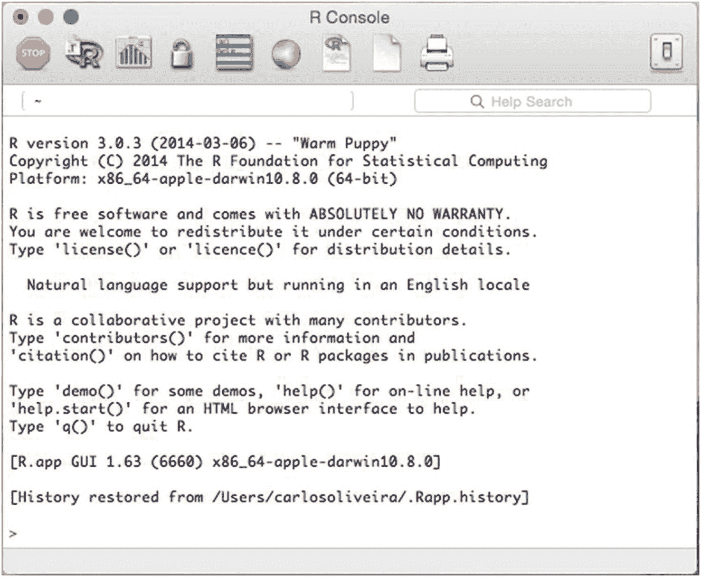
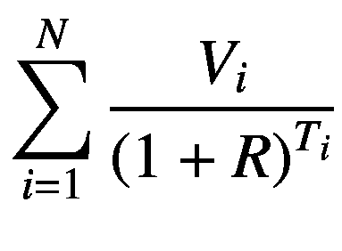
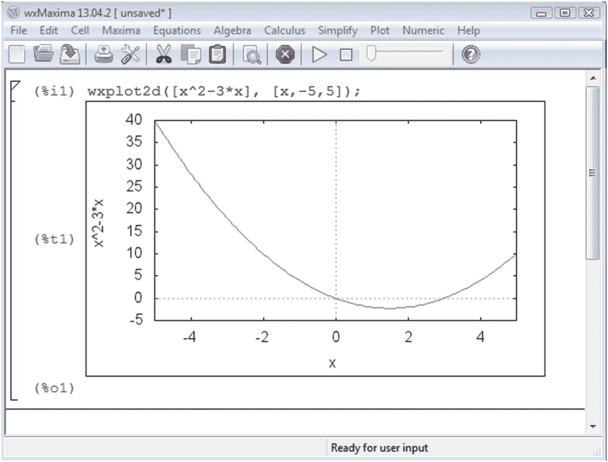

# 16. 将 C++ 与 R 和 Maxima 结合使用

用 C++ 实现的代码的一个优势在于，它既可以作为原生库或独立应用程序的一部分，也可以作为其他开发和建模环境的组件进行集成。例如，在金融行业，通常会用 C++ 实现底层模块，而高级分析则在更面向用户的环境（如 Excel、Mathematica、Matlab、Maxima、R 和 Octave）中进行。

当使用高级数据分析环境时，至关重要的一点是，数值结果必须与原生代码得出的结果一致，并且能够访问那些已经用 C++ 编码的底层库。因此，对于金融行业的程序员来说，一项重要的技能是能够将现有代码与分析师和数学家使用的一个或多个分析应用程序进行集成。

在本章中，我们将向你展示如何将用 C++ 开发的金融库集成到两个用于金融分析的知名仿真与建模环境中：R 和 Maxima。这些应用程序是开源的，并且可以在多个平台上免费获取。然而，你在本章中看到的示例所演示的原理，也同样适用于统计学、仿真、工程和数学领域的其他商业工具。

以下是你在本章中将学到的一些主题：

*   **将 C++ 与 R 集成**：R 语言的用户已经创建了一个丰富的统计库和应用程序生态系统。然而，有时需要将 C++ 代码作为 R 分析的一部分进行集成。在本章中，你将看到如何轻松地将 C++ 类嵌入到这个系统中，这既可以提高性能，也可以保持与其它用 C++ 部署的应用程序的一致性。

*   **将 C++ 与 Maxima 集成**：Maxima 计算机代数系统用于使用简单的高级语言开发精确的数学模型。它也被用于其可视化功能。你可以使用该语言支持的共享库机制轻松地将现有的 C++ 库集成到 Maxima 中。

## 将 C++ 与 R 集成

创建一个 C++ 类，用于计算一组付款的现值，并且可以从 R 解释器中调用。

### 解决方案

R 是一个为对大数据集执行统计分析而创建的编程环境。由于其易用性和先进的统计能力，R 已成为最常用的数据分析环境，并且在数据挖掘等某些领域已成为事实上的标准。越来越多的统计学家和工程师每天使用 R 来研究大数据集的属性。

R 可用于最常见的操作系统和计算机架构。你可以从官方网站 [`www.r-project.org`](http://www.r-project.org) 免费下载。在根据你的操作系统运行所需的安装方法后，你将能够启动该语言的迭代解释器。标准的 R 环境能够运行 R 脚本和单个命令。你可以使用这些工具来执行快速数据分析并基于现有数据创建图表。你可以在图 16-1 中看到 R 控制台主应用程序窗口的外观。



**图 16-1** Mac OS X 上的 R 控制台窗口

R 通常用于执行大量的数学算法和数据分析任务。例如，R 的一个常见用途是运行标准统计程序，如均方误差和其他类型的统计回归。R 也被用来实现针对金融数据集定制的统计测试。因此，能够将 C++ 代码加载到 R 控制台提供的动态环境中是非常有用的。

为了能够在 R 中使用 C++ 类，你需要使用 R 扩展应用程序编程接口（API）。扩展 API 由一组与 R 运行时交互的基于 C 的函数组成。例如，你可以使用 API 从 R 中检索和转换值。同样，你可以使用 API 执行常见任务，如调用数学函数和随机数生成器等。

要创建访问 R 扩展库的 C++ 函数和类，你需要包含头文件 `R.h`。该头文件是主要的 C 文件，用于协调对 R 运行时导出的许多 API 声明的访问。

例如，假设你需要一种快速的方法来确定一组未来付款的现值。你可以通过创建自己的 C++ 解决方案并使用 R 扩展机制将该解决方案导出到 R 来实现。要理解现值计算的一般概念，你可以参考第 1 章，我在那里讨论了固定收益分析的工具。

主要功能被编码在 `RExtension` 类中。该类中的两个主要方法是 `addCashPayment`，用于添加一个新的现金流，该现金流稍后将被算法考虑；以及 `presentValue`，用于计算到目前为止所有已添加现金付款的现值。现值的计算使用以下公式：




在这个等式中，`V[i]` 是第 i 笔现金流的价值，`T[i]` 是第 i 笔现金流的时间，`R` 是利率。

R 解释器的真正入口点是 `presentValue` 函数，其声明方式如下：

```c
extern "C" {
void presentValue(int *, double *, int *, double *, double *);
}
```

在此声明中使用 `extern "C"` 语句是为了避免 C++ 编译器通常执行的函数名修饰。只有函数名会受到影响，而函数内容可以使用大多数 C++ 特性。通过这种方式声明函数，`presentValue` 这个名称在库中将保持不变，从而 R 解释器可以查看并访问它。

`presentValue` 函数的定义并不特殊。与普通 C++ 代码的唯一区别在于，所有参数都是以指针形式传递的。这是 R 运行时系统允许解释器和 C++ 代码之间共享数据的方式。必要时，被调用的函数可以通过指针读取和修改传入的参数。该函数的实现使用了参数中传递的信息，包括现金流向量的元素个数、利率、一个包含时间指示的向量，以及一个包含现金流的向量。最后一个参数是指向结果值的指针。

### 完整代码

清单 16-1 展示了 `RExtension` 类的实现。主要部分是该类的定义——包含计算一组现金流现值的功能——以及 `presentValue` 函数，该函数可以直接从 R 运行时中访问。

```cpp
//
// RExtension.h
#ifndef __FinancialSamples__RExtension__
#define __FinancialSamples__RExtension__
#include 
class RExtension {
public:
RExtension(double rate);
RExtension(const RExtension &p);
~RExtension();
RExtension &operator=(const RExtension &p);
void addCashPayment(double value, int timePeriod);
double presentValue();
private:
std::vector m_cashPayments;
std::vector m_timePeriods;
double m_rate;
double presentValue(double futureValue, int timePeriod);
};
#endif /* defined(__FinancialSamples__RExtension__) */
//
// RExtension.cpp
#include "RExtension.h"
#include 
#include 
using std::cout;
using std::endl;
extern "C" {
void presentValue(int *, double *, int *, double *, double *);
}
void presentValue(int *numPayments, double *intRate,
int *timePeriods, double *payments, double *result)
{
int n = *numPayments;
RExtension re(*intRate);
for (int i=0; i<m_cashPayments = v.m_cashPayments;
this->m_timePeriods = v.m_timePeriods;
this->m_rate = v.m_rate;
}
return *this;
}
void RExtension::addCashPayment(double value, int timePeriod)
{
m_cashPayments.push_back(value);
m_timePeriods.push_back(timePeriod);
}
double RExtension::presentValue(double futureValue, int timePeriod)
{
double pValue = futureValue / pow(1+m_rate, timePeriod);
cout << " value " << pValue << endl;
return pValue;
}
double RExtension::presentValue()
{
double total = 0;
for (unsigned i=0; i<m_cashPayments.size(); ++i)
{
total += presentValue(m_cashPayments[i], m_timePeriods[i]);
}
return total;
}
清单 16-1
R 扩展库的代码
```

### 运行代码

上一节中给出的代码可以使用任何符合标准的 C++ 编译器来构建。然而，R 解释器通过使用 `R` 命令的 `CMD` 选项，使得创建扩展库变得非常容易。这种构建技术允许你快速创建一个包含所有必要 C++ 代码的共享对象文件，从而可以方便地导入到 R 运行时环境中。使用 R 解释器的 `CMD` 选项，你也不必担心正确的编译器、头文件的正确位置以及链接库等其他常见的编译参数。

以下是我如何从给定的源文件生成二进制对象（这是在 Mac OS X 系统上运行的，但其他平台的结果应该类似）。编译命令是由 R 使用 `SHLIB` 选项自动生成的，因此你无需担心库文件的位置。

```bash
$ R CMD SHLIB code/FinancialSamples/FinancialSamples/RExtension.cpp
g++ -arch x86_64 -I/Library/Frameworks/R.framework/Resources/include -DNDEBUG
-I/usr/local/include    -fPIC  -mtune=core2 -g -O2  -c
code/FinancialSamples/FinancialSamples/RExtension.cpp -o
code/FinancialSamples/FinancialSamples/RExtension.o
g++ -arch x86_64 -dynamiclib -Wl,-headerpad_max_install_names -undefined dynamic_lookup -single_module -multiply_defined suppress -L/usr/local/lib -L/usr/local/lib -o
code/FinancialSamples/FinancialSamples/RExtension.so
code/FinancialSamples/FinancialSamples/RExtension.o -F/Library/Frameworks/R.framework/.. -framework R -Wl,-framework -Wl,CoreFoundation
```

一旦共享对象被创建（在 UNIX 上是扩展名为 `.so` 的文件，在 Windows 上是扩展名为 `.dll` 的文件），你就可以使用 `dyn.load` 函数将其加载到 R 解释器中，该函数的唯一参数就是文件名。之后，你只需使用 `.C` 函数来调用编译好的 C 或 C++ 函数。为了使其正常工作，你需要将函数名称作为第一个参数提供，后面接着函数的参数。不过，你需要确保传递给函数的值带有正确的参数类型标记（使用诸如 `as.integer` 和 `as.double` 之类的函数）。执行 `.C` 函数后，结果值会显示在解释器窗口中。以下是一个示例会话，其中我导入并使用了 `RExtension` 模块。

```r
$ R
> dyn.load("RExtension.so")
> .C("presentValue", n=as.integer(4), r=as.double(0.05), t=as.integer(c(1,2,3,4)), p=as.double(c(3,4,5,6)), res=as.double(0))
value 2.85714
value 3.62812
value 4.31919
value 4.93621
$n
[1] 4
$r
[1] 0.05
$t
[1] 1 2 3 4
$p
[1] 3 4 5 6
$res
[1] 15.74066
>
```

所需的结果会作为变量 `res` 的内容打印出来，本例中为 `15.74066`。

## 与 Maxima CAS 集成

实现一个用于计算期权概率的类，该类可以通过 Maxima 计算机代数系统访问。

### 解决方案

R 环境是一个成功应用的范例，已广泛用于数据集的统计分析。在数据分析中另一种常用的数学应用是计算机代数系统（CAS）。金融分析师使用这类应用对数学函数和表达式进行代数变换。例如，这类系统可以用来求解方程、求导数和积分，或因式分解多项式。此类中知名的应用包括 Mathematica、Maple 和 Maxima。

在本节中，您将学习如何与 Maxima 交互，这是一个开源的 CAS，可用于协助金融数学模型的开发。您还将了解如何将新的或现有的 C++ 代码集成到 Maxima 中，以便在使用 Maxima 解释器进行可视化时，对代码进行迭代实验。


Maxima CAS 是一款开源应用程序，可从其互联网仓库中免费下载和安装。该项目的官方网站位于 [`maxima.sourceforge.net`](http://maxima.sourceforge.net)。安装后，可以使用默认安装的现有前端界面之一来运行 Maxima。Maxima 最常用的前端是 wxMaxima，这是一款跨平台应用程序，适用于 Windows、Mac OS X 和 Linux 操作系统。您也可以免费下载 wxMaxima：最新版本可在开发者网站 [`wxmaxima.sourceforge.net/`](http://wxmaxima.sourceforge.net/) 上获取。图 16-2 展示了 wxMaxima 应用程序的主窗口。


图 16-2
wxMaxima 应用程序的主窗口，它是 Maxima CAS 的一个前端。

wxMaxima 应用程序是加载数据和执行数据分析（包括图形、汇总表和简单图表）的理想环境。此功能可用于根据我们在前几章讨论的算法结果，对财务数据进行快速研究。要将现有的 C++ 代码与 Maxima 环境集成，您需要创建一个符合 Maxima 文档中所述约定的库。在本节中，您将学习如何使用一个计算期权概率的示例类来做到这一点。

将 C++ 与 Maxima 集成的第一步是创建一个可由应用程序加载的共享对象库。使用大多数编译器和集成开发环境 (IDE) 都可以轻松创建此类库。我将展示如何在 Windows 上使用 MingW 的 `gcc` 编译器完成此操作。其他环境具有类似的功能，并且这些说明的大部分内容将是相似的，但您需要查阅 Maxima 网站上的文档。

在 Windows 中，可以使用 `gcc` 编译器从 C++ 代码创建 DLL 文件。DLL 的内容将包含 `OptionsProbabilities` 类，该类已在第 14 章中解释过。为方便参考，我将该类的头文件包含在列表 16-2 中。`OptionsProbabilities` 类的主要操作用于计算特定概率，例如期权价格高于或低于执行价的概率（通过 `probFinishAboveStrike` 和 `probFinishBelowStrike` 计算）。您还可以使用成员函数 `probFinalPriceBetweenPrices` 计算价格落在某个区间内的概率。然后，需要在 `OptionProbabilityExportedFunctions.cpp` 文件中创建粘合代码。该文件声明了导入 DLL 的客户端可以查看的函数。

例如，考虑函数 `optionProbFinishAboveStrike`。声明中的 `extern "C"` 部分表示函数名不应被 C++ 编译器修改，以便在运行时可以找到它。`__declspec(dllexport)` 声明告诉编译器和链接器此函数应在生成的 DLL 中导出。其余部分都是正常的 C++ 代码，用于实例化 `OptionsProbabilities` 类的对象并调用所需的函数。

接下来需要解决的问题是如何告诉 Maxima 找到这些外部函数。这是通过一个可以被 Maxima 加载的简单 Lisp 文件来完成的。Lisp 是 Maxima 用于实现其所有功能的内部编程语言。要使用底层代码扩展 Maxima，通常需要创建一些 Lisp 函数。然而，在本例中，我们只使用两个 Lisp 函数来创建所有必要的 C++ 代码，以连接之前创建的 DLL。

这个 Lisp 文件命名为 `optionProbabilities.l`，如列表 16-2 所示。该文件包含两部分：第一部分是一个包含 C 代码的 `clines` 函数，这些代码将被编译并由 Maxima 使用。第二部分是一组所需函数的 Lisp 声明。`clines` 内部的代码必须放在引号之间，因此需要转义任何引号（和反斜杠字符），方法是使用反斜杠。除此之外，您可以输入任何正常的 C 语句。您会发现其中有四个函数用于从 DLL 加载所需的代码。

`optionProbabilities.l` 中的第一个函数 `loadLibrary` 负责加载 DLL（如果尚未加载）。这是通过两个 Windows API 函数 `LoadLibraryA` 和 `GetProcAddress` 完成的。`LoadLibraryA` 函数将库名称作为参数，如果加载成功，则返回一个指向它的引用。另一方面，`GetProcAddress` 函数检索一个指向其第二个参数中命名函数的指针。一旦 `loadLibrary` 完成其工作，您将获得指向 `optprob.dll` 文件中导出的三个函数的指针。

然后，`optionProbabilities.l` 中的接下来的三个函数用于调用 DLL 中的每个所需函数。该文件以三个声明结束，这些声明告诉 Maxima 将这些函数作为顶层操作接受，并指定所需的类型。

完整代码

在列表 16-2 中，您可以找到用于在 Maxima CAS 中使用 `OptionsProbabilities` 类的完整代码。在 C++ 代码之后，您还可以看到将类导入 Maxima 环境所需的 Lisp 代码行。


```cpp
//
// OptionsProbabilities.h
#ifndef __FinancialSamples__OptionsProbabilities__
#define __FinancialSamples__OptionsProbabilities__
#include 
class OptionsProbabilities {
public:
OptionsProbabilities(double initialPrice, double strike, double avgStep, int nDays);
OptionsProbabilities(const OptionsProbabilities &p);
~OptionsProbabilities();
OptionsProbabilities &operator=(const OptionsProbabilities &p);
void setNumIterations(int n);
double probFinishAboveStrike();
double probFinishBelowStrike();
double probFinalPriceBetweenPrices(double lowPrice, double highPrice);
std::vector getWalk();
private:
double m_initialPrice;
double m_strike;
double m_avgStep;
int m_numDays;
int m_numIterations;
double gaussianValue(double mean, double sigma);
double getLastPriceOfWalk();
};
#endif /* defined(__FinancialSamples__OptionsProbabilities__) */
//
// OptionProbabilityExportedFunctions.cpp
#include "OptionsProbabilities.h"
extern "C" double __declspec(dllexport) optionProbFinishAboveStrike(double initialPrice,
double strike, double avgStep, int nDays) {
OptionsProbabilities optP(initialPrice, strike, avgStep, nDays);
return optP.probFinishAboveStrike();
}
extern "C" double __declspec(dllexport) optionProbFinishBelowStrike(double initialPrice,
double strike, double avgStep, int nDays) {
OptionsProbabilities optP(initialPrice, strike, avgStep, nDays);
return optP.probFinishBelowStrike();
}
extern "C" double __declspec(dllexport) optionProbFinishBetweenPrices(double initialPrice,
double strike, double avgStep, int nDays, double lowPrice, double highPrice) {
OptionsProbabilities optP(initialPrice, strike, avgStep, nDays);
return optP.probFinalPriceBetweenPrices(lowPrice, highPrice);
}
;;
;; file  optionProbabilities.l
;;
(lisp:clines "
static double (*optionProbFinishAboveStrike_)(double,double,double,int) = NULL;
static double (*optionProbFinishBelowStrike_)(double,double,double,int) = NULL;
static double (*optionProbFinishBetweenPrices_)(double,double,double,int,double,double) = NULL;
__declspec (dllimport) void *__stdcall LoadLibraryA(const char *);
void *__stdcall GetProcAddress(void *,const char *);
__declspec (dllimport) unsigned int __stdcall GetLastError(void);
static int libraryLoaded = 0;
static const char *libName = \"optprob.dll\";
static int loadLibrary() {
void *lib = LoadLibraryA(libName);
if (!lib) return 0;
optionProbFinishAboveStrike_ = GetProcAddress(lib, \"optionProbFinishAboveStrike\");
optionProbFinishBelowStrike_ = GetProcAddress(lib, \"optionProbFinishBellowStrike\");
optionProbFinishBetweenPrices_ = GetProcAddress(lib, \"optionProbFinishBetweenPrices\");
libraryLoaded = 1;
return 1;
}
double l_optionProbFinishAboveStrike(double a,double b,double c,int d) {
if (!libraryLoaded && !loadLibrary()) return -1; /* error code */
if (!optionProbFinishAboveStrike_) return -2;
return optionProbFinishAboveStrike_(a, b, c, d);
}
double l_optionProbFinishBelowStrike(double a,double b,double c,int d) {
if (!libraryLoaded && !loadLibrary()) return -1; /* error code */
return optionProbFinishAboveStrike_(a, b, c, d);
}
double l_optionProbFinishBetweenPrices(double a,double b,double c,int d,double e,double f) {
if (!libraryLoaded && !loadLibrary()) return -1; /* error code */
return optionProbFinishBetweenPrices_(a, b, c, d, e, f);
}
")
(lisp:defentry $optionProbFinishAboveStrike  (lisp:double lisp:double lisp:double lisp:int)
(lisp:double "l_optionProbFinishAboveStrike"))
(lisp:defentry $optionProbFinishBelowStrike (lisp:double lisp:double lisp:double lisp:int)
(lisp:double "l_optionProbFinishBelowStrike"))
(lisp:defentry $optionProbFinishBetweenPrices(lisp:double lisp:double lisp:double lisp:int lisp:double lisp:double)
(lisp:double "l_optionProbFinishBetweenPrices"))
```
**列表 16-2** 类 `OptionsProbabilities` 及关联的 Maxima 代码

### 运行代码

创建好列表 16-2 中描述的代码后，下一步是使用 Maxima CAS 构建并运行它。首先，需要使用 MingW gcc 编译器创建 dll。以下是我使用的命令行（你可能需要根据系统库路径进行调整）。

```
g++ "-IC:\\bin\\boost_1_55_0\\" -O0 -g3 -Wall -c -fmessage-length=0 -o \
"src\\OptionProbabilityExportedFunctions.o" "..\\src\\OptionProbabilityExportedFunctions.cpp"
g++ "-IC:\\bin\\boost_1_55_0\\" -O0 -g3 -Wall -c -fmessage-length=0 -o \
"src\\OptionsProbabilities.o" "..\\src\\OptionsProbabilities.cpp"
g++ -shared -o optprob.dll "src\\TestClass.o" "src\\OptionsProbabilities.o"
\ "src\\OptionProbabilityExportedFunctions.o"
```

创建好 dll 后，即可使用 Maxima 加载它。要使这些指令生效，需要确保 Maxima 使用 GCL（Gnu Common Lisp）作为底层 Lisp 引擎（在下载或构建 Maxima 时即可指定）。以下行会在 Maxima 启动时显示相关信息：

```
Maxima 5.31.2 http://maxima.sourceforge.net
using Lisp GNU Common Lisp (GCL) GCL 2.6.8 (a.k.a. GCL)
Distributed under the GNU Public License. See the file COPYING.
```

以下是一次 Maxima 会话的实录，展示了整个过程：

```
/* [wxMaxima: input   start ] */
(%i28) :lisp (compile-file
"c:/MaximaCode/optionProbabilities.l" :c-file t :h-file t)
(%o28) Compiling c:/MaximaCode/optionProbabilities.l.
End of Pass 1.
End of Pass 2.
OPTIMIZE levels: Safety=2, Space=3, Speed=3
Finished compiling c:/MaximaCode/optionProbabilities.l.
#pc:/MaximaCode/optionProbabilities.o
(%i29) :lisp (load "c:/MaximaCode/optionProbabilities.o");
(%o29) OK
(%i30) optionprobfinishbellowstrike(30.0, 35.0, 0.01,  800);
(%o30)                               0.246
```

在此示例中，第一个以 `:lisp` 开头的命令用于编译所展示的 Lisp 文件。完成后，Lisp 和 C 代码的组合被保存为一个目标文件，命名为 `optionProbabilities.o`。第二个以 `:lisp` 开头的命令用于将生成的目标文件加载到系统中。完成后，在 `optionProbabilities.l` 中定义的函数将可在 Maxima 中使用。最后一步展示了如何调用所需函数。例如，你可以通过一组定义标的资产价格、行权价、波动率以及时间周期数的参数来调用函数 `optionprobfinishbelowstrike`。


### 结论

本章包含多个编程示例，展示如何将现有的 C++ 类与两个开源数学应用程序（R 和 Maxima）进行集成。由于使用此类动态语言编程简便，且能立即看到计算结果，这类环境的用户数量正在增长。尽管这些数学应用程序已包含大量功能，但大多数金融开发人员在执行更复杂的分析时，仍需要访问现有的 C++ 代码。

本章中的示例向您展示了如何将 C++ 代码与这两个流行的开源数学应用程序进行接口对接。首先，您学习了如何通过 R 编程环境实现 C++ 集成。您看到了一个示例，其中输入一组付款金额，代码计算这些付款的现值。

第二个 C++ 示例展示了如何将一个现有类导出到 Maxima CAS。通过 Maxima，您可以访问大量数学工具来分析和显示数据。将 C++ 库导出到 Maxima 的过程涉及创建一个 dl​l 并使用一些用 C 编写的粘合代码。一旦拥有这些工具，就可以从 Maxima 访问任何 C++ 代码。

创建有用金融软件的秘诀之一是尽可能高效地利用计算资源。通过这种方式，可以在做出更快、更准确的决策的同时，从现有投资数据中学到更多。在下一章中，您将学习多线程技术，这是一种常用于提高金融应用程序中数值和网络代码性能的编程技术。由于服务器甚至桌面计算机中多核处理器的使用日益普及，多线程已成为现代 C++ 代码的必需品。您可以使用一些标准库从 C++ 访问此类多处理功能，如第 17 章所述。

