# 1. 量化交易：导论

量化交易，也称为算法交易，是指基于特定算法自动买卖特定金融工具的自动交易活动。在此背景下，算法可以被视为一种将输入转换为输出的模型。在量化交易中，输入包括用于做出正确交易决策的充足数据，而输出则是买入或卖出金融工具的操作。因此，交易决策的质量取决于输入数据的充足性以及模型的适用性和稳健性。

开发一个成功的量化交易策略涉及收集和处理海量的输入数据，例如历史价格数据、财经新闻和经济指标。这些数据作为输入传递给模型开发过程，其目标是准确预测市场趋势、识别交易机会并管理潜在风险，所有这些最终都会体现在生成的买入或卖出信号中。

一个稳健的交易算法通常通过回测过程来识别，即利用历史数据模拟该算法的表现。通过在不同场景下模拟算法的表现，我们可以评估策略的潜在有效性、识别其局限性，并微调参数以优化结果。然而，我们也需要意识到过拟合和幸存者偏差的潜在风险，这些风险可能导致夸大的指标和较差的测试集表现。

在本章中，我们首先介绍与量化交易相关的一些基本且重要的概念。然后，我们将转向使用`Python`处理金融数据的实践示例。

## 量化交易概述

量化交易是指使用数学模型和算法来分析大型数据集（结构化或非结构化）、识别一致的模式并生成稳健的交易信号。量化交易的关键组成部分包括数据收集与预处理、特征工程、模型开发、回测、优化和执行。量化策略的复杂性差异很大，从简单的移动平均线交叉到先进的机器学习技术，本书后续章节将涵盖所有这些内容。

一个优秀的交易策略可以简单到低买高卖（即做多证券）或高卖低买（即做空证券）。底层的交易模型可以接受不同类型的输入数据。例如，输入数据可以包括结构化特征（如特定股票的具体性能指标）或与非结构化新闻内容（与该股票公司相关）。当输入是财经新闻时，挑战通常在于如何以一致且规范的方式将非结构化的文本信息转换为结构化特征。输入数据也可以是直接从资产负债表中获取的原始财务比率，或公司特定的技术指标等衍生特征。

我们可以将输入数据大致分为以下四类：

- **市场状态**：证券特定的价格变动，例如衡量证券价格最小向上或向下变动幅度的跳动数据（`tick data`），或市场特定因素，如高频交易中限价订单簿（`LOB`）的买卖价差。除了跳动单位（`tick size`），`LOB`的其他分辨率参数还包括手数（`lot size`），它规定了可以交易的最小股票数量。

- **财经新闻**：宏观经济新闻、分析师报告、财报电话会议记录等。

- **基本面**：整体经济或特定行业状况，以及公司特定指标，如收入、现金流、每股收益（`EPS`）等。

- **技术面**：基于原始价格序列衍生的技术指标，包括移动平均线、随机指标等。

更一般地说，量化交易可以定义为基于使用计算机程序和算法生成的交易信号来执行订单的过程。其目的要么是寻求利润并实现超越市场的异常回报率（称为*阿尔法*），要么是管理不同类型的风险。

简而言之，量化交易指的是一种算法（也称为函数或模型），它消化任何这些结构化或非结构化的数据源，并输出一个交易决策。自动交易策略可以是基于技术分析的经验规则形式，也可以是基于历史数据训练的数据驱动型机器学习模型。在接收到作为交易信号的输出后，我们将买入（也称为做多）一项资产以开仓，或卖出（也称为做空）一项资产以平仓、获利或止损。交易信号可以发生在高频交易的日内（也称为*日内交易*），也可以发生在更长的周期内（也称为*头寸交易*）。图 1-1 展示了这一过程。

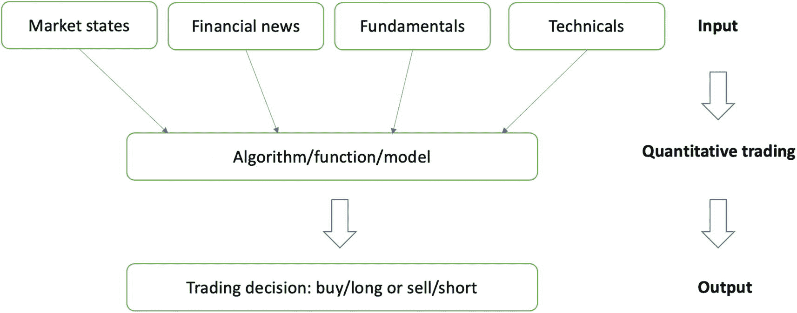

2 个流程图。市场状态、财经新闻、基本面和技术面输入算法、函数或模型，随后产生买入/做多或卖出/做空的交易决策。输入之后是量化交易，最后给出输出。

**图 1-1** 说明整体量化交易过程

用于生成交易信号的模型可以基于规则，也可以使用数据进行训练。基于规则的方法主要依赖领域知识，需要显式地写出从输入到输出的逻辑流程，类似于遵循一个烹饪配方。另一方面，数据驱动的方法涉及使用机器学习技术训练模型，并将该模型作为黑箱进行预测和推断。接下来，让我们回顾一下典型机器学习工作流程中的整体模型训练过程。

### 模型开发工作流

典型的模型开发工作流从训练数据开始。在监督学习任务中，训练数据由输入-输出对组成，其中输入和输出数据均已给定。每个输入条目可能包含多个特征，从不同角度描述同一个观测样本。对应的输出包含真实目标值，作为正确答案来指导训练过程。模型训练的目标是生成一个映射函数（即模型），能够正确地将给定输入映射到相应的输出。

一个训练好的模型包含两部分：参数和架构。参数是模型的组成部分，而架构则规定了这些组件如何与输入数据交互以生成最终的预测输出。预测值随后会与真实目标值进行比较，共同计算出误差指标。此处，误差表示当前预测值与实际值之间接近或偏离程度的代价。遵循特定的优化流程，训练过程会调整给定架构下的模型参数，以降低训练代价。权重更新后，会重新计算新的误差，形成反馈循环。整个模型训练过程如图 1-2 所示。

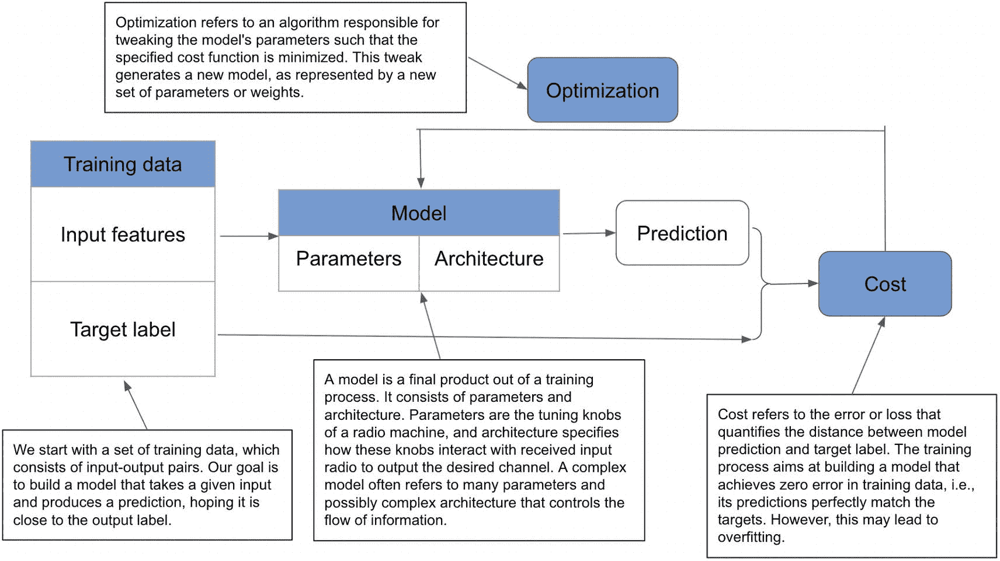

一个包含 4 个主要步骤的流程示意图。带输入特征和目标标签的训练数据生成包含参数和架构的模型，随后进行预测并计算代价。代价经过优化后反馈至模型。图中对各步骤均有文字说明。

**图 1-2** 典型模型训练过程示例。工作流从可用的训练数据开始，逐步调整模型。调整过程要求模型预测与目标输出相匹配，两者之间的差距由特定代价函数衡量，并作为下一轮调整的反馈。每次调整都会产生一个新模型，我们的目标是寻找使代价最小化的那个模型。

现在，让我们来看大型机构中一种特定类型的算法交易：机构算法交易。

## 机构算法交易

由于底层决策模型可能是一个黑箱，算法交易也被称为自动化交易、黑箱交易或机器人交易。它用于在可电子化接入的市场中生成并执行订单。在大型机构、对冲基金和交易部门中，交易量通常相当大。在这种情况下，机构算法交易通常寻求将大订单拆分为小订单，以降低**执行风险**——即市场上无法完成大订单的情形。

除了在交易中保持匿名性外，大型机构还使用算法交易来最小化交易对价格的影响。这是因为即使大订单可以执行，也很难保证市场价格不会因大订单的执行而受到影响。因此，机构算法交易的主要目标是控制市场风险和执行成本，而非获取利润。

当机构投资者执行大订单时，对大量流动性的需求通常会负面地影响交易成本。这被称为**滑点**，指市场参与者收到的执行价格与最初预期不同的情况。这种情况可能发生在多种工具上，包括股票、债券、外汇和衍生品。

为了在不引起市场明显波动的情况下匿名执行这些大宗交易，大型机构通常会借助**暗池**来开展交易。暗池是远离中央证券交易所、为机构投资者执行订单的私有交易所，因此在交易过程中透明度很低。

这些大型机构订单在拆分成小订单后，也被称为**冰山订单**。通过仅暴露冰山的一角，大部分订单可以保持隐藏状态，随后再转为可见订单，从而与单一的大订单相比，最大限度地减少对交易市场的干扰。这些小订单随后会在数分钟、数小时或数天内以电子方式执行。为了最小化这些订单的影响，机构投资者会在开盘和收盘时交易量相对较高的时段更多地进行交易，而在午餐时间等交易清淡的时段交易较少。

让我们看一个简单的例子：使用 Python 从原始订单中生成冰山订单的一个小子集。在代码清单 1-1 中，我们创建了一个包含十个随机整数的列表，保存为`total_order`，用于表示机构投资者要执行的所有订单。我们可以随机抽取两个索引，并用它们访问`total_order`中对应的元素，保存为`iceberg_order`，表示要向市场暴露的冰山订单。

```
#### 生成多个随机整数
total_order = [random.randint(0, 10) for p in range(0, 10)]
>>> total_order
[9, 6, 4, 3, 7, 6, 3, 0, 0, 6]
#### 随机采样两个索引以识别冰山订单
iceberg_order_idx = random.sample(total_order, 2)
>>> iceberg_order_idx
[0, 4]
#### 检索冰山订单
iceberg_order = np.array(total_order)[iceberg_order_idx]
iceberg_order
array([9, 7])
```

**代码清单 1-1** 生成冰山订单

机构算法策略通过分析每日报价和价格来生成最优交易信号。例如，一种机构算法策略可能建议：如果当前股价从低于**成交量加权平均价格（`VWAP`）** 变为高于该价格——这是短期交易者常用的技术指标，则开立多头头寸。机构算法策略也可能利用**套利**机会或相关证券之间的价差。这里，套利意味着以零投资获取确定的正利润。套利机会如果存在，通常会很快消失，因为许多对冲基金和投资者都在不断寻找此类套利机会。

下一节将简要介绍量化交易员的角色。

### 成为量化交易员

量化交易员是一种专业交易员，他们利用数学模型和量化分析来评估不同的金融产品，并从成千上万的候选标的中识别出买卖最佳证券的交易机会。量化交易员使用数据驱动的方法做出基于模型的交易决策，试图利用市场中可能不易通过传统定性分析识别的暂时性低效和潜在模式。

有志成为量化交易员的首要特质是熟悉数字和数学模型。由于大部分时间都用于分析数据、提出、回测并实施（买入、卖出或持有特定证券的）交易策略，量化交易员需要同时熟练掌握数学模型和编程技能，这通常要求具备金融建模或相关领域的高等学历。当积极信号出现时，量化交易员需要利用自研程序迅速行动，以抓住当前的交易机会。

第二个特质在于软技能，例如以良好心态应对高压。这需要良好的情商，既不过度承担风险，也不过分规避风险。懂得何时离场止损是一项关键技能，需要在日常交易活动中保持纪律性。

下一节将涵盖主要资产类别和各种可交易工具。

### 主要资产类别与衍生品

公开与私募市场中，多种可交易金融工具被用于筹集资本。机构与散户投资者可通过单一资产或资产组合建立多头或空头头寸，以追求利润或管理风险（即套期保值）。

让我们先一窥众多可交易资产。下表中，我们简要定义了市场中常用的资产类型：

- **股票**：亦称权益，是一种代表发行公司按比例所有权的证券形式。股票的单位称为“股”，持股数量决定所有者对公司所有权的比例，进而影响其利润分配。股票持有者可通过股价上涨或收取股息获利。

- **债券**：固定收益类债务工具，代表投资者/贷款人向借款人（公司或政府）提供的固定期限贷款。债券持有者可获得固定利率票息或浮动利息，并在到期日收回本金。由于向持有者定期稳定支付利息，它属于固定收益资产。

- **年金**：由金融机构提供的保险合同，承诺在未来向合同持有人提供固定收入流。投资者主要将年金用于退休规划，可在未来特定期限或终身获得有保障的定期付款。

- **现金及现金等价物**：高流动性、短期（90 天以内）投资证券，风险低、回报低（通常低于通胀率）。等价物包括银行账户、短期工具（如美国国库券）以及货币市场基金。这些流动资产可随时轻松取用，反映企业偿付短期债务的能力。

- **大宗商品**：用于商业活动的基础商品，作为生产其他商品或服务的原材料输入。常见大宗商品（如黄金、石油、天然气）可在现货（现金）市场交易，或通过期货、期权等衍生品进行交易。

- **期货**：以法律协议形式存在的金融衍生品，强制期货合约买方在未来按预设价格、数量和日期买入或卖出标的资产。期货常被用于对冲标的资产的价格波动，从而避免未来不利价格变化造成的损失。期货合约价格每日结算，即按市值计价。

- **远期**：类似于期货合约。区别在于远期合约是私下协商的定制化协议，通过场外交易（即参与者无需中央交易所或经纪人而直接交易工具的去中心化市场）进行。远期合约价格在协议到期时结算。

- **期权**：金融衍生品，给予期权合约买方在特定到期日前或到期日以特定（执行）价格买入（看涨期权）或卖出（看跌期权）标的资产的机会。期权赋予买方做多或做空标的资产的权利，而非义务。期权可用于套期保值和投机。请注意，我们默认以欧式期权为重点。

- **货币**：通过全球（最大且流动性最强）电子市场（也称外汇市场）交易的国际货币及货币衍生品。外汇市场允许投资者按当前市场汇率将一种货币兑换为等值的另一种货币。交易者还会对货币价值的走向进行投机，以从特定货币对有利的价格波动中获利。

- **ETF**：交易型开放式指数基金，是指一篮子证券（股票、债券、大宗商品等）作为投资组合的集合投资证券，可像普通股票一样在盘中交易。

- **REITs**：房地产投资信托基金，指拥有、运营或融资创收型房地产的公司。`REITs` 的投资者（类似于股票，具有流动性和公开交易性）可在不实际购买、管理或融资房地产本身的情况下，从房地产投资中获得稳定的收入流。

- **共同基金**：一种金融工具，由股票、债券或其他证券的投资组合构成。共同基金由专业资金经理管理，允许个人投资者以支付年费为代价，获得多元化且专业管理的投资组合。共同基金只能在每个交易日结束时，根据计算出的价格（即资产净值）进行购买。

- **对冲基金**：积极管理的投资池，旨在通过广泛（通常高风险）的交易策略为投资者赚取高于平均水平的回报，但其费用高于传统投资基金。

这些可交易资产类型可根据特定视角归入不同类别。下一章节我们将介绍几种常见视角。

### 可交易资产的分组

资产类别是指具有相似风险和收益基本特征的投资工具集合。主要有四大资产类别：股票、固定收益工具、现金及等价物，以及另类投资（被定义为不属于前几类投资范畴的金融资产）。图 1-3 展示了这四大类投资证券。

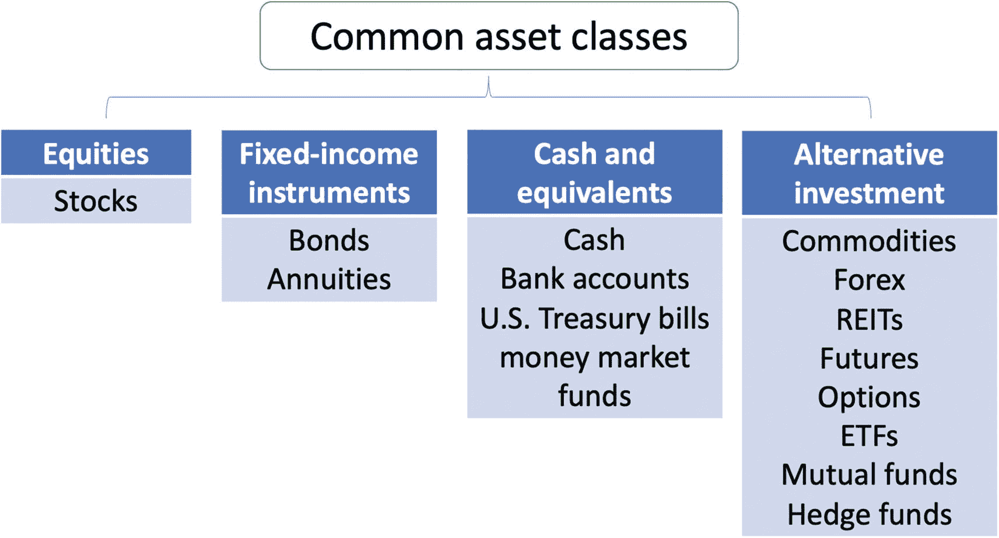

一张图表将常见资产分为 4 类。股票包括个股。固定收益工具包括债券和年金。现金及等价物包括现金、银行存款、美国国库券、货币市场基金以及基金。另类投资包含 8 个组成部分。

此外，我们也可以根据期限类型来对可交易资产进行分组。股票、货币和大宗商品属于无期限的资产类别，而固定收益工具和衍生品则具有期限。对于像期货合约这样有到期日的普通证券，可以基于*无套利*原理计算其公允价值——这是我们在第 3 章将要讨论的话题。

我们还可以根据某些衍生工具到期时收益函数的线性特征来对资产进行分组。例如，期货合约允许买方/卖方在到期时以约定价格买入/卖出标的资产。假设到期日标的（股票）价格为 `S[T]`，约定价格为 `K`。当买方做多/买入一份以期价格 `K` 购买股票的期货合约时，如果 `S[T] >= K`（以较低价格买入股票），买方将获利 `S[T] - K`；如果 `S[T] < K`（以较高价格买入股票），则将亏损 `K - S[T]`。对期货合约的做空/卖出情况也可做类似分析。两者的函数关系在行权时均与标的资产价格呈线性关系。关于线性收益函数的图示，请参见图 1-4。

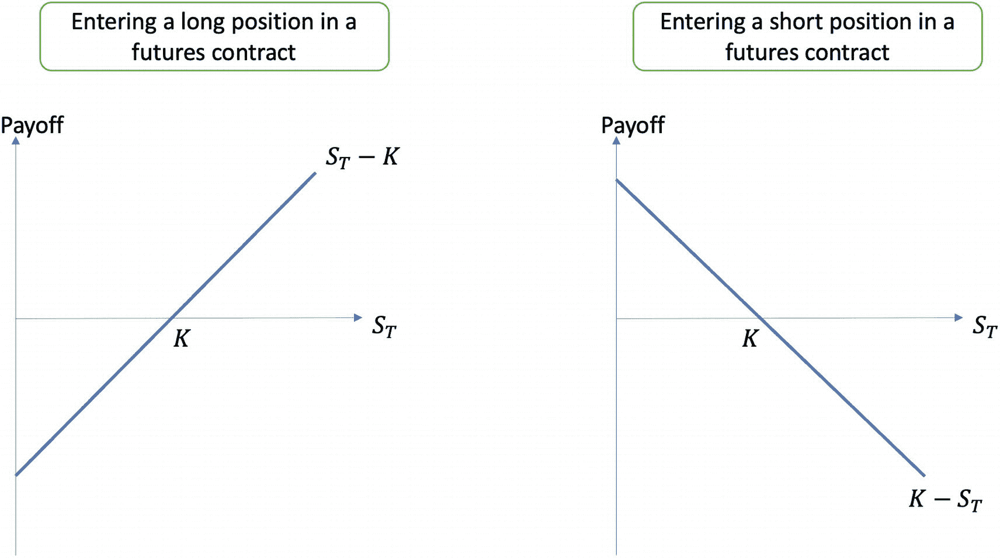

两张收益与 `S[T]` 关系的线性图。1. 图中有一条线性上升的线表示 `S[T] - K`。该线与 x 轴相交于点 `K`。2. 图中有一条线性下降的线表示 `K - S[T]`。该线与 x 轴相交于点 `K`。

其他具有线性收益函数的衍生品包括远期合约和掉期合约。由于其价格是标的资产的线性函数，这些产品很容易定价。我们可以独立于标的资产价格的数学模型来对这些工具进行定价。换言之，我们只需要标的资产的价格，而无需围绕该资产的数学模型。因此，这些资产适用**模型无关定价**。

让我们来看期权合约的非线性收益函数。看涨期权赋予买方在到期日 `T`（此时标的资产价格为 `S[T]`）以执行价 `K` 购买标的资产的选择权，而看跌期权则将这一选择权变为以执行价 `K` 卖出标的资产。在这两种情况下，买方可以选择不行使期权，因此不会获得任何利润。鉴于投资者既可以做多也可以做空看涨或看跌期权，参与期权合约共有四种组合，如下所列：

-   **买入看涨期权**：买入一份看涨期权，以获得在到期日以预先指定的执行价购买标的资产的机会。

-   **卖出看涨期权**：卖出一份看涨期权，赋予买方在到期日以预先指定的执行价购买标的资产的机会。

-   **买入看跌期权**：买入一份看跌期权，以获得在到期日以预先指定的执行价卖出标的资产的机会。

-   **卖出看跌期权**：卖出一份看跌期权，赋予买方在到期日以预先指定的执行价卖出标的资产的机会。

图 1-5 包含了这四种不同组合的收益函数，它们都是标的资产价格 `S[T]` 的非线性函数。

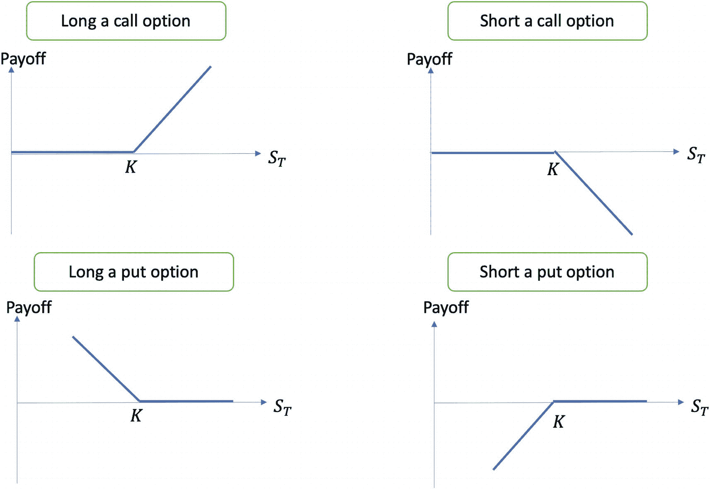

4 张收益与 `S[T]` 关系的线性图。1 和 2. 买入看涨期权和卖出看涨期权的图形在达到 `K` 之前水平延伸，随后分别线性上升和下降。3 和 4. 买入看跌期权和卖出看跌期权的图形在达到 `K` 之前分别线性下降和上升，随后水平延伸。

需要注意的是，同一资产类别内的可交易工具表现出相似的特征，但在某些方面会有所不同。遵循各自价格动态的可交易工具，其市场表现也会不同。

我们还可以根据一项可交易资产属于**现货市场**还是**衍生品市场**来对其进行分组。现货市场，也称为即期市场，是一个交易工具在销售时点进行交换的市场，买方立即取得交易产品的所有权。例如，股票交易所属于现货市场，因为投资者几乎在支付现金的同时立即获得股票份额，从而完成即时交割。

另一方面，衍生品市场只在未来预先指定的日期才完成交易。以期货市场为例，为获得接收货物权利而付款的买方，只能预期在预先指定的未来日期收到交割。

下一节将介绍常见的交易途径和步骤。

### 常见交易途径与步骤

如前所述，投资者出于盈利或风险管理的目的参与交易活动。若目标是投资获利，接下来的操作便是观察分析市场，并依据交易信号采取行动。例如，投资者运用预测方法判断市场涨跌时机，便可发起交易将市场波动转化为利润，实现短线快速盈利。此类行为被称为*择时交易*，即投资者根据对近期市场走势的预测，开仓或平仓，或者*调整投资组合*（在资产之间转移资金）。这与*买入并持有*策略相反，后者指投资者购入交易工具后长期持有，无视市场的波动（涨跌）。

进行交易活动时，理解特定可交易资产的短期与长期季节性效应至关重要。以股票交易为例，股价的短期波动往往出现在市场开盘和收盘时段，这属于主要证券交易所常规交易时间的一部分，并决定了当日的开盘价与收盘价。从长期来看，年末的交易活动通常比当年其他时期更为清淡。

交易活动可在以下四种途径之一进行：

- 受监管的交易所，例如纽约证券交易所和纳斯达克

- 暗池，即监管较少的私人交易所

- 经纪商市场，买卖双方通过被称为经纪商（或代理人、中介）的中间人进行交易

- 场外交易市场，一个允许买卖双方直接交易的非中心化市场

让我们来剖析一笔交易的结构。执行一笔交易通常涉及以下四个步骤：

- **获取信息与报价**：在参与交易前，获取关于该资产的高质量信息至关重要，并需要了解诸多有形和无形因素的透明度，例如供需关系、投资者风险态度以及整体经济与地缘政治环境。市场结构、流动性和信息流等相关信息最终决定可交易资产的价格发现。

- **订单路由**：例如选择处理交易的经纪商，或决定将交易发送至哪些市场并执行。

- **订单执行**：根据特定市场的规则，匹配并执行买卖双方的交易订单。

- **确认、清算与结算**：这发生在交易订单执行完毕之后。清算是对交易记录的核对与比对，结算则涉及证券的实际交付和款项支付。

在下一节中，我们将探讨不同的市场结构。

### 市场结构

在 2010 年之前，`公开喊价`是交易场内传达交易订单的一种流行方式。交易者利用暂时的信息不对称，通过口头交流和手势信号在股票、期权和期货交易所进行交易活动。交易者在交易所的交易大厅里面对面地安排交易，通过喊出买入价和卖出价来提供流动性，并倾听他人的报价以获取流动性。公开喊价的规则是，交易者必须公开宣布自己的买入和卖出报价，以便其他交易者能够对此作出反应，避免在小范围内窃窃私语。他们还必须公开宣布接受特定交易的买入报价（出售资产）或卖出报价（收购资产）。最大的交易池是美国长期国债期货市场，在`芝加哥期货交易所`旗下拥有超过 500 名场内交易员，该交易所是后来并入 CME 集团的主要做市商。

随着技术进步，交易市场从实体转向电子化，形成了全自动化交易所。该概念由费希尔·布莱克于 1971 年首次提出，全自动化交易所也被称为`程序化交易`，涵盖了广泛的投资组合交易策略。

交易规则和系统共同定义了交易市场的市场结构。一种市场类型称为`集合竞价市场`，仅在市场被“叫价”时允许交易。另一种市场类型是`连续竞价市场`，在常规交易时间内任何时刻都允许交易。诸如纽约证券交易所、伦敦证券交易所和新加坡交易所等大型交易所均采用混合模式的市场结构。

市场结构也可以根据可交易资产的定价性质进行分类。当价格基于做市商或交易商提供的买入和卖出报价来确定时，称为`报价驱动型`或`价格驱动型市场`。交易由参与每笔交易并从自己库存中匹配订单的交易商和做市商决定。报价驱动型市场的典型资产包括债券、货币和大宗商品。

另一方面，当交易基于买方和卖方的需求进行时，称为`订单驱动型市场`，其中买入和卖出价格以及期望的股票数量会被公示。订单驱动型市场的典型资产包括股票市场、期货交易所和电子通信网络。订单主要有两种基本类型：基于资产市场价格的`市价单`，以及仅按预设限价交易的`限价单`。

接下来，我们看看几种主要的买方股票投资者类型。

### 主要的买方股票投资者类型

买方投资者包括机构投资者（占大多数）和散户投资者。这里，买方活动包括根据机构或客户投资组合的具体要求和策略购买股票、债券或其他金融证券。买方是金融市场中的一个组成部分，由为资金管理目的而购买金融产品的投资机构和散户投资者构成。

典型的买方机构投资者包括：

- 共同基金

- 被动式交易所交易基金

- 养老基金

- 主权财富基金

- 对冲基金

- 保险公司

- 银行

- 公司名义持有人

典型的买方散户投资者包括：

- 初创企业投资者

- 家族企业

- 家庭/个人

下一节介绍做市的概念。

### 做市

做市商指一家公司或个人，他们积极地为特定证券提供双边市场（买方和卖方）的报价。做市商提供`买入价`，即其愿意买入该证券的特定价格和数量。他们也提供`卖出价`，即其愿意卖出该证券的价格和数量。通常，卖出价应高于买入价，以便做市商能通过两个报价之间的`价差`获利。

做市商发布报价并随时准备交易，从而为市场提供即时性和`流动性`。通过报出买入和卖出价格，做市商使得资产对潜在买家及卖空者更具流动性。

做市商还承担着持有资产的重大风险，因为证券的价值在其购买到出售给另一个买家之间可能会下跌。他们需要资金为其库存提供融资。因此，其可用资金限制了其提供流动性的能力。由于做市风险极高，投资者通常不愿投资于做市业务。拥有大量外部融资的做市公司通常拥有出色的风险管理系统，以防止其交易员产生巨额亏损。

下一节介绍抢帽子交易的概念。

### 超短线交易

`超短线交易`是一种通过快速（通常大仓位持仓不超过几分钟）且连续地建立和平仓来获取小额快速利润的交易方式。从事`超短线交易`的交易者被称为`超短线交易员`。

在进行`超短线交易`时，交易者需要实时报价流才能快速行动。交易者，也被称为`日内交易员`，必须遵循严格的退出策略，因为一次大的亏损就可能抹掉他们辛苦积累的众多小额收益。

像日内交易员这样的活跃交易者是`市场择时`的坚定信徒，这是主动管理投资策略的关键组成部分。例如，如果交易者能够预测市场何时上涨和下跌，他们就可以通过交易将这种市场变动转化为利润。显然，这是一项艰巨而繁重的任务，因为与长期投资的`头寸交易员`相比，他们需要从每日甚至每小时持续不断地观察市场。

下一节将介绍投资组合再平衡的概念。

### 投资组合再平衡

随着时间的推移，投资组合的当前资产配置会偏离投资者最初的目标资产配置。如果不进行调整，投资组合要么会变得风险过高，要么会变得过于保守。这种再平衡是通过改变投资组合中一种或多种资产的头寸来完成的，可以是买入或卖出，目的是最大化投资组合的收益或对冲其他金融工具。

由于价格变动导致市场表现改变资产价值，投资组合中的资产配置可能会发生变化。再平衡涉及定期买入或卖出投资组合中的资产，以恢复和维持由投资者风险收益特征定义的原始、理想的资产配置水平。

投资组合随着时间的推移偏离其目标配置有多种原因，例如市场波动、额外的现金注入或提取，以及风险承受能力的变化。我们可以使用基于时间的再平衡方法（例如，每季度或每年）或基于阈值的再平衡方法来执行投资组合再平衡，当某个资产类别的配置偏离目标预设百分比时，就会触发再平衡。

在量化交易的世界中，`Python`已成为制定和实施交易算法的强大工具。部分原因在于其全面的开源库和强大的社区支持。在下一节中，我们将讨论金融数据分析的实践方面，并首先使用`Python`获取和总结股票数据。

## 金融数据分析入门

金融数据分析是处理和分析金融数据以支持各种金融应用（如投资、交易、风险管理和公司财务）中决策的过程。它涉及使用先进的分析技术和模型来识别数据中的潜在模式、趋势和关系，这些将用于支持更明智的金融决策。

股票数据的时间间隔可能不同，例如按分钟、小时或天。由于时间是连续的，我们需要一种度量来总结该时间间隔内股票价格数据的概况。让我们首先介绍一种最流行的股票数据总结方法。

### 总结股票价格

股票数据最常见的总结类型是每日的`OHLC`价格（开盘价、最高价、最低价、收盘价）。`OHLC`图表是一种条形图，显示每个周期（通常是每日）的开盘价、最高价、最低价和收盘价。它们呈现一天中的四个主要数据点，许多交易者认为收盘价是最重要的指标。

`OHLC`图表，类似于图 1-6 中所示的 K 线图，非常有用，因为它可以显示上涨或下跌的势头。当开盘价和收盘价之间存在巨大差距时，表明当天有强烈的上涨或下跌势头。当开盘价和收盘价接近时，则表明犹豫不决或势头较弱。最高价和最低价显示了完整的价格范围，可用于评估波动性。

图 1-6 显示了两个 K 线图，它们都总结了特定时间段（例如每日）内的价格变动。颜色代表股票价格变动的情绪，阳线为绿色，阴线为红色，尽管这些颜色在特定的交易平台上可以更改。一组 K 线图可用于确定市场走势的方向。每个 K 线图由四个主要点组成：开盘价、最高价、最低价和收盘价，按该时期的时间顺序排列。开盘价和收盘价决定了 K 线的实体部分。绿色代表看涨 K 线，即股票收盘价高于开盘价。同样，红色代表看跌 K 线，即股票收盘价低于开盘价。

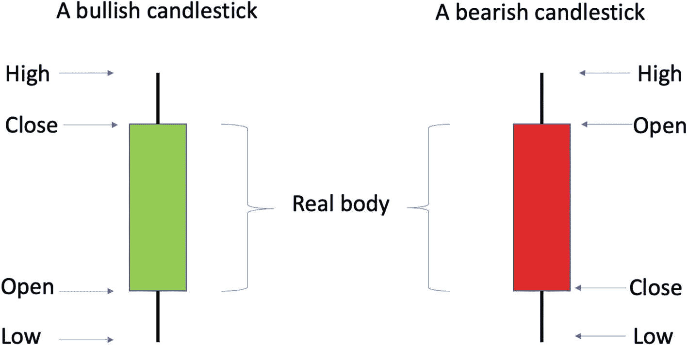

两张 K 线图。两张 K 线图中从上到下标注的部分分别是最高价、收盘价、实体、开盘价和最低价。中间较宽的部分是实体。

**图 1-6** 说明绿色看涨 K 线和红色看跌 K 线

让我们来看看一个交易日中绿色的看涨 K 线。市场开始时，股票有一个开盘价并开始波动。在一天中，股票会经历最高价格点（最高价）和最低价格点（最低价），两者之间的差距表明了波动的势头。我们知道，只要存在波动，最高价总会高于最低价。市场收盘时，股票会记录一个收盘价。图 1-7 描绘了由绿色 K 线总结的一个样本波动路径。

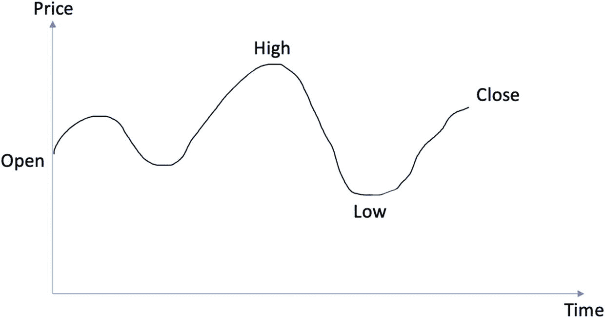

价格与时间的关系图。它具有不对称的正弦波曲线。起始点标记为开盘价。最高峰标记为最高价。最大低谷标记为最低价。弯曲点标记为收盘价。

**图 1-7** 由绿色 K 线图表示的股票价格变动样本路径。市场开始时，股票有一个开盘价并开始波动。它会经历最高价格点（最高价）和最低价格点（最低价），两者之间的差距表明了波动的势头。市场收盘时，股票会记录一个收盘价

接下来，我们将转换思路，开始使用`Python`处理实际的股票价格数据。我们将从 Yahoo! Finance 下载数据，并介绍绘制数据的不同方法。

### 下载股票价格数据

Yahoo! Finance 是我们可以获取市场数据的常见来源。要下载股票价格数据，我们可以使用`yfinance`库，这是一个受欢迎的开源（且免费）库，用于访问 Yahoo! Finance 上提供的金融数据。它设置起来相对快速，并提供高粒度的数据（涵盖每日甚至每分钟的数据）。

首先，我们需要在`Jupyter` notebook 环境中通过`pip`命令安装`yfinance`包并导入它：

```
!pip install yfinance
import yfinance as yf
```

接下来，我们可以使用`yfinance`包中的`Ticker()`模块来查看特定股票的概况信息。以下代码片段获取了微软的股票代码信息，并通过`info`属性将其打印出来：

#### Ticker 模块使用示例

使用`yfinance`库获取股票数据。

首先，导入`yfinance`库并创建一个`Ticker`对象：

```python
import yfinance as yf

# 使用 Ticker 模块访问股票数据
msft = yf.Ticker("MSFT")
```

获取股票基本信息：

```python
# 获取股票信息
>>> msft.info
```

输出结果（部分）：

```json
{
  'zip': '98052-6399',
  'sector': 'Technology',
  'fullTimeEmployees': 221000,
  'longBusinessSummary': 'Microsoft Corporation develops, licenses, and supports software, services, devices, and solutions worldwide...',
  'city': 'Redmond',
  'phone': '425 882 8080',
  'state': 'WA',
  'country': 'United States',
  'companyOfficers': [],
  'website': 'https://www.microsoft.com',
  'maxAge': 1,
  'address1': 'One Microsoft Way',
  'fax': '425 706 7329',
  'industry': 'Software—Infrastructure',
  'ebitdaMargins': 0.48672,
  'profitMargins': 0.34366,
  'grossMargins': 0.6826,
  'operatingCashflow': 87693000704,
  'revenueGrowth': 0.106,
  'operatingMargins': 0.41691002,
  'ebitda': 98841001984,
  'targetLowPrice': 234,
  'recommendationKey': 'buy',
  'grossProfits': 135620000000,
  'freeCashflow': 46155874304,
  'targetMedianPrice': 290,
  'currentPrice': 238.73,
  'earningsGrowth': -0.133,
  'currentRatio': 1.84,
  'returnOnAssets': 0.15223,
  'numberOfAnalystOpinions': 45,
  'targetMeanPrice': 296.91,
  'debtToEquity': 44.442,
  'returnOnEquity': 0.42875,
  'targetHighPrice': 411,
  'totalCash': 107244003328,
  'totalDebt': 77136003072,
  'totalRevenue': 203074994176,
  'totalCashPerShare': 14.387,
  'financialCurrency': 'USD',
  'revenuePerShare': 27.142,
  'quickRatio': 1.585,
  'recommendationMean': 1.8,
  'exchange': 'NMS',
  'shortName': 'Microsoft Corporation',
  'longName': 'Microsoft Corporation',
  'exchangeTimezoneName': 'America/New_York',
  'exchangeTimezoneShortName': 'EST',
  'isEsgPopulated': False,
  'gmtOffSetMilliseconds': '-18000000',
  'quoteType': 'EQUITY',
  'symbol': 'MSFT',
  'messageBoardId': 'finmb_21835',
  'market': 'us_market',
  'annualHoldingsTurnover': None,
  'enterpriseToRevenue': 8.615,
  'beta3Year': None,
  'enterpriseToEbitda': 17.7,
  '52WeekChange': -0.30287635,
  'morningStarRiskRating': None,
  'forwardEps': 11.18,
  'revenueQuarterlyGrowth': None,
  'sharesOutstanding': 7454470144,
  'fundInceptionDate': None,
  'annualReportExpenseRatio': None,
  'totalAssets': None,
  'bookValue': 23.276,
  'sharesShort': 40445360,
  'sharesPercentSharesOut': 0.0054,
  'fundFamily': None,
  'lastFiscalYearEnd': 1656547200,
  'heldPercentInstitutions': 0.72300005,
  'netIncomeToCommon': 69788999680,
  'trailingEps': 9.29,
  'lastDividendValue': 0.68,
  'SandP52WeekChange': -0.19752294,
  'priceToBook': 10.256488,
  'heldPercentInsiders': 0.00059,
  'nextFiscalYearEnd': 1719705600,
  'yield': None,
  'mostRecentQuarter': 1664496000,
  'shortRatio': 1.38,
  'sharesShortPreviousMonthDate': 1667174400,
  'floatShares': 7447764118,
  'beta': 0.933189,
  'enterpriseValue': 1749498331136,
  'priceHint': 2,
  'threeYearAverageReturn': None,
  'lastSplitDate': 1045526400,
  'lastSplitFactor': '2:1',
  'legalType': None,
  'lastDividendDate': 1668556800,
  'morningStarOverallRating': None,
  'earningsQuarterlyGrowth': -0.144,
  'priceToSalesTrailing12Months': 8.763292,
  'dateShortInterest': 1669766400,
  'pegRatio': 1.92,
  'ytdReturn': None,
  'forwardPE': 21.353308,
  'lastCapGain': None,
  'shortPercentOfFloat': 0.0054,
  'sharesShortPriorMonth': 36909448,
  'impliedSharesOutstanding': 0,
  'category': None,
  'fiveYearAverageReturn': None,
  'previousClose': 238.19,
  'regularMarketOpen': 236.11,
  'twoHundredDayAverage': 261.927,
  'trailingAnnualDividendYield': 0.010663755,
  'payoutRatio': 0.26700002,
  'volume24Hr': None,
  'regularMarketDayHigh': 238.87,
  'navPrice': None,
  'averageDailyVolume10Day': 35831410,
  'regularMarketPreviousClose': 238.19,
  'fiftyDayAverage': 240.6454,
  'trailingAnnualDividendRate': 2.54,
  'open': 236.11,
  'toCurrency': None,
  'averageVolume10days': 35831410,
  'expireDate': None,
  'algorithm': None,
  'dividendRate': 2.72,
  'exDividendDate': 1676419200,
  'circulatingSupply': None,
  'startDate': None,
  'regularMarketDayLow': 233.9428,
  'currency': 'USD',
  'trailingPE': 25.697523,
  'regularMarketVolume': 21206982,
  'lastMarket': None,
  'maxSupply': None,
  'openInterest': None,
  'marketCap': 1779605569536,
  'volumeAllCurrencies': None,
  'strikePrice': None,
  'averageVolume': 30495014,
  'dayLow': 233.9428,
  'ask': 238.45,
  'askSize': 800,
  'volume': 21206982,
  'fiftyTwoWeekHigh': 344.3,
  'fromCurrency': None,
  'fiveYearAvgDividendYield': 1.17,
  'fiftyTwoWeekLow': 213.43,
  'bid': 238.2,
  'tradeable': False,
  'dividendYield': 0.0114,
  'bidSize': 1000,
  'dayHigh': 238.87,
  'coinMarketCapLink': None,
  'regularMarketPrice': 238.73,
  'preMarketPrice': None,
  'logo_url': 'https://logo.clearbit.com/microsoft.com',
  'trailingPegRatio': 2.1113
}
```

结果显示出了一长串关于微软的信息，这对我们初步分析特定股票很有帮助。请注意，所有这些信息都以字典形式结构化呈现，方便我们访问特定数据。例如，以下代码片段打印了该股票的市值：

```
#### access a specific attribute from the dictionary
>>> msft.info["marketCap"]
```

这种结构化信息（在此语境下也可视为元数据）在我们同时分析多个股票代码时会派上用场。

现在让我们聚焦微软的实际股票数据。在代码清单 1-2 中，我们下载了微软自 2022 年初至今的股票价格数据。其中，当前日期由`datetime`包中的`today()`函数自动确定，这意味着未来每次运行代码时都会获得不同的（更大的）数据结果。我们还指定了日期格式为“YYYY-mm-dd”，这是统一日期格式的重要实践。

```
#### download daily stock price data by passing in specified ticker and date range
from datetime import datetime
today_date = datetime.today().strftime('%Y-%m-%d')
print(today_date)
data = yf.download("MSFT", start="2022-01-01", end=today_date)
Listing 1-2
Downloading stock price data
```

我们可以通过调用 DataFrame 的 `head()` 函数来查看前几行数据。生成的表格包含开盘价、最高价、最低价、收盘价、调整收盘价等价格相关信息，以及每日交易量：

```
#### view the first few rows.
>>> data.head()
Open       High       Low        Close      Adj Close  Volume
Date
2022-01-03 335.350006 338.000000 329.779999 334.750000 331.642456 28865100
2022-01-04 334.829987 335.200012 326.119995 329.010010 325.955750 32674300
2022-01-05 325.859985 326.070007 315.980011 316.380005 313.442993 40054300
2022-01-06 313.149994 318.700012 311.489990 313.880005 310.966217 39646100
2022-01-07 314.149994 316.500000 310.089996 314.040009 311.124725 32720000
```

我们也可以使用 `tail()` 函数查看最后几行数据：

```
>>> data.tail()
Open       High       Low        Close      Adj Close  Volume
Date
2022-12-30 238.210007 239.960007 236.660004 239.820007 239.820007 21930800
2023-01-03 243.080002 245.750000 237.399994 239.580002 239.580002 25740000
2023-01-04 232.279999 232.869995 225.960007 229.100006 229.100006 50623400
2023-01-05 227.199997 227.550003 221.759995 222.309998 222.309998 39585600
2023-01-06 223.000000 225.759995 219.350006 224.929993 224.929993 43597700
```

检查 DataFrame 的维度也是一个好习惯，可以使用 `shape()` 函数：

```
#### check data dimension/size
>>> data.shape
(254, 6)
```

下一节将介绍如何通过交互式图表可视化时间序列数据。

## 可视化股票价格数据

`plotly` 包是一个交互式绘图库，支持探索性和说明性可视化。我们通过几个示例来演示其用法，重点关注股票的收盘价。

首先，让我们将收盘价可视化为时间序列图。顾名思义，时间序列是一系列带有时间戳的数据点。因此，在图形上绘制时，横轴表示从左到右的时间流动，纵轴表示目标变量，即每日收盘价。此外，由于每个时间戳对应图上一个独立的数据点，我们将所有相邻点用直线连接起来，形成最终的时间序列图并展示趋势模式。

代码清单 1-3 完成了这项任务。在这里，我们传入 DataFrame 的索引来表示 x 轴上的日期（传递给 `x` 参数）和 y 轴上的收盘价（传递给 `y` 参数），并将展示模式指定为折线图。

```
#### plot closing price as a time series chart
import plotly.graph_objects as go
fig = go.Figure(data=go.Scatter(x=data.index,y=data['Close'], mode='lines'))
fig.show()
Listing 1-3
Plotting the daily closing price
```

运行代码将生成图 1-8。请注意，该图表是交互式的；将鼠标悬停在每个数据点上，对应的日期和收盘价就会显示出来。

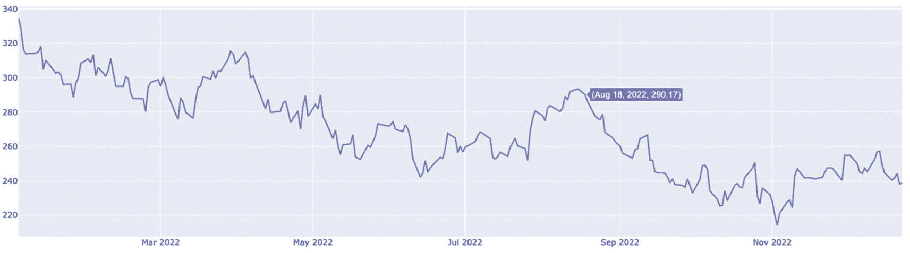

每日收盘价与月份的折线图。曲线呈现波动下降趋势。标注点在峰值上为（2023 年 8 月 18 日，290.17）。

图 1-8

微软每日收盘价的交互式时间序列图

我们还可以通过叠加交易量信息来丰富图形，如代码清单 1-4 所示。

```
#### overlay the trading volume
from plotly.subplots import make_subplots
fig2 = make_subplots(specs=[[{"secondary_y": True}]])
fig2.add_trace(go.Scatter(x=data.index,y=data['Close'],name='Price'),secondary_y=False)
fig2.add_trace(go.Bar(x=data.index,y=data['Volume'],name='Volume'),secondary_y=True)
fig2.show()
Listing 1-4
Overlaying trading volume in the daily closing price chart
```

运行代码将生成图 1-9。请注意，通过设置 `secondary_y=True`，交易量使用了右侧的次 y 轴。

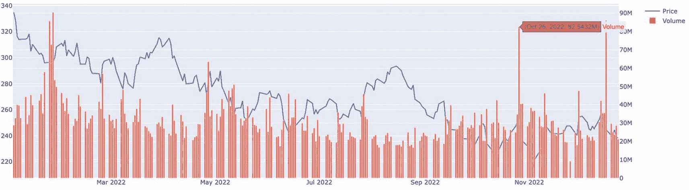

每日收盘价与交易量对月份的具有双 y 轴的簇状条形折线图。每日收盘价曲线呈现波动下降趋势。交易量的条形图呈现波动趋势。标注点在高柱上为（2023 年 10 月 26 日，8254.32 万）。

图 1-9

可视化微软的每日收盘价与交易量

基于此图，有几个突出的柱状条使得折线图难以看清。我们可以通过控制次 y 轴的量级来调整。具体来说，可以放大右侧 y 轴的总体量级，使这些柱状条看起来更短，如代码清单 1-5 所示。

```
#### rescale volume
fig2.update_yaxes(range=[0,500000000],secondary_y=True)
fig2.update_yaxes(visible=True, secondary_y=True)
fig2
Listing 1-5
Rescaling the y-axis
```

运行代码将生成图 1-10。现在，由于右侧 y 轴的范围更大（0 到 5 亿），柱状条看起来更短了。

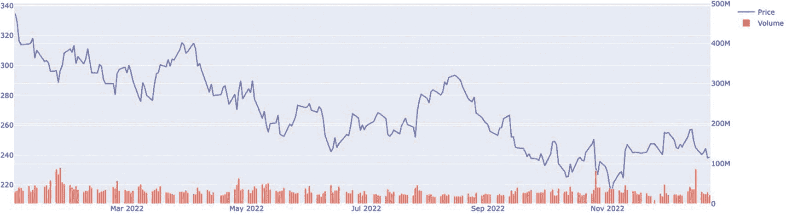

每日收盘价与交易量对月份的具有双 y 轴的簇状条形折线图。每日收盘价曲线呈现波动下降趋势。交易量的条形图呈现波动趋势。由于量程扩大至 0 到 5 亿，柱状条变得更短。

图 1-10

控制以条形图表示的每日交易量量级

最后，让我们用蜡烛图绘制所有价格点。这需要我们传入`DataFrame`中所有与价格相关的信息。`Candlestick()`函数可以帮助我们实现这一点，如代码清单 1-6 所示。

#### 切换到烛台图
```python
fig3 = make_subplots(specs=[[{"secondary_y": True}]])
fig3.add_trace(go.Candlestick(x=data.index,
open=data['Open'],
high=data['High'],
low=data['Low'],
close=data['Close'],
))
fig3
```
清单 1-6
绘制蜡烛图

运行代码生成图 1-11。每个柱代表一天的汇总数据（开盘价、最高价、最低价和收盘价），绿色表示价格上涨，红色表示交易日结束时价格下跌。

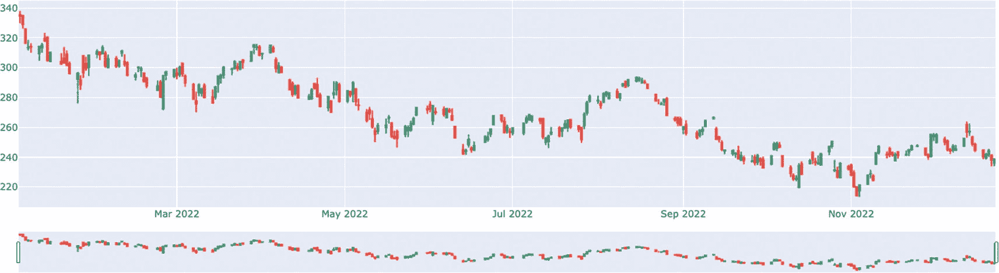

一张显示每日价格点与月份关系的蜡烛图。它呈现出波动下降的看涨和看跌蜡烛线趋势。下方是一个显示相同蜡烛线趋势的滑动窗口，可用于放大查看特定范围。

**图 1-11**  

将微软每日价格点可视化为蜡烛图

注意底部的滑动窗口。我们可以用它放大特定范围，如图 1-12 所示。当我们放大时，x 轴上的日期会自动调整。另外，这些柱状图以五个为一组出现。这并非偶然——一周有五个交易日。

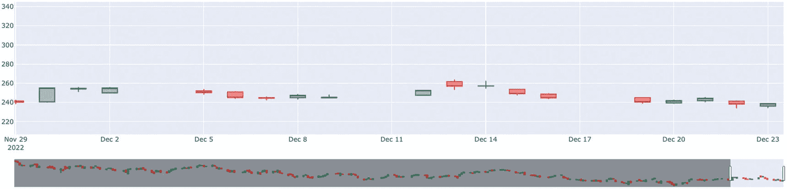

一张放大的蜡烛图视图，显示每日价格点与月份的关系。它呈现出波动下降的看涨和看跌蜡烛线趋势。下方是显示相同蜡烛线趋势的滑动窗口以及选定的放大范围。

**图 1-12**  

放大特定范围

## 本章小结

在本章中，我们介绍了量化交易的基础知识，涵盖了机构算法交易、主要资产类别、期权等衍生品、市场结构、买方投资者、做市商、倒卖以及投资组合再平衡等主题。然后，我们深入探讨了股票数据的探索性数据分析，首先使用蜡烛图汇总周期性数据点。我们还回顾了实际操作层面，涵盖了通过交互式图表进行数据检索、分析和可视化。这些将作为我们在后续章节开发不同交易策略时的构建模块。

## 练习

*   列出几种金融工具，并描述其风险和收益特征。

*   模型在训练期间能否接触到测试集数据？

*   如果一个模型在训练集上的表现优于另一个模型，就认为它更好，这种说法正确吗？

*   对于每日股票价格数据，我们可以将其汇总为周数据吗？时数据呢？

*   欧式看涨期权和看跌期权发行方的收益函数是什么？它与买方的收益函数有何关联？

*   假设你购买了一份期货合约，要求你在一月后以 10,000 美元的价格出售某种特定商品。当商品价格上涨到 12,000 美元时，你的收益是多少？当价格跌至 7,000 美元时呢？

*   在这两种情况下，买方的收益又是多少？

*   如果换成具有相同行权价和交割日的期权合约，结果会发生什么变化？

*   绘制一根红色蜡烛线的样本股票价格曲线。

*   下载苹果公司的股票价格数据，分别用折线图和蜡烛图绘制出来，并分析其趋势。

*   计算苹果公司今年迄今（年初至今）的平均股票价格。