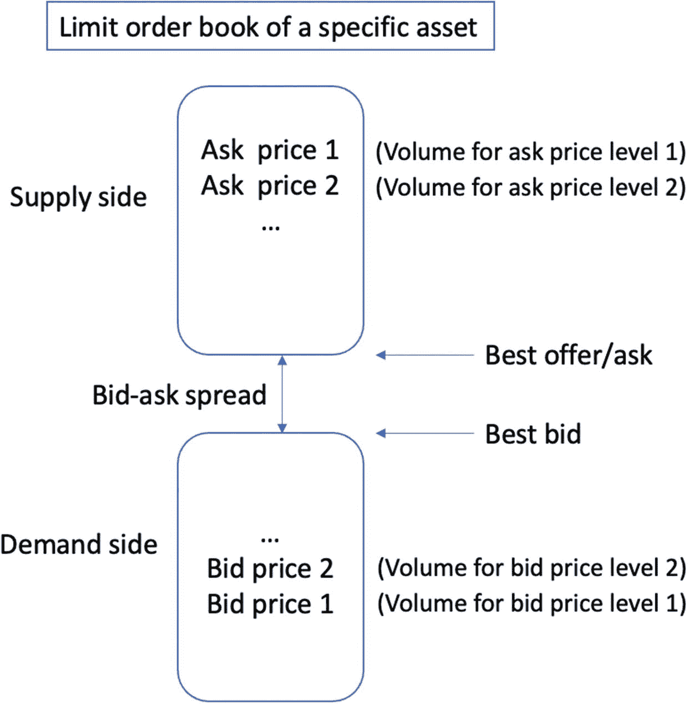
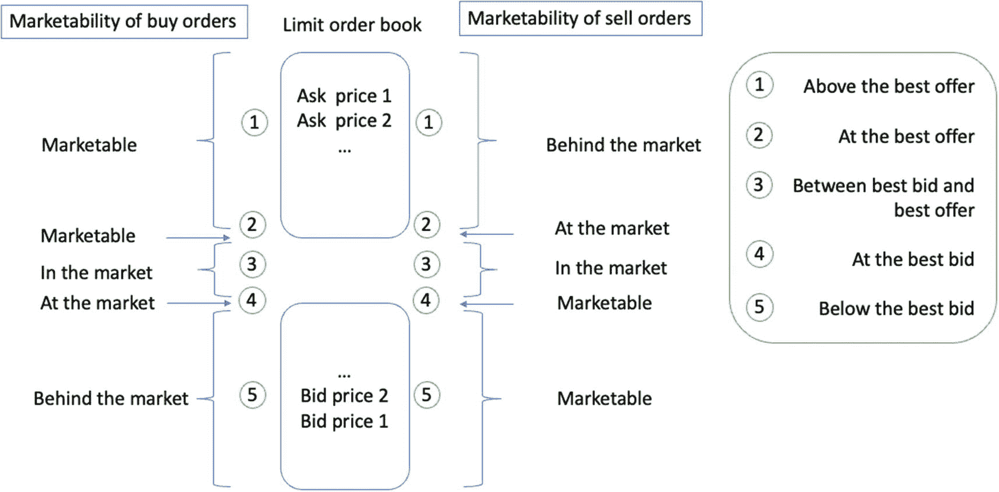
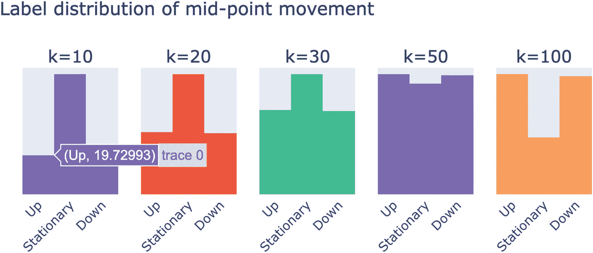
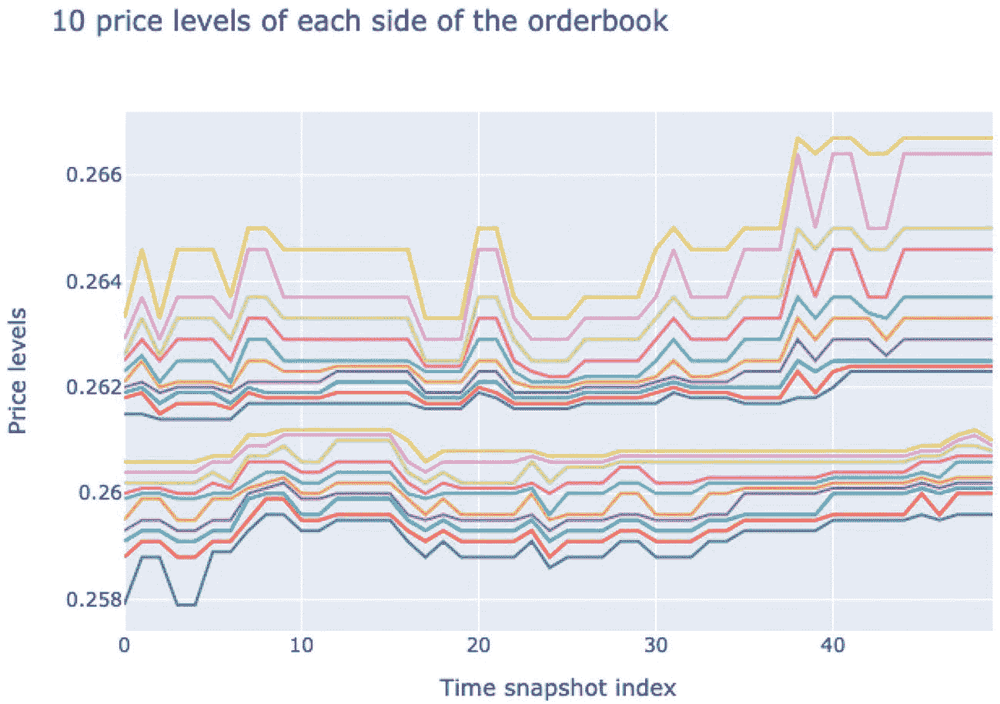
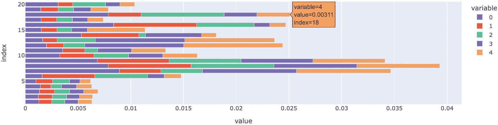
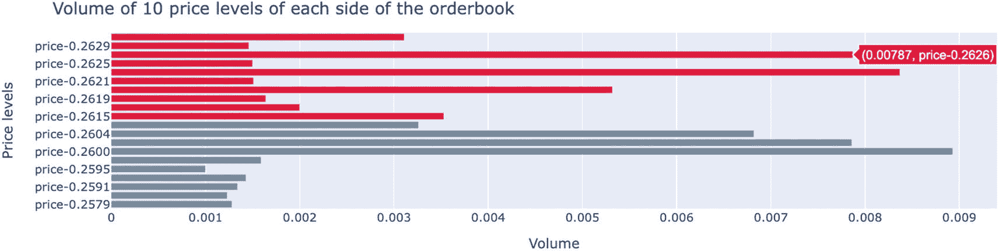
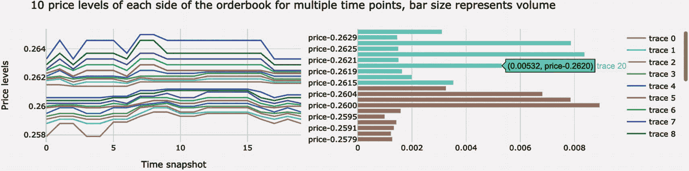
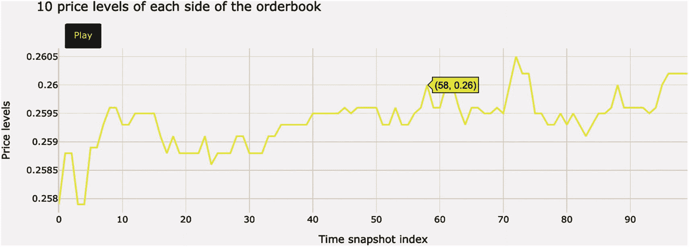
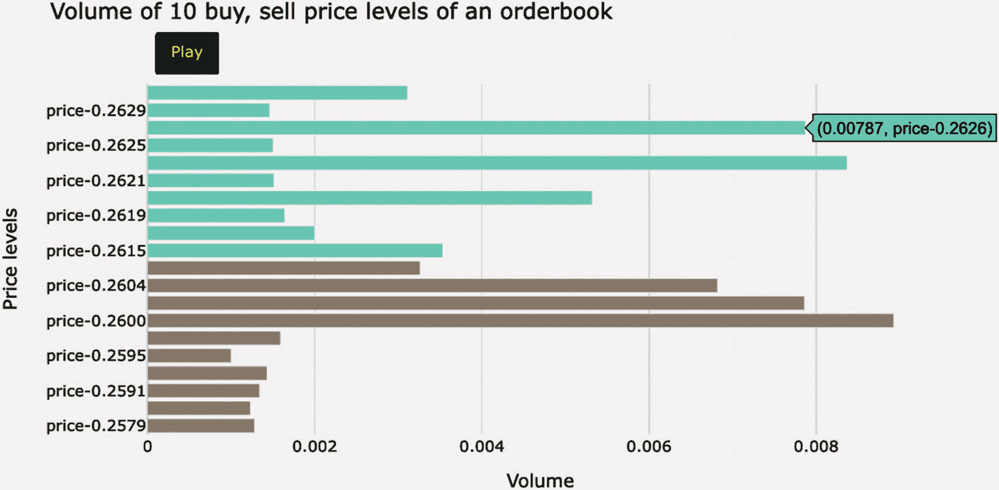

# 2. 电子市场

在本章中，我们将深入探讨电子市场的世界，它彻底改变了金融工具的交易方式。随着技术的快速进步和互联网的广泛普及，电子市场已在很大程度上取代了传统的、基于交易大厅的交易场所，为全球市场参与者带来了速度、效率和可及性的新时代。

电子市场通过计算机系统和网络促进股票、债券、货币和商品（参见第 1 章）等金融工具的买卖。它们在实现金融市场准入民主化方面发挥了关键作用，使更广泛的参与者（包括散户投资者、机构投资者和高频交易者）能够轻松、透明地进行交易活动。电子市场的核心是交易机制，它规定了买卖订单如何匹配、执行和结算。

此外，电子市场提供了多种订单类型，以满足交易者的不同需求和目标。这些订单类型可用于实现特定目标，例如最小化市场影响、确保理想的执行水平或管理风险。在本章中，我们将研究最常见的订单类型，包括市价单、限价单、止损单及其各种变体。

随着本章内容的深入，读者将全面了解电子市场的内部运作方式、驱动它们的交易机制，以及市场参与者可获得的各种订单类型。

## 介绍电子市场

电子市场的运行基础是一个离散的价格网格，其中价格根据价格大小线性排列。每个市场都有一个最小报价单位。一个`tick`是市场中某一交易工具价格网格上任意两个相邻价格之间的最小价格差。不同交易工具的价格波动可能差异很大，我们使用它们各自的`tick`大小来表示它们在交易所中最小涨跌幅度。股票通常以 1 美分的`tick`大小增量交易，货币以`pip`（百分比点或价格利息点）计价，利率则以基点（`bps`）计价。当价格网格中的价格从小到大排列时，它被称为`price ladder`（价格阶梯）。

`price ladder`在电子市场中起着至关重要的作用，它直观地展示了订单簿，订单簿包含了特定交易工具所有待处理买卖订单的列表。订单簿会实时持续更新，反映出市场随新订单的提交、修改或取消而变化的动态特性。`price ladder`的每个层级对应一个特定的价格水平，买盘（或出价）列在一侧，卖盘（或要价）列在另一侧。最高出价和最低要价分别被称为最优买价和最优卖价，它们之间的差额被称为买卖价差。

市场参与者可以利用`price ladder`和订单簿提供的信息，深入了解特定交易工具的供需动态。这些数据可以帮助交易者识别潜在的交易机会、评估流动性，并判断市场在各个价格水平上的深度。例如，特定价格点上的大量订单集群可能预示着重要的支撑位或阻力位，而订单簿变薄则可能意味着流动性不足和价格波动加剧。通过仔细分析`price ladder`和订单簿，交易者可以做出更明智的决策，并制定利用当前市场条件的策略。此外，理解价格网格中`tick`大小的作用对于交易者下单、管理风险和执行交易至关重要，因为即使是`tick`大小的微小变化，也可能对交易潜在的盈利或亏损产生重大影响。


### 电子订单

电子交易的兴起显著提升了金融市场的效率、速度和可及性。借助高速网络和先进计算机算法的强大功能，过去需要几分钟甚至几小时才能完成的交易，如今可以在几毫秒甚至几微秒内执行。因此，市场参与者能够抓住转瞬即逝的交易机会，对市场新闻做出更迅速的反应，并从更紧的买卖价差中受益，这直接转化为更低的交易成本。

此外，电子交易使全球金融市场的准入变得更加民主化，让个人投资者能够与对冲基金、银行和自营交易公司等机构参与者同台竞技。通过用户友好的在线交易平台，散户投资者可以接触到从股票、债券到货币和衍生品等种类繁多的金融工具，并参与世界各地的不同市场。这些平台提供了丰富的市场数据、研究工具和风险管理功能，使投资者能够做出更明智的决策，并精准、轻松地执行其交易策略。同时，市场数据透明度的提高和可获得性的增强，催生了更具竞争力的格局，推动了交易策略、算法和金融产品的创新。

订单是通过经纪商发送给交易所的简短消息。订单是交易者提供给交易所的一套指令。它必须至少包含以下指令：

*   要交易的合约/证券（或多个合约/证券）
*   买入、卖出、取消或修改
*   数量：要交易的股票或合约数量

从投资者的角度来看，通过计算机系统进行交易简单易行。然而，背后复杂的流程是建立在一系列令人印象深刻的技术之上的。曾经在公开喊价市场中与大声喊叫的交易员和夸张的手势相关联的场景，如今已更多地与计算机化的交易策略联系在一起。

当您下达交易金融工具的订单时，复杂的技术使您的经纪商能够与所有希望执行该交易的证券交易所进行交互。这些交易所同时与所有经纪商互动以促进交易活动。

例如，作为一家新加坡投资控股公司，新加坡交易所（SGX）通过其中央存管机构（CDP），作为所有在新交所 ST 交易引擎上执行的已匹配交易（主要是证券）以及私下协商并在交易日报告给清算所进行清算的“包办婚姻”交易的中央对手方。作为中央对手方（CCP），CDP 承担起向买方结算会员充当卖方、向卖方结算会员充当买方的角色。因此，CDP 承担了买方的信用风险以及卖方的交割风险。CDP 作为中央对手方的介入，消除了市场参与者面临的结算不确定性。新交所提供了一个集中化的订单驱动型市场，并配备自动化订单路由，由去中心化的计算机网络提供支持。市场上没有指定的做市商（流动性提供者），成员公司作为经纪商或自营商负责清算和结算。

### 自营交易与代理交易

在金融世界中，自营交易与代理交易之间的区别对于确定交易活动背后的目标和动机起着至关重要的作用。虽然两种交易都涉及在金融市场中执行订单，但它们服务于不同的目的，并受到不同的监管和风险状况约束。

自营交易允许金融机构通过利用自有资本以及在市场分析、风险管理和交易策略方面的专业知识来创造利润。自营交易员经常采用套利、做市和统计套利等各种策略，寻求利用市场低效和价格差异带来的机会。然而，由于需要对潜在损失承担全部责任，自营交易的风险程度更高。因此，自营交易部门通常受到严格的风险管理控制和监管监督，尤其是在 2008 年金融危机之后。

另一方面，代理交易侧重于为客户提供执行服务，优先考虑客户订单的最佳执行，并确保客户利益与经纪商的行动保持一致。代理交易的主要目标是，在最小化交易对市场影响的同时，为客户争取最有利的条件。从事代理交易的经纪商通过佣金和费用来获得收入，而不是通过在市场中持有头寸获利。由于代理交易员不为其客户承担市场风险，他们受到与自营交易员不同的监管和合规要求约束。

经纪商或交易代理机构可以为其客户或自身的机构执行交易订单。代理交易与自营交易的主要区别在于交易客户，即：交易是为谁执行的，以及因此导致谁的投资组合发生变化。代理交易是指经纪商为其客户/投资者执行的任何类型的交易，这些客户/投资者需支付经纪费用。自营交易，也称为自营交易，指的是代理机构或经纪商为其自身机构的利益执行交易。交易员为其自身账户/机构提交的订单称为自营订单。由于大多数交易员无法直接进入市场，因此大多数订单都是代理订单，由经纪商提交给市场。

代理订单可以是可持有订单或不可持有订单。可持有订单是指经纪商有义务为客户成交订单。市场不可持有订单是机构订单，即交易员聘请经纪交易商来执行订单。处理订单意味着经纪交易商需要花费一些时间来成交该订单。

理解自营交易与代理交易之间的区别，对于市场参与者驾驭复杂的金融市场至关重要。自营交易侧重于通过积极参与市场来创造利润，而代理交易则强调以最佳方式执行客户订单，确保客户的利益始终处于经纪商行动的首位。


## 订单匹配系统

证券交易所需要将一笔或多笔主动买单与一笔或多笔卖单配对，以完成交易。这个过程被称为交易订单匹配。当一位投资者想要购买特定数量的股票，而另一位投资者希望以相同价格卖出相同数量时，双方的订单便得以匹配，交易随即发生。这种配对订单的过程称为订单匹配，交易所通过该过程识别买单（即出价）与相应的卖单（即要价），并将两者配对执行。

这一订单匹配过程几乎已完全自动化，利用基于规则的系统，在满足特定条件时执行交易配对。大多数交易所、部分券商以及几乎所有电子通信网络都采用基于规则的订单匹配系统。这些交易规则根据交易者提交的特定规模订单来安排交易，无需进行面对面协商。请注意，这些系统遵循特定的订单优先规则。

订单优先规则是一套准则，用于确定市场中订单匹配和执行的优先顺序。这些规则旨在通过决定队列中哪些订单优先于其他订单，确保订单匹配过程的公平与高效。大多数交易系统遵循三种主要的订单优先规则：价格优先、时间优先和规模优先。

- **价格优先**：价格更优的订单优先于价格较差的订单。就买单而言，出价更高的优先；对于卖单，要价更低的优先。此规则确保愿意以更高价格买入或更低价格卖出的市场参与者，其订单能优先执行。
- **时间优先**：如果两个或多个订单价格相同，则先提交的订单优先。此规则也称为“先到先得”原则，奖励较早提交订单的交易者，确保他们不会因其他人在相同价格上稍后提交订单而处于劣势。
- **规模优先**：在某些市场中，当多个订单价格和时间优先级相同时，规模较大的订单可能获得优先权。此规则鼓励市场参与者提交更大规模的订单，这有助于增强市场流动性。

电子交易所常见的订单类型有三种：限价单、市价单和撤销单。限价单必须包含限价价格、订单规模和交易方向（买入或卖出）等信息。市价单必须包含订单规模和交易方向。撤销单用于完全取消一个已有的限价单，或减少其订单规模。

请注意，一些交易所，如伦敦证券交易所和纽约证券交易所集团，支持允许交易者指定其限价单是否在限价订单簿（`LOB`）上显示的功能。这被称为显示（显示）或不显示（不显示）。在这种情况下，限价单必须至少包含以下信息：

- 限价价格
- 订单规模
- 交易方向
- 显示或不显示
- 如果显示，需显示的规模

执行时会考虑几种常见的订单优先规则。就订单类型优先级而言，市价单始终高于限价单。就价格优先级而言，价格更具竞争力的规则优先。显示优先级表现为显示或不显示的偏好，而时间优先级则依据订单到达的时间。

大多数交易所采用的规则是价格/显示/时间优先规则，以确定执行优先级。具体来说，最高出价和最低要价总是先于较低出价和较高要价执行。在价格相同的订单中，显示订单总是先于不显示订单执行。在同一价格水平的显示订单和不显示订单中，到达时间决定订单的优先级。

价格/显示/时间优先规则通过根据订单的竞争力、可见性和提交时间来确定优先级，从而确保公平高效的交易环境。遵循此规则，电子交易所能够维护透明有序的市场，鼓励市场参与者提交具有竞争力的订单，并增强流动性。

除了前面讨论的常见订单类型和优先规则外，许多电子交易所还提供各种高级订单类型和条件订单，旨在满足交易者的多样化需求。这些可能包括：

- **止损单**：这类订单在达到特定价格水平时被触发。止损单可用于限制亏损、保护利润或在特定价格水平被突破时建立头寸。它们可进一步细分为止损市价单和止损限价单。
- **冰山订单**：这些是大额订单，被分割成较小的部分，任何时候只有一部分订单在订单簿上可见。一旦可见部分被执行，下一部分才会显示。这有助于减少大额订单对市场的影响，并可防止信息泄露。
- **追踪止损单**：此类订单允许交易者设置一个止损价格，该价格跟随市场价格并按特定距离移动。随着市场价格向有利方向变动，止损价格也会相应调整，有助于保护收益，同时为头寸留出运行空间。

通过提供多样化的订单类型并遵循明确的优先规则，电子交易所能够为市场参与者提供灵活高效的交易环境。这使得交易者能够有效管理风险、优化执行，并根据其所交易金融工具的独有特点来量身定制交易策略。


### 市价单

市价单是股票市场中最常见的交易类型。它是投资者向经纪人发出的指令，要求以当前金融市场中的最佳可用价格买入或卖出股票、债券或其他资产。这意味着市价单指示经纪人立即以当前价格买入或卖出证券。由于大盘股、期货或 ETF 有大量愿意买卖的对手方，市价单最适合用于买卖这些流动性高的金融工具。

由于市价单是以尽可能最优的价格交易特定数量的指令，市价单交易者的优先目标是立即执行订单，不设具体价格限制。因此，其主要风险在于最终执行价格的不确定性。一旦提交，市价单无法取消，因为它已经执行完毕。

请注意，电子市价单不会等待。收到市价单后，交易所会立即将其与现有的限价单进行匹配，直至完全成交。这种即时性是市价单区别于限价单（将在下一节介绍）的特点。这意味着在撮合市价单时，订单匹配系统会以（理想情况下）最低的卖出价买入，或以最高的买入价卖出，从而最终支付买卖价差。

鉴于市价单的特性，它特别适用于主要目标是快速执行交易而非达成特定目标价格的情况。这使得市价单在快速波动或市场剧烈震荡的条件下尤其有用，因为及时进场或离场至关重要。然而，市价单的紧迫性也使投资者面临价格滑点的风险，即由于市场快速波动，实际执行价格与预期价格产生差异。

投资者务必了解，市价单不提供价格保护，这意味着执行价格可能与当前市场价格存在显著差异，尤其是对于流动性差或交易稀少的工具而言。在这种情况下，限价单可能是更合适的选择，因为它允许投资者为自己的订单指定最高买入价或最低卖出价，从而提供一定程度的价格控制。然而，限价单的代价是，如果未能达到指定价格，订单可能无法成交。

### 限价单

对于大多数个人投资者而言，限价单是市价单的主要替代方案。它指示经纪人仅当价格不劣于投资者指定的限价时，才以最佳可用价格进行买卖。在买卖交易不频繁或高波动性资产时，限价单更受青睐。

在常规交易时段，限价单根据交易所的限价和接收时间进行排列。当买入市价单到达时，队列中出价最低的卖出限价单会首先被匹配。当卖出市价单到达时，队列中出价最高的买入限价单会首先被执行。如果订单无法立即执行，它将成为挂单，并存入一个名为限价订单簿的文件中。

买入限价单是指以指定价格或低于该价格购买金融工具的订单，它允许交易者控制他们为工具支付的价格。换句话说，投资者通过使用买入限价单进行购买，可以保证支付该价格或更低的价格。

虽然价格有保证，但订单能否及时成交却无法保证。毕竟，买入限价单只有在卖出价达到或低于指定限价时才会被执行。如果资产价格未能触及指定价格，或价格变动过快，订单将无法成交，并被放入限价订单簿中，从而导致投资者错失交易机会。也就是说，使用买入限价单，投资者可以保证以买入限价单价格或更优的价格成交，但无法保证订单一定会被执行。

同样的逻辑也适用于卖出限价单，投资者将以指定价格或高于该价格卖出金融工具。卖出限价单允许交易者为其金融工具设定最低卖出价格。在这种情况下，投资者可以保证以指定价格或更优的价格卖出，但无法保证订单一定会被执行。卖出限价单只有在买入价达到或高于指定限价时才会成交。如果资产价格未能触及指定价格，或价格变动过快，订单将无法成交，并存储在限价订单簿中，可能导致投资者错失交易机会。

与市价单相比，限价单对执行价格提供了更强的控制，并且在交易流动性差或高波动性资产时（价格滑点更易发生）尤其有用。然而，它们也伴随着风险：如果未能达到指定价格，订单可能无法成交，从而导致错失交易机会。

为了最大化限价单成交的可能性，交易者应密切关注市场状况，并相应调整其限价。他们也可以考虑使用其他高级订单类型，例如止损限价单或追踪止损限价单，这些类型结合了限价单的特征和附加条件，从而对执行价格和风险管理提供更强的控制。


### 限价订单簿

请注意，一个限价订单簿中可能包含同一资产的多个买单和卖单。这两种交易方向，即买入和卖出，代表了市场的需求方和供应方。这些限价订单被搁置在订单簿上，是因为它们目前由于某种原因无法成交。这个原因就是买卖价差，定义为给定资产的限价订单簿中最佳买价与最佳卖价/要价之间的价格差。

最佳买价代表需求方的基础投资者愿意为该特定资产支付的最高价格的限价订单，而最佳卖价/要价则是供应方的其他投资者愿意卖出该特定资产的最低价格。当这一价差变为负值时，相邻的交易会自动成交，并根据新的最佳买价和最佳卖价形成新的价差。对于热门的大盘股，价差通常很小甚至没有，因为你几乎总能找到另一方愿意进行交易。而对于那些不太热门的资产，价差会变大。这意味着在买入这些交易不频繁的资产时应格外小心，因为日后退出头寸会颇具挑战。

买卖价差在交易中起着关键作用，因为它直接关系到特定资产的交易成本和交易市场的流动性。较小的价差表明市场流动性高，涉及多个买方和卖方。这会导致更低的交易成本和更快的订单执行。另一方面，较大的价差表明市场流动性较低。在这种情况下，有兴趣交易该资产的市场参与者较少，可能导致更高的交易成本和更慢的订单执行。

做市商通过持续对某一特定资产同时报出买价和卖价来提供流动性，因此在维持健康的买卖价差和为市场提供充足流动性方面发挥着重要作用。这些市场参与者随时准备按其报价买入或卖出该资产，确保寻求执行订单的交易者总能找到对手方。因此，活跃做市商的存在能够且有动力帮助缩小买卖价差，提高整体市场效率。

图 2-1 展示了特定资产的限价订单簿。买方的需求和卖方的供应都存在多个价格点（及其对应的数量/成交量）。我们将上方框中的最低卖价作为最佳卖价，将下方框中的最高买价作为最佳买价。两者之差即为买卖价差。价差越大，流动性越低。做市商有动力通过向市场提供更多流动性来缩小价差，从而使该资产的交易更易成交。



描述特定资产限价订单簿步骤的示意图。供应方与需求方之间通过买卖价差、最佳卖价或要价以及最佳买价存在关联。供应方包含卖价对应的数量，需求方包含买价对应的数量。

**图 2-1** 展示了整合了买方和卖方所有待执行限价订单（价格和数量）的限价订单簿。做市商有动力通过向市场提供更多流动性来缩小价差，充当流动性提供者，从而使该资产的交易更易成交。

我们还可以考察不同区间内买单和卖单的可成交性。如图 2-2 所示，我们将限价订单簿划分为五个不同区域：高于最佳卖价、在最佳卖价处、介于最佳买价与最佳卖价之间、在最佳买价处、以及低于最佳买价。对于买单而言，如果价格处于区域 1 和 2，则（容易）具有可成交性，因为那些急于卖出资产（位于上方框底部）的人会很乐意看到有买家给出预期甚至更高的出价。我们将位于区域 3 的买单称为市价附近的订单，这是一种动态变化的情况。区域 4 是边界区域，称为接近市价，代表了限价订单簿中所有买家的最佳买价。当买单价格降至区域 5 时，便失去了边际竞争力，该订单将简单被埋没在其他买单之中，落后于市场。同样的逻辑也适用于卖单的可成交性分析。



分析买单和卖单可成交性的示意图。限价订单簿中卖价与买价之间的不同区域包括：高于最佳卖价、在最佳卖价处、介于最佳买价与最佳卖价之间、在最佳买价处、以及低于最佳买价。

**图 2-2** 分析限价订单簿不同区域内买单和卖单的可成交性。

交易者和投资者了解这些不同区域内买单和卖单的可成交性至关重要，以便优化他们的订单执行策略。通过策略性地将订单放置在合适的区域，交易者可以增加订单在期望价格水平上成交的可能性，从而最小化交易成本并更好地管理交易风险。此外，通过监控市场动态和限价订单簿的深度（即某一时点订单簿中可用买单和卖单限价订单的层级数量），交易者可以获得对该资产市场动态的有价值的见解。

### 显示订单与非显示订单

显示订单是可见的订单，而非显示订单则是隐藏的，不会在限价订单簿中显示。前者受到的监管比后者严格得多。

可见订单禁止交叉盘交易。例如，如果一个交易所已有卖单，另一个交易所则不能以相同或更高的价格发布买单，从而造成锁定市场。这些规定确保了特定资产具有稳定的买卖价差。另一方面，隐藏订单则没有此类规定。

隐藏订单，或称非显示订单，通过向其他市场参与者隐藏交易者的意图和可见性，为其提供一定程度的匿名性。这对于希望避免暴露其大额头寸并防止其他交易者抢先交易或预测其交易的大型机构投资者尤其有用。虽然隐藏订单提供了匿名性，但与同一价格水平的显示订单相比，其执行优先级通常较低。这意味着当价格相同的订单进行匹配时，显示订单会先被执行，然后才根据到达时间执行隐藏订单。

选择使用显示订单还是非显示订单取决于具体的交易目标和市场条件。显示订单适用于那些优先考虑执行速度并愿意向市场透露意图的交易者。另一方面，非显示订单则更适合于优先考虑谨慎操作并希望最小化市场影响的交易者。然而，他们可能不得不接受执行优先级较低和订单成交时间增加这一权衡。


#### 止损单

默认情况下，止损单是一种以预设止损价为条件的市价单。一旦当前市价达到或越过预设的止损价格，止损单就会立即转变为市价单。

止损单始终沿着资产价格当前的运动方向执行，其假设前提是这种运动将持续原有的方向。例如，如果某特定资产的市场价格正在下跌，止损单将以低于当前市价的预设价格卖出。这被称为止损限价单，用于在投资者持有该资产未平仓头寸时限制潜在亏损。当市场走势不利于现有头寸时，止损限价单将在预设价位将投资者带离该未平仓头寸。

止损限价单至关重要，尤其是当投资者无法积极盯市时。因此，建议为任何现有头寸始终设置止损限价单，以防范因不利市场消息导致的价格突然下跌带来的风险。我们也可以将其称为卖出止损单，该订单始终设定在低于当前市价的位置，通常用于限制多头股票头寸的亏损或保护利润。

另一种情况是，如果价格正在上涨，止损单将在证券价格达到高于当前市价的预设价格时买入。这被称为止损入场单或买入止损单，可用于沿市场运动方向入场。买入止损单始终设定在高于当前市价的位置。

因此，在入场之前，如果市价超过预设的止损价格，我们可以使用止损入场单（买入止损单）做多某资产；如果市价跌破预设的止损价格，则使用卖出止损单做空某资产。如果我们已经持有多头（或空头）头寸，则可以使用卖出止损单（或买入止损单）来限制当市价下跌（或上涨）时该头寸的亏损。

另外，请注意止损单可能面临滑点风险，即预期执行价格与实际执行价格之间的差异。由于预设止损价一旦触及，止损单就会被触发并转换为市价单，因此订单有可能以比最初预期更差的价格成交，尤其是在快速波动或流动性不足的市场中。因此，滑点可能导致比最初预期更大的亏损或更小的利润。

让我们看一个例子。假设你观察到某只股票一直在 20 美元到 30 美元之间的横盘区间（在一段时间内没有形成任何明显趋势的相当稳定的区间）内波动，并且你相信它最终会突破上限并继续上涨。你希望采用突破交易法，这意味着你将在上涨趋势的初期阶段建立头寸。在这种情况下，你可以在当前上限 30 美元上方设置一个止损入场单。止损入场单的价格可以设为 30.25 美元，以便留出误差空间。一旦横盘区间被向上突破，设置止损入场单就能让你进入市场。此外，既然你已持有多头头寸，如果你是一个自律的交易者，你会希望立即建立一个常规的止损卖出限价单，以便在上涨趋势为假时限制你的亏损。

在设置止损单时，我们（在不知不觉中）已经踏入了算法交易的世界。在这里，算法交易的逻辑很简单：如果市价达到或越过止损价格，则发出市价单；否则，继续检查市价。

#### 止损限价单

止损限价单与止损单相似，都是通过一个止损价格来激活订单。然而，与止损单被触发后以市价单提交不同，止损限价单被触发后是以限价单的形式提交。止损限价单结合了止损单和限价单的特点，既能更精确地控制执行价格，同时又保留了防止重大亏损或锁定利润的可能性。具体来说，当市价达到预设的止损价格时，止损限价单会变成一份限价单，该限价单将以指定的限价或更优价格成交。这确保了订单不会以差于限价的价格成交，从而减轻了与市价单相关的风险。

止损限价单是一种条件交易，它结合了止损单和限价单的特点，用于降低风险。因此，止损限价单是一种以预设止损价和限价为条件的限价单。止损限价单消除了止损单中执行价格无法保证的价格风险。然而，这也使投资者面临即使达到止损价格，订单也可能永远无法成交的风险。止损限价单让交易者能够精确控制订单何时成交，但订单并不保证一定被执行。交易者经常使用止损限价单来锁定利润或限制下行亏损，尽管他们可能完全“错过市场”，如果资产价格朝期望方向移动但未能满足限价条件，就会导致错失机会。

总之，止损限价单在限制执行价格和因重大不利市场变动而停止潜在亏损之间提供了平衡。然而，它们也伴随着如果未达到限价则订单无法成交的风险，这可能导致交易者错失潜在利润或无法有效限制亏损。

让我们来看一个止损限价单背后的算法示例。假设研究表明，滑点通常为三个跳动点。关于买入止损限价单的算法规则，如果市价达到或越过止损价格，系统将发出一个限价单，其限价为止损价格上方三个跳动点。否则，系统将继续检查市价。关于卖出止损限价单的算法规则，如果市价达到或越过止损价格，系统将发出一个限价单，其限价为止损价格下方三个跳动点。否则，系统将继续检查市价。


### 挂单

挂单是一种允许限价随参考价格动态调整的订单类型。这在价差交易或其他需要与市场最优买价、最优卖价或中间价保持同步的交易策略中尤为有用。

限价单的价格是固定不变的；我们只能通过下达新订单来设定新的限价。然而，在某些情况下，我们希望限价是动态的。例如，假设某个交易策略必须以最优买价或最优卖价的某个偏移量进行交易。但这两个报价会波动，而你希望你的限价单价格能随之同步变化。挂单就能让你做到这一点。

下达挂单需要指定要追踪的参考价格，以及一个可选的差额偏移量。该偏移量可以是跳动单位（代表特定资产的最小价格变动）的正数倍或负数倍。交易系统将随后管理该挂单，在参考价格变动时自动修改其在订单簿上的价格，以维持所需的价差关系。

挂单是一种具有动态限价的限价单。它允许交易者使其订单与不断变化的市场条件保持一致，而无需持续手动监控和调整订单。这在快速变化的市场中，或当交易策略需要与最优买价、最优卖价或中间价维持特定价格关系时，尤为有利。然而，必须理解的是，如果市场走势不利，且动态限价从未达到订单可被成交的水平，挂单仍然存在无法成交的风险。

挂单常用于价差交易，该交易涉及同时买入和卖出相关的证券组合，旨在从两种证券之间的价差（价格差）变化中获利。在这里，价差交易是一种利用两种相关证券之间价差来获利的策略。在该策略中，交易者同时买入一种证券并卖出另一种证券，以从两者间的价差变化中获利。其目标是利用证券间暂时的错误定价或变化的价格关系，而非押注于单个证券本身的方向。

那么，挂单是如何运作的呢？下挂单时，你必须指定一个想要追踪的参考价格，这个价格可以是最优买价、最优卖价或中间价。最优买价和最优卖价挂单可以按指定的差额偏移量进行追踪，该偏移量设定为整个跳动单位的倍数。这意味着交易系统将管理该挂单，当参考价格变动时，自动修改挂单在订单簿上的价格。

让我们看一个挂单的例子。假设你的策略要求你下达一个买入限价单，其成交价需比当前最优买价低三个跳动单位；同时下达一个卖出限价单，其成交价需比当前最优卖价高两个跳动单位。当买价变化时，该挂单会成为一个由以下部分组成的复合订单：

-   一个取消原有全部订单规模（一个买入限价单和一个卖出限价单）的撤单指令
-   一个新的买入限价单，其限价挂靠在新的最优买价减去三个跳动单位的偏移量上；以及一个新的卖出限价单，其限价挂靠在新的最优卖价加上两个跳动单位的偏移量上

假设当前最优买价为 100 美元，最优卖价为 101 美元。根据此策略，我们将下达一个限价为 100 美元 – (3 个跳动单位) 的买入限价单，以及一个限价为 101 美元 + (2 个跳动单位) 的卖出限价单。假设每个跳动单位为 0.01 美元，那么买入限价单将挂在 99.97 美元，卖出限价单将挂在 101.02 美元。

现在，如果最优买价变为 100.50 美元，最优卖价变为 101.50 美元，挂单将自动调整至新的参考价格。具体来说，买入限价单现在将挂在 100.50 美元 – (3 个跳动单位) = 100.47 美元，卖出限价单将挂在 101.50 美元 + (2 个跳动单位) = 101.52 美元。

带有偏移量 `x` 的买入挂单背后的算法伪代码如下：

1.  如果买价上涨至 `B[+]`
    1.  取消当前的限价单
    2.  以 `B[+] - x` 的价格提交一个新的买入限价单
2.  否则
    1.  如果买价下跌至 `B[-]`
        1.  如果当前限价单尚未成交
            1.  取消当前的限价单
            2.  以 `B[-] - x` 的价格提交一个新的买入限价单
    2.  否则
        1.  持续检查买价是否发生变化

当买价变动时，算法会检查是上涨还是下跌。如果买价上涨，则取消当前限价单，并以新买价减去偏移量 `x` 的价格提交一个新的买入限价单。如果买价下跌，算法首先检查当前限价单是否已经成交。如果尚未成交，则取消该订单，并以新买价减去偏移量 `x` 的价格提交一个新的买入限价单。如果订单已成交，则无需进一步操作。该算法将持续监控买价的变化，并相应调整买入限价单。

请注意`else`语句中的内部`if`条件。在这里，我们检查当前限价单是否已成交。由于价格下跌，如果价格跌至买入限价单的限价，该订单将会被执行。

我们可以类似地写出带有偏移量 `x` 的卖出挂单背后的算法伪代码如下：

1.  如果卖价下跌至 `A[-]`
    1.  取消当前的限价单
    2.  以 `A[-] + x` 的价格提交一个新的卖出限价单
2.  否则
    1.  如果卖价上涨至 `A[+]`
        1.  如果当前限价单尚未成交
            1.  取消当前的限价单
            2.  以 `A[+] + x` 的价格提交一个新的卖出限价单
    2.  否则
        1.  持续检查买价是否发生变化

### 追踪止损单

假设你持有一个盈利的头寸，并希望让它继续获利。同时，你又想保护已有的收益。这可以通过止损单来实现。但止损单是静态的。如果涨势持续，你希望止损单能自动随之提高。

因此，追踪止损单应运而生。一个追踪（卖出）止损单会将初始止损价设定为低于市场价格的固定金额。随着市场价格的上涨，止损价会按追踪金额相应上升。但如果股票价格下跌，止损价则保持不变。当止损价被触发时，会提交一个市价单。对于买入追踪止损单，其逻辑则相反。这种策略或许能让交易者在限制最大可能亏损的同时，不限制潜在的收益。

追踪止损单是在动态市场中管理头寸的有用工具。它允许投资者通过自动调整止损价（当市场向有利方向变动时）来锁定收益并限制损失。当头寸经历显著价格波动时，这种灵活性尤其有利，因为它有助于在保护利润的同时不限制潜在的上行空间。

因此，追踪止损是对标准止损单的一种修改，可以设定为距证券当前市场价格的一个固定百分比或固定金额。对于多头头寸，投资者将追踪止损单设置在当前市场价格之下；对于空头头寸，则设置在当前市场价格之上。其目的是在交易向有利方向发展时锁定利润或限制损失。

请注意，追踪止损只有在价格向有利方向变动时才会移动。一旦它移动以锁定利润或减少损失，就不会再向相反方向移动。因此，追踪止损单是一种动态变化的止损单。


### 触价市价单

触价市价单（`MIT`）是一种在市场价格下方买入（或在上方卖出）的订单。该订单会保存在交易系统中，直至触发价格被触及，随后当特定价格水平达到时，会作为市价单提交。它是一种条件订单，当证券达到指定价格时，会转变为市价单。使用买入`MIT`订单时，经纪商会等待证券达到指定水平后再购入资产。相应地，卖出`MIT`订单会在证券达到指定卖出价格时触发市价卖出订单。

需要注意的是，`MIT`订单通常用于价格下跌时买入或价格上涨时卖出。这与止损单和限价单不同。例如，买入`MIT`订单会等待资产价格下跌，而买入止损单则在证券市场价值上涨超过指定水平时激活。另一方面，买入限价单仅在证券市场价值达到限价时激活。

以当前价格为$288.7 的资产为例，在$287.9 处有大量买入限价单。你希望以$288.0 的价格买入，并成为首批买入者。使用`MIT`订单，你可以在价格触及指定水平时发送市价买入单。

### 主要订单类型总结

表 2-1 总结了主要订单类型，包括市价单、限价单、止损单、止损限价单、钉住单、追踪止损单和触价市价单。

**表 2-1** 主要订单类型

| 订单类型 | 属性 | 说明 |
| --- | --- | --- |
| 市价单 | 交易方向与数量 | 立即以当前最优价格与现有限价单撮合买入或卖出；无价格限制；执行价格存在不确定性；需支付买卖价差 |
| 限价单 | 限价、交易方向与数量 | 保证以指定限价或更优价格买入/卖出资产（对应买入/卖出限价单）；不保证执行；若无法执行则存入订单簿；流动性程度不同 |
| 止损单 | 止损价、交易方向与数量 | 带有止损价的市价单；沿资产价格变动方向执行；适用于建仓与持仓两种情况 |
| 止损限价单 | 止损价、限价、交易方向与数量 | 依赖预设止损价与限价条件触发的限价单；不保证执行 |
| 钉住单 | 参考价、偏移量、交易方向与数量 | 具有动态限价的限价单；当参考价变动时，由撤销原单与下达新限价单组成 |
| 追踪止损单 | 追踪金额、交易方向与数量 | 动态止损单；仅在价格向有利方向变动时才移动追踪止损价 |
| 触价市价单 | 触发价、交易方向与数量 | 在市场价格下方买入（或上方卖出）的市价单；价格下跌时买入，或价格上涨时卖出 |

### 更多订单类型：限价与撤销

还存在其他订单类型。例如，全部成交否则撤销（`FOK`）是一种条件订单，在证券交易中指示经纪商立即且完全执行交易（成交部分），否则完全不执行（撤销部分）。对于`FOK`订单，限价单要么以指定价格或更优价格完全成交，要么完全取消。该订单结合了全部或全无（`AON`）条件，意味着必须完整成交；否则将被撤销。当交易者希望确保大额订单快速、完全执行且避免部分成交时，常使用`FOK`订单。此类订单更适用于大额交易或流动性不足的市场，此时交易者希望避免推动市场价格的风险。

类似地，成交并撤销（`FAK`）是一种限价单，会以指定限价或更优价格与任何现有订单成交，成交数量不超过订单总量，订单剩余部分立即撤销。当交易者希望利用短期市场机会而不在订单簿上留下未成交订单时，`FAK`订单十分有用。`FAK`订单在获取目标数量的即时成交与`FOK`订单的全或无限制之间取得了平衡。

根据交易者的目标和市场状况，`FOK`和`FAK`订单在特定交易场景中都有其用途。这些条件订单类型能提供对交易执行的更强控制力，帮助交易者更有效地管理风险并捕捉市场机会。

此外，在高频交易（`HFT`）中，“立即成交否则撤销”（`IOC`）订单是一种必须在下单后立即在市场中执行的订单。当订单无法完全成交时，未成交部分会立即撤销。

## 价格影响

需要注意的是，大额市价单可能对价格产生显著影响，因为它们有推动价格变动的趋势，其原因是缺乏足够流动性使大额订单能以最优价格成交。当最优价格水平流动性不足时，大额市价单可能对价格产生重大影响。这种现象被称为价格滑点，即由于流动性不足，订单的实际执行价格与预期价格产生差异。

例如，假设一笔 10,000 股的市价买入订单到达市场，最优卖价为$100，提供 5,000 股。其中一半订单将以$100 成交，但剩余 5,000 股必须以订单簿中下一个价格成交，假设为$100.02（同样提供 5,000 股）。该订单的成交量加权平均价格将为$100.01，高于$100.00。因此，交易后价格可能进一步变动。

为减轻大额市价单对价格的影响，交易者可以考虑使用替代订单类型或策略，例如使用限价单来控制订单执行价格，或使用冰山订单将大额订单分割成更小部分，从而降低订单总规模的可见性。


## 订单流

在交易中，订单流是一个重要概念，指特定时间段内的整体交易方向。事后，我们可以通过交易方向推断出订单流。例如，若一笔交易在卖一价或更高价位成交，则称为买方主动发起的交易。此时买方愿意承担买卖价差并支付更高价格，该交易的符号为 `+1`。

反之，若交易在买一价或更低价位成交，则称为卖方主动发起的交易。此时卖方愿意承担买卖价差并以低价卖出，该交易的符号为 `–1`。

从根本上讲，订单流反映了市场的净方向。当买入（卖出）市价单（MO）多于卖出（买入）市价单时，市场方向通常会上涨（下跌）。大量学术文献已为这一直观观察提供了充分证据，交易员对此也普遍认可。通过分析订单流，交易员可以识别买卖压力并预测潜在的价格走势。订单流概念基于一个前提：市价单的净方向能够提供市场趋势和潜在价格变化的洞察。

当净订单流为正（即买入市价单多于卖出市价单）时，通常预示着价格上涨的**看涨**市场。相反，当净订单流为负（即卖出市价单多于买入市价单）时，则预示着价格下跌的**看跌**市场。订单流与市场方向之间的这种相关性在学术文献中有充分记载，并得到交易员的广泛认可。

那么，如何衡量市价单流的方向呢？一种方法是使用净交易符号：买方主动发起交易的总数减去卖方主动发起交易的总数。我们也可以使用净交易量符号：买方主动发起交易的总规模减去卖方主动发起交易的总规模。

尽管如此，如果我们能够事前预测订单流的方向，就可以预知未来的交易方向。换言之，正的订单流预示着市场可能上涨，而负的订单流则预示着市场可能下跌。

因此，我们可以使用某些模型实时预测订单流。一个简单的模型是：如果下一期预测的订单流超过某个阈值，就生成交易信号。该阈值可以通过回测来确定（后续章节会介绍）。

在下一节中，我们将研究一个限价订单簿样本数据，并熟悉相关概念与实现。

## 处理限价订单簿数据

限价订单簿数据主要包括各价位的限价价格及其关联的交易量。由于不同交易平台存在巨大差异，为特定资产整理所有限价订单簿数据难度较大。幸运的是，我们看到学术界在整理并开放共享此类数据方面开始协同努力。

一个例子是 2020 年发表的一篇论文，题为《基于机器学习方法的限价订单簿数据中间价预测基准数据集》，其中作者分享了首个公开可用的高频限价订单市场中间价预测基准数据集。该论文提取了纳斯达克北欧股票市场五只股票连续十天的时序数据标准化表示，最终形成一个包含约四百万个时序样本的数据集，完整覆盖了十个交易日的全市场历史数据。

该论文共享的数据集可通过 [`https://etsin.fairdata.fi/dataset/73eb48d7-4dbc-4a10-a52a-da745b47a649`](https://etsin.fairdata.fi/dataset/73eb48d7-4dbc-4a10-a52a-da745b47a649) 获取。我们已下载一个名为“`Train_Dst_NoAuction_DecPre_CF_7.txt`”的样本文件，并将其放在 `data` 文件夹中。清单 2-1 导入了一些用于数据处理和可视化的包，然后将数据集加载到 `df` 中。

```python
import numpy as np
import pandas as pd
import plotly.express as px
from plotly.subplots import make_subplots
import plotly.graph_objects as go
df = np.loadtxt('data/Train_Dst_NoAuction_DecPre_CF_7.txt')
清单 2-1
加载限价订单簿数据集
```

我们可以通过 `shape` 属性查看样本数据的维度：

```python
>>> df.shape
(149, 254750)
```

在该数据集中，行表示特征（如资产价格和交易量），列表示时间戳。通常，我们会用行表示每个时间戳的观测数据，用列表示特征或属性，因此需要对数据集进行转置。

此外，根据数据集文档，前 40 行包含来自订单簿的 10 档买卖价格，以及每个特定价格点的交易量。由于买卖双方各有 10 个价格档位，且每个档位包含价格和交易量两个数据点，因此每个时间戳共有 40 个条目。换句话说，单个时间快照下的限价订单簿显示为一个包含 40 个元素的数组。

以下代码打印了第一个时间戳中卖方和买方各 10 个档位的价格-交易量数据：

```python
>>> df[:40,0]
array([0.2615 , 0.00353, 0.2606 , 0.00326, 0.2618 , 0.002  , 0.2604 ,
0.00682, 0.2619 , 0.00164, 0.2602 , 0.00786, 0.262  , 0.00532,
0.26   , 0.00893, 0.2621 , 0.00151, 0.2599 , 0.00159, 0.2623 ,
0.00837, 0.2595 , 0.001  , 0.2625 , 0.0015 , 0.2593 , 0.00143,
0.2626 , 0.00787, 0.2591 , 0.00134, 0.2629 , 0.00146, 0.2588 ,
0.00123, 0.2633 , 0.00311, 0.2579 , 0.00128])
```

由于买卖双方的每个档位均由一个价格-交易量对组成，已知前四个条目中：`0.2615` 为卖一价，`0.00353` 为该卖一价位的交易量；`0.2606` 为买一价，`0.00326` 为该买一价位的交易量。每两个条目构成一个价格-交易量对，每个价格档位对应两个连续的对。我们共有 10 个价格档位，对应 20 个价格-交易量对，其中买方 10 个，卖方 10 个。此外，我们知道卖方价格档位始终高于买方价格档位，快速验证即可确认这一点。

现在让我们提取所有时间戳下的价格-交易量对。请记住对数据集进行转置，这可以通过访问 `.T` 属性实现。最终结果将转换为 Pandas DataFrame 格式，以便后续处理。最后，打印转换后的数据集 `df2` 中的几行以进行完整性检查：

```python
df2 = pd.DataFrame(df[:40, :].T)
```


#### 理解标签分布

该数据集附带的目标标签假设为以下三种取值之一：`up`、`down` 或 `stationary` 运动。此标签用于描述限价订单簿中中间价运动的方向。为了进一步分析滞后效应，该标签通过不同的前视窗口进行区分。具体来说，我们将观察在 10、20、30、50 和 100 个事件（时间戳）后的运动方向。

目标标签的信息包含在原始 DataFrame 的第 145 行到第 149 行之间。在代码清单 2-2 中，我们定义了一个函数，用于将三种运动的分布绘制为针对每个前视窗口的条形图（直方图），并重复应用于所有五个窗口。这五个子图通过 `make_subplots()` 函数排列成一行五列。

```
labels = ["Up", "Stationary", "Down"]
def printdistribution(dataset):
fig = make_subplots(rows=1, cols=5,
subplot_titles=("k=10", "k=20", "k=30", "k=50", "k=100"))
fig.add_trace(
go.Histogram(x=dataset[144,:], histnorm='percent'),
row=1, col=1
)
fig.add_trace(
go.Histogram(x=dataset[145,:], histnorm='percent'),
row=1, col=2
)
fig.add_trace(
go.Histogram(x=dataset[146,:], histnorm='percent'),
row=1, col=3
)
fig.add_trace(
go.Histogram(x=dataset[147,:], histnorm='percent'),
row=1, col=4
)
fig.add_trace(
go.Histogram(x=dataset[148,:], histnorm='percent'),
row=1, col=5,
)
fig.update_layout(
title="Label distribution of mid-point movement",
width=700,
height=300,
showlegend=False
)
fig.update_xaxes(ticktext=labels, tickvals=[1, 2, 3], tickangle = -45)
fig.update_yaxes(visible=False, showticklabels=False)
fig.layout.yaxis.title.text = 'percent'
fig.show()
>>> printdistribution(df)
代码清单 2-2
绘制中间价运动的标签分布
```

运行代码会生成图 2-3。该图表明，随着前视窗口变大，向上和向下运动的趋势变得越来越明显。



该直方图展示了当 K 值分别为 10、20、30、50 和 100 时，向上、平稳和向下三种运动的分布情况。在所有三种运动类型中，`k = 50` 对应的值最高。

**图 2-3**  
限价订单簿中不同前视窗口下三种运动类型的直方图

#### 理解量价数据

我们之前将量价数据存储在 `df2` 变量中。这个 DataFrame 有 40 列，对应每个侧的 10 个价格水平，每个价格水平上包含一个独特的量价对。例如，前四列属于第一档价格。在这前四列中，第一列是第一档卖价，第二列是第一档卖量，第三列是第一档买价，第四列是第一档买量。这种模式在所有 10 个价格水平上重复，从而总共形成 40 列。每一行是某个特定时间戳的快照，而这 40 列共同构成了该快照。

让我们获取 `df2` 的维度：

```
>>> df2.shape
(254750, 40)
```

现在，我们想剖析这个 DataFrame，并将每个组成部分分配到单独的 DataFrame 中。在代码清单 2-3 中，我们根据每个组成部分的列顺序对 DataFrame 进行子集划分，得到了四个 DataFrame：`dfAskPrices`、`dfAskVolumes`、`dfBidPrices` 和 `dfBidVolumes`。通过调用 `loc()` 函数并提供相应的行和列索引，即可完成对 DataFrame 的子集划分。

```
dfAskPrices = df2.loc[:, range(0,40,4)]
dfAskVolumes = df2.loc[:, range(1,40,4)]
dfBidPrices = df2.loc[:, range(2,40,4)]
dfBidVolumes = df2.loc[:, range(3,40,4)]
代码清单 2-3
提取买卖价格和成交量
```

需要注意的是，卖价和买价的顺序并不相同。打印出 `dfAskPrices` 和 `dfBidPrices` 的第一行可以帮助我们验证这一点：

```
>>> dfAskPrices.loc[0,:]
0     0.2615
4     0.2618
8     0.2619
12    0.2620
16    0.2621
20    0.2623
24    0.2625
28    0.2626
32    0.2629
36    0.2633
Name: 0, dtype: float64
>>> dfBidPrices.loc[0,:]
2     0.2606
6     0.2604
10    0.2602
14    0.2600
18    0.2599
22    0.2595
26    0.2593
30    0.2591
34    0.2588
38    0.2579
Name: 0, dtype: float64
```

结果显示，卖价序列是递增的，而买价序列是递减的。由于我们在绘制图表等分析中通常处理递增序列的价格数据，因此需要反转买价的顺序。可以通过重新排列 DataFrame 中的列顺序来实现反转。当前的列顺序是：

```
>>> dfBidPrices.columns
Int64Index([2, 6, 10, 14, 18, 22, 26, 30, 34, 38], dtype='int64')
```

我们可以使用 `[::-1]` 命令来反转顺序：

```
>>> dfBidPrices.columns[::-1]
Int64Index([38, 34, 30, 26, 22, 18, 14, 10, 6, 2], dtype='int64')
```

现在，让我们反转买价和买量，将反转后的列名称传递给基于列选择的相应 DataFrame：

```
dfBidPrices = dfBidPrices[dfBidPrices.columns[::-1]]
dfBidVolumes = dfBidVolumes[dfBidVolumes.columns[::-1]]
```

检查 `dfBidPrices` 的第一行，现在显示价格呈递增趋势：

```
>>> dfBidPrices.loc[0,:]
38    0.2579
34    0.2588
30    0.2591
26    0.2593
22    0.2595
18    0.2599
14    0.2600
10    0.2602
6     0.2604
2     0.2606
Name: 0, dtype: float64
```

请注意，每个条目的索引仍然保持不变。根据后续处理的具体需求，我们可能需要重置索引。

由于在限价订单簿中，价格从底部（买方）到顶部（卖方）是递增的，我们可以将两侧的价格表连接起来以显示价格的连续性。有多种方法可以连接两个表，我们选择外连接以避免遗漏任何条目。代码清单 2-4 连接了双侧的价格和成交量表，然后对列进行了重命名。

```
#### 将买和卖连接起来，形成完整的订单簿视图
dfPrices = dfBidPrices.join(dfAskPrices, how='outer')
dfVolumnes = dfBidVolumes.join(dfAskVolumes, how='outer')
#### 将列重命名为 1->20
dfPrices.columns = range(1, 21)
dfVolumnes.columns = range(1, 21)
代码清单 2-4
连接买和卖表
```


好的，作为一名高级文档工程师和翻译员，以下是根据您的要求和格式翻译好的中文版本。


我们可以打印出 `dfPrices` 的第一行，以检查第一个时间戳下所有价位的价格：

```
>>> dfPrices.loc[0,:]
1     0.2579
2     0.2588
3     0.2591
4     0.2593
5     0.2595
6     0.2599
7     0.2600
8     0.2602
9     0.2604
10    0.2606
11    0.2615
12    0.2618
13    0.2619
14    0.2620
15    0.2621
16    0.2623
17    0.2625
18    0.2626
19    0.2629
20    0.2633
Name: 0, dtype: float64
```

结果显示所有价格呈递增顺序。由于前十个列显示买方价格，后十个列属于卖方价格，因此最佳买价将是买方一侧的最高价格，即 0.2606，而最佳卖价（最佳报价）将是卖方一侧的最低价格，即 0.2615。这两个价格点之间的差值给出了当前快照的买卖价差，而其在不同的快照之间的变动则表明了市场动态。

我们可以将这些价格绘制成时间序列图，其中每条价格曲线代表了特定买卖方向的价位价格演变。事实上，这些曲线不应相互交叉；否则，它们已经被撮合交易并共同从该价位中移除了。清单 2-5 绘制了前 50 个时间戳的 20 条价格曲线。

```
fig = go.Figure()
for i in dfPrices.columns:
    fig.add_trace(go.Scatter(y=dfPrices[:50][i]))
fig.update_layout(
    title='订单簿每侧的 10 个价位',
    xaxis_title="时间快照索引",
    yaxis_title="价格水平",
    height=500,
    showlegend=False,
)
>>> fig.show()
清单 2-5
可视化样本价格曲线
```

运行代码将生成图 2-4。注意中间的巨大间隙；这是限价订单簿的买卖价差。该图还向我们揭示了市场动态。例如，在时间步长 20 处，我们观察到卖价突然跳升，这可能是由市场中的某个事件导致的，促使卖方整体提高了价格。



一张 10 个价位相对于时间快照索引的多线图展示了 2 组曲线。这些曲线以不规则的阶梯趋势递增，并且彼此不相交。第一组曲线起始于 0.258 到 0.261 之间，第二组曲线起始于 0.2618 到 0.264 之间。

**图 2-4** 可视化前 50 个时间快照中买卖双方的 10 条价格曲线。每条曲线代表特定价位的价格演变，并且彼此不会相交。中间的巨大间隙展示了限价订单簿的买卖价差

请注意，该图表是交互式的，提供了基于 `plotly` 库的一套常用的灵活控制功能（例如缩放、通过选择进行高亮显示以及悬停时显示附加数据）。

我们也可以将成交量数据绘制成堆叠条形图。以下代码片段检索前 5 个快照的成交量数据，并将这 20 个级别的成交量绘制为堆叠条形：

```
px.bar(dfVolumnes.head(5).transpose(), orientation='h')
```

运行此代码将生成图 2-5。



一张水平堆叠条形图，显示 20 个价位在 5 个变量（0、1、2、3、4）下的指数与数值的关系。对于变量 4，其在索引 18 处的值为 0.00311。索引 8 具有最长长度，其次是 7 和 9。

**图 2-5** 以条形图形式绘制所有 20 个价位的成交量前 5 个快照

让我们针对特定时间快照，绘制每个价位的成交量。我们可以使用 `iloc()` 函数基于位置索引访问特定部分。例如，以下代码打印出 `dfPrices` 的第一行：

```
>>> dfPrices.iloc[0]
1     0.2579
2     0.2588
3     0.2591
4     0.2593
5     0.2595
6     0.2599
7     0.2600
8     0.2602
9     0.2604
10    0.2606
11    0.2615
12    0.2618
13    0.2619
14    0.2620
15    0.2621
16    0.2623
17    0.2625
18    0.2626
19    0.2629
20    0.2633
Name: 0, dtype: float64
```

我们可以将特定时间戳的成交量数据绘制为条形。如清单 2-6 所示，我们使用列表推导式将价格格式化为四位小数，然后将它们传递给 `go.Bar()` 函数中的 y 参数。

```
colors = ['lightslategrey',] * 10
colors = colors + ['crimson',] * 10
fig = go.Figure()
timestamp = 0
fig.add_trace(go.Bar(
    y= ['价格-'+'{:.4f}'.format(x) for x in dfPrices.iloc[timestamp].tolist()],
    x=dfVolumnes.iloc[timestamp].tolist(),
    orientation='h',
    marker_color=colors
))
fig.update_layout(
    title='订单簿每侧 10 个价位的成交量',
    xaxis_title="成交量",
    yaxis_title="价格水平",
    #     template='plotly_dark'
)
fig.show()
清单 2-6
可视化成交量数据
```

运行代码将生成图 2-6。



一张显示 10 个价位水平的价格与成交量关系的水平条形图。在价格为 0.2626 时，成交量为 0.00787。在价格为 0.2600 时，成交量最高。

**图 2-6** 特定时间快照下 20 个价位（10 个卖方，10 个买方）的成交量数据

我们还可以将前面的两个图表合并在一起，如清单 2-7 所示。

```
fig = make_subplots(rows=1, cols=2)
for i in dfPrices.columns:
    fig.add_trace(go.Scatter(y=dfPrices.head(20)[i]), row=1, col=1)
timestamp = 0
fig.add_trace(go.Bar(
    y= ['价格-'+'{:.4f}'.format(x) for x in dfPrices.iloc[timestamp].tolist()],
    x= dfVolumnes.iloc[timestamp].tolist(),
    orientation='h',
    marker_color=colors
), row=1, col=2)
fig.update_layout(
    title='多个时间点的订单簿每侧 10 个价位，条形大小代表成交量',
    xaxis_title="时间快照",
    yaxis_title="价格水平",
    template='plotly_dark'
)
fig.show()
清单 2-7
合并多个图表
```

运行代码将生成图 2-7。



一张展示 10 个价位与时间快照关系并在 4 个不同时间点呈现 2 组曲线变动的多线图。一张价格与成交量的水平条形图展示了 9 个不同轨迹的价格。对于轨迹 20，成交量为 0.00532，价格为 0.2620。

**图 2-7** 合并每个价位的价格和成交量数据


#### 可视化价格变动

每个价格水平上的价格可能会随时间戳移动，以此反映市场动态。可视化价格指数的完整时间序列在一开始可能显得过于细致，因为鉴于超高频率数据的特性，观测值数量过多。相反，我们可以选择一个固定大小的窗口来绘制特定时间段内的价格，然后将窗口向前移动以显示价格变化。滚动窗口随后可用于生成价格上下波动的动画。

`代码清单 2-8` 实现了所需的绘图效果。此处，我们将窗口长度设置为 100，并选择第二个价格水平进行可视化。动画本质上是一系列从一个帧变化到另一个帧的集合。因此，我们为动画中的每一帧提供相应的数据序列。

```
widthOfTime = 100
priceLevel = 1
fig = go.Figure(
data=[go.Scatter(x=dfPrices.index[:widthOfTime].tolist(), y=dfPrices[:widthOfTime][priceLevel].tolist(),
name="frame",
mode="lines",
line=dict(width=2, color="blue")),
],
layout=go.Layout(width=1000, height=400,
#                      xaxis=dict(range=[0, 100], autorange=False, zeroline=False),
#                      yaxis=dict(range=[0, 1], autorange=False, zeroline=False),
title="订单簿每侧 10 个价格水平",
xaxis_title="时间快照索引",
yaxis_title="价格水平",
template='plotly_dark',
hovermode="closest",
updatemenus=[dict(type="buttons",
showactive=True,
x=0.01,
xanchor="left",
y=1.15,
yanchor="top",
font={"color":'blue'},
buttons=[dict(label="播放",
method="animate",
args=[None])])]),
frames=[go.Frame(
data=[go.Scatter(
x=dfPrices.iloc[k:k+widthOfTime].index.tolist(),
y=dfPrices.iloc[k:k+widthOfTime][priceLevel].tolist(),
mode="lines",
line=dict(color="blue", width=2))
]) for k in range(widthOfTime, 1000)]
)
fig.show()
```

**代码清单 2-8** 价格变动动画化

运行代码将生成图 2-8。我们可以点击“播放”按钮开始动画化折线图，随着我们向前推进，其形状会发生变化。



一张折线图展示了 10 个不同时间快照索引下的价格水平变化。它显示了订单簿每侧的 10 个价格水平。该线波动很大，在时间快照索引 58 处，价格水平为 0.26。

**图 2-8** 通过 100 个时间戳的滚动窗口对选定价格水平的价格变化进行动画化

此外，我们还可以绘制所有价格水平上成交量变化的动画，如代码清单 2-9 所示。成交量的变化也反映了市场供需动态，尽管不如价格本身那么直接。

```
timeStampStart = 100
fig = go.Figure(
data=[go.Bar(y= ['价格-'+'{:.4f}'.format(x) for x in dfPrices[:timeStampStart].values[0].tolist()],
x=dfVolumnes[:timeStampStart].values[0].tolist(),
orientation='h',
name="价格柱",
marker_color=colors),
],
layout=go.Layout(width=800, height=450,
title="订单簿 10 个买入/卖出价格水平的成交量",
xaxis_title="成交量",
yaxis_title="价格水平",
template='plotly_dark',
hovermode="closest",
updatemenus=[dict(type="buttons",
showactive=True,
x=0.01,
xanchor="left",
y=1.15,
yanchor="top",
font={"color":'blue'},
buttons=[dict(label="播放",
method="animate",
args=[None])])]),
frames=[go.Frame(
data=[go.Bar(y= ['价格-'+'{:.4f}'.format(x) for x in dfPrices.iloc[k].values.tolist()],
x=dfVolumnes.iloc[k].values.tolist(),
orientation='h',
marker_color=colors)],
layout=go.Layout(width=800, height=450,
title="订单簿 10 个买入/卖出价格水平的成交量 [快照=" + str(k) +"]",
xaxis_title="成交量",
yaxis_title="价格水平",
template='plotly_dark',
hovermode="closest")) for k in range(timeStampStart, 500)]
)
fig.show()
```

**代码清单 2-9** 成交量变动动画化

运行代码将生成图 2-9。



一张价格水平与成交量的水平柱状图展示了订单簿 10 个买入和卖出价格水平的成交量。当成交量为 0.00787 时，价格水平为 0.2626。

**图 2-9** 对所有价格水平的成交量变化进行可视化

## 本章小结

在本章中，我们介绍了电子市场的基础知识以及不同类型的电子订单，包括市价单、止损单、限价单以及其他形式的动态订单（例如，钉住单、移动止损、触及市价单、触及限价单和撤单）。我们讨论了订单匹配系统和订单流的机制。

在第二部分中，我们查看了真实的订单簿数据，并讨论了可视化价格和成交量数据的不同方法，例如它们随时间的变化。通过首先绘制实际数据并执行一些初步分析来处理实际数据，是整个策略设计和实现流程中常见且重要的第一步。

## 练习题

-   编写一个 Python 函数来演示钉住买入订单和钉住卖出订单的算法。（提示：首先定义你自己的输入和输出。）
-   触及市价单与止损单有什么区别？
-   如何在限价订单簿中计算中间价？用代码实现该逻辑。（提示：首先定义你自己的输入和输出。）
-   描述买入移动止损订单的工作原理。
-   对于多头仓位和空头仓位的投资者，移动止损单应设在当前市场价格之上还是之下？

