# 远期与期货合约

在金融市场中，远期和期货合约是用于对冲风险（防止或减少潜在损失）和投机（寻求异常的高风险利润）的流行金融工具。这些合约为市场参与者提供了减轻或放大价格波动对其头寸影响的机会。随着市场参与者日益认识到这些合约在风险管理和投资组合多元化方面的潜在好处，远期和期货合约的使用多年来呈指数级增长。因此，理解这些合约的机制、优势和局限性，在动态的金融市场中至关重要。

远期和期货合约源于生产者与消费者之间约定在未来日期以预定价格交换商品的古老实践。如今，这些合约已成为规模大得多的流行金融工具，涵盖各种基础资产，包括商品、货币、利率和股票指数。远期合约通常在柜台交易且根据交易双方的具体需求定制。期货合约则是在受监管的交易所交易的标准产品，就像股票一样。期货与远期合约在流动性、交易对手风险和透明度方面有所不同。

在本章中，我们将深入探讨远期和期货合约的世界，探索它们独特的特征、相似之处和差异。我们将讨论这些合约的订立与结算过程、它们在风险管理中的作用，以及市场参与者为利用预期价格波动而采用的策略。

## 介绍远期合约与期货合约

远期合约与期货合约在本质上非常相似。两者都要求买方（或卖方）在预定的交割日期以预定的价格购买（或出售）预定数量的标的资产。由于价格是预先确定的，市场参与者可以依赖这种投资工具来更好地管理其运营活动。例如，农民生产小麦并将其出售给食品制造公司。小麦价格每年都在变化，导致交易双方出现意外波动。通过签订远期合约，双方锁定了交易价格和数量，从而消除了小麦价格未来的不确定性。

让我们看看在签订特定远期/期货合约时的买方和卖方。在买方这边，远期/期货合约的买方有义务在合约到期时购买并接收标的资产。在卖方这边，远期/期货合约的卖方有义务在到期日向买方提供并交付标的资产。

两者都是衍生品，因为它们依赖于另一种标的资产：谷物、牲畜、能源、货币，甚至证券。它要求买方（或卖方）在预定的未来价格和日期购买标的资产（或出售该资产）。

请注意，对手方风险通常是远期合约中最大的风险。远期合约只能基于双方的同意进行展期。没有这种同意，远期合约之后就无法执行；它只能在双方之间在预定的日期进行结算。

与远期合约相比，期货合约是更标准化的产品。远期合约是类似的协议，在当前时间锁定未来价格，在柜台（OTC）交易，并且对手方之间的条款可以定制。另一方面，期货合约对所有对手方都有相同的条款，这使得期货合约成为高度标准化和可交易的产品。换句话说，我们可以在合约到期前选择使用它。例如，我们可以在到期日之前的任何时间点进一步买入或卖出该合约，这实质上是在期货市场上将该合约转移给另一个对手方。

具体而言，远期合约是为满足对手方的特定需求而定制的，而期货合约是一种标准化、受监管的金融产品（以小额增量交易），允许投资者在交易所上以预定价格和在未来的指定时间买卖特定的商品资产或金融证券。这是一项未来的固定价格交易。期货合约具有标准化的特征，如合约规模、到期日和结算程序。这种标准化使得期货合约更容易获取和更具流动性，因为它们可以在交易所轻松交易。由于相关商品或证券的未来价格是固定的，因此不存在因未来价格潜在波动而带来的风险。因此，投资者经常使用期货来对冲价格大幅变动的风险。

期货合约通过集中的期货交易所进行交易，交易所充当中间人，消除了对手方风险，即一方未能履行期货合约要求的义务。对手方风险存在于远期合约中，后者被视为一种定制的场外交易工具，直接在双方之间交易。

此外，远期合约和期货合约之间的另一个关键区别在于它们的结算方式。远期合约通常在到期时通过标的资产的实物交割进行结算，而期货合约则可以通过实物交割或现金结算进行结算（稍后会详细介绍）。

此外，保证金账户在期货交易中的作用是远期合约和期货合约之间的另一个区别因素。期货交易所要求双方维持一个保证金账户，以弥补标的资产价格的潜在波动。这确保了双方有足够的资金来履行其义务，从而降低了违约风险。相比之下，远期合约不涉及保证金账户，使双方更容易面临对手方风险。

总之，远期合约和期货合约是金融市场工具，使市场参与者能够管理风险并对标的资产的未来价格进行投机。尽管这两种工具有一些相似之处，但在标准化程度、交易场所、结算程序和风险管理方面也存在关键差异。期货交易所通过维持期货合约买方和卖方报价之间的价差来获利。由于期货合约是标准化的，期货交易所可以在向潜在买方展示之前为其加上一个小幅利差，同时为做空期货合约的人保持较低的价格。同样，作为一种保护措施，期货交易所还要求交易双方开立并维持一个保证金账户，以防标的资产的价格走势不利于交易所，例如价格下跌。

### 期货合约的参数

标准化的期货合约包含以下四个参数：

-   `合约乘数`

-   `合约价值`

-   `保证金`

-   `到期日`

让我们详细看看这些参数。期货合约的`合约乘数`规定了投资者在建立期货头寸时必须交易的基础资产数量。期货合约中需要交易的数量必须是最小数量的预定倍数。`合约乘数`决定了构成单份期货合约的基础资产的预定数量。该`合约乘数`确保了期货合约的标准化，并使其易于在交易所进行交易。以苹果股票的期货合约为例。假设苹果期货的`合约乘数`为 100。因此，任何期货合约都将以 100 股的倍数出现。

`合约价值`以基础资产的形式指定了期货合约的总货币价值，计算方法为`合约乘数`乘以基础资产的当前市场价格。该价值代表了投资者在合约中头寸的名义敞口。假设苹果股票的交易价格为每股 125 美元。因此，苹果期货合约的总合约价值将等于 12,500 美元（125 美元 × 100），假设该期货合约要求投资者购买一手（100 股）苹果股票。`合约价值`是`合约乘数`与资产价格的乘积。

`保证金`是投资者为建立期货合约头寸而存入的金额，由`初始保证金`和`维持保证金`组成。`初始保证金`是开立保证金账户所需的初始存款金额，而`维持保证金`是期货交易所为维持期货头寸并使其保持开仓状态所需的最低金额。因此，我们不需要支付全部合约价值即可建立期货头寸。我们所要做的就是向经纪人存入合约价值所需的初始保证金，以签署期货合约。保证金在建立期货合约时被冻结，在退出合约时解冻。因此，这些保证金有助于降低交易对手风险，并确保双方都能履行其在合同下的义务。

`到期日`是期货合约的交割/结算日期，可通过实物交割或现金结算完成。每份期货合约都有时间限制，并在到期日后终止存在。期货投资者需要在到期日或之前平仓或展期其期货头寸，以避免结算。

理解这些参数对于希望交易期货合约的投资者至关重要，因为它们决定了合约的结构、风险状况以及潜在的投资回报。通过仔细考虑`合约乘数`、`合约价值`、`保证金`要求和`到期日`，投资者可以调整其期货头寸，以符合其特定的财务目标和风险承受能力。

### 套期保值与投机

参与期货合约有两个目的。第一个目的是投机，因为期货合约允许投资者对基础资产的价格变动方向进行投机。第二个目的是套期保值，以帮助防止因不利的价格变动而造成的损失。这构成了市场上的两类参与者：套期保值者和投机者。

套期保值是生产商和制造商的常见做法，他们希望通过锁定未来产品或原材料的价格来确保稳定的生产过程。通过签订期货合约来保证商品出售或购买的价格，套期保值者确保他们以满意的价格交易该商品，从而对冲市场变化的风险。

套期保值者通常参与基础资产的生产、加工或消费，他们利用期货合约来管理其面临资产价格波动的风险。通过锁定资产的预定价格，他们可以降低因价格意外变动而影响其运营或盈利能力的风险。例如，一家航空公司可能会通过签订未来以特定价格购买石油的期货合约来对冲燃油价格上涨的风险。这确保了公司的燃油成本保持可预测性，无论市场波动如何。

相比之下，投机者主要对从基础资产的价格波动中获利感兴趣。由于许多商品价格往往以可预测的方式变动，许多投机者（交易员和基金经理）旨在通过交易期货来获利，即使他们对基础商品没有直接兴趣。他们通常不直接参与资产的生产、加工或消费。相反，他们交易期货合约是为了利用其市场预测并产生利润。投机者利用期货来押注基础资产的价格走势。这为期货市场提供了流动性，因为他们的交易活动有助于为套期保值者创造进入和退出头寸的市场。通过承担价格变动的风险，投机者如果预测准确，就可以获得投资回报。

### 到期义务

期货（及期权）合约到期时有两种结算方式：实物交割和现金结算。此类衍生品合约要么进行实物交割，要么进行现金结算。

第一种类型是标的资产的实物交割。可交割期货合约规定，处于多头头寸的期货合约买方将向卖方支付约定价格，而卖方则需在预定日期（期货合约的结算日）向买方交付标的资产。此过程称为交割，要求在实际交割日交付标的资产，而非通过反向合约平仓。

例如，买方与对手方卖方以每桶 60 美元的价格签订了一份一年期原油期货合约。我们知道一份期货合约对应 1000 桶原油。这意味着买方有义务从卖方处购买 1000 桶原油，无论结算日标的资产的现货价格如何。如果一年后约定的结算日原油现货价格低于 58 美元，多头合约持有人总共损失 (60 - 58) × 1000 = 2000 美元，空头头寸持有人则获利 2000 美元。反之，如果现货价格升至每桶 65 美元，多头头寸持有人获利 (65 - 60) × 1000 = 5000 美元，空头头寸持有人则损失 5000 美元。

第二种类型是现金结算。当期货合约采用现金结算时，合约在到期日的净现金头寸会在买卖双方之间转移。它允许买方和卖方在交割日支付头寸的净现金价值。

以之前的案例为例。当原油现货价格跌至 58 美元时，多头头寸持有人将损失 2000 美元，这通过从买方账户扣除 2000 美元并将该金额记入卖方账户来实现。另一方面，当现货价格升至 65 美元时，多头头寸持有人的账户将记入 5000 美元，这来源于从空头头寸持有人的账户扣除相应金额。

重要的是要理解，大多数期货合约并不会持有至到期，期货市场中的大多数参与者实际上并不会接收或交付标的资产。相反，他们在结算日之前就已平仓。交易员和投资者常常选择在合约到期日之前平仓，以避免与实物交割或现金结算相关的义务。这可以通过进行一笔有效抵消原始头寸的反向交易来实现。例如，持有期货合约多头头寸的交易员可以卖出一份相同的合约来对冲头寸，而持有空头头寸的交易员则可以买入一份相同的合约来平仓。

在到期前平掉期货头寸的过程是市场中的常见做法，因为它允许参与者锁定利润或限制损失，而无需处理标的资产的实际交割或现金结算。这种灵活性是期货交易的关键特征之一，它使市场参与者能够有效管理风险敞口并高效地利用市场机会。

总之，尽管期货合约在到期时以实物交割或现金结算的形式承担义务，但期货市场中的大多数参与者选择在到期日之前平仓。通过进行反向交易，交易员和投资者可以有效管理其风险敞口，并从标的资产的价格波动中获利，而无需处理接收或交付标的资产的物流问题。

### 期货合约中的杠杆

正如我们所知，进入一份期货合约只需在保证金账户中存入一定数额的保证金。这意味着期货市场可以使用高杠杆。杠杆越高，风险越高，潜在利润也越高。

我们继续之前的例子。假设我们签订一份苹果公司股票的期货合约，允许我们以每股 125 美元的价格买入 100 股，初始保证金为 1000 美元。合约总价值为 125 × 100 = 12,500 美元。如果股价上涨至 140 美元，合约价值变为 140 × 100 = 14,000 美元，由于每日结算，额外的 1,500 美元将记入我们的保证金账户。我们通过占用 1000 美元的初始存款获得了 1000 美元的利润。

现在假设苹果公司的股价下跌至 110 美元。合约总价值变为 110 × 100 = 11,000 美元，亏损 1500 美元。我们会收到追加保证金通知，要求再存入 (1000 - 1500 + 1500) = 1000 美元，以将余额恢复至初始保证金所需的金额。

杠杆在期货市场中是一把双刃剑，因为它既能放大收益也能放大损失。它允许投资者和交易员通过使用保证金，用较少的资金控制较大的合约价值。虽然杠杆能显著增加潜在利润，但如果市场走势与交易员的头寸相反，也可能导致巨大损失。

在利用杠杆时，市场参与者采用适当的风险管理策略来保护其资本至关重要。这可能涉及使用止损单来限制潜在损失，或密切监控头寸以确保满足保证金要求。显然，这是一个零和博弈。资金每天都在从输家流向赢家。买方获得的利润等同于卖方遭受的损失，反之亦然。

## 清算所

出售期货合约的农民并非直接出售给买方，而是出售给期货交易所的清算所。作为金融市场上买卖双方之间的指定中介，清算所验证并最终确定每笔交易，确保买卖双方均履行其合同义务。因此，清算所保证了期货市场的所有交易者都将履行其义务，从而避免了潜在的对手方风险。

清算所通过充当所有卖方的买方和所有买方的卖方来履行这一角色。期货市场的每个交易者只对清算所负有义务。清算所在市场中不持有主动仓位，而是在每笔交易的所有各方之间充当中介。作为中间人，清算所提供对金融市场稳定不可或缺的安全性和效率。因此，就农民而言，他们可以在合约到期时按期货合约的价格将货物出售给清算所。

清算所随后将匹配并确认交易所执行的交易细节，包括合约规模、价格和到期日，确保所有各方都拥有准确一致的信息。因此，订单匹配和确认是清算所的主要职能之一。

期货市场的清算所也有保证金要求，即一笔作为交易所（清算）会员最低维持保证金的存款。交易所的所有会员都必须在每个交易时段结束时通过清算所结算其交易，并满足保证金要求以覆盖相应的最低余额要求。否则，当因资产价格波动导致保证金账户余额不足时，会员将收到追加保证金的通知，以补足剩余余额。因此，清算所收集并监控其会员的保证金要求，确保所有参与者拥有足够的抵押品来覆盖潜在损失。这有助于维持市场的金融稳定，并降低违约的可能性。

图 3-1 展示了清算所作为买方和卖方之间的中间方。

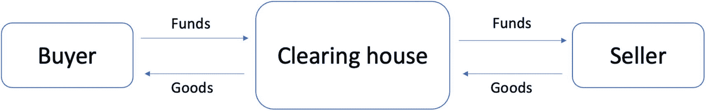

一个框图。买方将资金交给清算所。清算所将资金交给卖方。卖方将货物交给清算所。清算所将货物交给买方。

**图 3-1**

**说明清算所在期货市场中作为买卖双方中介的角色**

## 逐日盯市

逐日盯市涉及更新期货合约的价格以反映其当前市场价值而非账面价值，从而确保证金要求得到满足。如果期货合约的当前市场价值导致保证金账户低于其要求的水平，交易者将收到交易所发出的追加保证金通知，以补足剩余余额。

逐日盯市是每个交易日结束时对期货合约进行定价的过程。对持有未平仓期货头寸的账户而言，逐日盯市中的现金调整反映了根据产品结算价确定的当日损益，该结算价由交易所决定。由于逐日盯市调整会影响期货账户中的现金余额，因此账户的保证金要求需要每日进行评估，以继续持有未平仓头寸。

让我们看一个逐日盯市的例子，并了解因标的资产价格波动导致的期货合约每日价格变化。首先，注意期货合约双方的对手方，即多头仓位交易者和空头仓位交易者。多头交易者因预期标的资产价格上涨而看涨，而做空合约的交易者则因预期标的资产价格下跌而被视为看跌。

期货合约的价值在交易日结束时可能上涨或下跌。当其价格上涨时，由于逐日盯市，多头保证金账户价值增加，当日收益记入多头仓位交易者的保证金账户。相应地，对手方的空头仓位交易者将遭受等额损失，该损失从其保证金账户中扣除。

类似地，当期货合约价格下跌时，由于逐日盯市，多头保证金账户价值减少，当日损失从多头仓位交易者的保证金账户中扣除。这笔金额将记入空头仓位交易者的保证金账户，后者将实现等额收益。

通过更新期货合约价格以反映其当前市场价值，交易所可以实时监控交易者的风险敞口。这有助于确保保证金要求得到满足，并确保交易者有足够的资金来覆盖其仓位，这从根本上降低了交易者的风险敞口。这同时也使交易者能够准确评估其损益，并对其仓位做出明智决策。

图 3-2 展示了在同一期货合约中持有未平仓头寸的两类交易者，以及他们因逐日盯市而产生的各自损益。

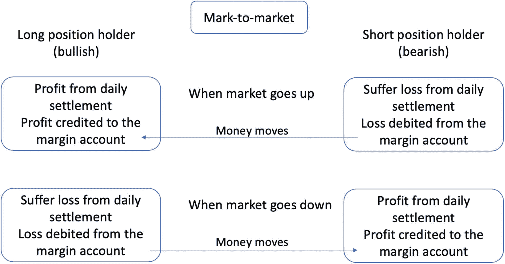

一个框图展示了因逐日盯市而产生损益的两种交易者。当市场上涨时，空头仓位持有者遭受损失。资金流向多头仓位持有者。当市场下跌时，多头仓位持有者遭受损失。资金流向空头仓位持有者。

**图 3-2**

**说明逐日盯市过程及其对同一期货合约的多头和空头仓位交易者保证金账户产生的影响**

为了更好地理解交易所每日盯市制度对不同持仓交易者日常动态的影响，让我们看一个具体例子。如图 3-3 所示，我们绘制了多头和空头持仓者保证金账户的每日金额。两位交易者的初始保证金账户金额均为`$100`。鉴于第 1 天资产价值上涨，多头持仓者的保证金账户增加了`$5`（`$100 + $5 = $105`），而空头持仓者的保证金账户减少了`$5`（`$100 – $5 = $95`）。第 2 天，多头保证金账户的净变动为–`$20`，使其从`$105`降至`$85`，低于`$90`的最低要求（称为维持保证金）。多头交易者随后收到交易所的追加保证金通知，并补足`$15`，将其保证金账户增至`$100`，以满足初始保证金要求。空头交易者总共获利`$20`，当天结束时其保证金账户余额为`$115`。

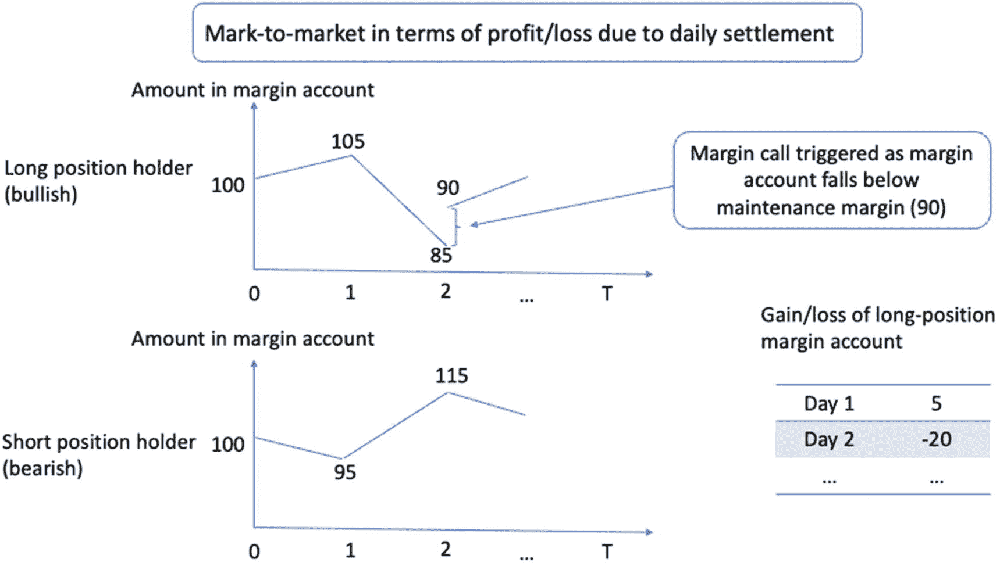

2 条保证金账户金额随时间变化的折线图。1. 对于多头持仓者，折线经过点(0, 100)、(1, 105)和(2, 85)。2. 对于空头持仓者，折线经过点(0, 100)、(1, 95)和(2, 115)，并呈线性下降趋势。

**图 3-3**

因盯市操作导致多头和空头持仓者保证金账户每日变化的示例

请注意，由于盯市操作产生的盈亏，保证金账户余额每日都会发生变化。尽管在交割日的最终结算价格可能与建立期货头寸时的预期价格不同，但双方交易者最终仍会以等于初始预期价格的有效价格进行交易，从而对冲价格波动的风险。

现在让我们来看看如何对这份衍生产品进行定价，从它的相似孪生兄弟——远期合约开始。

### 远期合约定价

远期合约是双方之间的一份可定制合约，约定在未来某一日期以指定价格买入或卖出某项资产。与每日结算直至合约结束的期货合约不同，远期合约仅在协议结束时结算，并且是在场外交易。因此，它更容易定价。

远期合约的价格是由买卖双方决定的标的资产的预定交割价格。这是将在未来预定日期支付的价格，由以下公式确定：

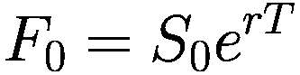

其中，`F[0]`是当前时间点`t = 0`时远期合约的价格，`S[0]`是`t = 0`时标的资产的价格。`r`是无风险债券利率，即零风险投资的理论回报率。`T`是当前时间点`t = 0`到到期日`t = T`的持续时间。更一般地，我们可以将远期合约的价格写为：

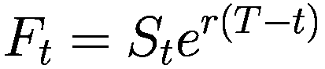

这里，乘以指数常数仅仅意味着根据基准利率`r`和持续时间`T − t`，以连续复利方式增加远期合约的价格。换句话说，假设我们在银行存款`$1000`，银行承诺以连续复利利率`r`计息。那么我们可以预计，在第 1 年末存款总价值将增长到`1000*e^r`，在第 2 年末增长到`1000*e^(2r)`，以此类推。这是财务和会计中常见的一种复利计算方式。

现在让我们看看这个公式是如何形成的。其推理遵循无套利论据，该论据指出，无论标的资产价格如何变化，都不存在任何套利机会来赚取无风险利润。假设我们签订了一份远期多头合约，该合约要求我们在时间`T`以价格`F[T]`购买资产`S`。我们生活在当前时间点`t`，此时资产的现货价格为`S[t]`，资产的未来价格将为`S[T]`。协议的性质决定了我们在交割日的行动；因此，我们需要支付`F[T]`的金额来购买价值`S[T]`的资产。换句话说，我们在时间`T`的净利润/亏损（P&L）为`−F[T] + S[T]`，其中负号表示现金流出。请注意，这发生在未来的时间`T`，而不是当前的时间`t`。

然而，签订这份合约存在风险。由于未来资产价格会波动，资产价格可能因未来不可预见的情况而大幅下跌，导致交割时的 P&L 非常负面。尽管也可能出现相反情况，最终 P&L 可能非常正面，但这仍然构成潜在风险，尤其是对于前文提到的农民和制造商等市场参与者而言。

为了对冲这种风险，我们可以在时间`t`做空一单位该资产，因为我们知道如果资产价格下跌，空头头寸就能获利。标的资产的空头头寸使我们能够从未来因资产价格下跌而遭受的损失中获利。之所以是一单位标的资产，是因为我们可以利用根据远期协议购买的那一单位资产来平掉标的资产的初始空头头寸，即将资产归还给出借方。

现在我们更详细地审视这个过程。在时间`t`建立一单位标的资产的空头头寸时，我们会获得`S[t]`的现金流入，因为做空意味着卖出资产并在日后买回。这意味着在交割日，我们将有`S[T]`的现金流出，用于归还资产并平掉空头头寸。

请注意，在时间 `t` 的现金 `S[t]` 不会闲置。相反，我们会将这笔现金进行投资，例如存入银行以享受无风险利率。在到达交割日时，这笔资金将增值为 `S[t] * e^(r * (T - t))`，投资期为 `T - t`。这项投资将用于平仓标的资产的空头头寸。

图 3-4 总结了随着时间推移，不同产品头寸及投资组合总价值的变化。此处，我们的投资组合中包含三种不同的产品：一份远期合约、一项资产（例如一股股票）和现金。这三者构成了我们的投资组合，并且在时间 `t` 时投资组合的初始价值为零。要理解这一点，我们观察到：远期头寸在时间 `t` 时价值为零，因为我们仅在到达交割日时才进行交易。股票头寸的价值为 `-S[t]`，因为我们正在做空该股票；而现金头寸的价值为 `S[t]`，即通过做空股票所产生的收入。将这三个头寸的价值相加，得到时间 `t` 时投资组合的价值为零。因此，时间 `t` 时的净现金流为零。

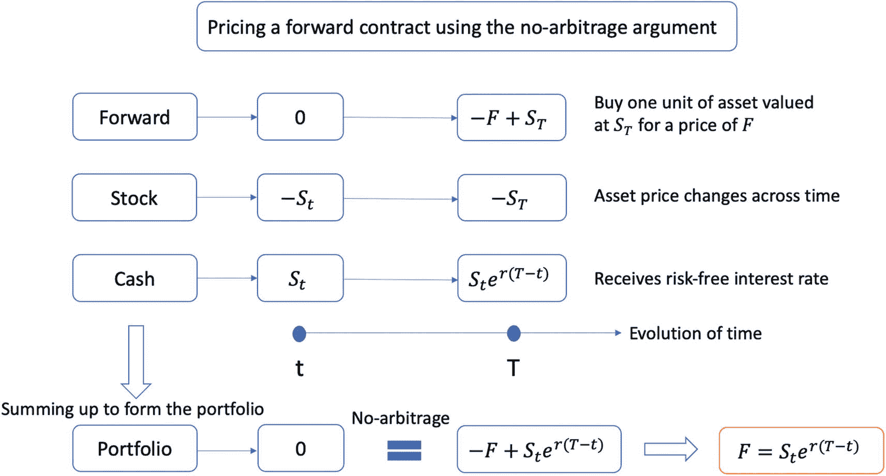

```
一个流程图。远期：从 0 到负 F 加 S T。股票：从负 S t 到负 S T。现金：从 S t 到 S t 乘以 e 的 r 乘以 T 减 t 次方。远期、股票和现金相加构成一个投资组合，其价值从 0 开始，通过无套利论证得到 F 等于 S t 乘以 e 的 r 乘以 T 减 t 次方。
```

**图 3-4**

利用无套利论证为多头头寸的远期合约定价。股票头寸和现金头寸还共同构成了一个复制投资组合，该组合抵消了远期合约在交割日收益函数中的随机性。

随着时间的推移，每个头寸的价值都会发生变化。具体来说，远期头寸变为 `-F + S[T]`，因为我们将以价格 `F` 买入价值为 `S[T]` 的一项资产。我们的股票头寸因股票价格变动而变为 `-S[T]`，现金头寸则变为 `S[t] * e^(r * (T - t))`。

现在，利用无套利论证，由于我们从零价值开始，最终我们的投资组合价值将归零。将时间 `T` 时这三个头寸的价值相加，得到投资组合的总价值为 `-F + S[t] * e^(r * (T - t))`。令该值等于零，我们得到 `F = S[t] * e^(r * (T - t))`，从而利用无套利论证完成了远期合约的定价。

这就是远期合约价格的公式。它表明，远期价格由标的资产的当前价格、无风险利率以及距合约到期的时间共同决定。通过使用该公式，远期合约的双方可以商定一个公平价格，该价格消除了套利机会，并反映了标的资产的真实价值。

有趣的是，股票头寸和现金头寸共同构成了一个复制投资组合，该组合抵消了远期合约在交割日收益函数中的随机性。这意味着，无论未来远期合约的价格如何，我们总能利用另一个复制投资组合来提供相同的收益，仿佛我们身处远期合约的多头头寸中。这被称为通过复制进行定价。

让我们看看，如果远期价格不等于以连续复利计算的股票价格，会发生什么。我们可以基于“低买高卖”原则从无风险利润中论证套利机会。当 `F > S[t] * e^(r * (T - t))` 时，我们可以借入金额 `S[t]`，并用这笔钱做空一份允许我们以价格 `F` 出售一单位标的资产的远期合约。到达交割日时，我们通过出售资产获得总额 `F`，偿还借入的本金及利息 `S[t] * e^(r * (T - t))`，并获得净利润 `F - S[t] * e^(r * (T - t))`。这就是套利：我们通过利用未来时间 `T` 的价格差异获得了无风险利润。

类似地，当 `F < S[t] * e^(r * (T - t))` 时，远期合约更便宜，而资产更贵。在这种情况下，我们同样运用“低买高卖”原则，在时间 `t` 做多一份远期合约，该合约允许我们在时间 `T` 以价格 `F` 购买一单位标的资产。同时，我们将在时间 `t` 做空一单位标的资产，获得总额 `S[t]`，该金额在到达交割日时进一步增值为 `S[t] * e^(r * (T - t))`。当合约到期时，我们将通过以价格 `F` 购买一单位资产来平仓标的资产的空头头寸。我们将保留余额 `S[t] * e^(r * (T - t)) - F`，从而同样建立了套利论证，并确保了无风险利润。

请注意，期货价格等于当前时间 `t` 标的资产的现货价格。要理解这一点，只需令 `T = t`，则我们得到 `F = S[t] * e^(r * (t - t)) = S[t]`。

简而言之，未来预先确定或固定的净现金流（在今日确定）必须等于今日的净现金流，以消除套利机会。无套利论证为远期合约提供了一个公平的价格。

### 期货合约定价

期货合约的定价方式与远期合约类似，但涉及更多因素。从根本上说，期货合约的价格由市场供求关系决定。当卖方和买方就交易期货合约的均衡价格达成一致时，该价格即为期货合约价格。

假设我们要为下一个月的期货合约（近月合约）定价。同时，假设我们持有期货合约的空头头寸，有义务在到期日卖出一单位标的资产。这里需要考虑的额外因素是持有资产至到期日的成本和收益。

对于持有资产至交割日的成本，我们需要将其计入期货合约的价格，因为从建仓到交割日期间，这构成了我们必须考虑的实际成本。例如，如果做空一份在 `T` 时点卖出 1000 桶原油的期货合约，我们会借钱在 `t` 时点从现货市场购买 1000 桶原油，以便能在 `T` 时点履行义务。这样做需要储存这 1000 桶原油，由此产生的存储成本需计入期货合约价格。

对于持有资产至交割日的收益，我们需要从期货合约价格中扣除。这被称为便利收益，即持有标的资产的一方在直至交割日的过程中所获得的利益。这种情况通常发生在持有实物资产更有利时。例如，持有股票可能产生股息支付；持有货币可能因利率差异而产生利润；当市场对某种商品供不应求时，持有该商品则更为有利。

基于现货价格并考虑复利效应，期货合约的合理价格可通过以下公式计算：

合理价格 = 复利后的现货价格 + 存储成本 – 持有资产带来的便利收益

当利率、成本及便利收益均按年复利计算时，期货合约的合理价格可通过以下公式计算：

```
F = S_t * (1 + r + s - c)^(T - t)
```

其中，`S[t]` 是标的资产的现货价格，`r` 是无风险债券利率，`s` 是以百分比表示并按年复利的存储成本，`c` 也是以百分比表示并按年复利的便利收益。我们将其提升至期限 `T - t` 的幂次，以展示该期间的复利效应。

该公式表明，期货合约价格考虑了以下几个因素：标的资产的现货价格、无风险利率、存储成本以及便利收益。这些组成部分有助于市场参与者确定期货合约的合理价格，该价格反映了标的资产的真实价值，同时考虑了持有资产至交割日的成本与收益。

期货合约价格对于买方和卖方都至关重要，因为它决定了他们在订立期货合约时潜在的盈利或亏损。通过了解期货合约价格的计算方式，市场参与者可以就是否以某个价格订立期货合约做出明智的决策。

还需注意，期货合约的合理价格是一个理论值。在现实中，市场的实际期货合约价格会受到供求动态的影响，这可能导致市场价格偏离合理价格。市场参与者需要持续监控期货市场，关注标的资产现货价格、利率、存储成本和便利收益的变化，以便调整策略，并就期货合约持仓做出明智的决策。

让我们看一个例子。假设当前现货价格为 `S[t] = $80`，利率为 `r = 2%`，存储成本为 `s = 1%`，便利收益为 `c = 0.5%`，期货合约持仓期限为三个月。由于复利是按年计算的，我们需要将期限转换为年化值，即 `T - t = 3/12 = 0.25`。因此，期货合约的合理价格可计算如下：

```
F = 80 * (1 + 0.02 + 0.01 - 0.005)^(0.25) = $80.5
```

图 3-5 总结了计算期货合约合理价格的过程。

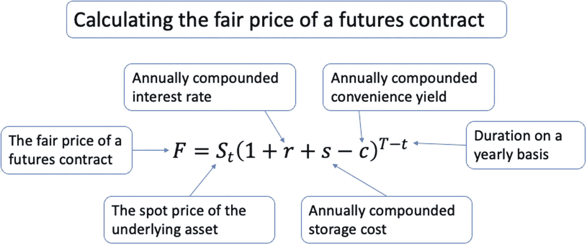

*一个带有变量标注的合理价格等式。`F` 等于 `S[t]` 乘以 `1 + r + s - c` 的 `T - t` 次幂。标注的变量分别为：合理价格、标的资产现货价格、按年复利的利率、便利收益、存储成本以及按年计算的期限。*

**图 3-5** – 在利率、存储成本和便利收益均按年复利的情况下，计算期货合约的合理价格。

#### 期货升水与期货贴水

期货世界中经常用到一些特殊术语。这些术语列举如下，其中期货升水在某种程度上与期货贴水相反：

- **期货升水**：期货合约价格高于标的资产的当前现货价格。

- **正常期货升水**：期货合约价格高于标的资产的预期现货价格。

- **期货贴水**：期货合约价格低于标的资产的当前现货价格。

- **正常期货贴水**：期货合约价格低于标的资产的预期现货价格。

仔细审视这些术语有助于我们更好地理解期货合约的价格动态。我们先从期货升水说起。当我们说某个特定期货合约的市场处于期货升水状态时，这意味着我们有一条向上倾斜的期货价格曲线。这里，期货价格曲线指的是在当前时间点，不同交割日期的期货合约的（递增）价格。期限较长的期货合约比期限较短的期货合约更昂贵。此外，当我们说市场处于正常期货升水状态时，这意味着期货价格高于（理论上的）预期现货价格。期货价格曲线上的不同价格点对应着价格随时间变化的不同路径，最终期货合约的结算价格会在相同的（未来）交割日期与现货价格趋同。

期货升水或期货贴水的存在可能有多种潜在原因。例如，仓储成本、季节性因素、市场预期以及宏观经济因素都可能导致期货市场出现这些定价模式。

期货升水通常出现在持有和储存标的资产（如石油或谷物）需要成本的商品市场中。这些成本被计入期货合约价格，导致其高于当前现货价格。当市场参与者预期标的资产价格未来会上涨时，也可能出现期货升水，导致他们抬高较长交割期期货合约的价格。

另一方面，当市场参与者认为标的资产价格未来会下跌时，就可能出现期货贴水。这可能是由于预测需求下降或预期供应增加所致。在这种情况下，市场参与者可能更愿意以低于当前现货价格的价格出售期货合约，因为他们预期未来现货价格会下跌。

图 3-6 提供了一个示例，帮助我们从不同角度理解这些说法。此处，我们分别有交割日期前一个月和两个月到期的两种期货合约。处于期货升水的市场意味着随着期限延长，期货合约价格曲线呈上升趋势，如图左面板所示。随着资产价格随时间开始变动（如橙色点起始的曲线所示），期货合约价格将逐渐接近现货价格。最终，当交割日期即当前日期时，期货价格将等于现货价格。

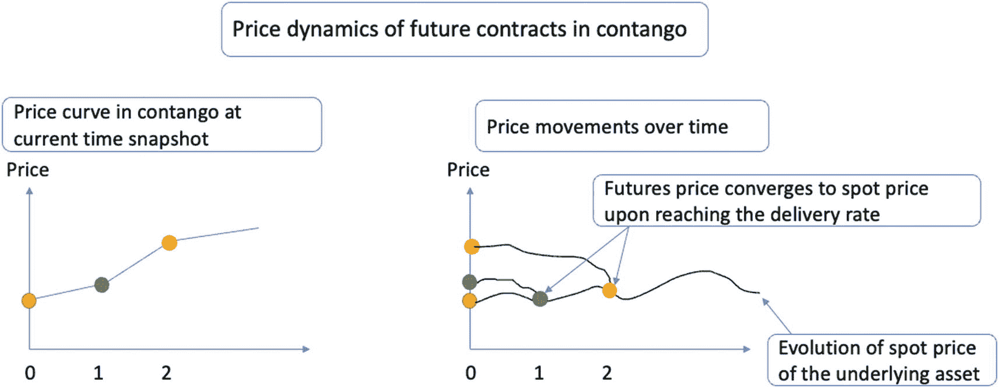

两张价格与时间的关系折线图。1. 该图有一条上升曲线。2. 该图有两条下降曲线和一条波动的上升曲线。它表示了标的资产现货价格的演变点。期货价格在达到交割日期时与现货价格趋同。

**图 3-6** — 说明期货升水状态下期货合约的价格动态。左面板显示了当前时间点的价格曲线，其中交割日期较长的期货合约价格更高。右面板显示了资产和不同交割日期期货合约的价格演变，每个合约在到达相应交割日期时都与现货价格趋同。

相应地，处于期货贴水状态的市场则表现出相反的行为，如图 3-7 所示。

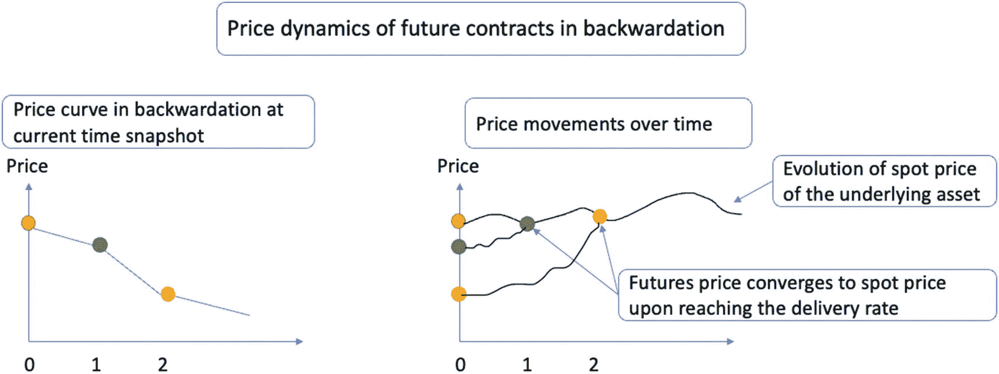

两张价格与时间的关系折线图。1. 该图有一条下降曲线。2. 该图有三条波动的上升曲线。它表示了标的资产现货价格的演变点。期货价格在达到交割日期时与现货价格趋同。

**图 3-7** — 说明期货贴水状态下期货合约的价格动态。

#### 处理期货数据

我们可以使用 `yfinance` 包获取期货数据。在代码清单 3-1 中，我们下载了 2022 年铂金的期货数据。请注意，其代码为 `PL=F`。下载数据集后，我们将索引重写为 `datetime` 格式，以便于绘图，如代码清单 3-1 所示。

```python
#### 用于数据处理
import pandas as pd
#### 用于获取金融数据
import yfinance as yf
#### 用于可视化
import matplotlib.pyplot as plt
plt.style.use('seaborn-darkgrid')
%matplotlib inline
#### 下载铂金价格
futures_data = yf.download("PL=F", start="2022-01-01", end="2022-12-31")
#### 将索引设置为 datetime 类型
futures_data.index = pd.to_datetime(futures_data.index)
```

代码清单 3-1 下载期货数据

让我们通过代码清单 3-2 绘制收盘价。请注意在调整图中字体大小时 `fontsize` 参数的使用。

```python
#### 绘制收盘价
plt.figure(figsize=(15, 7))
futures_data['Adj Close'].plot()
#### 设置标题及坐标轴的标签和大小
plt.title('铂金期货数据', fontsize=16)
plt.xlabel('年份', fontsize=15)
plt.ylabel('价格 ($)', fontsize=15)
plt.xticks(fontsize=15)
plt.yticks(fontsize=15)
plt.legend(['收盘价'], prop={'size': 15})
#### 显示图表
plt.show()
```

代码清单 3-2 可视化期货数据

运行此命令将生成图 3-8。

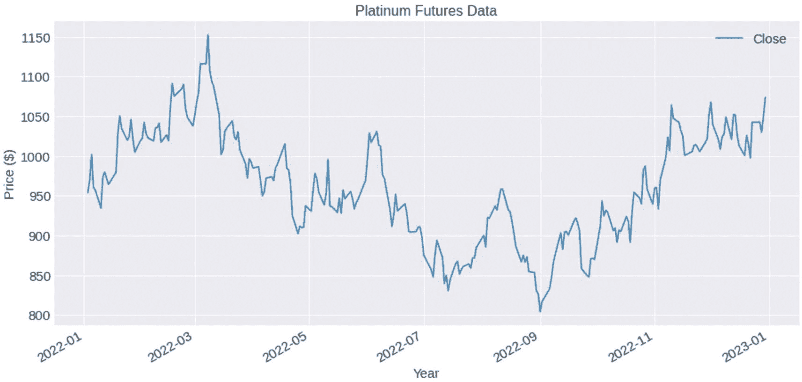

一张显示收盘价与年份关系的折线图。图上有一条上下波动的曲线，呈现先升、后降、再升的态势。

图 3-8 2022 年铂金期货数据收盘价可视化

我们还可以一次性下载多个期货合约。在代码清单 3-3 中，我们分别使用代码 `GC=F` 和 `HG=F` 下载黄金和铜的期货数据，随后对索引进行格式化并打印最后五行。

```python
#### 获取黄金和铜的期货价格
futures_data = yf.download(["GC=F","HG=F"], start="2022-01-01", end="2022-12-31", group_by= 'tickers')
#### 将索引设置为 datetime 类型
futures_data.index = pd.to_datetime(futures_data.index)
#### 显示最后五行
futures_data.tail()
```

代码清单 3-3 下载多个期货数据

请注意，该 `DataFrame` 具有两层级列，第一层级指定代码名称，第二层级显示不同的价格点。

类似地，我们可以绘制这两组期货数据的收盘价，如代码清单 3-4 所示。

```python
#### 设置图形大小
ax = plt.figure(figsize=(15, 7))
#### 绘制两个期货的收盘价
ax = futures_data['GC=F']['Close'].plot(label='黄金期货')
ax2 = futures_data['HG=F']['Close'].plot(secondary_y=True, color='g',  ax=ax, label='铜期货')
#### 设置标题及坐标轴标签和大小
plt.title('黄金与铜期货数据', fontsize=16)
ax.set_xlabel('年-月', fontsize=15)
ax.set_ylabel('黄金价格 ($)', fontsize=15)
ax2.set_ylabel('铜价格 ($)', fontsize=15)
ax.tick_params(axis='both', labelsize=15)
ax2.tick_params(axis='y', labelsize=15)
h1, l1 = ax.get_legend_handles_labels()
h2, l2 = ax2.get_legend_handles_labels()
ax.legend(h1+h2, l1+l2, loc=2, prop={'size': 15})
#### 显示图表
plt.show()
```

代码清单 3-4 可视化多个期货时间序列

运行此命令将生成图 3-9。

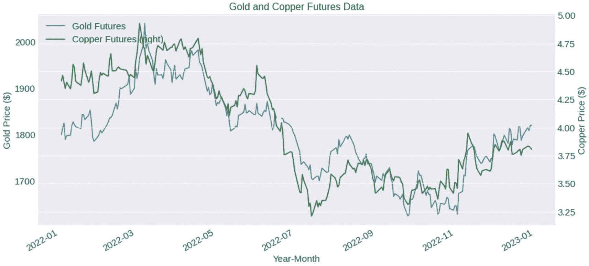

一张黄金和铜价格与年-月关系的双 y 轴折线图。图上有两条上下波动的曲线，呈现先升、后降、再升的态势。

图 3-9

2022 年黄金与铜期货数据收盘价可视化

## 添加技术指标

在本节中，我们将研究流行的标普 500 E-迷你期货合约，并讨论如何添加常见的技术指标以辅助技术分析。标普 500 E-迷你期货是一种金融衍生品，追踪代表美国 500 家最大上市公司的标普 500 指数的表现。E-迷你期货合约是标准标普 500 期货合约的缩小版，使其对个人交易者和投资者来说更容易获得且更经济实惠。

让我们使用代码 `ES=F` 获取该特定合约在 2022 全年的每日期货数据，如代码清单 3-5 所示。

```
futures_symbol = "ES=F"
futures_data = yf.download(futures_symbol, start="2022-01-01", end="2022-04-01", interval="1d")
```

代码清单 3-5
下载标普 500 E-迷你期货数据

现在让我们使用 `ta` 库计算几个技术指标。在本例中，我们将计算相对强弱指数（RSI）、布林带和 MACD（移动平均收敛散度指标）。以下列表简要描述了这些流行的技术指标：

- **相对强弱指数（RSI）**：RSI 是一种动量震荡指标，用于衡量价格变动的速度和变化。RSI 在 0 到 100 之间震荡，当 RSI 高于 70 时，交易者通常认为资产超买；低于 30 时，则认为超卖。

- **布林带**：布林带是一种衡量价格变动标准差的波动率指标。该指标由三条线组成：中线（一条简单移动平均线）和两条外线（上轨和下轨），绘制在距移动平均线指定数量的标准差处。当布林带变宽时，表明波动性增加；当布林带收窄时，则表明波动性降低。价格通常在上轨和下轨之间移动。

- **移动平均收敛散度指标（MACD）**：MACD 是一种动量指标，显示资产价格两条移动平均线之间的关系。它由两条线组成：MACD 线（短期与长期移动平均线的差值）和信号线（MACD 线的移动平均线）。当 MACD 线上穿信号线时，可能暗示看涨信号（买入）；当它下穿信号线时，可能表明看跌信号（卖出）。此外，当 MACD 线位于零轴上方时，表明上行势头；位于零轴下方时，则表明下行势头。

代码清单 3-6 计算了这些技术指标并将它们合并到 `DataFrame` 中。

```
#### 计算 RSI
futures_data["RSI"] = ta.momentum.RSIIndicator(futures_data["Close"]).rsi()
#### 计算布林带
bbands = ta.volatility.BollingerBands(futures_data["Close"])
futures_data["BB_upper"] = bbands.bollinger_hband()
futures_data["BB_lower"] = bbands.bollinger_lband()
#### 计算 MACD
macd = ta.trend.MACD(futures_data["Close"])
futures_data["MACD"] = macd.macd()
futures_data["MACD_signal"] = macd.macd_signal()
```

代码清单 3-6
计算常见技术指标

现在我们可以将原始的期货时间序列数据与技术指标一同绘制，以辅助分析，如代码清单 3-7 所示。

```python
#### 为每个指标创建子图
fig, axes = plt.subplots(4, 1, figsize=(10, 15), sharex=True)
#### 绘制收盘价
axes[0].plot(futures_data.index, futures_data["Close"], label="收盘价")
axes[0].set_title("标普 500 E-迷你期货 - 收盘价")
axes[0].grid()
#### 绘制 RSI
axes[1].plot(futures_data.index, futures_data["RSI"], label="RSI", color="g")
axes[1].axhline(30, linestyle="--", color="r", alpha=0.5)
axes[1].axhline(70, linestyle="--", color="r", alpha=0.5)
axes[1].set_title("相对强弱指数 (RSI)")
axes[1].grid()
#### 绘制布林带
axes[2].plot(futures_data.index, futures_data["Close"], label="收盘价")
axes[2].plot(futures_data.index, futures_data["BB_upper"], label="布林带上轨", linestyle="--", color="r")
axes[2].plot(futures_data.index, futures_data["BB_lower"], label="布林带下轨", linestyle="--", color="r")
axes[2].set_title("布林带")
axes[2].grid()
#### 绘制 MACD
axes[3].plot(futures_data.index, futures_data["MACD"], label="MACD", color="b")
axes[3].plot(futures_data.index, futures_data["MACD_signal"], label="信号线", linestyle="--", color="r")
axes[3].axhline(0, linestyle="--", color="k", alpha=0.5)
axes[3].set_title("指数平滑异同移动平均线 (MACD)")
axes[3].grid()
```

清单 3-7
可视化期货数据与技术指标

运行代码将生成图 3-10。

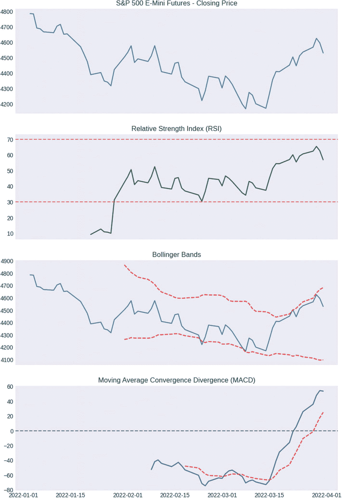

4 条折线图。1\. 收盘价与天数呈波动下降曲线。2\. 相对强弱指数与天数呈波动上升曲线。3\. 布林带与天数呈 3 条波动下降曲线。4\. MACD 与天数呈 2 条波动上升曲线。

图 3-10

可视化期货数据与技术指标

我们可以在这里绘制一些图表。在绘制的 RSI 图中，我们可以观察到 RSI 跌破 30 的时期，这可能预示着潜在的超卖状况。交易者可能会利用这些信号来考虑建仓或平仓。在绘制的布林带图中，我们可以看到价格触及或穿越布林带的时期，这可能预示着潜在的趋势反转或支撑与阻力位。在 MACD 图中，我们可以观察到 MACD 线穿越信号线的时期，这可能为交易者提供潜在的入场或出场信号。

## 本章小结

在本章中，我们深入探讨了期权和期货合约的世界。

远期合约是双方之间定制化的私人协议，在场外交易（OTC）市场进行。它们仅在协议结束时结算，其定价基于标的资产的现货价格、无风险利率以及到期时间。然而，由于没有清算所来保证合约义务的履行，远期合约存在潜在的对手方风险。

相比之下，期货合约是在受监管交易所交易的标准合约。它们每日按市价结算，意思是合约价格会被调整以反映其当前市场价值，确保满足保证金要求。期货交易所的清算所作为买卖双方之间的中介，降低了对手方风险并确保了市场的稳定性。

我们还涵盖了这两种合约的定价。例如，期货合约的定价受标的资产现货价格、无风险利率、存储成本和便利收益等因素影响。此外，期货市场可能出现期货价格高于现货价格的升水（contango）情况，或期货价格低于现货价格的贴水（backwardation）情况。

## 练习题

*   一位农民销售农产品，而一位制造商采购原材料用于生产。在这两种情况下，为了对冲未来不利的价格变动，他们应该在期货合约中分别持有何种头寸？

*   一位麦农在第 1 天持有 10 份小麦期货合约的空头头寸，每份合约价值 4.5 美元，代表 5000 蒲式耳。如果第 2 天期货合约价格上涨至 4.55 美元，该农民的保证金账户会发生什么变化？

*   假设我们签订了一份远期空头合约。未来资产价格波动会带来什么风险？我们如何对冲该风险？

*   假设今天我们能够以 80 美元购买一桶石油，而当前三个月后交割的期货价格为 85 美元。一份期货合约可以购买 1000 桶石油。在这种情况下，你如何进行套利？利润是多少？假设无风险利率为零。

*   运用相同的无套利论证来对一份空头远期合约进行估值。

*   编写一个函数，根据资产的现货价格、无风险利率、存储成本率、便利收益和交割日期，计算期货合约的公允价格。允许按年复利和连续复利两种方式计算。

*   解释当远期合约的定价高于或低于其理论无套利价值时，无风险利润的来源。