# 4. 理解风险与回报

任何金融资产都具有其特征性的风险与回报。回报是指其带来的财务收益，例如资产价值的百分比增长。我们希望尽可能最大化资产的百分比回报。然而，更高的回报往往伴随着更高的风险，这里的风险指的是这种回报的波动性。也就是说，一项资产在其历史回报中表现出剧烈波动，使其未来前景比诸如债券之类稳定、与预期收益偏差很小的产品更具不确定性。作为投资者，获利的目标归结为在最大化回报的同时，最小化风险。

回报是衡量某项投资在特定时期内财务收益或损失的指标。它可以按初始投资额的百分比计算，并考虑资本增值、股息和利息支付等因素。回报可以是已实现的（已收到）或未实现的（预期在未来收到）。有多种衡量回报的方法，包括绝对回报、年化回报和风险调整后回报。

风险是投资回报的波动性或不确定性。它代表因市场波动、经济状况和公司特定事件等因素造成潜在损失的可能性。风险有多种类型，包括市场风险、信用风险、流动性风险和操作风险等。通常，风险较高的投资往往会提供更高的潜在回报，以补偿这种增大的不确定性。


## 风险与回报的权衡

在风险与回报的权衡中，低回报资产通常伴随着低风险，而高回报资产则伴随着高风险。这对于市场上的大多数金融工具都适用。例如，债券作为一种固定收益资产，通常被视为无风险资产，提供较低的回报且几乎不承担风险。股票市场提供更高的回报，但由于未来的不确定性和不可预测性，往往表现出更高的波动性。在这种权衡下，投资者只有愿意承担更多风险（即更高的亏损概率），才能获得更高的回报并赚取更多利润。

适当的风险-回报权衡取决于多种因素，包括投资者的风险承受能力、距离退休的年数以及弥补损失资金的潜力。这种权衡还取决于特定持仓的时间跨度。例如，头寸交易者通常会长期持有一个头寸，这使交易者有机会从熊市风险中恢复过来，并参与牛市行情，期望资产价值在长期内增长。另一方面，波段交易者甚至日内交易者则会短期持有头寸，通过投机资产价格变动来寻求利润。当投资者只能进行短期投资时，同一类股票（例如普通股）会带来更高的风险。

需要注意的是，每项单独资产都有其自身的风险和回报特征，而一组资产可以形成一个具有全新风险和回报特性的投资组合。在投资组合层面，风险-回报权衡评估的是持仓的集中度或分散度，以及投资组合的构成是否带来过高风险或回报潜力低于预期。因此，风险-回报权衡既适用于单一资产，也适用于资产组合。

然而，一个多元化的投资组合通常能降低单个投资头寸所带来的风险。跨不同资产类别、行业和地域进行多元化配置，有助于减轻表现不佳的资产对整体回报的影响，从而提供一种更均衡的风险管理方法。更好地理解风险-回报权衡以及各种多元化策略，使我们能够量身定制投资组合，以实现预期的财务目标，同时有效管理与投资相关的固有风险。

让我们绘制一个二维坐标系来表征风险与回报。我们通常将风险放在横轴上，回报放在纵轴上。如图 4-1 所示，左下象限代表低风险和低回报。代表性产品包括固定收益工具，如债券和国库券。移至右上象限，则是与高风险和高回报相关的产品，例如股票和衍生品。另外两个象限则较少见。例如，很难看到低风险高回报的金融工具。公司可能急需资金，从而发行回报率较高的债券，但陷入这种状况本身已经意味着违约风险的增加。另一方面，出现低回报但高风险的产品可能性极低，因为这有悖于交易追求利润最大化的本质。

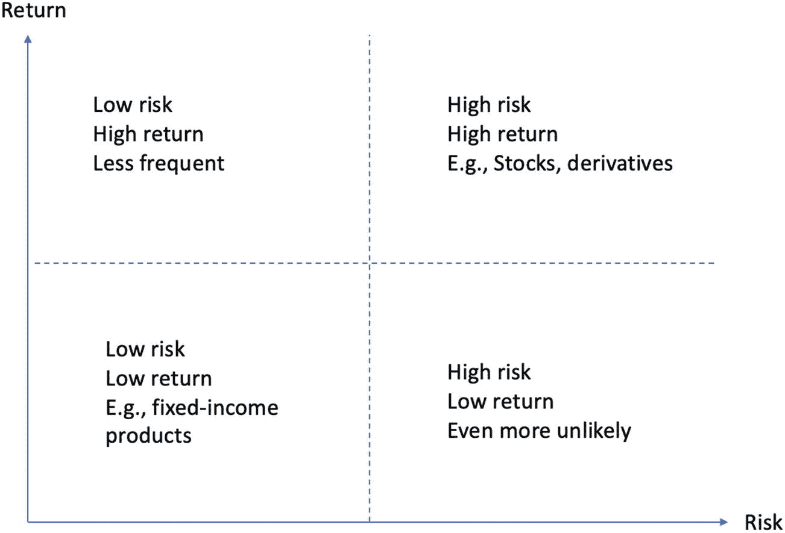

一个回报与风险平面被分为四个象限。从右上角顺时针看：高回报高风险，例如股票和衍生品；高风险低回报，甚至更常见；低风险低回报，例如固定收益产品；低风险高回报，较为少见。

**图 4-1**  
说明风险和回报特征的四个象限

在下一节中，我们将首先理解作为金融资产绩效衡量标准的回报的基本原理。理解回报对于我们评估不同投资的成功程度，并在管理投资组合时做出明智的决策至关重要。

## 分析回报

回报是大多数投资者在考察特定投资工具时首要关注的指标。它表示金融资产在特定时期内的价值变化。它可以以绝对数值（例如，盈利或亏损的美元金额）或初始投资价值的百分比来表示。作为衡量资产或投资组合绩效的关键指标，回报使我们能够进行跨投资比较。

当以百分比衡量时，其范围理论上可以从负无穷到正无穷。假设资产价格从 `S[t - 1]` 变为 `S[t]`。价格变动为 `S[t] - S[t - 1]`，可能是正值或负值。考虑到资产价格在不同时间点会变化，并且多种资产具有不同的价格水平，很难评估价格变动 `S[t] - S[t - 1]` 是大还是小。为了标准化这些价格变动并使其更易于比较，一个更广泛使用的衡量标准是百分比回报 `R[t]`，其定义如下：

```
R_t = (S_t - S_{t-1}) / S_{t-1}
```

这个公式本质上衡量的是资产价格变动相对于前一时期资产价格（即基准）的比例。它使我们能够从价格过渡到回报。因此，这种资产价格的百分比变化能够让我们评估和比较不同的资产。通过计算百分比回报 `R[t]`，我们可以有效地将关注点从原始价格变动转移到资产价格的比例变动上。这种转变使我们能够相对于基准（即前一时期的资产价格）来评估不同投资的表现。当评估具有不同价格水平或经历不同幅度价格波动的投资时，这种标准化尤其有用。

请注意，我们也可以将回报写作 `R[t - 1, t]`，以强调回报衡量的是从 `t - 1` 时期到 `t` 时期价格的相对变化：

```
R_{t-1,t} = (S_t - S_{t-1}) / S_{t-1}
```

让我们分析一些模拟的回报数据，使这些计算更加具体。


### 处理模拟收益率

在代码清单 4-1 中，我们首先创建了两个包含五个元素（或五个周期）的列表，分别代表两种不同资产的收益率，并分别存储在 `asset_return1` 和 `asset_return2` 中。我们构造的收益率使得它们的平均收益率相同。我们可以使用 `==` 运算符来验证这一相等性。

```
asset_return1 = [0.05, 0.3, -0.1, 0.35, 0.2]
asset_return2 = [0.5, -0.2, 0.3, 0.5, -0.3]
>>> print(np.mean(asset_return1))
>>> print(np.mean(asset_return2))
>>> print(np.mean(asset_return1) == np.mean(asset_return2))
0.16
0.16
True
代码清单 4-1
模拟两种资产的收益率
```

接下来，我们将这两个列表合并到一个 Pandas DataFrame 中，以便于操作。这可以通过将两个列表包装在一个字典中，并将其传递给 `pd.DataFrame()` 函数来实现：

```
return_df = pd.DataFrame({"Asset1":asset_return1, "Asset2":asset_return2})
>>> return_df
```

打印 `return_df` 变量会生成以下内容，两个列表现在显示为 DataFrame 中的两列：

```
Asset1 Asset2
0      0.05   0.5
1      0.30  -0.2
2     -0.10   0.3
3      0.35   0.5
4      0.20  -0.3
```

为了便于可视化分析，我们使用 `.plot.bar()` 方法将这两个收益率序列绘制成条形图：

```
>>> return_df.plot.bar()
```

运行此命令会生成图 4-2。该图表明，尽管平均收益率相同，但这两项资产的风险状况明显不同。具体来说，资产 2（橙色条形图）比资产 1（蓝色条形图）更不稳定。

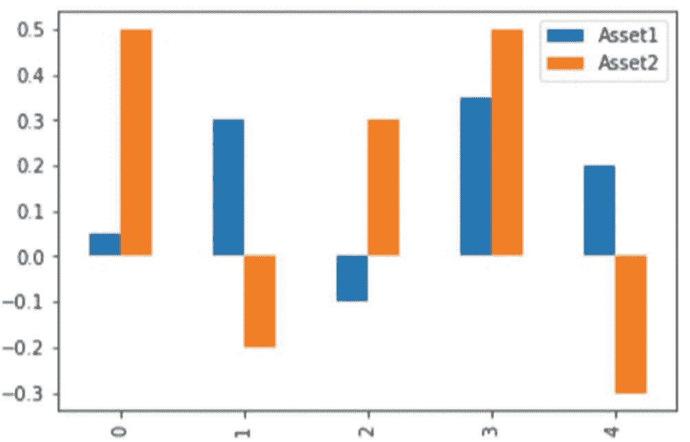

一个分组正负条形图，显示了资产 1 和资产 2 的收益率概况。资产 2 的概况比资产 1 的波动性更大。

图 4-2
将收益率可视化为条形图

同样，当我们稍后介绍更精确的定义时，这种更高波动性的概念会更加具体。现在，我们可以简单地调用 `std()` 函数来计算这两列的标准差（波动性的另一个称呼）：

```
>>> return_df.std()
Asset1    0.185068
Asset2    0.384708
dtype: float64
```

请注意，`std()` 是按列应用的。类似地，我们可以调用 `mean()` 函数来计算每列的平均值：

```
>>> return_df.mean()
Asset1    0.16
Asset2    0.16
dtype: float64
```

结果与我们之前使用 `np.mean()` 的计算结果一致。这个例子表明，仅仅关注资产的平均收益率是不够的。事实上，如果只报告资产的平均收益率而不考虑其波动性，可能会产生误导。

为了说明差异，假设我们对两项资产的初始投资均为 100 美元。要按顺序计算每个周期的滚动资产价值，我们首先将百分比收益率加 1，形成 1+R 格式。以资产 1 为例。如下所示，运行以下代码片段后，我们可以使用 1.05 计算第一个周期后的资产价值为 100 美元 × 1.05，第二个周期后的资产价值为 100 美元 × 1.05 × 1.30，以此类推：

```
>>> return_df + 1
Asset1 Asset2
0    1.05   1.5
1    1.30   0.8
2    0.90   1.3
3    1.35   1.5
4    1.20   0.7
```

无需手动累乘这些百分比收益率，一个名为 `cumprod()` 的便利函数可以为我们完成这项工作。因此，我们可以将此函数应用于之前格式为 1+R 的 DataFrame，然后乘以 100 美元，从而获得每个周期的资产价值，如下面的代码片段所示：

```
init_investment = 100
cum_value = (return_df + 1).cumprod()*100
>>> cum_value
Asset1     Asset2
0    105.0000   150.0
1    136.5000   120.0
2    122.8500   156.0
3    165.8475   234.0
4    199.0170   163.8
```

我们可以类似地将资产价值的演变绘制成折线图：

```
>>> cum_value.plot.line()
```

运行此命令会生成图 4-3。尽管资产 2 在大部分时期看起来收益更高，但实际上它在最后一个时期的最终收益率更低。因此，这张图的一个关键启示是：平均收益率相同的两项资产，其最终收益率可能完全不同。

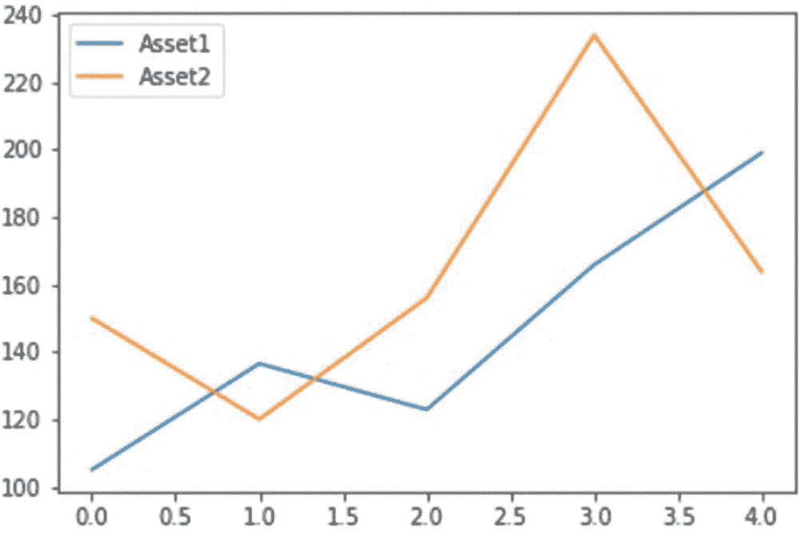

一张显示资产 1 和资产 2 收益递增概况的多折线图。在大部分时期，资产 2 的概况比资产 1 的收益更高。

图 4-3
将资产价值的演变过程可视化

### 1+R 格式

回顾一下，要计算从周期 *t*−1 到 *t* 的收益率 *R*[*t*−1, *t*]，我们需要两个周期的资产价格 *S*[*t*−1] 和 *S*[*t*]。通过简单的变换，我们可以将收益率表示如下：

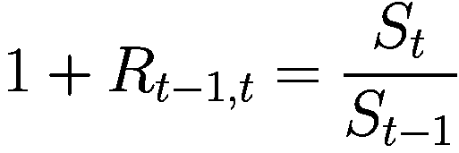

这就是所谓的 1+R 格式，其中我们使用 1+*R*[*t*−1, *t*] 来表示当前周期资产价格 *S*[*t*] 相对于前一周期资产价格 *S*[*t*−1] 的百分比。在获得 1+R 收益率 1+*R*[*t*−1, *t*] 后，我们可以轻松地计算出收益率 *R*[*t*−1, *t*]：

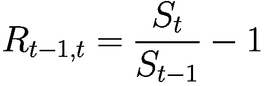

我们使用这种格式的一个原因在于计算的便利性。由于价格是从开始到结束按一列排列的，我们可以简单地将价格列向上移动一行以获得下一周期的价格，然后在另一列中计算比率 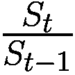（即 1+*R*[*t*−1, *t*]）。然后我们可以减去 1，为每个周期求出 *R*[*t*−1, *t*]。

图 4-4 说明了使用 1+R 格式收益率的好处。额外的步骤是通过将价格列向上移动一个单位来创建一个偏移列。计算 1+R 格式的收益率既直接又快速，因为这是两列之间在所有行上同时进行的直接除法。这避免了使用循环。然后我们减去 1 来恢复相同的收益率。

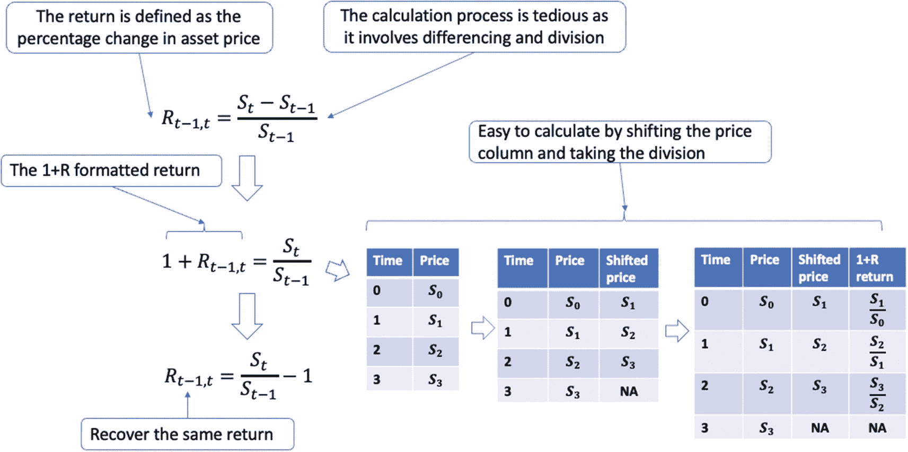

一个包含 3 个等式的流程图，定义了收益率是资产价格的百分比变化。包含时间、价格、偏移价格和 1+R 收益率列的 3 个表格的流程图，展示了通过偏移价格列并进行除法可以轻松计算收益率。

图 4-4
使用 1+R 格式说明收益率的计算过程，这种格式提供了一种更便捷的计算收益率的方法

另外，请注意偏移列中的最后一行是 `NA`，这是因为在最后一个时间点没有更多的未来价格可用。这也导致 1+R 收益率列为 `NA`。我们稍后将在代码中演示计算过程。现在，先消化并接受 1+R 格式的收益率作为描述资产收益率的一种等效方式，是很好的做法。


### 终端收益（Terminal Return）

终端收益指的是在最后一个时间段相对于初始收益的回报，即`R[0, T]`。假设我们有从`t = 0`到`t = T`的价格数据。要计算第`T`期的终端收益`R[0, T]`，我们可以取初始价格`S[0]`和终端价格`S[T]`，计算它们的比率，然后减去 1，得到：

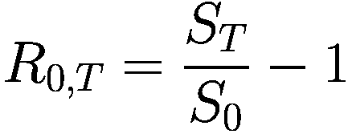

这种方法本质上忽略了中间收益，只考虑了初始和终端的资产价格。通过仅关注初始和终端资产价格，该指标提供了一种简化的投资增长或衰退视图，忽略了中间的波动。这在评估投资的长期表现或比较不同资产在较长时期内的增长时特别有用。然而，请注意，终端收益并不能提供有关投资波动性或风险的见解，因为它只考虑了初始和终端资产价格。

计算这个值还有另一种方法。我们不是只关注初始和终端价格，而是将整个价格演变过程视为一个序列，从一个价格点变化到另一个价格点。因此，第`T`期（或任意第`t`期）的终端收益是所有先前格式化为`1+R`的收益相乘，然后减去 1 的结果。数学上，我们有：

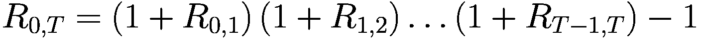

代入格式化为`1+R`的收益定义，得到以下结果：

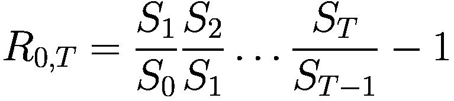

在约去同类项后，这实际上就是我们最初提出的公式。通过这样做，我们承认了每个时期收益对整体投资表现的复合效应。这种方法更全面，因为它考虑了投资期间的所有价格变化。

图 4-5 阐述了终端收益的计算过程。

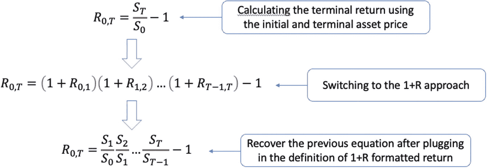

一个包含 3 个方程的流程图，展示了计算终端收益的 3 个步骤：使用初始和终端资产价格、转换为`1+R`方法、以及在代入格式化为`1+R`的收益定义后还原之前的方程。

**图 4-5** 通过不同方法计算终端收益

### 含股息的股票收益

请注意，在计算资产收益时，还需要考虑股息。这意味着我们以当前价格持有股票，同时也享有它所带来的股息。先前对收益的定义称为价格收益，它仅考虑股票的价格变动。将股息与当前股票价格相加则被称为总收益，这更加符合实际情况。在分析股票表现时，几乎总是使用总收益。总收益与价格收益之差即为股息。

股票的总收益计算如下：

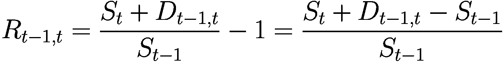

在此方程中，总收益用`R[t - 1, t]`表示，即从时间`t - 1`到时间`t`的收益。`S[t]`和`S[t - 1]`分别代表时间`t`和时间`t - 1`的股票价格。`D[t - 1, t]`代表在`t - 1`到`t`期间内支付的股息。

总收益通过结合资本增值（即股票价格的上涨）和股息收入，提供了对投资表现更全面的评估。这对于注重收益的投资者尤其相关，他们专注于通过资本利得和股息相结合的方式最大化回报。

要计算股票的总收益，公式考虑了期初的股票价格、期末的股票价格以及期间内支付的任何股息。通过将期末股票价格与股息之和除以期初股票价格，然后减去 1，我们便得到以百分比表示的总收益。

## 多期收益

终端收益也可以被视为多期收益，或是在一个合并时间段内的收益。由于演变过程是顺序的，我们需要按顺序对每个时期的收益进行复利计算。当我们拥有格式化为`1+R`的收益时，很容易通过将中间的`1+R`收益相乘/复利计算，然后减去 1，来得到多期收益。

多期收益是衡量投资在一系列连续时期内表现的一个指标。回顾一下，终端收益可以通过`R[0, T] = (1 + R[0, 1])(1 + R[1, 2])…(1 + R[T - 1, T]) - 1`来计算。当我们计算两期收益`R[t, t + 2]`时，公式变为：

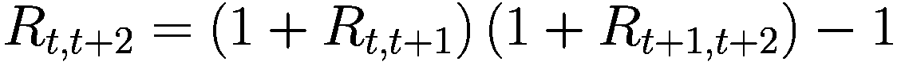

这种方法允许我们在考虑每个时期收益对下一个时期的复合效应的情况下，计算这两个时期的总收益。因此，使用两个时期的`1+R`格式化收益，复利收益很容易计算。图 4-6 阐述了计算两期收益的复利过程。

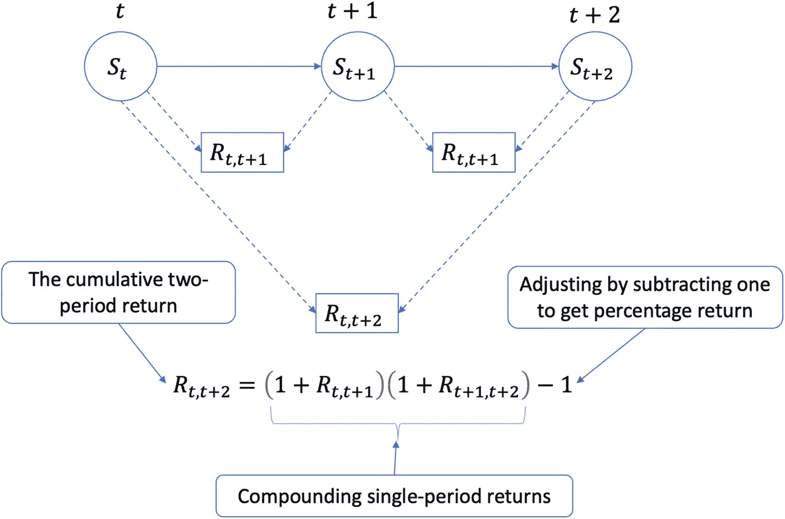

一个带有数学表达式的流程图，解释了使用两个时期的`1+R`格式化收益计算累积两期收益，并通过减去 1 调整为百分比收益的过程。

**图 4-6** 通过将两个单期收益以`1+R`格式复利计算，随后减去 1 进行调整，从而计算两期收益

类似地，对于`n`期收益，公式可以泛化为：

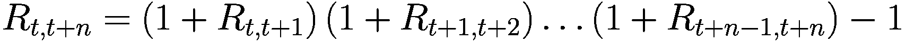

通过将所有`n`期的`1+R`格式化收益相乘，然后减去 1，我们可以确定在整个`n`期投资期限内的复利收益。

让我们看一个简单的例子。假设我们对一个资产进行两期投资，第一期的收益是 10%，第二期的收益是-2%。要计算复利收益，我们的第一步是将两个单期收益都转换成`1+R`格式，分别得到`1.1`和`0.98`。然后我们将这两个数字相乘并减去 1：

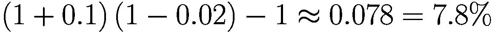

请注意，我们不应该将两期终端收益计算为`10% - 2% = 8%`，这忽略了复利效应。通过按顺序计算，将每个时期的`1+R`收益相乘，才能确保我们得到正确的结果。这些乘法运算给出了`1+R`格式下的终端收益，我们再减去 1 以得到收益本身。


### 年化收益率

当我们知道如何计算任何资产的最终收益率后，下一个问题是如何比较不同时间周期的资产。例如，有些收益率是日度的，而另一些则是月度、季度或年度的。答案是年化，即我们将收益率统一到年的时间尺度上进行公平比较。

年化收益率是比较不同投资期限资产表现的关键步骤。通过将收益率转换为年化基准，我们可以更轻松地在标准化时间尺度上评估和比较各类资产的表现。这一过程有助于创造公平的竞争环境，并促进明智决策。

年化收益率的整体流程如下：

-   计算给定期间的`1+R`格式收益率。
-   将`1+R`格式的收益率乘以每年的期数次方。
-   减一，将结果从`1+R`格式转换回收益率本身。

让我们看一个例子。假设我们有一个每月产生 1%收益率的资产。要计算年化收益率，我们需要将时间范围扩大到一年。然而，简单地将 12 乘以 1%是错误的。为了进行顺序复利计算，我们需要为每个月构建`1+R`格式的收益率（`1 + 0.01`），将 12 个月全部相乘得到`(1 + 0.01)¹²`，最后减一得到`(1 + 0.01)¹² − 1 ≈ 12.68%`，这高于 12%。因此，计算年化收益率涉及推导`1+R`格式的收益率，将这些收益率乘以每年的期数，再减一以从`1+R`转换为`R`。

这个计算表明年化收益率为 12.68%，高于简单将月度 1%收益率乘以 12 的结果。这个差异源于复利效应，这是年化收益率时必须考虑的一个基本因素。

### 从价格数据计算单期收益率

我们通常从资产的价格数据入手，通过一个过程来计算收益率。本节将演示如何实现这一点。

以下命令创建了一个包含三个价格点的列表，这些价格点将用于计算类似于前文两期收益率示例的不同收益率：

```
prices = [0.1, 0.2, -0.05]
```

基于前两个价格点可以计算第一期收益率。我们首先要得到`1+R`格式的收益率，然后减一转换为普通收益率：

```
>>> prices[1]/prices[0] – 1
1.0
```

类似地，我们可以计算第二期的普通收益率如下：

```
>>> prices[2]/prices[1] – 1
-1.25
```

当列表变大时，手动计算这些单期收益率会很不方便。一个更便捷的方法是借用平移价格的思想。通过在列表中进行适当的索引操作可以实现平移。例如，以下代码片段分别选取了最后两个价格和最初两个价格：

```
>>> print(prices[1:])
[0.2, -0.05]
>>> print(prices[:-1])
[0.1, 0.2]
```

现在我们可以一次性对相应元素进行除法运算。但是，我们需要将两个列表都转换为 NumPy 数组，才能进行逐元素相乘：

```
>>> print(np.array(prices[1:])/np.array(prices[:-1])-1)
[ 1\.   -1.25]
```

另一种方法是依赖 Pandas 生态系统，它在底层实现了许多 NumPy 计算。让我们通过将字典转换为 Pandas DataFrame，使用与之前相同的技巧：

```
prices_df = pd.DataFrame({"price":prices})
>>> prices_df
price
0    0.10
1    0.20
2   -0.05
```

对 Pandas DataFrame 进行子集选取的常用方法是通过 `iloc()` 方法，它基于行和列的位置索引返回元素。以下代码片段分别选取了最后两个和最初两个元素：

```
>>> prices_df.iloc[1:]
price
1    0.20
2   -0.05
>>> prices_df.iloc[:-1]
price
0    0.1
1    0.2
```

请注意此处第一列中的索引。这些是在创建 Pandas DataFrame 时分配的默认行级索引，即使在子集选取操作后，这些索引也保持不变。在尝试合并两个 DataFrame 时，索引不一致很容易导致问题。在这种情况中，当我们对这两个 DataFrame 进行除法运算时，会得到一个不想要的结果：

```
>>> prices_df.iloc[1:]/prices_df.iloc[:-1]
price
0    NaN
1    1.0
2    NaN
```

这种看似异常的行为背后的原因是，两个 DataFrame 都试图寻找具有*相同*索引的对应元素。当找不到对应元素时，就会出现 `NaN` 值。

为了纠正这一点，我们可以只从这些 DataFrame 中提取 value 属性。我们只需要对一个 DataFrame 执行此操作，因为另一个 DataFrame 会自动转换为 value 的格式。以下代码片段展示了正确方法，其结果与之前相同：

```
>>> prices_df.iloc[1:].values/prices_df.iloc[:-1] – 1
price
0    1.00
1   -1.25
>>> prices_df.iloc[1:]/prices_df.iloc[:-1].values – 1
price
1    1.00
2   -1.25
```

让我们再稍微深入探讨一下平移操作。事实上，有一个同名的函数。例如，要将价格向下平移一个单位，我们可以向 Pandas DataFrame 对象的 `shift()` 函数传递参数 1，如下所示：

```
>>> prices_df.shift(1)
price
0    NaN
1    0.1
2    0.2
```

注意，第一个元素被填充为 `NaN`，因为在第一个价格之前没有值。然后，我们可以将原始 DataFrame 除以平移后的 DataFrame，得到单期 `1+R` 格式的收益率序列，再减一得到普通收益率：

```
>>> prices_df/prices_df.shift(1) - 1
price
0    NaN
1    1.00
2   -1.25
```

最后，我们还有一个更实用的函数可以一次性完成这些计算。这个函数是 `pct_change()`，它计算 DataFrame 中连续两个值之间的百分比变化：

```
returns_df = prices_df.pct_change()
>>> returns_df
price
0    NaN
1    1.00
2   -1.25
```

同样，第一个条目是 `NaN`，因为没有前一个价格点。

接下来，我们继续计算累计的两期最终收益率。

### 计算两期最终收益率

最终收益率来自于对先前各单期收益率进行复利计算。在单期的情况下，最终收益率与单期收益率相同。在下面的例子中，我们使用一个包含单期收益率的简单 DataFrame（`returns_df`）来计算两期最终收益率。该过程包括以下步骤：

-   将单期收益率加一转换为`1+R`格式。
-   计算`1+R`格式收益率的乘积。
-   减一，将结果转换回最终收益率。

具体来说，为了计算两期最终收益率，我们首先获得`1+R`格式的单期收益率：

```
>>> returns_df + 1
price
0    NaN
1    2.00
2   -0.25
```

然后，我们调用 NumPy 的 `prod()` 函数将数组中的所有元素相乘，并忽略 `NaN` 值。这样我们就得到了`1+R`格式的最终收益率，从中减一即可转换为普通最终收益率：

```
>>> np.prod(returns_df + 1) – 1
price   -1.5
dtype: float64
```

同样也有对应的 Pandas 方法，可以得到相同的结果：

```
>>> (returns_df+1).prod() – 1
price   -1.5
dtype: float64
```


### 计算年化收益率

我们考虑三种不同回报频率的场景，包括日回报`0.0001`、月回报`0.01`和季度回报`0.05`。其计算过程与以年度为标记计算多期期末收益相同：

-   将每个时期的普通回报转换为`1+R`格式。
-   将`1+R`格式的回报进行乘方，指数为一年中的期数。
-   减去 1，将结果转换回普通回报。

对于日回报，我们假设一年共有 252 个交易日，这是处理每日价格数据时的典型假设。我们遵循同样的步骤：将每个时期的普通回报转换为`1+R`回报，将这些单期回报复利/相乘直到满一年，再减去 1，转换回普通的期末收益：

```
r = 0.0001
>>> (1+r)**252-10
0.025518911987694626
```

对于月回报，由于一年有 12 个月，我们将对其进行 12 次复利计算：

```
r = 0.01
>>> (1+r)**12-1
0.12682503013196977
```

最后，一年有四个季度，因此我们对其进行四次复利计算：

```
r = 0.05
>>> (1+r)**4-1
0.21550625000000023
```

现在，我们将在下一节转向风险分析。

## 分析风险

资产的风险与波动性相关，其重要性等于甚至高于回报。波动性是评估投资风险的关键指标，因为它代表了资产回报的不确定性或波动程度。更高的波动性意味着更高的风险，因为资产价格可能出现更显著的涨跌。为了量化与投资相关的风险，我们必须理解波动性的概念及其计算方法。

回顾图 4-3 中两项资产的回报。尽管平均回报相同，但资产 2 比资产 1 的波动性更大。资产 2 偏离均值的频率更高，幅度也更大。因此，波动性衡量的是偏离均值的程度。本节将正式定义波动性的概念。

在探讨波动性之前，让我们先引入方差和标准差的概念。

### 介绍方差与标准差

方差和标准差是两种广泛使用的统计量，用于描述数据围绕其均值的离散程度。假设总共有*N*个回报 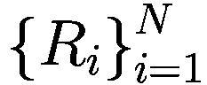。我们知道平均回报*R*[*P*]是通过对所有回报取平均值计算得出的：

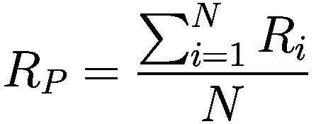

这里，平均回报*R*[*P*]描述了资产或投资组合回报的中心趋势。也就是说，平均而言，回报为*R*[*P*]。它也常被称为回报的算术平均值。

接下来是衡量偏离均值的程度。对于任意回报*R*[*i*]，它与*R*[*P*]的距离为*R*[*i*] − *R*[*P*]。然而，这个距离可能是正值或负值。由于总共有*N*个回报，因此有*N*个距离，将这些距离直接相加似乎不是一个好主意，因为正负距离会相互抵消。方差衡量方法提出，我们不直接对这些距离求和，而是先将距离平方，然后再对这些平方距离取平均值。从数学上讲，回报的方差表示如下：

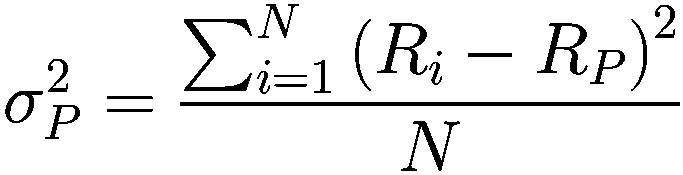

这里，*R*[*i*] − *R*[*P*] 也意味着对原始回报*R*[*i*]进行去均值处理，即从原始回报*R*[*i*]中减去平均回报*R*[*P*]。这给出了偏离均值的程度。此外，通过平方这些偏差，正负项相互抵消的问题不复存在；所有去均值后的回报最终都变为正值或零。最后，我们将这些平方偏差的平均值作为该回报序列的方差。观察图 4-3 也能直观地看出，资产 2 的方差大于资产 1。

尽管方差总结了偏离平均回报的平均程度，但其单位是平均回报的平方距离，导致单位的解释比较困难。在实践中，我们通常对方差取平方根，将其恢复到与回报相同的量纲。得到的结果称为标准差，此时的偏差已被标准化并具有可比性。

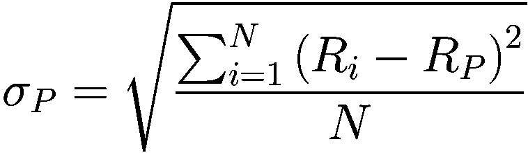

这也是我们衡量波动性的指标。它衡量了价格围绕平均价格的波动幅度，是衡量回报离散程度的直接指标。波动性越高，偏离平均回报的程度就越大。图 4-7 总结了常见统计量的定义，如均值、方差（包括总体方差和样本方差）和标准差（在金融语境下也称为波动性）。

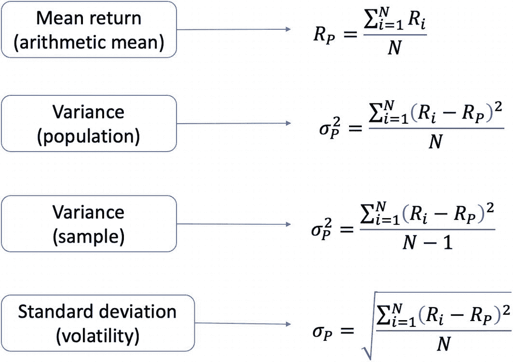

**图 4-7** - 总结了常见的统计量，包括均值、方差（总体和样本）和标准差（也称为波动性）

总之，方差和标准差是理解投资风险的基本统计量。它们描述了回报相对于其均值的离散程度，有助于估算资产或投资组合的潜在波动性。这些统计量在评估投资组合配置中的风险承受能力方面也发挥着重要作用。


## 年化波动率

与收益率类似，波动率也需要进行年化处理，以确保公平比较。如果不进行年化，就很难比较月度数据与日度数据的波动率。

年化波动率的公式基于这样一个事实：波动率随时间段 `T` 的平方根增加而增加。年化收益率 `σ[P, T]` 可按如下公式计算：

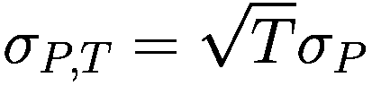

其中 `σ[P]` 是我们的单期波动率，可以是日度、月度或季度波动率。该表达式基于收益率呈正态分布且相互独立的假设。我们仅需直观理解此公式，而无需深入技术细节。

时间段 `T` 代表完整的时间周期。因此，日度收益率对应 `T = 252`，月度收益率对应 `T = 12`，季度收益率对应 `T = 4`。我们只需将该时间段的平方根与原始单期波动率相乘，即可得到年化波动率。

回顾一下，我们可以按照以下步骤计算年化波动率：

- 计算给定数据（日、月或季度收益率）的单期波动率（`σ[P]`）。
- 确定每年的周期数（`T`）。对于日度收益率，`T = 252`（一年的交易日数）；对于月度收益率，`T = 12`；对于季度收益率，`T = 4`。
- 将单期波动率（`σ[P]`）乘以每年周期数（`T`）的平方根，得到年化波动率，即：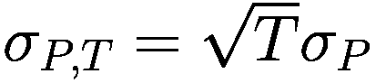。

请记住，收益率呈正态分布且相互独立的假设是此方法成立的关键。使用这种方法进行年化波动率处理，使我们能够在同一标准下比较不同频率收益率的资产波动率，从而更轻松地评估和管理与不同投资相关的风险。

当单期波动率 `σ[P]` 固定时，我们的年化波动率 `σ[P, T]` 会随着 `T` 的增加而增长。由于平方根运算，`σ[P, T]` 的这种增长是 `T` 的非线性函数。随着时间段 `T` 的增加，年化波动率也会增加，但由于平方根函数的作用，其增长速度会逐渐减慢。这意味着当日度收益率和月度收益率具有相同的单期波动率时，日度收益率将具有更高的年化波动率。这在直觉上是合理的，因为它捕捉到了在使用月度数据等较长的时间框架时被平滑掉的短期波动，并且我们预期日度数据相比月度数据会呈现出更多的变化。

我们也可以从另一个角度来看待这个公式。将等式两边平方，即可得到两边的年化方差，如下所示：

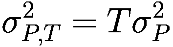

现在，年化方差 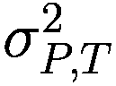 随着时间 `T` 线性增长。图 4-8 展示了这里的微妙之处。

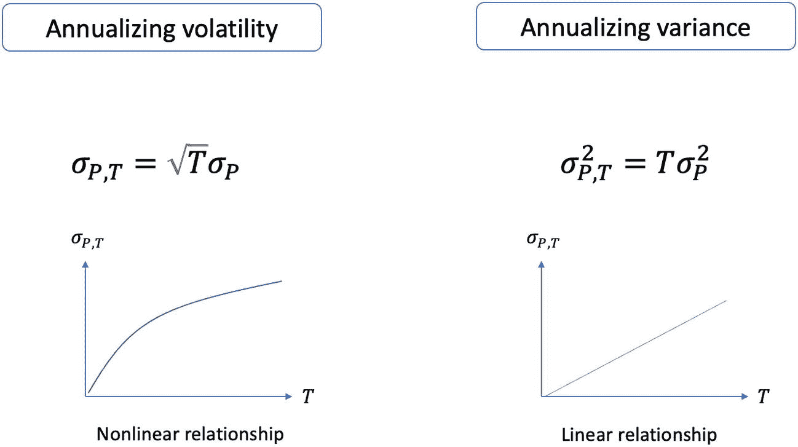

两张关于 σ下标 P, T 与 T 的折线图显示：年化波动率（σ下标 P, T = √T × σ下标 P）随 T 非线性上升；年化方差（σ²下标 P, T = T × σ²下标 P）随 T 线性上升。

**图 4-8** 比较年化波动率与年化方差的差异。当给定固定的单期波动率或方差时，年化波动率随时间非线性增长，而年化方差随时间线性增长

让我们看一个简单的例子。假设某股票日度收益率序列的标准差为 `0.1%`。其年化波动率可计算如下：

```
0.001 * sqrt(252) ≈ 1.59%
```


### 通过夏普比率结合风险与收益

现在我们有了衡量特定资产的两个指标：收益和风险；两者都可以进行年化处理。一种资产可能表现出低收益和低风险，而另一种资产可能带来更高收益，但同时也伴随着更高风险。我们希望将这两个指标结合起来，创建出一个单一的风险调整后收益指标。

一种方法是将平均收益 `R[P]` 除以波动率 `σ[P]`，得到 。然而，平均收益 `R[P]` 并未提供关于整体市场状况的信息。我们无法确定较高的  比率是源于投资组合本身还是市场的繁荣。因此，在分子中考虑整体市场基准会更好。这就是夏普比率的用武之地。

夏普比率是一种衡量指标，通过将投资组合的超额收益除以其波动率来计算，以评估风险调整后的表现。这里的超额收益是指高于某个行业基准的收益，通常使用无风险收益率，例如国库券或债券的收益率。通过这个标准化指标，我们现在可以在考虑整体市场状况的同时，比较不同的资产或投资组合。然后我们会选择夏普比率更高的资产或投资组合。

从数学上讲，夏普比率的定义如下：

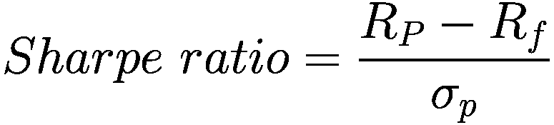

其中 `R[P]` 是投资组合的平均收益，`R[f]` 是无风险利率，`σ[p]` 是投资组合的波动率。较高的夏普比率表明，与其他投资或整体市场相比，该投资在相同风险水平下能产生更高的收益。在比较不同投资时，夏普比率较高的投资被认为更具吸引力，因为它提供了更好的风险调整后收益。通过纳入无风险利率，夏普比率能更准确地评估一项投资相对于整体市场状况的表现。

让我们看一个例子。假设我们有两个投资组合，其收益和波动率分别为 (5%, 20%) 和 (10%, 50%)。显然，投资组合 2 比投资组合 1 盈利更高，但波动也更大。这种波动性会降低投资组合 2 的吸引力。为了使用单一指标比较这两个投资组合，我们按如下方式计算 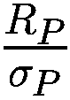：

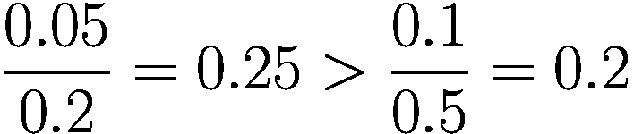

因此，使用风险调整后的指标衡量，投资组合 1 更具吸引力。现在假设市场的无风险利率为 3%。现在我们关注两个投资组合的超额收益，并使用夏普比率进行比较：

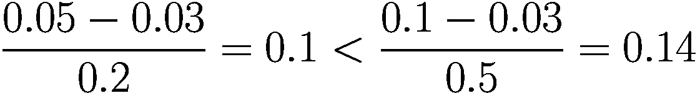

现在投资组合 2 变得更具吸引力了。这是因为在考虑市场基准后，投资组合 2 确实提供了比投资组合 1 更好的收益。代码清单 4-2 演示了此例中的比较。

```
p1_ret = 0.05
p1_vol = 0.2
p2_ret = 0.1
p2_vol = 0.5
risk_free_rate = 0.03
>>> p1_ret / p1_vol
0.25
>>> p2_ret / p2_vol
0.2
>>> (p1_ret - risk_free_rate) / p1_vol
0.1
>>> (p2_ret - risk_free_rate) / p2_vol
0.14
代码清单 4-2
计算夏普比率
```

图 4-9 总结了风险调整后收益的不同衡量标准。

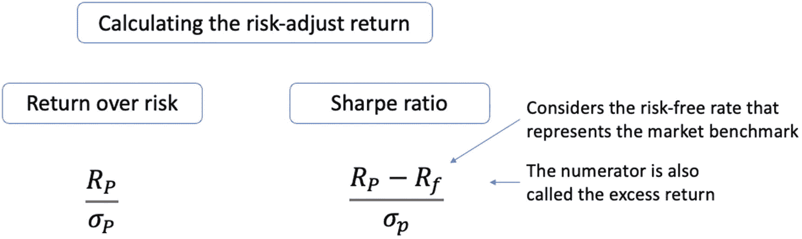

一组 2 个用于计算风险调整后收益的数学表达式，将收益风险比率定义为 `R 下标 P` 除以 `sigma 下标 P`，将夏普比率定义为 `R 下标 P` 减去 `R 下标 f`，再除以 `sigma 下标 P`。

图 4-9

不同的风险调整后收益。从（年化）收益中减去无风险利率得到超额收益，该超额收益考虑了市场基准的表现。

接下来，我们将在下一节中使用一些真实数据来计算上述指标。

### 使用股票价格数据

在本节中，我们将下载苹果（AAPL）和谷歌（GOOG）截至今日的股票价格数据。在代码清单 4-3 中，我们指定开始日期为“2023-01-01”，默认结束日期由系统当前日期自动确定，在撰写本文时为 2023 年 1 月 20 日。

```
import yfinance as yf
prices_df = yf.download(["AAPL","GOOG"], start="2023-01-01")
>>> prices_df.head()
代码清单 4-3
使用 yfinance 下载股票数据
```

运行代码会生成图 4-10。请注意这里的多级列。这里有两级列，第一级表示价格类型，第二级表示股票代码。此外，DataFrame 的索引采用 `datetime` 格式。

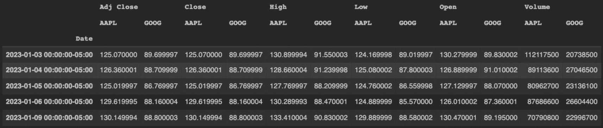

一个包含 5 行日期时间格式数据的表格，列包括调整收盘价、收盘价、最高价、最低价、开盘价和交易量，每个列又分为苹果和谷歌两个子列。

图 4-10

打印苹果和谷歌每日股票价格的前几行

接下来，我们希望关注这两只股票的每日调整后收盘价，索引改为日期格式而非 `datetime` 格式。代码清单 4-4 完成了这两项任务。

```
#### 将 datetime 索引转换为日期格式
prices_df.index = prices_df.index.date
#### 保留调整后的收盘价
prices_df = prices_df['Adj Close']
>>> prices_df.head()
AAPL       GOOG
2023-01-03 125.070000 89.699997
2023-01-04 126.360001 88.709999
2023-01-05 125.019997 86.769997
2023-01-06 129.619995 88.160004
2023-01-09 130.149994 88.800003
代码清单 4-4
按日期索引并选择每日调整后收盘价
```

在这里，我们访问了索引的 `date` 属性，并将其赋值给 DataFrame 的 `index` 属性。然后，我们将使用 `pct_change()` 实用函数计算 1+R 格式的收益率：

```
returns_df = prices_df.pct_change()
>>> returns_df.head()
AAPL      GOOG
2023-01-03  NaN       NaN
2023-01-04  0.010314 -0.011037
2023-01-05 -0.010605 -0.021869
2023-01-06  0.036794  0.016019
2023-01-09  0.004089  0.007260
```

同样，第一行为空，因为其之前没有数据点。我们可以使用 `dropna()` 函数删除这一行：

```
returns_df = returns_df.dropna()
>>> returns_df.head()
AAPL      GOOG
2023-01-04  0.010314 -0.011037
2023-01-05 -0.010605 -0.021869
2023-01-06  0.036794  0.016019
2023-01-09  0.004089  0.007260
2023-01-10  0.004456  0.004955
```

所有包含任何 `NA` 值的行都会被移除。

接下来，我们计算这两只股票收益率序列的均值、方差和标准差。


#### 计算均值、方差和标准差

通过调用`returns_df`的`mean()`方法，可以获得按列计算的收益算术平均值：

```
>>> returns_df.mean()
AAPL    0.007228
GOOG    0.004295
dtype: float64
```

看起来苹果在年初的表现优于谷歌。要计算收益的标准差或波动率，可以使用`std()`函数。然而，为了演示按列操作，我们在输入参数中显式指定`axis=0`，这意味着标准差应沿列方向计算：

```
>>> returns_df.std(axis=0)
AAPL    0.012995
GOOG    0.016086
dtype: float64
```

在最初几天，谷歌的股价波动高于苹果。现在让我们尝试设置`axis=1`：

```
>>> returns_df.std(axis=1)
2023-01-04    0.015097
2023-01-05    0.007965
2023-01-06    0.014690
2023-01-09    0.002242
2023-01-10    0.000352
2023-01-11    0.009001
2023-01-12    0.002259
2023-01-13    0.000308
2023-01-17    0.011068
2023-01-18    0.000882
2023-01-19    0.016097
dtype: float64
```

结果显示的是两只股票组合的每日标准差。

现在我们通过前面描述的精确步骤，演示如何手动计算波动率。第一步是去除每日收益的均值，得到与（算术）均值的偏差：

```
deviations_df = returns_df - returns_df.mean()
>>> deviations_df.head()
AAPL      GOOG
2023-01-04  0.003086 -0.015332
2023-01-05 -0.017833 -0.026164
2023-01-06  0.029566  0.011724
2023-01-09 -0.003139  0.002964
2023-01-10 -0.002772  0.000660
```

下一步是平方这些偏差，这样在求和时它们就不会相互抵消。平方相当于将元素提升到 2 次幂，使用双星号表示法：

```
squared_deviations_df = deviations_df**2
>>> squared_deviations_df.head()
AAPL     GOOG
2023-01-04 0.000010 2.350688e-04
2023-01-05 0.000318 6.845668e-04
2023-01-06 0.000874 1.374582e-04
2023-01-09 0.000010 8.787273e-06
2023-01-10 0.000008 4.352158e-07
```

第三步，使用`mean()`函数对这些每日平方偏差求平均值：

```
variance = squared_deviations_df.mean()
>>> variance
AAPL    0.000154
GOOG    0.000235
dtype: float64
```

最后一步是对方差取平方根，得到波动率：

```
volatility = np.sqrt(variance)
>>> volatility
AAPL    0.012390
GOOG    0.015337
dtype: float64
```

注意，这个结果与使用`std()`函数得到的结果不同！造成差异的原因是`std()`函数计算的是样本标准差，其分母除以`N`−1，而我们的手动计算中分母除以`N`。

为了纠正这一点，让我们重新审视第三步，这次将平方偏差之和除以`N`−1。在代码清单 4-5 中，我们首先使用`shape()`函数的第一个维度（行维度）获取行数`N`，然后根据方差公式代入计算。

```
num_rows = squared_deviations_df.shape[0]
variance2 = squared_deviations_df.sum() / (num_rows-1)
>>> variance2
AAPL    0.000169
GOOG    0.000259
dtype: float64
代码清单 4-5 计算样本方差
```

现在取平方根得到的结果与使用`std()`函数相同：

```
volatility2 = np.sqrt(variance2)
>>> volatility2
AAPL    0.012995
GOOG    0.016086
dtype: float64
```

现在我们得到了衡量每日收益围绕均值离散程度的单期波动率，下一节将计算年化波动率。

#### 计算年化波动率

根据将单期波动率年化为年度波动率的公式，我们可以按如下方式计算年化波动率，其中一年的总时段长度`T`=252：

```
annualized_vol = returns_df.std()*np.sqrt(252)
>>> annualized_vol
AAPL    0.206289
GOOG    0.255356
dtype: float64
```

我们也可以通过将 252 提升到 0.5 次幂来计算 252 的平方根，结果相同：

```
annualized_vol = returns_df.std()*(252**0.5)
>>> annualized_vol
AAPL    0.206289
GOOG    0.255356
dtype: float64
```

下一节将介绍收益的年化计算。

## 计算年化收益

这里需要注意的一点是，收益遵循序贯复利过程。这意味着一旦我们获得了单期平均收益，就需要按照相应的频率将其复利化以达到一年的长度。为了计算单期平均收益，我们取收益的几何平均数。在这种情况下，几何平均数是比算术平均数更好的选择，因为它考虑了序贯复利的影响。

具体来说，我们首先按如下方式计算收益的几何平均数。需要注意的是，在分析资产的累计收益时，几何平均数与序贯复利性质相一致：

```
returns_per_day = (returns_df+1).prod()**(1/returns_df.shape[0]) - 1
>>> returns_per_day
AAPL    0.007153
GOOG    0.004178
dtype: float64
```

让我们分解这里的操作序列。首先，我们为每一天在`(returns_df+1)`中构造 1+R 收益，然后使用`prod()`函数执行序贯复利，以获得 1+R 格式的累计终期收益。在减 1 之前，我们将其提升到 1/`N`次幂，其中`N`是 DataFrame 的行数。这给出了 1+R 格式的收益几何平均数。这里我们不使用算术平均数。

现在进入年化部分。如代码清单 4-6 所示，我们假设一个固定的每日收益作为几何平均数，并将其向前滚动一年，对应 252 个交易日。再次强调，在 1+R 收益和普通收益之间进行转换。

```
annualized_return = (returns_per_day+1)**252-1
>>> annualized_return
AAPL    5.025830
GOOG    1.859802
dtype: float64
代码清单 4-6 年化每日收益
```

看起来苹果在最初几天的表现远好于谷歌。

还有另一种计算年化收益的方法，速度更快：

```
annualized_return = (returns_df+1).prod()**(252/returns_df.shape[0])-1
>>> annualized_return
AAPL    5.025830
GOOG    1.859802
dtype: float64
```

这里的关键变化是，我们将终期收益提升到 252/`N`次幂。这是一种标准化做法，将每日尺度转换到年度尺度。

## 计算夏普比率

最后，让我们计算两只股票的夏普比率。我们假设无风险利率为 3%，通过从年化收益中减去该利率来计算超额收益，然后除以年化波动率得到夏普比率。如代码清单 4-7 所示：

```
riskfree_rate = 0.03
excess_return = annualized_return - riskfree_rate
sharpe_ratio = excess_return/annualized_vol
>>> sharpe_ratio
AAPL    24.217681
GOOG     7.165694
dtype: float64
代码清单 4-7 计算夏普比率
```

因此，作为风险调整后收益的夏普比率，苹果在最初几天远高于谷歌。


## 总结

在本章中，我们探讨了任何金融资产的两个关键特征：**风险**与**收益**。收益是指资产带来的财务回报，而风险则代表这种收益的波动性或不确定性。作为投资者，我们的目标是在最小化风险的同时最大化收益。

我们介绍了表示和计算收益的不同方式，包括简单收益、期末收益、多期收益以及`1+R`格式的收益。理解这些收益形式之间的关联，对于在不同形式之间进行转换非常重要。

随后，我们重点讨论了风险-收益权衡，即低收益资产通常与低风险相关，而高收益资产则与高风险相关。为了更好地比较不同投资工具的风险与收益，我们引入了年化收益和年化波动率，以及一种名为夏普比率的风险调整后收益指标。我们还提供了示例，说明在比较投资产品时，同时考虑风险与收益的重要性。

## 练习题

- 计算单期收益需要多少个输入值？
- 如果资产价格从 5 美元变为 6 美元，收益是多少？
- 某只热门股票的总收益通常高于还是低于其价格收益？
- 计算由 10%、–5%和 6%组成的三期收益。
- 如果我们买入一项资产，第一天上涨 10%，第二天下跌 10%，我们的收益是正数、负数还是零？
- 计算季度（三个月）收益为 2%的资产的年化收益。
- 下载苹果和特斯拉的年初至今股票数据，使用每日收盘价计算每日累计收益，并将收益绘制成折线图。
- 年化波动率和方差都随时间线性增长，这个说法正确吗？
- 假设月度波动率为 5%，计算年化波动率。
- 年化波动率总是大于月度波动率，这个说法正确还是错误？
- 无风险利率是低风险投资的回报率，这个说法正确还是错误？
- 如果无风险利率上升而投资组合的波动率保持不变，夏普比率会上升还是下降？
- 基于 2022 年上半年苹果股票每月中位日价格获取月度收益数据，并基于这些月度收益计算年化收益和波动率。

