# 5. 趋势跟踪策略

趋势跟踪是一种广泛使用的投资策略，适用于各类市场，包括股票、债券、大宗商品、货币，甚至加密货币。顾名思义，该策略基于以下假设：价格会随时间沿特定方向（即“趋势”）运动，从而为捕捉这些波动提供机会。趋势跟踪的核心在于分析历史价格数据以识别潜在趋势。该策略随后建议建立与这些趋势一致的头寸，并预期这些趋势将持续。例如，如果某项资产的价格持续上涨，趋势跟踪者通常会建立多头头寸，预期上涨趋势将继续。反之，如果价格持续下跌，趋势跟踪者可能会建立空头头寸，押注价格将继续下跌。

然而，与任何交易策略一样，趋势跟踪并非万无一失。由于意外的市场事件或市场情绪变化，趋势可能突然反转，从而导致潜在损失。因此，趋势跟踪策略通常会叠加风险管理技术，例如设置止损单，以在趋势反转时限制潜在损失。

趋势跟踪策略使用多种技术指标来识别和确认趋势，例如移动平均线、趋势线和动量指标。本章介绍了基于移动平均线的趋势跟踪策略的工作原理，并展示了其在 Python 中的实现。

由于我们主要使用对数收益，让我们先通过一个计算过程的示例来了解它。

## 处理对数收益

让我们进一步理解对数收益，因为后续评估趋势跟踪策略时，我们将用它来计算股票收益。我们从图 5-1 中的 Excel 表格开始，其中提供了一组虚拟股票价格，并要求回答 Q1 到 Q9 的问题。以下详细说明这些问题和答案。

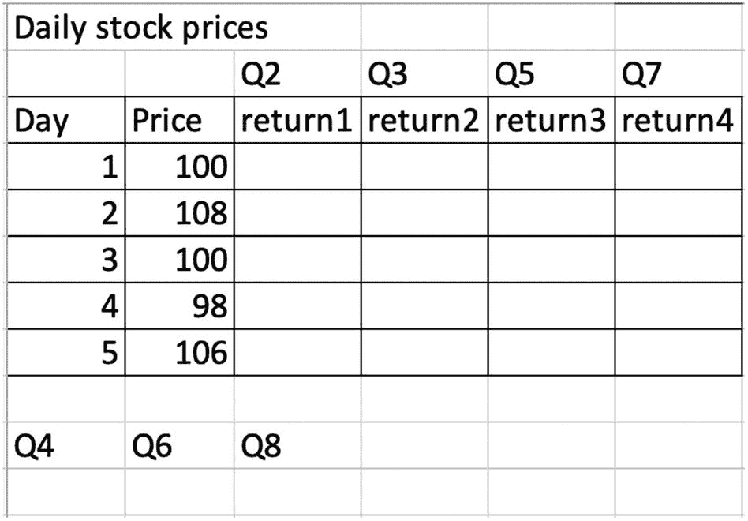

**图 5-1** 每日虚拟股票价格

让我们逐一审视这九个问题。

**Q1：** 为什么使用百分比收益？

**答案：** 百分比收益提供了统一的比较尺度。例如，当另一只股票（股票 B）的价格数据在 1–10 范围内时，使用绝对值将其与 Excel 表格中的股票价格数据（股票 A）进行比较会很困难。5 美元的上涨对股票 A 的意义远大于股票 B。通过将其转换为相对的百分比形式，我们可以将两只股票放在同一尺度上衡量其表现。因此，使用百分比收益，我们可以准确地比较这两只股票的表现，尽管它们的价格水平不同。

百分比收益也可用于将某项投资的表现与基准或标准（如市场指数，如标普 500 或道琼斯工业平均指数）进行比较。这有助于投资者评估一项投资或投资组合相对于更广泛市场或某个市场板块的表现如何。

**Q2：** 以原始方式计算单期百分比收益（基于收益的定义）。

**答案：** 单期百分比收益，也称为简单收益或持有期收益，反映了投资价值从一个时期到下一个时期的百分比变化。其计算公式为

```
R[t, t+1] = (S[t+1] - S[t]) / S[t]
```

其中 `R[t, t+1]` 是从时间 `t` 到 `t+1` 的单期百分比收益，而 `S[t]` 和 `S[t+1]` 分别是时期 `t` 和 `t+1` 结束时的资产价格。公式的分子 `S[t+1] - S[t]` 计算资产价格从时间 `t` 到 `t+1` 的变化。分母 `S[t]` 是期初价格，作为衡量相对变化的基准。将价格变化除以起始价格，得到相对价格变化，以百分比表示，这就是简单收益。

将相同的公式应用于 `return1` 列中除第 1 天之外的所有单元格，得到图 5-2 中的结果。

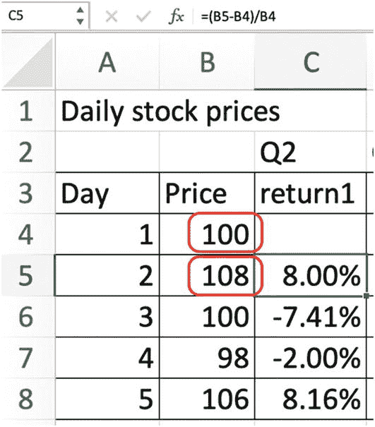

**图 5-2** 根据百分比收益定义计算简单收益

**Q3：** 使用 `1+R` 方式计算相同的收益。

**答案：** 使用 `1+R` 方式计算收益与原始方法略有不同，但本质上能得出相同的结果。这种方法强调资产价格从一个时期到下一个时期的增长因子，使得理解和解释更加容易。`1+R` 方式将收益重写为

```
R[t, t+1] = S[t+1] / S[t] - 1
```

这需要两个步骤：首先，计算比率 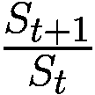 以获得所谓的 1+R 收益率。该比率反映了资产价格从期初到期末的增长因子。如果该比率大于 1，则表示资产价格在此期间内上涨；如果小于 1，则表示资产价格下跌；如果等于 1，则表示资产价格未发生变化。

接下来，我们需要从 1+R 收益率中减去 1，将其转换为简单收益率。这一步将增长因子  转换为实际百分比收益率。减去 1 实质上是从计算中移除了初始投资，仅保留相对于初始投资而言的盈利或亏损金额，也就是收益率。请参见图 5-3 的示例，其中每日收益率与之前的方法相同。

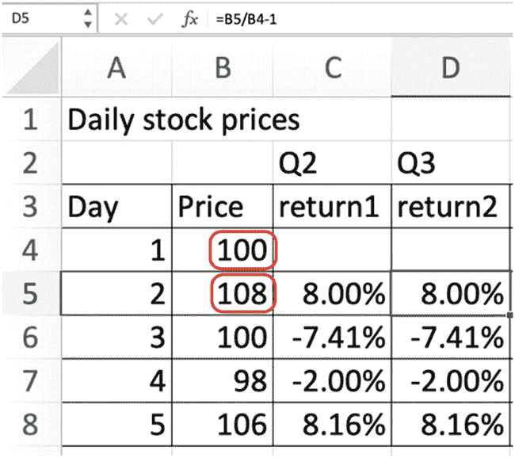

*一个用于虚拟股票价格的 Excel 表格。它展示了使用 1+R 方法计算的、针对 5 天虚拟股票价格的相同收益率。列标题为：天数、价格、收益率 1 和收益率 2。第 1 天和第 2 天的价格分别为 100 和 108，并已高亮显示。*

**图 5-3** 基于 1+R 方法计算简单收益率

这种 1+R 方法经常被使用，因为它更直观。增长因子  能轻松显示初始投资增长（或缩水）了多少，减去 1 则得出净增长的百分比，即简单收益率。当处理多个时间段时，这种方法尤其有用，因为增长因子可以简单地相乘来计算多个时期的累积增长因子。

**Q4：从第 1 天到第 5 天不考虑复利时的最终收益率是多少？**

**答案：** 最终收益率是指一项投资在给定时间段内的总收益率。它是衡量一项投资从投资期开始到结束所经历的总收益或损失的指标，不考虑该时期内的任何复利效应。

要计算不考虑复利过程的最终收益率，我们可以使用公式：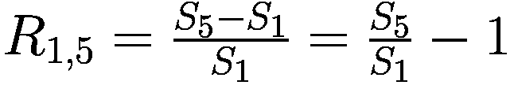。其中，第二个公式首先计算第 5 天资产价格与第 1 天资产价格的比率（这反映了整体增长因子），然后减去 1 将该增长因子转换为最终收益率。请参见图 5-4 的示例。

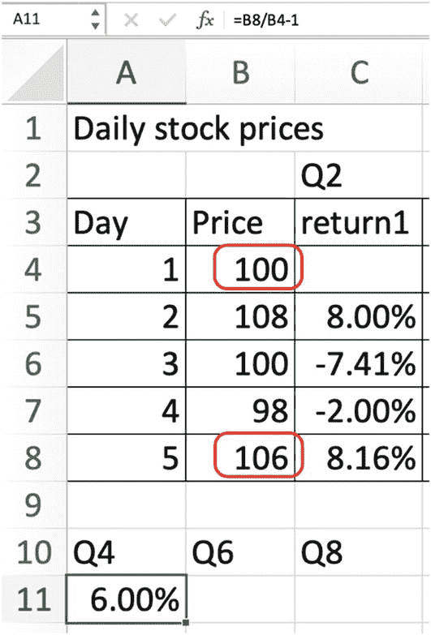

*一个用于虚拟股票价格的 Excel 表格。它展示了不考虑复利的最终收益率，针对 5 天的虚拟股票价格。列标题为：天数、价格和收益率 1。第 1 天和第 5 天的价格分别为 100 和 106，并已高亮显示。*

**图 5-4** 计算不考虑复利的最终收益率

**Q5：从第 1 天到第 5 天考虑复利时的最终收益率是多少？它是否等于 Q4 的结果？**

**答案：** 复利是金融学中的一个重要概念。它反映了这样一个事实：不仅你的初始投资能赚取收益，前期产生的收益也能赚取收益。在正收益率的情况下，这会导致随时间的指数级增长。

我们将填充“return3”列，其中每个单元格是当前时期的 1+R 收益率与前一时期的累积 1+R 收益率的乘积，并偏移一位。对于第一个时期（从第 1 天到第 2 天），“return3”的值就是该时期的“1+R”收益率。请参见图 5-5 的示例。

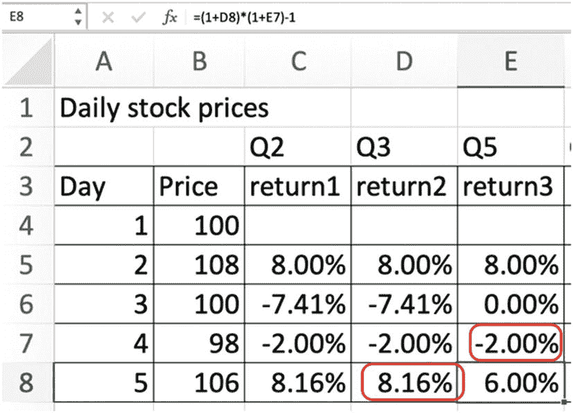

*一个用于虚拟股票价格的 Excel 表格。它展示了针对 5 天虚拟股票价格、考虑复利的最终收益率。列标题为：天数、价格、收益率 1、收益率 2 和收益率 3。Q5 中第 4 天的收益率和 Q3 中第 5 天的收益率已高亮显示。*

**图 5-5** 使用复利计算最终收益率

结果表明，最终收益率为 6%，这与之前计算的结果相同。

**Q6：将 Q3 中的单期收益率相加。其结果是否等于 Q4 的结果？**

**答案：** 结果显示它与 6% 不同。通常来说，将单期收益率相加可能会导致对投资总回报的错误结论。单期收益率之和并不等于最终收益率（来自 Q4），因为这种方法忽略了复利效应。换句话说，通过简单地累加单期收益率，我们实际上是将每个时期的收益率视为独立的，并且是基于初始投资金额赚取的，而忽略了由于前期赚取的收益，投资在每个时期都会增长这一事实。这就是为什么我们看到累加后的单期收益率与通过考虑复利效应的正确方法计算出的最终收益率之间存在差异的原因。

复利原则承认收益会随着时间的推移而累积，这意味着在一个时期赚取的收益会被再投资，并可能在后续时期产生更多收益。因此，虽然单期收益率之和可能提供总收益的粗略估计，但它并不是一个正确的衡量标准，尤其是在时间跨度长或收益率高的情况下。相反，计算多个时期内总收益的正确方法是使用复利的概念，它同时考虑了初始投资和收益的再投资。因此，在计算最终收益率时，遵循顺序复利过程非常重要。请参见图 5-6 的示例。

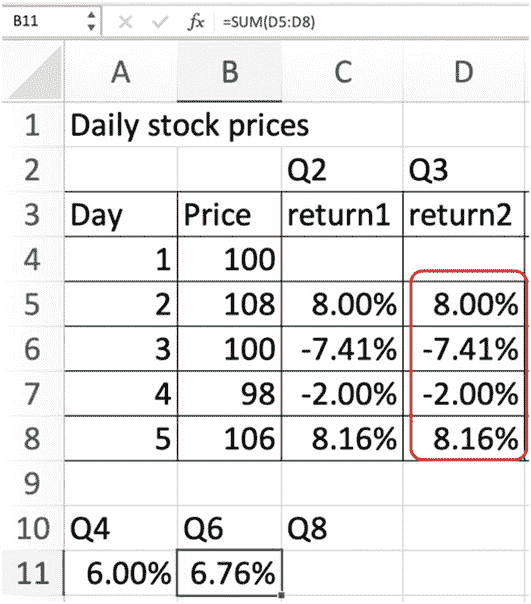

*一个用于虚拟股票价格的 Excel 表格。它展示了 Q3 中单期收益率的总和。列标题为：天数、价格、收益率 1 和收益率 2。Q3 列中的数据已高亮显示。*

**图 5-6** 将所有单期收益率相加

**Q7：计算每个时期的对数收益率。**

**答案：** 对数收益率，或称连续复利收益率，是另一种计算收益的方法，可以简化金融中的各种计算。此方法使用自然对数（`log`）来表达收益率，该收益率源自价格的相对变化。

要计算每个时期的对数收益率，我们可以使用公式：

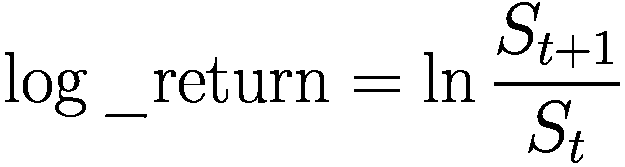

这里，`S[t + 1]` 和 `S[t]` 分别代表未来时间 `t + 1` 和当前时间 `t` 的资产价格，而 `ln` 表示自然对数。请参见图 5-7 的示例。

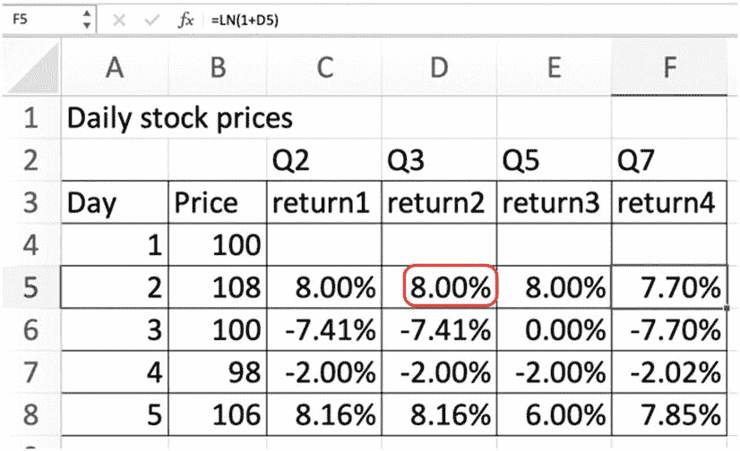

*一个用于虚拟股票价格的 Excel 表格。它展示了每个时期对数收益率的总和。列标题为：天数、价格、收益率 1、收益率 2、收益率 3 和收益率 4。Q3 列中第 2 天的数据已高亮显示。*

**图 5-7** 计算每个时期的对数收益率

例如，如果我们有一系列价格数据，我们可以使用此公式计算每个时期的对数收益率。请注意，对数收益率对于小收益是一个很好的近似值，并且它还具有一些理想的数学特性，例如时间可加性，这意味着多个时期的总对数收益率就是每个单独时期对数收益率的总和。

此外，请注意，我们需要确保分母（此处为 `S[t]`）不为零，以避免出现除以零的错误。在程序实现计算时，可以通过在分母上添加一个小的常量来处理。

### Q8：使用对数收益率计算期末收益率。它与 Q4 的结果相等吗？

**答案：** 使用对数收益率计算期末收益率，可以通过将所有单期对数收益率相加，然后对结果进行指数运算以还原对数操作，最后减去 1 转换回简单收益率格式。这是因为对数收益率具有时间可加性，意味着在给定时间段内的总对数收益率，就是该时段内各子时期对数收益率之和。

换句话说，如果你计算了若干个时期（例如按日）的对数收益率，只需将这些日对数收益率全部相加，即可得到这些时期的总（期末）对数收益率。这一特性简化了跨多个时期期末收益率的计算，使其非常便捷，尤其是在处理大型数据集时。

结果显示，该值与 Q4 中得到的值相等。参见图 5-8 的图示。

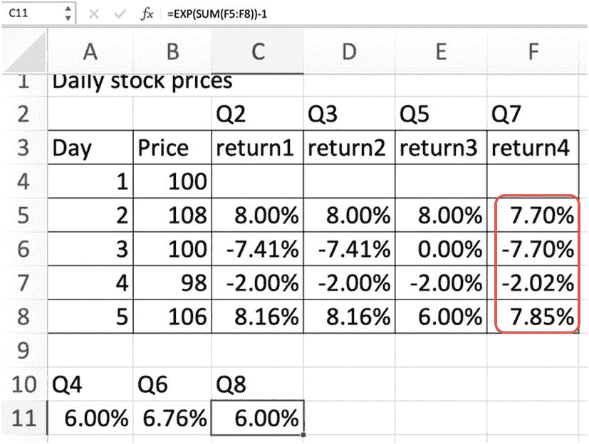

一个虚拟股票价格的 Excel 表格。它展示了使用对数收益率计算的期末收益率。列标题分别为日、价格、收益率 1、收益率 2、收益率 3 和收益率 4。Q7 列中所有五天的数据已突出显示。

**图 5-8** 使用对数收益率计算期末收益率

### Q9：讨论使用对数收益率的优点。

**答案：** 如前所述，使用对数收益率（或称“对数回报”）具有若干优点，详述如下：

*   **易于计算和分析：** 对数收益率简化了数学计算和统计分析。在处理多个时期的复利收益率时，这种简化尤为显著。由于对数将乘法和除法运算转化为加法和减法，多个时期的复利收益率（或“总收益率”）可以计算为这些时期对数收益率的简单和。

*   **对称性：** 对数收益率还表现出理想的对称性。如果价格先翻倍后减半，或先减半后翻倍，这两个时期的总对数收益率为零，反映了价格在这两个时期不变的事实。这种简单收益率不具备的对称性，常常能简化分析并提高结果的可解释性。假设股票价格 `S[t]` 变为 `S[t+1]`，然后又变回 `S[t]`，则产生的对数收益率将围绕零对称。例如，当股票价格从第 1 天的 100 变为第 2 天的 108，再变回第 3 天的 100 时，产生的对数收益率在第 2 天为 7.7%，在第 3 天为–7.7%。一个简单的数学分析就能立刻理解这一点：

```
log(S[t+1]/S[t]) = -log((S[t+1]/S[t])^(-1)) = -log(S[t]/S[t+1])
```

*   **正态性：** 此外，金融模型通常假设收益率呈正态分布。然而，据观察，简单收益率存在偏度和超额峰度，这意味着它们偏离了正态分布。另一方面，对数收益率往往具有更接近正态分布的属性，这使得它们更适合这些金融模型。

*   **连续复利收益率：** 对数收益率也代表连续复利收益率。这一特性使得对数收益率在特定的金融应用（尤其是涉及期权和其他衍生品）中成为首选，因为这些领域通常使用连续复利。

总而言之，使用对数收益率简化了数学计算和统计分析，实现了对称性和正态性，并代表了连续复利收益率。这些特性使得对数收益率在金融分析和建模中极具价值。

让我们看一个具体的例子来理解使用对数收益率的计算。

#### 使用对数收益率分析股票价格

我们首先下载谷歌 2023 年头几天的股票价格数据，如清单 5-1 所示。

```python
import numpy as np
import pandas as pd
import matplotlib.pyplot as plt
import yfinance as yf
symbol = 'GOOG'
df = yf.download(symbol, start="2023-01-01", end="2023-01-08")
>>> df
                开盘价      最高价      最低价      收盘价    调整收盘价       成交量
日期
2023-01-03 89.830002 91.550003 89.019997 89.699997 89.699997 20738500
2023-01-04 91.010002 91.239998 87.800003 88.709999 88.709999 27046500
2023-01-05 88.070000 88.209999 86.559998 86.769997 86.769997 23136100
2023-01-06 87.360001 88.470001 85.570000 88.160004 88.160004 26612600
```

清单 5-1 下载谷歌股票价格

我们可以使用 `pct_change()` 方法计算单期百分比收益率，如清单 5-2 所示。

```python
## 单期百分比收益率
returns = df.Close.pct_change()
>>> returns
日期
2023-01-03 00:00:00-05:00         NaN
2023-01-04 00:00:00-05:00   -0.011037
2023-01-05 00:00:00-05:00   -0.021869
2023-01-06 00:00:00-05:00    0.016019
名称: 收盘价, 数据类型: float64
```

清单 5-2 计算单期百分比收益率

这里，第一期的收益率是 `NaN`，因为没有前期的股票价格可用。

让我们使用原始方法，通过将第一个和最后一个收盘价作为输入（基于之前的定义）来计算期末收益率，如清单 5-3 所示。

```python
#### 期末收益率
terminal_return = df.Close[-1]/df.Close[0] - 1
>>> terminal_return
-0.01716826464354737
```

清单 5-3 使用原始定义方法计算期末收益率

我们也可以基于 `.cumprod()` 函数，通过复利计算 `(1+R)` 收益率来得到相同的值，如清单 5-4 所示。

```python
#### 累计收益率
cum_returns = (1+returns).cumprod() - 1
>>> cum_returns
日期
2023-01-03 00:00:00-05:00         NaN
2023-01-04 00:00:00-05:00   -0.011037
2023-01-05 00:00:00-05:00   -0.032664
2023-01-06 00:00:00-05:00   -0.017168
名称: 收盘价, 数据类型: float64
```

清单 5-4 通过对 1+R 格式的收益率进行复利计算，得到相同的累计期末收益率

两个期末收益率的相等运算符计算结果为 `True`：

```python
#### 检查期末收益率是否相等
>>> cum_returns.values[-1] == terminal_return
True
```

现在我们使用对数收益率进行相同计算，首先获得清单 5-5 中的单期对数收益率。

#### 对数收益率（1+R 格式）
```python
log_returns = np.log(1+returns)
>>> log_returns
日期
2023-01-03 00:00:00-05:00         NaN
2023-01-04 00:00:00-05:00   -0.011098
2023-01-05 00:00:00-05:00   -0.022112
2023-01-06 00:00:00-05:00    0.015892
名称: 收盘价, 数据类型: float64
清单 5-5
计算对数收益率
```

我们可以将之前所有时期的对数收益率相加，得到累计对数收益率，然后通过指数运算转换回原始尺度，最后减去 1，将`1+R`格式转换为简单收益率格式，如清单 5-6 所示。

#### 使用对数收益率计算累计收益率
```python
cum_return2 = np.exp(log_returns.cumsum()) - 1
>>> cum_return2
日期
2023-01-03 00:00:00-05:00         NaN
2023-01-04 00:00:00-05:00   -0.011037
2023-01-05 00:00:00-05:00   -0.032664
2023-01-06 00:00:00-05:00   -0.017168
名称: 收盘价, 数据类型: float64
清单 5-6
使用对数收益率计算累计收益率
```

再次，我们验证最后一个条目的值，确认它与之前的期末收益率相同：

#### 检查期末收益率是否相等
```python
>>> cum_return2.values[-1] == terminal_return
True
```

下一节将介绍趋势跟踪策略。

## 趋势交易简介

趋势交易，亦称趋势跟踪，是一种试图利用金融市场中现有趋势动力的策略。其运作前提是，证券价格往往会在一定时间内沿着相对持续的方向运动，要么上涨（多头），要么下跌（空头）。这是一种主动型交易策略，寻求利用资产价格持续的方向性动力来获利。

趋势交易的基本原则是，市场的动力（即资产价格的加速率）往往会在某一方向上持续一段时间。这里涉及两个关键概念：趋势和动力。趋势代表资产价格运动的方向，而动力则指示这种运动在一定时期内的强度或速度。它指的是资产价格趋势在未来自我维持的能力。强劲的动力可以持续向上或向下运动，这可以通过一系列技术指标来确认。

趋势交易者利用技术分析工具来识别潜在的买入和卖出机会。他们仔细分析价格图表，并使用各种技术指标，如移动平均线、`MACD`（指数平滑异同移动平均线）和相对强弱指数（`RSI`）等，来识别并确认资产的趋势方向和动力。这些技术指标提供的信号能帮助交易者做出何时开仓和平仓的明智决策。

在上升趋势中，趋势交易者会建立多头头寸，即买入资产，预期其价格将继续上涨。反之，在下降趋势中，趋势交易者会建立空头头寸，即卖出（或做空）资产，预期其价格将继续下跌。趋势跟踪策略旨在利用这些显著的价格变动，并根据预期创出新高的上升趋势或创出新低的下降趋势，在上涨和下跌市场中均能获利。

让我们从用于产生交易信号的技术指标开始。

## 理解技术指标

技术指标是基于历史价格（最高价、最低价、开盘价、收盘价等）或成交量进行的数学计算，可用于确定交易的开仓和平仓点。它们是许多交易策略和系统不可或缺的组成部分，能提供对市场行为的关键洞察。可将其视为从原始资产数据中衍生出的附加特征，这是机器学习中特征工程的一种实践。这使得技术指标高度依赖于具体证券：对某一特定证券有效的指标，对另一证券可能并不适用。选择正确的特征至关重要。

请注意，这些技术指标会作为数据集中每个观测值的附加特征出现。这意味着我们之前处理的价量表会增加更多列，每一列代表特定资产在特定时间下的一个单独技术指标。

在查看原始价格数据时，叠加一组技术指标有助于交易者更清晰地分析市场。例如，技术指标有助于确认市场是处于趋势之中，还是处于价格区间内震荡的盘整状态。

技术指标是许多交易策略和系统不可或缺的组成部分，能提供对市场行为的关键洞察。如您所述，它们是基于历史价格和成交量数据进行数学计算得出的工具，旨在预测未来的价格趋势或形态。

一些最常用的技术指标包括：

*   **移动平均线（MA）：** 移动平均线通过创建一个不断更新的平均价格来平滑价格数据。最常见的两种类型是简单移动平均线（`SMA`）和指数移动平均线（`EMA`）。它们有助于判断证券处于上升趋势还是下降趋势。稍后将详细展开。

*   **相对强弱指数（RSI）：** `RSI`衡量价格变动的速度和幅度，通常在 0 到 100 的范围内取值。高`RSI`值（通常高于 70）可能表示该资产处于超买状态，面临价格回调；而低`RSI`值（通常低于 30）则可能表明资产处于超卖状态，有望反弹。

*   **指数平滑异同移动平均线（MACD）：** 该指标是一个趋势跟踪的动力指标，显示了证券价格的两条移动平均线之间的关系。`MACD`的计算方法是用 12 日`EMA`减去 26 日`EMA`。

*   **布林带：** 这些带子在简单移动平均线上下两个标准差的位置绘制。它们有助于判断资产是否超买或超卖，并可能预示着趋势的结束。

*   **基于成交量的指标：** 这些指标包括诸如平衡交易量（`OBV`）等，它利用成交量流来预测股票价格的变化。

这些指标中的每一个都提供了对潜在市场动向的独特视角。通常，交易者会结合使用这些指标来构建稳健的交易策略。

另外请注意，这些指标并不能绝对准确地预测未来价格。相反，它们帮助交易者基于统计概率来识别潜在的交易机会。每个指标在特定的市场条件下效果最佳，并且可能并非普遍适用于所有资产类别、市场和交易周期。

下一节将对移动平均线进行更详细的介绍。

### 移动平均线介绍

移动平均线，也称为滚动平均线，是指定数据字段（例如每日收盘价）在给定的一组*连续*时间段内的平均值或平均数。随着新数据的出现，通过剔除最旧的值并添加最新的值来计算数据的平均值。它随着数据滚动，因此得名“移动平均线”。它提供了一种平滑金融资产价格数据的方法，以更清晰地识别趋势。

在计算股票价格的移动平均线时，其原理类似于在时间轴上移动一个固定大小的窗口，每个窗口报告一个单一数字，作为该窗口内所有价格点的平均值。当窗口在初始阶段没有足够的价格点时，通常会报告一个 `NA` 值。

当处理诸如每日股票价格之类的时间序列数据时，平均效应也可以被视为对时间序列的平滑处理，减少了数据中的短期波动和临时变化。

移动平均线有不同类型，其中简单移动平均线和指数移动平均线是最受欢迎的。简单移动平均线的计算很直接；我们只需计算当前固定大小窗口中所有价格点的平均值，并假设该窗口中所有价格点的权重相等。

指数移动平均线，或指数加权移动平均线（EWMA），会降低较旧价格点的权重。它的计算比 SMA 更复杂，因为它涉及需要计算的一个平滑因子。但基本思想是相同的：它是在特定时期内收盘价的平均值。

选择使用简单移动平均线还是指数移动平均线取决于交易者的偏好和具体的交易策略。通常，EMA 对近期价格变化的反应比 SMA 更快，这使得它们更受短期交易者或那些交易波动性市场的交易者青睐。

移动平均线可用于识别支撑位和阻力位。支撑位通常是指股票或市场在特定时期内难以跌破的价格水平或区域。阻力位则与支撑位相反，它是股票或市场难以突破上方的价格水平或区域。价格常常在这些水平附近反弹，这使得它们对于识别潜在交易入场和离场点非常有用。

此外，当两条移动平均线（例如，50 日和 200 日）相互交叉时，可能预示着趋势的变化。当较短期的 MA 向上穿越较长期的 MA 时，会给出看涨信号；而当较短期的 MA 向下穿越较长期的 MA 时，则会给出看跌信号。这些交叉点成为潜在的交易信号。

下一节将更多地关注简单移动平均线。

### 深入探讨简单移动平均线

时间 `t` 的简单移动平均线 `SMA[t]` 定义如下：

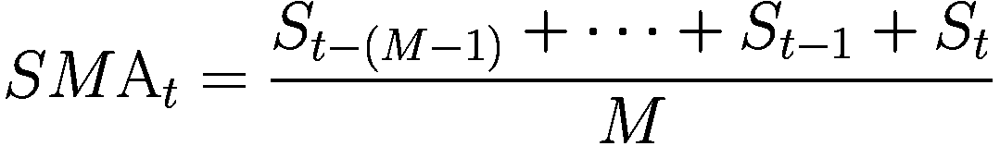

换句话说，要计算 `SMA[t]`，我们会取 `M` 个历史价格点（包括当前时期），然后计算这 `M` 个价格点的平均值。本质上，它是将过去 `M` 个周期（天、小时等）的证券价格相加，然后除以 `M`。这产生一个单一的输出点，即时间 `t` 的 SMA。随着新价格数据的出现，最旧的数据点被剔除，最新的数据点被纳入计算。这个“滚动”或“移动”计算会随着新价格数据的添加而继续进行。

SMA 常被用于趋势分析，因为它能平滑短期波动，提供更清晰的总体趋势图景。它是前 `M` 个价格点的未加权平均值。在这里，`M`（周期数）的选择至关重要，因为它会影响 SMA 的敏感性和可靠性。较小的 `M` 对价格变化的响应更快，但也可能产生更多的虚假信号。较大的 `M` 会提供更慢、更可靠的 SMA，但在指示趋势变化时可能反应较慢。

让我们看看如何计算 SMA。我们首先下载苹果公司 2022 年的股票价格数据，如清单 5-7 所示。

# 下载苹果公司的股票价格数据

```
import numpy as np
import pandas as pd
import matplotlib.pyplot as plt
import yfinance as yf
symbol = 'AAPL'
df = yf.download(symbol, start="2022-01-01", end="2023-01-01")
df.index = pd.to_datetime(df.index)
>>> df.head()
Open       High       Low        Close Adj  Close      Volume
Date
2022-01-03 177.830002 182.880005 177.710007 182.009995 180.434296 104487900
2022-01-04 182.630005 182.940002 179.119995 179.699997 178.144302 99310400
2022-01-05 179.610001 180.169998 174.639999 174.919998 173.405685 94537600
2022-01-06 172.699997 175.300003 171.639999 172.000000 170.510956 96904000
2022-01-07 172.889999 174.139999 171.029999 172.169998 170.679489 86709100
```

请注意，我们有一个名为 `Date` 的索引，它现在采用 `datetime` 格式，以便于绘图。

## 绘制每日调整后收盘价

清单 5-8 生成了每日调整后收盘价的图表。稍后我们将在同一张图上叠加其 SMA。

```
#### 绘制调整后收盘价
plt.figure(figsize=(15, 7))
df['Adj Close'].plot()
#### 设置标题和坐标轴的标签及大小
plt.title('Daily adjusted closing price of Apple', fontsize=16)
plt.xlabel('Time', fontsize=15)
plt.ylabel('Price ($)', fontsize=15)
plt.xticks(fontsize=15)
plt.yticks(fontsize=15)
plt.legend(['Close'], prop={'size': 15})
#### 显示图表
>>> plt.show()
```

运行命令会生成图 5-9，显示总体呈下降趋势。

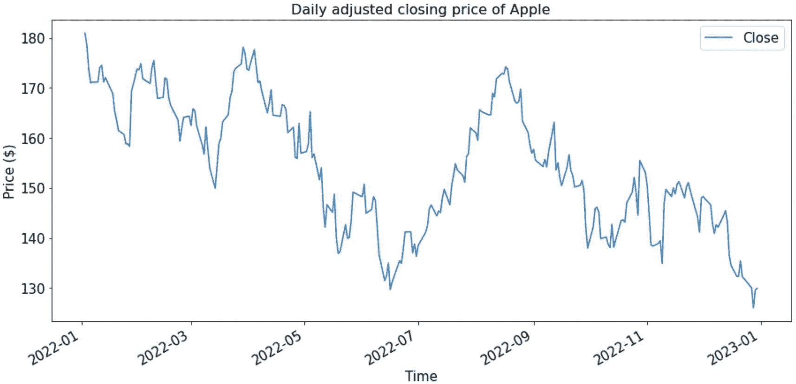

一张价格随时间变化的折线图，展示了 2021 年 1 月至 2023 年 1 月期间苹果公司收盘价的变化。收盘价曲线呈现波动趋势。

## 创建简单移动平均线

现在，我们创建一个窗口大小为 3 的 SMA 序列。我们可以对 Pandas Series 使用 `rolling()` 方法创建滚动窗口，然后使用 `mean()` 方法提取窗口（一个价格点集合）的平均值。清单 5-9 创建了一个名为 `SMA-3` 的新 SMA 列，并取子集仅保留两列：调整后收盘价和 SMA 列。

```
window = 3
SMA1 = "SMA-"+str(window)
df[SMA1] = df['Adj Close'].rolling(window).mean()
colnames = ["Adj Close",SMA1]
df2 = df[colnames]
>>> df2.head()
Adj Close  SMA-3
Date
2022-01-03 180.434296 NaN
2022-01-04 178.144302 NaN
2022-01-05 173.405685 177.328094
2022-01-06 170.510956 174.020315
2022-01-07 170.679489 171.532043
```

让我们暂停一下，观察这一列是如何生成的。可以看到，SMA 列的前两行为空。这是合理的，因为这两行都无法获得完整的三个周期移动窗口来计算平均值。换言之，当窗口中有空值时，我们无法计算平均值，除非应用额外的处理，例如在计算平均值时忽略空值。

我们注意到，SMA 列的第三个值为 177.844493。让我们通过手动计算来验证。以下命令取调整收盘价列的前三个条目并计算平均值，结果与上述值一致：

```
>>> np.mean(df['Adj Close'][:3])
177.84449259440103
```

这验证了计算过程。图 5-10 总结了本例中计算 SMA 的流程。

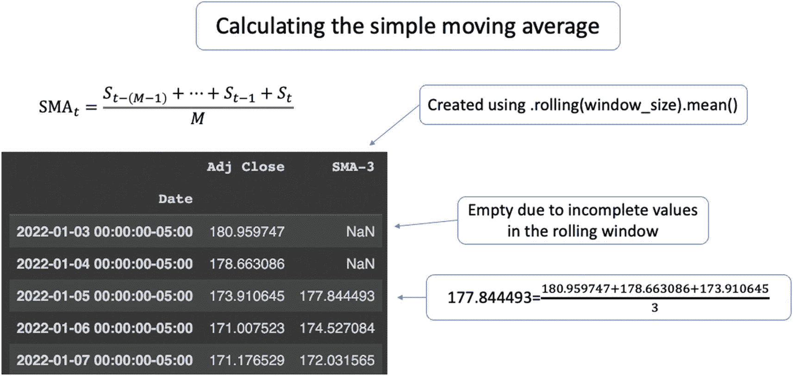

一张插图展示了计算简单移动平均线的公式。一个表格展示了通过命令 `rolling(window).mean()` 计算出的简单移动平均线。

请注意，我们可以配置 `rolling()` 函数中的 `min_periods` 参数，以控制在初始窗口数据不完整时的行为。例如，设置 `min_periods=1` 后，上述代码将根据窗口中*可用的*数据报告平均值。请参见以下代码片段进行对比：

```
df['New_SMA'] = df['Adj Close'].rolling(window, min_periods=1).mean()
>>> df[colnames + ['New_SMA']].head()
Adj Close  SMA-3      New_SMA
Date
2022-01-03 180.434296 NaN        180.434296
2022-01-04 178.144302 NaN        179.289299
2022-01-05 173.405685 177.328094 177.328094
2022-01-06 170.510956 174.020315 174.020315
2022-01-07 170.679489 171.532043 171.532043
```

注意，唯一的区别在于前两个条目，因为滚动窗口中的值集合不完整。

## 绘制收盘价及其 SMA

接下来，我们将三周期 SMA 与原始每日调整收盘价序列一起绘制，如代码清单 5-10 所示。

```
#### 折线图的颜色
colors = ['blue', 'red']
#### 绘制原始价格和 SMA 的折线图
df2.plot(color=colors, linewidth=3, figsize=(12,6))
#### 修改刻度大小
plt.xticks(fontsize=13)
plt.yticks(fontsize=13)
plt.legend(labels = colnames, fontsize=13)
#### 标题和标签
plt.title('每日调整收盘价及其 SMA', fontsize=20)
plt.xlabel('日期', fontsize=16)
plt.ylabel('价格', fontsize=16)
```

运行这些命令将生成图 5-11。注意，红色的三周期 SMA 曲线看起来比蓝色的原始价格序列波动性更小。此外，三周期 SMA 曲线从第三个条目开始。

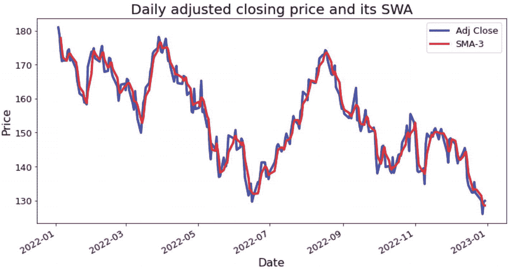

一张价格对日期的多线图展示了 2022 年 1 月至 2023 年 1 月期间调整收盘价和 SMA 3 的变化。所有三条曲线都有波动趋势。

## 创建 20 周期 SMA

现在，让我们添加另一个周期更长的 SMA。在代码清单 5-11 中，我们向 `df2` 添加了一个 20 周期 SMA 作为额外列。

```
window = 20
SMA2 = "SMA-"+str(window)
df2["SMA-"+SMA2] = df2['Adj Close'].rolling(window).mean()
colnames = ["Adj Close",SMA1,SMA2]
```

接下来，我们将 20 周期 SMA 叠加到之前的图表上，如代码清单 5-12 所示。

```
#### 折线图的颜色
`colors = ['blue', 'red', 'green']`
#### 绘制原始价格和 SMA 的折线图
`df2.plot(color=colors, linewidth=3, figsize=(12,6))`
#### 修改刻度大小
`plt.xticks(fontsize=13)`
`plt.yticks(fontsize=13)`
`plt.legend(labels = colnames, fontsize=13)`
#### 标题和标签
`plt.title('每日调整收盘价及其 SMA', fontsize=20)`
`plt.xlabel('日期', fontsize=16)`
`plt.ylabel('价格', fontsize=16)`
代码清单 5-12
绘制收盘价及两条 SMA

运行这些命令将生成图 5-12，该图显示，由于窗口大小更大，20 周期 SMA 比 3 周期 SMA 更平滑。

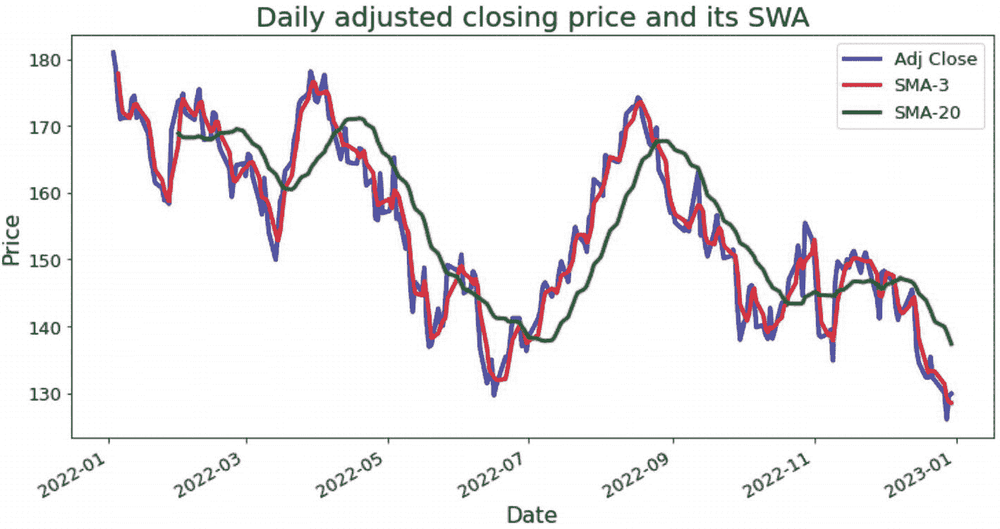

一张价格对日期的多线图展示了 2022 年 1 月至 2023 年 1 月期间调整收盘价、SMA 3 和 SMA 20 的变化。所有三条曲线都有波动趋势。

图 5-12

将每日价格与 3 周期和 20 周期 SMA 一同可视化

下一节将重点介绍指数移动平均线（EMA）。

### 深入理解指数移动平均线

指数移动平均线（EMA），也称为指数加权移动平均线（EWMA），是另一种移动平均线，它对最近的数据点赋予了更高的权重和重要性。这与简单移动平均线（对周期内所有数据点赋予相同权重）相比是一个关键的区别。

指数移动平均线（EMA）是一种广泛使用的方法，用于减少数据中的噪音并识别长期趋势。每个 EMA 值都是历史价格和当前价格的加权组合。每个价格点的权重随时间逐渐递减，从而给予近期数据点更大的权重。其计算公式如下：

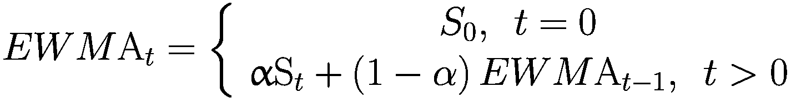

其中，α 是平滑因子，取值范围在 0 到 1 之间。平滑因子 α 决定了相对于现有 EMA，最新价格所获得的权重。α 值越高，近期价格的影响就越大。

至于时间 *t* = 0 时的第一个 EWMA 值，默认选择是设置 `EWMA[0] = S[0]`。因此，EMA 假设近期数据比旧数据更相关。这种假设有其合理性，因为与简单移动平均线相比，EMA 能更快地对变化做出反应，因而对近期的波动更为敏感。这也意味着函数不需要指定窗口大小，因为所有历史数据点都会被使用。

需要注意的是，虽然 EMA 比 SMA 能提供更准确和及时的信号，但由于它对短期价格波动更敏感，因此也可能产生更多的虚假信号。

可以通过调用 Pandas `Series` 对象的 `ewm()` 方法，然后使用 `mean()` 提取平均值来计算 EMA。我们可以在 `ewm()` 中设置 `alpha` 参数，以直接控制当前观测值相对于历史观测值的重要性。请参阅代码清单 5-13 的示例，其中我们设置 α = 0.1 以赋予历史价格更大的权重。

```
alpha = 0.1
df2['EWM_'+str(alpha)] = df2['Adj Close'].ewm(alpha=alpha, adjust=False).mean()
df2.head()
Adj Close  SMA-3      SMA-20 EWM_0.1
Date
2022-01-03 180.434296 NaN        NaN    180.434296
2022-01-04 178.144302 NaN        NaN    180.205296
2022-01-05 173.405685 177.328094 NaN    179.525335
2022-01-06 170.510956 174.020315 NaN    178.623897
2022-01-07 170.679489 171.532043 NaN    177.829456
代码清单 5-13
创建 EMA 序列
```

我们观察到 EMA 序列中没有缺失值。实际上，由于 EMA 加权方案的设计，第一个条目就是原始价格本身。

和往常一样，我们验证一下计算过程，以确保我们的理解是正确的。以下代码片段手动计算了第二个 EMA 值，该值与使用 `ewm()` 函数获得的值相同：

```
alpha=0.1
>>> alpha*df2['Adj Close'][1] + (1-alpha)*df2['Adj Close'][0]
180.73006591796877
```

我们继续创建另一个 α = 0.5 的 EMA 序列。换句话说，我们为当前观测值和历史观测值分配了相等的权重：

```
alpha = 0.5
df2['EWM_'+str(alpha)]= df2['Adj Close'].ewm(alpha=alpha, adjust=False).mean()
df2.head()
Adj Close  SMA-3      SMA-20 EWM_0.1    EWM_0.5
Date
2022-01-03 180.434296 NaN        NaN    180.434296 180.434296
2022-01-04 178.144302 NaN        NaN    180.205296 179.289299
2022-01-05 173.405685 177.328094 NaN    179.525335 176.347492
2022-01-06 170.510956 174.020315 NaN    178.623897 173.429224
2022-01-07 170.679489 171.532043 NaN    177.829456 172.054357
```

让我们将所有移动平均线放在一个图表中。在这里，`plot()` 函数将全部四列视为四个独立的序列，并针对索引列进行绘制，如代码清单 5-14 所示。

```
df2.plot(linewidth=3, figsize=(12,6))
plt.title('带有 SMA 和 EWM 的每日调整收盘价', fontsize=20)
plt.xlabel('日期', fontsize=16)
plt.ylabel('价格', fontsize=16)
代码清单 5-14
绘制所有移动平均线
```

运行这些命令将生成图 5-13。我们注意到 `EWM_0.1`（红线）接近 `SMA-20`（绿线），两者都对历史观测值赋予了更大的权重。另外两个移动平均线也是如此。对于 EMA，较小的权重因子 *α* 会导致高度平滑，而较大的值则会导致对近期变化做出更快的响应。

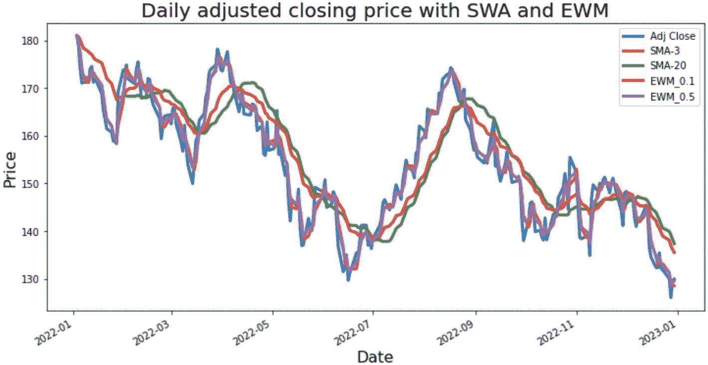

一幅价格相对于日期的多线图展示了 2022 年 1 月至 2023 年 1 月期间调整收盘价、`SMA-3`、`SMA-20`、`EWM_0.1` 和 `EWM_0.5` 的变化。所有三条曲线都呈现出波动趋势。

**图 5-13** 使用不同配置的 SMA 和 EMA 可视化每日收盘价

在了解了如何计算这些移动平均线之后，下一节将展示如何将它们作为技术指标来开发趋势跟踪策略。

### 实现趋势跟踪策略

基于移动平均线的趋势跟踪策略运作方式如下：存在两条移动平均线，一条短期移动平均线和一条长期移动平均线。当短期移动平均线上穿长期移动平均线时，发出买入信号，趋势交易者对该资产建立多头仓位。当短期移动平均线下穿长期移动平均线时，发出卖出信号，趋势交易者对该资产建立空头仓位。因此，该策略基于两条移动平均线的交叉点：一条是短期（快速）移动平均线，另一条是长期（慢速）移动平均线。

请注意，此框架也适用于只有一条移动平均线序列的情况。在这种情况下，当当前价格高于移动平均线时，趋势交易者会买入资产；当当前价格低于移动平均线时，则会卖出资产。此类交易行为的主要理由是，当价格高于移动平均线时，可能存在上升趋势，反之亦然。两条线之间的*交叉点*会产生交易信号。

其他动量相关技术指标，例如 RSI 和 MACD，也可用于发出入场或离场信号。

在下一节中，我们将使用长期和短期移动平均线实现一个趋势跟踪交易策略。使用此策略，我们实质上是在每个时间点寻找交易信号。也就是说，我们要决定在每个时间步长是买入、卖出还是持有资产。该信号由两条移动平均线的交叉点生成。我们假设执行交易操作时不产生交易成本，并且市场具有流动性（市场上有足够的苹果股票）且是完备的（不存在套利机会）。

让我们回顾一下我们将使用的主要 DataFrame。以下命令使用 `info()` 函数打印出摘要信息：
```

```
>>> df2.info()

DatetimeIndex: 251 entries, 2022-01-03 00:00:00-05:00 to 2022-12-30 00:00:00-05:00
Data columns (total 5 columns):
#   Column     Non-Null Count  Dtype
---  ------     --------------  -----
0   Adj Close  251 non-null    float64
1   SMA-3      249 non-null    float64
2   SMA-20     232 non-null    float64
3   EWM_0.1    251 non-null    float64
4   EWM_0.5    251 non-null    float64
dtypes: float64(5)
memory usage: 19.9 KB
```

现在，我们将使用 `SMA-3` 和 `SMA-20` 分别作为短期和长期移动平均线，它们的交叉点将产生交易信号。我们留作练习，尝试使用不同窗口大小的 SMA 以及不同加权方案的 EMA。

请注意，我们只能使用截至昨天的信息来为明天做出交易决策。我们不能使用今天的信息，因为在交易日中间收盘价尚不可用。为了强制执行此要求，我们可以将移动平均线向未来移动一天，如下面的代码片段所示。这本质上说明今天的移动平均线是根据截至昨天的历史信息得出的。

```python
#### 向未来移动一天，以便每天使用截至昨天的信息来为明天做出交易决策
df2['SMA-3'] = df2['SMA-3'].shift(1)
df2['SMA-20'] = df2['SMA-20'].shift(1)
```

现在让我们实现交易规则：如果 `SMA-3 > SMA-20` 则买入，如果 `SMA-3 < SMA-20` 则卖出。可以使用 `np.where()` 函数创建这样的 `if-else` 条件，如清单 5-15 所示。

```python
#### 识别买入信号
df2['signal'] = np.where(df2['SMA-3'] > df2['SMA-20'], 1, 0)
#### 识别卖出信号
df2['signal'] = np.where(df2['SMA-3'] < df2['SMA-20'], -1, df2['signal'])
df2.dropna(inplace=True)
```

清单 5-15 创建并识别买入和卖出信号

此处，一个正常交易日会在信号列中取值为 1 或 –1。当出现缺失值或其他特殊情况时，我们将其设置为 0。我们还使用 `dropna()` 函数通过删除包含任何 NA/缺失值的行，来确保 DataFrame 具有良好的质量。

我们可以按如下方式检查信号列的频率分布：

```
>>> df2['signal'].value_counts()
-1    135
1     96
Name: signal, dtype: int64
```

结果显示下跌天数多于上涨天数，这证实了前文显示的价格序列下行趋势。

接下来，我们介绍一个称为*买入并持有*的基准策略，它简单意味着我们在整个期间结束时持有一股苹果股票。此外，我们将使用对数收益率而不是原始收益率来简化计算。因此，我们不是对连续股价进行除法运算得到 $\frac{S_{t+1}}{S_t}$，而是取差值 `log(S[t+1]) - log(S[t])` 得到 $\log \frac{S_{t+1}}{S_t}$，然后可以对其取指数转换回 $\frac{S_{t+1}}{S_t}$。

以下代码片段计算了瞬时对数单期收益率，其中我们首先取调整后收盘价的对数，然后调用 `diff()` 函数获得连续价格对之间的差值：

```python
df2['log_return_buy_n_hold'] = np.log(df2['Adj Close']).diff()
```

现在来计算趋势跟踪策略的单期收益率。回顾我们之前创建的 `signal` 列。该列表示我们在每个单期是做多（值为 1）还是做空（值为 –1）。这也表明，如果 `S[t+1] > S[t]`，对数收益率 $\log \frac{S_{t+1}}{S_t}$ 为正，如果 `S[t+1] < S[t]`，则为负。当资产从 `S[t]` 移动到 `S[t+1]` 时，这创建了以下四种场景：

* 当我们做多资产且其对数收益率为正时，趋势跟踪策略报告正收益，即 `1 * log(S[t+1]/S[t])`。
* 当我们做多资产且其对数收益率为负时，趋势跟踪策略报告负收益，即 `1 * log(S[t+1]/S[t])`。
* 当我们做空资产且其对数收益率为正时，趋势跟踪策略报告负收益，即 `-1 * log(S[t+1]/S[t])`。
* 当我们做空资产且其对数收益率为负时，趋势跟踪策略报告正收益，即 `-1 * log(S[t+1]/S[t])`。

总结这四种场景，我们可以通过将 `signal` 与 `log_return_buy_n_hold`（基于买入并持有策略的单期对数收益率）相乘，得到趋势跟踪策略的单期对数收益率，如清单 5-16 所示。

```python
df2['log_return_trend_follow'] = df2['signal'] * df2['log_return_buy_n_hold']
```

清单 5-16 计算趋势跟踪策略的对数收益率

与买入并持有策略相比，关键区别在于趋势跟踪策略会生成额外的做空操作。也就是说，当股价下跌时，买入并持有策略会产生亏损，而趋势跟踪策略则会在交易信号指示做空时*如果*盈利。因此，创建一个良好的交易信号至关重要。

接下来，我们创建明确的交易行为。`signal` 列告诉我们，在趋势跟踪策略下，是否应对给定资产做多或做空。但这并不意味着我们每个时期都需要进行交易。如果连续两个时期的 `signal` 保持不变，我们就只需维持现有头寸，按兵不动。换句话说，这个特定交易日没有交易行为。这适用于 `signal` 列中连续出现两个 1 或 -1 的情况。

另一方面，当交易信号出现符号转换，即从 1 变为 -1 或从 -1 变为 1 时，我们就会采取行动。前者意味着从持有一单位股票变为做空该股票，而后者则相反。

要创建交易行为，我们可以再次对 `signal` 列使用 `diff()` 方法，如下所示：

```python
df2['action'] = df2.signal.diff()
```

我们可以使用 `value_counts()` 函数对不同交易行为的频率进行计数：

```
>>> df2['action'].value_counts()
0.0    216
2.0      7
-2.0      7
Name: action, dtype: int64
```

结果显示，绝大多数交易日都不需要采取行动。在有交易行为的 14 天中，有 7 天是从空头转为多头，另外 7 天是从多头转为空头。

我们可以将这些交易行为可视化为股价和移动平均线图表上的三角形。在代码清单 5-17 中，当短期移动平均线上穿长期移动平均线时，我们用朝上的绿色三角形表示买入行为。另一方面，当短期移动平均线下穿长期移动平均线时，我们用朝下的红色三角形表示卖出行为。

```python
plt.rcParams['figure.figsize'] = 12, 6
plt.grid(True, alpha = .3)
plt.plot(df2['Adj Close'], label = 'Adj Close')
plt.plot(df2['SMA-3'], label = 'SMA-3')
plt.plot(df2['SMA-20'], label = 'SMA-20')
plt.plot(df2.loc[df2.action == 2].index, df2['SMA-3'][df2.action == 2], '^',
color = 'g', markersize = 12)
plt.plot(df2[df2.action == -2].index, df2['SMA-20'][df2.action == -2], 'v',
color = 'r', markersize = 12)
plt.legend(loc=1);
```

代码清单 5-17 可视化交易行为

运行这些命令将生成图 5-14。同样，我们使用绿色三角形表示从空头转为多头，使用红色三角形表示从多头转为空头。

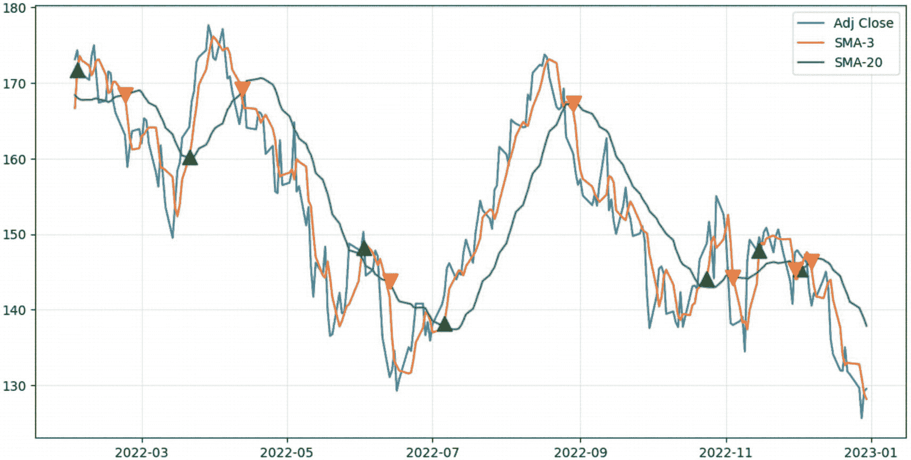

一张价格对日期的多线图展示了 2022 年 3 月至 2023 年 1 月期间调整后收盘价、SMA-3 和 SMA-20 的变化趋势。所有三条曲线均呈波动下降趋势。

可视化交易行为，包括从空头转为多头（绿色三角形）和从多头转为空头（红色三角形）

让我们分析两种交易策略在每个时期的累计收益率。具体来说，如果我们比较这两种交易策略，假设在 2022 年初持有一股苹果股票，我们想知道在 2022 年底的最终百分比收益率。

回顾一下，为了获得最终收益率（减去 1 之后），我们需要在每个时期乘以 `1+R` 收益率来进行复利计算。我们还知道 `1+R` 收益率等于两个连续价格之间的除法，即 `1+Rt,t+1 = St+1/St`。因此，为了计算最终收益率，我们首先使用 `np.exp()` 函数将对数收益率转换为通常的百分比格式，然后使用 `cumprod()` 方法执行累积乘积操作来进行复利计算。这通过代码清单 5-18 实现，其中我们省略了减去 1 的最后一步，并报告了 `1+R` 收益率。

```python
plt.plot(np.exp(df2['log_return_buy_n_hold']).cumprod(), label='买入并持有')
plt.plot(np.exp(df2['log_return_trend_follow']).cumprod(), label='趋势跟踪')
plt.legend(loc=2)
plt.title("不同交易策略的累计收益率")
plt.grid(True, alpha=.3)
```

代码清单 5-18
可视化累计收益率

运行这些命令将生成图 5-15，该图显示趋势跟踪策略明显优于买入并持有策略。然而，请注意，这是一个简化场景，未考虑交易成本和其他市场因素。要评估该交易策略（以及许多其他策略）在现实世界中的表现，还需要进行更多分析和测试。

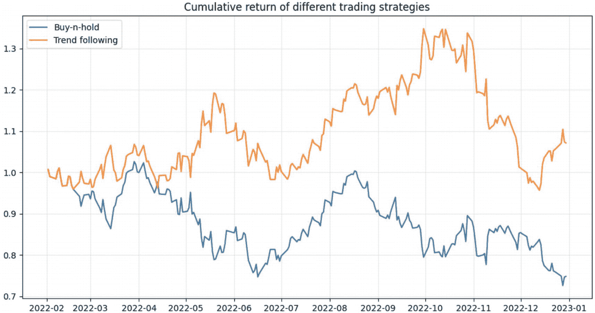

一张价格对日期的多线图展示了 2022 年 2 月至 2023 年 1 月期间买入并持有策略与趋势跟踪策略的趋势变化。两条曲线均呈波动趋势。

图 5-15

比较一股苹果股票的买入并持有策略与趋势跟踪策略的累计收益率

最后，我们比较两种策略的最终收益率：

```python
#### 买入并持有策略的最终收益率
>>> np.exp(df2['log_return_buy_n_hold']).cumprod()[-1] -1
-0.25156586984649587
#### 趋势跟踪策略的最终收益率
>>> np.exp(df2['log_return_trend_follow']).cumprod()[-1] -1
0.0711944903093773
```

结果表明，坚持买入并持有策略会亏损 25%，而使用趋势跟踪策略则能产生 7%的最终收益率。

## 总结

在本章中，我们介绍了流行的趋势跟踪策略的基础知识及其在 Python 中的实现。我们从一个处理对数收益率的练习开始，然后过渡到作为常用技术指标的不同移动平均线，包括简单移动平均线和指数移动平均线。最后，我们讨论了如何使用该策略生成交易信号并计算绩效指标，这将作为我们后续深入探讨其他候选策略时的一个良好基准策略。

## 练习题

-   从数学角度解释为什么对数收益率是对称的。

-   在计算移动平均线时，如果某一天的股价数据缺失，应如何处理？

-   窗口大小如何影响简单移动平均线的平滑度？`α` 对指数移动平均线的平滑度有何影响？

-   修改代码，计算移动中位数而非移动平均值。讨论中位数与平均值的区别。同一个滚动窗口内的最大值和最小值呢？

-   切换到指数移动平均线来推导交易信号，并讨论结果。

-   从数学上证明对数收益率在时间上具有可加性，并解释此性质在资产收益率背景下的重要性。

-   假设数据中有多个缺失的价格点，你将如何修改移动平均线计算来处理这些空缺？你的方法可能存在哪些潜在问题？

-   尝试为简单移动平均线使用不同的窗口大小，并为指数移动平均线使用不同的 `α` 值。讨论这些参数如何影响移动平均线对价格变化的敏感性。你将如何为这些参数选择最优值？