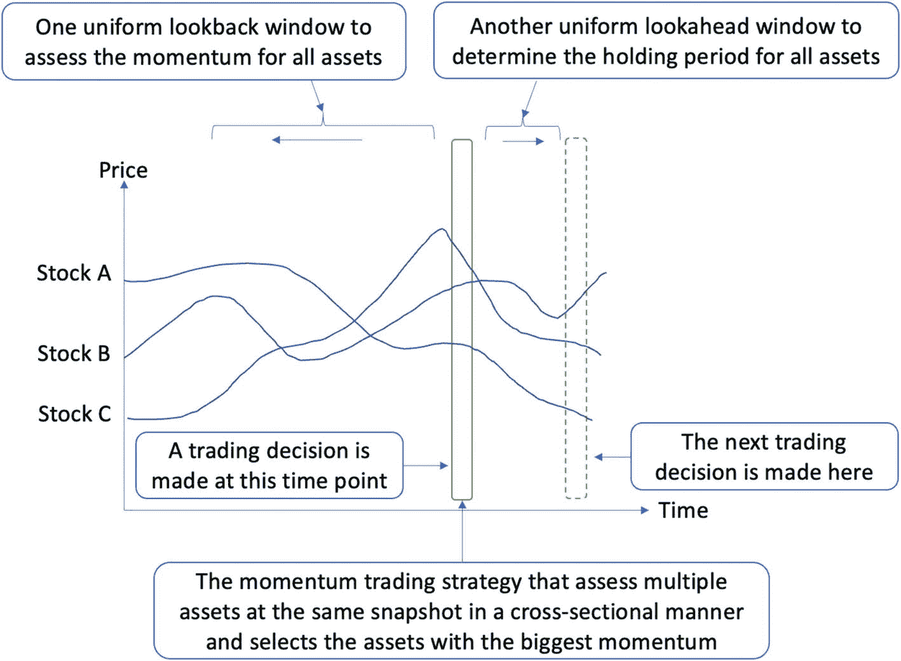
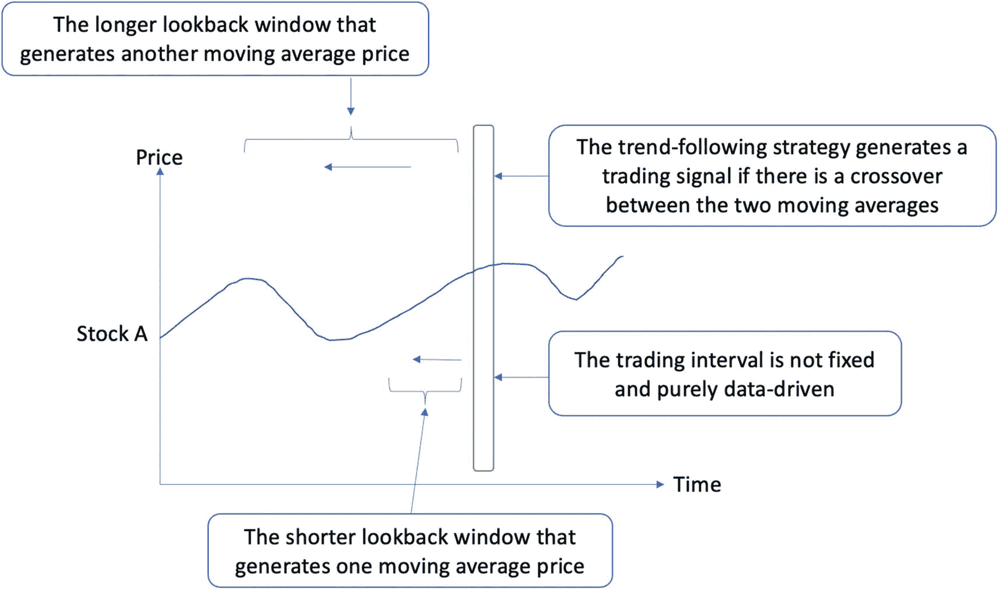
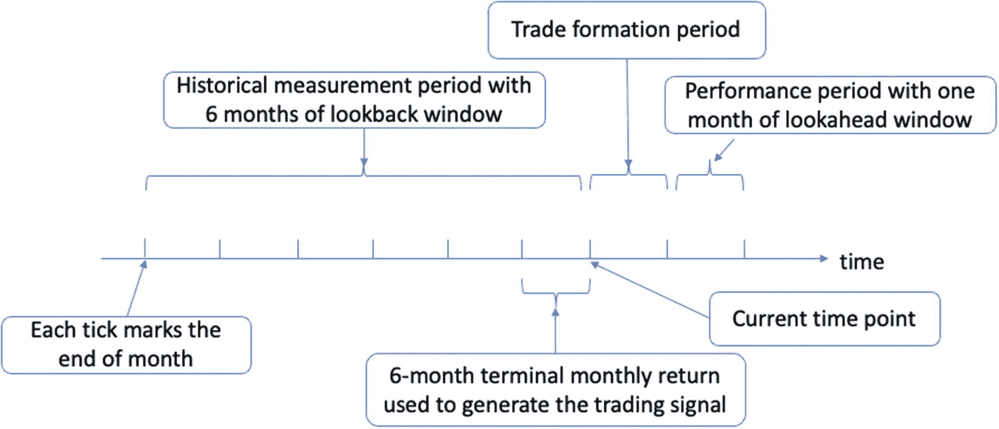

# 6. 动量交易策略

动量交易是一种利用价格变动强度作为开仓基础的策略，可对一篮子资产进行做多或做空。该策略根据近期价格趋势的强弱，买入和/或卖出选定的一组资产，其假设前提是：如果价格变动背后有足够的力量，这些趋势将延续同一方向。采用动量交易时，交易者意图利用价格变动的力量或速度来确定投资头寸。他们会根据近期价格趋势的势头，在精心挑选的资产中建立多头或空头头寸。关键的是，支撑这种方法的核心前提是：现有趋势在其力量足够强劲的情况下，将持续向同一方向发展。

当某项资产呈现上涨趋势并录得更高价格时，它总会吸引更广泛交易者和投资者的更多关注。资产所获得的这种高度关注会进一步推高其市场价格。这种动量会持续，直到大量卖方入场并穿透市场，提供充足的资产供应。一旦市场上有足够多的卖方，动量就会改变方向，迫使资产价格走低。这本质上是供需之间的价格动态。此时，市场参与者可能会重新评估该资产的公允价格，由于近期价格飙升，该资产可能被视为估值过高。

换言之，随着更多卖方涌入市场，动量改变其运行轨迹，推动资产价格向下移动。这本质上代表了经典的供需动态，以及从买方多于卖方的环境向卖方多于买方的环境转变。另外请注意，虽然价格趋势可能持续较长时期，但它们最终会在某个时点发生逆转。因此，识别这些拐点并相应调整头寸的能力同样重要。

## 动量交易介绍

动量交易者寻求在给定方向上识别趋势的主要驱动资产，利用预期的价格变化和预期的价格波动，而不是专注于预测趋势的顶峰。动量交易者不是试图寻找趋势的顶部和底部，而是关注价格变动的顶部和底部区间，这意味利用市场羊群效应以及跟随代表最显著价格变动的多数派的倾向。

这种方法本质上是利用市场羊群行为，即交易者倾向于跟随大多数市场共识的现象。在强劲的上涨或下跌趋势时期，许多交易者和投资者可能会决定随大流，做多或做空热门资产，从而启动或增强现有的动量。因此，动量交易在某种程度上是一种自我强化的机制：随着更多交易者识别出新兴趋势，他们通过增加买入或卖出力量来增强该趋势的强度。这进而吸引了更多市场参与者，进一步强化了已识别的趋势。这个过程一直持续，直到市场动态发生转变——要么由于基本面变化，要么由于市场情绪变化——导致现有趋势停滞或逆转。这种趋势的周期性特征构成了动量交易策略的特点，尽管把握动量的开始和结束（即入场点和出场点）极其困难。事实上，需要运用不同的技术指标来尝试完成这一任务。

### 深入探讨动量交易

动量交易建立在三个核心要素的融合之上：成交量、波动性和时间框架。

- **成交量**：这表示在特定时间框架内交易的资产数量。高交易量通常表明对该资产兴趣浓厚，并可能预示着该资产价格变动中新趋势的开始。相反，低成交量可能表明对该资产兴趣缺失，可能导致趋势反转。因此，成交量在确认趋势的强度和可持续性方面起着至关重要的作用。

- **波动性**：波动性代表资产价格在短时间内的变化程度。较高的波动性对应着更大的价格波动，如果这种变动是有利的方向，能为动量交易者提供良好的交易机会。然而，波动性是一把双刃剑，因为它也增加了重大亏损的风险。因此，理解和管理波动性是动量交易的关键方面。

- **时间框架**：时间框架代表已识别趋势的预期持续时间。根据不同的时间框架，动量交易者可能会进行日内交易，在一天内开仓和平仓（称为日内交易），或者持有头寸数周或数月（称为头寸交易）。时间框架的选择会影响交易的风险和回报特征，因为日内交易显然比头寸交易波动性更大。

在制定动量交易策略时，这些因素可以通过技术分析进行量化并整合在一起。该过程通常涉及分析历史价格数据和交易量，然后应用技术指标来识别潜在的交易信号。本质上，动量交易要求在潜在价格变动发生之前识别它们，并利用这些趋势来产生回报。

### 与趋势跟踪策略的对比

趋势跟踪策略和动量交易策略都基于动量概念，旨在捕捉资产的持续方向性运动或持续性表现。这两种策略都建立在对资产价格在一段时间内有朝特定方向移动的倾向（即动量现象）的观察之上。尽管基础相同，但两种策略的应用和侧重点却大相径庭。

我们已经讨论过，动量交易策略本质上是截面性质的。它涉及在特定时间点比较不同资产的动量，并投资于表现出最高动量的资产。这种比较分析发生在特定时间点，旨在比较多个资产之间的相对表现。因此，动量交易通常被描述为一种相对动量策略。

相比之下，趋势跟踪策略利用时间序列动量，仅关注资产自身随时间推移的历史表现。它分析单个资产在其自身历史中横跨多个时间点的价格模式，以识别潜在的交易信号。因此，趋势跟踪策略是绝对动量策略的一个实例。它强调单个资产的历史趋势，并旨在从其延续中获利。

### 观察回溯窗口的作用

回溯窗口在趋势跟踪和动量交易策略中的应用各不相同，这取决于它们独特的操作需求和目标。

如前章所述，趋势跟踪策略采用两个回溯窗口。这两个窗口（一个短期、一个长期）分别计算各自的移动平均线作为技术指标。这些移动平均线的交叉或金叉/死叉会生成交易信号，指示趋势方向的转变以及采取行动（买入或卖出）的恰当时机。因此，趋势跟踪策略中的双重回溯窗口是决策的基础，帮助交易者识别市场趋势的潜在转变。

相反，动量交易策略使用单一的、统一的回溯窗口来评估一系列资产。该窗口有助于识别在特定回溯期内表现最佳的资产。随后，另一个统一的前瞻窗口用于确定在做出交易决策后持有头寸的周期。本质上，回溯窗口根据资产过去的表现帮助选择投资目标，而前瞻窗口则提供了持有投资的时限，前提是假设资产的动量在此期间将持续。

因此，回溯窗口和前瞻窗口在动量交易中都至关重要，分别帮助交易者识别高动量资产和定义投资持有期。这些窗口的战略性运用为驾驭不断波动的市场动态提供了一种结构化的方法。

让我们详细阐述其区别。图 6-1 展示了按常规交易间隔（如前瞻窗口所示）选择三只股票的特征。每个交易决策（实线绿框所示）都考虑了同一回溯窗口内的历史股价。该交易决策可能是在特定时间点买入动量最高（基于历史平均收益率等指标）的股票，并卖出动量最低的股票。我们评估所有三只股票，并根据滚动回溯窗口，定期（即前瞻窗口）做出交易决策。



股价随时间变化的折线图。图中包含股票 A、股票 B 和股票 C 的三条波动曲线以及两条垂直条柱。条柱表示做出交易决策的时间点。此外，还标示了两个统一的回溯窗口，用于评估所有资产的动量。

**图 6-1** 三只股票的动量交易策略特征图示

动量交易策略在股票市场中尤为有效，它提供了一种系统化的方法来比较和分析同类资产。该策略对股票宇宙（在此例中为三只股票）进行横截面分析，根据各成分股在特定回溯期内的相对表现进行评估和排序。这一过程使交易者能够识别强势股和潜在滞涨股，利用它们近期的动量作为未来表现的代理指标。

在做出交易决策时，动量策略通常采用双管齐下的方法，建立一个包含两条“腿”的投资组合。第一条腿是“多头”腿，由预计将维持强劲上涨价格动能的排名靠前的资产组成。交易者买入这些股票，预期其价格上涨，旨在未来以更高价格卖出。第二条腿是“空头”腿，由显示出价格动能下降迹象的排名靠后的资产组成。交易者卖出这些股票，通常通过卖空操作，即借入股票在市场上卖出，意图日后以更低价格买回。其理念是从这些资产预期的价格下跌中获利。通过做多具有强劲正动量的资产并做空具有负动量的资产，只要所识别的动量在持有期内持续，交易者就有可能从上涨和下跌的市场中获利。

请注意，基于相对动量原理的动量策略，会维持其多头和空头头寸，而不受更广泛市场趋势的影响。这些策略的运作前提是：表现最强和最弱的股票将延续各自的轨迹，从而在投资宇宙中保持其相对位置。换言之，在牛市环境中，上涨动能最强的股票预计将跑赢大盘。同时，在熊市阶段，这些同样具有高动量的股票价格可能下跌，但其表现仍预计将优于其他下跌更快的股票。相反，排名靠后的、显示出动能下降的股票预计将跑输大盘。在上涨的市场中，这些股票的价值可能会增加，但增速慢于市场。类似地，在下跌市场中，这些股票预计会比大盘下跌得更快。因此，无论市场是牛市还是熊市，动量策略都依赖于相对表现的持续性。

### 趋势跟踪策略详解

趋势跟踪策略与动量交易策略在操作方式和交易频率上存在根本差异。趋势跟踪是一种基于时间序列的策略，它利用不同回溯周期（一个较短、一个较长）的移动平均线来生成交易信号。

如图 6-2 所示，趋势跟踪策略在每个时间点计算两条移动平均线，其中一条采用较长回溯窗口，另一条采用较短回溯窗口。当两条移动平均线发生交叉，即它们的相对位置从一个时间点变化到下一个时间点时，就会产生交易信号。例如，当短期移动平均线上穿长期移动平均线时，通常被视为**看涨**信号；而当它下穿时，则为**看跌**信号。



一张价格与时间的折线图。图中显示股票 A 呈波动上升曲线，并带有一条垂直柱线。该柱线表示交易间隔并非固定，而是完全由数据驱动。同时，该图在曲线上方和下方分别标注了较长和较短的回溯窗口。

**图 6-2** 单一股票趋势跟踪策略的特征描述

与动量交易策略（要求基于预定义的前瞻窗口进行定期交易）不同，趋势跟踪策略没有固定的交易频率设置。相反，它完全由当前数据驱动。交易操作依据移动平均线的相互作用做出，因此交易频率可能更低，但时机更具策略性。这种机制使趋势跟踪策略能够根据市场走势灵活调整，适应性更佳。

需要注意的是，在趋势跟踪策略中，核心关注点是某项资产是否处于上升或下降趋势。采用该策略时，交易者不会像动量策略那样关注不同资产之间的相对表现，而是侧重于识别并利用单个资产已形成的价格趋势。该策略的基本假设是：那些在一段时间内持续上涨或下跌的资产价格，将继续保持相同方向的运动。因此，当资产呈现上升趋势时，交易者会做多；当呈现下降趋势时，则会做空。其操作原则是，只要趋势持续，就“顺势而为”。市场的“趋势性”完全决定了该策略的交易决策。

总之，尽管这两种策略都旨在利用市场动量，但趋势跟踪策略依赖于对同一资产历史价格中绝对动量的时间序列分析，而动量交易策略则依赖于对多种资产间相对动量的横截面分析。因此，这两者从根本上存在差异。

下一节将介绍如何使用 Python 实现动量交易策略。

## 实现动量交易策略

道琼斯工业平均指数（DJIA，常简称为“道指”）是一个广受欢迎的股票指数，由 30 家总部位于美国、覆盖多个行业的大型上市公司组成。其代表的多行业特性使其成为评估市场整体趋势和表现的有效指标。然而，与其他更广泛的指数（如包含美国 500 家最大上市公司的`S&P 500`，后者能更准确地反映市场动态）相比，道指的样本池被认为相对较小。

在本节中，我们将以道琼斯工业平均指数的成分股作为参考范围，采用动量交易策略。这将涉及分析这些股票在指定时间段内的各自价格趋势以及彼此之间的相对表现，以识别潜在的投资机会。我们的策略将寻求从表现优异股票的持续动量中获利，同时做空表现不佳的股票，并预期这些趋势在短期至中期内将持续。换言之，我们将通过对 30 只成分股中表现最佳的股票做多、对表现最差的股票做空来做出交易决策。

首先，我们需要获取这 30 只股票的股票代码。

### 获取道琼斯指数股票代码

维基百科页面提供了这些股票的列表，网址为 [`https://en.wikipedia.org/wiki/Dow_Jones_Industrial_Average`](https://en.wikipedia.org/wiki/Dow_Jones_Industrial_Average)。我们不会手动将这些代码复制粘贴到编码控制台中，而是利用一个名为 `Beautiful Soup` 的网页抓取包。这是一个广泛用于解析 HTML 和 XML 文档的 Python 包。我们将使用该包创建解析树，并从特定的 HTML 页面中提取数据。

首先，如清单 6-1 所示，我们导入以下包：其中 `bs4` 是 Beautiful Soup 包，`requests` 包用于发送 HTTP 请求，而 `yfinance` 用于在获取股票代码后下载财务数据。

```python
import pandas as pd
import requests
from bs4 import BeautifulSoup
import os
import numpy as np
import pandas as pd
import yfinance as yf
```

**Listing 6-1: Importing relevant packages**

接下来，我们编写一个名为 `fetch_info()` 的函数来完成抓取任务。如清单 6-2 所示，我们首先将网页链接赋值给 `url` 变量，并将头部信息存储在 `headers` 变量中。头部信息是访问网站时必需的元数据。然后，我们通过 `requests.get()` 方法发送一个 GET 请求，从指定的网页链接获取信息，并使用 `BeautifulSoup()` 从抓取到的 HTML 文件中提取并解析数据，存储在 `soup` 变量中。接着，我们可以通过将特定的节点名称（此处为 `table`）传递给 `find_all()` 函数来定位数据，使用 Pandas 的 `read_html()` 函数将 HTML 数据读取为 DataFrame 格式，并在返回 DataFrame 对象之前删除不必要的列（`Notes` 列）。最后，如果抓取失败，函数将通过 `try-except` 控制语句打印错误信息。

```python
def fetch_info():
    try:
        url = "https://en.wikipedia.org/wiki/Dow_Jones_Industrial_Average"
        headers = {
            'User-Agent': 'Mozilla/5.0 (Windows NT 10.0; Win64; x64; rv:101.0) Gecko/20100101 Firefox/101.0',
            'Accept': 'application/json',
            'Accept-Language': 'en-US,en;q=0.5',
        }
        # Send GET request
        response = requests.get(url, headers=headers)
        soup = BeautifulSoup(response.content, "html.parser")
        # Get the symbols table
        tables = soup.find_all('table')
        # Convert table to dataframe
        df = pd.read_html(str(tables))[1]
        # Cleanup
        df.drop(columns=['Notes'], inplace=True)
        return df
    except:
        print('Error loading data')
        return None
```

**Listing 6-2: Fetching relevant information from the web page**

现在，让我们调用该函数，将结果存储在 `dji_df` 中，并输出前五行，如下所示：

```python
# get DJI components (ticker symbols)
dji_df = fetch_info()
>>> dji_df.head()
Company           Exchange  Symbol  Industry                Date added    Index weighting
0  3M                NYSE      MMM     Conglomerate            1976-08-09    2.41%
1  American Express  NYSE      AXP     Financial services      1982-08-30    3.02%
2  Amgen             NASDAQ    AMGN    Biopharmaceutical       2020-08-31    5.48%
3  Apple             NASDAQ    AAPL    Information technology  2015-03-19    2.84%
4  Boeing            NYSE      BA      Aerospace and defense   1987-03-12    3.36%
```

然后，我们可以提取 `Symbol` 列的值，并将其转换为列表格式：

```python
tickers = dji_df.Symbol.values.tolist()
```

拥有了道琼斯指数股票代码后，我们现在可以使用 `yfinance` 包下载这些股票代码对应的股票价格。

### 下载股票价格

调用 `download()` 函数时需要指定三个输入参数：股票代码、开始日期和结束日期。在此例中，我们将开始日期设置为 `2021-01-01`，结束日期设置为 `2022-09-01`，如清单 6-3 所示。

```python
start_date = "2021-01-01"
end_date = "2022-09-01"
df = yf.download(tickers, start=start_date, end=end_date)
```

**Listing 6-3: Downloading the daily stock prices of DJI tickers**

我们将重点关注后续分析所需的调整后收盘价：

```python
# use the adjusted closing prices for follow-up analysis
df = df['Adj Close']
```

至此，我们已经存储了道指 30 只成分股的股票价格，其中每列代表一只股票代码，每行代表一个相应的交易日。DataFrame 的索引遵循日期时间格式。

接下来，我们将日度股票价格转换为月度收益率。

### 计算月收益率

要从原始日度股价数据转换为月度收益率，我们需要经历几个步骤。第一步是使用 `pct_change()` 方法将价格转换为每日百分比收益率。如前一章所介绍，此函数会自动计算所有交易日的简单百分比收益率。由于这是日收益率，我们需要通过复利计算同一月份内所有日收益率，并将期末收益率作为月度收益率，从而将其汇总为月收益率。分解来看，我们需要将所有交易日按月分组，然后计算每个月的期末收益率。清单 [6-4] 将所有操作一步到位地串联起来，生成的月度收益率存储在 `mth_return_df` 中。

```
mth_return_df = df.pct_change().resample("M").agg(lambda x: (x+1).prod()-1)
清单 6-4
从日度价格生成月度收益率
```

虽然将相关操作串联起来看起来更简洁，但如果这是我们第一次接触这些操作，这并非学习它们的最佳方式。让我们分解这些操作。第一个操作是调用 `pct_change()` 方法，这是一个在许多场景下广泛使用的便捷函数。接下来是 `resample()` 函数，这是一个用于时间序列数据频率转换和重采样的便捷方法。让我们用一些虚拟数据来理解这个函数。

以下代码片段创建了一个 Pandas Series 对象，其中包含九个从零到八的整数，并由九个一分钟时间戳索引：

```
#### 创建一个包含 9 个一分钟时间戳的序列
index = pd.date_range('1/1/2000', periods=9, freq='T')
series = pd.Series(range(9), index=index)
>>> series
2000-01-01 00:00:00    0
2000-01-01 00:01:00    1
2000-01-01 00:02:00    2
2000-01-01 00:03:00    3
2000-01-01 00:04:00    4
2000-01-01 00:05:00    5
2000-01-01 00:06:00    6
2000-01-01 00:07:00    7
2000-01-01 00:08:00    8
Freq: T, dtype: int64
```

然后，我们将序列聚合成三分钟区间，并汇总落入同一区间内时间戳的值，如下列代码片段所示：

```
>>> series.resample('3T').sum()
2000-01-01 00:00:00     3
2000-01-01 00:03:00    12
2000-01-01 00:06:00    21
Freq: 3T, dtype: int64
```

从结果可以看出，`resample()` 函数按指定区间完成了聚合操作，其后跟的方法则对区间内的数据进行汇总。

回到我们的运行示例，我们将原始日收益率降采样为月收益率，因此每个月仅用一个数据点表示，而不是典型的 30 个。聚合操作遵循相同的过程来累积所有日收益率：转换为 `1+R` 格式，进行复利计算，然后再转换回简单收益率。

这里的新内容是 lambda 函数。我们使用 `x` 符号来表示一个通用的输入参数。在此例中，它将是给定月份内的所有原始日收益率。由于此 lambda 函数执行的是自定义操作，我们使用 `agg()` 函数来执行这个自定义函数，而不是像之前那样使用内置函数如 `sum()`。

至此，我们已经将日收益率转换为月度表示形式，其中每一个月度收益率都代表了该月内日收益率复利计算后的期末收益率。接下来，我们使用历史月度收益率来计算另一个指标，以指示当前月份的股票表现。

### 计算六个月期末收益率

我们知道，仅根据当前月份的收益率做出交易决策存在两方面的缺陷。首先，我们过度依赖当前月份，忽略了历史表现。其次，我们面临数据窥探的风险。也就是说，要计算某个月份中某一天的月度收益率，如果这一天不是该月的最后一天，我们就会窥探同一个月内所有未来的日收益率，以计算该月的期末收益率。

我们首先关注第一点，稍后再回到第二点。显然，我们需要找到一种方法，在生成当前月份的交易信号时纳入历史月度收益率。然而，与用于股票价格的移动平均线不同，使用相同算术平均值计算的历史平均月度收益率本质上是忽略了序列复利过程的。因此，我们需要将历史月度收益率视为一个序列过程，并对这些收益率进行复利计算（直到一个特定的回望窗口），以获得期末月度收益率。

这个期末月度收益率随后将作为选股和交易开仓的动量指标。这涉及到选择一个特定大小的回望窗口。假设窗口大小为六。现在，为了滚动计算每个月的六个月期末收益率，我们可以使用 `rolling()` 函数，该函数与计算移动平均线所用的函数相同。唯一的变化是，在将指针向后滚动六个月后，我们不再使用 `mean()` 取平均值，而是在 `apply()` 函数中使用 `np.prod` 对这些 `1+R` 月度收益率的乘积进行计算，以完成复利过程，如清单 [6-5] 所示。

```
#### 获取过去 6 个月的历史累积收益率，作为当前月份的期末收益率
past_cum_return_df = (mth_return_df+1).rolling(6).apply(np.prod) - 1
清单 6-5
计算六个月累积收益率
```

至此，我们已经计算出了六个月的期末月度收益率，即包括当前月份在内的过去六个月的累积收益率。这也解释了为什么在前面的结果中，前五个月显示为空值，而累积月度收益率是从第六个月才开始出现的。

接下来，我们看看如何使用这些期末收益率来生成交易信号。

### 生成交易信号

我们将回溯窗口固定为过去的六个月。动量交易策略涉及另一个前视窗口，用于确定未来的交易周期。具体来说，假设我们在当前月份制定交易策略并做出交易决策。如果前视周期为 1 个月，这些新头寸将在下个月持续一整月。然后，我们可以在下月底衡量这些头寸的表现。在这种情况下，前视窗口的大小被设置为 1。

此外，我们不能使用形成月份的月度期末收益率来生成交易信号，因为它使用了该月份内未来的日收益率。当处于形成月份中间时，我们可以使用的是上个月的月度期末收益率，即衡量期结束时。衡量期代表所有历史观测数据的集合，因此当将可用数据限制在该期限内时，可以避免数据窥探。图 6-3 说明了这种微妙之处。



一个带有 6 个标记点的时间线。每个刻度代表月末。标记的点分别表示：包含 6 个月回溯窗口的历史衡量期、6 个月的月度期末收益率、交易形成期、当前时间点，以及包含 1 个月前视窗口的表现期。

由于我们的数据截至 `2022-08-31`，我们将使用 `2022-07-31` 作为交易形成期。为了生成交易策略，我们将使用索引为 `2022-06-30` 的前一个月的月度期末收益率作为衡量期的结束点。我们借助 `datetime` 包来编码这两个日期，如代码清单 6-6 所示。

```
import datetime as dt
end_of_measurement_period = dt.datetime(2022,6,30)
formation_period = dt.datetime(2022,7,31)
Listing 6-6
识别衡量期与形成期
```

然后，这些日期将用于对存储在 `past_cum_return_df` 中的累积月度收益率 DataFrame 进行切片。在下面的代码片段中，我们将 `end_of_measurement_period` 变量传递给 `past_cum_return_df` 的 `.loc[]` 属性，以在行级别执行基于标签的索引。由于结果是按 30 个股票代码索引的 Pandas Series，我们将使用 `reset_index()` 方法将其索引重置为从零开始的整数，并将股票代码作为结果 DataFrame 中的一列。以下代码片段显示了衡量期结束时的累积期末收益率：

```
end_of_measurement_period_return_df = past_cum_return_df.loc[end_of_measurement_period]
end_of_measurement_period_return_df = end_of_measurement_period_return_df.reset_index()
>>> end_of_measurement_period_return_df.head()
index      2022-06-30 00:00:00-04:00
0     AAPL      -0.227936
1     AMGN       0.099514
2     AXP       -0.144964
3     BA        -0.320882
4     CAT       -0.126977
```

这 30 只道琼斯工业平均指数成分股的六个月月度期末收益率代表了每只股票的相对动量。我们可以使用以下代码片段观察正向和负向动量最高的股票代码和收益率：

#### 正向最高动量
```
>>> end_of_measurement_period_return_df.loc[end_of_measurement_period_return_df.iloc[:,1].idxmax()]
index                             CVX
2022-06-30 00:00:00-04:00    0.256955
Name: 7, dtype: object
```

#### 负向最高动量
```
end_of_measurement_period_return_df.loc[end_of_measurement_period_return_df.iloc[:,1].idxmin()]
index                             DIS
2022-06-30 00:00:00-04:00   -0.390535
Name: 8, dtype: object
```

这里，我们分别使用了 `idxmax()` 和 `idxmin()` 方法返回最大值和最小值的索引。

如果我们想要做多或做空某只资产，这两只股票将是最佳选择。与其只关注每个方向（做多和做空）中的一只股票，我们可以扩大范围，使用分位数方法进行股票选择。例如，我们可以根据所有股票的收益率将其分为五个组（也称为分位数或百分位数），并制定一个交易策略，做多顶部百分位中的股票，同时做空底部百分位中的股票。

为了获得每个收益率的所属分位数，我们可以使用 Pandas 的 `qcut()` 函数，该函数接收一个 Pandas Series，并根据其分位数将其切割成预先指定数量的组，从而将连续变量离散化为类别变量，更具体地说，是序数变量。以下代码片段提供了一个简短的示例：

```
>>> pd.qcut(series, 5, labels=False)
2000-01-01 00:00:00    0
2000-01-01 00:01:00    0
2000-01-01 00:02:00    1
2000-01-01 00:03:00    1
2000-01-01 00:04:00    2
2000-01-01 00:05:00    3
2000-01-01 00:06:00    3
2000-01-01 00:07:00    4
2000-01-01 00:08:00    4
Freq: T, dtype: int64
```

因此，`qcut()` 函数根据分位数将序列按排名顺序分为五组。我们现在可以类似地对收益率进行排名，并将结果存储在一个名为 `rank` 的新列中，如代码清单 6-7 所示。

```
end_of_measurement_period_return_df['rank'] = pd.qcut(end_of_measurement_period_return_df.iloc[:,1], 5, labels=False)
>>> end_of_measurement_period_return_df.head()
index      2022-06-30 00:00:00-04:00      rank
0     AAPL      -0.227936                       1
1     AMGN       0.099514                       4
2     AXP       -0.144964                       2
3     BA        -0.320882                       0
4     CAT       -0.126977                       2
```

代码清单 6-7：基于累积期末月度收益率对股票进行排序

我们现在可以使用这一列来选择表现最好和最差的股票。具体来说，我们将做多排名为 4 的股票，做空排名为 0 的股票。让我们通过代码清单 6-8 来观察这两组中的股票代码。

```
long_stocks = end_of_measurement_period_return_df.loc[end_of_measurement_period_return_df["rank"]==4,"index"].values
>>> long_stocks
array(['AMGN', 'CVX', 'IBM', 'KO', 'MRK', 'TRV'], dtype=object)
short_stocks = end_of_measurement_period_return_df.loc[end_of_measurement_period_return_df["rank"]==0,"index"].values
>>> short_stocks
array(['BA', 'CRM', 'CSCO', 'DIS', 'HD', 'NKE'], dtype=object)
```

代码清单 6-8：获取将做多或做空的股票代码

确定了要买入或卖出的股票组后，我们将执行交易操作并持有这些头寸一个月。由于当前期间是 2022-07-31，我们将在 2022-08-31 评估该动量策略的样本外表现。

### 评估样本外表现

首先，我们从 `mth_return_df` 中分别获取多头和空头头寸在 2022-08-31 索引处的月度收益。如代码清单 6-9 所示，我们使用 `dateutil` 包中的 `relativedelta` 函数将 `formation_period` 向前推移一个月，从而得到评估期。这构成了 `.loc[]` 属性中的行级条件。对于列级条件，我们使用 `isin()` 方法将列子集限定为多头头寸中的股票代码。多头头寸在评估期的表现结果存储在 `long_return_df` 中。

```python
from dateutil.relativedelta import relativedelta
long_return_df = mth_return_df.loc[formation_period +  relativedelta(months=1), \ mth_return_df.columns.isin(long_stocks)]
>>> long_return_df
AMGN   -0.021474
CVX    -0.026156
IBM    -0.005517
KO     -0.038336
MRK    -0.044549
TRV     0.018526
Name: 2022-08-31 00:00:00-04:00, dtype: float64
```

代码清单 6-9：获取评估期多头头寸中股票的表现

结果显示，大部分表现最佳的股票价格都在下跌，这直接反映了该时期的市场情绪。我们可以类似地获取空头头寸中表现最差股票的评估期表现，如代码清单 6-10 所示。

```python
short_return_df = mth_return_df.loc[formation_period +  relativedelta(months=1), \ mth_return_df.columns.isin(short_stocks)]
>>> short_return_df
BA      0.005900
CRM    -0.151614
CSCO   -0.014327
DIS     0.056362
HD     -0.035350
NKE    -0.073703
Name: 2022-08-31 00:00:00-04:00, dtype: float64
```

代码清单 6-10：获取评估期空头头寸中股票的表现

现在，我们基于这两个头寸计算评估期的收益。我们假设两个头寸均为等权重投资组合。因此，最终收益是各个头寸中所有成分股收益的平均值。此外，由于我们对表现最差的股票持有空头头寸，我们要从这些股票的空头头寸中减去平均收益，同时加上多头头寸的平均收益。代码清单 6-11 完成了计算。

```python
momentum_profit = long_return_df.mean() - short_return_df.mean()
>>> momentum_profit
0.015870799817079288
```

代码清单 6-11：计算总利润

因此，动量交易策略报告的最终月度收益率为 1.587%。现在，我们将其与买入并持有策略进行比较。

### 与买入并持有策略的比较

我们假设一个以道琼斯工业平均指数为基准的买入并持有策略。这意味着在 2021-01-01 同一交易期开始时建立该指数的多头头寸，并一直持有至 2022-09-01。我们首先通过传递 `"^DJI"` 作为股票代码来下载该指数的数据，如下代码片段所示：

```python
df_dji = yf.download("^DJI", start=start_date, end=end_date)
```

接下来，我们采用相同的方法计算月度终端收益率，如代码清单 6-12 所示。

```python
buy_n_hold_df = df_dji['Adj Close'].pct_change().resample("M").agg(lambda x: (x+1).prod()-1)
>>> buy_n_hold_df.head()
Date
2021-01-31 00:00:00-05:00   -0.007983
2021-02-28 00:00:00-05:00    0.031677
2021-03-31 00:00:00-04:00    0.066247
2021-04-30 00:00:00-04:00    0.027085
2021-05-31 00:00:00-04:00    0.019324
Freq: M, Name: Adj Close, dtype: float64
```

*代码清单 6-12*：计算买入并持有策略的月度终端收益率

然后，我们可以获取评估期的月度收益率，如下代码片段所示：

```python
>>> buy_n_hold_df.loc[formation_period + relativedelta(months=1),]
-0.04063613884907047
```

因此，买入并持有策略在同一评估期内报告的月度收益率为 –4.064%。尽管动量交易策略表现更好，但我们远不能就此宣称胜利。还需要对多个时期的样本外表现进行更稳健的回测。

## 本章小结

在本章中，我们研究了动量交易策略及其在 Python 中的实现。我们首先将其与上一章的趋势跟踪策略进行比较，讨论了它们在时间序列和横截面分析方面的联系与区别，以及回溯窗口和前瞻窗口的不同用法。接着，我们使用月度收益实现该策略，重点介绍了信号生成和样本外表现评估的过程。

在下一章中，我们将学习一种系统化的方法，通过回测来评估不同的交易策略。

## 练习题

*   尝试调整动量交易策略的参数（如窗口大小），并评估其表现。

*   尝试在不同的资产类别上实现动量交易策略，例如大宗商品、外汇或加密货币。讨论在策略表现中观察到的任何差异或相似之处。

*   尝试创建一个结合了动量交易和趋势跟踪的混合策略。与单一策略相比，这种混合策略的表现如何？

*   尝试将波动率指标（如布林带或收益率标准差）纳入动量交易策略。这对表现有何影响？

*   使用其他动量指标（如相对强弱指标 RSI 或移动平均收敛散度指标 MACD）实现该策略。将其表现与基本动量策略进行比较。

*   将交易成本纳入动量交易策略。这些成本如何影响策略的整体盈利能力？

*   在不同的市场时期（牛市、熊市、高波动期等）对动量交易策略进行回测。该策略在不同市场条件下的稳健性如何？