# 7. 回测交易策略

顾名思义，回测是指在将交易策略应用于实时市场之前，先在相关历史数据上对其进行测试的过程。它能够指示该策略在不同交易场景下可能的表现。在本章中，我们将深入探讨回测交易策略的细节，首先了解为什么回测是量化交易中的一个重要组成部分。

请注意，虽然回测可以提供富有洞察力的结果，但其有效性取决于数据的质量以及支撑交易策略的假设。例如，一个交易策略在牛市中可能表现很好，但了解它在熊市或市场高波动期间的表现同样重要。通过回测，我们可以分析该策略在不同市场阶段的稳健性，从而更全面地了解其表现。因此，一个好的做法是选择多个具有代表性的交易时期，并记录回测表现，以便获得对特定交易策略实际表现的稳健衡量。

## 回测介绍

回测允许我们使用历史数据模拟交易策略，并在实际建仓前分析其风险与收益。它是指利用历史数据逆向测试特定交易策略的过程，以评估该策略在后续未来数据上的表现。在训练机器学习模型的背景下，这种表现也被称为测试集表现，其常见约束是：在制定策略或训练模型时，测试集必须被完全隔离。这段留作测试的历史数据使我们能够评估所提交易策略的潜在变异性。

在此基础上，回测提供了一种在排除情绪和主观偏见的情况下衡量交易策略有效性的方法。它提供了一种科学方法来模拟策略的实际表现，进而可用于计算各种汇总指标，这些指标指示了策略的潜在盈利能力、风险以及随时间的稳定性。示例指标包括总回报、平均回报、波动率、最大回撤（稍后将介绍）和夏普比率。

在执行回测程序时，需要避免数据窥探（即窥视未来）并遵守时间序列。即使使用某段历史数据进行交叉验证，也需要确保交叉验证期处于训练期之外，更具体地说，是在训练期之后。换句话说，交叉验证期不能出现在训练期中间，从而在我们向前推进时保持时间序列的顺序。

在历史数据上回顾性测试交易策略的假设表现，使我们能够根据上述一系列指标评估其变异性。由于同一交易策略在针对不同投资期限和资产选择进行回测时，可能表现出截然不同的行为，因此在采用特定交易策略之前，覆盖一组全面的回测场景至关重要。进行全面且多样化的回测过程十分关键，因为交易策略的表现会因投资期限的选择、资产的选择以及测试期间的特定市场条件而发生巨大变化。

例如，我们可以对我们之前讨论过的趋势跟踪策略进行回测，该策略使用两条移动平均线，在发生交叉时生成交易信号。在此过程中，输入由两个窗口大小组成：一个用于短期窗口，一个用于长期窗口。输出是产生的回报、波动率或其他风险调整后回报（如夏普比率）。移动平均线的任意一对窗口大小都有一个对应的表现指标，我们会更改输入参数，以便在历史数据上获得最优表现指标。更具体地说，我们可以为每个参数创建一系列潜在值——例如，我们可以测试 10 天到 30 天的短期移动平均线，以及 50 天到 200 天的长期移动平均线。对于这些参数的每一种组合，我们都计算相应的表现指标。然后，最优参数会使这个选定的表现指标最大化（或最小化，取决于具体指标）。

## 回测的注意事项

请注意，良好的回测表现并不一定能保证未来的良好回报。这是由于回测的基本假设：任何在过去表现良好的策略，未来时期很可能也表现良好；反之，任何过去表现不佳的策略，未来很可能也表现不佳。由于金融市场是复杂的适应性系统，受到经济指标、地缘政治事件甚至投资者情绪变化等多种因素影响，所有这些因素都在不断演变，可能与过去的模式大相径庭。总之，过去的表现并不预示未来的结果。

然而，一个执行良好且产生积极结果的回测可以让人确信该策略在基本原理上是稳健的，并且在现实中实施时有可能产生利润。回测至少可以帮助我们淘汰那些未能证明自身价值的策略。然而，这一假设在股票市场上很可能失效，而股票市场的典型特征是信噪比低。由于金融市场不断快速演变，未来可能出现历史数据中不存在的模式，这使得外推比内插更为困难。

回测的另一个问题是可能过度拟合策略，使其在用于测试的历史数据上表现良好，但无法泛化到新的、未见过的数据上。当策略过于复杂，并且针对测试数据中的特异性和噪声进行定制，而非识别和利用支配数据生成过程的基本模式时，就会发生过拟合。

此外，历史数据的回测期需要具有代表性，并能反映多种市场状况。过度使用同一数据集进行回测称为数据挖掘，在这种情况下，同一数据集可能纯粹偶然地产生异常好的结果。例如，如果回测只包含经济繁荣时期，该策略可能看起来比在经济低迷或市场波动条件下更为成功。通过在全面且多样化的历史数据周期上评估交易策略，我们可以避免数据挖掘，并更好地判断良好的表现（如果有的话）是源于稳健的交易还是仅仅是侥幸。

数据挖掘，或称“p 值操纵”，是回测中的一个重要问题。它涉及对同一数据集反复运行参数略有不同的不同回测，直到找到理想的结果。这里的危险在于，积极的结果可能只是偶然产物，而非真正有效策略的指示。这种过度拟合可能导致策略在测试数据上表现异常出色，但在新的未见数据上却惨败。

另一方面，用于回测的股票选择也需要具有代表性，应包括那些最终破产、被出售或清算的公司。未能做到这一点会产生生存偏差，即人们挑选一组股票，只看那些存活至今的，而忽略那些中途消失的。通过排除那些已失败或经历重大结构性变化的公司，我们可能最终对策略的盈利能力和风险状况产生过于乐观的看法。这是因为，一般来说，存活下来的股票很可能是那些表现优于平均水平的股票。忽略因任何原因破产或退市的公司可能会扭曲结果，制造出策略成功的假象，而实际上该策略在真实环境中可能表现不佳。

此外，通过纳入表现不佳或失败的股票，我们能够更好地评估策略的风险，并为最坏情况做好准备。这有助于进行更准确的风险与回报评估，并在部署策略时为决策过程提供更充分的信息。该策略也将更加稳健，能够承受包括经济低迷期或行业特定冲击在内的多种市场环境。

最后，回测还应考虑所有交易成本，无论其多么微不足道，因为这些成本会在回测期间累积，并严重影响交易策略盈利能力的表现。这些成本可包括经纪费、买卖价差、滑点（交易预期价格与实际执行价格之间的差额），以及在部分情况下的税费和其他监管费用。在回测中忽略这些成本可能导致对策略表现的评估过于乐观。例如，一个高频交易策略在未考虑交易成本的回测中可能看似盈利，但在现实中，这类策略涉及大量交易，因此产生的高额交易成本会迅速侵蚀任何潜在利润。在回测阶段考虑这些成本，将能更准确地预估策略的净盈利能力。此外，交易成本的影响会因交易策略的具体细节而有很大差异。涉及频繁交易、利润率较窄或大额订单的策略，对回测过程中关于交易成本的假设可能尤为敏感。

在深入探讨回测的具体细节之前，我们先介绍一种名为最大回撤的流行风险衡量指标。

### 理解最大回撤

此前，我们介绍了夏普比率，它衡量的是每单位波动率的超额收益。还有许多其他的风险衡量指标，由于最大回撤在实践中被广泛使用，本节将对其进行介绍。具体来说，最大回撤衡量的是下行波动率的影响，因为上行波动率带来正回报，是更受欢迎的表现。换句话说，我们更关心的是偏离均值至下行方向，而不是上行方向。因此，当我们使用“风险”这一术语时，通常更强调导致更低甚至负回报的下行运动。

最大回撤被定义为从前一个财富高点到后续财富低点的最大损失百分比。这里，财富指资产价值，代表因持有资产而拥有的资金数额。由于它追踪可能的最大损失，最大回撤衡量的是假设我们在资产峰值时买入并在谷底卖出时可能遭受的损失。它衡量了在投资期内，如果我们足够不幸，从峰顶到谷底可能经历的最差回报。它指示了最坏情况可能有多糟糕，尽管它不一定反映交易策略的实际回报。

最大回撤为理解与投资策略相关的潜在风险提供了宝贵的视角，并且在凸显潜在负面表现的程度方面尤为有用。通过考虑一项投资策略在最坏情况下可能承受的最大百分比损失，我们可以了解投资者可能必须承受的潜在“痛苦”或“风险”。

要计算最大回撤，我们首先需要获得一系列财富指数，以指示在每个时间单位我们拥有的资金数额，假设采用一种买入并持有策略（或其他感兴趣的交易策略）。这是一个时间序列，记录每个时间点的投资组合价值，考虑了所有交易活动，包括股息再投资、市场回报的影响以及组合调整（如买入或卖出资产）。换句话说，财富指数追踪了一笔初始投资金额（例如 1000 美元）自投资期初用于购买资产以来的演变过程。

接下来，我们获取任何时间点的先前峰值财富指数。这给出了由于特定交易策略，自建仓以来在任何时间点曾经历过的最高投资组合价值。这实质上识别了投资组合价值的“最高点”。先前峰值与当前财富之间的差距即为回撤（转换为百分比），它指示了我们可能损失的金额。该值通常为负数或零，反映了当前投资组合价值从其最近峰值下跌的程度。

最后，最大差距即为最大回撤。这是回撤的最低（最负）值，表示从峰顶到谷底的最大百分比损失。它代表了如果在峰顶买入并在其后最低点卖出，投资组合在回测期间将承受的最严重损失。

图 7-1 展示了最大回撤的计算过程。我们首先获取交易资产的原始价格点，通常可以是日度或月度数据。这些价格被转换为单期收益率，然后通过复利计算序列收益率来获得财富指数。接着，通过计算每个时间点的累计最大财富与当前时间点财富值之间的百分比差异，得出单期回撤。最后，我们报告这些单期回撤中的最大值，作为最大回撤的最终结果。

#### 最大回撤计算

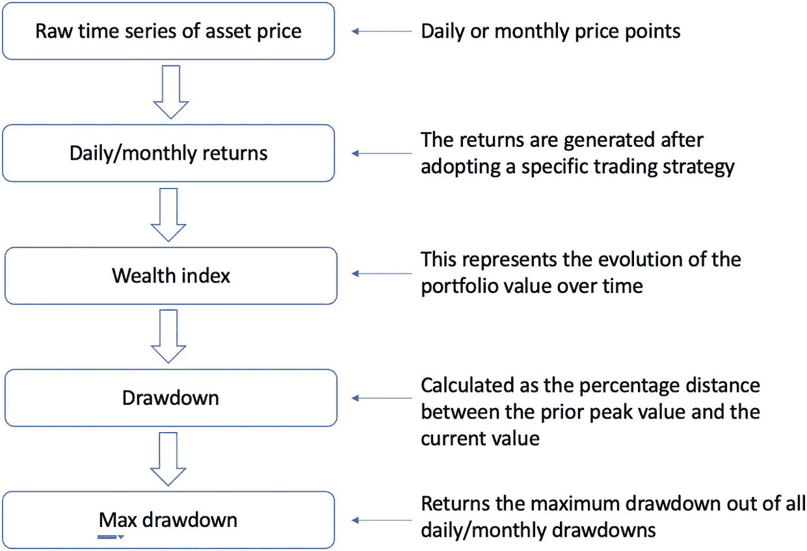

一个水平流程图示，用于计算最大回撤：从资产价格的原始时间序列（即每日或每月价格点）出发，通过每日或每月收益率、财富指数和回撤，最终返回所有每日或每月回撤中的最大值。

**图 7-1** 展示了计算最大回撤的过程

再次强调，最大回撤是一种风险度量，有助于我们理解回测期间交易策略的最坏情况。这种回撤计算过程在直觉上是合理的，因为大多数人将其视为与过去曾拥有的资产峰值价值相比所损失的金额。

**图 7-2** 提供了一个示例财富指数曲线以及相应的单期回撤。基于左图中蓝色线所示的累积财富指数曲线，我们可以得到绿色线所示的累积峰值。当财富持续创出新高时，该峰值线与财富指数线重合；当财富下降时，该峰值线保持水平。由此，我们可以形成一条由单期回撤组成的新时间序列曲线，该曲线表示这两条曲线之间的百分比差异，并返回最低点作为最大回撤。

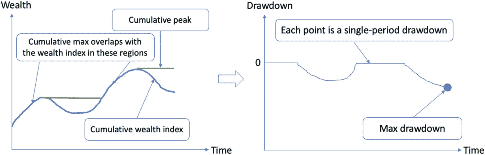

两条折线图，分别显示财富和回撤随时间的变化。最低点表示最大回撤，财富相对于时间的最高峰值表示累积峰值。曲线的下降部分表示累积财富指数，上升部分表示累积最大重叠。

**图 7-2** 基于示例财富指数曲线获取最大回撤

这里，最大回撤并不意味着我们将遭受这样的损失；它仅仅意味着我们在遵循特定交易策略时可能遭受的最大损失。如果我们极其不幸，恰好在资产价格达到峰值时买入并在低谷时卖出，该策略可能会产生这样的损失。具有高最大回撤的策略表明风险水平较高，因为这表明该策略历史上曾导致重大损失。另一方面，具有低最大回撤的策略表明风险较低，因为它过去未导致显著损失。

精明的读者可能会立即想到，是否存在基于回撤风险的经风险调整的收益指标。事实证明，确实存在，该指标称为卡尔玛比率（`Calmar ratio`），其计算方法是最近 36 个月的年化收益率与同期最大回撤之间的比率。

## 回撤风险的弊端

尽管回撤风险在从业者中是一种流行的度量方式，但它并不稳健，远非衡量经风险调整收益的完美指标。例如，每个单期回撤依赖于两个输入：当前财富值和累积峰值财富值。计算过程随后取两者之间的百分比差异。然而，当这两个输入中存在异常值时，计算出的回撤将直接受到影响。例如，其对异常值的敏感性可能会扭曲风险度量，并呈现出对潜在损失的失真图像。异常高或异常低的值可能会夸大或缩小回撤，导致对策略风险性的误导性解读。因此，它对数据集中的潜在异常值非常敏感。

使用回撤风险的另一个缺点是它对观测频率的依赖性。例如，每日或每周回撤表现出比每月回撤更高的波动性，因此更有可能产生深度回撤。然而，当将数据聚合为月度收益率时，这种深度回撤可能会完全消失或转移到其他位置。这种对数据粒度的敏感性进一步损害了回撤度量的稳健性。

同样值得指出的是，最大回撤仅提供了过去观察到的最坏情况的快照。它没有考虑其他可能发生但尚未发生的潜在不利情况。

接下来，我们使用 Python 来计算最大回撤。

## 计算最大回撤

在本节中，我们将重点介绍如何计算谷歌和微软在 2023 年初期的最大回撤。选择这两只股票是因为它们最近推出了大型语言模型：微软率先推出的 ChatGPT，以及随后谷歌发布的 Bard。两者都对股价造成了较大的冲击，导致微软股价上涨，而谷歌股价下跌。

我们先通过代码清单 7-1 下载 2023-01-01 至 2023-02-11 期间的股价数据。

```python
import numpy as np
import pandas as pd
import yfinance as yf
import matplotlib.pyplot as plt
start_date = "2023-01-01"
end_date = "2023-02-11"
df = yf.download(['GOOG', 'MSFT'], start=start_date, end=end_date)
>>> df.head()
代码清单 7-1
下载股价数据
```

如图 7-3 所示，该 DataFrame 具有多层列结构，其中第一层表示股价类型，第二层表示股票代码。

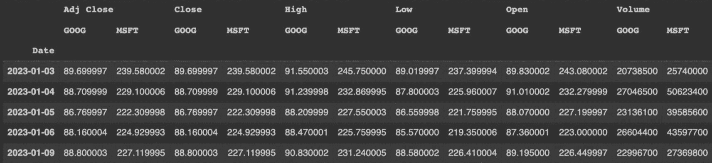

程序截图。它显示了一个包含 13 行 5 列的表，展示了五个不同日期的股价数据。

图 7-3

打印已下载股价数据的前五行

在后续分析中，我们将使用调整后的收盘价：

```python
df2 = df['Adj Close']
```

请注意，该 DataFrame 的索引是一个`datetime`格式的日期列表，如下所示：

```python
>>> df2.index
DatetimeIndex(['2023-01-03', '2023-01-04', '2023-01-05', '2023-01-06', '2023-01-09', '2023-01-10', '2023-01-11', '2023-01-12', '2023-01-13', '2023-01-17', '2023-01-18', '2023-01-19', '2023-01-20', '2023-01-23', '2023-01-24', '2023-01-25', '2023-01-26', '2023-01-27', '2023-01-30', '2023-01-31', '2023-02-01', '2023-02-02', '2023-02-03', '2023-02-06', '2023-02-07', '2023-02-08', '2023-02-09', '2023-02-10'], dtype='datetime64[ns]', name='Date', freq=None)
```

我们可以利用这些日期索引，按不同粒度的时间段（例如按月选择）对 DataFrame 进行子集划分。例如，以下代码片段提取了 2023 年 2 月的数据：

```python
>>> df2.loc["2023-02"]
GOOG       MSFT
Date
2023-02-01 101.430000 252.750000
2023-02-02 108.800003 264.600006
2023-02-03 105.220001 258.350006
2023-02-06 103.470001 256.769989
2023-02-07 108.040001 267.559998
2023-02-08 100.000000 266.730011
2023-02-09 95.459999  263.619995
2023-02-10 94.860001  263.100006
```

我们将要处理的 DataFrame 包含了从 2023-01-03 到 2023-02-10 共计 28 天的两只股票每日调整收盘价。我们可以使用`info()`方法查看这些详细信息：

```python
>>> df2.info()

DatetimeIndex: 28 entries, 2023-01-03 to 2023-02-10
Data columns (total 2 columns):
#   Column  Non-Null Count  Dtype
---  ------  --------------  -----
0   GOOG    28 non-null     float64
1   MSFT    28 non-null     float64
dtypes: float64(2)
memory usage: 672.0 bytes
```

让我们用折线图来可视化股价曲线：

```python
>>> df2.plot.line()
```

如图 7-4 所示，在此期间，两只股票均保持了上涨趋势，尽管谷歌在临近期末时股价遭受了重大打击。

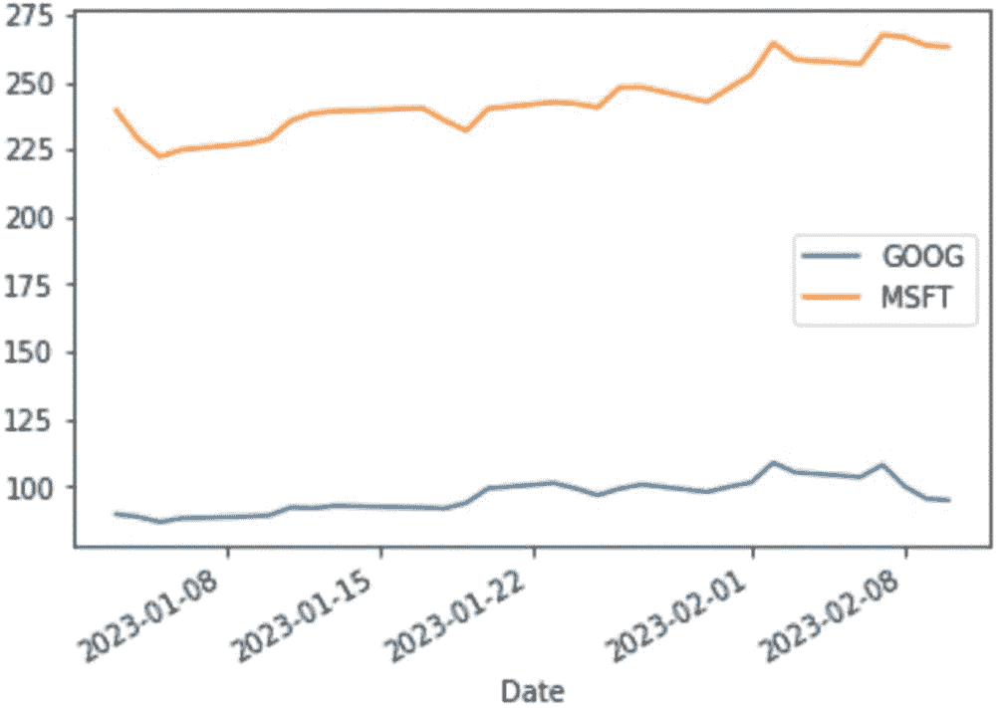

双线图展示了 2023 年 1 月至 2 月间五个不同日期 GOOG 和 MSFT 的变化情况。MSFT 的线条波动更大。

图 7-4

以折线图形式可视化股价

为了更好地理解股票收益，我们使用`pct_change()`函数将原始股价转换为单期百分比收益率：

```python
returns_df = df2.pct_change()
>>> returns_df.head()
GOOG      MSFT
Date
2023-01-03  NaN       NaN
2023-01-04 -0.011037 -0.043743
2023-01-05 -0.021869 -0.029638
2023-01-06  0.016019  0.011785
2023-01-09  0.007260  0.009736
```

同样，第一天显示`NA`值，因为没有前一天的股价作为基准来计算当日收益。

对应的每日收益率折线图如下所示，见图 7-5。

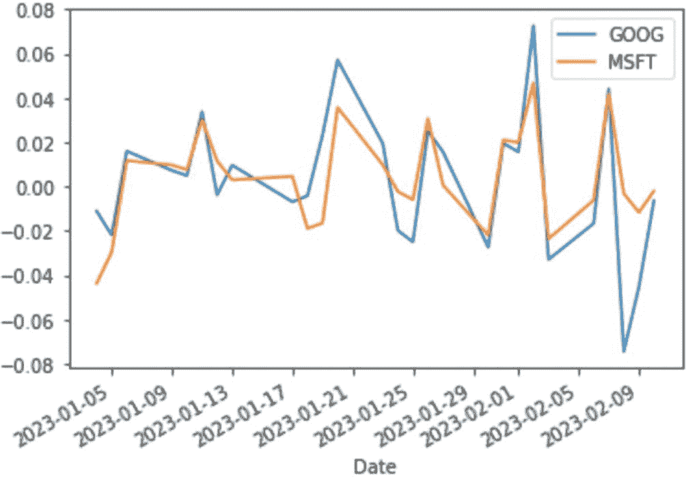

双线图展示了 2023 年 1 月至 2 月间十个不同日期 GOOG 和 MSFT 在股票收益率方面的变化情况。GOOG 的线条波动更大。

图 7-5

可视化股票收益率

```python
>>> returns_df.plot.line()
```

该图表明，除最后几天谷歌股价急剧下跌外，两只股票的每日收益率高度相关。正如我们稍后将展示的，这种下跌会反映在最大回撤指标中。此外，我们还观察到谷歌的波动性高于微软。

现在让我们构建财富指数时间序列。我们假设每只股票的初始投资额为 1000 美元，并基于此观察采用买入并持有策略下投资组合价值的每日演变。此财富过程依赖于基于 1+R 收益率、使用`cumprod()`函数进行的连续复利计算，如代码清单 7-2 所示。

```python
initial_wealth = 1000
wealth_index_df = initial_wealth*(1+returns_df).cumprod()
>>> wealth_index_df.head()
GOOG       MSFT
Date
2023-01-03 NaN        NaN
2023-01-04 988.963234 956.256801
2023-01-05 967.335558 927.915502
2023-01-06 982.831735 938.851285
2023-01-09 989.966623 947.992292
```

代码清单 7-2：构建财富曲线

我们可以将初始条目覆盖为 1000，以便绘制两只股票完整的财富指数曲线。这实质上是追踪我们在第一天（即 2023-01-03）向每只股票投资 1000 美元后，每个时间点所拥有的资金数额。

```python
wealth_index_df.loc["2023-01-03"] = initial_wealth
>>> wealth_index_df.head()
GOOG        MSFT
Date
2023-01-03 1000.000000 1000.000000
2023-01-04 988.963234  956.256801
2023-01-05 967.335558  927.915502
2023-01-06 982.831735  938.851285
2023-01-09 989.966623  947.992292
```

现在我们绘制两只股票的财富曲线，如图 7-6 所示。

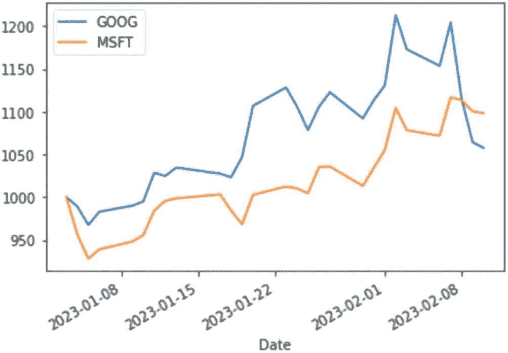

双线图展示了 2023 年 1 月至 2 月间五个不同日期 GOOG 和 MSFT 的变化情况。GOOG 的线条波动更大。

```python
>>> wealth_index_df.plot.line()
```

投资微软最终的投资组合价值高于谷歌，尽管后者在此前的所有交易日中均处于领先地位。事实证明，推动微软增长的强劲势头最大驱动力之一是它对 ChatGPT 模型的投资以及近期与搜索引擎 Bing 和 Edge 的整合。

有了财富指数，我们可以构建一个新序列来表示每个交易日的累计峰值财富值。这可以通过代码清单 7-3 中所示的`cummax()`函数实现。

```python
prior_peaks_df = wealth_index_df.cummax()
>>> prior_peaks_df.head()
GOOG   MSFT
Date
2023-01-03 1000.0 1000.0
2023-01-04 1000.0 1000.0
2023-01-05 1000.0 1000.0
2023-01-06 1000.0 1000.0
2023-01-09 1000.0 1000.0
```

代码清单 7-3：构建累计最大财富

让我们将其绘制成折线图，如图 7-7 所示。

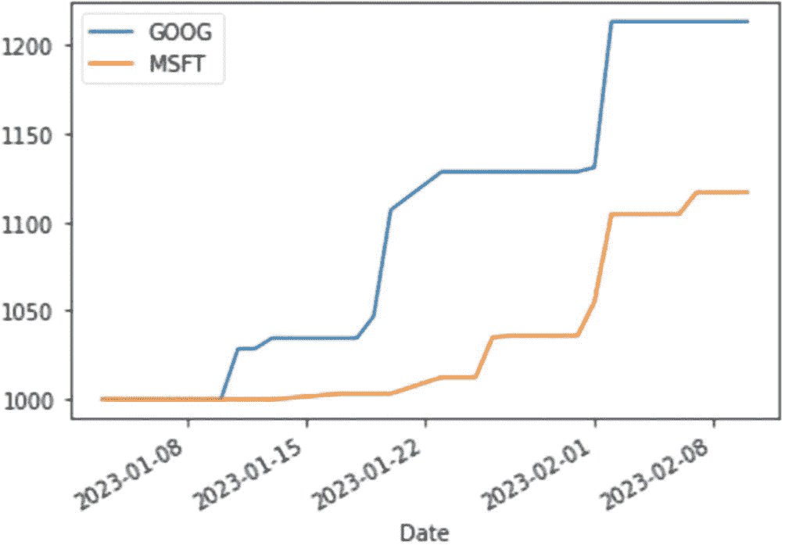

双线图展示了 2023 年 1 月至 2 月间五个不同日期 GOOG 和 MSFT 在累计最大值方面的变化情况。两者都随时间增加，但 GOOG 的线条波动更大。

```python
>>> prior_peaks_df.plot.line()
```

#### 计算每日回撤

现在我们已经具备了计算每日回撤的良好条件，即将其定义为当前财富值与先前峰值之间的百分比差异，如代码清单 7-4 所示。

```python
drawdown_df = (wealth_index_df - prior_peaks_df) / prior_peaks_df
>>> drawdown_df.head()
GOOG      MSFT
Date
2023-01-03  0.000000  0.000000
2023-01-04 -0.011037 -0.043743
2023-01-05 -0.032664 -0.072084
2023-01-06 -0.017168 -0.061149
2023-01-09 -0.010033 -0.052008
```

代码清单 7-4：计算每日回撤

对应的折线图如图 7-8 所示。

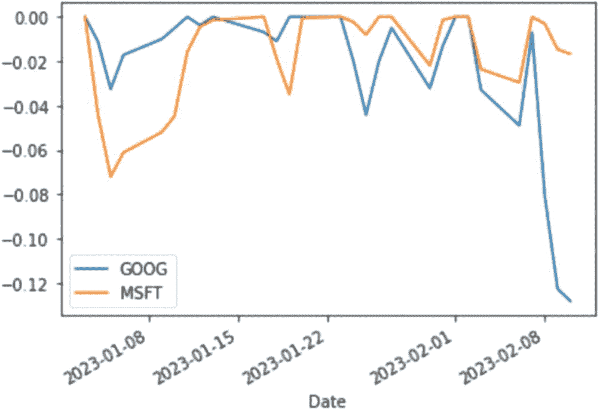

该双折线图展示了 2023 年 1 月至 2023 年 2 月期间五个不同日期中`GOOG`和`MSFT`的每日回撤变化。`GOOG`曲线波动更为剧烈。

```python
>>> drawdown_df.plot.line()
```

现在，Google 回撤在序列末端出现的急剧下降变得更为明显，我们或许能对此次暴跌的原因做出一些解释。事实证明，在 Google 推出 Bard 以回应其竞争对手微软 ChatGPT 的挑战时，演示过程中出现了一个事实性错误。该错误导致 Google 股价暴跌，市值蒸发 1000 亿美元。

回到最大回撤的计算，我们现在可以收集这些每日回撤的最小值，作为该交易策略的最大回撤最终报告，如代码清单 7-5 所示。请注意，我们在投资期初对两只股票都建立了多头头寸，因此该交易策略仅是简单的买入并持有。

```python
>>> drawdown_df.min()
GOOG   -0.128125
MSFT   -0.072084
dtype: float64
```

代码清单 7-5：计算最大回撤

此处，我们取每日回撤的最小值，因为它是一个负值。在实际操作中，我们通常将其报告为正数。结果显示，在同一交易期间，Google 的最大回撤（再次以负值表示，并解释为绝对值）远大于微软，是微软最大回撤的两倍多。

我们可以使用`idxmin()`函数观察最大回撤发生的日期，该函数返回整个列/序列中最小值对应的日期索引，如下列代码片段所示：

```python
>>> drawdown_df.idxmin()
GOOG   2023-02-10
MSFT   2023-01-05
dtype: datetime64[ns]
```

我们还可以通过使用`loc()`函数对更粗略的日期索引进行子集选取，来限制`DataFrame`的范围。例如，以下代码返回 2023 年 1 月每只股票的最大回撤及其对应日期：

```python
>>> drawdown_df.loc["2023-01"].min()
GOOG   -0.044264
MSFT   -0.072084
dtype: float64
>>> drawdown_df.loc["2023-01"].idxmin()
GOOG   2023-01-25
MSFT   2023-01-05
dtype: datetime64[ns]
```

到目前为止，我们已经按照必要步骤成功计算了最大回撤。事实证明，当这些步骤变得繁琐复杂时，函数会非常有帮助。使用函数将计算过程封装成一个黑盒，使我们能够关注整体框架，而无需在每次计算最大回撤时陷入内部细节的泥沼。

我们定义一个名为`drawdown()`的函数来完成此任务，如代码清单 7-6 所示。该函数以单个`Pandas Series`形式的每日收益率作为输入，执行上述计算步骤，并以一个`DataFrame`的形式返回每日财富指数、先前峰值和回撤作为输出。

```python
def drawdown(return_series: pd.Series):
"""
Input: a time series of asset returns
Output: a DataFrame that contains:
- the wealth index
- the prior peaks
- percentage drawdowns
"""
wealth_index_series = initial_wealth*(1+return_series).cumprod()
prior_peaks_series = wealth_index_series.cummax()
drawdown_series = (wealth_index_series - prior_peaks_series) / prior_peaks_series
return pd.DataFrame({
"Wealth index": wealth_index_series,
"Prior peaks": prior_peaks_series,
"Drawdown": drawdown_series
})
```

代码清单 7-6：定义函数计算财富指数、先前峰值和回撤

请注意，计算过程保持不变。唯一的变化是将相关信息（财富指数、先前峰值和回撤）整合到一个`DataFrame`中。此外，我们明确指定了输入类型为`Pandas Series`，这省去了后续检查输入类型的需要。

现在，让我们通过将 Google 的每日收益率作为输入序列来测试此函数：

```python
>>> drawdown(returns_df["GOOG"]).head()
Wealth index  Prior peaks  Drawdown
Date
2023-01-03 NaN           NaN          NaN
2023-01-04 988.963234    988.963234   0.000000
2023-01-05 967.335558    988.963234  -0.021869
2023-01-06 982.831735    988.963234  -0.006200
2023-01-09 989.966623    989.966623   0.000000
```

以下代码片段将财富指数和先前峰值绘制为折线图：

```python
>>> drawdown(returns_df["GOOG"])[['Wealth index', 'Prior peaks']].plot.line()
```

运行该命令生成图 7-9。

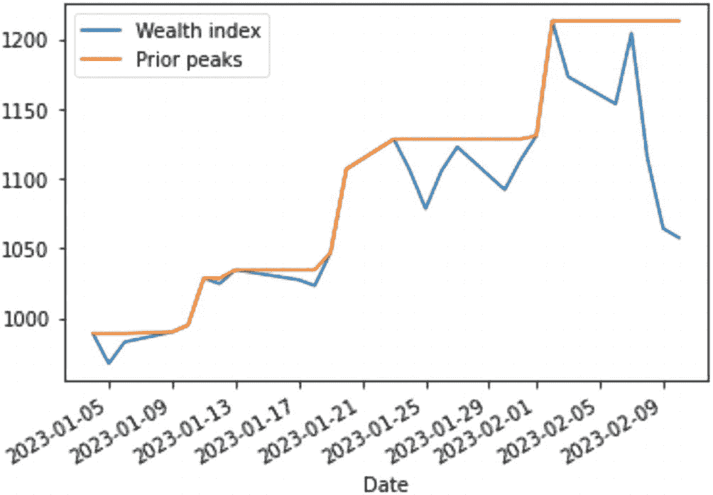

*图 7-9：将财富指数和先前峰值可视化为折线图*

该双折线图展示了 2023 年 1 月至 2023 年 2 月期间十个不同日期中财富指数和先前峰值的变化。两者都随时间增加，但财富指数的曲线波动更大。

我们可以使用`loc()`函数对特定月份进行子集选取。例如，以下代码返回 2023 年 1 月的相同曲线：

```python
>>> drawdown(returns_df.loc["2023-01","GOOG"])[['Wealth index', 'Prior peaks']].plot.line()
```

运行该命令生成图 7-10。

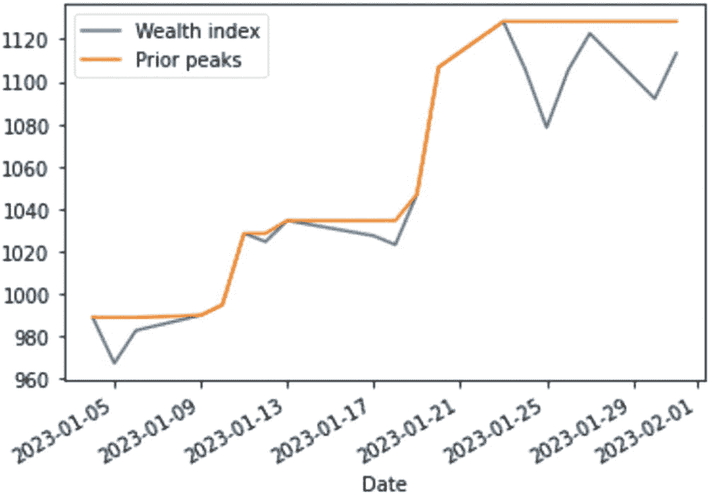

*图 7-10：将 2023 年 1 月的财富指数和先前峰值可视化为折线图*

该双折线图展示了 2023 年 1 月至 2023 年 2 月期间八个不同日期中财富指数和先前峰值的变化。两条曲线都随时间增加，但先前峰值的曲线波动更大。

类似地，我们可以获取两只股票的最大回撤及其对应日期，如下列代码片段所示：

```python
>>> drawdown(returns_df["GOOG"])['Drawdown'].min()
-0.1281250188455857
>>> drawdown(returns_df["GOOG"])['Drawdown'].idxmin()
Timestamp('2023-02-10 00:00:00')
>>> drawdown(returns_df["MSFT"])['Drawdown'].min()
-0.035032299621028426
>>> drawdown(returns_df["MSFT"])['Drawdown'].idxmin()
Timestamp('2023-01-19 00:00:00')
```

以下代码片段返回 2023 年 1 月两只股票的最大回撤：

```python
>>> drawdown(returns_df.loc["2023-01","GOOG"])['Drawdown'].min()
-0.04426435893749917
>>> drawdown(returns_df.loc["2023-01","MSFT"])['Drawdown'].min()
-0.035032299621028426
```

在下一节中，我们将讨论使用趋势跟踪策略进行回测的过程。

## 回测趋势跟踪策略

在本次回测练习中，我们将计算四个指标作为绩效指标：年化收益率、年化波动率、夏普比率以及最大回撤。由于趋势跟踪策略仅适用于单一资产，我们将基于谷歌（Google）股票 2022 年的调整后收盘价对其进行回测。

首先，让我们下载数据集并将其存储在`df_goog`中：

```python
df_goog = yf.download(['GOOG'], start="2022-01-01", end="2023-01-01")['Adj Close']
df_goog = pd.DataFrame(df_goog)
>>> df_goog.head()
Adj Close
Date
2022-01-03 145.074493
2022-01-04 144.416504
2022-01-05 137.653503
2022-01-06 137.550995
2022-01-07 137.004501
```

现在，我们创建两条移动平均线：一条是通过`ewm()`方法计算得到的跨度为 5 的指数移动平均线（短期曲线），另一条是通过`rolling()`方法计算得到的窗口大小为 30 的简单移动平均线（长期曲线），如代码清单 7-7 所示。

```python
sma_span = 30
ema_span = 5
short_ma = 'ema'+str(ema_span)
long_ma ='sma'+str(sma_span)
df_goog[long_ma] = df_goog['Adj Close'].rolling(sma_span).mean()
df_goog[short_ma] = df_goog['Adj Close'].ewm(span=ema_span).mean()
>>> df_goog.head()
Adj Close  sma30 ema5
Date
2022-01-03 145.074493 NaN   145.074493
2022-01-04 144.416504 NaN   144.679700
2022-01-05 137.653503 NaN   141.351501
2022-01-06 137.550995 NaN   139.772829
2022-01-07 137.004501 NaN   138.710106
```

代码清单 7-7 计算短期和长期移动平均线

请注意，跨度与我们之前介绍的 *α* 参数直接相关，关系如下：

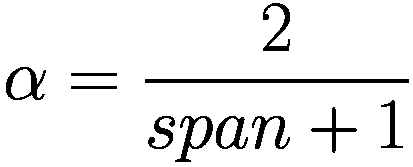

其中 *span* ≥ 1。

由于生成交易信号需要每个时间点上的两条移动平均线都可用，我们使用`dropna()`方法删除 DataFrame 中包含任何 NA 值的行，并将`inplace=True`设置为直接在 DataFrame 内进行修改：

```python
df_goog.dropna(inplace=True)
>>> df_goog.head()
Adj Close  sma30      ema5
Date
2022-02-14 135.300003 137.335750 137.064586
2022-02-15 136.425507 137.047450 136.851559
2022-02-16 137.487503 136.816483 137.063541
2022-02-17 132.308502 136.638317 135.478525
2022-02-18 130.467499 136.402200 133.808181
```

现在，让我们通过以下代码片段将这两条移动平均线与原始价格曲线一起绘制出来：

```python
fig = plt.figure(figsize=(14,7))
plt.plot(df_goog.index, df_goog['Adj Close'], linewidth=1.5, label='每日调整收盘价')
plt.plot(df_goog.index, df_goog[long_ma], linewidth=2, label=long_ma)
plt.plot(df_goog.index, df_goog[short_ma], linewidth=2, label=short_ma)
plt.title("趋势跟踪策略")
plt.ylabel('价格($)')
plt.legend()
```

运行该命令将生成图 7-11。

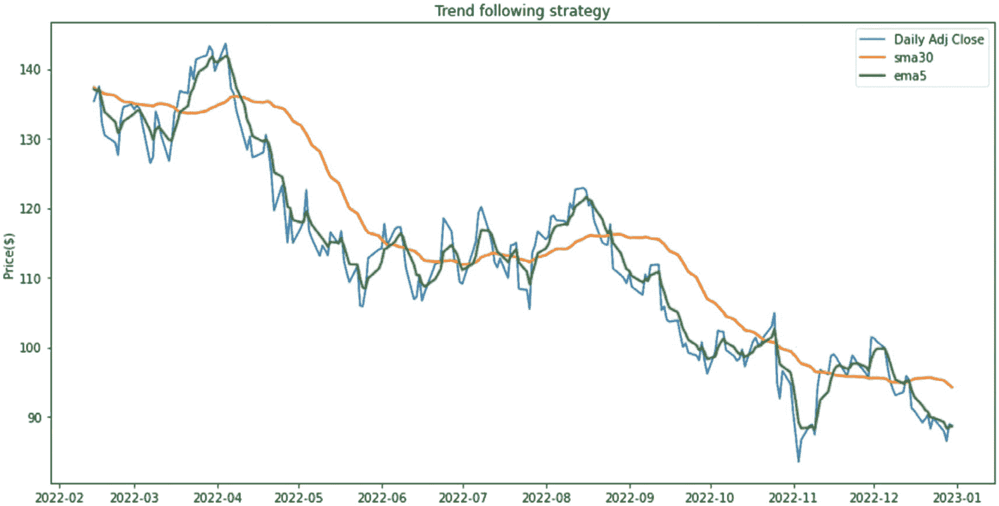

一张价格与日期的三线图展示了趋势跟踪策略。它呈现了每日平均收盘价、`sma30`和`ema5`随时间的变化。每日平均收盘价和`ema5`的曲线波动更大。

**图 7-11** 将移动平均线与原始时间序列一起可视化

如图 7-11 所示，短期移动平均线（绿色曲线）更紧密地跟踪原始时间序列，而长期移动平均线（橙色曲线）由于更强的平均效应，表现出更平滑的形态。

现在，让我们计算买入并持有策略的对数收益，该策略假设买入一股谷歌股票并持有至投资期结束。如代码清单 7-8 所示。

```
df_goog['log_return_buy_n_hold'] = np.log(df_goog['Adj Close'] / df_goog['Adj Close'].shift(1))
```
代码清单 7-8
计算买入并持有策略的对数收益

另一种计算对数收益的等效方法是将价格转换为对数形式，然后取差值，如代码清单 7-9 所示。

```
df_goog['log_return_buy_n_hold'] = np.log(df_goog['Adj Close']).diff()
```
代码清单 7-9
计算对数收益的另一种等效方法

接下来，我们识别趋势跟踪策略的交易信号，首先创建一个信号列，根据两条移动平均线的大小关系指示预期仓位。如代码清单 7-10 所示。

```
#### 识别买入信号
df_goog['signal'] = np.where(df_goog[short_ma] > df_goog[long_ma], 1, 0)
#### 识别卖出信号
df_goog['signal'] = np.where(df_goog[short_ma] < df_goog[long_ma], -1, df_goog['signal'])
>>> df_goog.head()
Adj Close  sma30      ema5        log_return_buy_n_hold  signal
Date
2022-02-15 136.425507 137.047450 136.851559  0.008284              -1
2022-02-16 137.487503 136.816483 137.063541  0.007754               1
2022-02-17 132.308502 136.638317 135.478525 -0.038397              -1
2022-02-18 130.467499 136.402200 133.808181 -0.014012              -1
2022-02-22 129.402496 136.148800 132.339619 -0.008196              -1
```
代码清单 7-10
创建信号列

趋势跟踪策略的周期对数收益可以通过将 `signal` 与 `log_return_buy_n_hold` 相乘得到，如代码清单 7-11 所示。

```
df_goog['log_return_trend_follow'] = df_goog['signal'] * df_goog['log_return_buy_n_hold']
```
代码清单 7-11
计算趋势跟踪策略的周期对数收益

终端收益可以使用 `cumprod()` 函数或 `prod()` 函数计算，如代码清单 7-12 所示。第一种方法计算复利周期收益，并访问最后一个周期作为最终收益，然后再转换为简单收益格式。第二种方法直接将所有中间百分比收益相乘，得到最后一个周期的最终收益，然后转换为简单收益。

```
#### 买入并持有的终端收益
>>> np.exp(df_goog['log_return_buy_n_hold']).cumprod()[-1] -1
-0.34419806832531474
#### 另一种计算方法
>>> np.exp(df_goog['log_return_buy_n_hold']).prod() - 1
-0.34419806832531474
#### 趋势跟踪的终端收益
>>> np.exp(df_goog['log_return_trend_follow']).cumprod()[-1] -1
0.3609149965748346
#### 另一种计算方法
np.exp(df_goog['log_return_trend_follow']).prod() - 1
0.3609149965748346
```
代码清单 7-12
计算两种策略的终端收益

尽管买入并持有策略显然无法与趋势跟踪策略匹敌，但我们仍将计算前述的回测指标，即年化收益率、年化波动率、夏普比率和最大回撤。

让我们从年化收益率开始。如代码清单 7-13 所示，年化收益率通过先获取 `1 + R` 格式的终端收益，将其重新缩放到年度基准，最后再转换回简单收益来计算。

```
#### 计算买入并持有的年化收益率
annualized_return_buy_n_hold = np.exp(df_goog['log_return_buy_n_hold']).prod()**(252/df_goog.shape[0])-1
>>> annualized_return_buy_n_hold
-0.3818823804560594
#### 计算趋势跟踪的年化收益率
annualized_return_trend_follow = np.exp(df_goog['log_return_trend_follow']).prod()**(252/df_goog.shape[0])-1
>>> annualized_return_trend_follow
0.4210313983829783
```
代码清单 7-13
计算年化收益率

请注意，我们也可以通过将所有对数收益相加并对总和取指数来得到相同的结果：

```
>>> np.exp(df_goog['log_return_trend_follow'].sum())**(252/df_goog.shape[0])-1
0.4210313983829783
```

让我们计算年化波动率，如代码清单 7-14 所示。回顾一下，日波动率按时间的平方根函数进行缩放。

#### 计算年化波动率

```
annualized_vol_buy_n_hold = (np.exp(df_goog['log_return_buy_n_hold'])-1).std()*(252**0.5)
>>> annualized_vol_buy_n_hold
0.3896836224899977
annualized_vol_trend_follow = (np.exp(df_goog['log_return_trend_follow'])-1).std()*(252**0.5)
>>> annualized_vol_trend_follow
0.39285546408734645
```
代码清单 7-14
计算年化波动率

现在，我们假设无风险利率为 3%，计算夏普比率。如代码清单 7-15 所示。

```
riskfree_rate = 0.03
#### calculate Sharpe ratio of buy-n-hold
sharpe_ratio_buy_n_hold = (annualized_return_buy_n_hold - riskfree_rate) / annualized_vol_buy_n_hold
>>> sharpe_ratio_buy_n_hold
-1.0569661045137495
#### calculate Sharpe ratio of trend following
sharpe_ratio_trend_follow = (annualized_return_trend_follow - riskfree_rate) / annualized_vol_trend_follow
>>> sharpe_ratio_trend_follow
0.9953569038205886
```
代码清单 7-15
计算夏普比率

最后，我们计算两种策略的最大回撤，如代码清单 7-16 所示。

```
#### max drawdown of buy-n-hold
max_drawdown_buy_n_hold = drawdown(np.exp(df_goog['log_return_buy_n_hold'])-1)['Drawdown'].min()
>>> max_drawdown_buy_n_hold
-0.41876535983781205
#### max drawdown of trend following
max_drawdown_trend_follow = drawdown(np.exp(df_goog['log_return_trend_follow'])-1)['Drawdown'].min()
>>> max_drawdown_trend_follow
-0.20685357874978227
```
代码清单 7-16
计算最大回撤

尽管这两种策略在回测中的这些指标差异很大，但这也表明了在采用某一策略之前，在一组常见的回测指标中证明其优越性的重要性。在下一章中，我们将讨论一个反馈循环，用于优化交易参数（例如窗口大小）的选择，以便在特定交易策略下获得最佳的交易表现。

## 小结

在本章中，我们介绍了回测交易策略的过程。我们首先介绍了回测的概念及其注意事项。然后，我们介绍了最大回撤，这是一种常用的衡量特定交易策略下行风险的绩效指标，并给出了其计算过程。最后，我们提供了一个通过多种绩效指标来回测趋势跟踪策略的示例。

在下一章中，我们将介绍基于假设检验的统计套利，并以配对交易策略作为示例。

## 练习题

*   资产 A 在 12 个月内每月亏损 1%，资产 B 在 12 个月内每月盈利 1%。哪种资产波动性更大？

*   回撤是仅衡量下行风险而非上行风险的指标。正确还是错误？

*   假设无风险利率永远不会为负。每月回报等于无风险利率的投资，其回撤为零。正确还是错误？

*   根据日收益率序列计算出的回撤总是大于或等于根据相应的月收益率序列计算出的回撤。正确还是错误？

*   编写一个类，用于计算动量交易策略的年化收益率、波动率、夏普比率和最大回撤。

*   数据采样频率如何影响计算出的最大回撤？使用日数据与使用月数据可能有什么影响？

*   假设你计算出的交易策略夏普比率为 1.5。如果无风险利率上升，在其他条件不变的情况下，夏普比率会发生什么变化？

*   如果一个策略有正的平均收益率，但最大回撤很高，这可能表明该策略的风险如何？